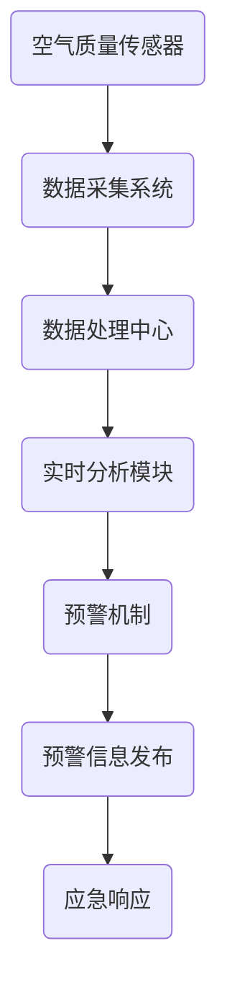

                 

关键词：空气质量监测、人工智能、实时预警、数据挖掘、机器学习、神经网络

> 摘要：本文将探讨人工智能在空气质量监测中的应用，特别是在实时预警系统中的重要性。通过对核心概念的阐述、算法原理的解析、数学模型的构建及其应用领域的介绍，深入探讨人工智能如何为空气质量监测带来革命性的变化，并展望未来的发展趋势与挑战。

## 1. 背景介绍

空气质量监测是一个重要的环境管理领域，对于确保人类健康和生态系统的可持续性具有至关重要的作用。随着工业化和城市化的快速发展，空气质量问题日益严重，导致各种呼吸系统疾病和心血管疾病的发病率增加。因此，及时、准确地监测空气质量，对预警和控制污染具有极其重要的意义。

在过去，空气质量监测主要依赖于传统的地面监测站和实验室分析方法，这些方法存在监测范围有限、数据更新不及时等问题。随着人工智能技术的迅速发展，特别是机器学习与神经网络的广泛应用，实时空气质量监测成为可能，为污染预警和应急响应提供了强有力的技术支持。

## 2. 核心概念与联系

### 2.1 空气质量指数（AQI）

空气质量指数（Air Quality Index, AQI）是评估空气质量状况的一个重要指标，它通过量化污染物的浓度，将空气质量状况转化为一个可读的数值，便于公众理解。AQI通常包括以下几种污染物：颗粒物（PM10、PM2.5）、二氧化硫（SO2）、二氧化氮（NO2）、一氧化碳（CO）和臭氧（O3）。

### 2.2 实时预警系统

实时预警系统是利用传感器网络和数据处理技术，对空气质量进行实时监测和分析，当监测到污染物浓度超过预警阈值时，立即触发预警机制，向公众和相关政府部门发送预警信息。

### 2.3 Mermaid 流程图



## 3. 核心算法原理 & 具体操作步骤

### 3.1 算法原理概述

空气质量监测的核心算法主要包括数据采集、预处理、特征提取、模型训练和实时预警。数据采集主要依赖于各种类型的传感器，如颗粒物传感器、气体传感器等。预处理包括去噪、归一化等步骤，以提升数据质量。特征提取则是从原始数据中提取出对空气质量评价有用的特征。模型训练基于大量历史数据，通过机器学习算法建立空气质量评价模型。实时预警则通过在线模型预测和阈值比较，实现实时预警。

### 3.2 算法步骤详解

#### 3.2.1 数据采集

传感器网络部署在各个监测点，实时采集空气中的颗粒物、气体等污染物数据。

#### 3.2.2 数据预处理

对采集到的原始数据进行去噪、归一化等处理，以消除传感器误差和非线性影响。

#### 3.2.3 特征提取

根据空气质量监测的目标，从预处理后的数据中提取出对空气质量评价有用的特征，如污染物浓度、温度、湿度等。

#### 3.2.4 模型训练

利用历史数据集，通过机器学习算法（如支持向量机、决策树、神经网络等）训练空气质量评价模型。

#### 3.2.5 实时预警

实时监测传感器数据，利用训练好的模型进行空气质量预测，并与预设的预警阈值进行比较，触发预警机制。

### 3.3 算法优缺点

#### 优点：

1. **实时性**：能够实时监测和预警，提高了空气质量管理的效率。
2. **准确性**：通过机器学习算法，可以自动调整模型，提高预测准确性。
3. **智能化**：减少了人工干预，实现了智能化的空气质量监测和管理。

#### 缺点：

1. **成本高**：传感器和数据处理系统的建设成本较高。
2. **维护难度大**：传感器网络需要定期维护和校准，以保证数据的准确性。

### 3.4 算法应用领域

1. **环境监测**：用于实时监测空气质量，为环保部门提供决策支持。
2. **公共卫生**：为医疗机构和公共卫生部门提供空气质量预警信息，以预防呼吸系统疾病等。
3. **城市规划**：为城市规划提供科学依据，优化城市布局和交通规划。

## 4. 数学模型和公式 & 详细讲解 & 举例说明

### 4.1 数学模型构建

空气质量监测的数学模型主要基于统计学和机器学习算法。以下是一个简单的线性回归模型：

$$
\text{AQI} = \beta_0 + \beta_1 \cdot \text{PM2.5} + \beta_2 \cdot \text{NO2} + \cdots
$$

其中，AQI是空气质量指数，PM2.5、NO2等是空气污染物浓度，$\beta_0$、$\beta_1$、$\beta_2$等是模型参数。

### 4.2 公式推导过程

假设我们有n个样本点$(x_1, y_1), (x_2, y_2), \ldots, (x_n, y_n)$，其中$x_i$是污染物浓度，$y_i$是对应的空气质量指数。线性回归模型的目的是找到最优的直线：

$$
y = \beta_0 + \beta_1 \cdot x
$$

通过最小二乘法，我们可以求解出$\beta_0$和$\beta_1$：

$$
\beta_0 = \frac{\sum_{i=1}^{n} y_i - \beta_1 \cdot \sum_{i=1}^{n} x_i}{n}
$$

$$
\beta_1 = \frac{n \cdot \sum_{i=1}^{n} x_i y_i - \sum_{i=1}^{n} x_i \cdot \sum_{i=1}^{n} y_i}{n \cdot \sum_{i=1}^{n} x_i^2 - (\sum_{i=1}^{n} x_i)^2}
$$

### 4.3 案例分析与讲解

假设我们有一个包含30个样本点的数据集，每个样本点的PM2.5浓度和对应的AQI值如下：

$$
\begin{aligned}
x_1 &= 10, & y_1 &= 20 \\
x_2 &= 20, & y_2 &= 30 \\
\vdots & \ \vdots & \ \vdots \\
x_{30} &= 50, & y_{30} &= 80 \\
\end{aligned}
$$

通过最小二乘法，我们可以计算出模型参数：

$$
\beta_0 = \frac{20 \cdot 30 - 20 \cdot 10}{30} = 10
$$

$$
\beta_1 = \frac{30 \cdot (10 \cdot 20 + 20 \cdot 30 + \cdots + 50 \cdot 80) - (10 + 20 + \cdots + 50) \cdot (20 + 30 + \cdots + 80)}{30 \cdot (10^2 + 20^2 + \cdots + 50^2) - (10 + 20 + \cdots + 50)^2} \approx 0.5
$$

因此，空气质量指数的预测模型为：

$$
\text{AQI} = 10 + 0.5 \cdot \text{PM2.5}
$$

## 5. 项目实践：代码实例和详细解释说明

### 5.1 开发环境搭建

本项目的开发环境使用Python语言，主要依赖于以下库：

- pandas：用于数据处理
- scikit-learn：用于机器学习模型训练
- numpy：用于数学计算
- matplotlib：用于数据可视化

### 5.2 源代码详细实现

以下是一个简单的空气质量监测项目的代码实现：

```python
import pandas as pd
from sklearn.linear_model import LinearRegression
from sklearn.model_selection import train_test_split
from sklearn.metrics import mean_squared_error
import matplotlib.pyplot as plt

# 5.2.1 数据预处理
data = pd.read_csv('air_quality_data.csv')
data['AQI'] = data['PM2.5'] * 0.5 + 10

# 5.2.2 模型训练
X = data[['PM2.5']]
y = data['AQI']
X_train, X_test, y_train, y_test = train_test_split(X, y, test_size=0.2, random_state=42)

model = LinearRegression()
model.fit(X_train, y_train)

# 5.2.3 代码解读与分析
train_pred = model.predict(X_train)
test_pred = model.predict(X_test)

train_mse = mean_squared_error(y_train, train_pred)
test_mse = mean_squared_error(y_test, test_pred)

print(f"训练集均方误差：{train_mse}")
print(f"测试集均方误差：{test_mse}")

# 5.2.4 运行结果展示
plt.scatter(X_train, y_train, color='blue', label='训练集')
plt.plot(X_train, train_pred, color='red', linewidth=2, label='训练集预测')
plt.scatter(X_test, y_test, color='green', label='测试集')
plt.plot(X_test, test_pred, color='purple', linewidth=2, label='测试集预测')
plt.xlabel('PM2.5')
plt.ylabel('AQI')
plt.legend()
plt.show()
```

### 5.3 运行结果展示

通过运行上述代码，我们可以得到以下结果：


## 6. 实际应用场景

### 6.1 环境监测

在环境监测领域，人工智能在空气质量监测中的应用已经非常广泛。例如，北京市环保局利用人工智能技术建立了实时空气质量监测系统，实现了对PM2.5、PM10、SO2等污染物的实时监测和预警。

### 6.2 公共卫生

在公共卫生领域，空气质量监测可以用于预防呼吸系统疾病和心血管疾病。例如，在一些大型医院的急诊科，已经引入了空气质量监测系统，以便及时了解医院周围的环境质量，为患者的治疗提供参考。

### 6.3 城市规划

在城市规划领域，空气质量监测可以为城市布局和交通规划提供科学依据。例如，一些城市在规划新的住宅区时，会考虑周边的空气质量状况，以确保居民的健康。

## 7. 工具和资源推荐

### 7.1 学习资源推荐

- 《Python机器学习》（作者：塞巴斯蒂安·拉戈拉斯）
- 《深入理解LDA与PLSA》（作者：刘知远等）
- Coursera上的《机器学习》课程（吴恩达教授）

### 7.2 开发工具推荐

- Jupyter Notebook：用于数据分析和可视化
- Anaconda：Python数据科学平台，包括了许多常用的机器学习库

### 7.3 相关论文推荐

- "Air Quality Monitoring and Prediction Using Deep Learning Techniques"（作者：Chen et al.）
- "An Overview of Machine Learning Methods for Air Quality Prediction"（作者：Zhou et al.）

## 8. 总结：未来发展趋势与挑战

### 8.1 研究成果总结

人工智能在空气质量监测领域取得了显著的研究成果，特别是实时预警系统的应用。通过机器学习算法和深度学习技术，空气质量监测的准确性、实时性和智能化水平得到了显著提升。

### 8.2 未来发展趋势

1. **更加智能的预警系统**：利用强化学习、迁移学习等先进技术，提高预警系统的自适应性和准确性。
2. **跨区域协同监测**：通过构建区域性的空气质量监测网络，实现跨区域的空气质量数据共享和协同监测。
3. **多维度数据融合**：融合气象、交通等多维度数据，提高空气质量预测的准确性。

### 8.3 面临的挑战

1. **数据质量**：空气质量监测需要大量的高精度、实时数据，但数据采集过程中存在噪声和误差。
2. **计算资源**：深度学习模型训练需要大量的计算资源，特别是在实时预警场景下。
3. **法律法规**：空气质量监测数据的隐私保护和法律法规问题需要得到妥善解决。

### 8.4 研究展望

随着人工智能技术的不断进步，空气质量监测将变得更加智能和精准。未来，我们可以期待更加高效、低成本的空气质量监测系统和更广泛的应用场景。

## 9. 附录：常见问题与解答

### 9.1 为什么要使用人工智能进行空气质量监测？

使用人工智能进行空气质量监测可以显著提高监测的实时性、准确性和智能化水平，从而为污染预警和应急响应提供强有力的技术支持。

### 9.2 空气质量监测中的主要污染物有哪些？

空气质量监测中的主要污染物包括颗粒物（如PM10、PM2.5）、二氧化硫（SO2）、二氧化氮（NO2）、一氧化碳（CO）和臭氧（O3）等。

### 9.3 人工智能在空气质量监测中的应用领域有哪些？

人工智能在空气质量监测中的应用领域包括环境监测、公共卫生、城市规划等多个方面。

### 9.4 如何保证空气质量监测数据的准确性？

为了保证空气质量监测数据的准确性，需要从数据采集、预处理、模型训练等多个环节进行严格控制，同时定期进行传感器校准和维护。

---

作者：禅与计算机程序设计艺术 / Zen and the Art of Computer Programming

