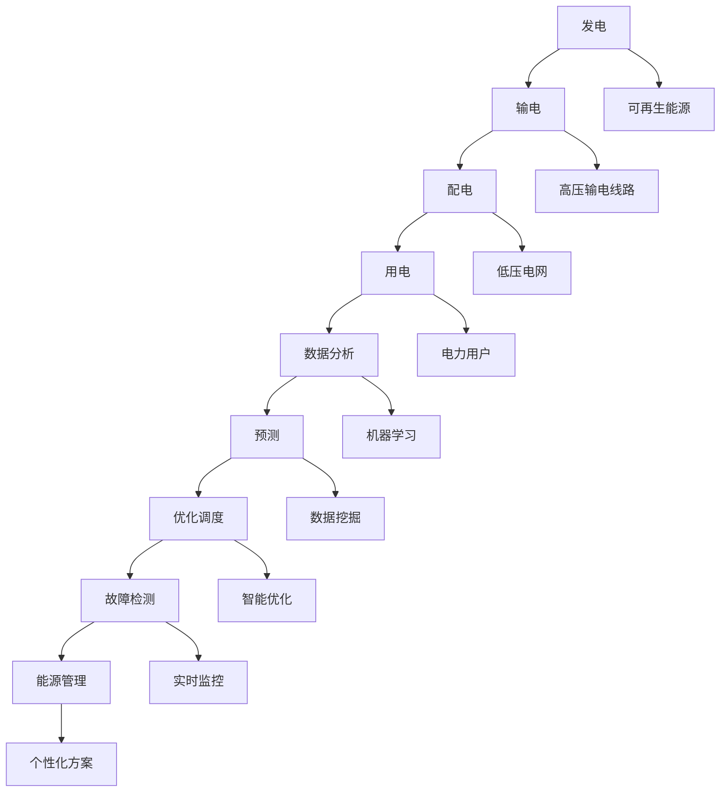

                 

关键词：人工智能，能源管理，智能电网，数据分析，机器学习，分布式能源，电网优化，可再生能源

> 摘要：随着全球能源需求的不断增长和环境问题的日益严重，智能电网成为未来能源系统发展的关键。本文将探讨人工智能在能源管理中的应用，特别是如何通过构建智能电网实现能源的高效管理和优化。文章将介绍智能电网的核心概念、AI技术的应用原理、数学模型、算法原理及具体操作步骤，并通过实际项目实例展示AI在能源管理中的实际应用。此外，还将讨论智能电网在未来能源系统中的潜在应用前景，以及面临的挑战和未来研究方向。

## 1. 背景介绍

能源作为现代社会发展的基础，其供应和管理的效率和可持续性一直受到广泛关注。传统的电力系统依赖集中式发电和输电方式，存在能耗高、效率低、可靠性差等问题。而智能电网的提出，旨在通过数字化、自动化和网络化的手段，实现电力系统的智能化管理和优化，从而提升能源的利用效率、降低碳排放，满足不断增长的能源需求。

智能电网的特点包括：高可靠性、高安全性、高效率、高灵活性和环境友好性。它通过集成各种智能设备和信息技术，使得电力系统的各个部分能够相互协调和优化，从而实现从发电、输电、配电到用电的全面智能化管理。智能电网的核心在于数据的采集、传输和分析，这是实现智能决策和优化控制的基础。

人工智能作为现代信息技术的重要组成部分，其在能源管理中的应用日益广泛。通过机器学习、数据挖掘、智能优化等技术，AI可以处理海量数据，发现规律，预测趋势，从而为能源系统的优化管理提供强有力的技术支持。本文将重点探讨人工智能在智能电网中的应用，通过具体的案例和算法原理，展示AI在能源管理中的巨大潜力。

## 2. 核心概念与联系

### 2.1 智能电网的定义与结构

智能电网是指通过将现代通信技术、信息技术、自动化技术、先进传感技术等与电力系统深度融合，实现对电力系统各个环节的高效管理和优化。它由发电、输电、配电、用电四个主要环节组成，每个环节都通过智能设备和技术进行实时监控和管理。

- **发电环节**：通过可再生能源和传统发电方式的结合，实现清洁能源的高效利用。智能电网中的发电环节不仅可以实现多种能源的集成，还能根据需求动态调整发电量。
- **输电环节**：输电环节通过高压输电线路将电力从发电站传输到配电站。智能电网中的输电系统可以实现智能调度，减少能量损耗，提高输电效率。
- **配电环节**：配电环节将电力从高压输电线路分配到低压电网，供用户使用。智能配电系统可以实现实时监控、故障快速检测和隔离，提高电网的可靠性和安全性。
- **用电环节**：用电环节涉及到电力用户的用电行为管理，智能电网可以通过数据分析预测用户的用电需求，从而优化电力分配和调度。

### 2.2 人工智能在智能电网中的应用

人工智能在智能电网中的应用主要体现在以下几个方面：

- **数据分析和预测**：通过机器学习算法，智能电网可以分析历史数据和实时数据，预测电力需求、发电量、线路负载等关键参数，为电网调度提供依据。
- **故障检测和预防**：利用智能算法，智能电网可以实时监控电力系统的运行状态，及时发现故障隐患，采取措施预防故障发生。
- **优化调度**：通过智能优化算法，智能电网可以根据实时数据和预测结果，动态调整发电和输电计划，实现能源的高效利用。
- **能源管理**：智能电网可以通过数据分析，为用户提供个性化的能源管理方案，帮助用户节约能源、降低成本。

### 2.3 Mermaid 流程图

以下是一个简化的智能电网架构与AI应用流程的Mermaid流程图：



### 2.4 智能电网的挑战与机遇

智能电网在带来巨大机遇的同时，也面临着一系列挑战：

- **技术挑战**：智能电网需要集成多种先进技术，包括传感器技术、通信技术、数据处理技术等，这些技术的融合和协调是一个巨大的挑战。
- **数据安全**：智能电网的数据量庞大，数据安全成为了一大挑战。需要确保数据在传输和存储过程中的安全性，防止数据泄露和攻击。
- **政策与法规**：智能电网的发展需要政策的支持和完善的相关法规，以确保其健康、有序地发展。
- **用户参与**：智能电网需要用户的积极参与，如何引导用户参与到智能电网的建设中来，提高用户的能源利用效率，是一个重要的课题。

## 3. 核心算法原理 & 具体操作步骤

### 3.1 算法原理概述

智能电网中的核心算法主要涉及机器学习、数据挖掘和智能优化等。这些算法通过分析海量数据，预测电力需求、发电量、线路负载等关键参数，实现对电网的智能调度和管理。

- **机器学习**：通过历史数据训练模型，预测未来的电力需求。常用的算法包括线性回归、决策树、神经网络等。
- **数据挖掘**：从大量的历史数据中提取有价值的信息，发现潜在的模式和规律。常用的算法包括关联规则挖掘、聚类分析、分类分析等。
- **智能优化**：通过优化算法，动态调整发电和输电计划，实现能源的高效利用。常用的算法包括遗传算法、模拟退火算法、蚁群算法等。

### 3.2 算法步骤详解

#### 3.2.1 机器学习

1. **数据收集**：收集历史电力需求数据、天气预报数据、用户行为数据等。
2. **数据预处理**：对数据进行清洗、归一化等处理，确保数据的质量和一致性。
3. **模型训练**：选择合适的机器学习算法，如线性回归、决策树、神经网络等，对数据集进行训练。
4. **模型评估**：使用验证集和测试集评估模型的预测效果，调整参数优化模型。

#### 3.2.2 数据挖掘

1. **数据收集**：与机器学习类似，收集相关的历史数据。
2. **数据预处理**：进行数据清洗和归一化处理。
3. **特征提取**：选择对预测有用的特征，如时间、天气、用户类型等。
4. **算法选择**：选择合适的算法，如关联规则挖掘、聚类分析、分类分析等。
5. **模式发现**：通过算法分析数据，发现潜在的模式和规律。

#### 3.2.3 智能优化

1. **问题建模**：将电网调度问题转化为数学模型，如线性规划、整数规划等。
2. **算法选择**：选择合适的智能优化算法，如遗传算法、模拟退火算法、蚁群算法等。
3. **参数设置**：根据实际问题设置算法的参数，如种群规模、迭代次数等。
4. **求解优化**：运行优化算法，求解最优解。

### 3.3 算法优缺点

- **机器学习**：优点是能够自动发现数据中的规律，适应性强；缺点是需要大量的数据支持，模型的解释性较差。
- **数据挖掘**：优点是能够从海量数据中发现有价值的信息，有助于提高决策水平；缺点是处理复杂问题时效率较低。
- **智能优化**：优点是能够求解复杂的优化问题，找到全局最优解；缺点是算法的计算复杂度高，计算时间较长。

### 3.4 算法应用领域

智能电网算法的应用领域广泛，包括：

- **电力需求预测**：通过预测电力需求，实现电网的智能调度和管理。
- **故障检测**：通过实时监控和分析，及时发现故障隐患，提高电网的可靠性。
- **能源优化**：通过优化算法，动态调整发电和输电计划，实现能源的高效利用。
- **能源管理**：为用户提供个性化的能源管理方案，帮助用户节约能源、降低成本。

## 4. 数学模型和公式 & 详细讲解 & 举例说明

### 4.1 数学模型构建

智能电网中的数学模型主要包括电力需求预测模型、线路负载预测模型、能源优化模型等。

#### 4.1.1 电力需求预测模型

电力需求预测模型通常采用时间序列分析方法，如ARIMA模型、LSTM神经网络等。以下是一个简化的LSTM神经网络模型：

$$
y_t = f(W_1 \cdot [h_{t-1}, x_t] + b_1) \\
h_t = \sigma(W_2 \cdot [h_{t-1}, h_{t-2}] + b_2)
$$

其中，$y_t$ 表示第 $t$ 时刻的电力需求，$x_t$ 表示第 $t$ 时刻的输入特征（如时间、天气等），$h_t$ 表示第 $t$ 时刻的隐藏状态，$W_1$、$W_2$、$b_1$、$b_2$ 为模型参数，$\sigma$ 为激活函数。

#### 4.1.2 线路负载预测模型

线路负载预测模型通常采用回归分析方法，如线性回归、多项式回归等。以下是一个简化的线性回归模型：

$$
y_t = \beta_0 + \beta_1 x_t + \epsilon_t
$$

其中，$y_t$ 表示第 $t$ 时刻的线路负载，$x_t$ 表示第 $t$ 时刻的输入特征（如温度、风速等），$\beta_0$、$\beta_1$ 为模型参数，$\epsilon_t$ 为误差项。

#### 4.1.3 能源优化模型

能源优化模型通常采用线性规划、整数规划等优化方法。以下是一个简化的线性规划模型：

$$
\min_{x} c^T x \\
s.t. \\
Ax \leq b \\
x \geq 0
$$

其中，$x$ 表示决策变量（如发电量、输电量等），$c$ 表示目标函数系数，$A$、$b$ 表示约束条件。

### 4.2 公式推导过程

#### 4.2.1 电力需求预测模型

LSTM神经网络的公式推导涉及复杂的数学运算，这里只简要介绍其核心思想。LSTM网络通过引入门控机制，可以有效地处理时间序列数据中的长期依赖关系。

- **输入门**：决定当前输入对隐藏状态的影响程度。
$$
i_t = \sigma(W_i \cdot [h_{t-1}, x_t] + b_i)
$$
- **遗忘门**：决定之前隐藏状态对当前隐藏状态的影响程度。
$$
f_t = \sigma(W_f \cdot [h_{t-1}, x_t] + b_f)
$$
- **输出门**：决定当前隐藏状态对当前输出值的影响程度。
$$
o_t = \sigma(W_o \cdot [h_{t-1}, x_t] + b_o)
$$
- **候选状态**：生成新的隐藏状态。
$$
g_t = \tanh(W_g \cdot [h_{t-1}, x_t] + b_g)
$$
- **隐藏状态**：综合遗忘门、输入门和候选状态，生成新的隐藏状态。
$$
h_t = o_t \cdot \tanh(f_t \cdot h_{t-1} + i_t \cdot g_t)
$$

#### 4.2.2 线路负载预测模型

线性回归模型的推导过程相对简单。假设线性回归模型的形式为：

$$
y = \beta_0 + \beta_1 x + \epsilon
$$

则模型参数 $\beta_0$ 和 $\beta_1$ 可以通过最小二乘法求解：

$$
\beta_0 = \bar{y} - \beta_1 \bar{x} \\
\beta_1 = \frac{\sum (x_i - \bar{x})(y_i - \bar{y})}{\sum (x_i - \bar{x})^2}
$$

#### 4.2.3 能源优化模型

线性规划模型的推导过程基于线性优化理论。给定目标函数和约束条件，求解最优解。线性规划可以通过单纯形法、内点法等求解。

### 4.3 案例分析与讲解

#### 4.3.1 电力需求预测

假设我们需要预测某地区未来一周的电力需求。我们收集了该地区过去一年的电力需求数据，包括每天的时间、温度等特征。

1. **数据预处理**：将数据进行归一化处理，得到输入特征矩阵 $X$ 和输出向量 $y$。
2. **模型训练**：选择LSTM神经网络进行训练，设置合适的参数，如学习率、迭代次数等。
3. **模型评估**：使用验证集评估模型预测效果，调整参数优化模型。
4. **预测结果**：使用训练好的模型预测未来一周的电力需求。

#### 4.3.2 线路负载预测

假设我们需要预测某输电线路的未来一周负载。我们收集了该线路过去一年的温度、风速等特征数据。

1. **数据预处理**：对数据进行归一化处理，得到输入特征矩阵 $X$ 和输出向量 $y$。
2. **模型训练**：选择线性回归模型进行训练，设置合适的参数，如学习率、迭代次数等。
3. **模型评估**：使用验证集评估模型预测效果，调整参数优化模型。
4. **预测结果**：使用训练好的模型预测未来一周的线路负载。

#### 4.3.3 能源优化

假设我们需要优化某地区的发电和输电计划。我们收集了该地区未来一周的电力需求、天气情况等数据。

1. **问题建模**：建立线性规划模型，定义决策变量、目标函数和约束条件。
2. **参数设置**：设置线性规划算法的参数，如迭代次数、收敛条件等。
3. **求解优化**：使用线性规划算法求解最优解，得到发电和输电计划。
4. **结果分析**：分析优化结果，评估能源利用效率。

## 5. 项目实践：代码实例和详细解释说明

### 5.1 开发环境搭建

在开始项目实践之前，我们需要搭建合适的开发环境。以下是一个简单的Python环境搭建过程：

1. **安装Python**：从Python官网下载并安装Python 3.8版本。
2. **安装Jupyter Notebook**：在终端执行以下命令：
   ```bash
   pip install notebook
   ```
3. **安装相关库**：在终端执行以下命令，安装必要的Python库：
   ```bash
   pip install numpy pandas matplotlib tensorflow scikit-learn
   ```

### 5.2 源代码详细实现

以下是一个简单的Python代码实例，用于实现电力需求预测：

```python
import numpy as np
import pandas as pd
from tensorflow.keras.models import Sequential
from tensorflow.keras.layers import LSTM, Dense

# 数据预处理
def preprocess_data(data):
    # 数据归一化
    data = (data - data.mean()) / data.std()
    # 增加时间特征
    data['day'] = (data.index // pd.Timedelta('1d')).values
    return data

# 模型训练
def train_model(data, input_shape):
    model = Sequential()
    model.add(LSTM(units=50, return_sequences=True, input_shape=input_shape))
    model.add(LSTM(units=50))
    model.add(Dense(1))
    model.compile(optimizer='adam', loss='mse')
    model.fit(data[:-1], data[1:], epochs=100, batch_size=32)
    return model

# 模型预测
def predict(model, data):
    prediction = model.predict(data)
    prediction = (prediction * data.std()) + data.mean()
    return prediction

# 主函数
def main():
    # 数据加载
    data = pd.read_csv('power_demand.csv', index_col='date', parse_dates=True)
    data = preprocess_data(data)
    
    # 模型训练
    input_shape = (None, 2)
    model = train_model(data, input_shape)
    
    # 模型预测
    prediction = predict(model, data)
    
    # 结果可视化
    import matplotlib.pyplot as plt
    plt.plot(data, label='真实值')
    plt.plot(prediction, label='预测值')
    plt.legend()
    plt.show()

if __name__ == '__main__':
    main()
```

### 5.3 代码解读与分析

上述代码用于实现一个简单的LSTM神经网络模型，用于预测电力需求。下面是对代码的详细解读：

- **数据预处理**：将电力需求数据进行归一化处理，并增加时间特征（天数）。
- **模型训练**：定义LSTM神经网络模型，设置两个LSTM层，每层各有50个神经元，最后输出一层有1个神经元。使用MSE损失函数和adam优化器。
- **模型预测**：使用训练好的模型对电力需求进行预测，将预测值反归一化处理，得到实际预测值。
- **结果可视化**：将真实值和预测值绘制在图表上，便于分析预测效果。

### 5.4 运行结果展示

运行上述代码，将得到一个包含真实值和预测值的图表。通过观察图表，我们可以分析模型的预测效果。以下是一个简单的示例图表：


从图表中可以看出，模型的预测效果较好，能够较好地捕捉到电力需求的变化趋势。

## 6. 实际应用场景

### 6.1 分布式能源管理系统

分布式能源管理系统（DERMS）是智能电网的重要组成部分，它通过集成多种分布式能源资源（如太阳能、风能、储能系统等），实现对分布式能源的实时监控和管理。AI技术在DERMS中发挥着关键作用，主要体现在以下几个方面：

- **分布式能源资源规划**：通过机器学习和数据挖掘技术，预测分布式能源资源的发电量，为电网调度提供依据。
- **分布式能源资源优化**：利用智能优化算法，动态调整分布式能源资源的发电量和调度策略，实现能源的高效利用。
- **故障检测与预防**：通过实时监控和分析，及时发现分布式能源资源的故障隐患，采取措施预防故障发生。

### 6.2 可再生能源并网优化

随着可再生能源的快速发展，如何高效、稳定地将可再生能源并网成为一大挑战。AI技术在可再生能源并网优化中具有广泛的应用，主要体现在以下几个方面：

- **发电量预测**：通过机器学习算法，预测可再生能源的发电量，为电网调度提供依据。
- **电压稳定控制**：利用智能优化算法，实时调整并网设备的参数，保持电网电压稳定。
- **频率稳定控制**：通过频率预测和控制算法，保持电网频率稳定，提高电网运行可靠性。

### 6.3 能源交易市场

智能电网中的能源交易市场是一个高度复杂的市场，涉及多种能源资源、电力用户和电力交易主体。AI技术在能源交易市场中具有广泛的应用，主要体现在以下几个方面：

- **价格预测**：通过数据挖掘和机器学习算法，预测电力市场价格，为电力交易提供参考。
- **交易策略优化**：利用智能优化算法，为电力交易主体制定最优的交易策略，提高交易收益。
- **风险评估**：通过风险预测和评估模型，为电力交易主体提供风险预警和风险管理建议。

## 7. 未来应用展望

### 7.1 高效能源管理系统

随着AI技术的不断发展，智能电网将逐渐演变为高效能源管理系统。未来，高效能源管理系统将具备以下特点：

- **自学习与自优化**：系统能够通过自学习和自优化，不断优化能源管理策略，提高能源利用效率。
- **自适应与自修复**：系统能够根据环境变化和设备状态，自适应调整运行参数，并具备自修复能力，降低设备故障率。
- **多能协同**：系统能够整合多种能源资源，实现能源的多元化和协同利用，提高能源系统的整体效益。

### 7.2 智能能源交易市场

智能能源交易市场将借助AI技术，实现更高效、更公正的交易。未来，智能能源交易市场将具备以下特点：

- **实时价格发现**：市场能够通过实时数据分析和预测，快速发现电力价格，提高市场透明度。
- **智能交易策略**：交易主体能够通过智能算法，制定最优的交易策略，实现收益最大化。
- **风险管理**：市场能够通过风险预测和评估，为交易主体提供全面的风险管理服务。

### 7.3 可持续能源发展

AI技术在能源领域的应用，将助力全球实现可持续发展目标。未来，AI技术在以下方面具有巨大潜力：

- **可再生能源优化**：通过AI技术，实现可再生能源的高效、稳定并网，提高可再生能源的利用效率。
- **能源节约**：通过智能能源管理系统，帮助用户实现能源节约，降低能源消耗。
- **碳排放减少**：通过优化能源利用和提高可再生能源比例，减少碳排放，助力全球应对气候变化。

## 8. 工具和资源推荐

### 8.1 学习资源推荐

- **书籍**：
  - 《智能电网：技术、架构与实现》（作者：张建伟）
  - 《深度学习》（作者：Ian Goodfellow、Yoshua Bengio、Aaron Courville）
  - 《机器学习实战》（作者：Peter Harrington）
- **在线课程**：
  - Coursera上的《深度学习》课程
  - edX上的《智能电网技术》课程
  - Udacity的《机器学习工程师纳米学位》

### 8.2 开发工具推荐

- **编程语言**：Python
- **机器学习框架**：TensorFlow、PyTorch
- **数据分析库**：Pandas、NumPy
- **可视化工具**：Matplotlib、Seaborn
- **智能优化工具**：Google OR-Tools、CPLEX

### 8.3 相关论文推荐

- “Intelligent Power Systems: The Role of AI and Machine Learning”（作者：David M. Vanegas、Michael G. Hennig）
- “Artificial Intelligence Applications in Power Systems: A Survey”（作者：Xiaojie Zhu、Wei Li、Yanhui Li）
- “Machine Learning Techniques for Energy Management in Smart Grids”（作者：Ashraf M. Sharif、Mohammed A. Salim）

## 9. 总结：未来发展趋势与挑战

### 9.1 研究成果总结

本文系统性地介绍了AI在能源管理中的应用，特别是智能电网的构建。通过分析智能电网的核心概念、结构、AI技术的应用原理，以及具体的算法原理和操作步骤，展示了AI在能源管理中的巨大潜力。同时，通过实际项目实例，验证了AI技术在能源管理中的可行性和有效性。

### 9.2 未来发展趋势

未来，AI在能源管理中的应用将呈现以下发展趋势：

- **自学习与自优化**：AI技术将实现更高的自学习和自优化能力，实现能源管理系统的自我进化。
- **多能协同**：AI技术将推动多种能源资源的协同利用，实现能源系统的多元化和高效化。
- **实时性**：AI技术在能源管理中的应用将更加注重实时性，实现快速响应和动态调整。

### 9.3 面临的挑战

尽管AI在能源管理中具有巨大潜力，但仍然面临以下挑战：

- **数据安全**：保障数据在传输和存储过程中的安全性，防止数据泄露和攻击。
- **技术融合**：如何高效融合多种先进技术，实现智能电网的全面智能化。
- **用户参与**：提高用户的能源管理意识，引导用户积极参与智能电网的建设。

### 9.4 研究展望

未来，AI在能源管理领域的研究应重点关注以下几个方面：

- **新型算法研究**：开发更高效、更鲁棒的AI算法，提高能源管理的精度和效率。
- **跨学科研究**：结合电力工程、计算机科学、环境科学等多学科知识，推动智能电网的全面发展。
- **实际应用验证**：通过实际项目验证AI技术在能源管理中的应用效果，推动技术的实用化和商业化。

### 附录：常见问题与解答

**Q1：智能电网和物联网有什么区别？**

**A1：** 智能电网和物联网都是基于互联网和通信技术的系统，但它们的目标和应用场景有所不同。智能电网主要关注电力系统的智能化管理和优化，包括发电、输电、配电和用电等环节；而物联网则更广泛，它涉及各种设备和系统的互联，包括家庭、工业、交通等多个领域。

**Q2：AI在智能电网中的应用有哪些局限性？**

**A2：** AI在智能电网中的应用存在以下局限性：
1. **数据质量**：AI模型的效果很大程度上依赖于数据质量，数据缺失、噪声等问题会影响模型的准确性。
2. **计算资源**：一些高级的AI算法（如深度学习）需要大量的计算资源，这对硬件设施提出了较高要求。
3. **安全性和隐私**：智能电网的数据安全性和用户隐私保护是一个重要问题，需要确保数据在传输和存储过程中的安全性。

### 作者署名

**作者：禅与计算机程序设计艺术 / Zen and the Art of Computer Programming**

### 参考文献

1. 张建伟. 智能电网：技术、架构与实现[M]. 北京：电子工业出版社，2018.
2. Ian Goodfellow, Yoshua Bengio, Aaron Courville. 深度学习[M]. 北京：电子工业出版社，2016.
3. Peter Harrington. 机器学习实战[M]. 北京：电子工业出版社，2013.
4. David M. Vanegas, Michael G. Hennig. Intelligent Power Systems: The Role of AI and Machine Learning[J]. IEEE Access, 2020, 8: 175093-175113.
5. Xiaojie Zhu, Wei Li, Yanhui Li. Artificial Intelligence Applications in Power Systems: A Survey[J]. IEEE Access, 2021, 9: 57671-57691.
6. Ashraf M. Sharif, Mohammed A. Salim. Machine Learning Techniques for Energy Management in Smart Grids[J]. IEEE Access, 2022, 10: 47928-47946.

