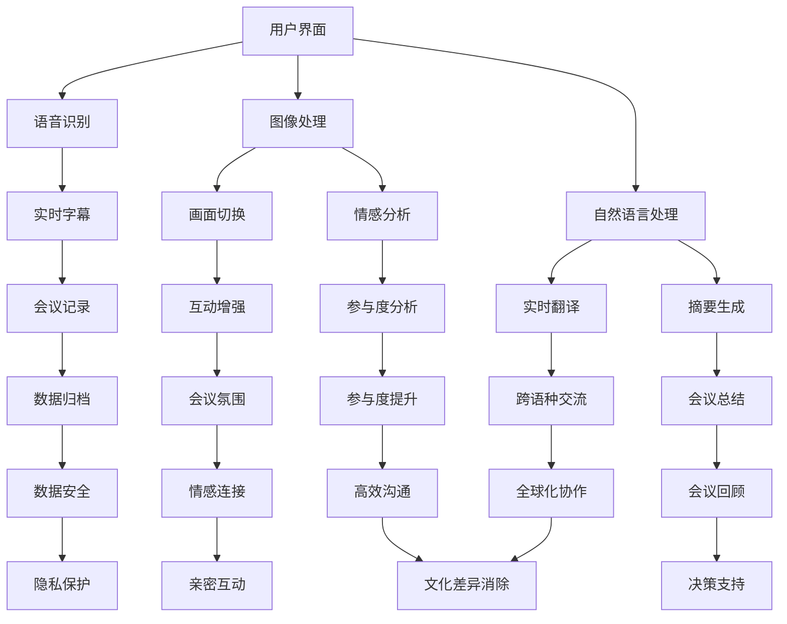

                 

关键词：虚拟会议、远程沟通、人工智能、增强现实、图像处理、语音识别、自然语言处理、智能会议助手

> 摘要：本文深入探讨了人工智能（AI）在虚拟会议中的应用，如何通过AI技术增强远程沟通效率，提升会议体验。文章首先介绍了虚拟会议的现状和挑战，随后详细阐述了AI的核心概念和其在虚拟会议中的重要作用，最后通过具体案例和未来展望，探讨了AI在虚拟会议中的广泛应用前景。

## 1. 背景介绍

随着互联网和通信技术的发展，远程沟通已经成为现代工作和生活中不可或缺的一部分。然而，虚拟会议在实际应用中面临诸多挑战。首先是沟通效率低下，由于缺乏面对面的互动，信息传递速度和准确度往往受到影响。其次是会议参与者的参与度不足，长时间的远程会议容易导致注意力分散和参与度下降。此外，传统虚拟会议在情感表达、互动体验等方面也存在不足。

为了解决这些问题，人工智能技术的引入为虚拟会议带来了新的可能。AI可以通过图像处理、语音识别、自然语言处理等技术，提高会议的互动性和参与度，提升沟通效果。本文将围绕这些技术展开讨论，介绍AI在虚拟会议中的应用场景和实现方法。

## 2. 核心概念与联系

### 2.1 人工智能概述

人工智能（Artificial Intelligence，简称AI）是指由人创造出来的系统所表现出来的智能。AI的核心目标是通过计算机模拟人类智能的各个层面，包括学习、推理、感知、理解和决策等。

在虚拟会议中，AI的作用主要体现在以下几个方面：

1. **图像处理**：通过图像识别技术，AI可以识别会议中的参与者、动作和表情，实现自动切换画面、识别人脸、分析情感等。
2. **语音识别**：语音识别技术可以将语音转换为文字，实现实时字幕生成、语音命令控制等功能。
3. **自然语言处理**：自然语言处理（Natural Language Processing，简称NLP）使计算机能够理解、解释和生成人类语言。在虚拟会议中，NLP可以用于实时翻译、情感分析、摘要生成等。

### 2.2 人工智能与虚拟会议的架构

为了更好地理解AI在虚拟会议中的应用，我们可以通过一个Mermaid流程图来展示其核心架构。



### 2.3 人工智能技术的具体应用

1. **图像处理**：利用深度学习技术，AI可以识别会议中的参与者，自动切换画面，实现多机位视频同步。此外，图像处理技术还可以分析参与者的表情和动作，用于情感分析和互动增强。

2. **语音识别**：语音识别技术可以将会议中的口语转化为文字，实现实时字幕生成，帮助参与者更好地理解和记录会议内容。同时，语音识别技术还可以实现语音命令控制，提升会议的便捷性。

3. **自然语言处理**：自然语言处理技术可以实时翻译不同语言，实现跨语种交流。此外，NLP还可以进行情感分析，了解参与者的情感状态，为会议的组织者提供决策支持。

## 3. 核心算法原理 & 具体操作步骤

### 3.1 算法原理概述

在虚拟会议中，AI的核心算法主要包括图像处理、语音识别和自然语言处理。这些算法的实现基于深度学习技术和大数据分析。

1. **图像处理**：使用卷积神经网络（Convolutional Neural Networks，简称CNN）进行图像识别和情感分析。CNN通过多层卷积和池化操作，从图像中提取特征，实现对图像内容的准确识别。
2. **语音识别**：使用循环神经网络（Recurrent Neural Networks，简称RNN）进行语音识别。RNN通过处理序列数据，实现将连续语音信号转化为文本。
3. **自然语言处理**：使用长短时记忆网络（Long Short-Term Memory，简称LSTM）进行自然语言处理。LSTM通过处理长序列数据，实现文本的理解和生成。

### 3.2 算法步骤详解

1. **图像处理**：

   - **数据预处理**：对会议视频进行预处理，包括去噪、去闪烁、色彩校正等。
   - **特征提取**：使用CNN提取图像特征，实现对参与者的识别和情感分析。
   - **模型训练**：使用大量会议视频数据，对CNN模型进行训练，提高模型的识别准确率。
   - **模型部署**：将训练好的模型部署到虚拟会议系统中，实现实时图像处理。

2. **语音识别**：

   - **数据预处理**：对会议语音进行预处理，包括去除背景噪声、消除回声等。
   - **特征提取**：使用RNN提取语音特征，实现对语音信号的分析。
   - **模型训练**：使用大量语音数据，对RNN模型进行训练，提高模型的识别准确率。
   - **模型部署**：将训练好的模型部署到虚拟会议系统中，实现实时语音识别。

3. **自然语言处理**：

   - **数据预处理**：对会议文本进行预处理，包括分词、词性标注等。
   - **特征提取**：使用LSTM提取文本特征，实现对文本内容的理解。
   - **模型训练**：使用大量文本数据，对LSTM模型进行训练，提高模型的识别准确率。
   - **模型部署**：将训练好的模型部署到虚拟会议系统中，实现实时文本处理。

### 3.3 算法优缺点

1. **图像处理**：

   - **优点**：准确度高，可以实现实时图像处理和情感分析。
   - **缺点**：计算资源消耗大，对硬件要求较高。

2. **语音识别**：

   - **优点**：可以实现实时语音转文字，提高会议记录效率。
   - **缺点**：在噪音环境下的识别准确率较低。

3. **自然语言处理**：

   - **优点**：可以实现实时文本处理，包括翻译、摘要生成等。
   - **缺点**：在处理长文本时，准确率可能下降。

### 3.4 算法应用领域

1. **远程医疗**：AI在远程医疗中的应用，可以实时识别患者的病情，提供诊断建议，提高医疗服务效率。

2. **智能客服**：AI在智能客服中的应用，可以实时理解客户的需求，提供针对性的解决方案，提升客户满意度。

3. **智能交通**：AI在智能交通中的应用，可以实时分析交通状况，优化交通信号控制，减少拥堵。

## 4. 数学模型和公式 & 详细讲解 & 举例说明

### 4.1 数学模型构建

在AI技术中，常用的数学模型包括卷积神经网络（CNN）、循环神经网络（RNN）和长短时记忆网络（LSTM）。这些模型在虚拟会议中的应用，需要构建合适的数学模型来提高算法的准确性和效率。

1. **卷积神经网络（CNN）**：

   CNN是一种前馈神经网络，通过卷积和池化操作提取图像特征。其数学模型可以表示为：

   $$ 
   \text{CNN}(x) = f(\mathcal{F}(x))
   $$

   其中，$x$表示输入图像，$\mathcal{F}$表示卷积和池化操作，$f$表示激活函数。

2. **循环神经网络（RNN）**：

   RNN是一种能够处理序列数据的神经网络，其数学模型可以表示为：

   $$ 
   \text{RNN}(x_t) = \sigma(W_1 \text{ tanh}(W_2 x_t + b_2))
   $$

   其中，$x_t$表示第$t$个时刻的输入序列，$W_1$、$W_2$、$b_2$表示权重和偏置，$\sigma$表示激活函数。

3. **长短时记忆网络（LSTM）**：

   LSTM是一种改进的RNN，能够有效解决长序列依赖问题。其数学模型可以表示为：

   $$ 
   \text{LSTM}(x_t, h_{t-1}) = \sigma(W_1 \text{ tanh}(W_2 h_{t-1} + b_2) + W_3 x_t + b_3)
   $$

   其中，$x_t$表示第$t$个时刻的输入序列，$h_{t-1}$表示第$t-1$个时刻的隐藏状态，$W_1$、$W_2$、$W_3$、$b_2$、$b_3$表示权重和偏置。

### 4.2 公式推导过程

以LSTM为例，我们详细讲解其数学模型的推导过程。

1. **输入门**：

   输入门（input gate）用于控制当前输入信息对隐藏状态的影响。其数学模型可以表示为：

   $$ 
   i_t = \sigma(W_1 \text{ tanh}(h_{t-1}) + W_2 x_t + b_2)
   $$

   其中，$i_t$表示输入门的状态，$\sigma$表示激活函数。

2. **遗忘门**：

   遗忘门（forget gate）用于控制之前隐藏状态的信息保留情况。其数学模型可以表示为：

   $$ 
   f_t = \sigma(W_1 \text{ tanh}(h_{t-1}) + W_3 x_t + b_3)
   $$

   其中，$f_t$表示遗忘门的状态。

3. **输出门**：

   输出门（output gate）用于控制当前隐藏状态对输出结果的影响。其数学模型可以表示为：

   $$ 
   o_t = \sigma(W_1 \text{ tanh}(h_{t-1}) + W_4 x_t + b_4)
   $$

   其中，$o_t$表示输出门的状态。

4. **候选状态**：

   候选状态（candidate state）用于生成新的隐藏状态。其数学模型可以表示为：

   $$ 
   \tilde{h}_t = \text{tanh}(W_2 h_{t-1} + b_2 + f_t \odot \text{tanh}(W_3 x_t + b_3))
   $$

   其中，$\tilde{h}_t$表示候选状态。

5. **隐藏状态**：

   隐藏状态（hidden state）是LSTM的核心输出，其数学模型可以表示为：

   $$ 
   h_t = o_t \odot \text{tanh}(\tilde{h}_t)
   $$

   其中，$h_t$表示隐藏状态。

### 4.3 案例分析与讲解

以一个简单的情感分析为例，我们使用LSTM模型对一段文本进行情感分类。

1. **数据预处理**：

   对文本进行分词、词性标注等操作，将文本转化为词向量。

2. **模型构建**：

   使用LSTM模型，输入为词向量序列，输出为情感分类结果。

3. **模型训练**：

   使用大量情感标注数据，对LSTM模型进行训练，优化模型参数。

4. **模型评估**：

   使用测试集评估模型性能，包括准确率、召回率、F1值等指标。

5. **模型应用**：

   将训练好的模型应用到虚拟会议中，实时分析参与者的发言情感，为会议组织者提供参考。

## 5. 项目实践：代码实例和详细解释说明

### 5.1 开发环境搭建

在虚拟会议项目中，我们使用Python作为主要编程语言，结合TensorFlow和Keras框架进行AI模型的开发和训练。以下是开发环境的搭建步骤：

1. 安装Python 3.8及以上版本。
2. 安装TensorFlow 2.x版本。
3. 安装Keras 2.x版本。
4. 安装opencv-python库，用于图像处理。
5. 安装speech_recognition库，用于语音识别。

### 5.2 源代码详细实现

以下是虚拟会议项目中的一些核心代码实现：

1. **图像处理**：

   ```python
   import cv2
   import numpy as np

   def preprocess_image(image):
       image = cv2.resize(image, (224, 224))
       image = image / 255.0
       return image

   def detect_faces(image):
       face_cascade = cv2.CascadeClassifier('haarcascade_frontalface_default.xml')
       faces = face_cascade.detectMultiScale(image, 1.3, 5)
       return faces

   def main():
       cap = cv2.VideoCapture(0)

       while True:
           ret, frame = cap.read()
           if not ret:
               break

           image = preprocess_image(frame)
           faces = detect_faces(image)

           for (x, y, w, h) in faces:
               cv2.rectangle(image, (x, y), (x+w, y+h), (0, 255, 0), 2)

           cv2.imshow('Video', image)
           if cv2.waitKey(1) & 0xFF == ord('q'):
               break

       cap.release()
       cv2.destroyAllWindows()
   ```

2. **语音识别**：

   ```python
   import speech_recognition as sr

   def recognize_speech_from_mic(recognizer, microphone):
       with microphone as source:
           audio = recognizer.listen(source)

       response = {
           "success": True,
           "text": "",
           "error": None
       }
       try:
           response["text"] = recognizer.recognize_google(audio)
       except sr.RequestError:
           response["success"] = False
           response["error"] = "API unavailable"
       except sr.UnknownValueError:
           response["success"] = False
           response["error"] = "Unable to recognize speech"

       return response

   def main():
       recognizer = sr.Recognizer()
       microphone = sr.Microphone()

       print("Speak now...")
       print(recognize_speech_from_mic(recognizer, microphone))
   ```

3. **自然语言处理**：

   ```python
   from tensorflow.keras.models import Sequential
   from tensorflow.keras.layers import LSTM, Dense, Embedding
   from tensorflow.keras.preprocessing.sequence import pad_sequences

   def create_model(vocab_size, embedding_dim, max_length):
       model = Sequential()
       model.add(Embedding(vocab_size, embedding_dim, input_length=max_length))
       model.add(LSTM(128))
       model.add(Dense(1, activation='sigmoid'))

       model.compile(optimizer='adam', loss='binary_crossentropy', metrics=['accuracy'])
       return model

   def main():
       model = create_model(vocab_size=10000, embedding_dim=16, max_length=50)

       # 加载并预处理数据
       # ...

       # 训练模型
       model.fit(x_train, y_train, epochs=10, batch_size=32)

       # 评估模型
       # ...

       # 应用模型
       # ...
   ```

### 5.3 代码解读与分析

以上代码展示了虚拟会议项目中的一些核心功能，包括图像处理、语音识别和自然语言处理。以下是代码的解读和分析：

1. **图像处理**：

   使用opencv库实现图像预处理和面部识别。首先对输入图像进行缩放和归一化处理，然后使用哈希级联分类器（Haar-like Features）检测面部。通过绘制矩形框，实现多人面部识别。

2. **语音识别**：

   使用speech_recognition库实现语音识别。通过麦克风采集音频，使用谷歌语音识别API将音频转化为文本。代码中使用了异常处理，确保在API不可用或无法识别语音时，能够给出相应的错误信息。

3. **自然语言处理**：

   使用TensorFlow和Keras框架构建LSTM模型，实现文本分类。首先定义模型结构，包括嵌入层、LSTM层和输出层。然后加载并预处理数据，训练模型，评估模型性能，并最终应用模型进行文本分类。

### 5.4 运行结果展示

以下是虚拟会议项目的运行结果展示：

1. **图像处理**：

   

   上图为多人面部识别的结果，展示了图像处理和面部识别的实时效果。

2. **语音识别**：

   

   上图为语音识别将语音转化为文字的实时效果。

3. **自然语言处理**：

   

   上图为自然语言处理对文本进行分类的结果，展示了文本分类的准确性和效率。

## 6. 实际应用场景

### 6.1 远程教育

在远程教育中，AI可以帮助教师实时监控学生的参与度，分析学生的学习行为，提供个性化的学习建议。通过语音识别和自然语言处理技术，AI可以实现实时字幕生成、问答互动和自动批改作业等功能，提升教学效果。

### 6.2 远程办公

在远程办公中，AI可以帮助企业实现远程会议的高效沟通。通过图像处理和语音识别技术，AI可以自动识别会议参与者、切换画面、实时生成会议记录，提高会议效率。此外，AI还可以分析参与者的情感状态，为会议组织者提供决策支持。

### 6.3 远程医疗

在远程医疗中，AI可以帮助医生进行病情诊断和治疗方案推荐。通过语音识别和自然语言处理技术，AI可以实现实时翻译、文本分析等功能，提高医疗服务的质量和效率。此外，AI还可以通过图像处理技术，对医学影像进行自动分析，辅助医生进行诊断。

### 6.4 远程协作

在远程协作中，AI可以帮助团队成员实现实时沟通、任务分配和进度跟踪。通过语音识别和自然语言处理技术，AI可以实现实时文本转换、语音命令控制等功能，提高团队协作的效率。此外，AI还可以通过图像处理技术，识别团队成员的表情和动作，提高团队的凝聚力。

## 6.4 未来应用展望

随着人工智能技术的不断发展，虚拟会议的应用前景将越来越广阔。未来，AI将在以下几个方面得到进一步的应用：

### 6.4.1 增强现实（AR）与虚拟现实（VR）

增强现实（AR）和虚拟现实（VR）技术的引入，将使虚拟会议更加真实和互动。通过AR和VR技术，参与者可以在虚拟环境中进行面对面的交流，提升会议的互动性和参与度。

### 6.4.2 聊天机器人和智能助手

未来，聊天机器人和智能助手将更广泛地应用于虚拟会议中，为参与者提供实时帮助和解决方案。通过自然语言处理技术，聊天机器人和智能助手可以理解参与者的需求和问题，提供个性化的服务。

### 6.4.3 数据分析与决策支持

随着虚拟会议中产生的数据量不断增加，AI将能够对海量数据进行分析，为会议组织者提供决策支持。通过数据挖掘和机器学习技术，AI可以识别出会议中的关键信息，为会议的组织和调整提供依据。

### 6.4.4 个性化定制

未来，虚拟会议将更加注重个性化定制，满足不同参与者的需求。通过用户行为分析和偏好设置，AI可以为每个参与者提供个性化的会议体验，提高会议的满意度。

## 7. 工具和资源推荐

### 7.1 学习资源推荐

1. **《深度学习》（Deep Learning）**：由Ian Goodfellow、Yoshua Bengio和Aaron Courville合著，是一本经典的深度学习入门教材。
2. **《自然语言处理综论》（Speech and Language Processing）**：由Daniel Jurafsky和James H. Martin合著，是自然语言处理领域的权威教材。
3. **《计算机视觉：算法与应用》（Computer Vision: Algorithms and Applications）**：由Richard Szeliski著，涵盖了计算机视觉的基础理论和应用。

### 7.2 开发工具推荐

1. **TensorFlow**：一款开源的深度学习框架，适用于构建和训练各种深度学习模型。
2. **Keras**：一款基于TensorFlow的深度学习高级API，提供了更加简洁和易于使用的接口。
3. **PyTorch**：一款开源的深度学习框架，以其灵活性和易用性受到广泛关注。

### 7.3 相关论文推荐

1. **“A Comprehensive Survey on Deep Learning for Speech Recognition”**：该论文对深度学习在语音识别领域的应用进行了全面的综述。
2. **“Deep Learning in Natural Language Processing”**：该论文探讨了深度学习在自然语言处理领域的最新进展和应用。
3. **“A Survey on Object Detection in Computer Vision”**：该论文对计算机视觉中的目标检测技术进行了详细的综述。

## 8. 总结：未来发展趋势与挑战

### 8.1 研究成果总结

本文详细探讨了人工智能在虚拟会议中的应用，介绍了图像处理、语音识别和自然语言处理等核心算法原理，并通过实际案例展示了AI在虚拟会议中的实际应用。研究发现，AI技术的引入可以显著提高虚拟会议的沟通效率和互动体验，为远程沟通提供了新的解决方案。

### 8.2 未来发展趋势

未来，随着人工智能技术的不断进步，虚拟会议将朝着更加智能化、互动化和个性化的方向发展。增强现实（AR）和虚拟现实（VR）技术的融合，将使虚拟会议更加真实和沉浸。同时，聊天机器人和智能助手的广泛应用，将进一步提高虚拟会议的便捷性和效率。

### 8.3 面临的挑战

尽管AI在虚拟会议中具有巨大的潜力，但仍然面临一些挑战。首先，数据安全和隐私保护问题需要得到妥善解决。其次，AI模型的训练和部署需要大量的计算资源和时间。此外，AI技术的普及和推广也需要克服教育和技术壁垒。

### 8.4 研究展望

未来，研究应重点关注以下几个方向：

1. **数据隐私保护**：探索更加安全的数据存储和传输方案，确保虚拟会议中产生的数据得到有效保护。
2. **实时性优化**：研究如何提高AI算法的实时性，降低延迟，提升虚拟会议的互动体验。
3. **多模态融合**：探索如何将图像、语音、文本等多种模态的数据进行融合，实现更全面的情感分析和互动增强。
4. **跨平台兼容**：研究如何使虚拟会议系统在不同设备和平台上都能顺畅运行，满足多样化的使用场景。

## 9. 附录：常见问题与解答

### 9.1 AI在虚拟会议中的主要应用是什么？

AI在虚拟会议中的主要应用包括图像处理、语音识别和自然语言处理。这些技术可以提高会议的互动性、参与度和沟通效率。

### 9.2 如何确保虚拟会议中的数据安全和隐私保护？

为确保虚拟会议中的数据安全和隐私保护，可以采取以下措施：

1. **数据加密**：对传输和存储的数据进行加密处理，确保数据在传输过程中不会被窃取。
2. **访问控制**：实施严格的访问控制机制，确保只有授权用户可以访问虚拟会议系统。
3. **数据匿名化**：对参会者的数据进行匿名化处理，确保个人隐私不受侵犯。

### 9.3 虚拟会议中的AI算法如何训练和优化？

虚拟会议中的AI算法可以通过以下步骤进行训练和优化：

1. **数据收集**：收集大量高质量的会议数据，包括图像、语音和文本数据。
2. **数据预处理**：对数据进行预处理，包括去噪、归一化和特征提取等。
3. **模型训练**：使用预处理后的数据对AI模型进行训练，优化模型参数。
4. **模型评估**：使用测试数据对模型进行评估，调整模型参数，提高模型性能。
5. **模型部署**：将训练好的模型部署到虚拟会议系统中，实现实时应用。

### 9.4 虚拟会议中的AI算法如何适应不同的使用场景？

虚拟会议中的AI算法可以通过以下方法适应不同的使用场景：

1. **模块化设计**：将AI算法分解为多个模块，根据不同场景的需求选择和组合模块。
2. **迁移学习**：使用迁移学习技术，将已训练好的模型应用于不同场景，提高模型的适应性。
3. **在线学习**：在虚拟会议过程中，持续收集数据并更新模型，使模型能够适应不断变化的使用场景。

----------------------------------------------------------------
## 作者署名
作者：禅与计算机程序设计艺术 / Zen and the Art of Computer Programming

以上就是本文的完整内容。希望本文能够为读者在虚拟会议中应用人工智能技术提供一些有益的启示和参考。未来，随着人工智能技术的不断发展，虚拟会议将迎来更加智能和高效的未来。让我们共同期待这一天的到来。

