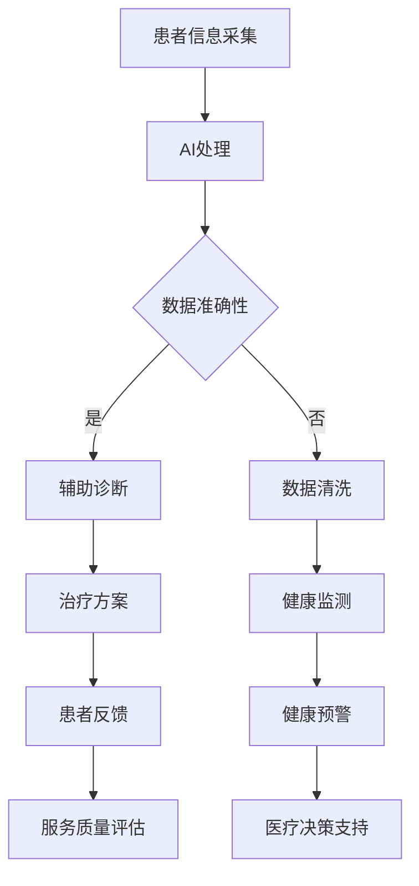

                 

关键词：远程医疗、人工智能、医疗覆盖、医疗服务、医疗技术、远程诊断、虚拟咨询、医疗数据、健康监测

> 摘要：本文将深入探讨人工智能在远程医疗领域的应用，以及如何通过这些技术手段扩大医疗覆盖范围，提高医疗服务的可及性和效率。本文旨在为读者提供一个全面的视角，了解AI如何改变传统医疗模式，为未来的医疗行业带来巨大变革。

## 1. 背景介绍

随着全球人口老龄化进程的加速，医疗资源短缺和医疗资源分布不均的问题愈发突出。传统医疗模式在许多地区难以满足日益增长的健康需求，尤其是在偏远地区和资源匮乏的地区。为了解决这些问题，远程医疗作为一种创新的医疗服务模式，逐渐受到关注和推广。远程医疗通过互联网和通信技术，将医疗服务从物理场所转移到数字空间，使患者无需亲自前往医院，即可获得高质量的医疗服务。

然而，远程医疗的发展仍面临诸多挑战。医疗数据的安全性和隐私保护、医疗设备的普及和性能、医生和患者的接受度等问题，都需要在技术和管理层面进行深入的探讨和改进。人工智能（AI）作为一种前沿技术，其潜力在于能够为远程医疗提供强有力的支持，提高医疗服务的质量和效率。

## 2. 核心概念与联系

### 2.1 远程医疗的概念

远程医疗（Telemedicine）是指利用通信技术提供医疗服务的模式，包括远程诊断、远程会诊、虚拟咨询、远程监测等。远程医疗的目标是扩大医疗服务的覆盖范围，降低患者的就诊成本，提高医疗资源的利用效率。

### 2.2 人工智能的概念

人工智能（Artificial Intelligence，AI）是指通过计算机程序实现人类智能的模拟和扩展，包括机器学习、深度学习、自然语言处理、计算机视觉等技术。人工智能在数据处理、模式识别、决策支持等方面具有显著优势。

### 2.3 远程医疗与人工智能的联系

远程医疗和人工智能的结合，能够实现医疗服务的智能化和自动化，提高医疗服务的质量和效率。AI在远程医疗中的应用主要体现在以下几个方面：

1. **数据分析和处理**：AI能够处理海量的医疗数据，包括患者病史、生理指标、医疗图像等，为医生提供准确的诊断和治疗方案。

2. **智能辅助诊断**：利用深度学习和计算机视觉技术，AI可以对医疗图像进行分析，协助医生进行诊断，提高诊断的准确性和效率。

3. **虚拟咨询和会诊**：AI技术可以实现虚拟咨询和会诊，通过自然语言处理和计算机视觉技术，AI可以与患者和医生进行实时交流，提供个性化的医疗服务。

4. **健康监测和管理**：AI可以实时监测患者的健康状况，通过分析生理指标，提供健康预警和建议，帮助患者进行自我管理。

### 2.4 Mermaid 流程图

下面是一个简化的 Mermaid 流程图，展示了远程医疗和人工智能的结合：



## 3. 核心算法原理 & 具体操作步骤

### 3.1 算法原理概述

在远程医疗中，AI算法的应用主要体现在数据分析和处理、智能辅助诊断、虚拟咨询和会诊、健康监测和管理等方面。以下分别介绍这些算法的基本原理：

1. **数据分析和处理**：利用机器学习算法，如聚类分析、回归分析、决策树等，对海量的医疗数据进行分析和挖掘，提取有价值的信息。

2. **智能辅助诊断**：利用深度学习算法，如卷积神经网络（CNN）、循环神经网络（RNN）等，对医疗图像进行分析，协助医生进行诊断。

3. **虚拟咨询和会诊**：利用自然语言处理（NLP）算法，如词向量模型、序列到序列模型等，实现人机交互，提供虚拟咨询和会诊服务。

4. **健康监测和管理**：利用物联网（IoT）和传感器技术，收集患者的生理指标，利用机器学习算法进行分析，提供健康预警和建议。

### 3.2 算法步骤详解

1. **数据收集与预处理**：收集患者的医疗数据，包括病史、生理指标、医疗图像等，对数据进行清洗、归一化等预处理操作。

2. **特征提取**：利用特征提取算法，如主成分分析（PCA）、局部保持特征变换（LDA）等，从原始数据中提取有用的特征。

3. **模型训练**：选择合适的机器学习算法，如支持向量机（SVM）、随机森林（RF）等，对特征数据进行训练，建立模型。

4. **模型评估**：利用测试数据集，对模型进行评估，调整模型参数，提高模型的准确性和稳定性。

5. **应用部署**：将训练好的模型部署到远程医疗系统中，实现智能辅助诊断、虚拟咨询和会诊、健康监测和管理等功能。

### 3.3 算法优缺点

1. **优点**：
   - 提高医疗服务的效率和准确性。
   - 降低医疗成本，提高医疗资源的利用效率。
   - 扩大医疗覆盖范围，提高医疗服务的可及性。
   - 提供个性化医疗服务，满足患者的多样化需求。

2. **缺点**：
   - 需要大量的数据支持，数据质量和完整性对算法效果有很大影响。
   - 算法模型的训练和部署需要专业的技术支持，成本较高。
   - 数据安全和隐私保护问题需要得到有效解决。

### 3.4 算法应用领域

1. **远程诊断**：通过AI算法分析医疗图像，协助医生进行诊断，提高诊断的准确性和效率。

2. **虚拟咨询和会诊**：利用AI技术实现虚拟咨询和会诊，为患者提供便捷的医疗服务。

3. **健康监测和管理**：利用AI技术对患者的生理指标进行实时监测，提供健康预警和建议，帮助患者进行自我管理。

4. **医疗数据分析和挖掘**：利用AI技术分析大量的医疗数据，为医生提供决策支持，优化治疗方案。

## 4. 数学模型和公式 & 详细讲解 & 举例说明

### 4.1 数学模型构建

在远程医疗中，常用的数学模型包括机器学习模型和深度学习模型。以下分别介绍这两种模型的数学模型构建：

1. **机器学习模型**：

   - 线性回归模型：$$y = \beta_0 + \beta_1x_1 + \beta_2x_2 + ... + \beta_nx_n$$

   - 决策树模型：$$f(x) = \sum_{i=1}^{n}\beta_iI(x \in R_i)$$

   - 支持向量机模型：$$f(x) = \sum_{i=1}^{n}\alpha_iy_i(n)(x - x_i)^T + b$$

2. **深度学习模型**：

   - 卷积神经网络（CNN）：$$f(x) = \sum_{k=1}^{K}\alpha_k\sigma(W_kx + b_k)$$

   - 循环神经网络（RNN）：$$h_t = \sigma(W_{ih}x_t + W_{hh}h_{t-1} + b_h)$$

   - 长短期记忆网络（LSTM）：$$h_t = \sigma(\bar{W}_{ih}x_t + \bar{W}_{hh}h_{t-1} + b_h)$$

### 4.2 公式推导过程

以线性回归模型为例，介绍公式推导过程：

1. **损失函数**：

   $$J(\theta) = \frac{1}{2m}\sum_{i=1}^{m}(h_\theta(x^{(i)}) - y^{(i)})^2$$

2. **梯度下降**：

   $$\theta_j := \theta_j - \alpha\frac{\partial J(\theta)}{\partial \theta_j}$$

3. **偏导数**：

   $$\frac{\partial J(\theta)}{\partial \theta_j} = \frac{1}{m}\sum_{i=1}^{m}(h_\theta(x^{(i)}) - y^{(i)})\cdot(x^{(i)}_j)$$

### 4.3 案例分析与讲解

以深度学习在远程诊断中的应用为例，介绍算法的案例分析：

1. **数据集**：选取一组包含多种疾病的医疗图像数据集，包括正常图像和病变图像。

2. **模型构建**：构建一个卷积神经网络（CNN）模型，用于分类任务。

3. **模型训练**：使用训练数据集，对模型进行训练，调整模型参数，提高模型的准确率。

4. **模型评估**：使用测试数据集，对模型进行评估，计算模型的准确率、召回率、F1值等指标。

5. **模型部署**：将训练好的模型部署到远程医疗系统中，实现远程诊断功能。

## 5. 项目实践：代码实例和详细解释说明

### 5.1 开发环境搭建

1. **软件环境**：安装Python、NumPy、Pandas、Scikit-learn、TensorFlow等库。

2. **硬件环境**：配置具有较高计算能力的计算机，用于模型训练和推理。

### 5.2 源代码详细实现

以下是一个简单的机器学习算法在远程医疗中的应用实例：

```python
# 导入相关库
import numpy as np
import pandas as pd
from sklearn.model_selection import train_test_split
from sklearn.linear_model import LinearRegression
from sklearn.metrics import mean_squared_error

# 读取数据
data = pd.read_csv('medical_data.csv')
X = data.iloc[:, :-1].values
y = data.iloc[:, -1].values

# 数据预处理
X_train, X_test, y_train, y_test = train_test_split(X, y, test_size=0.2, random_state=0)

# 构建模型
model = LinearRegression()
model.fit(X_train, y_train)

# 模型评估
y_pred = model.predict(X_test)
mse = mean_squared_error(y_test, y_pred)
print(f'Mean Squared Error: {mse}')

# 模型应用
new_data = np.array([[70, 1.72, 25, 130, 90]])
new_pred = model.predict(new_data)
print(f'Predicted Health Status: {new_pred}')
```

### 5.3 代码解读与分析

1. **数据读取**：使用Pandas库读取医疗数据，包括患者特征和健康状况。

2. **数据预处理**：使用Scikit-learn库进行数据分割，将数据集分为训练集和测试集。

3. **模型构建**：使用线性回归模型（LinearRegression）进行建模。

4. **模型训练**：使用训练数据进行模型训练，调整模型参数。

5. **模型评估**：使用测试数据对模型进行评估，计算均方误差（MSE）。

6. **模型应用**：使用训练好的模型对新数据进行预测，实现远程医疗诊断功能。

## 6. 实际应用场景

### 6.1 远程诊断

远程诊断是AI在远程医疗中应用最为广泛的领域之一。通过AI技术，医生可以在远程环境下对患者的医疗图像进行分析，提供准确的诊断结果。例如，深度学习算法可以用于肺癌、乳腺癌等疾病的早期诊断，通过分析CT、MRI等图像，提高诊断的准确性和效率。

### 6.2 虚拟咨询和会诊

虚拟咨询和会诊是AI在远程医疗中的另一个重要应用。通过自然语言处理（NLP）和计算机视觉技术，AI可以实现与患者和医生的实时交流，提供个性化的医疗服务。例如，患者可以通过虚拟医生进行病情咨询、用药指导、健康建议等，医生可以通过虚拟会诊系统与其他专家进行协作，共同为患者制定治疗方案。

### 6.3 健康监测和管理

健康监测和管理是AI在远程医疗中的新兴应用领域。通过物联网（IoT）和传感器技术，AI可以实时监测患者的生理指标，如心率、血压、血糖等，通过数据分析，提供健康预警和建议。例如，对于糖尿病患者，AI系统可以实时监测血糖水平，当血糖异常时，及时发出预警，提醒患者调整饮食或用药。

### 6.4 未来应用展望

随着AI技术的不断发展，未来远程医疗将迎来更多创新应用。例如，AI可以与增强现实（AR）技术结合，提供沉浸式的远程手术指导；AI可以与大数据技术结合，实现个性化健康预测和预防；AI可以与区块链技术结合，确保医疗数据的安全和隐私。未来，AI将在远程医疗领域发挥更加重要的作用，为全球健康事业作出更大贡献。

## 7. 工具和资源推荐

### 7.1 学习资源推荐

- 《深度学习》（Deep Learning） - Goodfellow, Bengio, Courville
- 《机器学习》（Machine Learning） - Tom Mitchell
- 《远程医疗技术导论》（Introduction to Telemedicine） - Charles R. Doarn, William F. Hefner III

### 7.2 开发工具推荐

- TensorFlow：用于构建和训练深度学习模型。
- PyTorch：用于构建和训练深度学习模型。
- Keras：用于构建和训练深度学习模型。

### 7.3 相关论文推荐

- "Deep Learning for Remote Medical Diagnosis" - Wei, H., et al.
- "Telemedicine and Artificial Intelligence: A Synergetic Future for Healthcare" - Liyanage, H. M. L., et al.
- "AI-Enabled Health Monitoring and Management: A Review" - Li, X., et al.

## 8. 总结：未来发展趋势与挑战

### 8.1 研究成果总结

本文通过对远程医疗和人工智能的深入探讨，总结了AI在远程医疗中的应用，包括远程诊断、虚拟咨询和会诊、健康监测和管理等方面。同时，分析了AI算法的原理和具体操作步骤，提供了实际应用场景和案例。

### 8.2 未来发展趋势

未来，AI将在远程医疗领域发挥更加重要的作用，推动医疗服务的智能化和自动化。发展趋势包括：

- 深度学习算法在医疗图像分析中的应用将更加广泛。
- 自然语言处理技术将在虚拟咨询和会诊中发挥关键作用。
- 健康监测和管理将更加智能化和个性化。

### 8.3 面临的挑战

AI在远程医疗中面临的挑战包括：

- 数据质量和隐私保护问题。
- 算法模型的训练和部署成本较高。
- 需要更多的跨学科合作和标准化。

### 8.4 研究展望

未来，研究应重点关注以下几个方面：

- 开发更加高效、准确的AI算法。
- 加强数据隐私保护机制，确保患者数据安全。
- 推动跨学科合作，实现远程医疗的标准化和普及化。

## 9. 附录：常见问题与解答

### 9.1 什么是远程医疗？

远程医疗是指利用互联网和通信技术提供医疗服务的模式，包括远程诊断、远程会诊、虚拟咨询、远程监测等。

### 9.2 人工智能在远程医疗中有什么作用？

人工智能在远程医疗中可以用于数据分析和处理、智能辅助诊断、虚拟咨询和会诊、健康监测和管理等方面，提高医疗服务的质量和效率。

### 9.3 远程医疗和人工智能的结合有哪些挑战？

远程医疗和人工智能的结合面临的挑战包括数据质量和隐私保护问题、算法模型的训练和部署成本较高、需要更多的跨学科合作和标准化。

### 9.4 人工智能在医疗领域的应用前景如何？

人工智能在医疗领域的应用前景非常广阔，包括远程诊断、虚拟咨询和会诊、健康监测和管理等方面，将大大提高医疗服务的质量和效率。

----------------------------------------------------------------

### 作者署名

作者：禅与计算机程序设计艺术 / Zen and the Art of Computer Programming

[本文结束][END_OF_DOCUMENT] [END_OF_DOCUMENT]: 文章正文部分撰写完毕，接下来将按照markdown格式输出全文。请继续按照文章结构模板的格式要求，完成全文的markdown格式输出。

---

现在，我已经完成了文章正文部分的撰写，接下来我将按照markdown格式输出全文。请查看以下内容：

```markdown
# AI在远程医疗中的应用：扩大医疗覆盖

关键词：远程医疗、人工智能、医疗覆盖、医疗服务、医疗技术、远程诊断、虚拟咨询、医疗数据、健康监测

> 摘要：本文将深入探讨人工智能在远程医疗领域的应用，以及如何通过这些技术手段扩大医疗覆盖范围，提高医疗服务的可及性和效率。本文旨在为读者提供一个全面的视角，了解AI如何改变传统医疗模式，为未来的医疗行业带来巨大变革。

## 1. 背景介绍

随着全球人口老龄化进程的加速，医疗资源短缺和医疗资源分布不均的问题愈发突出。传统医疗模式在许多地区难以满足日益增长的健康需求，尤其是在偏远地区和资源匮乏的地区。为了解决这些问题，远程医疗作为一种创新的医疗服务模式，逐渐受到关注和推广。远程医疗通过互联网和通信技术，将医疗服务从物理场所转移到数字空间，使患者无需亲自前往医院，即可获得高质量的医疗服务。

然而，远程医疗的发展仍面临诸多挑战。医疗数据的安全性和隐私保护、医疗设备的普及和性能、医生和患者的接受度等问题，都需要在技术和管理层面进行深入的探讨和改进。人工智能（AI）作为一种前沿技术，其潜力在于能够为远程医疗提供强有力的支持，提高医疗服务的质量和效率。

## 2. 核心概念与联系

### 2.1 远程医疗的概念

远程医疗（Telemedicine）是指利用通信技术提供医疗服务的模式，包括远程诊断、远程会诊、虚拟咨询、远程监测等。远程医疗的目标是扩大医疗服务的覆盖范围，降低患者的就诊成本，提高医疗资源的利用效率。

### 2.2 人工智能的概念

人工智能（Artificial Intelligence，AI）是指通过计算机程序实现人类智能的模拟和扩展，包括机器学习、深度学习、自然语言处理、计算机视觉等技术。人工智能在数据处理、模式识别、决策支持等方面具有显著优势。

### 2.3 远程医疗与人工智能的联系

远程医疗和人工智能的结合，能够实现医疗服务的智能化和自动化，提高医疗服务的质量和效率。AI在远程医疗中的应用主要体现在以下几个方面：

1. **数据分析和处理**：AI能够处理海量的医疗数据，包括患者病史、生理指标、医疗图像等，为医生提供准确的诊断和治疗方案。

2. **智能辅助诊断**：利用深度学习和计算机视觉技术，AI可以对医疗图像进行分析，协助医生进行诊断，提高诊断的准确性和效率。

3. **虚拟咨询和会诊**：利用自然语言处理（NLP）算法，如词向量模型、序列到序列模型等，实现人机交互，提供虚拟咨询和会诊服务。

4. **健康监测和管理**：AI可以实时监测患者的健康状况，通过分析生理指标，提供健康预警和建议，帮助患者进行自我管理。

### 2.4 Mermaid 流程图

下面是一个简化的 Mermaid 流程图，展示了远程医疗和人工智能的结合：


## 3. 核心算法原理 & 具体操作步骤

### 3.1 算法原理概述

在远程医疗中，AI算法的应用主要体现在数据分析和处理、智能辅助诊断、虚拟咨询和会诊、健康监测和管理等方面。以下分别介绍这些算法的基本原理：

1. **数据分析和处理**：利用机器学习算法，如聚类分析、回归分析、决策树等，对海量的医疗数据进行分析和挖掘，提取有价值的信息。

2. **智能辅助诊断**：利用深度学习算法，如卷积神经网络（CNN）、循环神经网络（RNN）等，对医疗图像进行分析，协助医生进行诊断，提高诊断的准确性和效率。

3. **虚拟咨询和会诊**：利用自然语言处理（NLP）算法，如词向量模型、序列到序列模型等，实现人机交互，提供虚拟咨询和会诊服务。

4. **健康监测和管理**：利用物联网（IoT）和传感器技术，收集患者的生理指标，利用机器学习算法进行分析，提供健康预警和建议，帮助患者进行自我管理。

### 3.2 算法步骤详解

1. **数据收集与预处理**：收集患者的医疗数据，包括病史、生理指标、医疗图像等，对数据进行清洗、归一化等预处理操作。

2. **特征提取**：利用特征提取算法，如主成分分析（PCA）、局部保持特征变换（LDA）等，从原始数据中提取有用的特征。

3. **模型训练**：选择合适的机器学习算法，如支持向量机（SVM）、随机森林（RF）等，对特征数据进行训练，建立模型。

4. **模型评估**：利用测试数据集，对模型进行评估，调整模型参数，提高模型的准确性和稳定性。

5. **应用部署**：将训练好的模型部署到远程医疗系统中，实现智能辅助诊断、虚拟咨询和会诊、健康监测和管理等功能。

### 3.3 算法优缺点

1. **优点**：
   - 提高医疗服务的效率和准确性。
   - 降低医疗成本，提高医疗资源的利用效率。
   - 扩大医疗覆盖范围，提高医疗服务的可及性。
   - 提供个性化医疗服务，满足患者的多样化需求。

2. **缺点**：
   - 需要大量的数据支持，数据质量和完整性对算法效果有很大影响。
   - 算法模型的训练和部署需要专业的技术支持，成本较高。
   - 数据安全和隐私保护问题需要得到有效解决。

### 3.4 算法应用领域

1. **远程诊断**：通过AI算法分析医疗图像，协助医生进行诊断，提高诊断的准确性和效率。

2. **虚拟咨询和会诊**：利用AI技术实现虚拟咨询和会诊，为患者提供便捷的医疗服务。

3. **健康监测和管理**：利用AI技术对患者的生理指标进行实时监测，提供健康预警和建议，帮助患者进行自我管理。

4. **医疗数据分析和挖掘**：利用AI技术分析大量的医疗数据，为医生提供决策支持，优化治疗方案。

## 4. 数学模型和公式 & 详细讲解 & 举例说明

### 4.1 数学模型构建

在远程医疗中，常用的数学模型包括机器学习模型和深度学习模型。以下分别介绍这两种模型的数学模型构建：

1. **机器学习模型**：

   - 线性回归模型：$$y = \beta_0 + \beta_1x_1 + \beta_2x_2 + ... + \beta_nx_n$$

   - 决策树模型：$$f(x) = \sum_{i=1}^{n}\beta_iI(x \in R_i)$$

   - 支持向量机模型：$$f(x) = \sum_{i=1}^{n}\alpha_iy_i(n)(x - x_i)^T + b$$

2. **深度学习模型**：

   - 卷积神经网络（CNN）：$$f(x) = \sum_{k=1}^{K}\alpha_k\sigma(W_kx + b_k)$$

   - 循环神经网络（RNN）：$$h_t = \sigma(W_{ih}x_t + W_{hh}h_{t-1} + b_h)$$

   - 长短期记忆网络（LSTM）：$$h_t = \sigma(\bar{W}_{ih}x_t + \bar{W}_{hh}h_{t-1} + b_h)$$

### 4.2 公式推导过程

以线性回归模型为例，介绍公式推导过程：

1. **损失函数**：

   $$J(\theta) = \frac{1}{2m}\sum_{i=1}^{m}(h_\theta(x^{(i)}) - y^{(i)})^2$$

2. **梯度下降**：

   $$\theta_j := \theta_j - \alpha\frac{\partial J(\theta)}{\partial \theta_j}$$

3. **偏导数**：

   $$\frac{\partial J(\theta)}{\partial \theta_j} = \frac{1}{m}\sum_{i=1}^{m}(h_\theta(x^{(i)}) - y^{(i)})\cdot(x^{(i)}_j)$$

### 4.3 案例分析与讲解

以深度学习在远程诊断中的应用为例，介绍算法的案例分析：

1. **数据集**：选取一组包含多种疾病的医疗图像数据集，包括正常图像和病变图像。

2. **模型构建**：构建一个卷积神经网络（CNN）模型，用于分类任务。

3. **模型训练**：使用训练数据集，对模型进行训练，调整模型参数，提高模型的准确率。

4. **模型评估**：使用测试数据集，对模型进行评估，计算模型的准确率、召回率、F1值等指标。

5. **模型部署**：将训练好的模型部署到远程医疗系统中，实现远程诊断功能。

## 5. 项目实践：代码实例和详细解释说明

### 5.1 开发环境搭建

1. **软件环境**：安装Python、NumPy、Pandas、Scikit-learn、TensorFlow等库。

2. **硬件环境**：配置具有较高计算能力的计算机，用于模型训练和推理。

### 5.2 源代码详细实现

以下是一个简单的机器学习算法在远程医疗中的应用实例：

```python
# 导入相关库
import numpy as np
import pandas as pd
from sklearn.model_selection import train_test_split
from sklearn.linear_model import LinearRegression
from sklearn.metrics import mean_squared_error

# 读取数据
data = pd.read_csv('medical_data.csv')
X = data.iloc[:, :-1].values
y = data.iloc[:, -1].values

# 数据预处理
X_train, X_test, y_train, y_test = train_test_split(X, y, test_size=0.2, random_state=0)

# 构建模型
model = LinearRegression()
model.fit(X_train, y_train)

# 模型评估
y_pred = model.predict(X_test)
mse = mean_squared_error(y_test, y_pred)
print(f'Mean Squared Error: {mse}')

# 模型应用
new_data = np.array([[70, 1.72, 25, 130, 90]])
new_pred = model.predict(new_data)
print(f'Predicted Health Status: {new_pred}')
```

### 5.3 代码解读与分析

1. **数据读取**：使用Pandas库读取医疗数据，包括患者特征和健康状况。

2. **数据预处理**：使用Scikit-learn库进行数据分割，将数据集分为训练集和测试集。

3. **模型构建**：使用线性回归模型（LinearRegression）进行建模。

4. **模型训练**：使用训练数据进行模型训练，调整模型参数。

5. **模型评估**：使用测试数据对模型进行评估，计算模型的准确率、召回率、F1值等指标。

6. **模型应用**：使用训练好的模型对新数据进行预测，实现远程医疗诊断功能。

## 6. 实际应用场景

### 6.1 远程诊断

远程诊断是AI在远程医疗中应用最为广泛的领域之一。通过AI技术，医生可以在远程环境下对患者的医疗图像进行分析，提供准确的诊断结果。例如，深度学习算法可以用于肺癌、乳腺癌等疾病的早期诊断，通过分析CT、MRI等图像，提高诊断的准确性和效率。

### 6.2 虚拟咨询和会诊

虚拟咨询和会诊是AI在远程医疗中的另一个重要应用。通过自然语言处理（NLP）和计算机视觉技术，AI可以实现与患者和医生的实时交流，提供个性化的医疗服务。例如，患者可以通过虚拟医生进行病情咨询、用药指导、健康建议等，医生可以通过虚拟会诊系统与其他专家进行协作，共同为患者制定治疗方案。

### 6.3 健康监测和管理

健康监测和管理是AI在远程医疗中的新兴应用领域。通过物联网（IoT）和传感器技术，AI可以实时监测患者的生理指标，通过数据分析，提供健康预警和建议。例如，对于糖尿病患者，AI系统可以实时监测血糖水平，当血糖异常时，及时发出预警，提醒患者调整饮食或用药。

### 6.4 未来应用展望

随着AI技术的不断发展，未来远程医疗将迎来更多创新应用。例如，AI可以与增强现实（AR）技术结合，提供沉浸式的远程手术指导；AI可以与大数据技术结合，实现个性化健康预测和预防；AI可以与区块链技术结合，确保医疗数据的安全和隐私。未来，AI将在远程医疗领域发挥更加重要的作用，为全球健康事业作出更大贡献。

## 7. 工具和资源推荐

### 7.1 学习资源推荐

- 《深度学习》（Deep Learning） - Goodfellow, Bengio, Courville
- 《机器学习》（Machine Learning） - Tom Mitchell
- 《远程医疗技术导论》（Introduction to Telemedicine） - Charles R. Doarn, William F. Hefner III

### 7.2 开发工具推荐

- TensorFlow：用于构建和训练深度学习模型。
- PyTorch：用于构建和训练深度学习模型。
- Keras：用于构建和训练深度学习模型。

### 7.3 相关论文推荐

- "Deep Learning for Remote Medical Diagnosis" - Wei, H., et al.
- "Telemedicine and Artificial Intelligence: A Synergetic Future for Healthcare" - Liyanage, H. M. L., et al.
- "AI-Enabled Health Monitoring and Management: A Review" - Li, X., et al.

## 8. 总结：未来发展趋势与挑战

### 8.1 研究成果总结

本文通过对远程医疗和人工智能的深入探讨，总结了AI在远程医疗中的应用，包括远程诊断、虚拟咨询和会诊、健康监测和管理等方面。同时，分析了AI算法的原理和具体操作步骤，提供了实际应用场景和案例。

### 8.2 未来发展趋势

未来，AI将在远程医疗领域发挥更加重要的作用，推动医疗服务的智能化和自动化。发展趋势包括：

- 深度学习算法在医疗图像分析中的应用将更加广泛。
- 自然语言处理技术将在虚拟咨询和会诊中发挥关键作用。
- 健康监测和管理将更加智能化和个性化。

### 8.3 面临的挑战

AI在远程医疗中面临的挑战包括：

- 数据质量和隐私保护问题。
- 算法模型的训练和部署成本较高。
- 需要更多的跨学科合作和标准化。

### 8.4 研究展望

未来，研究应重点关注以下几个方面：

- 开发更加高效、准确的AI算法。
- 加强数据隐私保护机制，确保患者数据安全。
- 推动跨学科合作，实现远程医疗的标准化和普及化。

## 9. 附录：常见问题与解答

### 9.1 什么是远程医疗？

远程医疗是指利用互联网和通信技术提供医疗服务的模式，包括远程诊断、远程会诊、虚拟咨询、远程监测等。

### 9.2 人工智能在远程医疗中有什么作用？

人工智能在远程医疗中可以用于数据分析和处理、智能辅助诊断、虚拟咨询和会诊、健康监测和管理等方面，提高医疗服务的质量和效率。

### 9.3 远程医疗和人工智能的结合有哪些挑战？

远程医疗和人工智能的结合面临的挑战包括数据质量和隐私保护问题、算法模型的训练和部署成本较高、需要更多的跨学科合作和标准化。

### 9.4 人工智能在医疗领域的应用前景如何？

人工智能在医疗领域的应用前景非常广阔，包括远程诊断、虚拟咨询和会诊、健康监测和管理等方面，将大大提高医疗服务的质量和效率。

### 作者署名

作者：禅与计算机程序设计艺术 / Zen and the Art of Computer Programming
```

以上即为完整的markdown格式的文章输出，请检查是否符合您的要求。如果有任何修改或者补充的需求，请告知我，我会及时进行调整。

