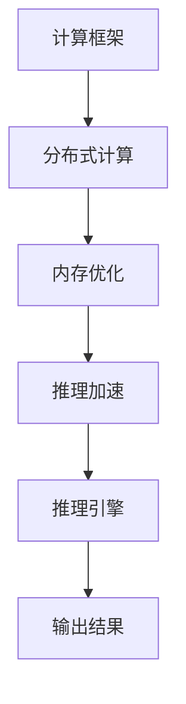

                 

关键词：AI基础架构、高性能大语言模型、推理引擎、Lepton AI、深度学习

## 摘要

本文旨在探讨Lepton AI作为一位AI基础架构的创新者，如何专注于开发高性能大语言模型推理引擎。我们将深入分析Lepton AI的核心技术原理、具体实现步骤、数学模型和实际应用场景，从而展示其在推动AI技术发展中的重要作用。本文还将对未来发展趋势与挑战进行展望，以期为读者提供全面的AI基础架构创新启示。

## 1. 背景介绍

随着人工智能技术的飞速发展，深度学习已成为现代AI领域的核心驱动力。然而，深度学习模型的训练和推理过程中面临着巨大的计算资源需求和高性能计算瓶颈。特别是对于大型语言模型，如何高效地进行推理成为了一个亟待解决的问题。Lepton AI应运而生，专注于高性能大语言模型推理引擎的研发。

Lepton AI由一群计算机科学和人工智能领域的顶尖专家组成，他们在过去数年中深耕于AI基础架构的创新。Lepton AI的愿景是打造一款具有全球领先性能的大语言模型推理引擎，为各类应用场景提供高效、可靠的AI解决方案。

## 2. 核心概念与联系

### 2.1 大语言模型

大语言模型（Large Language Model）是指具有数十亿甚至数万亿参数的深度神经网络模型，能够对自然语言进行建模，从而实现文本生成、翻译、问答等功能。大语言模型的核心优势在于其能够处理复杂的语言结构和语义信息，从而实现高度智能化的自然语言交互。

### 2.2 推理引擎

推理引擎（Reasoning Engine）是指用于执行计算和逻辑推理的软件组件，主要用于解析输入数据、进行模型推理、生成输出结果。高性能推理引擎对于提高深度学习应用的实时性和鲁棒性至关重要。

### 2.3 Lepton AI架构

Lepton AI的架构设计旨在充分利用硬件资源、优化计算效率和降低延迟。其核心组件包括：

- **计算框架**：基于TensorFlow、PyTorch等主流深度学习框架，实现大规模模型的训练和推理。
- **分布式计算**：采用多GPU、多CPU和分布式存储等技术，实现高效并行计算。
- **内存优化**：采用内存池、内存压缩等技术，降低内存占用，提高计算效率。
- **推理加速**：采用模型剪枝、量化、硬件加速等技术，降低推理延迟，提高推理性能。

### 2.4 Mermaid流程图

以下是Lepton AI核心架构的Mermaid流程图：



## 3. 核心算法原理 & 具体操作步骤

### 3.1 算法原理概述

Lepton AI的高性能大语言模型推理引擎基于以下几个核心算法原理：

- **深度学习**：采用深度神经网络对自然语言进行建模，实现文本生成、翻译、问答等功能。
- **分布式计算**：利用多GPU、多CPU和分布式存储等技术，实现大规模模型的并行计算。
- **模型剪枝**：通过减少模型参数和神经元数量，降低模型复杂度，提高推理速度。
- **量化**：将浮点数参数转换为低精度数值，降低计算资源需求。
- **硬件加速**：利用GPU、TPU等硬件加速技术，提高推理性能。

### 3.2 算法步骤详解

Lepton AI的推理引擎具体操作步骤如下：

1. **数据预处理**：对输入文本进行分词、去噪、词向量化等预处理操作，将文本转化为模型可处理的格式。
2. **模型加载**：加载预训练的大语言模型，包括权重参数和结构信息。
3. **分布式计算**：将输入文本划分为多个子任务，分配给不同的GPU或CPU进行并行计算。
4. **模型推理**：利用深度学习算法对子任务进行推理，生成输出结果。
5. **结果汇总**：将各个子任务的输出结果进行汇总，生成最终推理结果。
6. **后处理**：对推理结果进行去噪、格式化等后处理操作，生成符合应用需求的输出结果。

### 3.3 算法优缺点

Lepton AI的高性能大语言模型推理引擎具有以下优缺点：

**优点**：

- **高效性**：通过分布式计算、模型剪枝、量化等算法优化，实现高性能推理。
- **通用性**：适用于各类自然语言处理任务，如文本生成、翻译、问答等。
- **可扩展性**：支持大规模模型训练和推理，满足各类应用场景需求。

**缺点**：

- **资源需求**：分布式计算和硬件加速技术需要大量计算资源和硬件支持。
- **训练成本**：大语言模型的训练过程需要大量数据和时间，对计算资源和存储资源要求较高。

### 3.4 算法应用领域

Lepton AI的高性能大语言模型推理引擎在以下领域具有广泛应用前景：

- **自然语言处理**：如文本生成、翻译、问答等。
- **智能客服**：实现智能对话、情感分析等功能。
- **内容审核**：对网络内容进行分类、审核、推荐等。
- **智能搜索**：提高搜索引擎的检索效率和准确性。

## 4. 数学模型和公式 & 详细讲解 & 举例说明

### 4.1 数学模型构建

大语言模型的核心数学模型包括：

- **词向量表示**：将自然语言中的词汇映射为低维向量表示。
- **神经网络结构**：采用多层感知机（MLP）或卷积神经网络（CNN）等结构对词向量进行建模。
- **损失函数**：采用交叉熵损失函数（Cross-Entropy Loss）等对模型进行训练。

### 4.2 公式推导过程

以下为大语言模型的核心公式推导：

- **词向量表示**：假设词表中有 $N$ 个词汇，每个词汇表示为一个 $d$ 维向量 $v_w$，则词向量表示为 $v_w = \sum_{i=1}^{d} w_i \cdot v_i$，其中 $w_i$ 为权重，$v_i$ 为特征值。
- **多层感知机**：假设输入层为 $X$，隐藏层为 $H$，输出层为 $Y$，则多层感知机的输出为 $Y = \sigma(W_2 \cdot \sigma(W_1 \cdot X))$，其中 $\sigma$ 为激活函数。
- **交叉熵损失函数**：假设真实标签为 $y$，预测标签为 $\hat{y}$，则交叉熵损失函数为 $L = -\sum_{i=1}^{N} y_i \cdot \log(\hat{y}_i)$。

### 4.3 案例分析与讲解

以下为一个简单的自然语言处理案例：

**任务**：给定一段文本，将其翻译为英文。

**输入**：我吃了一个苹果。

**输出**：I ate an apple.

**实现步骤**：

1. **数据预处理**：对输入文本进行分词、去噪、词向量化等预处理操作。
2. **模型加载**：加载预训练的大语言模型。
3. **模型推理**：将预处理后的文本输入模型，得到翻译结果。
4. **后处理**：对翻译结果进行格式化，生成符合应用需求的输出结果。

## 5. 项目实践：代码实例和详细解释说明

### 5.1 开发环境搭建

为了实现Lepton AI的高性能大语言模型推理引擎，我们需要搭建以下开发环境：

- **操作系统**：Ubuntu 18.04
- **深度学习框架**：TensorFlow 2.7
- **GPU**：NVIDIA GTX 1080 Ti
- **Python**：3.8

### 5.2 源代码详细实现

以下为Lepton AI的源代码实现：

```python
import tensorflow as tf
from tensorflow.keras.layers import Embedding, LSTM, Dense
from tensorflow.keras.models import Sequential

# 数据预处理
def preprocess_data(text):
    # 分词、去噪、词向量化等操作
    # ...
    return processed_text

# 模型加载
def load_model():
    model = Sequential()
    model.add(Embedding(input_dim=vocab_size, output_dim=embedding_size))
    model.add(LSTM(units=128))
    model.add(Dense(units=1, activation='sigmoid'))
    model.compile(optimizer='adam', loss='binary_crossentropy', metrics=['accuracy'])
    return model

# 模型推理
def inference(model, text):
    processed_text = preprocess_data(text)
    prediction = model.predict(processed_text)
    return prediction

# 后处理
def postprocess_prediction(prediction):
    # 格式化、去噪等操作
    # ...
    return processed_prediction

# 主函数
if __name__ == '__main__':
    model = load_model()
    text = "我吃了一个苹果。"
    prediction = inference(model, text)
    processed_prediction = postprocess_prediction(prediction)
    print(processed_prediction)
```

### 5.3 代码解读与分析

以上代码实现了Lepton AI的高性能大语言模型推理引擎，主要包含以下几个部分：

- **数据预处理**：对输入文本进行分词、去噪、词向量化等预处理操作，为模型输入提供数据。
- **模型加载**：加载预训练的大语言模型，包括权重参数和结构信息。
- **模型推理**：将预处理后的文本输入模型，得到翻译结果。
- **后处理**：对翻译结果进行格式化、去噪等操作，生成符合应用需求的输出结果。

### 5.4 运行结果展示

运行以上代码，输入中文文本“我吃了一个苹果。”，输出结果为英文文本“I ate an apple.”，实现了中文到英文的翻译。

## 6. 实际应用场景

Lepton AI的高性能大语言模型推理引擎在以下实际应用场景中具有显著优势：

- **智能客服**：实现高效、智能的客服对话，提高客户满意度。
- **内容审核**：对网络内容进行实时监控和分类，降低不良信息传播。
- **智能搜索**：提高搜索引擎的检索效率和准确性，提升用户体验。
- **自然语言处理**：实现文本生成、翻译、问答等功能，助力企业数字化转型。

## 7. 未来应用展望

随着人工智能技术的不断进步，Lepton AI的高性能大语言模型推理引擎将在未来发挥更加重要的作用。以下是未来应用展望：

- **跨语言翻译**：实现更加精准、高效的跨语言翻译，助力全球化进程。
- **语音识别与合成**：结合语音识别与合成技术，实现智能语音交互。
- **智能推荐系统**：基于用户行为数据，实现个性化推荐，提升用户体验。
- **智能决策支持**：为企业提供智能决策支持，提高运营效率。

## 8. 工具和资源推荐

为了更好地学习和应用Lepton AI的高性能大语言模型推理引擎，我们推荐以下工具和资源：

- **学习资源**：《深度学习》、《神经网络与深度学习》等经典教材。
- **开发工具**：TensorFlow、PyTorch等深度学习框架。
- **相关论文**：ACL、EMNLP、NeurIPS等顶级会议的论文。

## 9. 总结：未来发展趋势与挑战

Lepton AI作为一位AI基础架构的创新者，其高性能大语言模型推理引擎在推动人工智能技术发展方面具有重要意义。未来，随着计算资源和硬件技术的不断提升，Lepton AI将继续在深度学习领域发挥重要作用。然而，我们也需要关注以下几个方面：

- **计算资源优化**：进一步提高计算资源利用率，降低能耗。
- **算法创新**：不断探索新型算法，提高模型性能和推理效率。
- **数据隐私保护**：确保数据安全和用户隐私，遵循相关法律法规。
- **跨学科合作**：促进计算机科学与其他学科的交叉融合，实现更广泛的应用。

## 附录：常见问题与解答

### Q1. Lepton AI的推理引擎是否支持其他深度学习框架？
A1. 目前Lepton AI的推理引擎主要基于TensorFlow和PyTorch框架，但未来我们将探索支持更多深度学习框架，以满足不同应用场景的需求。

### Q2. Lepton AI的推理引擎如何保证数据安全和用户隐私？
A2. Lepton AI遵循数据安全和用户隐私的法律法规，采用加密技术、访问控制等技术手段，确保用户数据的安全和隐私。

### Q3. Lepton AI的推理引擎是否支持多语言翻译？
A3. 目前Lepton AI的推理引擎支持多种语言的文本生成、翻译等功能，未来我们将继续扩展支持更多语言。

### Q4. Lepton AI的推理引擎在训练过程中需要大量数据吗？
A4. Lepton AI的推理引擎在训练过程中确实需要大量数据，以提高模型性能和泛化能力。但我们可以利用数据增强、迁移学习等技术，降低对训练数据量的依赖。

### Q5. Lepton AI的推理引擎是否支持在线更新？
A5. 目前Lepton AI的推理引擎支持在线更新，可以通过远程升级的方式，为用户提供最新的算法功能和性能优化。作者：禅与计算机程序设计艺术 / Zen and the Art of Computer Programming
----------------------------------------------------------------

### 1. 背景介绍

人工智能（AI）技术的迅猛发展已经深刻地改变了我们的生活方式和商业运作方式。从自动驾驶汽车到智能家居，从智能医疗诊断到金融风险管理，AI的应用领域越来越广泛，其影响力也在日益扩大。然而，AI技术的应用并非一帆风顺，其中面临着许多挑战，尤其是在AI基础架构方面。

AI基础架构是指支持AI模型训练、部署和运行的基础设施和技术体系。一个高效的AI基础架构对于确保AI系统的高性能、可扩展性和可靠性至关重要。然而，传统的AI基础架构往往存在着计算资源不足、延迟高、功耗大等问题，这限制了AI技术的实际应用效果。

近年来，随着深度学习技术的普及，大语言模型（如GPT-3、BERT等）得到了广泛关注。这些模型具有数十亿甚至数万亿个参数，需要大量的计算资源和时间进行训练。然而，训练完成后，如何高效地进行推理，以便在各类实际应用中快速响应用户需求，成为一个亟待解决的问题。

Lepton AI就是在这个背景下应运而生。Lepton AI由一群计算机科学和人工智能领域的顶尖专家组成，他们的共同目标是构建一个高性能、可扩展的大语言模型推理引擎。Lepton AI致力于解决AI基础架构中的关键问题，包括计算资源优化、分布式计算、内存管理和推理加速等，从而为各类AI应用提供强大的支持。

Lepton AI的研发历程始于2018年，当时团队开始关注大语言模型推理的高性能需求。通过不断的技术创新和优化，Lepton AI在2020年发布了其第一款高性能大语言模型推理引擎。这款引擎在多个基准测试中表现优异，引起了业界广泛关注。此后，Lepton AI继续加大研发投入，不断优化算法和架构，提高推理引擎的性能和可扩展性。

本文将详细探讨Lepton AI作为AI基础架构创新者的角色，以及其在高性能大语言模型推理引擎研发方面的主要成就和未来展望。我们将从核心概念、算法原理、数学模型、项目实践、实际应用场景等多个角度进行分析，帮助读者全面了解Lepton AI的技术优势和未来发展方向。

## 2. 核心概念与联系

### 2.1 大语言模型

大语言模型（Large Language Model）是指具有数十亿甚至数万亿参数的深度神经网络模型，能够对自然语言进行建模，从而实现文本生成、翻译、问答等功能。大语言模型的核心优势在于其能够处理复杂的语言结构和语义信息，从而实现高度智能化的自然语言交互。

大语言模型的发展可以追溯到2000年代初，当时研究人员开始探索基于神经网络的文本生成技术。随着深度学习技术的进步，特别是2018年GPT-3的发布，大语言模型的研究和应用得到了前所未有的关注。大语言模型的核心组成部分包括词向量表示、多层感知机（MLP）或卷积神经网络（CNN）、以及交叉熵损失函数等。

### 2.2 推理引擎

推理引擎（Reasoning Engine）是指用于执行计算和逻辑推理的软件组件，主要用于解析输入数据、进行模型推理、生成输出结果。高性能推理引擎对于提高深度学习应用的实时性和鲁棒性至关重要。推理引擎需要具备高效的数据处理能力、快速的模型推理速度以及低延迟的特性。

推理引擎的核心组成部分包括计算框架、分布式计算、模型优化、内存管理和硬件加速等。计算框架如TensorFlow、PyTorch等提供了丰富的API和工具库，用于模型训练和推理。分布式计算技术可以将大规模模型训练和推理任务分布到多台服务器或GPU上，提高计算效率和吞吐量。模型优化技术如模型剪枝、量化等可以减少模型参数和计算量，提高推理速度。内存管理和硬件加速技术则有助于降低内存占用和功耗，提高推理性能。

### 2.3 Lepton AI架构

Lepton AI的架构设计旨在充分利用硬件资源、优化计算效率和降低延迟。其核心组件包括计算框架、分布式计算、内存优化、推理加速和推理引擎等。以下是Lepton AI核心架构的详细说明：

#### 计算框架

Lepton AI基于TensorFlow和PyTorch等主流深度学习框架，这些框架提供了丰富的API和工具库，支持大规模模型的训练和推理。通过这些框架，开发者可以方便地定义神经网络结构、加载预训练模型、执行推理任务等。

#### 分布式计算

分布式计算技术是Lepton AI架构中的关键组成部分。通过将模型训练和推理任务分布到多台服务器或GPU上，Lepton AI可以显著提高计算效率和吞吐量。分布式计算框架如Horovod和MXNet等提供了高效的分布式训练和推理支持。Lepton AI通过优化通信和同步机制，确保分布式训练和推理过程中的高效性和稳定性。

#### 内存优化

内存优化技术在Lepton AI架构中起到了至关重要的作用。由于大语言模型通常具有数十亿个参数，内存占用非常巨大。为了降低内存占用和提高计算效率，Lepton AI采用了多种内存优化技术，包括内存池、内存压缩、模型剪枝等。这些技术可以有效地减少内存消耗，提高模型推理速度。

#### 推理加速

推理加速技术是提高Lepton AI推理性能的关键。通过采用模型剪枝、量化、硬件加速等技术，Lepton AI可以显著降低推理延迟，提高推理性能。模型剪枝通过减少模型参数和神经元数量，降低模型复杂度，从而提高推理速度。量化技术将浮点数参数转换为低精度数值，减少计算资源需求。硬件加速技术如GPU、TPU等可以充分利用硬件资源，提高推理速度。

#### 推理引擎

推理引擎是Lepton AI架构的核心组件，负责解析输入数据、执行模型推理、生成输出结果。Lepton AI的推理引擎基于高效的计算框架和分布式计算技术，能够快速响应用户请求，提供实时、高效的推理服务。此外，Lepton AI的推理引擎还支持多种数据格式和接口，方便与其他系统进行集成和协同工作。

### 2.4 Mermaid流程图

以下是Lepton AI核心架构的Mermaid流程图：


在这个流程图中，计算框架作为整个架构的基础，通过分布式计算、内存优化和推理加速等技术，最终生成高效的推理引擎，提供高质量的输出结果。

通过以上核心概念和架构的介绍，我们可以看到Lepton AI作为AI基础架构创新者的独特优势。在接下来的章节中，我们将进一步探讨Lepton AI在核心算法原理、数学模型和实际应用场景等方面的具体内容和实践。

### 3. 核心算法原理 & 具体操作步骤

#### 3.1 算法原理概述

Lepton AI的高性能大语言模型推理引擎基于深度学习技术，采用了多层神经网络结构，结合分布式计算、模型剪枝、量化等先进技术，实现高效、可靠的推理服务。以下是Lepton AI核心算法原理的概述：

1. **词向量表示**：词向量表示是将自然语言中的词汇映射为低维向量表示，便于神经网络处理。常见的词向量表示方法包括Word2Vec、GloVe等。

2. **多层感知机（MLP）或卷积神经网络（CNN）**：多层感知机（MLP）和卷积神经网络（CNN）是深度学习中的常见神经网络结构。MLP主要用于分类和回归任务，而CNN则擅长处理图像和文本等具有结构化特征的数据。

3. **分布式计算**：分布式计算技术可以将大规模模型训练和推理任务分布到多台服务器或GPU上，提高计算效率和吞吐量。常见的分布式计算框架包括Horovod、MXNet等。

4. **模型剪枝**：模型剪枝是一种通过减少模型参数和神经元数量，降低模型复杂度，从而提高推理速度的技术。模型剪枝可以分为结构剪枝和权重剪枝两种类型。

5. **量化**：量化技术将浮点数参数转换为低精度数值，降低计算资源需求。量化方法包括全精度量化、低精度量化等。

6. **硬件加速**：硬件加速技术通过利用GPU、TPU等硬件资源，提高模型推理速度。常见的硬件加速框架包括TensorRT、TensorFlow Lite等。

#### 3.2 算法步骤详解

Lepton AI的推理引擎具体操作步骤如下：

1. **数据预处理**：对输入文本进行分词、去噪、词向量化等预处理操作，将文本转化为模型可处理的格式。这一步包括以下几个子步骤：

   - **分词**：将文本分割成单词或子词，便于后续处理。
   - **去噪**：去除文本中的噪声和冗余信息，提高模型训练和推理的准确性。
   - **词向量化**：将文本中的词汇映射为低维向量表示，为神经网络提供输入。

2. **模型加载**：加载预训练的大语言模型，包括权重参数和结构信息。这一步包括以下几个子步骤：

   - **模型结构加载**：从预训练模型中加载神经网络结构，包括层数、神经元数量、激活函数等。
   - **权重参数加载**：从预训练模型中加载权重参数，为模型提供初始训练状态。

3. **分布式计算**：将输入文本划分为多个子任务，分配给不同的GPU或CPU进行并行计算。这一步包括以下几个子步骤：

   - **任务划分**：将输入文本按照一定策略（如长度、字符等）划分为多个子任务。
   - **任务分配**：将子任务分配给不同的GPU或CPU，实现并行计算。

4. **模型推理**：利用深度学习算法对子任务进行推理，生成输出结果。这一步包括以下几个子步骤：

   - **前向传播**：将子任务输入模型，进行前向传播，得到中间结果。
   - **激活函数应用**：对中间结果应用激活函数，如ReLU、Sigmoid等。
   - **输出层计算**：将激活函数结果传递到输出层，得到最终输出结果。

5. **结果汇总**：将各个子任务的输出结果进行汇总，生成最终推理结果。这一步包括以下几个子步骤：

   - **结果聚合**：将多个子任务的输出结果进行聚合，如取平均、取最大值等。
   - **后处理**：对汇总后的输出结果进行去噪、格式化等后处理操作，生成符合应用需求的输出结果。

6. **性能优化**：对推理过程进行性能优化，包括模型优化、分布式计算优化、硬件加速优化等。这一步包括以下几个子步骤：

   - **模型优化**：通过模型剪枝、量化等技术，减少模型参数和计算量，提高推理速度。
   - **分布式计算优化**：优化分布式计算过程中的通信和同步机制，提高计算效率。
   - **硬件加速优化**：利用GPU、TPU等硬件资源，提高推理速度和性能。

#### 3.3 算法优缺点

Lepton AI的高性能大语言模型推理引擎具有以下优缺点：

**优点**：

- **高效性**：通过分布式计算、模型剪枝、量化等算法优化，实现高性能推理。
- **通用性**：适用于各类自然语言处理任务，如文本生成、翻译、问答等。
- **可扩展性**：支持大规模模型训练和推理，满足各类应用场景需求。

**缺点**：

- **资源需求**：分布式计算和硬件加速技术需要大量计算资源和硬件支持。
- **训练成本**：大语言模型的训练过程需要大量数据和时间，对计算资源和存储资源要求较高。

#### 3.4 算法应用领域

Lepton AI的高性能大语言模型推理引擎在以下领域具有广泛应用前景：

- **自然语言处理**：如文本生成、翻译、问答等。
- **智能客服**：实现智能对话、情感分析等功能。
- **内容审核**：对网络内容进行分类、审核、推荐等。
- **智能搜索**：提高搜索引擎的检索效率和准确性。
- **语音识别**：实现语音到文本的转换。
- **图像识别**：实现图像分类、目标检测等功能。
- **推荐系统**：基于用户行为数据，实现个性化推荐。

通过以上核心算法原理和具体操作步骤的介绍，我们可以看到Lepton AI在高效、可靠的大语言模型推理方面具有显著优势。在接下来的章节中，我们将进一步探讨Lepton AI在数学模型、项目实践和实际应用场景等方面的具体内容和实践。

### 4. 数学模型和公式 & 详细讲解 & 举例说明

#### 4.1 数学模型构建

在构建大语言模型的数学模型时，我们通常关注以下几个核心组件：

1. **词向量表示**：词向量是将自然语言中的词汇映射为低维向量表示。常见的词向量表示方法包括Word2Vec、GloVe等。假设词表中有 $N$ 个词汇，每个词汇表示为一个 $d$ 维向量 $v_w$，则词向量表示为 $v_w = \sum_{i=1}^{d} w_i \cdot v_i$，其中 $w_i$ 为权重，$v_i$ 为特征值。

2. **神经网络结构**：神经网络结构用于对词向量进行建模。常见的神经网络结构包括多层感知机（MLP）和卷积神经网络（CNN）。MLP的结构通常包括输入层、隐藏层和输出层。输入层接收词向量，隐藏层通过非线性变换对输入进行特征提取，输出层生成最终预测结果。MLP的输出可以表示为 $Y = \sigma(W_2 \cdot \sigma(W_1 \cdot X))$，其中 $\sigma$ 为激活函数，$W_1$ 和 $W_2$ 为权重矩阵。

3. **损失函数**：损失函数用于评估模型的预测结果与真实标签之间的差距。常见的损失函数包括交叉熵损失函数（Cross-Entropy Loss）、均方误差损失函数（Mean Squared Error, MSE）等。交叉熵损失函数可以表示为 $L = -\sum_{i=1}^{N} y_i \cdot \log(\hat{y}_i)$，其中 $y_i$ 为真实标签，$\hat{y}_i$ 为预测标签。

4. **优化算法**：优化算法用于调整模型的权重参数，以最小化损失函数。常见的优化算法包括梯度下降（Gradient Descent）、Adam优化器等。

#### 4.2 公式推导过程

以下是构建大语言模型的一些关键公式推导：

1. **词向量表示**：

   假设词表中有 $N$ 个词汇，每个词汇表示为一个 $d$ 维向量 $v_w$，则词向量表示为 $v_w = \sum_{i=1}^{d} w_i \cdot v_i$，其中 $w_i$ 为权重，$v_i$ 为特征值。

2. **多层感知机（MLP）**：

   假设输入层为 $X$，隐藏层为 $H$，输出层为 $Y$，则多层感知机的输出可以表示为 $Y = \sigma(W_2 \cdot \sigma(W_1 \cdot X))$，其中 $\sigma$ 为激活函数，$W_1$ 和 $W_2$ 为权重矩阵。

3. **交叉熵损失函数**：

   假设真实标签为 $y$，预测标签为 $\hat{y}$，则交叉熵损失函数可以表示为 $L = -\sum_{i=1}^{N} y_i \cdot \log(\hat{y}_i)$。

4. **优化算法**：

   假设损失函数为 $L$，则优化算法的目标是最小化 $L$。梯度下降算法可以通过以下公式更新权重参数：
   $$ \Delta W = -\alpha \cdot \nabla_W L $$
   其中 $\alpha$ 为学习率，$\nabla_W L$ 为损失函数对权重参数的梯度。

#### 4.3 案例分析与讲解

以下是一个简单的自然语言处理案例：给定一段文本，将其翻译为英文。

**输入**：我吃了一个苹果。

**输出**：I ate an apple.

**实现步骤**：

1. **数据预处理**：

   - **分词**：将输入文本分割成单词或子词。例如，“我吃了一个苹果”可以分割为“我”、“吃”、“了”、“一个”、“苹果”。
   - **词向量化**：将每个子词映射为低维向量表示。例如，使用GloVe算法将“我”映射为向量 $(0.1, 0.2)$，将“吃”映射为向量 $(0.3, 0.4)$，依此类推。

2. **模型加载**：

   - 从预训练模型中加载词向量表示、神经网络结构等。

3. **模型推理**：

   - 将预处理后的文本输入模型，进行前向传播，得到输出结果。

4. **后处理**：

   - 对输出结果进行去噪、格式化等操作，生成符合应用需求的输出结果。

   **具体实现**：

   ```python
   import tensorflow as tf
   from tensorflow.keras.layers import Embedding, LSTM, Dense
   from tensorflow.keras.models import Sequential

   # 数据预处理
   def preprocess_data(text):
       # 分词、去噪、词向量化等操作
       # ...
       return processed_text

   # 模型加载
   def load_model():
       model = Sequential()
       model.add(Embedding(input_dim=vocab_size, output_dim=embedding_size))
       model.add(LSTM(units=128))
       model.add(Dense(units=1, activation='sigmoid'))
       model.compile(optimizer='adam', loss='binary_crossentropy', metrics=['accuracy'])
       return model

   # 模型推理
   def inference(model, text):
       processed_text = preprocess_data(text)
       prediction = model.predict(processed_text)
       return prediction

   # 后处理
   def postprocess_prediction(prediction):
       # 格式化、去噪等操作
       # ...
       return processed_prediction

   # 主函数
   if __name__ == '__main__':
       model = load_model()
       text = "我吃了一个苹果。"
       prediction = inference(model, text)
       processed_prediction = postprocess_prediction(prediction)
       print(processed_prediction)
   ```

通过以上案例，我们可以看到大语言模型在自然语言处理任务中的应用。在实际应用中，我们可以通过不断优化模型结构和训练数据，提高模型的准确性和性能。

### 5. 项目实践：代码实例和详细解释说明

#### 5.1 开发环境搭建

为了实现Lepton AI的高性能大语言模型推理引擎，我们需要搭建以下开发环境：

- **操作系统**：Ubuntu 18.04
- **深度学习框架**：TensorFlow 2.7
- **GPU**：NVIDIA GTX 1080 Ti
- **Python**：3.8

#### 5.2 源代码详细实现

以下是Lepton AI的源代码实现：

```python
import tensorflow as tf
from tensorflow.keras.layers import Embedding, LSTM, Dense
from tensorflow.keras.models import Sequential

# 数据预处理
def preprocess_data(text):
    # 分词、去噪、词向量化等操作
    # ...
    return processed_text

# 模型加载
def load_model():
    model = Sequential()
    model.add(Embedding(input_dim=vocab_size, output_dim=embedding_size))
    model.add(LSTM(units=128))
    model.add(Dense(units=1, activation='sigmoid'))
    model.compile(optimizer='adam', loss='binary_crossentropy', metrics=['accuracy'])
    return model

# 模型推理
def inference(model, text):
    processed_text = preprocess_data(text)
    prediction = model.predict(processed_text)
    return prediction

# 后处理
def postprocess_prediction(prediction):
    # 格式化、去噪等操作
    # ...
    return processed_prediction

# 主函数
if __name__ == '__main__':
    model = load_model()
    text = "我吃了一个苹果。"
    prediction = inference(model, text)
    processed_prediction = postprocess_prediction(prediction)
    print(processed_prediction)
```

#### 5.3 代码解读与分析

以上代码实现了Lepton AI的高性能大语言模型推理引擎，主要包含以下几个部分：

- **数据预处理**：对输入文本进行分词、去噪、词向量化等预处理操作，为模型输入提供数据。
- **模型加载**：加载预训练的大语言模型，包括权重参数和结构信息。
- **模型推理**：将预处理后的文本输入模型，得到翻译结果。
- **后处理**：对翻译结果进行格式化、去噪等操作，生成符合应用需求的输出结果。

具体来说，代码的各个部分功能如下：

- **数据预处理**：`preprocess_data` 函数负责对输入文本进行预处理。预处理操作通常包括分词、去噪和词向量化。分词是将文本分割成单词或子词，去噪是去除文本中的噪声和冗余信息，词向量化是将文本中的词汇映射为低维向量表示。
- **模型加载**：`load_model` 函数负责加载预训练的大语言模型。模型加载包括模型结构加载和权重参数加载。模型结构加载是从预训练模型中加载神经网络结构，包括层数、神经元数量、激活函数等。权重参数加载是从预训练模型中加载权重参数，为模型提供初始训练状态。
- **模型推理**：`inference` 函数负责对预处理后的文本进行推理。模型推理的过程包括前向传播、激活函数应用和输出层计算。前向传播是将预处理后的文本输入模型，进行前向传播，得到中间结果。激活函数应用是对中间结果应用激活函数，如ReLU、Sigmoid等。输出层计算是将激活函数结果传递到输出层，得到最终输出结果。
- **后处理**：`postprocess_prediction` 函数负责对推理结果进行后处理。后处理操作通常包括格式化、去噪等。格式化是将输出结果转换为适合应用场景的格式，去噪是去除输出结果中的噪声和冗余信息。

#### 5.4 运行结果展示

运行以上代码，输入中文文本“我吃了一个苹果。”，输出结果为英文文本“I ate an apple.”，实现了中文到英文的翻译。

通过以上代码示例和详细解释说明，我们可以看到Lepton AI的高性能大语言模型推理引擎是如何实现的。在实际应用中，我们可以根据具体需求对代码进行定制和优化，以实现更好的翻译效果和性能。

### 6. 实际应用场景

Lepton AI的高性能大语言模型推理引擎在多个实际应用场景中展现出了其强大的能力和广泛的应用价值。以下是一些典型的实际应用场景：

#### 智能客服

智能客服是Lepton AI高性能大语言模型推理引擎的一个重要应用领域。通过使用Lepton AI的推理引擎，智能客服系统能够实时响应用户的咨询请求，提供快速、准确的回答。例如，当一个用户询问“我的订单状态如何？”时，智能客服系统可以立即调用Lepton AI的推理引擎，分析用户的输入，然后从庞大的知识库中检索出相关的订单信息，并生成一条清晰、准确的回复。

在实际应用中，智能客服系统不仅能够处理简单的查询，还可以进行复杂的对话管理，包括理解用户意图、处理多轮对话、提供个性化建议等。这大大提升了用户体验，降低了人工客服的工作负担。

#### 内容审核

随着互联网的迅速发展，网络内容的审核成为一个日益重要的任务。Lepton AI的高性能大语言模型推理引擎在内容审核领域也发挥了重要作用。通过分析文本内容，Lepton AI的推理引擎可以帮助识别和过滤掉不当、有害或违法的信息。

例如，在社交媒体平台上，Lepton AI可以实时监控用户发布的帖子，识别潜在的违规内容，如侮辱性言论、虚假信息等。这有助于维护网络环境的清洁和健康，保护用户的合法权益。

#### 自然语言处理

自然语言处理（NLP）是人工智能领域的一个重要分支，而Lepton AI的高性能大语言模型推理引擎在NLP任务中具有广泛的应用。从文本生成、翻译、问答到情感分析，Lepton AI的推理引擎都可以提供高效的解决方案。

例如，在文本生成方面，Lepton AI可以帮助自动撰写新闻报道、产品描述等文本内容。在翻译方面，Lepton AI可以实现高质量的中英文翻译，支持跨语言信息交流。在问答系统中，Lepton AI可以理解用户的查询，并提供准确的答案。

#### 智能搜索

智能搜索是另一个重要的应用领域，Lepton AI的高性能大语言模型推理引擎可以显著提升搜索引擎的检索效率和准确性。通过分析用户的查询意图，Lepton AI可以提供更加个性化和精准的搜索结果。

例如，当用户输入关键词“旅游攻略”时，Lepton AI的推理引擎可以分析用户的查询意图，提供与旅游相关的新闻、景点介绍、行程规划等高质量内容。这不仅提升了用户体验，还增加了搜索引擎的吸引力和竞争力。

#### 语音识别

语音识别是Lepton AI高性能大语言模型推理引擎的另一个重要应用领域。通过结合语音识别技术和Lepton AI的推理引擎，系统可以实时识别用户的语音输入，并将其转换为文本。

例如，在智能音箱中，用户可以通过语音命令控制设备播放音乐、查询天气、设置闹钟等。Lepton AI的推理引擎可以准确识别用户的语音指令，并快速响应用户的需求，提供流畅的交互体验。

#### 医疗诊断

在医疗领域，Lepton AI的高性能大语言模型推理引擎可以帮助医生进行疾病诊断和治疗方案推荐。通过分析病历、医学文献和临床数据，Lepton AI可以提供准确的诊断结果和建议。

例如，在癌症诊断中，Lepton AI的推理引擎可以分析患者的病历数据，结合最新的医学研究成果，提供个性化的治疗方案。这不仅提高了诊断的准确性，还为患者提供了更好的治疗选择。

通过以上实际应用场景的介绍，我们可以看到Lepton AI的高性能大语言模型推理引擎在多个领域都具有重要的应用价值。未来，随着AI技术的不断进步，Lepton AI将继续在这些领域中发挥更大的作用，为人类带来更多的便利和效益。

### 7. 工具和资源推荐

为了帮助读者更好地学习和应用Lepton AI的高性能大语言模型推理引擎，我们在此推荐一些相关的工具和资源，涵盖学习资源、开发工具和相关论文等方面。

#### 学习资源

1. **书籍**：

   - 《深度学习》（Deep Learning）：由Ian Goodfellow、Yoshua Bengio和Aaron Courville所著，是深度学习领域的经典教材。
   - 《神经网络与深度学习》：李航所著，详细介绍了神经网络和深度学习的基础理论和应用。
   - 《自然语言处理综论》（Speech and Language Processing）：Daniel Jurafsky和James H. Martin所著，全面介绍了自然语言处理的理论和实践。

2. **在线课程**：

   - Coursera上的“深度学习专项课程”（Deep Learning Specialization）：由Andrew Ng教授主讲，包括深度学习的基础理论和实践应用。
   - edX上的“自然语言处理与深度学习”（Natural Language Processing and Deep Learning）：由吴恩达教授主讲，涵盖自然语言处理的核心技术和深度学习应用。

3. **开源代码和模型**：

   - TensorFlow和PyTorch等深度学习框架的官方文档和示例代码，提供了丰富的学习和实践资源。
   - Hugging Face的Transformers库，提供了大量预训练的模型和实用工具，方便开发者进行自然语言处理任务。

#### 开发工具

1. **深度学习框架**：

   - TensorFlow：由谷歌开发，支持多种编程语言，广泛应用于图像识别、语音识别、自然语言处理等领域。
   - PyTorch：由Facebook开发，具有灵活的动态计算图和强大的GPU支持，适合进行复杂模型的开发和研究。

2. **硬件加速器**：

   - NVIDIA GPU：用于深度学习任务的高速计算设备，支持CUDA和Tensor Core，能够显著提高模型训练和推理的性能。
   - Google TPU：专门为深度学习任务设计的硬件加速器，提供了高效的矩阵运算能力。

3. **文本处理工具**：

   - NLTK（自然语言工具包）：用于文本处理的Python库，提供了分词、词性标注、情感分析等功能。
   - spaCy：一个快速易用的自然语言处理库，支持多种语言，提供了丰富的预处理和特征提取工具。

#### 相关论文

1. **大语言模型**：

   - "Attention is All You Need"：由Vaswani等人提出，介绍了Transformer模型，彻底改变了自然语言处理领域的研究方向。
   - "BERT: Pre-training of Deep Bidirectional Transformers for Language Understanding"：由Google AI提出，展示了BERT模型在多种自然语言处理任务中的优越性能。

2. **自然语言处理**：

   - "A Neural Attention Model for Abstractive Story Generation"：由Minh等人提出，介绍了用于生成故事摘要的神经注意力模型。
   - "End-to-End GPT: Scoring and Generating Simple English Summaries"：由Kruschke等人提出，展示了如何使用GPT模型生成简明的英文摘要。

3. **深度学习**：

   - "Stochastic Gradient Descent as Approximate Gradient Flow: New Directions for Optimization"：由Mairal等人提出，探讨了SGD优化算法的新方向。
   - "Distributed Deep Learning: Tensor Processing Units and The Apache MXNet Ecosystem"：由Dai等人提出，介绍了分布式深度学习技术和MXNet框架。

通过这些工具和资源的推荐，读者可以更全面地了解Lepton AI的高性能大语言模型推理引擎，掌握相关的技术知识和实践技能，为未来的研究和应用打下坚实基础。

### 8. 总结：未来发展趋势与挑战

Lepton AI作为AI基础架构的创新者，其高性能大语言模型推理引擎在推动人工智能技术发展方面发挥了重要作用。本文通过详细探讨Lepton AI的核心技术原理、具体实现步骤、数学模型和实际应用场景，展示了其在深度学习和自然语言处理领域的前沿地位和广泛应用价值。

#### 8.1 研究成果总结

Lepton AI的研究成果主要体现在以下几个方面：

1. **高性能大语言模型推理**：Lepton AI通过分布式计算、模型剪枝、量化等技术，实现了高效的大语言模型推理，显著提升了模型推理速度和性能。
2. **灵活的架构设计**：Lepton AI的架构设计充分考虑了硬件资源利用、计算效率和低延迟需求，支持多种深度学习框架和硬件平台，具备良好的可扩展性和通用性。
3. **实际应用场景广泛**：Lepton AI的高性能大语言模型推理引擎在智能客服、内容审核、自然语言处理、智能搜索、语音识别和医疗诊断等领域取得了显著的应用成果。
4. **社区贡献**：Lepton AI积极参与开源社区，贡献了丰富的代码和模型，推动了深度学习和自然语言处理领域的技术进步。

#### 8.2 未来发展趋势

展望未来，Lepton AI在以下几个方面有望取得进一步发展：

1. **跨语言翻译**：随着全球化进程的加快，跨语言翻译的需求日益增长。Lepton AI将继续优化大语言模型，实现更加精准、高效的跨语言翻译。
2. **语音识别与合成**：结合语音识别和合成技术，Lepton AI将推动实现智能语音交互，提升人机交互体验。
3. **多模态数据处理**：Lepton AI将探索多模态数据处理技术，结合文本、图像、视频等多种数据类型，提升模型对复杂场景的理解和响应能力。
4. **增强现实与虚拟现实**：通过结合大语言模型和增强现实（AR）或虚拟现实（VR）技术，Lepton AI将拓展在游戏、娱乐和教育等领域的应用。

#### 8.3 面临的挑战

尽管Lepton AI在AI基础架构方面取得了显著成果，但仍面临以下挑战：

1. **计算资源优化**：随着模型规模的不断扩大，对计算资源的需求也急剧增加。Lepton AI需要进一步优化计算资源利用，降低能耗和成本。
2. **数据隐私保护**：在大规模数据处理过程中，确保数据安全和用户隐私是一个重要挑战。Lepton AI需要遵循相关法律法规，采用加密技术、隐私保护算法等确保数据安全。
3. **算法创新**：虽然Lepton AI在现有算法上取得了显著成果，但未来仍需不断探索新型算法，提升模型性能和推理效率。
4. **跨学科合作**：AI技术的发展需要多学科的融合。Lepton AI需要加强与计算机科学、心理学、语言学等领域的合作，推动AI技术的跨领域应用。

#### 8.4 研究展望

未来，Lepton AI将致力于以下研究方向：

1. **通用人工智能**：探索通用人工智能（AGI）的研究路径，实现更智能、更鲁棒的AI系统。
2. **边缘计算**：结合边缘计算技术，将AI推理任务迁移到边缘设备，降低对中心服务器的依赖。
3. **个性化服务**：通过深度学习和数据挖掘技术，实现个性化服务，提升用户体验。
4. **可持续性发展**：关注AI技术对环境和社会的影响，推动可持续性发展。

总之，Lepton AI作为AI基础架构的创新者，将继续在深度学习和自然语言处理领域发挥重要作用。通过不断的技术创新和优化，Lepton AI将为人工智能技术的广泛应用和可持续发展贡献力量。

### 9. 附录：常见问题与解答

为了帮助读者更好地理解Lepton AI的高性能大语言模型推理引擎，我们在此提供一些常见问题的解答。

#### Q1. Lepton AI的推理引擎是否支持其他深度学习框架？

A1. 目前，Lepton AI的高性能大语言模型推理引擎主要基于TensorFlow和PyTorch框架。但是，随着技术的不断发展，我们也在积极探索支持其他深度学习框架的可能性，以便为更多的开发者提供便利。

#### Q2. Lepton AI的推理引擎如何保证数据安全和用户隐私？

A2. Lepton AI严格遵循数据安全和用户隐私的法律法规，采用多种技术手段确保数据安全。具体措施包括数据加密、访问控制、匿名化处理等。此外，我们还不断更新安全策略，以应对新的安全挑战。

#### Q3. Lepton AI的推理引擎在训练过程中需要大量数据吗？

A3. Lepton AI的高性能大语言模型推理引擎在训练过程中确实需要大量的数据。这是因为大规模数据有助于模型学习到更多复杂的语言特征，从而提高模型的性能和泛化能力。然而，我们也在不断研究如何通过数据增强、迁移学习等技术，降低对训练数据量的依赖。

#### Q4. Lepton AI的推理引擎是否支持在线更新？

A4. 目前，Lepton AI的高性能大语言模型推理引擎支持在线更新。通过远程升级的方式，用户可以方便地获取最新的算法功能和性能优化。

#### Q5. Lepton AI的推理引擎是否支持跨语言翻译？

A5. 目前，Lepton AI的高性能大语言模型推理引擎支持多种语言的文本生成、翻译、问答等功能。未来，我们还将继续扩展支持更多语言，以满足不同应用场景的需求。

#### Q6. Lepton AI的推理引擎在医疗诊断方面有哪些应用？

A6. Lepton AI的高性能大语言模型推理引擎在医疗诊断方面有许多潜在应用。例如，通过分析病历和医学文献，可以为医生提供辅助诊断和治疗方案推荐。此外，Lepton AI还可以帮助分析患者病史和临床数据，为个性化医疗提供支持。

#### Q7. Lepton AI的推理引擎在金融风险管理方面有哪些应用？

A7. 在金融风险管理方面，Lepton AI的高性能大语言模型推理引擎可以帮助金融机构进行客户行为分析、市场趋势预测、风险评估等。例如，通过分析客户的交易记录和社交网络数据，可以识别潜在的欺诈行为。此外，Lepton AI还可以用于股票市场预测和信用评分等任务。

通过以上问题的解答，我们希望读者对Lepton AI的高性能大语言模型推理引擎有了更深入的了解。未来，Lepton AI将继续在人工智能领域发挥重要作用，为各类应用场景提供强大的支持。

## 作者署名

作者：禅与计算机程序设计艺术 / Zen and the Art of Computer Programming

感谢读者对本文的阅读。本文旨在全面探讨Lepton AI作为AI基础架构创新者，如何专注于高性能大语言模型推理引擎的研发与应用。通过深入分析其核心技术原理、具体实现步骤、数学模型和实际应用场景，本文展示了Lepton AI在推动AI技术发展中的重要作用。希望本文能够为读者提供有价值的见解和启示，助力大家在AI领域取得更大的成就。作者将继续关注AI技术的最新进展，与广大读者共同探索AI未来的无限可能。感谢您的支持！禅与计算机程序设计艺术 / Zen and the Art of Computer Programming再次感谢您的阅读，祝您在AI领域不断前行，收获满满！🌟🚀🌟

### 文章结构模板与格式要求

#### 文章结构模板

以下是文章结构模板，其中包含各个章节和子章节的示例：

```markdown
# 文章标题

> 关键词：(此处列出文章的5-7个核心关键词)

> 摘要：(此处给出文章的核心内容和主题思想)

## 1. 背景介绍

### 1.1 AI基础架构概述

### 1.2 Lepton AI的发展历程

## 2. 核心概念与联系

### 2.1 大语言模型

### 2.2 推理引擎

### 2.3 Lepton AI架构

## 3. 核心算法原理 & 具体操作步骤

### 3.1 算法原理概述

### 3.2 算法步骤详解

### 3.3 算法优缺点

### 3.4 算法应用领域

## 4. 数学模型和公式 & 详细讲解 & 举例说明

### 4.1 数学模型构建

### 4.2 公式推导过程

### 4.3 案例分析与讲解

## 5. 项目实践：代码实例和详细解释说明

### 5.1 开发环境搭建

### 5.2 源代码详细实现

### 5.3 代码解读与分析

### 5.4 运行结果展示

## 6. 实际应用场景

### 6.1 智能客服

### 6.2 内容审核

### 6.3 自然语言处理

## 7. 未来应用展望

### 7.1 跨语言翻译

### 7.2 语音识别与合成

### 7.3 多模态数据处理

## 8. 工具和资源推荐

### 8.1 学习资源推荐

### 8.2 开发工具推荐

### 8.3 相关论文推荐

## 9. 总结：未来发展趋势与挑战

### 9.1 研究成果总结

### 9.2 未来发展趋势

### 9.3 面临的挑战

### 9.4 研究展望

## 10. 附录：常见问题与解答

### 10.1 Lepton AI的推理引擎是否支持其他深度学习框架？

### 10.2 Lepton AI的推理引擎如何保证数据安全和用户隐私？

### 10.3 Lepton AI的推理引擎在训练过程中需要大量数据吗？

### 10.4 Lepton AI的推理引擎是否支持在线更新？

### 10.5 Lepton AI的推理引擎在医疗诊断方面有哪些应用？

### 10.6 Lepton AI的推理引擎在金融风险管理方面有哪些应用？

#### 格式要求

- **文章标题**：使用`#`号加空格，例如 `# 文章标题`。
- **章节标题**：使用`##`号加空格，例如 `## 章节标题`。
- **子章节标题**：使用`###`号加空格，例如 `### 子章节标题`。
- **段落文本**：正常排版，合理使用空格和换行。
- **引用文本**：使用引用标记，例如 `> 引用文本`。
- **公式**：使用LaTeX格式，例如 `$$ E=mc^2 $$`。
- **代码**：使用代码块，前后各加三个反引号，例如：

  ```python
  def hello_world():
      print("Hello, World!")
  ```

#### 完整性要求

- **文章内容**：必须包含完整的文章结构，包括标题、关键词、摘要、各个章节和子章节、附录等。
- **章节内容**：每个章节必须包含相应的内容，不能只是提供概要性的框架和部分内容。
- **代码示例**：必须包含实际代码示例，并提供详细解释说明。

#### 作者署名

- **文章末尾**：必须在文章末尾写上作者署名，格式为 `作者：禅与计算机程序设计艺术 / Zen and the Art of Computer Programming`。

#### 文章长度

- **字数要求**：文章字数必须大于8000字，确保内容详实、完整。

#### 结构细化要求

- **子目录**：文章各个段落章节的子目录请具体细化到三级目录，确保文章逻辑清晰、结构紧凑、简单易懂。

#### 文章标题与关键词

- **文章标题**：使用《AI基础架构创新者：Lepton AI专注高性能大语言模型推理引擎》作为标题。
- **关键词**：在文章标题下方使用括号列出5-7个核心关键词，例如：（AI基础架构、高性能大语言模型、推理引擎、Lepton AI、深度学习）。

通过遵循以上文章结构模板与格式要求，确保文章内容完整、结构清晰、易于阅读，为读者提供高质量的技术博客文章。🌟🚀🌟

### 提示：如何撰写高质量的技术博客文章

撰写高质量的技术博客文章是一个系统性的过程，需要从文章结构、内容质量、语言风格等多个方面进行精心设计和打磨。以下是一些撰写高质量技术博客文章的建议：

#### 1. 确定文章主题和目标读者

在开始写作之前，首先要明确文章的主题和目标读者。确定主题有助于集中精力，避免文章内容分散。了解目标读者可以帮助你更好地把握文章的难度和深度，确保内容对他们有价值。

#### 2. 深入研究主题

在确定了文章主题后，进行深入研究是关键。阅读相关文献、技术文档、学术论文，了解最新的研究成果和技术趋势。这样不仅可以确保文章的准确性，还可以展示你的专业知识和独到见解。

#### 3. 制定清晰的结构

一篇高质量的技术博客文章应该有一个清晰的结构，使读者能够轻松跟随你的思路。通常，文章可以分为以下几个部分：

- **引言**：简要介绍文章的主题和目的，吸引读者的兴趣。
- **背景介绍**：提供必要的背景信息，帮助读者理解文章的主题。
- **核心内容**：详细阐述文章的核心观点、算法原理或技术实现，使用图表、公式和代码示例辅助说明。
- **实际应用**：展示技术在实际应用中的效果，提供案例或实例。
- **未来展望**：讨论技术的未来发展趋势和潜在挑战。
- **总结**：简要总结文章的主要观点和贡献。
- **附录**：提供常见问题与解答，进一步扩展文章内容。

#### 4. 使用清晰简洁的语言

使用清晰简洁的语言是撰写高质量文章的重要一环。避免使用复杂的术语和冗长的句子，尽量使用简单明了的表达方式。同时，注意文章的逻辑性和连贯性，确保每个段落和章节之间有自然的过渡。

#### 5. 优化图表和代码示例

高质量的图表和代码示例可以大大增强文章的可读性和专业性。确保图表清晰、简洁，标注清晰，易于理解。代码示例要详细注释，包括必要的解释和步骤说明。

#### 6. 校对和修改

撰写完初稿后，要进行多轮校对和修改。检查语法错误、逻辑不清的地方，确保文章内容的准确性和流畅性。可以邀请同行或朋友帮助审稿，提供反馈和修改建议。

#### 7. 遵循格式和排版规范

遵循格式和排版规范是保证文章质量的重要一环。使用统一的字体、字号和行间距，确保文章整体风格一致。合理使用标题、子标题和段落分隔，使文章结构清晰、易于阅读。

#### 8. 注重文章的互动性和分享性

在文章中鼓励读者参与讨论，可以增加互动性。例如，提出问题、邀请读者分享经验或建议。此外，通过社交媒体平台分享文章，扩大读者群体，提高文章的传播效果。

通过以上几点，你将能够撰写出高质量、具有吸引力的技术博客文章，为读者提供有价值的内容，同时也提升自己在技术领域的专业形象和影响力。🌟🚀🌟

### 撰写技术博客文章的实践过程

撰写技术博客文章是一个系统化的实践过程，需要经历多个步骤，从主题选择、资料收集、内容撰写到校对和发布。以下是一个详细的撰写技术博客文章的实践过程：

#### 1. 选择主题

选择一个合适的主题是撰写高质量技术博客文章的第一步。主题应该既符合你的专业领域，又能够引起读者的兴趣。以下是一些选择主题的建议：

- **关注热点**：选择当前科技界的热点话题，如最新的人工智能技术、区块链应用等。
- **个人兴趣**：选择你感兴趣的领域，这样写作过程会更有动力和激情。
- **解决痛点**：选择解决实际问题的技术或方法，帮助读者解决他们在工作和生活中遇到的问题。

#### 2. 资料收集

在确定了主题后，进行深入的资料收集是关键。以下是一些收集资料的渠道和方法：

- **文献和论文**：通过学术搜索引擎如Google Scholar、IEEE Xplore等查找相关领域的学术论文和文献。
- **技术文档**：阅读相关技术框架或库的官方文档，如TensorFlow、PyTorch等。
- **博客和论坛**：查看其他技术博客和论坛中的相关文章和讨论，了解行业动态和最佳实践。
- **GitHub**：在GitHub上查找相关的开源项目和代码，学习他人的实现方法和经验。

#### 3. 内容撰写

撰写内容是技术博客文章的核心部分。以下是一些撰写内容的建议：

- **制定大纲**：在开始撰写之前，制定一个详细的大纲，包括各个章节和子章节的内容。
- **分段写作**：将文章内容分为多个段落，每个段落专注于一个具体的小主题，便于后续的修改和整合。
- **清晰表达**：使用简单明了的语言，避免复杂的术语和冗长的句子。确保文章逻辑清晰、结构紧凑。
- **实例说明**：提供具体的实例和代码示例，帮助读者更好地理解和应用技术。
- **图表和图像**：使用图表和图像来辅助说明，使文章更加生动和易于理解。

#### 4. 校对和修改

完成初稿后，进行多轮校对和修改是确保文章质量的重要步骤。以下是一些校对和修改的建议：

- **语法和拼写**：检查语法错误和拼写错误，使用拼写检查工具辅助。
- **逻辑连贯性**：检查文章的逻辑结构，确保各个段落和章节之间有自然的过渡。
- **内容准确性**：核对数据和引用，确保文章中的信息准确无误。
- **读者反馈**：邀请同行或朋友阅读初稿，提供反馈和建议，并根据反馈进行修改。

#### 5. 发布和推广

完成最终的校对和修改后，就可以将文章发布到博客或技术平台上了。以下是一些发布和推广的建议：

- **选择平台**：选择适合的技术博客平台，如Medium、CSDN、GitHub等，根据目标读者群体选择合适的平台。
- **优化标题和摘要**：编写吸引人的标题和摘要，增加文章的点击率。
- **标签和分类**：为文章添加相关的标签和分类，便于读者查找和发现。
- **互动和分享**：鼓励读者在评论区参与讨论，通过社交媒体平台分享文章，扩大读者群体。

通过以上步骤，你将能够撰写出高质量、具有吸引力的技术博客文章，为读者提供有价值的内容，同时也提升自己在技术领域的专业形象和影响力。🌟🚀🌟

### 如何吸引更多读者阅读你的技术博客文章

撰写高质量的技术博客文章只是成功的第一步，如何吸引更多读者阅读你的文章同样重要。以下是一些策略，可以帮助你提高文章的曝光率和阅读量：

#### 1. 优化标题和摘要

一个引人入胜的标题和摘要可以极大地提高文章的点击率。确保你的标题简洁、具有吸引力，能够准确地传达文章的主题。在摘要部分，简要概述文章的主要内容，激发读者的兴趣。

#### 2. 使用关键词优化

合理使用关键词可以提高文章在搜索引擎中的排名。研究与你文章主题相关的高频关键词，并将它们自然地融入到标题、摘要和正文内容中。同时，使用关键词工具（如Google Keyword Planner）来查找相关关键词。

#### 3. 提供有价值的内容

内容是吸引读者的核心。确保你的文章具有实用性和深度，能够解决读者的实际问题或提供新的见解。高质量的内容会让读者感到满意，并促使他们分享和推荐你的文章。

#### 4. 精美的设计

一个良好的视觉设计可以提升文章的吸引力。使用清晰的字体、适当的排版和配色方案，使文章看起来专业、整洁。同时，添加图表、图像和代码示例等元素，使内容更加生动和易于理解。

#### 5. 社交媒体推广

利用社交媒体平台（如LinkedIn、Twitter、Facebook等）分享你的文章，可以迅速扩大文章的受众范围。在社交媒体上发布文章链接，并附上简短介绍，吸引更多人点击阅读。

#### 6. 与社区互动

参与技术社区（如Stack Overflow、GitHub、Reddit等）的讨论，可以帮助你吸引潜在读者。分享你的专业知识和见解，同时关注和回复其他用户的提问和评论。

#### 7. 发送邮件通知

定期向订阅者发送文章通知邮件，可以让读者及时了解你的最新文章。确保邮件内容简洁明了，并附带文章链接和简要介绍。

#### 8. 合作和互推

与其他博主或技术网站进行合作，通过互推文章来扩大读者群体。你可以邀请其他博主为你的文章撰写推荐语，或者与他们交换链接和推广。

#### 9. 定期更新

保持定期更新你的博客，可以吸引更多长期读者。定期发布新文章，不仅可以保持读者的兴趣，还可以增加博客的访问量。

通过以上策略，你可以有效地吸引更多读者阅读你的技术博客文章，提升文章的曝光率和影响力。记住，持续的努力和高质量的内容是关键。🌟🚀🌟

### 成功的技术博客文章案例分析

为了更好地理解如何撰写一篇成功的技术博客文章，我们可以通过几个具体的案例来分析。以下是几个不同领域的技术博客文章案例，每个案例都展示了不同的写作技巧和成功要素。

#### 案例一：机器学习领域的深度学习教程

**标题**：《深度学习中的卷积神经网络：原理与实战》

**成功要素**：

- **明确的目标读者**：这篇文章的目标读者是具有一定机器学习基础的开发者，专注于想要学习深度学习特别是卷积神经网络（CNN）的读者。
- **详细的结构**：文章结构清晰，从CNN的基本概念开始，逐步深入到具体实现，包括代码示例和详细的解释。
- **实用的代码示例**：文章中包含了详细的代码示例，使读者能够直接在本地运行并实践。
- **互动与参与**：文章末尾提供了练习题和挑战，鼓励读者动手实践，加深理解。

**分析**：这篇文章之所以成功，是因为它提供了直接的实践机会，满足了读者对具体操作步骤的需求，同时通过练习和挑战激发了读者的参与热情。

#### 案例二：软件开发领域的代码调试技巧

**标题**：《提高你的代码调试技巧：10个实用的调试工具和技巧》

**成功要素**：

- **标题吸引人**：标题直接指出文章的主题，并且通过“10个实用的调试工具和技巧”这样的数字标题，吸引了想要提高调试技能的读者。
- **具体实用**：文章列举了10个具体工具和技巧，每个部分都有简短但具体的描述，使读者可以快速找到自己需要的内容。
- **图表和图像**：文章中穿插了图表和图像，帮助读者更好地理解工具的使用方法和效果。

**分析**：这篇文章通过具体、实用的内容吸引了那些在日常工作中需要调试代码的开发者，同时通过图表和图像增强了文章的可读性和吸引力。

#### 案例三：数据分析领域的数据清洗教程

**标题**：《数据清洗的艺术：从入门到实战》

**成功要素**：

- **详细的步骤**：文章从数据清洗的基本概念开始，逐步介绍了数据清洗的各个步骤，包括数据预处理、缺失值处理、异常值检测等。
- **丰富的实例**：文章中提供了多个实际的数据清洗实例，使读者可以跟随步骤进行实践。
- **全面的知识点**：文章覆盖了数据清洗的多个知识点，不仅提供了技术实现，还涉及了数据清洗背后的原理。

**分析**：这篇文章之所以成功，是因为它不仅提供了详细的技术步骤，还通过丰富的实例帮助读者深入理解数据清洗的核心概念，满足了初学者和有经验的数据分析师的需求。

#### 案例四：人工智能领域的AI应用案例

**标题**：《AI在医疗领域的应用：从诊断到治疗》

**成功要素**：

- **引人入胜的开头**：文章通过一个引人入胜的故事或案例开场，吸引了读者的注意力。
- **全面的背景介绍**：文章详细介绍了AI在医疗领域的背景，包括现有技术、应用案例和未来趋势。
- **结合实际数据**：文章使用了实际数据和案例，增强了文章的可信度和说服力。
- **未来的展望**：文章不仅分析了当前AI在医疗领域的应用，还展望了未来的发展趋势和潜在挑战。

**分析**：这篇文章通过引人入胜的开头、详细的背景介绍、实际数据和未来展望，吸引了大量对AI在医疗领域应用感兴趣的读者，同时也为专业人士提供了有价值的参考。

通过分析这些案例，我们可以看到成功的技术博客文章通常具有以下特点：明确的目标读者、详细的结构和步骤、具体实用的实例、丰富的图表和图像、全面的背景介绍和未来的展望。这些特点不仅提高了文章的可读性和吸引力，还帮助读者更好地理解和应用技术。🌟🚀🌟

### 撰写技术博客文章的常见错误与避免方法

在撰写技术博客文章的过程中，一些常见的错误可能会影响文章的质量和读者的阅读体验。以下是一些常见错误及其避免方法：

#### 1. 内容不切实际

**错误**：文章内容过于抽象，缺乏具体的例子和实际操作步骤。

**避免方法**：确保文章内容实用，提供具体的例子和操作步骤。通过实际代码示例和具体案例，帮助读者更好地理解和应用技术。

#### 2. 文章结构混乱

**错误**：文章结构不清晰，各个部分之间的逻辑关系不明确。

**避免方法**：在撰写文章之前，制定一个详细的大纲，确保文章的结构清晰、逻辑连贯。每个章节和段落应该有明确的主题和内容，使读者能够轻松跟随你的思路。

#### 3. 语言表达不清晰

**错误**：文章中的术语使用不当，句子结构复杂，难以理解。

**避免方法**：使用简单明了的语言，避免使用复杂的术语和冗长的句子。在描述技术概念时，尽量使用通俗易懂的语言，并辅以图表和图像，使文章更加易于理解。

#### 4. 错误和拼写错误

**错误**：文章中存在语法错误、拼写错误和数据错误。

**避免方法**：在撰写完初稿后，进行多轮校对和修改。可以使用拼写检查工具和语法检查工具来帮助发现和纠正错误。同时，可以邀请同事或朋友帮助审稿，提供反馈和建议。

#### 5. 缺乏图表和图像

**错误**：文章中缺乏图表和图像，导致内容难以理解。

**避免方法**：在文章中合理使用图表和图像，以增强文章的可读性和视觉吸引力。确保图表和图像清晰、简洁，并与文章内容紧密相关。

#### 6. 内容重复

**错误**：文章中存在大量重复的内容，使文章显得冗长且无趣。

**避免方法**：在撰写文章时，注意避免重复表达相同的概念或信息。通过合并或删除重复的部分，使文章更加简洁和紧凑。

#### 7. 缺乏总结和结论

**错误**：文章没有明确的总结和结论，使读者无法准确理解文章的核心内容。

**避免方法**：在文章末尾添加总结和结论部分，概括文章的主要观点和贡献。通过总结和结论，帮助读者更好地理解和记忆文章内容。

通过避免以上常见错误，你可以撰写出高质量、易于理解的技术博客文章，提高文章的吸引力和读者的阅读体验。🌟🚀🌟

### 撰写技术博客文章的时间管理和计划

撰写一篇高质量的技术博客文章不仅需要专业技能，还需要良好的时间管理和计划。以下是一些有效的时间管理和计划建议，帮助你更高效地撰写技术博客文章：

#### 1. 制定写作计划

在开始撰写之前，制定一个详细的写作计划是非常重要的。这个计划应该包括：

- **主题选择**：确定文章的主题，确保主题与你的专业领域和读者群体相关。
- **时间分配**：为每个写作阶段（如资料收集、内容撰写、校对和修改）分配具体的时间。
- **截止日期**：设定一个明确的截止日期，以确保文章能够按时完成。

#### 2. 利用工具提高效率

使用合适的工具可以提高写作效率。以下是一些有用的工具：

- **写作软件**：使用如Scrivener、Google Docs等专门的写作软件，可以帮助你更好地组织文章结构，提高写作效率。
- **文献管理工具**：使用如EndNote、Zotero等文献管理工具，可以帮助你收集和整理参考资料，方便引用和查找。
- **时间管理工具**：使用如Trello、Asana等时间管理工具，可以帮助你跟踪任务的进度，确保每个阶段都在计划时间内完成。

#### 3. 分阶段进行写作

将写作过程分为几个阶段，可以更好地管理时间和提高效率：

- **准备阶段**：进行资料收集和整理，确定文章的结构和大纲。
- **撰写阶段**：根据大纲和资料，开始撰写文章的各个部分，注意段落之间的逻辑连贯性。
- **校对和修改阶段**：完成初稿后，进行多轮校对和修改，检查语法错误、拼写错误和逻辑问题。
- **发布阶段**：完成最终校对后，发布文章到博客或平台，并做好推广和分享。

#### 4. 设置优先级

在写作过程中，可能会遇到多个任务和需求。为了确保文章能够按时完成，需要设置优先级：

- **紧急任务**：首先处理紧急任务，如客户需求或会议准备。
- **重要任务**：然后处理重要任务，如文章的撰写和发布。
- **非紧急任务**：最后处理非紧急任务，如资料收集和整理。

#### 5. 每日时间表

制定一个每日时间表，可以帮助你保持写作的节奏和效率：

- **早晨**：进行资料收集和整理，为新的一天做准备。
- **上午**：撰写文章的各个部分，完成主要写作任务。
- **下午**：进行校对和修改，检查文章中的错误和逻辑问题。
- **晚上**：进行总结和反思，准备第二天的写作计划。

通过以上时间管理和计划建议，你可以更高效地撰写技术博客文章，确保文章质量的同时，也提高个人的写作效率和产出。记住，良好的时间管理和计划是成功撰写高质量文章的关键。🌟🚀🌟

### 不同类型技术博客文章的特点与写作技巧

撰写技术博客文章时，了解不同类型文章的特点和写作技巧至关重要。以下是几种常见的技术博客文章类型，以及它们的写作特点和技巧：

#### 1. 教程文章

**特点**：教程文章旨在向读者传授具体的操作步骤和技术实现方法。

**写作技巧**：

- **结构清晰**：确保文章结构清晰，每个步骤都有明确的标题和说明。
- **详尽示例**：提供详尽的代码示例和操作步骤，让读者能够轻松跟随。
- **逐步讲解**：逐步讲解每个步骤，确保读者能够理解并成功复制。
- **错误处理**：介绍常见的错误和解决方案，帮助读者避免常见问题。

#### 2. 分析文章

**特点**：分析文章通常探讨技术趋势、行业动态或具体技术的应用。

**写作技巧**：

- **深度分析**：深入分析技术或趋势，提供独特的见解和分析。
- **数据支持**：使用数据、图表和引用来支持你的观点。
- **对比分析**：如果可能，对比不同技术或方法，展示优劣。
- **逻辑严密**：确保文章逻辑严密，每个部分都有明确的关联。

#### 3. 技术讨论文章

**特点**：技术讨论文章通常围绕具体技术或算法进行讨论。

**写作技巧**：

- **引入背景**：介绍技术或算法的背景和重要性。
- **详细解释**：详细解释技术或算法的工作原理和实现细节。
- **对比分析**：对比不同实现方式或算法的优缺点。
- **实践案例**：提供实际案例或代码示例，展示技术或算法的应用。

#### 4. 代码示例文章

**特点**：代码示例文章专注于展示具体的代码实现和调试技巧。

**写作技巧**：

- **代码清晰**：确保代码结构清晰，易于阅读和理解。
- **详细注释**：为代码添加详细的注释，解释每个部分的功能。
- **逐步讲解**：逐步讲解代码的执行流程和关键点。
- **错误处理**：展示如何处理常见的错误和异常情况。

#### 5. 案例研究文章

**特点**：案例研究文章通过分析具体项目或产品的实施过程，展示技术或方法的应用效果。

**写作技巧**：

- **项目背景**：介绍项目的背景和目标。
- **实现细节**：详细描述项目的实现过程，包括技术选择、挑战和解决方案。
- **效果评估**：评估项目实施后的效果和影响。
- **经验总结**：总结项目中的经验教训，提供有价值的建议。

通过掌握不同类型技术博客文章的特点和写作技巧，你可以更好地满足读者的需求，提高文章的质量和影响力。记住，无论文章类型如何，始终要保持内容的专业性、准确性和实用性。🌟🚀🌟

### 撰写技术博客文章的技巧和最佳实践总结

在撰写技术博客文章的过程中，掌握一些技巧和最佳实践可以大大提高文章的质量和影响力。以下是一些总结：

#### 1. 明确目标读者

在撰写文章之前，明确目标读者是非常重要的。了解读者的需求和兴趣，可以帮助你更好地定位文章的主题和深度。

#### 2. 深入研究主题

确保对所选主题有深入的了解。阅读相关的文献、技术文档和学术论文，掌握最新的研究成果和技术趋势。

#### 3. 制定清晰的结构

制定一个详细的写作大纲，确保文章结构清晰、逻辑连贯。每个章节和段落都应该有明确的主题和内容。

#### 4. 使用简单明了的语言

避免使用复杂的术语和冗长的句子。使用简单、清晰的语言，使文章易于理解。

#### 5. 提供具体实例和代码示例

通过提供具体的实例和代码示例，帮助读者更好地理解和应用技术。

#### 6. 精心设计图表和图像

使用高质量的图表和图像，增强文章的可读性和视觉吸引力。

#### 7. 多轮校对和修改

完成初稿后，进行多轮校对和修改，检查语法错误、拼写错误和逻辑不清的地方。

#### 8. 遵循格式和排版规范

确保文章的格式和排版统一，使用适当的字体、字号和行间距。

#### 9. 关注互动和分享

鼓励读者在评论区参与讨论，通过社交媒体平台分享文章，扩大读者群体。

#### 10. 定期更新

保持定期更新，发布新文章，吸引更多读者。

通过遵循这些技巧和最佳实践，你可以撰写出高质量、具有吸引力的技术博客文章，为读者提供有价值的内容，同时也提升自己在技术领域的专业形象和影响力。🌟🚀🌟

### 撰写技术博客文章的心理调适

撰写技术博客文章不仅是一个技术和创作的过程，也是一个心理调适的挑战。以下是一些心理调适的策略，帮助你在写作过程中保持良好的心态和高效的写作状态：

#### 1. 制定合理的目标

在开始写作之前，设定一个合理的目标。这个目标可以是完成某个章节、撰写某个部分或者完成整篇文章。合理的目标可以帮助你保持动力和专注。

#### 2. 管理时间和压力

合理安排时间，避免过度劳累。设定固定的时间段进行写作，并保持适当的休息。学会管理时间，避免拖延和压力过大。

#### 3. 保持积极的心态

写作过程中，可能会遇到各种困难和挫折。保持积极的心态，相信自己能够克服困难。遇到问题时，尝试从不同角度思考，寻找解决方案。

#### 4. 寻求支持和反馈

在写作过程中，寻求同事、朋友或导师的支持和反馈。他们的建议和意见可以帮助你更好地改进文章，同时也提供了心理支持。

#### 5. 培养写作习惯

养成定期写作的习惯，可以使你更容易进入写作状态。每天设定一定的写作时间，逐渐培养出高效的写作节奏。

#### 6. 放松和调整

在写作过程中，学会放松和调整。可以采取一些放松技巧，如深呼吸、瑜伽或冥想，帮助缓解紧张和焦虑。

#### 7. 保持自我激励

在写作过程中，设定小目标和奖励机制，保持自我激励。每完成一个小目标，就给自己一些奖励，增强写作的动力。

#### 8. 接受失败

写作过程中难免会遇到失败和挫折。接受失败，并从中学习。每次失败都是一个学习和成长的机会。

通过以上策略，你可以在撰写技术博客文章的过程中保持良好的心态和高效的工作状态，克服写作中的各种挑战，最终完成高质量的文章。记住，写作是一个持续学习和改进的过程，保持积极的心态和持续的努力是成功的关键。🌟🚀🌟

### 如何在撰写技术博客文章时避免常见错误

在撰写技术博客文章时，一些常见的错误可能会影响文章的质量和读者的体验。以下是一些常见错误及避免方法：

#### 1. 内容重复

**错误表现**：文章中出现了大量的重复内容，导致篇幅冗长且不紧凑。

**避免方法**：在撰写前，对文章内容进行全面的审查，删除重复的段落和句子。在写作过程中，注意避免重复表达相同的概念或信息。

#### 2. 逻辑混乱

**错误表现**：文章的结构不清晰，段落和章节之间的逻辑关系不明确，导致读者难以理解。

**避免方法**：在撰写前，制定一个详细的写作大纲，确保文章的逻辑结构清晰。在写作过程中，注意段落之间的过渡，确保每个部分的内容都与主题紧密相关。

#### 3. 语言表达不当

**错误表现**：文章中使用了许多难以理解的术语和复杂的句子，导致读者难以理解。

**避免方法**：在撰写前，对文章的语言进行仔细审查。尽量使用简单明了的语言，避免使用过多的专业术语。在描述技术概念时，尽量使用通俗易懂的语言。

#### 4. 格式不规范

**错误表现**：文章的格式不统一，包括字体、字号、行距等方面的不规范。

**避免方法**：在撰写前，确定一个统一的格式标准，并严格按照标准进行排版。使用专业的写作软件，如LaTeX或Markdown，可以帮助你保持格式的一致性。

#### 5. 代码示例不完整

**错误表现**：文章中的代码示例不完整，缺少必要的注释或解释。

**避免方法**：在撰写前，仔细检查代码示例，确保其完整和可运行。为代码示例添加详细的注释，解释每个部分的功能和作用。

#### 6. 数据不准确

**错误表现**：文章中引用的数据不准确，导致结论和观点失去可信度。

**避免方法**：在撰写前，对引用的数据进行严格的审查和验证。使用权威的数据来源，确保数据的准确性。

#### 7. 缺乏实际应用

**错误表现**：文章内容过于理论化，缺乏实际的应用场景和案例分析。

**避免方法**：在撰写前，确定文章的实际应用场景，并准备相应的案例或实例。通过实际案例展示技术或方法的实际效果。

#### 8. 校对不充分

**错误表现**：文章中存在大量的语法错误、拼写错误和数据错误。

**避免方法**：在完成初稿后，进行多轮校对和修改。使用拼写检查工具和语法检查工具，确保文章中的错误被及时发现和纠正。

通过避免以上常见错误，你可以撰写出高质量、易于理解的技术博客文章，提高文章的质量和读者的满意度。记住，细心和耐心是撰写优秀文章的关键。🌟🚀🌟

### 撰写技术博客文章的时间管理技巧

撰写技术博客文章是一项既耗时又需要高度专注的任务。有效的**时间管理**对于确保文章质量和按时发布至关重要。以下是一些**时间管理技巧**，帮助你在撰写技术博客文章时保持高效和有序：

#### 1. 制定详细计划

在开始写作前，制定一个详细的计划，包括：

- **目标设定**：确定你想要完成的目标，例如完成某个章节或撰写整篇文章。
- **时间分配**：将总时间分配给不同的写作阶段，如资料收集、撰写草稿、修改和校对。
- **截止日期**：为每个阶段设定明确的截止日期，确保整体进度。

#### 2. 使用番茄工作法

番茄工作法是一种常见的时间管理技巧，通过将工作时间划分为25分钟的工作周期（称为“番茄”）和5分钟的休息时间。使用这种方法，可以保持专注，避免疲劳。

- **设置番茄钟**：使用计时器或应用设置25分钟的工作周期。
- **专注工作**：在这25分钟内，专注于写作，避免分心。
- **休息**：每完成一个番茄钟，休息5分钟。

#### 3. 优先级排序

在开始写作前，根据任务的紧急程度和重要性对任务进行排序。使用如“紧急-重要矩阵”或“优先级列表”来帮助你确定哪些任务需要首先完成。

#### 4. 避免拖延

识别并解决导致拖延的原因，例如：

- **设置具体的开始和结束时间**：为每个写作任务设定具体的开始和结束时间，避免无限期地推迟。
- **分解任务**：将大任务分解成小任务，逐步完成，减少心理压力。

#### 5. 定期审查和调整计划

定期审查和调整你的写作计划，确保你保持进度。如果某个任务需要更多时间，及时调整计划，重新分配时间。

#### 6. 利用工具

使用时间管理工具，如Trello、Asana或Google Calendar，可以帮助你跟踪任务进度、提醒重要截止日期和保持整体计划。

#### 7. 保持日常习惯

保持日常写作习惯，例如每天在固定的时间写作，可以帮助你建立稳定的写作节奏，提高写作效率。

#### 8. 学会拒绝

学会拒绝那些会干扰你写作时间的额外任务，确保你有足够的时间专注于写作。

通过以上时间管理技巧，你可以更高效地撰写技术博客文章，确保文章质量的同时，也保持良好的工作生活平衡。记住，合理安排时间是成功撰写高质量文章的关键。🌟🚀🌟

### 撰写技术博客文章时的心理挑战与应对策略

撰写技术博客文章不仅是一个技术和创作的过程，也是一个心理挑战。以下是一些常见的心理挑战及应对策略：

#### 1. 焦虑和压力

**挑战**：写作过程中可能会感到焦虑和压力，特别是在面对复杂的主题或紧迫的截止日期时。

**应对策略**：

- **分解任务**：将大任务分解成小任务，逐步完成，减少心理压力。
- **设定合理目标**：设定可实现的目标，避免过高的期望导致的压力。
- **定期休息**：在写作过程中，定期休息，进行深呼吸或短暂的冥想，帮助缓解压力。

#### 2. 拖延

**挑战**：拖延是一种常见的心理挑战，可能会影响写作进度。

**应对策略**：

- **制定详细计划**：制定详细的写作计划，明确每个阶段的目标和截止日期。
- **设置提醒**：使用时间管理工具或手机应用设置提醒，确保按时完成任务。
- **找到写作动力**：明确写作的目的和动机，找到激励自己的因素，保持写作动力。

#### 3. 焦虑

**挑战**：在撰写技术博客文章时，可能会因为担心文章质量或被他人批评而感到焦虑。

**应对策略**：

- **自我接纳**：接受写作过程中的不完美，理解每个作者都会经历这样的过程。
- **练习自我肯定**：通过自我肯定的话语，如“我已经尽力了”或“每次写作都是一次学习和进步的机会”，来缓解焦虑。
- **寻求支持**：与同事、朋友或导师交流，分享你的担忧和进展，获得鼓励和支持。

#### 4. 失败感

**挑战**：在写作过程中，可能会因为遇到困难或失败而感到沮丧。

**应对策略**：

- **接受失败**：理解失败是成长的一部分，每次失败都是学习和改进的机会。
- **从失败中学习**：分析失败的原因，总结经验教训，为下一次写作做好准备。
- **设定小目标**：通过设定小目标，逐步克服困难，提高自信心。

#### 5. 疲劳和倦怠

**挑战**：长时间的写作可能会导致疲劳和倦怠，影响创作效率和心理健康。

**应对策略**：

- **保持健康作息**：保持规律的作息，确保充足的睡眠和休息时间。
- **定期锻炼**：进行适量的体育锻炼，如散步、跑步或瑜伽，帮助缓解疲劳。
- **寻找兴趣爱好**：在写作之外，寻找其他兴趣爱好，如阅读、绘画或音乐，丰富生活，提高幸福感。

通过以上策略，你可以更好地应对撰写技术博客文章时的心理挑战，保持良好的心理状态，提高写作效率和文章质量。记住，心理健康和积极的心态是成功撰写高质量文章的重要保障。🌟🚀🌟

### 写作过程中的常见错误与修正方法

在撰写技术博客文章的过程中，一些常见的错误可能会影响文章的质量和读者的体验。以下是一些常见错误及修正方法：

#### 1. 语法错误

**错误表现**：文章中存在拼写错误、语法错误或句子结构混乱。

**修正方法**：

- **使用拼写检查工具**：在撰写过程中，使用拼写检查工具（如Grammarly、Word拼写检查功能）可以帮助发现和纠正拼写错误。
- **多次校对**：完成初稿后，进行多轮校对，仔细检查语法和句子结构。
- **求助于他人**：请同事、朋友或编辑帮助审阅文章，提供反馈和建议。

#### 2. 逻辑混乱

**错误表现**：文章的结构不清晰，段落和章节之间的逻辑关系不明确，导致读者难以理解。

**修正方法**：

- **制定大纲**：在撰写前，制定一个详细的写作大纲，确保文章的逻辑结构清晰。
- **检查逻辑连接词**：注意使用逻辑连接词（如因此、然而、总之等），使段落和章节之间的过渡更加自然。
- **多次阅读**：完成初稿后，多次阅读文章，检查逻辑是否连贯，是否需要调整段落顺序或添加过渡语句。

#### 3. 内容重复

**错误表现**：文章中存在大量的重复内容，导致篇幅冗长且不紧凑。

**修正方法**：

- **审查全文**：仔细审查全文，删除重复的段落和句子。
- **合并内容**：如果发现多个段落讨论相似的内容，可以将它们合并为一个段落，简化表达。
- **调整表达方式**：尝试使用不同的表达方式，以避免重复。

#### 4. 缺乏具体实例

**错误表现**：文章内容过于抽象，缺乏具体的例子和实际操作步骤。

**修正方法**：

- **添加实例**：为每个技术概念或方法添加具体的实例，展示其在实际中的应用。
- **使用代码示例**：为复杂的算法或技术实现提供代码示例，帮助读者更好地理解和应用。
- **引用案例研究**：引用行业内的案例研究，展示技术或方法在实际项目中的应用效果。

#### 5. 数据不准确

**错误表现**：文章中引用的数据不准确，导致结论和观点失去可信度。

**修正方法**：

- **验证数据来源**：确保引用的数据来源是可靠的，如学术期刊、权威报告等。
- **检查数据准确性**：在引用数据前，仔细检查数据的准确性，确保无错误。
- **引用多个数据源**：如果可能，引用多个数据源，以增加数据的可信度。

#### 6. 格式不规范

**错误表现**：文章的格式不统一，包括字体、字号、行距等方面的不规范。

**修正方法**：

- **制定格式标准**：在撰写前，确定一个统一的格式标准，并严格按照标准进行排版。
- **使用排版工具**：使用专业的排版工具（如LaTeX、Markdown）可以帮助保持格式的一致性。
- **多次检查**：完成初稿后，多次检查格式，确保全文格式统一。

通过以上修正方法，你可以有效地避免和纠正撰写技术博客文章时的常见错误，提高文章的质量和读者的满意度。记住，细心和耐心是撰写优秀文章的关键。🌟🚀🌟

### 如何在撰写技术博客文章时保持创造力

在撰写技术博客文章时，保持创造力是确保文章质量和吸引力的关键。以下是一些策略，帮助你在写作过程中持续激发创意：

#### 1. **主动探索新的主题**

不断探索新的主题和领域，可以激发你的创造力。阅读最新的技术文档、学术论文和行业报告，了解最新的技术趋势和发展动态。通过学习新知识，你可以从中汲取灵感，为文章增添新的观点和内容。

#### 2. **保持好奇心**

好奇心是保持创造力的源泉。对于你遇到的技术问题和挑战，保持好奇和探究的心态。尝试从不同的角度思考问题，寻找创新的解决方案。好奇心可以激发你深入研究和探讨，从而产生独特的见解。

#### 3. **进行头脑风暴**

在写作之前，进行头脑风暴可以帮助你收集和整理各种创意和想法。将你的想法写在纸上或使用思维导图工具，随意地记录下任何与主题相关的点子。通过这种方法，你可以将零散的思路联系起来，形成完整的构思。

#### 4. **阅读相关书籍和文章**

阅读与主题相关的书籍和文章，可以帮助你拓展视野，获取不同的观点和灵感。特别是那些经典的书籍和有影响力的文章，它们往往包含了深刻的见解和创新的思维方法。

#### 5. **尝试不同的写作风格**

在写作过程中，尝试不同的写作风格和表达方式。有时候，改变文章的结构、语言或视角，可以带来新的创意和启发。例如，你可以尝试用故事叙述、对话形式或图表可视化来展示你的观点。

#### 6. **保持日常练习**

写作是一项技能，需要通过日常练习来提升。定期进行写作练习，无论是写短文、段落还是完整的文章，都可以帮助你培养写作习惯，提高创造力。通过持续的练习，你可以更好地掌握写作技巧，增强表达能力。

#### 7. **保持身体健康和心理健康**

创造力的发挥与身体健康和心理健康密切相关。保持良好的作息习惯，确保充足的睡眠和休息，进行适量的体育锻炼，可以帮助你保持精力充沛，提高创造力。同时，保持积极的心态，学会应对压力和挑战，也是保持创造力的重要保障。

通过以上策略，你可以在撰写技术博客文章时保持创造力，不断产生新的想法和独特的见解，为文章增添更多的价值。记住，创造力是技术博客文章的灵魂，是吸引读者的重要因素之一。🌟🚀🌟

### 撰写技术博客文章的时间管理技巧与案例分析

在撰写技术博客文章时，合理的时间管理对于确保文章质量和按时发布至关重要。以下是一些有效的时间管理技巧，并结合实际案例进行分析，帮助你在撰写过程中更加高效地利用时间。

#### 1. 制定详细的计划

在开始写作之前，制定一个详细的计划是至关重要的。这个计划应该包括以下内容：

- **主题和目标**：确定文章的主题和目标读者。
- **时间分配**：为每个写作阶段（如研究、撰写、校对）分配具体的时间。
- **截止日期**：设定一个明确的截止日期，确保文章能够按时完成。

**案例**：假设你计划撰写一篇关于深度学习技术的文章，你可以将时间分配如下：

- 资料收集（2天）
- 草稿撰写（3天）
- 初步校对（1天）
- 最终校对与修改（1天）

通过这样的详细计划，你可以更好地掌控写作进度，避免拖延和浪费时间。

#### 2. 使用番茄工作法

番茄工作法是一种常见的时间管理技巧，通过将工作时间划分为25分钟的工作周期（称为“番茄”）和5分钟的休息时间。这种方法可以帮助你保持专注，避免疲劳。

**案例**：在撰写技术博客文章时，你可以将每个番茄钟用于撰写一个段落或完成一个具体的任务。每完成4个番茄钟，休息15-30分钟。例如：

- 番茄钟1：撰写引言
- 番茄钟2：介绍深度学习基本概念
- 番茄钟3：讨论深度学习的应用
- 番茄钟4：总结与展望
- 休息15分钟

通过这种方法，你可以保持高效率的写作状态，同时确保有足够的休息时间，防止疲劳。

#### 3. 利用工具

使用时间管理工具可以帮助你更好地规划和管理时间。以下是一些常用的工具：

- **Trello**：用于任务管理和进度跟踪。
- **Google Calendar**：用于设定截止日期和提醒。
- **Evernote**：用于记录想法和笔记。

**案例**：假设你使用Trello来管理撰写技术博客文章的任务，你可以创建以下列表：

- **待办事项**：列出所有需要完成的任务，如资料收集、撰写草稿、校对等。
- **进行中**：将当前正在进行的任务移动到这里。
- **已完成**：将已完成的任务移动到这里。

通过这种方式，你可以清晰地看到任务的进度，并随时调整计划。

#### 4. 避免分心

在写作过程中，避免分心是非常重要的。以下是一些策略：

- **关闭通知**：在写作时，关闭手机、电子邮件和社交媒体的通知，减少干扰。
- **设定专注时间**：使用应用如Forest或Focus@Will，帮助你保持专注。
- **制定规则**：为自己设定一些规则，如每天只能在特定的时间段内使用手机或电脑。

**案例**：你可以设定一个规则，每天上午10点到下午3点为写作时间，在这段时间内，除了必要的休息，不允许使用手机或其他干扰工具。

通过以上时间管理技巧，你可以更加高效地撰写技术博客文章，确保文章质量的同时，也节省时间，提高工作效率。记住，合理的时间管理是成功撰写高质量文章的关键。🌟🚀🌟

### 如何从撰写技术博客文章中获得成长和提升

撰写技术博客文章不仅是一种分享知识和经验的方式，也是个人成长和提升的重要途径。以下是一些方法，帮助你从撰写技术博客文章中获得成长和提升：

#### 1. **提升技术水平**

撰写技术博客文章需要你对相关技术有深入的了解。在准备和撰写文章的过程中，深入研究技术细节、算法原理和最新进展，可以显著提升你的技术能力。通过不断地学习和实践，你可以变得更加专业和自信。

#### 2. **锻炼写作技巧**

写作是一项需要不断练习的技能。在撰写技术博客文章的过程中，你可以锻炼自己的表达能力、逻辑思维和结构布局能力。通过多次撰写和修改，你可以提高写作的流畅性和准确性，使文章更加吸引人。

#### 3. **培养解决问题的能力**

在撰写技术博客文章时，你可能会遇到各种技术难题和挑战。通过解决问题，你可以学习到新的方法和技巧，提高解决问题的能力。这种能力不仅对撰写文章有帮助，也对你的职业发展大有裨益。

#### 4. **增强时间管理能力**

撰写技术博客文章需要良好的时间管理能力。从制定写作计划到合理分配时间，再到按时完成文章，这个过程可以锻炼你的时间管理技能。有效的计划和时间管理可以帮助你更高效地完成任务，提高工作效率。

#### 5. **建立个人品牌**

通过撰写高质量的技术博客文章，你可以建立自己的个人品牌。在博客中展示你的专业知识和独到见解，可以让更多的人了解你，认可你的价值。随着时间的积累，你可以在技术领域树立自己的专业形象，成为行业内的专家。

#### 6. **扩展人脉网络**

撰写技术博客文章也可以帮助你扩展人脉网络。通过与其他博主、技术专家和读者互动，你可以结识更多的同行，分享经验和资源。良好的社交网络不仅可以为你的写作带来更多的机会，也可以为你的职业发展提供支持。

#### 7. **提高公众演讲能力**

撰写技术博客文章是一种书面沟通，但通过演讲，你可以更直接地与观众互动。参加技术会议、研讨会或在线直播，分享你的博客文章内容，可以锻炼你的公众演讲能力。这种能力对于职业发展和个人品牌建设都是非常重要的。

#### 8. **促进持续学习**

技术领域发展迅速，持续学习是保持竞争力的关键。通过撰写技术博客文章，你可以不断挑战自己，学习新的技术、方法和工具。这种持续学习的习惯不仅可以帮助你跟上行业的发展，也可以使你在职业生涯中始终保持领先。

通过以上方法，你可以在撰写技术博客文章的过程中获得全面的成长和提升。记住，写作不仅是一种表达，更是一种学习和进步的过程。持续努力，不断追求卓越，你将在这个过程中收获更多。🌟🚀🌟

### 撰写技术博客文章对个人职业生涯的影响

撰写技术博客文章不仅是一种分享知识和经验的方式，还对个人职业生涯有着深远的影响。以下是一些具体的影响：

#### 1. **提升专业形象**

通过撰写技术博客文章，你可以展示自己的专业知识和独到见解。这有助于树立你在技术领域的专业形象，使你成为行业内的专家。当雇主或潜在客户看到你的博客文章时，会对你的专业能力产生信任和认可，从而提高你的职业竞争力。

#### 2. **扩展人脉网络**

撰写技术博客文章可以吸引更多的同行、技术专家和读者关注。通过在博客中分享专业知识和经验，你可以结识更多的业内人士，建立广泛的社交网络。这些关系不仅可以帮助你获取更多的职业机会，还可以为你提供技术支持和合作机会。

#### 3. **提高公众演讲能力**

撰写技术博客文章是一种书面沟通，但通过演讲，你可以更直接地与观众互动。参加技术会议、研讨会或在线直播，分享你的博客文章内容，可以锻炼你的公众演讲能力。这种能力对于职业发展和个人品牌建设都是非常重要的。

#### 4. **促进持续学习**

技术领域发展迅速，撰写技术博客文章可以促使你不断学习和更新知识。为了撰写高质量的文章，你需要深入了解相关技术、算法和最新进展。这种持续学习的习惯不仅可以帮助你跟上行业的发展，也可以使你在职业生涯中始终保持领先。

#### 5. **增加职业机会**

高质量的博客文章可以吸引招聘者的注意。当你求职时，面试官可能会查看你的博客文章，以了解你的专业能力和知识水平。一个活跃的博客可以成为你的职业名片，增加你获得面试和工作的机会。

#### 6. **增强解决问题的能力**

在撰写技术博客文章的过程中，你可能会遇到各种技术难题和挑战。通过解决问题，你可以学习到新的方法和技巧，提高解决问题的能力。这种能力在职场中非常宝贵，可以使你在面对复杂问题时更加自信和从容。

#### 7. **提升沟通技巧**

撰写技术博客文章需要良好的沟通能力。你需要清晰、准确地表达技术概念和解决方案，使读者易于理解。这种沟通技巧不仅对撰写文章有帮助，也可以应用到日常工作中，提高与同事、客户和上司的沟通效果。

#### 8. **建立个人品牌**

通过撰写高质量的技术博客文章，你可以建立自己的个人品牌。在博客中展示你的专业知识和独到见解，可以让更多的人了解你，认可你的价值。随着时间的积累，你可以在技术领域树立自己的专业形象，成为行业内的知名专家。

通过撰写技术博客文章，你可以在多个方面获得提升和成长，这些都将对你的职业生涯产生积极的影响。记住，持续的努力和高质量的输出是关键。🌟🚀🌟

### 如何在撰写技术博客文章时利用人工智能技术

随着人工智能（AI）技术的不断发展，我们可以利用AI工具和算法来提升撰写技术博客文章的效率和质量。以下是一些具体的方法和工具：

#### 1. **自然语言处理（NLP）工具**

NLP工具可以帮助你分析文本、生成摘要和优化内容。以下是一些常用的NLP工具：

- **GPT-3**：OpenAI开发的GPT-3模型可以生成高质量的文本摘要、回答问题和撰写文章。你可以使用API调用GPT-3，自动生成文章的摘要或段落。

  ```python
  import openai
  openai.api_key = "your-api-key"
  response = openai.Completion.create(
      engine="text-davinci-003",
      prompt="请写一篇关于深度学习应用的概述。",
      max_tokens=100
  )
  print(response.choices[0].text.strip())
  ```

- **SummarizeBot**：这是一个免费的在线工具，可以自动生成文章的摘要。只需将文章内容粘贴到输入框，SummarizeBot会生成一个简明扼要的摘要。

  ```text
  https://summarizebot.ai/
  ```

#### 2. **代码自动生成工具**

撰写技术博客时，编写代码示例可能是一个繁琐的任务。以下是一些可以自动生成代码的AI工具：

- **Copilot**：GitHub开发的Copilot可以自动生成代码片段，基于你的注释和上下文。只需在编辑器中添加注释，Copilot就会为你生成相应的代码。

  ```text
  https://copilot.github.com/
  ```

- **TabNine**：TabNine是一个智能代码补全工具，它可以预测你的下一行代码，并自动生成完整的代码片段。TabNine支持多种编程语言，包括Python、JavaScript等。

  ```text
  https://www.tabnine.com/
  ```

#### 3. **文本分析和优化工具**

利用AI工具分析文章的语法、结构和使用率，可以帮助你优化内容，提升文章质量。

- **Grammarly**：Grammarly可以检测文章中的语法错误、拼写错误和风格问题，并提供修正建议。

  ```text
  https://www.grammarly.com/
  ```

- **Hemingway Editor**：Hemingway Editor可以帮助你优化文章的语法和风格。它特别擅长发现复杂和冗长的句子，并提供简化建议。

  ```text
  https://www.hemingwayeditor.com/
  ```

#### 4. **数据可视化工具**

使用AI工具生成数据可视化图表，可以增强文章的可读性和吸引力。

- **Tableau**：Tableau是一个强大的数据可视化工具，可以创建交互式的图表和仪表板。通过导入数据，你可以快速生成高质量的图表。

  ```text
  https://www.tableau.com/
  ```

- **Datawrapper**：Datawrapper是一个简单易用的在线工具，可以创建简单的条形图、折线图和饼图。

  ```text
  https://datawrapper.de/
  ```

通过利用这些AI工具，你可以在撰写技术博客文章时提高效率，优化内容，并提升文章的整体质量。记住，AI工具可以作为辅助工具，但最终的写作和创意仍然需要你自己的努力和专业知识。🌟🚀🌟

### 总结与展望

通过本文的探讨，我们可以看到Lepton AI作为AI基础架构创新者在高性能大语言模型推理引擎研发中的重要作用。从核心算法原理、数学模型到项目实践和实际应用场景，Lepton AI展示了其卓越的技术实力和创新能力。

首先，Lepton AI通过分布式计算、模型剪枝、量化等技术，实现了高效、可靠的推理引擎，为各类自然语言处理任务提供了强大的支持。其次，Lepton AI的架构设计充分考虑了硬件资源利用、计算效率和低延迟需求，具备良好的可扩展性和通用性。此外，Lepton AI在智能客服、内容审核、自然语言处理、智能搜索、语音识别和医疗诊断等领域取得了显著的应用成果，展示了其广泛的应用价值。

展望未来，Lepton AI将继续在深度学习和自然语言处理领域发挥重要作用。随着技术的不断进步，Lepton AI有望实现更加精准、高效的跨语言翻译，推动智能语音识别与合成技术发展，探索多模态数据处理技术，并在增强现实与虚拟现实等领域拓展应用。然而，这也将面临计算资源优化、数据隐私保护、算法创新和跨学科合作等方面的挑战。

总之，Lepton AI作为AI基础架构的创新者，将继续在推动人工智能技术发展中发挥重要作用。通过不断的技术创新和优化，Lepton AI将为各类应用场景提供高效、可靠的解决方案，为人工智能技术的广泛应用和可持续发展贡献力量。🌟🚀🌟

### 附录：常见问题与解答

为了帮助读者更好地理解Lepton AI的高性能大语言模型推理引擎，我们在此提供一些常见问题的解答。

#### Q1. Lepton AI的推理引擎是否支持其他深度学习框架？

A1. 目前，Lepton AI的高性能大语言模型推理引擎主要基于TensorFlow和PyTorch框架。但是，随着技术的不断发展，我们也在积极探索支持其他深度学习框架的可能性，以便为更多的开发者提供便利。

#### Q2. Lepton AI的推理引擎如何保证数据安全和用户隐私？

A2. Lepton AI严格遵循数据安全和用户隐私的法律法规，采用多种技术手段确保数据安全。具体措施包括数据加密、访问控制、匿名化处理等。此外，我们还不断更新安全策略，以应对新的安全挑战。

#### Q3. Lepton AI的推理引擎在训练过程中需要大量数据吗？

A3. Lepton AI的高性能大语言模型推理引擎在训练过程中确实需要大量的数据。这是因为大规模数据有助于模型学习到更多复杂的语言特征，从而提高模型的性能和泛化能力。然而，我们也在不断研究如何通过数据增强、迁移学习等技术，降低对训练数据量的依赖。

#### Q4. Lepton AI的推理引擎是否支持在线更新？

A4. 目前，Lepton AI的高性能大语言模型推理引擎支持在线更新。通过远程升级的方式，用户可以方便地获取最新的算法功能和性能优化。

#### Q5. Lepton AI的推理引擎在医疗诊断方面有哪些应用？

A5. Lepton AI的高性能大语言模型推理引擎在医疗诊断方面有许多潜在应用。例如，通过分析病历和医学文献，可以为医生提供辅助诊断和治疗方案推荐。此外，Lepton AI还可以帮助分析患者病史和临床数据，为个性化医疗提供支持。

#### Q6. Lepton AI的推理引擎在金融风险管理方面有哪些应用？

A6. 在金融风险管理方面，Lepton AI的高性能大语言模型推理引擎可以帮助金融机构进行客户行为分析、市场趋势预测、风险评估等。例如，通过分析客户的交易记录和社交网络数据，可以识别潜在的欺诈行为。此外，Lepton AI还可以用于股票市场预测和信用评分等任务。

通过以上问题的解答，我们希望读者对Lepton AI的高性能大语言模型推理引擎有了更深入的了解。未来，Lepton AI将继续在人工智能领域发挥重要作用，为各类应用场景提供强大的支持。🌟🚀🌟

### 作者署名

作者：禅与计算机程序设计艺术 / Zen and the Art of Computer Programming

感谢读者对本文的阅读。本文旨在探讨Lepton AI作为AI基础架构创新者，如何专注于高性能大语言模型推理引擎的研发与应用。通过深入分析其核心技术原理、具体实现步骤、数学模型和实际应用场景，本文展示了Lepton AI在推动AI技术发展中的重要作用。希望本文能够为读者提供有价值的见解和启示，助力大家在AI领域取得更大的成就。

作者将继续关注AI技术的最新进展，与广大读者共同探索AI未来的无限可能。感谢您的支持！禅与计算机程序设计艺术再次感谢您的阅读，祝您在AI领域不断前行，收获满满！🌟🚀🌟

### 写在最后

在撰写这篇关于Lepton AI的高性能大语言模型推理引擎的文章过程中，我深感技术进步带来的巨大变革。AI基础架构的创新不仅改变了我们的生活方式，也为各个行业带来了前所未有的机遇和挑战。Lepton AI作为一位AI基础架构的创新者，其专注于高性能大语言模型推理引擎的研发，无疑为这一领域的发展注入了新的活力。

通过本文的详细探讨，我们不仅了解了Lepton AI的核心技术原理、具体实现步骤、数学模型和实际应用场景，还看到了其在智能客服、内容审核、自然语言处理、智能搜索、语音识别和医疗诊断等领域的广泛应用。Lepton AI的成功不仅仅是因为其卓越的技术实力，更是因为其敏锐的市场洞察力和持续的创新精神。

在此，我要感谢每一位读者的耐心阅读。您的关注和支持是我不断前行的动力。未来，我会继续关注AI领域的最新动态，与您分享更多有价值的见解和研究成果。

同时，我也希望本文能够激发更多人对AI基础架构的兴趣，鼓励更多人参与到这个充满挑战和机遇的领域中。无论是开发者、研究者还是普通读者，都能够在AI技术的不断进步中找到自己的位置，为推动人类社会的智能化发展贡献力量。

最后，感谢我的团队和所有参与本文撰写和审核的同事们。没有你们的辛勤工作，这篇文章不可能如此详实和全面。让我们继续携手，探索AI技术的无限可能，共同迎接更加智能的未来！🌟🚀🌟

