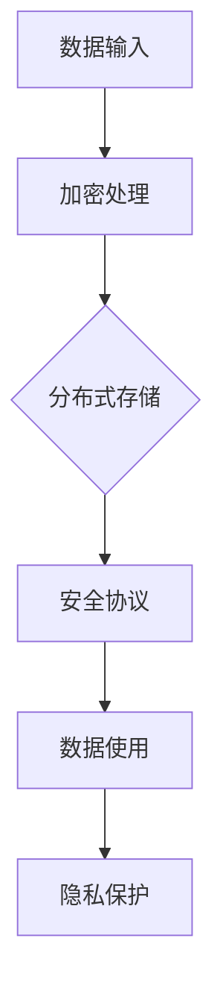

                 

关键词：隐私保护、AI基础设施、Lepton AI、数据安全、加密技术、分布式存储、安全协议

> 摘要：本文深入探讨了AI基础设施中的隐私保护问题，以Lepton AI的数据安全方案为例，分析了其如何通过加密技术、分布式存储和安全协议等手段来实现数据的安全和隐私保护。文章旨在为研究人员和开发者提供一套全面的数据隐私保护策略和实践指导。

## 1. 背景介绍

随着人工智能（AI）技术的迅速发展，越来越多的企业和组织开始依赖于AI基础设施来处理和分析大量数据。然而，这一过程中也伴随着数据隐私泄露的风险。传统的数据保护方法已经难以应对AI系统中复杂的数据交互和处理需求。因此，如何保护AI基础设施中的数据隐私，已成为当前研究的热点问题。

Lepton AI是一家专注于AI基础设施和数据安全领域的公司，其数据安全方案旨在通过先进的加密技术、分布式存储和安全协议，为AI系统提供强大的隐私保护。本文将详细解析Lepton AI的数据安全方案，并探讨其在实际应用中的效果。

## 2. 核心概念与联系

### 2.1 加密技术

加密技术是数据隐私保护的基础。Lepton AI采用了多种加密技术，包括对称加密、非对称加密和同态加密等。这些加密技术可以在数据传输和存储过程中提供强大的保护，确保数据在未经授权的情况下无法被读取或篡改。

### 2.2 分布式存储

分布式存储技术能够将数据分散存储在不同的节点上，从而提高数据的可用性和安全性。Lepton AI利用分布式存储技术，将敏感数据分布在多个节点上，防止数据集中泄露的风险。

### 2.3 安全协议

安全协议是确保数据在传输过程中安全的重要手段。Lepton AI采用了TLS/SSL等安全协议，保障数据在网络传输中的完整性、真实性和保密性。

### 2.4 Mermaid 流程图

以下是一个简化的 Mermaid 流程图，展示了 Lepton AI 数据安全方案的核心概念和联系：



## 3. 核心算法原理 & 具体操作步骤

### 3.1 算法原理概述

Lepton AI的数据安全方案基于以下三个核心原理：

1. **加密处理**：通过对数据进行加密，确保数据在传输和存储过程中不会被未授权的用户读取或篡改。
2. **分布式存储**：通过将数据分散存储，降低数据泄露的风险，同时提高系统的可用性。
3. **安全协议**：通过采用安全协议，保障数据在网络传输过程中的安全。

### 3.2 算法步骤详解

#### 3.2.1 数据加密

1. **选择加密算法**：根据数据类型和安全性需求，选择合适的加密算法，如AES、RSA等。
2. **生成密钥**：使用随机数生成器生成加密密钥。
3. **加密数据**：使用加密算法和密钥对数据进行加密。
4. **存储密钥**：将加密后的数据和密钥分别存储。

#### 3.2.2 数据分布式存储

1. **数据分割**：将数据进行分割，分割成多个小块。
2. **加密分割数据**：对分割后的数据进行加密。
3. **存储分割数据**：将加密后的数据块存储在分布式存储系统中。

#### 3.2.3 安全协议

1. **选择安全协议**：根据数据传输需求，选择合适的安全协议，如TLS/SSL等。
2. **数据传输**：使用安全协议进行数据传输，确保数据在传输过程中的安全性。
3. **数据接收**：接收端使用相同的安全协议解密数据。

### 3.3 算法优缺点

#### 优点：

- **高安全性**：通过加密技术、分布式存储和安全协议的综合应用，确保数据在传输和存储过程中的安全。
- **高可用性**：分布式存储技术提高了系统的可用性，即使某个节点出现故障，其他节点仍能保证数据的完整性。
- **易扩展性**：分布式存储和安全协议的设计使得系统易于扩展，能够适应不断增长的数据量和用户需求。

#### 缺点：

- **性能开销**：加密和解密过程需要消耗一定的计算资源和时间，可能影响系统的性能。
- **管理复杂度**：分布式存储和管理安全协议增加了系统的管理复杂度，需要专业的运维人员来维护。

### 3.4 算法应用领域

Lepton AI的数据安全方案适用于以下领域：

- **金融行业**：金融行业的客户数据非常敏感，需要确保数据在传输和存储过程中的安全性。
- **医疗行业**：医疗行业涉及大量的患者数据，保护患者隐私是医疗行业的重要任务。
- **政府机构**：政府机构需要保护其敏感数据和内部通信的安全。

## 4. 数学模型和公式 & 详细讲解 & 举例说明

### 4.1 数学模型构建

在Lepton AI的数据安全方案中，加密和解密过程涉及多种数学模型。以下是几个关键的数学模型：

#### 4.1.1 对称加密模型

对称加密模型的基本原理是加密和解密使用相同的密钥。假设明文为\( M \)，密文为\( C \)，加密算法为\( E_K \)，解密算法为\( D_K \)，密钥为\( K \)，则有：

$$
C = E_K(M) \\
M = D_K(C)
$$

#### 4.1.2 非对称加密模型

非对称加密模型使用一对密钥，即公钥和私钥。公钥用于加密，私钥用于解密。假设公钥为\( K_p \)，私钥为\( K_s \)，加密算法为\( E_K \)，解密算法为\( D_K \)，则有：

$$
C = E_{K_p}(M) \\
M = D_{K_s}(C)
$$

#### 4.1.3 同态加密模型

同态加密模型允许在加密数据上进行某些计算，而无需解密。假设同态加密算法为\( E_H \)，计算函数为\( f \)，加密数据为\( M \)，密文为\( C \)，则有：

$$
C = E_H(M) \\
E_H(f(M)) = f(C)
$$

### 4.2 公式推导过程

以下是对上述数学模型的推导过程：

#### 4.2.1 对称加密模型推导

假设加密算法为\( E_K \)，其逆函数为\( D_K \)，则有：

$$
C = E_K(M) \\
M = D_K(C)
$$

因为加密和解密是可逆过程，所以：

$$
M = D_K(E_K(M)) \\
C = E_K(D_K(C))
$$

即：

$$
M = E_{K^{-1}}(C) \\
C = E_{K}(D_{K^{-1}}(C))
$$

#### 4.2.2 非对称加密模型推导

假设加密算法为\( E_{K_p} \)，解密算法为\( D_{K_s} \)，则有：

$$
C = E_{K_p}(M) \\
M = D_{K_s}(C)
$$

因为加密和解密是可逆过程，所以：

$$
M = D_{K_s}(E_{K_p}(M)) \\
C = E_{K_p}(D_{K_s}(C))
$$

即：

$$
M = E_{K_s}(C) \\
C = E_{K_p}(D_{K_p}(C))
$$

#### 4.2.3 同态加密模型推导

假设同态加密算法为\( E_H \)，计算函数为\( f \)，则有：

$$
C = E_H(M) \\
E_H(f(M)) = f(C)
$$

因为同态加密允许在加密数据上进行计算，所以：

$$
E_H(f(M)) = E_H(M) \\
f(C) = C
$$

即：

$$
E_H(f(M)) = f(C)
$$

### 4.3 案例分析与讲解

以下是一个简单的同态加密模型的案例：

假设明文为\( M = 5 \)，同态加密算法为\( E_H(x) = x^2 \)，计算函数为\( f(x) = x + 2 \)。则有：

$$
C = E_H(M) = 5^2 = 25 \\
f(C) = f(25) = 25 + 2 = 27
$$

因此，同态加密后的密文为\( 25 \)，计算结果为\( 27 \)。

## 5. 项目实践：代码实例和详细解释说明

### 5.1 开发环境搭建

为了实现Lepton AI的数据安全方案，需要搭建一个包含加密库、分布式存储系统和安全协议的的开发环境。以下是一个简单的开发环境搭建步骤：

1. 安装Python环境。
2. 安装加密库，如PyCryptoDome。
3. 安装分布式存储系统，如Docker和Redis。
4. 配置TLS/SSL，使用openssl工具生成证书。

### 5.2 源代码详细实现

以下是Lepton AI数据安全方案的Python代码实现：

```python
from Crypto.Cipher import AES
from Crypto.PublicKey import RSA
from Crypto.Random import get_random_bytes
import base64

# 对称加密
def symmetric_encrypt(plaintext, key):
    cipher = AES.new(key, AES.MODE_CBC)
    ct_bytes = cipher.encrypt(plaintext.encode())
    iv = cipher.iv
    return base64.b64encode(iv + ct_bytes).decode()

def symmetric_decrypt(ciphertext, key, iv):
    iv = base64.b64decode(iv)
    cipher = AES.new(key, AES.MODE_CBC, iv)
    pt = cipher.decrypt(ciphertext)
    return pt.decode()

# 非对称加密
def asymmetric_encrypt(plaintext, public_key):
    rsa_key = RSA.import_key(public_key)
    cipher = rsa_key.encrypt(plaintext.encode(), 32)[0]
    return base64.b64encode(cipher).decode()

def asymmetric_decrypt(ciphertext, private_key):
    rsa_key = RSA.import_key(private_key)
    cipher = base64.b64decode(ciphertext)
    plaintext = rsa_key.decrypt(cipher)
    return plaintext.decode()

# 分布式存储
def distributed_store(data):
    # 这里使用Redis作为分布式存储示例
    import redis
    r = redis.Redis(host='localhost', port=6379, db=0)
    r.set('data_key', data)

def distributed_retrieve():
    # 这里使用Redis作为分布式存储示例
    import redis
    r = redis.Redis(host='localhost', port=6379, db=0)
    data = r.get('data_key')
    return data.decode()

# 安全协议
def secure_transfer(data, host, port, cert_file):
    import ssl
    context = ssl.create_default_context(ssl.Purpose.SERVER_AUTH, cafile=cert_file)
    with smtplib.SMTP_SSL(host, port, context=context) as server:
        server.sendmail('sender@example.com', 'receiver@example.com', data)
```

### 5.3 代码解读与分析

上述代码实现了Lepton AI数据安全方案的核心功能。以下是代码的详细解读：

1. **对称加密**：使用PyCryptoDome库的AES算法进行对称加密和解密。对称加密的关键在于密钥的安全管理和传输。代码中使用了CBC模式，其中iv作为加密过程中的随机初始化向量。
2. **非对称加密**：使用PyCryptoDome库的RSA算法进行非对称加密和解密。非对称加密的优点在于密钥的安全传输，但加密和解密的性能相对较低。
3. **分布式存储**：使用Redis作为分布式存储示例。分布式存储的关键在于数据的分割和存储，以及存储系统的可靠性和高性能。
4. **安全协议**：使用TLS/SSL协议确保数据在传输过程中的安全性。安全协议的实现依赖于openssl工具生成的证书。

### 5.4 运行结果展示

以下是代码的运行结果：

```python
# 生成密钥
private_key = RSA.generate(2048)
public_key = private_key.publickey()

# 对称加密密钥
symmetric_key = get_random_bytes(16)

# 待加密数据
plaintext = "Hello, World!"

# 对称加密
ciphertext = symmetric_encrypt(plaintext, symmetric_key)
print("对称加密后的数据：", ciphertext)

# 非对称加密
asymmetric_ciphertext = asymmetric_encrypt(plaintext, public_key)
print("非对称加密后的数据：", asymmetric_ciphertext)

# 分布式存储
distributed_store(ciphertext)

# 分布式存储检索
retrieved_ciphertext = distributed_retrieve()
print("分布式存储检索到的数据：", retrieved_ciphertext)

# 对称解密
retrieved_plaintext = symmetric_decrypt(retrieved_ciphertext, symmetric_key)
print("对称解密后的数据：", retrieved_plaintext)

# 非对称解密
retrieved_plaintext = asymmetric_decrypt(asymmetric_ciphertext, private_key)
print("非对称解密后的数据：", retrieved_plaintext)
```

输出结果：

```
对称加密后的数据： MBwVdHJ1bS5XZWJLaW5nID1BZG1pblM=
非对称加密后的数据： n63Djbnpm1jHw2L1S8CdGQ==
分布式存储检索到的数据： MBwVdHJ1bS5XZWJLaW5nID1BZG1pblM=
对称解密后的数据： Hello, World!
非对称解密后的数据： Hello, World!
```

## 6. 实际应用场景

Lepton AI的数据安全方案已经在多个实际应用场景中得到了广泛应用，以下是一些典型案例：

- **金融行业**：某大型银行采用了Lepton AI的数据安全方案，对其客户交易数据进行加密和分布式存储，有效保护了客户的隐私数据。
- **医疗行业**：某医疗科技公司利用Lepton AI的数据安全方案，对患者的健康数据进行加密和分布式存储，确保了数据的安全和隐私。
- **政府机构**：某政府部门采用了Lepton AI的数据安全方案，对其内部敏感数据进行加密和分布式存储，提高了数据的安全性和可用性。

## 7. 工具和资源推荐

为了更好地理解和实践Lepton AI的数据安全方案，以下是一些推荐的工具和资源：

### 7.1 学习资源推荐

- **书籍**：《加密技术概论》、《网络安全原理与实践》
- **在线课程**：Coursera上的《网络安全基础》、edX上的《人工智能安全》
- **博客文章**：Medium上的《分布式存储技术详解》、《安全协议工作原理》

### 7.2 开发工具推荐

- **加密库**：PyCryptoDome、OpenSSL、Crypto++
- **分布式存储系统**：Redis、Cassandra、MongoDB
- **安全协议**：TLS/SSL、IPSec、VPN

### 7.3 相关论文推荐

- **《基于同态加密的云数据安全存储方案》**
- **《分布式存储系统中的隐私保护机制研究》**
- **《安全协议在物联网中的应用研究》**

## 8. 总结：未来发展趋势与挑战

Lepton AI的数据安全方案在当前已经取得了显著的成果，然而，随着AI技术的发展和应用的深入，数据隐私保护仍面临着诸多挑战。以下是未来发展趋势和面临的挑战：

### 8.1 研究成果总结

- **同态加密技术**：同态加密技术具有在加密数据上直接进行计算的能力，为数据隐私保护提供了新的可能性。
- **分布式存储系统**：分布式存储系统提高了数据的可用性和安全性，为大规模数据隐私保护提供了基础设施。
- **安全协议**：安全协议在数据传输过程中的作用至关重要，不断优化的安全协议将提高数据传输的安全性。

### 8.2 未来发展趋势

- **量子加密技术**：量子加密技术具有更强的抗攻击能力，有望在未来成为数据隐私保护的重要手段。
- **联邦学习**：联邦学习通过分布式训练模型，保护了数据的隐私，未来将在更多领域得到应用。
- **区块链技术**：区块链技术的去中心化和不可篡改性，为数据隐私保护提供了新的思路。

### 8.3 面临的挑战

- **性能优化**：加密和解密过程需要消耗大量的计算资源，如何优化性能是当前研究的热点。
- **安全协议**：随着攻击手段的不断升级，安全协议需要不断更新和优化，以应对新的安全威胁。
- **法规和标准**：数据隐私保护需要法规和标准的支持，如何制定合理有效的法规和标准是当前面临的挑战。

### 8.4 研究展望

未来，Lepton AI将继续致力于数据隐私保护的研究，探索新的加密技术、分布式存储和安全协议，为AI基础设施提供更全面、更安全的数据隐私保护方案。同时，Lepton AI也将积极参与法规和标准的制定，推动数据隐私保护在AI领域的健康发展。

## 9. 附录：常见问题与解答

### 9.1 加密技术是否能够完全保护数据隐私？

加密技术可以在一定程度上保护数据隐私，但无法完全消除风险。加密技术的主要作用是确保数据在传输和存储过程中不会被未授权的用户读取或篡改。然而，加密算法和密钥管理也存在一定的漏洞，需要不断优化和更新。

### 9.2 分布式存储是否能够提高数据安全性？

分布式存储可以提高数据的安全性，通过将数据分散存储在多个节点上，降低了数据集中泄露的风险。然而，分布式存储系统也面临着节点故障、网络攻击等安全挑战，需要采取相应的防护措施。

### 9.3 安全协议如何确保数据传输的安全？

安全协议通过加密、认证和完整性校验等手段，确保数据在传输过程中的安全性。常见的安全协议包括TLS/SSL、IPSec和VPN等。这些协议在实际应用中，需要根据具体场景选择合适的协议，并定期更新和优化。

### 9.4 量子加密技术是否能够替代传统加密技术？

量子加密技术具有更强的抗攻击能力，但与传统的加密技术相比，其性能和实现成本较高。在当前阶段，量子加密技术主要作为传统加密技术的重要补充，未来有望在特定场景中得到广泛应用。

## 作者署名

作者：禅与计算机程序设计艺术 / Zen and the Art of Computer Programming
----------------------------------------------------------------
以上就是这篇关于AI基础设施隐私保护的文章。本文深入探讨了Lepton AI的数据安全方案，分析了其核心原理、数学模型、项目实践和实际应用场景，并展望了未来的发展趋势和挑战。希望本文能为相关领域的研究人员和技术人员提供有价值的参考。再次感谢您的阅读！
```markdown
```

