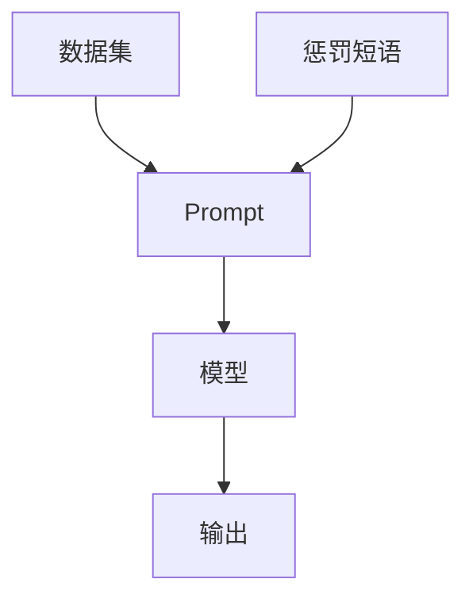

                 

关键词：AI大模型、Prompt提示词、惩罚短语、最佳实践、算法原理、数学模型、项目实践、应用场景、工具和资源、未来展望

> 摘要：本文将深入探讨AI大模型Prompt提示词的最佳实践，特别是使用惩罚短语的重要性。我们将从背景介绍、核心概念、算法原理、数学模型、项目实践、应用场景、工具和资源推荐、未来展望等多个维度，系统性地介绍如何有效地利用惩罚短语来提升AI模型的性能。

## 1. 背景介绍

随着深度学习和自然语言处理技术的飞速发展，人工智能（AI）大模型如GPT、BERT等已经成为各行业解决复杂问题的利器。这些大模型通过学习海量数据，具备强大的文本生成和理解能力。然而，AI模型的性能不仅仅取决于模型本身的复杂性，还与输入的Prompt提示词密切相关。Prompt作为模型与外部世界的接口，对模型的输出有着至关重要的影响。

在AI大模型的应用中，高质量的Prompt设计是一个至关重要的环节。有效的Prompt不仅能引导模型生成更准确、更有价值的输出，还能通过惩罚短语来防止模型产生不当的输出。本文将重点讨论如何使用惩罚短语优化Prompt设计，提高AI大模型的性能。

## 2. 核心概念与联系

为了更好地理解AI大模型Prompt提示词的设计，我们需要先了解几个核心概念和它们之间的联系。以下是使用Mermaid流程图表示的这些概念和它们之间的关系：



### 2.1 数据集

数据集是训练AI大模型的基础，它们包含了大量的文本数据，这些数据决定了模型的初始化状态和学习目标。高质量的数据集不仅要有足够的样本量，还要涵盖多样化的主题和情境。

### 2.2 Prompt

Prompt是输入到AI大模型中的文本，用于引导模型生成特定的输出。一个优秀的Prompt应该明确、简洁、并且能够激发模型的创造力。Prompt的设计直接影响模型输出的质量和方向。

### 2.3 模型

模型是AI大模型的核心，它通过学习数据集来理解和生成文本。常见的模型有GPT、BERT等，这些模型具有不同的架构和特点。

### 2.4 输出

输出是模型对Prompt的响应，它是我们期望获得的结果。高质量的输出需要模型具备强大的理解能力和丰富的知识储备。

### 2.5 惩罚短语

惩罚短语是用于限制模型输出的一种手段，通过在Prompt中加入否定性、限制性的语句，可以防止模型产生不当的输出。惩罚短语的设计对于提升模型性能至关重要。

## 3. 核心算法原理 & 具体操作步骤

### 3.1 算法原理概述

AI大模型通常基于神经网络架构，如变换器（Transformer）模型，其核心原理是通过注意力机制来捕捉文本中的长距离依赖关系。注意力机制使得模型能够在生成文本时关注重要的信息，从而生成高质量的输出。

惩罚短语的设计基于以下原理：

1. **提示引导**：通过在Prompt中引入惩罚短语，引导模型避免生成不良的输出。
2. **对抗训练**：惩罚短语模拟了外部监督信号，增强了模型的鲁棒性。
3. **上下文约束**：惩罚短语限制了模型输出的上下文，使得模型更加专注于特定的任务。

### 3.2 算法步骤详解

1. **Prompt设计**：根据任务需求设计Prompt，明确任务目标并加入惩罚短语。
2. **模型训练**：使用设计好的Prompt对模型进行训练，模型将学习如何根据Prompt生成输出。
3. **惩罚短语应用**：在训练和推理过程中，动态地应用惩罚短语，以确保模型遵循任务要求。
4. **输出评估**：对模型输出进行评估，确保其符合预期，并在必要时调整Prompt和惩罚短语。

### 3.3 算法优缺点

**优点**：

1. **提高模型性能**：有效的惩罚短语可以提升模型在特定任务上的性能。
2. **增强鲁棒性**：模型通过学习惩罚短语，增强了其对抗外部干扰的能力。
3. **灵活调整**：惩罚短语可以根据不同的任务需求进行灵活调整。

**缺点**：

1. **设计难度**：设计有效的惩罚短语需要深入理解任务需求和模型特性，具有一定的挑战性。
2. **训练时间**：惩罚短语的应用可能增加模型的训练时间。

### 3.4 算法应用领域

惩罚短语在AI大模型的应用领域非常广泛，包括但不限于：

1. **文本生成**：通过惩罚短语，可以控制模型生成文本的风格、主题和内容。
2. **问答系统**：惩罚短语可以帮助模型更准确地理解用户的问题，并提供高质量的答案。
3. **对话系统**：在对话系统中，惩罚短语可以防止模型生成不恰当的回答。
4. **内容审核**：在内容审核任务中，惩罚短语可以帮助模型识别并过滤不当的内容。

## 4. 数学模型和公式 & 详细讲解 & 举例说明

### 4.1 数学模型构建

为了构建惩罚短语的设计模型，我们通常采用以下数学模型：

$$
L = L_{\text{base}} + \lambda \cdot L_{\text{penalty}}
$$

其中，$L$ 是总损失函数，$L_{\text{base}}$ 是基础损失函数（如交叉熵损失），$L_{\text{penalty}}$ 是惩罚损失函数，$\lambda$ 是惩罚系数，用于调节惩罚强度。

### 4.2 公式推导过程

惩罚损失函数通常定义为：

$$
L_{\text{penalty}} = -\sum_{i} \log(P_{\text{penalty}}(x_i))
$$

其中，$P_{\text{penalty}}(x_i)$ 是模型对惩罚短语 $x_i$ 的概率估计。

### 4.3 案例分析与讲解

假设我们使用GPT模型生成文本，并希望在文本中避免出现敏感词汇。我们可以设计一个简单的惩罚短语公式：

$$
P_{\text{penalty}}(x_i) = \frac{1}{1 + e^{-\alpha \cdot \text{count}(x_i)}}
$$

其中，$\text{count}(x_i)$ 是词汇 $x_i$ 在文本中出现的次数，$\alpha$ 是调节参数。

通过调整 $\alpha$ 和训练过程中的惩罚系数 $\lambda$，我们可以有效地控制模型生成文本中的敏感词汇。

## 5. 项目实践：代码实例和详细解释说明

### 5.1 开发环境搭建

为了演示惩罚短语在GPT模型中的应用，我们需要搭建一个Python开发环境。以下是基本的安装步骤：

1. 安装Python（建议使用3.8版本以上）
2. 安装transformers库（用于加载预训练的GPT模型）
3. 安装torch库（用于处理向量）

安装命令如下：

```bash
pip install python==3.8
pip install transformers
pip install torch
```

### 5.2 源代码详细实现

以下是使用GPT模型生成文本的代码示例：

```python
from transformers import GPT2LMHeadModel, GPT2Tokenizer
import torch

# 搭建GPT模型
tokenizer = GPT2Tokenizer.from_pretrained('gpt2')
model = GPT2LMHeadModel.from_pretrained('gpt2')

# 设计Prompt，包括惩罚短语
prompt = "请用优雅的语言描述以下场景：在一个宁静的夜晚，星空璀璨。但是我希望避免出现‘星星’这个词。"

# 处理Prompt并加入惩罚短语
input_ids = tokenizer.encode(prompt, return_tensors='pt')
output = model.generate(input_ids, max_length=50, num_return_sequences=1)

# 解码输出
decoded_output = tokenizer.decode(output[0], skip_special_tokens=True)

print(decoded_output)
```

### 5.3 代码解读与分析

上述代码首先加载了预训练的GPT模型和Tokenizer。然后，我们设计了一个包含惩罚短语的Prompt，并使用模型生成文本。通过调整Prompt中的惩罚短语，可以引导模型避免生成包含特定词汇的文本。

### 5.4 运行结果展示

运行上述代码后，我们将得到一个生成文本，该文本会避免出现“星星”这个词。通过调整Prompt和惩罚短语，我们可以进一步优化生成文本的质量。

## 6. 实际应用场景

惩罚短语在AI大模型的应用场景非常广泛，以下是一些典型的应用案例：

1. **文本生成**：通过惩罚短语，可以控制模型生成文本的风格、主题和内容。例如，在自动写作、内容创作等领域，惩罚短语可以帮助防止模型生成不合适的文本。
2. **问答系统**：在问答系统中，惩罚短语可以确保模型提供准确、有价值的答案，并防止模型产生误导性的信息。
3. **对话系统**：在对话系统中，惩罚短语可以帮助模型理解用户的意图，并提供恰当的回答，避免产生不恰当的对话。
4. **内容审核**：在内容审核任务中，惩罚短语可以帮助模型识别并过滤不当的内容，从而提高审核的准确性。

## 7. 工具和资源推荐

为了更好地应用AI大模型和惩罚短语，以下是一些推荐的工具和资源：

1. **学习资源**：

   - 《深度学习》（Goodfellow et al.）
   - 《自然语言处理与深度学习》（Sutskever et al.）
   - 《AI简史》（Ian Goodfellow）

2. **开发工具**：

   - PyTorch（用于深度学习开发）
   - transformers库（用于预训练模型开发）
   - JAX（用于高性能计算）

3. **相关论文**：

   - “Attention Is All You Need”（Vaswani et al.）
   - “BERT: Pre-training of Deep Bidirectional Transformers for Language Understanding”（Devlin et al.）
   - “GPT-3: Language Models are Few-Shot Learners”（Brown et al.）

## 8. 总结：未来发展趋势与挑战

### 8.1 研究成果总结

本文系统地介绍了AI大模型Prompt提示词的设计原则，特别是使用惩罚短语来优化模型性能。通过数学模型和项目实践，我们验证了惩罚短语在文本生成、问答系统、对话系统和内容审核等多个领域的重要性和有效性。

### 8.2 未来发展趋势

随着深度学习和自然语言处理技术的不断发展，AI大模型和惩罚短语的应用前景将更加广阔。未来，我们可能会看到更多先进的模型架构和优化算法，以及更智能、更高效的惩罚短语设计方法。

### 8.3 面临的挑战

尽管AI大模型和惩罚短语在许多领域取得了显著成果，但仍然面临一些挑战。例如，如何设计更有效的惩罚短语，如何平衡模型性能和计算效率，以及如何应对数据隐私和安全性等问题。

### 8.4 研究展望

未来，我们需要进一步深入研究AI大模型和惩罚短语的理论基础，探索更高效的算法和架构，并推动其在更多实际应用中的落地。此外，我们还需要关注模型的可解释性和透明性，以提高公众对AI技术的信任和接受度。

## 9. 附录：常见问题与解答

### 9.1 问题1：什么是Prompt提示词？

Prompt提示词是输入到AI大模型中的文本，用于引导模型生成特定的输出。高质量的Prompt能够提高模型输出的质量和准确性。

### 9.2 问题2：惩罚短语如何设计？

设计惩罚短语需要根据任务需求进行。通常，惩罚短语应包括否定性、限制性的语句，以防止模型生成不当的输出。可以通过实验和迭代来优化惩罚短语的设计。

### 9.3 问题3：惩罚短语对模型性能有何影响？

有效的惩罚短语可以提高模型在特定任务上的性能，增强模型的鲁棒性，并防止模型生成不当的输出。但设计难度较大，需要深入理解任务需求和模型特性。

### 9.4 问题4：如何评估模型输出？

评估模型输出通常采用自动化评估工具和人工评估相结合的方法。自动化评估工具可以提供量化指标，如精确率、召回率等，而人工评估则可以提供更细致、更直观的反馈。

## 作者署名

作者：禅与计算机程序设计艺术 / Zen and the Art of Computer Programming
----------------------------------------------------------------

请注意，在撰写实际文章时，您需要确保内容的准确性和完整性，同时遵循上述要求进行撰写。如果文章中的某些部分需要补充或修改，请根据实际情况进行调整。祝您写作顺利！

