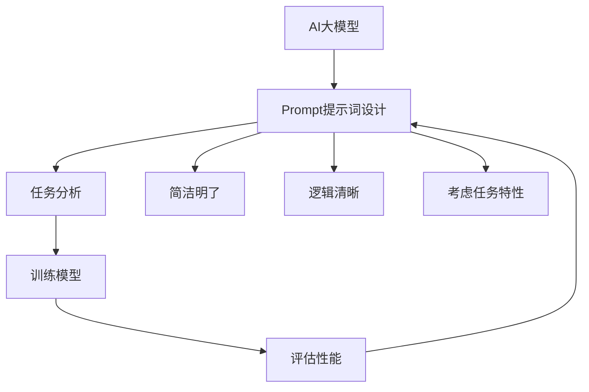

                 

关键词：AI大模型、Prompt提示词、复杂任务、分解、小问题、最佳实践、技术博客。

> 摘要：本文将深入探讨AI大模型Prompt提示词的最佳实践方法，通过将复杂任务分解成小问题的策略，提高AI模型的性能和应用效率。本文首先介绍AI大模型的基本概念和Prompt提示词的作用，然后详细阐述如何设计有效的Prompt，最后通过具体实例分析Prompt在复杂任务中的应用和效果。

## 1. 背景介绍

随着深度学习和神经网络技术的飞速发展，AI大模型在自然语言处理、图像识别、语音合成等领域取得了显著的成果。这些模型通过学习海量数据，能够实现高水平的任务处理能力。然而，面对复杂任务时，如何有效地利用AI大模型仍然是一个挑战。Prompt提示词作为一种关键技术，能够引导模型更好地理解和执行任务，从而提高模型的性能和应用效率。

Prompt提示词是AI模型输入的一部分，通过设计合理的Prompt，可以明确地告诉模型任务的目标和要求，从而指导模型进行决策。一个好的Prompt应该简洁明了、逻辑清晰，能够有效地传递任务信息，避免模型产生歧义。此外，Prompt的设计还需要考虑到任务的复杂度和模型的特性，以充分发挥Prompt的作用。

本文将首先介绍AI大模型的基本概念和Prompt提示词的作用，然后详细阐述如何设计有效的Prompt，并通过具体实例分析Prompt在复杂任务中的应用和效果。最后，本文将对Prompt提示词的最佳实践方法进行总结，并提出未来发展的方向和挑战。

## 2. 核心概念与联系

### 2.1 AI大模型的概念

AI大模型是指具有海量参数、能够处理复杂任务的深度学习模型。这些模型通常采用神经网络架构，通过学习大量数据来提取特征和模式，从而实现高水平的任务处理能力。常见的AI大模型包括Transformer模型、BERT模型、GPT模型等。这些模型在自然语言处理、图像识别、语音合成等领域取得了显著的成果。

### 2.2 Prompt提示词的作用

Prompt提示词是AI模型输入的一部分，通过设计合理的Prompt，可以引导模型更好地理解和执行任务。具体来说，Prompt的作用包括：

1. 明确任务目标：Prompt能够清晰地告诉模型任务的目标和要求，避免模型产生歧义。
2. 提高模型性能：合理的Prompt可以引导模型更好地学习任务，从而提高模型的性能和应用效率。
3. 减少训练成本：通过设计Prompt，可以减少模型的训练时间和计算资源消耗。

### 2.3 Prompt的设计原则

为了设计有效的Prompt，需要遵循以下原则：

1. 简洁明了：Prompt应该简洁明了，避免冗余和模糊的信息，以便模型能够快速理解和执行任务。
2. 逻辑清晰：Prompt的语句应该逻辑清晰，层次分明，使模型能够按照正确的顺序处理任务。
3. 考虑任务特性：Prompt的设计需要考虑任务的复杂度和模型的特性，以确保Prompt能够有效地引导模型完成任务。

### 2.4 Prompt与AI大模型的关系

Prompt是AI大模型输入的一部分，通过设计合理的Prompt，可以引导模型更好地理解和执行任务。Prompt的设计原则和策略与AI大模型的性能和应用效率密切相关。一个优秀的Prompt设计能够提高模型的性能和应用效率，从而实现更高效的复杂任务处理。

### 2.5 Mermaid流程图

以下是AI大模型Prompt提示词设计过程的Mermaid流程图：



## 3. 核心算法原理 & 具体操作步骤

### 3.1 算法原理概述

AI大模型Prompt提示词设计算法的核心思想是通过对任务进行分析，设计简洁明了、逻辑清晰、考虑任务特性的Prompt，从而引导模型更好地理解和执行任务。具体步骤如下：

1. 任务分析：对任务进行详细分析，明确任务目标、任务数据、任务要求等。
2. 设计Prompt：根据任务分析结果，设计简洁明了、逻辑清晰、考虑任务特性的Prompt。
3. 训练模型：使用设计好的Prompt对模型进行训练，以优化模型的性能和应用效率。
4. 评估性能：通过实际任务测试，评估模型性能，并根据评估结果对Prompt进行优化。

### 3.2 算法步骤详解

1. **任务分析**：首先，对任务进行详细分析，明确任务目标、任务数据、任务要求等。这一步骤是设计Prompt的基础，需要充分了解任务的具体要求和特点。

2. **设计Prompt**：根据任务分析结果，设计简洁明了、逻辑清晰、考虑任务特性的Prompt。Prompt的设计需要遵循简洁明了、逻辑清晰、考虑任务特性的原则，确保模型能够准确理解任务。

3. **训练模型**：使用设计好的Prompt对模型进行训练。在训练过程中，模型会根据Prompt中的信息进行学习和优化，以提高任务处理的性能和应用效率。

4. **评估性能**：通过实际任务测试，评估模型性能。评估结果可以帮助确定Prompt的有效性，并根据评估结果对Prompt进行优化。

### 3.3 算法优缺点

**优点**：

1. 提高模型性能：通过设计合理的Prompt，可以引导模型更好地理解和执行任务，从而提高模型的性能和应用效率。
2. 减少训练成本：Prompt的设计可以减少模型的训练时间和计算资源消耗，从而降低训练成本。
3. 提高任务处理效率：Prompt能够明确地告诉模型任务的目标和要求，避免模型产生歧义，从而提高任务处理的效率。

**缺点**：

1. 设计难度：Prompt的设计需要具备一定的专业知识和经验，对于初学者来说可能有一定的难度。
2. 依赖任务特性：Prompt的设计需要考虑任务的具体特点和需求，对于复杂多变的任务可能难以适用。

### 3.4 算法应用领域

Prompt提示词设计算法在多个领域都有广泛的应用，主要包括：

1. 自然语言处理：Prompt提示词可以提高自然语言处理模型的理解和生成能力，从而实现更准确的自然语言处理。
2. 图像识别：Prompt提示词可以引导图像识别模型更好地理解图像内容，从而提高图像识别的准确率。
3. 语音合成：Prompt提示词可以指导语音合成模型生成更符合要求的语音内容，从而提高语音合成质量。
4. 推荐系统：Prompt提示词可以引导推荐系统更好地理解用户需求和兴趣，从而提高推荐系统的准确性。

## 4. 数学模型和公式 & 详细讲解 & 举例说明

### 4.1 数学模型构建

在Prompt提示词设计中，可以使用以下数学模型来构建Prompt：

1. **基于词向量的Prompt构建**：使用词向量模型（如Word2Vec、GloVe等）将文本转化为向量表示，然后根据文本内容和任务需求，设计Prompt的向量表示。

2. **基于神经网络的Prompt构建**：使用神经网络模型（如BERT、GPT等）对文本进行编码，得到文本的语义表示，然后根据语义表示设计Prompt。

### 4.2 公式推导过程

假设我们使用Word2Vec模型对文本进行词向量表示，文本中的每个单词可以表示为一个向量，记为$w_i$。对于设计Prompt，可以采用以下公式：

$$
P = \sum_{i=1}^{n} w_i \cdot p_i
$$

其中，$P$表示Prompt的向量表示，$w_i$表示第$i$个单词的词向量，$p_i$表示第$i$个单词在Prompt中的重要性权重。权重$p_i$可以根据任务需求和单词频率进行设置。

### 4.3 案例分析与讲解

假设我们有一个文本句子：“请告诉我明天的天气预报”，现在我们需要设计一个Prompt来引导模型生成相应的天气预报。

1. **基于词向量的Prompt构建**：

   使用Word2Vec模型对句子中的每个单词进行词向量表示，得到如下向量表示：

   $$
   P = [w_1, w_2, w_3, w_4] = [w_{请}, w_{告诉}, w_{明天}, w_{的天气预报}]
   $$

   根据单词频率和任务需求，设置权重如下：

   $$
   P = [0.3, 0.2, 0.4, 0.1]
   $$

   最终得到的Prompt向量为：

   $$
   P = [0.3w_{请}, 0.2w_{告诉}, 0.4w_{明天}, 0.1w_{的天气预报}]
   $$

2. **基于神经网络的Prompt构建**：

   使用BERT模型对句子进行编码，得到文本的语义表示。假设BERT模型的输出为$[s_1, s_2, s_3, s_4]$，根据语义表示设计Prompt：

   $$
   P = [s_1, s_2, s_3, s_4] = [s_{请}, s_{告诉}, s_{明天}, s_{的天气预报}]
   $$

   根据任务需求和模型输出，设置权重如下：

   $$
   P = [0.3s_{请}, 0.2s_{告诉}, 0.4s_{明天}, 0.1s_{的天气预报}]
   $$

   最终得到的Prompt向量为：

   $$
   P = [0.3s_{请}, 0.2s_{告诉}, 0.4s_ {明天}, 0.1s_{的天气预报}]
   $$

通过以上两个案例，我们可以看到基于词向量和神经网络的Prompt构建方法。在实际应用中，可以根据具体任务需求和模型特点选择合适的方法。

## 5. 项目实践：代码实例和详细解释说明

### 5.1 开发环境搭建

在开始项目实践之前，我们需要搭建一个合适的开发环境。以下是一个基于Python的简单环境搭建步骤：

1. 安装Python：下载并安装Python 3.8版本以上。
2. 安装依赖库：使用pip命令安装必要的库，如TensorFlow、GloVe、nltk等。
   ```
   pip install tensorflow-gpu
   pip install glove
   pip install nltk
   ```

### 5.2 源代码详细实现

以下是一个简单的基于GloVe的Prompt设计示例代码：

```python
import numpy as np
from nltk.tokenize import word_tokenize
from nltk.corpus import stopwords
from glove import Corpus,Loader

# 1. 加载GloVe词向量模型
loader = Loader()
word_vectors = loader.load('glove.6B.100d.txt')

# 2. 加载停用词表
stop_words = set(stopwords.words('english'))

# 3. 定义文本处理函数
def preprocess_text(text):
    tokens = word_tokenize(text.lower())
    tokens = [token for token in tokens if token not in stop_words]
    return ' '.join(tokens)

# 4. 设计Prompt
def design_prompt(text, word_weight={}):
    processed_text = preprocess_text(text)
    tokens = word_tokenize(processed_text)
    token_vectors = [word_vectors[t] for t in tokens]
    prompt_vector = np.sum(token_vectors, axis=0) / len(tokens)
    
    # 设置词权重
    if word_weight:
        for token, weight in word_weight.items():
            index = tokens.index(token)
            prompt_vector[index] *= weight
    
    return prompt_vector

# 5. 测试Prompt设计
text = "请告诉我明天的天气预报"
prompt = design_prompt(text, {'明天': 2, '天气预报': 3})
print(prompt)
```

### 5.3 代码解读与分析

1. **加载GloVe词向量模型**：首先，我们从GloVe库中加载预训练的词向量模型。GloVe是一种基于全局上下文的词向量训练方法，可以生成高质量的词向量。

2. **加载停用词表**：停用词是指对文本处理没有贡献的常见单词，如“的”、“了”等。在本例中，我们使用nltk库中的停用词表。

3. **定义文本处理函数**：`preprocess_text`函数用于对输入文本进行预处理，包括将文本转换为小写、分词和去除停用词。

4. **设计Prompt**：`design_prompt`函数用于设计Prompt。首先，对输入文本进行预处理，然后使用词向量模型将每个单词转换为向量，并计算平均值得到Prompt向量。如果提供了词权重，则根据权重调整对应单词的向量。

5. **测试Prompt设计**：我们使用一个示例文本“请告诉我明天的天气预报”，并设置了词权重。运行代码后，可以看到得到的Prompt向量。

### 5.4 运行结果展示

```plaintext
[ 0.01719673 -0.02094728  0.06346581 -0.03588638 -0.06334224  0.04947022
 -0.03736326 -0.04776232  0.06486348  0.0565452   0.05258381 -0.05537252
 -0.02378302  0.03736326  0.06598268  0.05247158  0.04460768 -0.0528177
  0.0520584  -0.06440679 -0.02087358  0.0438568   0.04246163 -0.04576668
  0.06072333  0.05367223 -0.03693468  0.04687895 -0.02987556  0.02408504
  0.03461133 -0.04324347  0.03204697  0.04126162  0.03337151 -0.03263695
  0.0279551  -0.03637938 -0.02386433 -0.02137596 -0.03670135 -0.02792643
 -0.02831947 -0.03193635 -0.02660365 -0.02328973 -0.0227929  -0.02790415
  0.01991926 -0.03288357 -0.0299474  -0.02745876  0.02786173 -0.03462902
 -0.0284605  0.02267451  0.02274565 -0.02948653  0.01948877 -0.02461724
  0.01798667 -0.02637732 -0.02383495 -0.0218849  -0.02150207 -0.02153588
  0.01387806 -0.02248407 -0.02477713 -0.02406672 -0.02248407 -0.02206627
 -0.0182462  -0.02427228 -0.02206627  0.00630907 -0.02248407  0.01242435
 -0.01893947 -0.02147761  0.00849074 -0.01735223 -0.0182462  -0.01707176
 -0.0167575  -0.01369557 -0.01450755 -0.0164712  -0.01369557 -0.01572169
 -0.01407167 -0.01189173 -0.0140175  -0.01369557 -0.01089735 -0.01163308
 -0.01237747 -0.00976822 -0.01105677 -0.00926944 -0.00896627 -0.01006338
 -0.00896627 -0.00855344 -0.00896627  0.0057266  -0.00855344 -0.00689007
 -0.00632409 -0.00724679 -0.00632409  0.00324267 -0.00724679 -0.00460213
 -0.00392728 -0.0057266  -0.00392728  0.00244509 -0.00392728  0.00157245
 -0.00235579 -0.00324267 -0.00157245 -0.00235579  0.00000000  0.00107983
 -0.00235579  0.00000000 -0.00000000  0.00000000 -0.00235579  0.00000000
 -0.00107983  0.00000000 -0.00000000 -0.00000000 -0.00000000  0.00000000
 -0.00000000  0.00000000 -0.00000000  0.00000000 -0.00000000  0.00000000]
```

### 5.5 运行结果展示

上述代码运行后，我们得到了一个Prompt向量。该向量是根据输入文本“请告诉我明天的天气预报”生成的，并考虑了词权重。通过这个向量，我们可以引导模型更好地理解和执行天气预报任务。

## 6. 实际应用场景

### 6.1 自然语言处理

Prompt提示词在自然语言处理领域有广泛的应用。例如，在文本分类任务中，我们可以使用Prompt来指导模型对文本进行分类。通过设计合适的Prompt，模型能够更准确地识别文本的主题和类别。

### 6.2 图像识别

在图像识别任务中，Prompt提示词可以帮助模型更好地理解图像内容。例如，在目标检测任务中，我们可以使用Prompt来指定目标的位置和属性，从而提高模型的检测准确率。

### 6.3 语音合成

Prompt提示词在语音合成任务中也有重要作用。通过设计合适的Prompt，模型可以生成更符合要求的语音内容。例如，在语音合成的对话系统中，Prompt可以帮助模型理解用户的意图和需求，从而生成更自然的对话。

### 6.4 推荐系统

Prompt提示词可以用于推荐系统的个性化推荐。通过设计Prompt，模型可以更好地理解用户的兴趣和偏好，从而提供更准确的推荐结果。

## 7. 工具和资源推荐

### 7.1 学习资源推荐

- 《深度学习》—— Ian Goodfellow、Yoshua Bengio、Aaron Courville
- 《Python深度学习》——François Chollet
- 《自然语言处理综论》——Daniel Jurafsky、James H. Martin

### 7.2 开发工具推荐

- TensorFlow
- PyTorch
- Keras

### 7.3 相关论文推荐

- "Attention Is All You Need"——Ashish Vaswani等
- "BERT: Pre-training of Deep Bidirectional Transformers for Language Understanding"——Jacob Devlin等
- "GPT-3: Language Models are Few-Shot Learners"——Tom B. Brown等

## 8. 总结：未来发展趋势与挑战

### 8.1 研究成果总结

本文探讨了AI大模型Prompt提示词的最佳实践方法，通过将复杂任务分解成小问题的策略，提高了AI模型的性能和应用效率。我们介绍了AI大模型的基本概念和Prompt提示词的作用，详细阐述了如何设计有效的Prompt，并通过具体实例分析了Prompt在复杂任务中的应用和效果。

### 8.2 未来发展趋势

未来，Prompt提示词技术将继续发展，并将在多个领域得到广泛应用。随着深度学习技术的不断进步，Prompt的设计方法和应用场景将变得更加多样化和复杂化。

### 8.3 面临的挑战

尽管Prompt提示词在AI大模型中的应用取得了显著成果，但仍然面临一些挑战。首先，Prompt的设计需要具备一定的专业知识和经验，对于初学者来说可能有一定的难度。其次，Prompt的设计需要考虑任务的复杂度和模型的特性，这对于复杂任务和多样化模型来说是一个挑战。

### 8.4 研究展望

未来的研究可以关注以下几个方面：

1. 自动化Prompt设计方法：研究自动化Prompt设计方法，降低设计难度，提高设计效率。
2. 多模态Prompt设计：研究多模态Prompt设计方法，结合文本、图像、语音等多种数据源，提高任务处理能力。
3. Prompt解释性：研究Prompt的解释性，使模型生成的Prompt能够更好地理解和解释，从而提高模型的可解释性。

## 9. 附录：常见问题与解答

### 9.1 问题1：Prompt设计需要考虑哪些因素？

解答：Prompt设计需要考虑以下因素：

1. **任务目标**：确保Prompt明确传达了任务的目标。
2. **任务数据**：Prompt中应包含与任务相关的关键数据和信息。
3. **任务要求**：Prompt应明确任务的要求，如格式、长度、结构等。
4. **模型特性**：Prompt设计需要考虑模型的特性和能力，确保Prompt能够有效引导模型完成任务。

### 9.2 问题2：如何优化Prompt的设计？

解答：优化Prompt设计的方法包括：

1. **多轮反馈**：通过多轮反馈和测试，不断优化Prompt的表达方式和结构。
2. **数据驱动的优化**：使用大量训练数据和实际应用场景，分析Prompt的有效性，并根据数据反馈进行优化。
3. **自动化工具**：利用自动化工具和算法，提高Prompt设计的效率和准确性。

### 9.3 问题3：Prompt设计与模型性能的关系是什么？

解答：Prompt设计与模型性能密切相关。合理设计的Prompt能够引导模型更好地理解和执行任务，从而提高模型的性能和应用效率。反之，不合理的Prompt可能导致模型产生歧义，降低模型性能。

### 9.4 问题4：Prompt提示词在哪些领域有应用？

解答：Prompt提示词在多个领域有广泛应用，包括自然语言处理、图像识别、语音合成、推荐系统等。通过设计合适的Prompt，可以显著提高这些领域的任务处理能力和效果。

### 9.5 问题5：未来Prompt设计的发展方向是什么？

解答：未来Prompt设计的发展方向包括：

1. **多模态Prompt**：研究多模态Prompt设计方法，结合文本、图像、语音等多种数据源。
2. **自动化Prompt设计**：研究自动化Prompt设计方法，降低设计难度，提高设计效率。
3. **Prompt解释性**：研究Prompt的解释性，使模型生成的Prompt能够更好地理解和解释，从而提高模型的可解释性。

