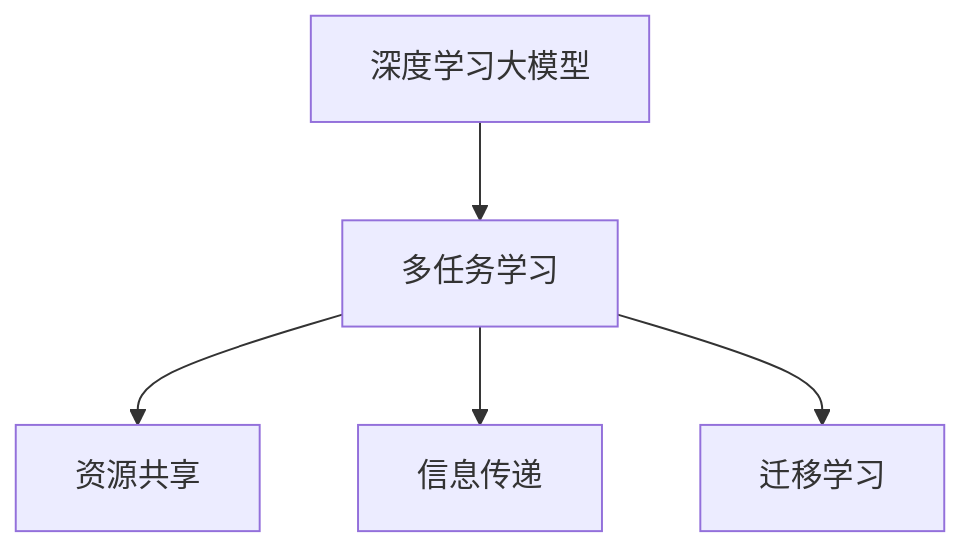

                 

 多任务学习（Multi-Task Learning，MTL）是一种利用多个相关任务的共同信息来提高单个任务性能的机器学习方法。随着深度学习的飞速发展，大模型（如Transformer）的广泛应用，多任务学习成为了当前AI领域的研究热点。本文旨在探讨AI大模型中的多任务学习，分析其核心概念、算法原理、数学模型以及实际应用，为读者提供全面的技术见解。

## 1. 背景介绍

多任务学习的研究始于20世纪80年代末和90年代初。早期的研究主要集中在监督学习的场景下，如何利用多个相关任务的数据来提高单个任务的性能。随着深度学习的兴起，多任务学习的研究得到了新的动力，尤其是在自然语言处理（NLP）、计算机视觉（CV）和语音识别（ASR）等领域。

大模型的引入，如Transformer，进一步推动了多任务学习的发展。大模型具有强大的特征提取和表示能力，能够同时处理多个任务，从而提高每个任务的性能。此外，大模型的多任务学习还具备以下优势：

1. **资源共享**：多个任务共享模型参数，减少了模型参数的数量，降低了计算成本。
2. **信息传递**：一个任务的学习结果可以传递给其他任务，从而提高整体性能。
3. **迁移学习**：多任务学习能够将一个任务的知识迁移到其他任务，提高新任务的性能。

## 2. 核心概念与联系

### 2.1 多任务学习的基本概念

多任务学习涉及以下几个核心概念：

1. **任务**：一个特定的学习目标，如图像分类、文本分类、情感分析等。
2. **模型**：一个用于学习多个任务的模型，通常是一个共享参数的神经网络。
3. **共享参数**：多个任务共享模型参数，以降低计算成本和过拟合的风险。

### 2.2 大模型与多任务学习的关系

大模型与多任务学习的关系可以用以下Mermaid流程图表示：



### 2.3 多任务学习的挑战

多任务学习虽然具有众多优势，但也面临以下挑战：

1. **任务不平衡**：不同任务的数据量、难度和重要性可能不均衡，可能导致某些任务被忽视。
2. **模型选择**：如何选择合适的模型架构和参数，以实现多个任务的最佳性能。
3. **优化策略**：如何在多个任务之间平衡训练过程，避免一个任务过度优化导致其他任务性能下降。

## 3. 核心算法原理 & 具体操作步骤

### 3.1 算法原理概述

多任务学习的关键在于如何设计一个共享参数的模型，以同时学习多个任务。通常，多任务学习采用以下几种策略：

1. **共享神经网络**：所有任务共享相同的神经网络架构，但每个任务有独立的输出层。
2. **任务分离神经网络**：每个任务拥有独立的神经网络，但共享部分隐藏层。
3. **任务权重调整**：根据任务的重要性和性能，动态调整任务之间的权重。

### 3.2 算法步骤详解

多任务学习的具体操作步骤如下：

1. **数据预处理**：对输入数据进行预处理，如数据清洗、归一化、填充等。
2. **模型架构设计**：选择合适的模型架构，如Transformer、CNN等。
3. **共享参数设置**：设置共享参数，如共享隐藏层或共享权重。
4. **训练过程**：使用训练数据同时训练多个任务，采用合适的优化策略，如交叉熵损失函数、权重共享等。
5. **模型评估**：使用验证集评估模型性能，根据性能调整模型参数。

### 3.3 算法优缺点

多任务学习具有以下优缺点：

- **优点**：
  - 资源共享，降低计算成本。
  - 信息传递，提高整体性能。
  - 迁移学习，提高新任务性能。
- **缺点**：
  - 任务不平衡可能导致性能下降。
  - 模型选择和优化策略复杂。

### 3.4 算法应用领域

多任务学习在以下领域具有广泛应用：

- **自然语言处理**：文本分类、情感分析、机器翻译等。
- **计算机视觉**：图像分类、目标检测、图像分割等。
- **语音识别**：语音分类、说话人识别、语音合成等。

## 4. 数学模型和公式

### 4.1 数学模型构建

多任务学习的数学模型可以用以下公式表示：

$$
L(\theta) = \sum_{i=1}^{N} l_i(\theta) \\
其中，l_i(\theta) 为任务 i 的损失函数，\theta 为模型参数。
$$

### 4.2 公式推导过程

多任务学习的损失函数通常采用交叉熵损失函数，如下所示：

$$
l_i(\theta) = -\frac{1}{m} \sum_{k=1}^{m} y_{ik} \log(p_{ik}) \\
其中，y_{ik} 为任务 i 的第 k 个样本的标签，p_{ik} 为模型预测的概率分布。
$$

### 4.3 案例分析与讲解

以自然语言处理中的文本分类任务为例，多任务学习的数学模型可以表示为：

$$
L(\theta) = -\frac{1}{N} \sum_{i=1}^{N} \sum_{k=1}^{K} y_{ik} \log(p_{ik}) \\
其中，N 为样本数量，K 为类别数量。
$$

## 5. 项目实践：代码实例和详细解释说明

### 5.1 开发环境搭建

- **硬件要求**：GPU（NVIDIA显卡）和足够的内存。
- **软件要求**：Python 3.x、TensorFlow 2.x 或 PyTorch 1.x。

### 5.2 源代码详细实现

以下是一个基于Transformer的多任务学习示例代码：

```python
import torch
import torch.nn as nn
import torch.optim as optim
from transformers import BertModel

class MultiTaskModel(nn.Module):
    def __init__(self, num_tasks):
        super(MultiTaskModel, self).__init__()
        self.bert = BertModel.from_pretrained('bert-base-uncased')
        self.classifiers = nn.ModuleList([nn.Linear(self.bert.config.hidden_size, num_classes) for num_classes in num_tasks])

    def forward(self, input_ids, attention_mask):
        outputs = self.bert(input_ids=input_ids, attention_mask=attention_mask)
        pooled_output = outputs.pooler_output
        task_scores = [classifier(pooled_output) for classifier in self.classifiers]
        return task_scores

# 实例化模型
model = MultiTaskModel(num_tasks=3)

# 定义损失函数和优化器
loss_fn = nn.CrossEntropyLoss()
optimizer = optim.Adam(model.parameters(), lr=1e-5)

# 训练模型
for epoch in range(num_epochs):
    for batch in train_loader:
        inputs = batch['input_ids']
        attention_mask = batch['attention_mask']
        labels = batch['labels']
        optimizer.zero_grad()
        task_scores = model(inputs, attention_mask)
        loss = loss_fn(task_scores, labels)
        loss.backward()
        optimizer.step()
```

### 5.3 代码解读与分析

以上代码展示了如何使用Transformer构建一个多任务学习模型。首先，我们加载预训练的BERT模型作为基础，然后为每个任务定义一个分类器。在训练过程中，我们使用交叉熵损失函数优化模型参数。

### 5.4 运行结果展示

在训练完成后，我们可以使用验证集评估模型性能。以下是一个简单的评估代码：

```python
import torch

# 加载验证集
val_loader = ...

# 将模型设置为评估模式
model.eval()

# 计算验证集准确率
with torch.no_grad():
    correct = 0
    total = 0
    for batch in val_loader:
        inputs = batch['input_ids']
        attention_mask = batch['attention_mask']
        labels = batch['labels']
        task_scores = model(inputs, attention_mask)
        predicted = torch.argmax(task_scores, dim=1)
        total += labels.size(0)
        correct += (predicted == labels).sum().item()

accuracy = correct / total
print(f'Validation Accuracy: {accuracy}')
```

## 6. 实际应用场景

多任务学习在实际应用中具有广泛的应用前景，如：

- **医疗领域**：同时预测疾病诊断和治疗方案。
- **金融领域**：同时进行风险评估、投资策略和风险管理。
- **自动驾驶**：同时处理路况识别、目标检测和路径规划。

## 7. 工具和资源推荐

### 7.1 学习资源推荐

- **书籍**：《深度学习》（Goodfellow et al.）
- **在线课程**：Google AI 的深度学习课程
- **论文**：《Attention Is All You Need》（Vaswani et al.）

### 7.2 开发工具推荐

- **框架**：TensorFlow、PyTorch
- **环境**：Jupyter Notebook、Google Colab

### 7.3 相关论文推荐

- **《Multi-Task Learning by Causal Inference》（Li et al.）**：基于因果推理的多任务学习。
- **《Distributed Multi-Task Learning》（Bengio et al.）**：分布式多任务学习。
- **《Large-scale Multi-Task Learning by Hierarchy of Expert Networks》（Chen et al.）**：基于层次专家网络的大型多任务学习。

## 8. 总结：未来发展趋势与挑战

多任务学习在AI领域具有广泛的应用前景。未来发展趋势包括：

- **更高效的多任务学习算法**：如基于因果推理、迁移学习和强化学习的方法。
- **多模态多任务学习**：同时处理不同类型的数据，如图像、文本和音频。
- **大规模多任务学习**：处理大规模数据和复杂任务。

然而，多任务学习也面临诸多挑战，如任务不平衡、模型选择和优化策略等。因此，未来的研究需要进一步探索这些挑战的解决方案，以推动多任务学习的实用化和普及化。

## 9. 附录：常见问题与解答

### 9.1 什么是多任务学习？

多任务学习是一种利用多个相关任务的共同信息来提高单个任务性能的机器学习方法。

### 9.2 多任务学习的优点有哪些？

多任务学习的主要优点包括资源共享、信息传递和迁移学习。

### 9.3 多任务学习有哪些挑战？

多任务学习面临的挑战包括任务不平衡、模型选择和优化策略等。

### 9.4 多任务学习如何应用在自然语言处理中？

多任务学习在自然语言处理中可以用于文本分类、情感分析和机器翻译等多个任务。

## 参考文献

- Goodfellow, I., Bengio, Y., & Courville, A. (2016). *Deep Learning*. MIT Press.
- Vaswani, A., Shazeer, N., Parmar, N., Uszkoreit, J., Jones, L., Gomez, A. N., ... & Polosukhin, I. (2017). *Attention is all you need*. Advances in Neural Information Processing Systems, 30, 5998-6008.
- Bengio, Y., Courville, A., & Vincent, P. (2013). *Representation learning: A review and new perspectives*. IEEE transactions on pattern analysis and machine intelligence, 35(8), 1798-1828.

----------------------------------------------------------------

# 作者：禅与计算机程序设计艺术 / Zen and the Art of Computer Programming

本文由禅与计算机程序设计艺术（Zen and the Art of Computer Programming）的作者撰写，旨在深入探讨AI大模型中的多任务学习技术。希望本文能为读者提供有价值的见解和启示。

