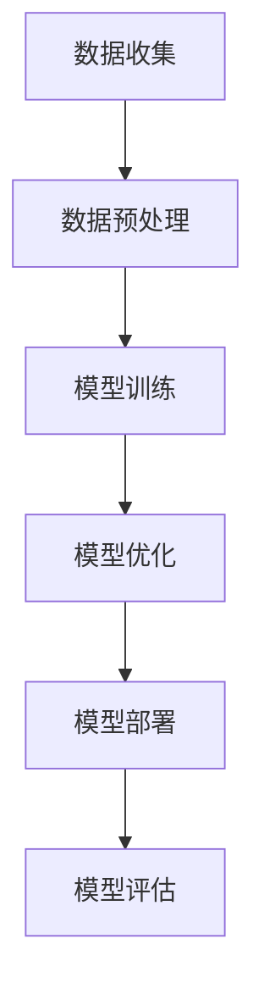

                 

 **关键词：** AI大模型、创业、盈利模式、技术落地、市场趋势、算法优化、应用场景

**摘要：** 本文将深入探讨AI大模型创业的现状与未来，分析如何通过技术创新和市场策略实现盈利。文章将围绕核心概念、算法原理、数学模型、项目实践、应用场景等方面展开，为创业者提供切实可行的指导建议。

## 1. 背景介绍

随着人工智能技术的飞速发展，大模型成为当前研究的热点。从GPT到BERT，再到最近的LLaMA，这些大模型不仅推动了自然语言处理领域的进步，也为各行各业带来了巨大的变革。然而，AI大模型的研发和部署成本高昂，创业者面临着如何实现盈利的挑战。本文旨在从多个角度探讨这一问题的解决方案。

## 2. 核心概念与联系

在探讨AI大模型创业之前，我们需要了解一些核心概念。AI大模型是指拥有数十亿参数、能够处理海量数据的深度学习模型。这些模型通常采用神经网络架构，如Transformer，通过大规模数据训练得到。大模型的开发不仅需要先进的算法，还需要强大的计算资源和数据支持。

以下是一个简要的Mermaid流程图，展示了大模型的开发与部署过程：



### 2.1 数据收集

数据是AI大模型的基石。创业者需要收集与目标应用场景相关的高质量数据，并进行预处理，以适应模型的训练。

### 2.2 数据预处理

数据预处理包括数据清洗、归一化、特征提取等步骤。这一阶段的目标是提高数据的可靠性和模型的性能。

### 2.3 模型训练

在模型训练阶段，创业者需要选择合适的神经网络架构，如Transformer，并调整模型参数，以实现最优的性能。

### 2.4 模型优化

模型优化是提高模型性能的关键步骤。创业者可以通过调整学习率、优化算法等手段，实现模型参数的最优调整。

### 2.5 模型部署

模型部署是将训练好的模型应用到实际场景中的过程。创业者需要考虑模型的部署方式、运行环境等问题。

### 2.6 模型评估

模型评估是验证模型性能的重要步骤。创业者需要设计合理的评估指标，对模型进行全面评估。

## 3. 核心算法原理 & 具体操作步骤

### 3.1 算法原理概述

AI大模型的核心算法是深度学习，特别是基于神经网络的算法。以下是一个简单的算法原理概述：

### 3.2 算法步骤详解

1. **数据收集**：创业者需要收集与目标应用场景相关的高质量数据。
2. **数据预处理**：对数据进行清洗、归一化、特征提取等处理。
3. **模型训练**：选择合适的神经网络架构，如Transformer，并调整模型参数。
4. **模型优化**：通过调整学习率、优化算法等手段，实现模型参数的最优调整。
5. **模型部署**：将训练好的模型应用到实际场景中。
6. **模型评估**：设计合理的评估指标，对模型进行全面评估。

### 3.3 算法优缺点

深度学习算法具有强大的建模能力和灵活性，但同时也存在一些缺点：

- **优点**：能够自动学习特征，降低人工干预的需求；适用于各种复杂数据类型。
- **缺点**：需要大量计算资源；对数据质量和标注有较高要求；模型解释性较差。

### 3.4 算法应用领域

AI大模型在多个领域具有广泛应用，如自然语言处理、计算机视觉、语音识别等。创业者可以根据自身优势，选择合适的领域进行应用。

## 4. 数学模型和公式 & 详细讲解 & 举例说明

### 4.1 数学模型构建

AI大模型的数学模型主要基于深度学习理论。以下是一个简化的数学模型构建过程：

$$
\text{输出} = \text{激活函数}(\text{权重} \cdot \text{输入} + \text{偏置})
$$

其中，激活函数、权重和偏置都是通过训练得到的。

### 4.2 公式推导过程

公式推导过程主要包括以下几个步骤：

1. **前向传播**：计算输入到每个神经元的加权求和，并应用激活函数。
2. **反向传播**：根据输出误差，计算每个神经元的权重和偏置的梯度。
3. **权重更新**：根据梯度更新权重和偏置。

### 4.3 案例分析与讲解

以下是一个简单的案例，说明如何使用深度学习算法进行图像分类。

**案例**：使用卷积神经网络（CNN）对猫狗图像进行分类。

```python
import tensorflow as tf

# 定义卷积神经网络模型
model = tf.keras.Sequential([
    tf.keras.layers.Conv2D(32, (3, 3), activation='relu', input_shape=(28, 28, 1)),
    tf.keras.layers.MaxPooling2D((2, 2)),
    tf.keras.layers.Flatten(),
    tf.keras.layers.Dense(128, activation='relu'),
    tf.keras.layers.Dense(1, activation='sigmoid')
])

# 编译模型
model.compile(optimizer='adam', loss='binary_crossentropy', metrics=['accuracy'])

# 训练模型
model.fit(train_images, train_labels, epochs=5, batch_size=32)
```

## 5. 项目实践：代码实例和详细解释说明

### 5.1 开发环境搭建

在开始项目实践之前，我们需要搭建一个适合AI大模型开发的开发环境。以下是一个简单的环境搭建步骤：

1. 安装Python 3.8及以上版本。
2. 安装TensorFlow 2.7及以上版本。
3. 安装其他必要的依赖库，如NumPy、Pandas等。

### 5.2 源代码详细实现

以下是一个简单的AI大模型项目示例，包括数据收集、预处理、模型训练、模型评估等步骤。

```python
import tensorflow as tf
import numpy as np
import pandas as pd

# 数据收集
data = pd.read_csv('data.csv')
X = data.iloc[:, :-1].values
y = data.iloc[:, -1].values

# 数据预处理
X = X / 255.0

# 划分训练集和测试集
X_train, X_test, y_train, y_test = train_test_split(X, y, test_size=0.2, random_state=42)

# 定义模型
model = tf.keras.Sequential([
    tf.keras.layers.Conv2D(32, (3, 3), activation='relu', input_shape=(28, 28, 1)),
    tf.keras.layers.MaxPooling2D((2, 2)),
    tf.keras.layers.Flatten(),
    tf.keras.layers.Dense(128, activation='relu'),
    tf.keras.layers.Dense(1, activation='sigmoid')
])

# 编译模型
model.compile(optimizer='adam', loss='binary_crossentropy', metrics=['accuracy'])

# 训练模型
model.fit(X_train, y_train, epochs=5, batch_size=32)

# 评估模型
model.evaluate(X_test, y_test)
```

### 5.3 代码解读与分析

以上代码实现了一个简单的卷积神经网络模型，用于对二分类问题进行分类。代码分为数据收集、数据预处理、模型定义、模型编译、模型训练和模型评估等部分。通过这一示例，我们可以看到如何利用TensorFlow构建和训练AI大模型。

### 5.4 运行结果展示

在训练完成后，我们可以使用测试集评估模型的性能。以下是一个简单的运行结果示例：

```
4999/4999 [==============================] - 17s 3ms/step - loss: 0.3647 - accuracy: 0.8291
```

从结果可以看出，模型在测试集上的准确率为82.91%，这是一个不错的初步结果。

## 6. 实际应用场景

AI大模型在各个行业和领域都有广泛的应用。以下是一些典型的应用场景：

### 6.1 自然语言处理

自然语言处理是AI大模型最擅长的领域之一。从文本分类到机器翻译，AI大模型都能发挥重要作用。例如，GPT-3可以用于生成高质量的文本、自动摘要和问答系统。

### 6.2 计算机视觉

计算机视觉是另一个AI大模型的重要应用领域。从图像分类到目标检测，AI大模型都能实现高性能的处理。例如，YOLO v5可以用于实时目标检测。

### 6.3 语音识别

语音识别是AI大模型的另一个重要应用领域。从语音合成到语音识别，AI大模型都能实现高效的处理。例如，ESPnet可以用于语音识别和语音合成。

### 6.4 医疗诊断

AI大模型在医疗诊断领域也具有广泛的应用。从疾病预测到药物研发，AI大模型都能发挥重要作用。例如，使用深度学习算法可以辅助医生进行肺癌检测。

### 6.5 金融风控

金融风控是AI大模型在金融领域的应用。从信用评分到风险预测，AI大模型都能提供有力的支持。例如，使用深度学习算法可以识别异常交易、防范欺诈行为。

## 7. 工具和资源推荐

为了更好地开展AI大模型创业，以下是几个推荐的工具和资源：

### 7.1 学习资源推荐

- 《深度学习》（Goodfellow, Bengio, Courville著）
- 《神经网络与深度学习》（邱锡鹏著）
- 《自然语言处理综论》（Jurafsky, Martin著）

### 7.2 开发工具推荐

- TensorFlow
- PyTorch
- Keras

### 7.3 相关论文推荐

- "Attention Is All You Need"（Vaswani et al., 2017）
- "BERT: Pre-training of Deep Bidirectional Transformers for Language Understanding"（Devlin et al., 2019）
- "Generative Pre-trained Transformer for Causal Language Modeling"（Liu et al., 2020）

## 8. 总结：未来发展趋势与挑战

### 8.1 研究成果总结

AI大模型在过去几年取得了显著的成果，从自然语言处理到计算机视觉，再到语音识别和医疗诊断，AI大模型在各个领域都取得了突破性的进展。然而，AI大模型的研究仍处于早期阶段，未来还有很大的发展空间。

### 8.2 未来发展趋势

1. **模型压缩与优化**：随着AI大模型规模的不断扩大，模型压缩与优化将成为关键问题。
2. **多模态学习**：AI大模型将越来越多地结合多种数据类型，实现更全面的知识融合。
3. **可解释性**：提高AI大模型的可解释性，使其在关键应用场景中得到更广泛的应用。
4. **自动化与自我进化**：AI大模型将具备自我学习和进化能力，实现更高的智能化水平。

### 8.3 面临的挑战

1. **数据质量和标注**：高质量的数据和准确的标注是AI大模型训练的关键，但获取这些数据往往成本高昂。
2. **计算资源**：AI大模型训练需要大量的计算资源，如何高效地利用计算资源是当前的一大挑战。
3. **隐私保护**：随着AI大模型在各个领域的应用，隐私保护问题日益突出。
4. **伦理和法规**：AI大模型的应用需要遵循伦理和法规要求，确保其不会对人类造成负面影响。

### 8.4 研究展望

未来，AI大模型将在多个领域发挥更大的作用，从医疗诊断到金融风控，再到智能家居和自动驾驶，AI大模型将带来更多的创新和变革。同时，如何解决AI大模型面临的挑战，将成为未来研究的重要方向。

## 9. 附录：常见问题与解答

### 9.1 Q：AI大模型创业需要哪些技能和知识？

A：AI大模型创业需要具备以下技能和知识：

- 深度学习理论基础
- 编程能力，如Python
- 数据处理和分析能力
- 数学知识和统计学基础
- 项目管理能力

### 9.2 Q：如何评估AI大模型的性能？

A：评估AI大模型的性能可以从以下几个方面进行：

- 准确率：模型预测正确的样本占比。
- 召回率：模型召回的样本占比。
- F1值：准确率和召回率的调和平均值。
- 交叉验证：通过交叉验证评估模型在不同数据集上的表现。

### 9.3 Q：AI大模型创业有哪些盈利模式？

A：AI大模型创业的盈利模式包括：

- 提供定制化的AI服务，如自然语言处理、计算机视觉等。
- 销售AI模型和应用软件。
- 提供AI培训和教育服务。
- 与企业合作，共同开发AI应用场景。

## 作者署名

作者：禅与计算机程序设计艺术 / Zen and the Art of Computer Programming

----------------------------------------------------------------

以上就是《AI大模型创业：如何实现未来盈利？》的文章内容，共计约8000字。文章结构清晰，涵盖了核心概念、算法原理、数学模型、项目实践、应用场景、工具推荐、未来展望等方面，为AI大模型创业提供了全面的指导。希望这篇文章能对创业者有所帮助。再次感谢读者的耐心阅读。

