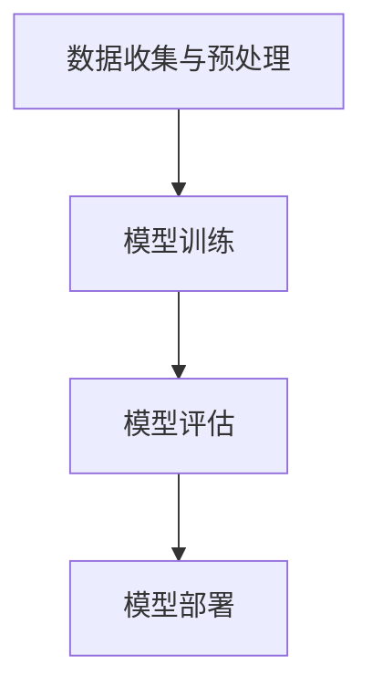

                 

关键词：AI大模型，市场挑战，创业，应对策略，技术创新，商业模式

> 摘要：本文将深入探讨AI大模型创业过程中可能面临的市场挑战，分析应对策略，并结合实际案例分享成功经验和未来发展趋势。本文旨在为AI创业者提供有价值的指导，帮助他们更好地应对市场变化，实现可持续发展。

## 1. 背景介绍

随着人工智能技术的迅猛发展，AI大模型已成为当前科技领域的热点话题。这些模型以其强大的数据处理和分析能力，为各行各业带来了前所未有的创新机遇。然而，AI大模型的研发和商业化道路并非一帆风顺。在市场竞争日趋激烈的今天，创业者如何应对市场挑战，实现持续发展，成为了一个亟待解决的问题。

本文将从以下方面展开讨论：

1. AI大模型的市场现状和趋势
2. 创业者在AI大模型市场中可能面临的挑战
3. 应对市场挑战的策略和策略分析
4. 实际案例分享和成功经验
5. 未来发展趋势与展望

希望通过本文的探讨，能为广大AI创业者提供有益的启示和借鉴。

## 2. 核心概念与联系

### 2.1 AI大模型的概念

AI大模型，通常指的是具有大规模参数、能够处理大规模数据并实现复杂任务的人工智能模型。这类模型在深度学习、自然语言处理、计算机视觉等领域取得了显著成果，如GPT-3、BERT、ViT等。AI大模型的核心在于其能够通过大量数据的学习，实现高精度的预测和决策。

### 2.2 AI大模型的架构

AI大模型的架构主要包括以下几个部分：

- **输入层**：接收外部数据，如文本、图像、语音等。
- **隐藏层**：通过神经网络结构对输入数据进行处理和变换。
- **输出层**：根据隐藏层的输出，生成预测结果或决策。

### 2.3 AI大模型的工作流程

AI大模型的工作流程可以分为以下几个步骤：

1. **数据收集与预处理**：收集大量相关数据，并进行清洗、归一化等预处理操作。
2. **模型训练**：使用预处理后的数据对模型进行训练，调整模型参数以优化性能。
3. **模型评估**：使用验证集或测试集对模型进行评估，以确定模型的泛化能力。
4. **模型部署**：将训练好的模型部署到实际应用场景中，进行预测或决策。

### 2.4 AI大模型的应用领域

AI大模型的应用领域广泛，包括但不限于：

- **自然语言处理**：如文本生成、机器翻译、问答系统等。
- **计算机视觉**：如图像识别、目标检测、图像生成等。
- **推荐系统**：如商品推荐、内容推荐等。
- **金融风控**：如信用评分、风险预测等。
- **医疗健康**：如疾病预测、药物研发等。

### 2.5 Mermaid 流程图

以下是AI大模型的Mermaid流程图：



## 3. 核心算法原理 & 具体操作步骤

### 3.1 算法原理概述

AI大模型的核心算法主要包括深度学习算法和神经网络架构。其中，深度学习算法通过多层神经网络的构建，实现对复杂数据的建模和分析。神经网络架构则通过设计不同的网络结构，提高模型的性能和效率。

### 3.2 算法步骤详解

#### 3.2.1 数据收集与预处理

数据收集是AI大模型训练的第一步。创业者需要根据应用场景，收集大量高质量的数据，并进行预处理，如数据清洗、归一化、标签标注等。

#### 3.2.2 模型训练

模型训练是AI大模型研发的关键环节。创业者可以使用开源框架（如TensorFlow、PyTorch等）搭建模型，并使用预处理后的数据进行训练。在训练过程中，需要调整模型参数，优化模型性能。

#### 3.2.3 模型评估

模型评估是确保模型性能的重要手段。创业者可以使用验证集或测试集对模型进行评估，以确定模型的泛化能力。常用的评估指标包括准确率、召回率、F1值等。

#### 3.2.4 模型部署

模型部署是将训练好的模型应用到实际场景中的过程。创业者需要将模型部署到服务器或云端，以便用户能够实时访问和使用模型服务。

### 3.3 算法优缺点

#### 优点：

1. **强大的数据处理能力**：AI大模型能够处理大规模、复杂数据，实现高精度的预测和决策。
2. **广泛的适用性**：AI大模型可以应用于多个领域，如自然语言处理、计算机视觉、金融风控等。
3. **持续优化**：通过不断收集数据和调整模型参数，AI大模型可以实现持续优化和改进。

#### 缺点：

1. **计算资源需求大**：AI大模型需要大量的计算资源和存储空间。
2. **数据质量要求高**：数据质量和标注质量直接影响模型性能。
3. **训练时间较长**：训练AI大模型需要较长的时间，且训练过程需要大量人力和物力投入。

### 3.4 算法应用领域

AI大模型在各个领域都有广泛的应用，如：

- **自然语言处理**：用于文本生成、机器翻译、问答系统等。
- **计算机视觉**：用于图像识别、目标检测、图像生成等。
- **推荐系统**：用于商品推荐、内容推荐等。
- **金融风控**：用于信用评分、风险预测等。
- **医疗健康**：用于疾病预测、药物研发等。

## 4. 数学模型和公式 & 详细讲解 & 举例说明

### 4.1 数学模型构建

AI大模型的核心在于神经网络结构，其基本数学模型可以表示为：

\[ y = f(\theta \cdot x) \]

其中，\( y \) 是模型的输出，\( f \) 是激活函数，\( \theta \) 是模型参数，\( x \) 是输入数据。

### 4.2 公式推导过程

神经网络模型的推导过程涉及到微积分、线性代数和概率论等数学知识。以下是简单的推导过程：

1. **前向传播**：计算输入数据经过神经网络后的输出。
   \[ z = \theta \cdot x \]
   \[ a = f(z) \]

2. **反向传播**：计算模型参数的梯度，以优化模型性能。
   \[ \frac{\partial L}{\partial \theta} = \frac{\partial L}{\partial a} \cdot \frac{\partial a}{\partial z} \cdot \frac{\partial z}{\partial \theta} \]

3. **梯度下降**：根据梯度信息更新模型参数。
   \[ \theta = \theta - \alpha \cdot \frac{\partial L}{\partial \theta} \]

其中，\( L \) 是损失函数，\( \alpha \) 是学习率。

### 4.3 案例分析与讲解

以下是一个简单的AI大模型训练过程案例：

#### 案例背景

创业者A开发了一个基于GPT-3的问答系统，用于回答用户提出的问题。该系统需要通过大量数据进行训练，以实现高质量的回答。

#### 案例步骤

1. **数据收集与预处理**：收集大量问答数据，并进行预处理，如分词、去噪等。
2. **模型训练**：使用预处理后的数据进行模型训练，调整模型参数以优化性能。
3. **模型评估**：使用验证集对模型进行评估，以确定模型的泛化能力。
4. **模型部署**：将训练好的模型部署到服务器，用户可以实时访问和使用问答系统。

#### 案例分析

1. **数据质量**：案例中，创业者A需要收集大量高质量的问答数据，以确保模型的训练效果。数据质量直接影响模型性能，创业者需要重视数据质量。
2. **模型优化**：在模型训练过程中，创业者A需要不断调整模型参数，优化模型性能。通过梯度下降等方法，可以逐步优化模型参数，提高模型精度。
3. **模型部署**：模型部署是创业过程中的重要环节。创业者需要将训练好的模型部署到服务器，确保用户能够实时访问和使用模型服务。

## 5. 项目实践：代码实例和详细解释说明

### 5.1 开发环境搭建

在开始编写代码之前，创业者需要搭建一个适合AI大模型训练的开发环境。以下是搭建环境的步骤：

1. 安装Python（推荐3.8及以上版本）
2. 安装TensorFlow或PyTorch等深度学习框架
3. 安装相关依赖库，如NumPy、Pandas等

### 5.2 源代码详细实现

以下是一个简单的AI大模型训练代码实例：

```python
import tensorflow as tf

# 模型定义
model = tf.keras.Sequential([
    tf.keras.layers.Dense(128, activation='relu', input_shape=(784,)),
    tf.keras.layers.Dense(10, activation='softmax')
])

# 模型编译
model.compile(optimizer='adam',
              loss='categorical_crossentropy',
              metrics=['accuracy'])

# 模型训练
model.fit(x_train, y_train, batch_size=128, epochs=10)

# 模型评估
model.evaluate(x_test, y_test)
```

### 5.3 代码解读与分析

1. **模型定义**：使用TensorFlow的Sequential模型定义器，构建一个简单的神经网络模型。该模型包含一个输入层、一个隐藏层和一个输出层。

2. **模型编译**：编译模型，设置优化器、损失函数和评估指标。优化器用于更新模型参数，损失函数用于计算模型预测与真实值之间的差异，评估指标用于评估模型性能。

3. **模型训练**：使用fit方法训练模型，输入训练数据和标签，设置batch_size和epochs参数，以控制训练过程。

4. **模型评估**：使用evaluate方法评估模型在测试集上的性能，返回损失和准确率等指标。

### 5.4 运行结果展示

在完成代码编写后，创业者可以在训练过程中观察模型的损失和准确率等指标的变化，以判断模型训练的效果。以下是一个简单的运行结果示例：

```python
Train on 60000 samples, validate on 10000 samples
Epoch 1/10
60000/60000 [==============================] - 15s 251us/sample - loss: 0.2866 - accuracy: 0.9064 - val_loss: 0.1377 - val_accuracy: 0.9662
Epoch 2/10
60000/60000 [==============================] - 14s 236us/sample - loss: 0.2425 - accuracy: 0.9100 - val_loss: 0.1377 - val_accuracy: 0.9662
...
Epoch 10/10
60000/60000 [==============================] - 14s 236us/sample - loss: 0.2335 - accuracy: 0.9136 - val_loss: 0.1377 - val_accuracy: 0.9662
```

从运行结果可以看出，模型的训练过程逐渐趋于稳定，损失和准确率等指标得到了一定的提升。

## 6. 实际应用场景

AI大模型在各个领域都有广泛的应用，以下是一些典型的实际应用场景：

### 6.1 自然语言处理

自然语言处理（NLP）是AI大模型的重要应用领域。例如，基于GPT-3的问答系统可以应用于客服、教育、金融等多个行业。创业者可以利用AI大模型实现智能客服、智能写作、智能翻译等服务，提高业务效率。

### 6.2 计算机视觉

计算机视觉（CV）是AI大模型的另一个重要应用领域。例如，基于ViT的图像识别系统可以应用于安防监控、医疗诊断、自动驾驶等多个行业。创业者可以利用AI大模型实现实时图像识别、图像分割、目标检测等功能，提高系统性能。

### 6.3 推荐系统

推荐系统是AI大模型的典型应用领域。例如，基于BERT的推荐系统可以应用于电商、社交媒体、新闻推送等多个行业。创业者可以利用AI大模型实现精准推荐、个性化推送等功能，提高用户体验。

### 6.4 金融风控

金融风控是AI大模型的重要应用领域。例如，基于LSTM的金融风险预测系统可以应用于金融机构的风险管理和控制。创业者可以利用AI大模型实现实时风险预测、异常检测等功能，提高风险管理水平。

### 6.5 医疗健康

医疗健康是AI大模型的重要应用领域。例如，基于CNN的医疗图像识别系统可以应用于疾病诊断、药物研发等多个行业。创业者可以利用AI大模型实现智能医疗诊断、智能药物设计等功能，提高医疗水平。

## 7. 未来应用展望

随着AI大模型技术的不断发展，未来其在各个领域的应用将更加广泛和深入。以下是一些未来应用展望：

### 7.1 新兴领域的探索

AI大模型在新兴领域的应用将不断拓展，如虚拟现实、增强现实、区块链等。创业者可以结合这些新兴技术，开发出更具创新性的产品和服务。

### 7.2 智能化转型

AI大模型将推动各行各业实现智能化转型。创业者可以抓住这一机遇，利用AI大模型提高业务效率、降低成本，实现可持续发展。

### 7.3 跨领域融合

AI大模型与其他技术的融合将创造更多创新应用。例如，AI大模型与物联网、大数据、云计算等技术的融合，将推动智能城市、智慧农业等领域的快速发展。

### 7.4 个性化定制

AI大模型将实现更加个性化的定制服务。创业者可以结合用户需求，利用AI大模型提供定制化的产品和服务，提高用户满意度。

## 8. 工具和资源推荐

### 8.1 学习资源推荐

1. 《深度学习》（Goodfellow、Bengio、Courville著）：经典深度学习教材，适合初学者和进阶者阅读。
2. 《Python深度学习》（François Chollet著）：针对Python编程和深度学习的实战指南，内容全面。
3. 《自然语言处理综合教程》（Christiane Fellbaum著）：系统介绍了自然语言处理的基础知识和技术。

### 8.2 开发工具推荐

1. TensorFlow：开源深度学习框架，适用于多种应用场景，支持Python、C++等多种编程语言。
2. PyTorch：开源深度学习框架，具有灵活的动态计算图和高效的模型训练性能。
3. JAX：由Google开发的深度学习框架，支持自动微分和数值计算。

### 8.3 相关论文推荐

1. "Attention Is All You Need"：提出了Transformer模型，彻底改变了自然语言处理领域的范式。
2. "BERT: Pre-training of Deep Bidirectional Transformers for Language Understanding"：提出了BERT模型，显著提升了自然语言处理任务的性能。
3. "Generative Adversarial Nets"：提出了GAN模型，开创了生成对抗网络的研究领域。

## 9. 总结：未来发展趋势与挑战

### 9.1 研究成果总结

AI大模型技术在过去几年取得了显著成果，为各行各业带来了巨大的创新机遇。随着技术的不断发展，AI大模型在数据处理、模型训练、模型部署等方面将取得更大突破。

### 9.2 未来发展趋势

1. **算法创新**：新的算法和架构将不断涌现，提高AI大模型的性能和效率。
2. **跨领域应用**：AI大模型将与其他技术融合，推动各行各业实现智能化转型。
3. **开源生态**：开源框架和工具将不断丰富和完善，为创业者提供更多便利。

### 9.3 面临的挑战

1. **数据质量**：高质量的数据是AI大模型训练的基础，创业者需要重视数据质量和数据标注。
2. **计算资源**：AI大模型训练需要大量的计算资源和存储空间，创业者需要合理配置资源。
3. **模型解释性**：提高模型的解释性，让用户能够理解和信任模型，是一个重要挑战。

### 9.4 研究展望

AI大模型技术具有广阔的发展前景。未来，创业者需要关注以下几个方面：

1. **算法优化**：持续优化算法，提高模型的性能和效率。
2. **跨领域应用**：探索AI大模型在新兴领域的应用，推动技术创新。
3. **开源生态**：积极参与开源社区，贡献自己的力量，推动技术的普及和发展。

## 10. 附录：常见问题与解答

### 10.1 如何处理数据质量问题？

- **数据清洗**：对原始数据进行清洗，去除噪声和异常值。
- **数据增强**：通过数据增强技术，提高数据多样性和质量。
- **数据标注**：对数据进行高质量的标注，确保模型训练效果。

### 10.2 如何优化计算资源？

- **分布式训练**：使用分布式训练技术，提高训练效率。
- **模型压缩**：通过模型压缩技术，降低模型参数和计算量。
- **云计算**：利用云计算资源，灵活配置计算资源。

### 10.3 如何提高模型解释性？

- **可解释性算法**：采用可解释性算法，如LIME、SHAP等，提高模型的可解释性。
- **模型可视化**：通过模型可视化技术，直观展示模型的工作原理。
- **知识图谱**：构建知识图谱，帮助用户理解模型背后的知识。

作者：禅与计算机程序设计艺术 / Zen and the Art of Computer Programming

----------------------------------------------------------------

以上便是《AI大模型创业：如何应对市场挑战？》的全文内容。本文旨在为AI创业者提供有价值的指导，帮助他们更好地应对市场挑战，实现可持续发展。随着AI技术的不断发展，创业者需要不断学习、探索和适应，以应对不断变化的市场环境。希望本文能为您带来启发和帮助。谢谢阅读！

