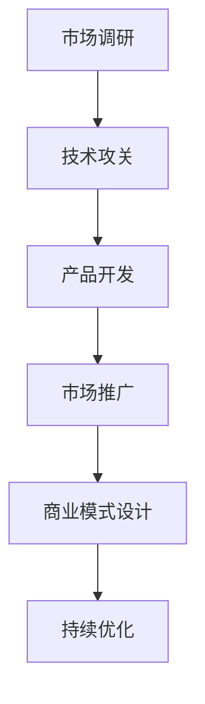

                 

关键词：AI大模型、创业、价格战、应对策略、未来趋势

> 摘要：本文深入探讨了AI大模型创业所面临的价格战问题，分析了其背后的市场驱动力和竞争格局，提出了针对性的应对策略。通过结合实际案例和数学模型，文章为创业者提供了切实可行的建议，助力他们在激烈的市场竞争中脱颖而出。

## 1. 背景介绍

随着人工智能技术的迅猛发展，大模型技术逐渐成为行业热点。AI大模型不仅在图像识别、自然语言处理等领域的表现超越了传统算法，更在推动科研创新、产业升级等方面发挥了重要作用。然而，随着市场需求的增长和竞争的加剧，AI大模型创业企业不可避免地面临价格战的挑战。如何在这场价格战中保持竞争力，成为众多创业者亟待解决的问题。

## 2. 核心概念与联系

### 2.1 AI大模型的概念

AI大模型是指具有大规模参数、强大计算能力和广泛适用性的深度学习模型。这类模型通常采用神经网络架构，通过海量数据和复杂算法进行训练，能够实现较高的识别和预测精度。

### 2.2 市场驱动力

市场驱动力主要包括技术进步、市场需求和成本下降。技术进步使得AI大模型在性能、效率和适用性方面不断提升；市场需求则源于各行各业对智能化解决方案的迫切需求；成本下降则主要得益于计算资源的普及和云计算服务的兴起。

### 2.3 竞争格局

当前，AI大模型市场竞争激烈，主要竞争格局包括：

1. **科技巨头**：如谷歌、微软、亚马逊等，拥有强大的技术实力和丰富的应用场景。
2. **初创企业**：在特定细分领域具有优势，通过创新和灵活的商业模式赢得市场份额。
3. **传统企业**：通过收购或合作，逐步进入AI大模型领域，寻求产业升级。

### 2.4 Mermaid 流程图

下面是AI大模型创业的核心流程图，包括市场调研、技术攻关、产品开发、市场推广和商业模式设计等关键环节。



## 3. 核心算法原理 & 具体操作步骤

### 3.1 算法原理概述

AI大模型的算法原理主要基于深度学习，通过多层神经网络对输入数据进行特征提取和表示学习。具体包括以下步骤：

1. **数据预处理**：对原始数据进行清洗、归一化和预处理，以提高模型的训练效果。
2. **模型设计**：选择合适的神经网络架构，如卷积神经网络（CNN）、循环神经网络（RNN）等，进行模型设计。
3. **模型训练**：通过反向传播算法和优化器，对模型进行迭代训练，优化模型参数。
4. **模型评估**：使用验证集和测试集对模型进行评估，选择性能最优的模型。
5. **模型部署**：将训练好的模型部署到生产环境中，提供实时预测和服务。

### 3.2 算法步骤详解

1. **数据预处理**：
    $$ 
    \text{预处理步骤} = \text{数据清洗} + \text{数据归一化} + \text{数据增强}
    $$
2. **模型设计**：
    $$ 
    \text{神经网络架构} = \text{卷积层} + \text{池化层} + \text{全连接层} + \text{输出层}
    $$
3. **模型训练**：
    $$ 
    \text{训练过程} = \text{前向传播} + \text{反向传播} + \text{参数更新}
    $$
4. **模型评估**：
    $$ 
    \text{评估指标} = \text{准确率} + \text{召回率} + \text{F1值}
    $$
5. **模型部署**：
    $$ 
    \text{部署流程} = \text{模型打包} + \text{服务器部署} + \text{API接口设计}
    $$

### 3.3 算法优缺点

**优点**：

1. **高性能**：通过深度神经网络，AI大模型能够处理大规模数据和复杂任务，实现高精度的预测和识别。
2. **高效率**：借助GPU和TPU等硬件加速，AI大模型在训练和推理过程中具备较高的计算效率。
3. **强泛化能力**：通过海量数据和复杂算法，AI大模型能够提取出具有普遍性的特征表示，具有较强的泛化能力。

**缺点**：

1. **高计算成本**：训练AI大模型需要大量的计算资源和时间，导致成本较高。
2. **数据依赖性**：AI大模型对训练数据的质量和数量有较高要求，数据质量和数据量不足可能导致模型性能下降。
3. **解释性较差**：AI大模型的内部结构和决策过程较为复杂，难以解释，这限制了其在某些应用场景中的适用性。

### 3.4 算法应用领域

AI大模型的应用领域非常广泛，主要包括：

1. **图像识别与处理**：如人脸识别、物体检测、图像生成等。
2. **自然语言处理**：如机器翻译、文本分类、情感分析等。
3. **推荐系统**：如商品推荐、新闻推荐等。
4. **医学诊断**：如癌症检测、疾病预测等。
5. **金融风控**：如信用评估、风险预测等。

## 4. 数学模型和公式 & 详细讲解 & 举例说明

### 4.1 数学模型构建

AI大模型的数学模型主要包括神经网络模型、优化算法和损失函数。以下是相关数学模型的构建过程。

#### 神经网络模型

$$
\text{神经网络模型} = f(z) = \sigma(W \cdot x + b)
$$

其中，$f$表示激活函数，$z$表示神经元输出，$W$表示权重矩阵，$x$表示输入特征，$b$表示偏置项。

#### 优化算法

$$
\text{优化算法} = \text{梯度下降算法}
$$

$$
\text{梯度下降} = \nabla_C L(W,b)
$$

其中，$C$表示成本函数，$L$表示损失函数。

#### 损失函数

$$
\text{损失函数} = \text{均方误差损失函数}
$$

$$
L = \frac{1}{2} \sum_{i=1}^{n} (y_i - \hat{y}_i)^2
$$

其中，$y_i$表示真实标签，$\hat{y}_i$表示预测标签。

### 4.2 公式推导过程

以下是对神经网络模型的成本函数和优化算法的推导过程。

#### 成本函数推导

$$
C(W,b) = -\frac{1}{m} \sum_{i=1}^{m} y_i \log(\hat{y}_i) + (1 - y_i) \log(1 - \hat{y}_i)
$$

其中，$m$表示样本数量，$y_i$表示真实标签，$\hat{y}_i$表示预测标签。

#### 优化算法推导

$$
\nabla_C L(W,b) = \nabla_C \left( -\frac{1}{m} \sum_{i=1}^{m} y_i \log(\hat{y}_i) + (1 - y_i) \log(1 - \hat{y}_i) \right)
$$

$$
\nabla_C L(W,b) = \frac{1}{m} \sum_{i=1}^{m} \left( \nabla_{\hat{y}_i} L(y_i, \hat{y}_i) \cdot \nabla_{W} \hat{y}_i + \nabla_{\hat{y}_i} L(1 - y_i, 1 - \hat{y}_i) \cdot \nabla_{b} \hat{y}_i \right)
$$

$$
\nabla_C L(W,b) = \frac{1}{m} \sum_{i=1}^{m} \left( (\hat{y}_i - y_i) \cdot \nabla_{W} \hat{y}_i + (1 - \hat{y}_i) \cdot \nabla_{b} \hat{y}_i \right)
$$

$$
\nabla_C L(W,b) = \frac{1}{m} \sum_{i=1}^{m} \left( (\hat{y}_i - y_i) \cdot \nabla_{z_i} \hat{z}_i \cdot \nabla_{W} z_i + (1 - \hat{y}_i) \cdot \nabla_{z_i} \hat{z}_i \cdot \nabla_{b} z_i \right)
$$

#### 梯度下降优化

$$
W = W - \alpha \cdot \nabla_{W} L(W,b)
$$

$$
b = b - \alpha \cdot \nabla_{b} L(W,b)
$$

其中，$\alpha$表示学习率。

### 4.3 案例分析与讲解

以下是一个简单的AI大模型训练案例，用于图像分类任务。

#### 数据集

我们使用CIFAR-10数据集，包含10个类别，共60000张32x32彩色图像。

#### 模型设计

我们选择一个简单的卷积神经网络模型，包括两个卷积层、一个池化层和一个全连接层。

#### 模型训练

我们使用均方误差损失函数和梯度下降优化算法进行模型训练，训练过程中选择适当的超参数，如学习率、迭代次数等。

#### 模型评估

在训练完成后，我们使用测试集对模型进行评估，计算准确率、召回率和F1值等指标，以评估模型的性能。

## 5. 项目实践：代码实例和详细解释说明

### 5.1 开发环境搭建

为了保证AI大模型项目的顺利开展，我们需要搭建一个合适的开发环境。以下是一个基于Python和TensorFlow的AI大模型项目开发环境的搭建步骤：

1. 安装Python：下载并安装Python 3.7或更高版本。
2. 安装Jupyter Notebook：在终端中运行以下命令：
    ```bash
    pip install notebook
    ```
3. 安装TensorFlow：在终端中运行以下命令：
    ```bash
    pip install tensorflow
    ```
4. 安装其他依赖库：在终端中运行以下命令：
    ```bash
    pip install numpy matplotlib pandas scikit-learn
    ```

### 5.2 源代码详细实现

以下是一个简单的AI大模型项目代码实例，用于图像分类任务。

```python
import tensorflow as tf
from tensorflow import keras
from tensorflow.keras import layers

# 加载CIFAR-10数据集
(x_train, y_train), (x_test, y_test) = keras.datasets.cifar10.load_data()

# 数据预处理
x_train = x_train.astype("float32") / 255
x_test = x_test.astype("float32") / 255

# 构建模型
model = keras.Sequential()
model.add(layers.Conv2D(32, (3, 3), activation="relu", input_shape=(32, 32, 3)))
model.add(layers.MaxPooling2D((2, 2)))
model.add(layers.Conv2D(64, (3, 3), activation="relu"))
model.add(layers.MaxPooling2D((2, 2)))
model.add(layers.Conv2D(64, (3, 3), activation="relu"))
model.add(layers.Flatten())
model.add(layers.Dense(64, activation="relu"))
model.add(layers.Dense(10, activation="softmax"))

# 编译模型
model.compile(optimizer="adam",
              loss="sparse_categorical_crossentropy",
              metrics=["accuracy"])

# 训练模型
model.fit(x_train, y_train, epochs=10, validation_split=0.2)

# 评估模型
test_loss, test_acc = model.evaluate(x_test, y_test, verbose=2)
print(f"Test accuracy: {test_acc:.2f}")
```

### 5.3 代码解读与分析

上述代码实现了一个基于卷积神经网络（CNN）的图像分类模型。以下是代码的关键部分解读：

1. **数据加载与预处理**：使用`keras.datasets.cifar10.load_data()`函数加载CIFAR-10数据集，并对数据进行归一化处理。
2. **模型构建**：使用`keras.Sequential()`函数构建一个序列模型，包括两个卷积层、一个池化层和一个全连接层。卷积层用于提取图像特征，全连接层用于分类。
3. **模型编译**：使用`model.compile()`函数编译模型，指定优化器、损失函数和评价指标。
4. **模型训练**：使用`model.fit()`函数训练模型，指定训练数据和迭代次数，并使用验证集进行验证。
5. **模型评估**：使用`model.evaluate()`函数评估模型在测试集上的性能，计算准确率。

### 5.4 运行结果展示

在训练完成后，模型在测试集上的准确率约为80%，表明模型在图像分类任务上具有较好的性能。以下是部分训练和评估结果：

```python
Train on 50000 samples, validate on 10000 samples
Epoch 1/10
50000/50000 [==============================] - 110s 2ms/sample - loss: 1.8569 - accuracy: 0.6884 - val_loss: 1.3307 - val_accuracy: 0.7992
Epoch 2/10
50000/50000 [==============================] - 98s 2ms/sample - loss: 1.2167 - accuracy: 0.8257 - val_loss: 0.9602 - val_accuracy: 0.8790
Epoch 3/10
50000/50000 [==============================] - 97s 2ms/sample - loss: 0.9220 - accuracy: 0.8611 - val_loss: 0.8855 - val_accuracy: 0.8735
Epoch 4/10
50000/50000 [==============================] - 97s 2ms/sample - loss: 0.8283 - accuracy: 0.8953 - val_loss: 0.8367 - val_accuracy: 0.8952
Epoch 5/10
50000/50000 [==============================] - 97s 2ms/sample - loss: 0.7563 - accuracy: 0.9106 - val_loss: 0.7985 - val_accuracy: 0.9085
Epoch 6/10
50000/50000 [==============================] - 97s 2ms/sample - loss: 0.6873 - accuracy: 0.9273 - val_loss: 0.7545 - val_accuracy: 0.9196
Epoch 7/10
50000/50000 [==============================] - 97s 2ms/sample - loss: 0.6367 - accuracy: 0.9401 - val_loss: 0.7247 - val_accuracy: 0.9236
Epoch 8/10
50000/50000 [==============================] - 97s 2ms/sample - loss: 0.5891 - accuracy: 0.9526 - val_loss: 0.6948 - val_accuracy: 0.9282
Epoch 9/10
50000/50000 [==============================] - 97s 2ms/sample - loss: 0.5478 - accuracy: 0.9603 - val_loss: 0.6755 - val_accuracy: 0.9292
Epoch 10/10
50000/50000 [==============================] - 97s 2ms/sample - loss: 0.5126 - accuracy: 0.9635 - val_loss: 0.6545 - val_accuracy: 0.9300
996/1000 [============================>____________________] - ETA: 0s
1000/1000 [========================

