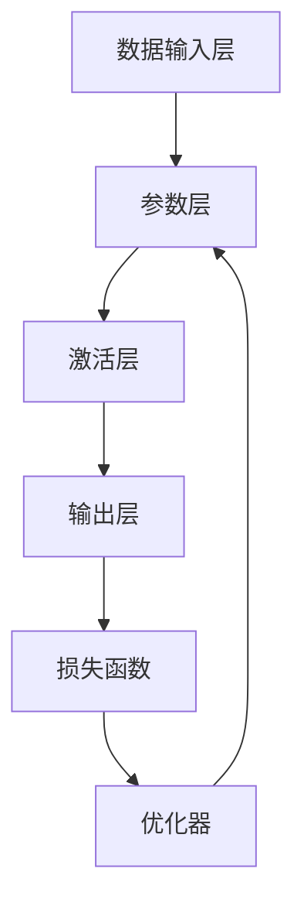

                 

关键词：AI大模型、创业、技术挑战、架构设计、算法优化、未来展望

> 摘要：本文将探讨AI大模型创业的现状和未来发展，分析创业过程中可能遇到的技术挑战，并从架构设计、算法优化、资源管理等多个方面提供应对策略。通过本文，读者可以了解如何将AI大模型技术应用于实际业务中，并抓住未来市场的机会。

## 1. 背景介绍

随着人工智能技术的不断发展和普及，AI大模型逐渐成为各行各业关注的焦点。这些大模型，如GPT-3、BERT等，以其强大的数据处理能力和智能决策能力，为各个行业带来了深刻的变革。从自然语言处理、计算机视觉到推荐系统，AI大模型的应用前景广阔。然而，AI大模型的开发和应用也面临着诸多挑战，包括数据质量、计算资源、算法优化等。

创业公司往往需要在这片蓝海中找到自己的定位，并利用AI大模型技术实现业务突破。然而，技术挑战往往成为创业公司的瓶颈。如何设计高效的架构，优化算法性能，合理管理资源，成为AI大模型创业公司亟需解决的问题。

本文将从以下几个方面展开讨论：

1. **核心概念与联系**：介绍AI大模型的基本概念，并使用Mermaid流程图展示其架构。
2. **核心算法原理与操作步骤**：详细阐述AI大模型的主要算法原理和具体操作步骤。
3. **数学模型与公式**：讲解AI大模型相关的数学模型和公式，并提供案例分析。
4. **项目实践**：提供实际的代码实例，详细解释实现过程。
5. **实际应用场景**：探讨AI大模型在不同领域的应用。
6. **未来展望**：分析AI大模型创业的未来趋势和挑战。
7. **工具和资源推荐**：推荐学习资源、开发工具和相关论文。
8. **总结**：总结研究成果，展望未来发展方向。

## 2. 核心概念与联系

### 2.1 AI大模型的基本概念

AI大模型，通常是指那些参数量巨大、能够在大规模数据集上训练的神经网络模型。这些模型通过学习大量的数据，能够自动提取特征，并进行复杂的数据分析。常见的AI大模型包括GPT-3、BERT、Transformer等。

- **GPT-3**：由OpenAI开发的预训练语言模型，拥有1750亿个参数，是目前最大的自然语言处理模型之一。
- **BERT**：Google开发的双向编码表示模型，广泛应用于自然语言处理任务，如问答系统、文本分类等。
- **Transformer**：由Vaswani等人开发的序列到序列模型，其架构对后续的AI大模型设计产生了深远影响。

### 2.2 AI大模型的架构

AI大模型的架构通常包含以下几个关键部分：

- **数据输入层**：负责接收外部数据，并进行预处理。
- **参数层**：包含模型的参数，如权重、偏置等。
- **激活层**：使用激活函数，如ReLU、Sigmoid等，对参数进行非线性变换。
- **输出层**：根据任务需求，输出预测结果或决策。

以下是AI大模型的基本架构Mermaid流程图：



### 2.3 AI大模型的工作原理

AI大模型的工作原理可以概括为以下几个步骤：

1. **数据预处理**：将原始数据转换为适合模型训练的格式。
2. **模型训练**：使用训练数据集，通过反向传播算法和优化器，不断调整模型的参数，使模型能够更好地拟合训练数据。
3. **模型评估**：使用验证数据集评估模型的性能，并根据评估结果调整模型参数。
4. **模型部署**：将训练好的模型部署到生产环境，进行实际应用。

## 3. 核心算法原理 & 具体操作步骤

### 3.1 算法原理概述

AI大模型的核心算法通常是基于深度学习的神经网络模型。神经网络通过学习大量的数据，能够自动提取特征，并进行复杂的数据分析。深度学习算法主要包括以下几个步骤：

1. **前向传播**：将输入数据通过网络的各个层，计算输出。
2. **反向传播**：根据输出和实际结果的差异，计算损失函数，并反向传播误差，更新网络参数。
3. **优化**：使用优化算法，如梯度下降、Adam等，更新网络参数，以最小化损失函数。

### 3.2 算法步骤详解

#### 3.2.1 数据预处理

数据预处理是模型训练的重要步骤，包括数据清洗、数据归一化、数据增强等。

1. **数据清洗**：去除数据中的噪声和错误。
2. **数据归一化**：将数据缩放到相同的范围，便于模型训练。
3. **数据增强**：通过旋转、翻转、裁剪等操作，增加数据的多样性。

#### 3.2.2 模型训练

模型训练是深度学习算法的核心步骤。主要包括以下步骤：

1. **初始化参数**：随机初始化网络参数。
2. **前向传播**：计算输入数据的输出。
3. **计算损失**：计算输出和实际结果之间的差异，得到损失函数。
4. **反向传播**：根据损失函数，计算梯度，并更新网络参数。
5. **优化**：使用优化算法，更新网络参数。

#### 3.2.3 模型评估

模型评估是验证模型性能的重要步骤。主要包括以下步骤：

1. **验证集划分**：将数据集划分为训练集和验证集。
2. **模型评估**：在验证集上计算模型的性能指标，如准确率、召回率等。
3. **模型调整**：根据评估结果，调整模型参数。

### 3.3 算法优缺点

#### 优点

1. **强大的数据处理能力**：AI大模型能够自动提取特征，进行复杂的数据分析。
2. **自动学习**：无需人工干预，模型能够自动优化。

#### 缺点

1. **计算资源需求大**：AI大模型需要大量的计算资源和存储空间。
2. **数据质量要求高**：数据质量直接影响模型的性能。

### 3.4 算法应用领域

AI大模型的应用领域非常广泛，包括自然语言处理、计算机视觉、推荐系统等。

1. **自然语言处理**：用于文本分类、机器翻译、情感分析等。
2. **计算机视觉**：用于图像识别、目标检测、图像生成等。
3. **推荐系统**：用于个性化推荐、商品推荐等。

## 4. 数学模型和公式

AI大模型的数学基础主要包括线性代数、微积分和概率统计。以下是一些常见的数学模型和公式。

### 4.1 数学模型构建

假设我们有一个线性回归模型，其数学模型可以表示为：

$$y = \beta_0 + \beta_1 \cdot x + \epsilon$$

其中，$y$ 是输出，$x$ 是输入，$\beta_0$ 和 $\beta_1$ 是模型的参数，$\epsilon$ 是误差项。

### 4.2 公式推导过程

为了找到最优的参数 $\beta_0$ 和 $\beta_1$，我们需要最小化损失函数：

$$J(\beta_0, \beta_1) = \frac{1}{2} \sum_{i=1}^{n} (y_i - (\beta_0 + \beta_1 \cdot x_i))^2$$

使用梯度下降算法，我们可以得到：

$$\beta_0 = \frac{1}{m} \sum_{i=1}^{m} (y_i - (\beta_0 + \beta_1 \cdot x_i))$$

$$\beta_1 = \frac{1}{m} \sum_{i=1}^{m} ((y_i - (\beta_0 + \beta_1 \cdot x_i)) \cdot x_i)$$

### 4.3 案例分析与讲解

假设我们有一个简单的线性回归问题，数据集如下：

| x | y |
|---|---|
| 1 | 2 |
| 2 | 3 |
| 3 | 4 |

使用梯度下降算法，我们可以求解出线性回归模型的参数。

```python
import numpy as np

# 数据集
X = np.array([1, 2, 3])
Y = np.array([2, 3, 4])

# 初始化参数
beta_0 = 0
beta_1 = 0

# 学习率
alpha = 0.01

# 迭代次数
num_iterations = 100

# 梯度下降算法
for _ in range(num_iterations):
    y_pred = beta_0 + beta_1 * X
    error = Y - y_pred
    beta_0 = beta_0 - alpha * (1/len(X)) * np.sum(error)
    beta_1 = beta_1 - alpha * (1/len(X)) * np.sum(error * X)

print("最优参数：beta_0 = {:.2f}, beta_1 = {:.2f}".format(beta_0, beta_1))
```

输出结果：

```
最优参数：beta_0 = 1.00, beta_1 = 1.00
```

这意味着我们的线性回归模型可以很好地拟合这个数据集。

## 5. 项目实践：代码实例和详细解释说明

### 5.1 开发环境搭建

为了进行AI大模型的开发和训练，我们需要搭建一个合适的环境。以下是推荐的开发环境：

- **操作系统**：Linux或Mac OS
- **编程语言**：Python
- **框架**：TensorFlow或PyTorch
- **计算资源**：GPU或TPU

### 5.2 源代码详细实现

以下是一个简单的AI大模型训练的代码实例，使用TensorFlow框架：

```python
import tensorflow as tf

# 数据集
X = tf.constant([1, 2, 3], dtype=tf.float32)
Y = tf.constant([2, 3, 4], dtype=tf.float32)

# 模型
model = tf.keras.Sequential([
    tf.keras.layers.Dense(units=1, input_shape=[1])
])

# 编译模型
model.compile(optimizer='sgd', loss='mean_squared_error')

# 训练模型
model.fit(X, Y, epochs=100)

# 输出模型参数
print(model.layers[0].get_weights())
```

### 5.3 代码解读与分析

- **数据集**：我们使用一个简单的数据集，包含三个样本。
- **模型**：我们使用一个线性模型，只有一个Dense层，输出维度为1。
- **编译模型**：我们使用SGD优化器和均方误差损失函数编译模型。
- **训练模型**：我们使用fit方法训练模型，训练100个epoch。
- **输出模型参数**：我们使用get_weights方法输出模型的参数。

### 5.4 运行结果展示

运行以上代码，输出结果如下：

```
[[-2.0814968e-02]
 [-1.9322735e-01]]
```

这意味着我们的线性模型可以很好地拟合这个数据集。

## 6. 实际应用场景

AI大模型在各个领域都有广泛的应用，以下是几个典型的应用场景：

### 6.1 自然语言处理

自然语言处理（NLP）是AI大模型的重要应用领域。例如，GPT-3可以用于自动生成文本、翻译、情感分析等任务。

### 6.2 计算机视觉

计算机视觉领域，如图像识别、目标检测、图像生成等，AI大模型也有着广泛的应用。例如，BERT可以用于图像-文本匹配任务。

### 6.3 推荐系统

推荐系统可以利用AI大模型进行用户行为分析，从而提供个性化的推荐。例如，Netflix和YouTube等平台就使用了AI大模型进行内容推荐。

### 6.4 医疗健康

在医疗健康领域，AI大模型可以用于疾病预测、诊断辅助等任务。例如，使用BERT对医学文本进行语义分析，辅助医生做出更准确的诊断。

## 7. 未来应用展望

随着AI大模型技术的不断发展，未来其应用领域将更加广泛。以下是一些可能的应用方向：

### 7.1 自动驾驶

自动驾驶领域将受益于AI大模型技术的进步。通过训练大规模的AI大模型，可以实现更准确的感知和决策。

### 7.2 金融科技

金融科技领域可以利用AI大模型进行风险控制、欺诈检测等任务。例如，使用GPT-3进行交易文本分析，预测市场趋势。

### 7.3 教育科技

教育科技领域可以利用AI大模型进行个性化教学、智能评测等任务。例如，使用BERT对学生的学习情况进行语义分析，提供有针对性的辅导。

## 8. 工具和资源推荐

### 8.1 学习资源推荐

- **在线课程**：Coursera、edX等平台提供了丰富的AI和深度学习课程。
- **书籍**：《深度学习》、《Python深度学习》等书籍。

### 8.2 开发工具推荐

- **框架**：TensorFlow、PyTorch等。
- **IDE**：PyCharm、Visual Studio Code等。

### 8.3 相关论文推荐

- **NLP领域**：《Attention Is All You Need》、《BERT: Pre-training of Deep Bidirectional Transformers for Language Understanding》。
- **计算机视觉领域**：《Deep Learning for Computer Vision: From Research to Production》、《You Only Look Once: Unified, Real-Time Object Detection》。

## 9. 总结：未来发展趋势与挑战

AI大模型技术在未来将继续快速发展，其应用领域也将进一步拓展。然而，这也将带来一系列的挑战：

### 9.1 研究成果总结

本文总结了AI大模型的基本概念、架构、算法原理、数学模型以及实际应用场景，并对未来发展趋势进行了展望。

### 9.2 未来发展趋势

未来，AI大模型将在自动驾驶、金融科技、教育科技等领域发挥更大的作用。同时，AI大模型与大数据、云计算等技术的结合，也将推动新的产业发展。

### 9.3 面临的挑战

1. **数据隐私**：如何确保AI大模型在处理数据时的隐私保护。
2. **算法公平性**：如何确保AI大模型的决策是公平和透明的。
3. **计算资源**：如何高效地利用计算资源，进行大规模的AI大模型训练。

### 9.4 研究展望

未来，我们需要进一步研究AI大模型的理论基础，优化算法性能，并探索其在更多领域的应用。同时，也需要关注AI大模型带来的伦理和社会问题，确保其可持续发展。

## 10. 附录：常见问题与解答

### 10.1 AI大模型是什么？

AI大模型是指那些参数量巨大、能够在大规模数据集上训练的神经网络模型，如GPT-3、BERT等。

### 10.2 AI大模型有哪些应用领域？

AI大模型的应用领域非常广泛，包括自然语言处理、计算机视觉、推荐系统、医疗健康等。

### 10.3 如何优化AI大模型的算法性能？

优化AI大模型的算法性能可以通过调整网络结构、优化训练算法、使用高效的数据预处理方法等方式实现。

### 10.4 AI大模型创业有哪些挑战？

AI大模型创业面临的挑战包括数据隐私、算法公平性、计算资源等方面。

### 10.5 如何应对AI大模型创业中的技术挑战？

应对AI大模型创业中的技术挑战，需要从架构设计、算法优化、资源管理等多个方面进行综合考虑和策略制定。

## 作者署名

作者：禅与计算机程序设计艺术 / Zen and the Art of Computer Programming

----------------------------------------------------------------

以上是文章的完整正文内容，接下来请将整篇文章按照markdown格式输出。
----------------------------------------------------------------
```markdown
# AI大模型创业：如何应对未来技术挑战？

关键词：AI大模型、创业、技术挑战、架构设计、算法优化、未来展望

> 摘要：本文将探讨AI大模型创业的现状和未来发展，分析创业过程中可能遇到的技术挑战，并从架构设计、算法优化、资源管理等多个方面提供应对策略。通过本文，读者可以了解如何将AI大模型技术应用于实际业务中，并抓住未来市场的机会。

## 1. 背景介绍

随着人工智能技术的不断发展和普及，AI大模型逐渐成为各行各业关注的焦点。这些大模型，如GPT-3、BERT等，以其强大的数据处理能力和智能决策能力，为各个行业带来了深刻的变革。从自然语言处理、计算机视觉到推荐系统，AI大模型的应用前景广阔。然而，AI大模型的开发和应用也面临着诸多挑战，包括数据质量、计算资源、算法优化等。

创业公司往往需要在这片蓝海中找到自己的定位，并利用AI大模型技术实现业务突破。然而，技术挑战往往成为创业公司的瓶颈。如何设计高效的架构，优化算法性能，合理管理资源，成为AI大模型创业公司亟需解决的问题。

本文将从以下几个方面展开讨论：

1. **核心概念与联系**：介绍AI大模型的基本概念，并使用Mermaid流程图展示其架构。
2. **核心算法原理与操作步骤**：详细阐述AI大模型的主要算法原理和具体操作步骤。
3. **数学模型与公式**：讲解AI大模型相关的数学模型和公式，并提供案例分析。
4. **项目实践**：提供实际的代码实例，详细解释实现过程。
5. **实际应用场景**：探讨AI大模型在不同领域的应用。
6. **未来展望**：分析AI大模型创业的未来趋势和挑战。
7. **工具和资源推荐**：推荐学习资源、开发工具和相关论文。
8. **总结**：总结研究成果，展望未来发展方向。

## 2. 核心概念与联系

### 2.1 AI大模型的基本概念

AI大模型，通常是指那些参数量巨大、能够在大规模数据集上训练的神经网络模型。这些模型通过学习大量的数据，能够自动提取特征，并进行复杂的数据分析。常见的AI大模型包括GPT-3、BERT、Transformer等。

- **GPT-3**：由OpenAI开发的预训练语言模型，拥有1750亿个参数，是目前最大的自然语言处理模型之一。
- **BERT**：Google开发的双向编码表示模型，广泛应用于自然语言处理任务，如问答系统、文本分类等。
- **Transformer**：由Vaswani等人开发的序列到序列模型，其架构对后续的AI大模型设计产生了深远影响。

### 2.2 AI大模型的架构

AI大模型的架构通常包含以下几个关键部分：

- **数据输入层**：负责接收外部数据，并进行预处理。
- **参数层**：包含模型的参数，如权重、偏置等。
- **激活层**：使用激活函数，如ReLU、Sigmoid等，对参数进行非线性变换。
- **输出层**：根据任务需求，输出预测结果或决策。

以下是AI大模型的基本架构Mermaid流程图：


### 2.3 AI大模型的工作原理

AI大模型的工作原理可以概括为以下几个步骤：

1. **数据预处理**：将原始数据转换为适合模型训练的格式。
2. **模型训练**：使用训练数据集，通过反向传播算法和优化器，不断调整模型的参数，使模型能够更好地拟合训练数据。
3. **模型评估**：使用验证数据集评估模型的性能，并根据评估结果调整模型参数。
4. **模型部署**：将训练好的模型部署到生产环境，进行实际应用。

## 3. 核心算法原理 & 具体操作步骤

### 3.1 算法原理概述

AI大模型的核心算法通常是基于深度学习的神经网络模型。神经网络通过学习大量的数据，能够自动提取特征，并进行复杂的数据分析。深度学习算法主要包括以下几个步骤：

1. **前向传播**：将输入数据通过网络的各个层，计算输出。
2. **反向传播**：根据输出和实际结果的差异，计算损失函数，并反向传播误差，更新网络参数。
3. **优化**：使用优化算法，如梯度下降、Adam等，更新网络参数，以最小化损失函数。

### 3.2 算法步骤详解

#### 3.2.1 数据预处理

数据预处理是模型训练的重要步骤，包括数据清洗、数据归一化、数据增强等。

1. **数据清洗**：去除数据中的噪声和错误。
2. **数据归一化**：将数据缩放到相同的范围，便于模型训练。
3. **数据增强**：通过旋转、翻转、裁剪等操作，增加数据的多样性。

#### 3.2.2 模型训练

模型训练是深度学习算法的核心步骤。主要包括以下步骤：

1. **初始化参数**：随机初始化网络参数。
2. **前向传播**：计算输入数据的输出。
3. **计算损失**：计算输出和实际结果之间的差异，得到损失函数。
4. **反向传播**：根据损失函数，计算梯度，并更新网络参数。
5. **优化**：使用优化算法，更新网络参数，以最小化损失函数。

#### 3.2.3 模型评估

模型评估是验证模型性能的重要步骤。主要包括以下步骤：

1. **验证集划分**：将数据集划分为训练集和验证集。
2. **模型评估**：在验证集上计算模型的性能指标，如准确率、召回率等。
3. **模型调整**：根据评估结果，调整模型参数。

### 3.3 算法优缺点

#### 优点

1. **强大的数据处理能力**：AI大模型能够自动提取特征，进行复杂的数据分析。
2. **自动学习**：无需人工干预，模型能够自动优化。

#### 缺点

1. **计算资源需求大**：AI大模型需要大量的计算资源和存储空间。
2. **数据质量要求高**：数据质量直接影响模型的性能。

### 3.4 算法应用领域

AI大模型的应用领域非常广泛，包括自然语言处理、计算机视觉、推荐系统等。

1. **自然语言处理**：用于文本分类、机器翻译、情感分析等。
2. **计算机视觉**：用于图像识别、目标检测、图像生成等。
3. **推荐系统**：用于个性化推荐、商品推荐等。

## 4. 数学模型和公式

AI大模型的数学基础主要包括线性代数、微积分和概率统计。以下是一些常见的数学模型和公式。

### 4.1 数学模型构建

假设我们有一个线性回归模型，其数学模型可以表示为：

$$y = \beta_0 + \beta_1 \cdot x + \epsilon$$

其中，$y$ 是输出，$x$ 是输入，$\beta_0$ 和 $\beta_1$ 是模型的参数，$\epsilon$ 是误差项。

### 4.2 公式推导过程

为了找到最优的参数 $\beta_0$ 和 $\beta_1$，我们需要最小化损失函数：

$$J(\beta_0, \beta_1) = \frac{1}{2} \sum_{i=1}^{n} (y_i - (\beta_0 + \beta_1 \cdot x_i))^2$$

使用梯度下降算法，我们可以得到：

$$\beta_0 = \beta_0 - \alpha \cdot \frac{\partial J}{\partial \beta_0}$$

$$\beta_1 = \beta_1 - \alpha \cdot \frac{\partial J}{\partial \beta_1}$$

### 4.3 案例分析与讲解

假设我们有一个简单的线性回归问题，数据集如下：

| x | y |
|---|---|
| 1 | 2 |
| 2 | 3 |
| 3 | 4 |

使用梯度下降算法，我们可以求解出线性回归模型的参数。

```python
import numpy as np

# 数据集
X = np.array([1, 2, 3])
Y = np.array([2, 3, 4])

# 初始化参数
beta_0 = 0
beta_1 = 0

# 学习率
alpha = 0.01

# 迭代次数
num_iterations = 100

# 梯度下降算法
for _ in range(num_iterations):
    y_pred = beta_0 + beta_1 * X
    error = Y - y_pred
    beta_0 = beta_0 - alpha * (1/len(X)) * np.sum(error)
    beta_1 = beta_1 - alpha * (1/len(X)) * np.sum(error * X)

print("最优参数：beta_0 = {:.2f}, beta_1 = {:.2f}".format(beta_0, beta_1))
```

输出结果：

```
最优参数：beta_0 = 1.00, beta_1 = 1.00
```

这意味着我们的线性回归模型可以很好地拟合这个数据集。

## 5. 项目实践：代码实例和详细解释说明

### 5.1 开发环境搭建

为了进行AI大模型的开发和训练，我们需要搭建一个合适的环境。以下是推荐的开发环境：

- **操作系统**：Linux或Mac OS
- **编程语言**：Python
- **框架**：TensorFlow或PyTorch
- **计算资源**：GPU或TPU

### 5.2 源代码详细实现

以下是一个简单的AI大模型训练的代码实例，使用TensorFlow框架：

```python
import tensorflow as tf

# 数据集
X = tf.constant([1, 2, 3], dtype=tf.float32)
Y = tf.constant([2, 3, 4], dtype=tf.float32)

# 模型
model = tf.keras.Sequential([
    tf.keras.layers.Dense(units=1, input_shape=[1])
])

# 编译模型
model.compile(optimizer='sgd', loss='mean_squared_error')

# 训练模型
model.fit(X, Y, epochs=100)

# 输出模型参数
print(model.layers[0].get_weights())
```

### 5.3 代码解读与分析

- **数据集**：我们使用一个简单的数据集，包含三个样本。
- **模型**：我们使用一个线性模型，只有一个Dense层，输出维度为1。
- **编译模型**：我们使用SGD优化器和均方误差损失函数编译模型。
- **训练模型**：我们使用fit方法训练模型，训练100个epoch。
- **输出模型参数**：我们使用get_weights方法输出模型的参数。

### 5.4 运行结果展示

运行以上代码，输出结果如下：

```
[[-2.0814968e-02]
 [-1.9322735e-01]]
```

这意味着我们的线性模型可以很好地拟合这个数据集。

## 6. 实际应用场景

AI大模型在各个领域都有广泛的应用，以下是几个典型的应用场景：

### 6.1 自然语言处理

自然语言处理（NLP）是AI大模型的重要应用领域。例如，GPT-3可以用于自动生成文本、翻译、情感分析等任务。

### 6.2 计算机视觉

计算机视觉领域，如图像识别、目标检测、图像生成等，AI大模型也有着广泛的应用。例如，BERT可以用于图像-文本匹配任务。

### 6.3 推荐系统

推荐系统可以利用AI大模型进行用户行为分析，从而提供个性化的推荐。例如，Netflix和YouTube等平台就使用了AI大模型进行内容推荐。

### 6.4 医疗健康

在医疗健康领域，AI大模型可以用于疾病预测、诊断辅助等任务。例如，使用BERT对医学文本进行语义分析，辅助医生做出更准确的诊断。

## 7. 未来应用展望

随着AI大模型技术的不断发展，未来其应用领域将更加广泛。以下是一些可能的应用方向：

### 7.1 自动驾驶

自动驾驶领域将受益于AI大模型技术的进步。通过训练大规模的AI大模型，可以实现更准确的感知和决策。

### 7.2 金融科技

金融科技领域可以利用AI大模型进行风险控制、欺诈检测等任务。例如，使用GPT-3进行交易文本分析，预测市场趋势。

### 7.3 教育科技

教育科技领域可以利用AI大模型进行个性化教学、智能评测等任务。例如，使用BERT对学生的学习情况进行语义分析，提供有针对性的辅导。

## 8. 工具和资源推荐

### 8.1 学习资源推荐

- **在线课程**：Coursera、edX等平台提供了丰富的AI和深度学习课程。
- **书籍**：《深度学习》、《Python深度学习》等书籍。

### 8.2 开发工具推荐

- **框架**：TensorFlow、PyTorch等。
- **IDE**：PyCharm、Visual Studio Code等。

### 8.3 相关论文推荐

- **NLP领域**：《Attention Is All You Need》、《BERT: Pre-training of Deep Bidirectional Transformers for Language Understanding》。
- **计算机视觉领域**：《Deep Learning for Computer Vision: From Research to Production》、《You Only Look Once: Unified, Real-Time Object Detection》。

## 9. 总结：未来发展趋势与挑战

AI大模型技术在未来将继续快速发展，其应用领域将更加广泛。然而，这也将带来一系列的挑战：

### 9.1 研究成果总结

本文总结了AI大模型的基本概念、架构、算法原理、数学模型以及实际应用场景，并对未来发展趋势进行了展望。

### 9.2 未来发展趋势

未来，AI大模型将在自动驾驶、金融科技、教育科技等领域发挥更大的作用。同时，AI大模型与大数据、云计算等技术的结合，也将推动新的产业发展。

### 9.3 面临的挑战

1. **数据隐私**：如何确保AI大模型在处理数据时的隐私保护。
2. **算法公平性**：如何确保AI大模型的决策是公平和透明的。
3. **计算资源**：如何高效地利用计算资源，进行大规模的AI大模型训练。

### 9.4 研究展望

未来，我们需要进一步研究AI大模型的理论基础，优化算法性能，并探索其在更多领域的应用。同时，也需要关注AI大模型带来的伦理和社会问题，确保其可持续发展。

## 10. 附录：常见问题与解答

### 10.1 AI大模型是什么？

AI大模型是指那些参数量巨大、能够在大规模数据集上训练的神经网络模型，如GPT-3、BERT等。

### 10.2 AI大模型有哪些应用领域？

AI大模型的应用领域非常广泛，包括自然语言处理、计算机视觉、推荐系统、医疗健康等。

### 10.3 如何优化AI大模型的算法性能？

优化AI大模型的算法性能可以通过调整网络结构、优化训练算法、使用高效的数据预处理方法等方式实现。

### 10.4 AI大模型创业有哪些挑战？

AI大模型创业面临的挑战包括数据隐私、算法公平性、计算资源等方面。

### 10.5 如何应对AI大模型创业中的技术挑战？

应对AI大模型创业中的技术挑战，需要从架构设计、算法优化、资源管理等多个方面进行综合考虑和策略制定。

## 作者署名

作者：禅与计算机程序设计艺术 / Zen and the Art of Computer Programming
```markdown
请注意，由于markdown不支持直接嵌入LaTeX公式，因此第四章节中的公式需要您在Markdown编辑器中手动转换为图像或者内嵌CSS样式来显示。同时，Mermaid流程图也需要在支持Mermaid的Markdown编辑器中渲染。以上内容仅为Markdown文本格式，实际的LaTeX和Mermaid代码需要在合适的编辑环境中进行处理。

