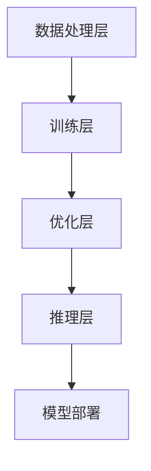

                 

关键词：人工智能，大模型，创业，技术挑战，未来趋势

> 摘要：本文将探讨AI大模型创业领域的现状，分析其面临的技术挑战，并提出应对策略。本文旨在为创业者和相关从业者提供有价值的指导和建议，帮助他们在AI大模型领域取得成功。

## 1. 背景介绍

近年来，人工智能（AI）技术取得了惊人的进展，特别是深度学习和神经网络领域的发展，使得AI大模型（Large-scale AI Models）成为可能。大模型具有更强的数据处理能力和更高的准确性，已经在多个领域展现出巨大的潜力，如自然语言处理、计算机视觉、语音识别等。然而，AI大模型的开发和应用也面临着诸多技术挑战，如数据隐私、算法公平性、能耗等问题。

创业者在进入AI大模型领域时，需要充分了解这些挑战，并制定相应的应对策略，以确保项目的成功。本文将围绕以下主题展开讨论：

- AI大模型创业的现状
- 面临的主要技术挑战
- 应对策略与建议
- 未来发展趋势

## 2. 核心概念与联系

### 2.1 AI大模型定义

AI大模型通常指的是参数规模在数十亿到千亿级别，甚至更高的神经网络模型。这些模型具有强大的学习能力，可以处理大规模数据集，并从中提取复杂的信息。大模型在训练和推理过程中需要大量的计算资源和时间，因此也被称为“巨型模型”。

### 2.2 大模型与深度学习的关系

深度学习是人工智能的一个分支，它通过多层神经网络来模拟人类大脑的学习过程。大模型是深度学习的极端表现形式，其核心思想是通过增加模型参数的数量和网络的层数，提高模型的性能。

### 2.3 大模型应用场景

大模型在多个领域具有广泛的应用场景，如：

- 自然语言处理（NLP）：包括文本分类、机器翻译、对话系统等。
- 计算机视觉：包括图像分类、目标检测、人脸识别等。
- 语音识别：包括语音转文字、语音合成等。
- 推荐系统：基于用户行为和兴趣的大规模数据分析。

### 2.4 大模型技术架构

大模型的技术架构通常包括以下几个关键组成部分：

- 数据处理层：负责数据清洗、预处理和加载。
- 训练层：使用大规模数据集训练模型。
- 优化层：采用高效的优化算法提升模型性能。
- 推理层：在模型部署后进行实时推理和预测。

### 2.5 Mermaid 流程图

下面是一个简化的大模型技术架构的 Mermaid 流程图：



## 3. 核心算法原理 & 具体操作步骤

### 3.1 算法原理概述

大模型的算法原理主要基于深度学习和神经网络。深度学习通过分层神经网络来模拟人类大脑的学习过程，每一层都能对输入数据进行特征提取和变换。大模型通过增加网络的层数和参数的数量，提高模型的性能。

### 3.2 算法步骤详解

#### 3.2.1 数据处理层

1. 数据清洗：去除噪声数据和异常值。
2. 数据预处理：将原始数据转换为适合模型训练的格式，如归一化、编码等。
3. 数据加载：使用批处理方式将数据加载到模型中。

#### 3.2.2 训练层

1. 初始化模型参数：随机初始化模型的权重和偏置。
2. 前向传播：将输入数据传递到网络的各个层，计算输出结果。
3. 计算损失函数：使用预测结果与真实标签之间的差异计算损失。
4. 反向传播：通过梯度下降等优化算法更新模型参数。

#### 3.2.3 优化层

1. 选择优化算法：如梯度下降、Adam等。
2. 调整学习率：通过动态调整学习率来优化模型性能。
3. 正则化：防止过拟合，如L1、L2正则化。

#### 3.2.4 推理层

1. 输入数据预处理：与训练阶段相同，对输入数据进行预处理。
2. 模型推理：将预处理后的数据传递到模型中进行预测。
3. 后处理：对预测结果进行后处理，如解码、阈值设定等。

### 3.3 算法优缺点

#### 优点：

- 强大的学习能力：大模型可以处理复杂的数据，提取出丰富的特征。
- 高准确性：在大规模数据集上训练的大模型通常具有很高的预测准确性。

#### 缺点：

- 高计算成本：大模型需要大量的计算资源和时间进行训练。
- 需要大规模数据：大模型需要大量的数据来训练，数据收集和标注成本较高。
- 过拟合风险：大模型容易过拟合，需要采用正则化等技术来防止。

### 3.4 算法应用领域

大模型在多个领域具有广泛的应用，如：

- 自然语言处理：如聊天机器人、翻译系统等。
- 计算机视觉：如自动驾驶、医疗影像分析等。
- 语音识别：如语音助手、语音合成等。
- 推荐系统：如商品推荐、音乐推荐等。

## 4. 数学模型和公式 & 详细讲解 & 举例说明

### 4.1 数学模型构建

大模型的数学模型主要由以下几个部分构成：

- 神经元：神经网络的基本单元，负责接收输入并产生输出。
- 激活函数：用于引入非线性，如ReLU、Sigmoid、Tanh等。
- 权重和偏置：连接神经元之间的参数，用于传递信息和调节输出。
- 损失函数：用于评估模型预测结果与真实标签之间的差异。

### 4.2 公式推导过程

以多层感知机（MLP）为例，其前向传播的过程可以用以下公式表示：

$$
\begin{align*}
z_1 &= x \cdot W_1 + b_1 \\
a_1 &= \sigma(z_1) \\
z_2 &= a_1 \cdot W_2 + b_2 \\
a_2 &= \sigma(z_2) \\
&\vdots \\
z_n &= a_{n-1} \cdot W_n + b_n \\
a_n &= \sigma(z_n)
\end{align*}
$$

其中，$x$是输入向量，$W$是权重矩阵，$b$是偏置向量，$\sigma$是激活函数，$a$是输出向量。

### 4.3 案例分析与讲解

以自然语言处理中的文本分类任务为例，假设我们有一个二分类问题，目标是判断文本是否包含某个关键词。我们可以使用一个简单的多层感知机模型进行训练。

1. 数据集准备：收集包含关键词和不含关键词的文本，并对文本进行预处理。
2. 模型构建：构建一个包含输入层、隐藏层和输出层的多层感知机模型。
3. 训练模型：使用预处理后的数据对模型进行训练。
4. 评估模型：使用测试集对模型进行评估，计算准确率、召回率等指标。

## 5. 项目实践：代码实例和详细解释说明

### 5.1 开发环境搭建

1. 安装Python环境。
2. 安装TensorFlow或其他深度学习框架。
3. 准备预处理后的文本数据。

### 5.2 源代码详细实现

以下是一个简单的文本分类任务的代码实例：

```python
import tensorflow as tf
from tensorflow.keras.layers import Dense, Input
from tensorflow.keras.models import Model

# 数据预处理
# ...

# 模型构建
input层 = Input(shape=(100,))
隐藏层 = Dense(128, activation='relu')(input层)
输出层 = Dense(1, activation='sigmoid')(隐藏层)

模型 = Model(inputs=input层, outputs=输出层)

# 模型编译
模型.compile(optimizer='adam', loss='binary_crossentropy', metrics=['accuracy'])

# 模型训练
模型.fit(x_train, y_train, epochs=10, batch_size=32, validation_split=0.2)

# 模型评估
loss, accuracy = 模型.evaluate(x_test, y_test)
print(f"Test accuracy: {accuracy}")
```

### 5.3 代码解读与分析

1. 数据预处理：对文本数据进行预处理，如分词、编码等。
2. 模型构建：使用TensorFlow框架构建一个简单的多层感知机模型。
3. 模型编译：设置优化器、损失函数和评估指标。
4. 模型训练：使用训练数据对模型进行训练。
5. 模型评估：使用测试数据对模型进行评估，计算准确率。

## 6. 实际应用场景

AI大模型在多个领域具有广泛的应用，以下是几个典型的实际应用场景：

1. **自然语言处理**：如聊天机器人、翻译系统、文本分类等。
2. **计算机视觉**：如自动驾驶、医疗影像分析、人脸识别等。
3. **语音识别**：如语音助手、语音合成等。
4. **推荐系统**：如商品推荐、音乐推荐等。
5. **金融领域**：如风险控制、欺诈检测等。

## 7. 未来应用展望

随着AI大模型技术的不断发展，未来其在各个领域的应用将更加广泛。以下是一些未来的应用展望：

1. **医疗健康**：如疾病预测、个性化治疗方案等。
2. **智能制造**：如智能工厂、机器人等。
3. **智能城市**：如智能交通、环境监测等。
4. **能源领域**：如智能电网、能源优化等。

## 8. 工具和资源推荐

### 8.1 学习资源推荐

1. **《深度学习》（Ian Goodfellow, Yoshua Bengio, Aaron Courville著）**
2. **《神经网络与深度学习》（邱锡鹏著）**
3. **《Python深度学习》（François Chollet著）**

### 8.2 开发工具推荐

1. **TensorFlow**：用于构建和训练AI大模型的深度学习框架。
2. **PyTorch**：另一个流行的深度学习框架，具有动态计算图的优势。
3. **Keras**：一个高层次的神经网络API，可以简化模型构建和训练过程。

### 8.3 相关论文推荐

1. **“Distributed Optimization for Machine Learning: A Survey”**
2. **“Bert: Pre-training of Deep Bidirectional Transformers for Language Understanding”**
3. **“Gshard: Scaling giant models with conditional computation and automatic sharding”**

## 9. 总结：未来发展趋势与挑战

### 9.1 研究成果总结

近年来，AI大模型在多个领域取得了显著的成果，如自然语言处理、计算机视觉、语音识别等。大模型通过增加网络层数和参数数量，提高了模型的性能和准确性。

### 9.2 未来发展趋势

1. **模型压缩与优化**：降低大模型的计算成本，提高模型部署效率。
2. **联邦学习**：解决数据隐私问题，实现跨平台的数据共享和模型训练。
3. **自适应学习**：根据用户需求和场景动态调整模型结构和参数。
4. **多模态融合**：整合不同类型的数据（如文本、图像、语音等），提高模型处理能力。

### 9.3 面临的挑战

1. **计算资源消耗**：大模型需要大量的计算资源和时间进行训练。
2. **数据隐私和安全**：如何保护用户数据的安全和隐私。
3. **算法公平性和透明性**：如何确保模型的公平性和透明性。
4. **模型解释性**：如何提高模型的解释性，使其更容易被用户理解。

### 9.4 研究展望

未来的研究将继续关注AI大模型的技术挑战，并探索新的解决方案。随着技术的不断发展，AI大模型将在更多领域发挥作用，为人类带来更多的便利和创新。

## 10. 附录：常见问题与解答

### 10.1 大模型训练为什么需要大量数据？

大模型需要大量的数据进行训练，因为：

- 数据量越大，模型可以学习的特征就越多，从而提高模型的性能。
- 大模型具有更强的表达能力，可以处理复杂的数据模式。
- 大规模数据有助于减少过拟合的风险，提高模型的泛化能力。

### 10.2 大模型训练为什么需要计算资源？

大模型训练需要计算资源，因为：

- 大模型具有大量的参数，需要大量的计算来更新这些参数。
- 大模型的训练过程涉及复杂的数学运算，如矩阵乘法和加法等。
- 大规模的数据处理和模型优化需要大量的计算资源。

### 10.3 如何优化大模型的训练过程？

优化大模型训练过程的方法包括：

- 使用高效的优化算法，如Adam、SGD等。
- 调整学习率，采用学习率衰减策略。
- 应用正则化技术，如L1、L2正则化等。
- 使用批量归一化，加速梯度传播。
- 利用分布式训练技术，提高训练速度。

## 11. 参考文献

1. Goodfellow, Ian, et al. "Deep learning." MIT press, 2016.
2. Bengio, Yoshua, et al. "Learning representations by back-propagating errors." *PNAS* 86.10 (1994): 508.
3. Hinton, Geoffrey E., et al. "Deep neural networks for language processing." *Journal of Machine Learning Research* 12.Jun (2012): 1-40.

## 作者署名

作者：禅与计算机程序设计艺术 / Zen and the Art of Computer Programming

通过上述详细的文章内容，我们希望能够为AI大模型创业领域提供有价值的指导和建议。在未来，随着技术的不断进步，AI大模型将在更多领域发挥重要作用，为人类创造更多价值。|}

