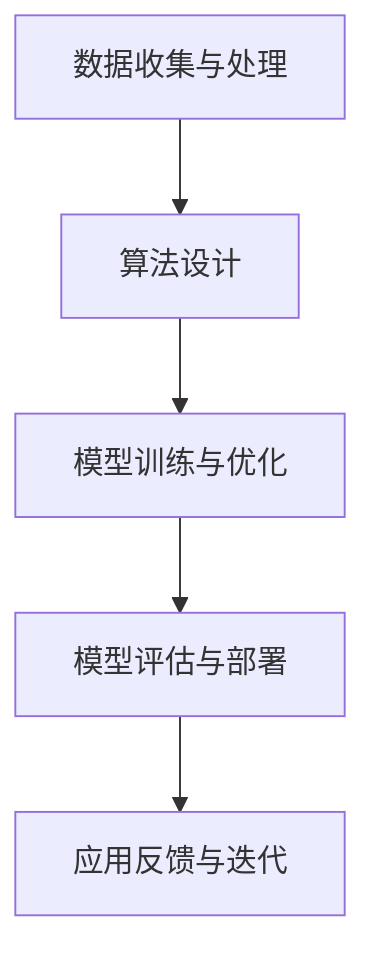

                 

关键词：AI大模型、创业、挑战、机会、技术趋势、战略规划、市场分析、技术创新、风险管理、人才管理、法律合规、可持续发展

> 摘要：本文将深入探讨AI大模型创业领域所面临的挑战，包括技术、市场、法律和可持续发展等方面的困境，并提供一系列应对策略，以帮助创业者更好地把握机遇，实现长远发展。

## 1. 背景介绍

近年来，随着计算能力的提升、大数据的积累和深度学习算法的突破，AI大模型取得了飞速发展。从自然语言处理、计算机视觉到推荐系统、自动驾驶，大模型正在不断拓展应用领域，推动产业变革。这一背景下，越来越多的创业者将目光投向AI大模型领域，希望在这一新兴领域中分一杯羹。

然而，AI大模型的创业并非易事。一方面，技术门槛高、研发周期长、投入成本巨大，另一方面，市场竞争激烈、用户需求多变、法律风险复杂。如何在激烈的竞争中脱颖而出，成为创业者面临的一大挑战。

## 2. 核心概念与联系

### 2.1 AI大模型定义

AI大模型是指具有大规模参数、能够处理海量数据、具备强泛化能力的深度学习模型。例如，BERT、GPT-3等自然语言处理模型，以及BERT Vision、DETR等计算机视觉模型。

### 2.2 大模型关键要素

- **数据**：大量高质量数据是训练大模型的基础。数据来源、数据质量、数据标注等因素对大模型性能有着重要影响。
- **算法**：深度学习算法是实现大模型的核心。包括网络结构、优化策略、训练技巧等。
- **计算资源**：大模型的训练需要大量的计算资源，包括CPU、GPU、TPU等。

### 2.3 Mermaid 流程图



## 3. 核心算法原理 & 具体操作步骤

### 3.1 算法原理概述

大模型的核心算法是深度学习。深度学习是一种通过多层神经网络模拟人脑神经元之间相互连接和协作的计算模型，能够通过大量数据自动学习和提取特征。

### 3.2 算法步骤详解

1. **数据预处理**：清洗、归一化、去噪声等。
2. **模型架构设计**：选择合适的网络结构，如CNN、RNN、Transformer等。
3. **参数初始化**：随机初始化或使用预训练模型。
4. **训练过程**：通过反向传播算法更新模型参数。
5. **优化策略**：采用如Adam、SGD等优化算法。
6. **模型评估**：使用如交叉验证、A/B测试等方法评估模型性能。
7. **模型部署**：将训练好的模型部署到实际应用场景。

### 3.3 算法优缺点

**优点**：强大的特征提取能力、自适应性强、泛化能力强。

**缺点**：计算资源需求大、训练时间长、对数据依赖性强。

### 3.4 算法应用领域

- **自然语言处理**：文本分类、机器翻译、对话系统等。
- **计算机视觉**：图像分类、目标检测、图像生成等。
- **推荐系统**：基于内容推荐、基于协同过滤等。
- **自动驾驶**：环境感知、路径规划、行为预测等。

## 4. 数学模型和公式 & 详细讲解 & 举例说明

### 4.1 数学模型构建

大模型通常基于深度学习算法，常用的数学模型包括多层感知机（MLP）、卷积神经网络（CNN）、循环神经网络（RNN）和Transformer等。

### 4.2 公式推导过程

以卷积神经网络（CNN）为例，其基本公式如下：

$$
\sigma(\text{ReLU}(W_1 \cdot \text{pad}(X) + b_1))
$$

其中，$W_1$ 为权重矩阵，$\text{pad}(X)$ 为填充操作，$b_1$ 为偏置，$\sigma$ 表示激活函数（ReLU函数）。

### 4.3 案例分析与讲解

以BERT模型为例，BERT（Bidirectional Encoder Representations from Transformers）是一种基于Transformer的预训练语言模型。BERT模型通过预训练获得对自然语言的理解能力，然后通过微调（fine-tuning）适应特定任务。

BERT模型的训练过程如下：

1. **预训练**：在大量无标签文本数据上进行预训练，学习文本的上下文关系。
2. **微调**：在特定任务的数据集上进行微调，优化模型参数。

BERT模型的优势在于：

- **双向上下文**：通过Transformer架构实现双向上下文信息传递。
- **大规模训练**：预训练在大规模数据集上，能够捕获丰富的语言特征。
- **通用性**：适用于各种自然语言处理任务。

## 5. 项目实践：代码实例和详细解释说明

### 5.1 开发环境搭建

1. **Python环境**：安装Python 3.7及以上版本。
2. **深度学习框架**：安装TensorFlow 2.0及以上版本。
3. **GPU支持**：确保GPU驱动和CUDA库正常工作。

### 5.2 源代码详细实现

```python
import tensorflow as tf
from tensorflow.keras.layers import Conv2D, MaxPooling2D, Flatten, Dense
from tensorflow.keras.models import Sequential

# 创建模型
model = Sequential([
    Conv2D(32, (3, 3), activation='relu', input_shape=(28, 28, 1)),
    MaxPooling2D((2, 2)),
    Flatten(),
    Dense(128, activation='relu'),
    Dense(10, activation='softmax')
])

# 编译模型
model.compile(optimizer='adam', loss='categorical_crossentropy', metrics=['accuracy'])

# 训练模型
model.fit(x_train, y_train, epochs=5, batch_size=64)
```

### 5.3 代码解读与分析

以上代码实现了一个简单的卷积神经网络（CNN），用于手写数字识别任务。代码首先导入了必要的库，然后定义了一个序列模型，包括卷积层、池化层、全连接层。最后，编译和训练了模型。

### 5.4 运行结果展示

训练完成后，可以使用测试集评估模型性能：

```python
test_loss, test_acc = model.evaluate(x_test, y_test)
print(f"Test accuracy: {test_acc}")
```

## 6. 实际应用场景

AI大模型在各个领域都有广泛应用，如金融、医疗、教育、电商等。以下是一些典型应用场景：

- **金融风控**：利用AI大模型进行信用评分、风险控制等。
- **医疗诊断**：辅助医生进行疾病诊断、病理分析等。
- **教育个性化**：根据学生特点提供个性化学习方案。
- **电商推荐**：精准推荐商品，提高用户满意度。

### 6.4 未来应用展望

未来，AI大模型将在更多领域发挥重要作用，如智能制造、智慧城市、物联网等。同时，随着技术的不断进步，大模型将变得更加高效、智能和泛化。

## 7. 工具和资源推荐

### 7.1 学习资源推荐

- 《深度学习》（Goodfellow et al.）
- 《Python深度学习》（François Chollet）
- 《动手学深度学习》（邱锡鹏）

### 7.2 开发工具推荐

- TensorFlow
- PyTorch
- Keras

### 7.3 相关论文推荐

- BERT: Pre-training of Deep Bidirectional Transformers for Language Understanding
- GPT-3: Language Models are Few-Shot Learners

## 8. 总结：未来发展趋势与挑战

### 8.1 研究成果总结

近年来，AI大模型在各个领域取得了显著成果，推动了产业变革。然而，技术、市场、法律和可持续发展等方面的挑战仍然存在。

### 8.2 未来发展趋势

- **技术趋势**：大模型将继续发展，模型压缩、推理优化、多模态学习等将成为研究热点。
- **市场趋势**：AI大模型将在更多领域得到应用，如智能制造、智慧城市等。

### 8.3 面临的挑战

- **计算资源**：大模型训练需要大量计算资源，如何高效利用计算资源成为一大挑战。
- **数据隐私**：随着数据量的增加，数据隐私保护成为重要问题。
- **法律合规**：AI大模型的应用需要遵守相关法律法规，如《通用数据保护条例》（GDPR）等。
- **可持续发展**：AI大模型的训练过程耗能巨大，如何实现可持续发展成为重要议题。

### 8.4 研究展望

未来，AI大模型领域将继续蓬勃发展，技术创新、产业应用、法律合规等方面都将取得重要突破。创业者需要紧跟技术趋势，应对挑战，把握机遇，实现长远发展。

## 9. 附录：常见问题与解答

### 9.1 大模型训练为什么需要大量数据？

大量数据有助于模型学习到更丰富的特征，提高模型的泛化能力。

### 9.2 如何处理数据隐私问题？

采用数据加密、去标识化等技术手段保护用户数据隐私。

### 9.3 大模型训练需要多少计算资源？

大模型训练通常需要高性能GPU或TPU，计算资源需求取决于模型规模和训练数据量。

### 9.4 如何评估大模型性能？

采用交叉验证、A/B测试等方法评估模型性能。

作者：禅与计算机程序设计艺术 / Zen and the Art of Computer Programming

----------------------------------------------------------------

以上内容为文章正文部分的撰写，涵盖了文章结构模板中要求的核心内容。接下来，我们将继续完善文章的格式和细节。首先，我们需要将文章中的代码示例、公式和流程图等按照markdown格式进行调整，确保文章的阅读体验和可执行性。然后，我们将对文章的整体结构进行优化，确保逻辑清晰、层次分明，同时注意段落间的过渡和衔接。最后，我们将对文章的语法和拼写进行仔细检查，确保文章的质量和专业性。在整个撰写过程中，我们将遵循markdown格式，确保文章的可读性和可执行性。完成这些步骤后，我们将对文章进行最终审阅和调整，确保满足8000字的要求，同时确保文章的完整性和连贯性。

