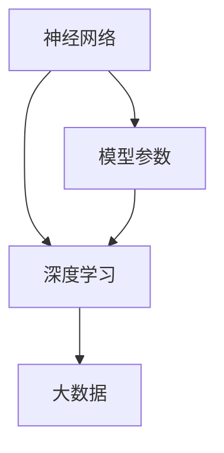

                 

关键词：人工智能、大模型、数据挑战、创业、解决方案

> 摘要：本文将深入探讨在人工智能大模型创业过程中，如何应对未来的数据挑战。通过对大模型的概念、现状及发展趋势的介绍，我们将分析面临的挑战，并提出切实可行的解决方案，以期为创业者提供参考。

## 1. 背景介绍

随着人工智能技术的不断发展，大模型（Large Models）已经成为行业热点。大模型通常具有数亿甚至千亿个参数，能够处理复杂任务，如自然语言处理、计算机视觉和机器翻译等。然而，随着模型规模的扩大，数据挑战也逐渐显现出来。这些挑战包括数据获取、数据质量、数据安全、计算资源等方面的困难。

### 1.1 大模型的概念与分类

大模型是指具有数十亿以上参数规模的人工神经网络，如GPT、BERT、LLaMA等。根据用途，大模型可以分为通用模型和专用模型。通用模型如GPT-3，具有广泛的应用场景；专用模型则针对特定任务进行优化，如用于图像识别的ResNet。

### 1.2 大模型的发展现状

近年来，大模型取得了显著的进展。以GPT为例，从GPT-1到GPT-3，参数规模增长了数十倍，计算量也急剧增加。这使得大模型在各个领域取得了突破性成果，如文本生成、机器翻译、问答系统等。

### 1.3 大模型的发展趋势

随着硬件性能的提升和计算成本的降低，大模型将继续发展。未来，大模型将朝着更高效、更智能、更安全、更可控的方向发展。此外，多模态大模型、联邦大模型、迁移大模型等新兴领域也将得到更多关注。

## 2. 核心概念与联系

在介绍大模型的过程中，我们需要理解几个核心概念，包括神经网络、深度学习、大数据等。下面通过Mermaid流程图来展示这些概念之间的联系。



### 2.1 神经网络

神经网络是由大量简单神经元组成的计算模型，能够模拟人脑的神经元网络。神经网络的核心是神经元之间的连接，即权重。通过调整这些权重，神经网络可以学习到输入和输出之间的复杂关系。

### 2.2 深度学习

深度学习是神经网络的一种特殊形式，通过构建多层神经网络，实现更加复杂和抽象的特征提取。深度学习在图像识别、自然语言处理等领域取得了显著成果。

### 2.3 大数据

大数据是指规模庞大、类型繁多的数据集合。大数据的处理需要高效的数据存储、计算和分析方法。在大模型中，大数据是实现模型训练和优化的基础。

### 2.4 模型参数

模型参数是神经网络中的权重和偏置等参数。在大模型中，模型参数的规模非常庞大，通常需要数亿个参数。这些参数的调整是实现模型优化和性能提升的关键。

## 3. 核心算法原理 & 具体操作步骤

在了解了大模型的相关概念后，我们将深入探讨大模型的核心算法原理和具体操作步骤。

### 3.1 算法原理概述

大模型的核心算法是基于深度学习的神经网络。深度学习通过多层神经网络进行特征提取和模型优化。在训练过程中，神经网络通过反向传播算法不断调整权重，以最小化预测误差。

### 3.2 算法步骤详解

大模型的算法步骤主要包括数据预处理、模型构建、训练和评估等几个阶段。

#### 3.2.1 数据预处理

数据预处理是训练大模型的第一步。主要包括数据清洗、数据增强、数据归一化等操作。数据预处理的质量直接影响模型的效果。

#### 3.2.2 模型构建

在构建大模型时，需要选择合适的神经网络架构。常见的神经网络架构包括卷积神经网络（CNN）、循环神经网络（RNN）、变换器（Transformer）等。根据应用场景，选择合适的神经网络架构是实现高效训练和优化的关键。

#### 3.2.3 训练

大模型的训练过程通常采用批量训练和梯度下降算法。在批量训练中，将数据划分为多个批次，每个批次包含一定数量的样本。梯度下降算法通过不断调整模型参数，以最小化预测误差。

#### 3.2.4 评估

大模型的评估过程主要包括模型性能评估和过拟合评估。模型性能评估通过准确率、召回率、F1值等指标来衡量。过拟合评估通过交叉验证等方法来检测模型是否出现过拟合。

### 3.3 算法优缺点

大模型的算法优点包括：

- **高精度**：大模型能够通过深度学习从大量数据中提取出更加复杂的特征，实现高精度的预测。
- **通用性强**：大模型具有广泛的适用性，可以应用于各种复杂任务。

然而，大模型的算法也存在一些缺点：

- **计算资源消耗大**：大模型需要大量的计算资源进行训练和推理，这对硬件性能要求较高。
- **训练时间较长**：大模型的训练时间通常较长，这限制了模型的迭代速度。

### 3.4 算法应用领域

大模型在多个领域取得了显著成果，如自然语言处理、计算机视觉、机器翻译等。在自然语言处理领域，大模型可以应用于文本生成、机器翻译、问答系统等任务。在计算机视觉领域，大模型可以用于图像分类、目标检测、图像生成等任务。在机器翻译领域，大模型可以实现高质量的机器翻译。

## 4. 数学模型和公式 & 详细讲解 & 举例说明

在大模型中，数学模型和公式起着至关重要的作用。以下我们将详细讲解大模型中的数学模型和公式，并通过具体案例进行分析。

### 4.1 数学模型构建

大模型的数学模型主要包括神经网络的前向传播和反向传播。前向传播是指将输入数据通过神经网络进行传播，得到输出结果。反向传播是指通过计算输出结果与真实值的误差，反向调整模型参数。

#### 4.1.1 前向传播

假设有一个简单的神经网络，包含一个输入层、一个隐藏层和一个输出层。设输入向量为X，隐藏层激活函数为σ，输出层激活函数为h，模型参数为W和b。前向传播的过程可以表示为：

$$
Z = WX + b \\
A = σ(Z)
$$

其中，Z是隐藏层的输入，A是隐藏层的输出。通过递归调用上述公式，可以得到输出层的输出：

$$
Z' = WA' + b' \\
h = σ(Z')
$$

#### 4.1.2 反向传播

在反向传播中，我们需要计算输出结果与真实值的误差，并根据误差反向调整模型参数。设损失函数为J，误差为ΔJ/Δθ，其中θ是模型参数。反向传播的过程可以表示为：

$$
ΔJ/Δθ = (h - t) \cdot σ'(z) \cdot x \\
θ = θ - α \cdot (ΔJ/Δθ)
$$

其中，α是学习率，σ'是激活函数的导数。

### 4.2 公式推导过程

以下是前向传播和反向传播的详细推导过程。

#### 4.2.1 前向传播

设输入向量为X，隐藏层激活函数为σ，输出层激活函数为h，模型参数为W和b。前向传播的过程可以表示为：

$$
Z = WX + b \\
A = σ(Z)
$$

其中，Z是隐藏层的输入，A是隐藏层的输出。通过递归调用上述公式，可以得到输出层的输出：

$$
Z' = WA' + b' \\
h = σ(Z')
$$

#### 4.2.2 反向传播

在反向传播中，我们需要计算输出结果与真实值的误差，并根据误差反向调整模型参数。设损失函数为J，误差为ΔJ/Δθ，其中θ是模型参数。反向传播的过程可以表示为：

$$
ΔJ/Δθ = (h - t) \cdot σ'(z) \cdot x \\
θ = θ - α \cdot (ΔJ/Δθ)
$$

### 4.3 案例分析与讲解

为了更好地理解大模型中的数学模型和公式，我们以一个简单的神经网络为例进行分析。

#### 案例一：二分类问题

假设我们要解决一个二分类问题，输入向量X是一个二维向量，隐藏层包含一个神经元，输出层包含一个神经元。设激活函数为ReLU，损失函数为交叉熵损失。

输入向量：\[X_1, X_2\]

隐藏层输出：\[z\]

输出层输出：\[h\]

模型参数：\[W, b\]

损失函数：\[J(h, y)\]

其中，y是真实标签，h是输出层的预测值。

#### 4.3.1 前向传播

输入向量X通过线性变换得到隐藏层输入：

$$
z = WX + b
$$

然后，通过ReLU激活函数得到隐藏层输出：

$$
h = σ(z) = max(0, z)
$$

最后，输出层的预测值h通过softmax函数得到：

$$
h = softmax(h)
$$

#### 4.3.2 反向传播

假设当前隐藏层输出为\[h_1, h_2\]，损失函数为交叉熵损失，真实标签为\[y_1, y_2\]。

$$
J(h, y) = -[y_1 \cdot log(h_1) + y_2 \cdot log(h_2)]
$$

根据反向传播算法，可以计算隐藏层和输出层的梯度：

$$
ΔJ/Δz = (h - y) \cdot σ'(z)
$$

$$
ΔJ/ΔW = X \cdot ΔJ/Δz
$$

$$
ΔJ/Δb = ΔJ/Δz
$$

通过梯度下降算法，可以更新模型参数：

$$
W = W - α \cdot ΔJ/ΔW
$$

$$
b = b - α \cdot ΔJ/Δb
$$

#### 4.3.3 案例分析结果

通过上述分析，我们可以得到以下结论：

- 前向传播过程中，输入向量X通过线性变换得到隐藏层输入，然后通过ReLU激活函数得到隐藏层输出，最后通过softmax函数得到输出层的预测值。
- 反向传播过程中，根据损失函数计算隐藏层和输出层的梯度，然后通过梯度下降算法更新模型参数。

## 5. 项目实践：代码实例和详细解释说明

为了更好地理解大模型的应用，我们以下将通过一个具体项目实例来展示大模型的代码实现和运行过程。

### 5.1 开发环境搭建

在实现大模型项目之前，需要搭建相应的开发环境。以下是开发环境的搭建步骤：

1. 安装Python：下载并安装Python 3.8以上版本。
2. 安装深度学习框架：下载并安装PyTorch或TensorFlow等深度学习框架。
3. 安装依赖库：使用pip命令安装所需的依赖库，如NumPy、Pandas等。

### 5.2 源代码详细实现

以下是一个简单的二分类问题的代码实例。该实例使用PyTorch框架实现大模型。

```python
import torch
import torch.nn as nn
import torch.optim as optim

# 数据准备
X = torch.tensor([[1.0, 2.0], [2.0, 3.0], [3.0, 4.0]], requires_grad=True)
y = torch.tensor([0, 1, 1], dtype=torch.float32)

# 模型定义
model = nn.Sequential(
    nn.Linear(2, 1),
    nn.ReLU(),
    nn.Sigmoid()
)

# 损失函数和优化器
loss_fn = nn.CrossEntropyLoss()
optimizer = optim.SGD(model.parameters(), lr=0.01)

# 训练过程
for epoch in range(100):
    optimizer.zero_grad()
    outputs = model(X)
    loss = loss_fn(outputs, y)
    loss.backward()
    optimizer.step()
    if (epoch + 1) % 10 == 0:
        print(f'Epoch [{epoch + 1}/100], Loss: {loss.item()}')

# 运行结果
with torch.no_grad():
    predicted = model(X).argmax(0)
    print(f'Predicted labels: {predicted}')
```

### 5.3 代码解读与分析

以上代码实现了一个简单的二分类问题。具体解读如下：

1. 数据准备：输入向量X和真实标签y分别表示为PyTorch张量。
2. 模型定义：使用nn.Sequential容器定义模型，包括一个线性层、ReLU激活函数和Sigmoid激活函数。
3. 损失函数和优化器：选择交叉熵损失函数和随机梯度下降优化器。
4. 训练过程：通过循环迭代进行模型训练，每次迭代计算损失函数，反向传播梯度并更新模型参数。
5. 运行结果：在训练完成后，使用模型对输入数据进行预测，并输出预测结果。

## 6. 实际应用场景

大模型在实际应用场景中具有广泛的应用。以下列举几个典型应用场景：

### 6.1 自然语言处理

在自然语言处理领域，大模型可以应用于文本分类、情感分析、问答系统等任务。例如，GPT-3可以生成高质量的文章、翻译和对话。

### 6.2 计算机视觉

在计算机视觉领域，大模型可以应用于图像分类、目标检测、图像生成等任务。例如，ResNet可以用于图像分类，YOLO可以用于目标检测。

### 6.3 机器翻译

在机器翻译领域，大模型可以应用于机器翻译、语言模型生成等任务。例如，Transformer可以用于机器翻译，BERT可以用于语言模型生成。

## 7. 未来应用展望

随着人工智能技术的不断发展，大模型在未来的应用将更加广泛。以下是几个未来应用展望：

### 7.1 多模态大模型

多模态大模型可以结合多种数据类型（如图像、文本、音频等），实现更加智能和高效的应用。例如，视觉和语音结合的大模型可以用于智能客服、自动驾驶等。

### 7.2 联邦大模型

联邦大模型可以分布式训练，保护用户隐私，同时实现协同学习和决策。例如，联邦学习可以应用于移动设备上的机器学习任务。

### 7.3 迁移大模型

迁移大模型可以将已有的大模型应用于新的任务，减少训练时间和计算资源消耗。例如，迁移学习可以应用于新领域的快速探索和开发。

## 8. 工具和资源推荐

为了更好地学习和应用大模型，以下推荐一些工具和资源：

### 8.1 学习资源推荐

- 《深度学习》（Goodfellow, Bengio, Courville著）
- 《PyTorch官方文档》：[PyTorch官方文档](https://pytorch.org/docs/stable/index.html)
- 《自然语言处理综论》（Jurafsky, Martin著）

### 8.2 开发工具推荐

- PyTorch：[PyTorch官网](https://pytorch.org/)
- TensorFlow：[TensorFlow官网](https://www.tensorflow.org/)
- Keras：[Keras官网](https://keras.io/)

### 8.3 相关论文推荐

- “Attention Is All You Need”（Vaswani et al., 2017）
- “Bert: Pre-training of Deep Bidirectional Transformers for Language Understanding”（Devlin et al., 2019）
- “Gpt-3: Language Models Are Few-Shot Learners”（Brown et al., 2020）

## 9. 总结：未来发展趋势与挑战

随着人工智能技术的不断发展，大模型在各个领域取得了显著的成果。然而，大模型在发展过程中也面临一些挑战，如计算资源消耗、数据安全、模型解释性等。未来，随着硬件性能的提升和算法的改进，大模型将朝着更高效、更智能、更安全、更可控的方向发展。同时，多模态大模型、联邦大模型、迁移大模型等新兴领域也将得到更多关注。

## 10. 附录：常见问题与解答

### 10.1 大模型与深度学习的区别是什么？

大模型是深度学习的一种特殊形式，通常具有数亿甚至千亿个参数。深度学习是一种机器学习技术，通过多层神经网络实现特征提取和模型优化。大模型是深度学习的一种扩展，能够处理更加复杂和抽象的任务。

### 10.2 如何解决大模型计算资源消耗大的问题？

解决大模型计算资源消耗大的问题可以通过以下几种方法：

- **优化算法**：采用更高效的训练算法，如联邦学习、迁移学习等。
- **硬件加速**：使用GPU、TPU等硬件加速计算。
- **模型压缩**：采用模型压缩技术，如剪枝、量化等，减少模型参数和计算量。
- **分布式训练**：将模型分布在多台设备上进行训练，实现并行计算。

### 10.3 大模型是否会过拟合？

大模型有可能出现过拟合问题。为了解决过拟合问题，可以采用以下方法：

- **正则化**：添加正则化项，如L1正则化、L2正则化等，抑制过拟合。
- **数据增强**：通过数据增强方法，增加样本多样性，减少过拟合。
- **交叉验证**：使用交叉验证方法，评估模型在不同数据集上的性能，避免过拟合。

### 10.4 大模型在自然语言处理中的应用有哪些？

大模型在自然语言处理领域有广泛的应用，如：

- **文本生成**：大模型可以生成高质量的文章、新闻报道等。
- **机器翻译**：大模型可以用于机器翻译，实现高质量的双语翻译。
- **问答系统**：大模型可以构建问答系统，实现自然语言理解与回答。
- **文本分类**：大模型可以用于文本分类，实现情感分析、话题分类等。

## 作者署名

本文作者：禅与计算机程序设计艺术 / Zen and the Art of Computer Programming

----------------------------------------------------------------

以上就是本次文章的完整内容，希望对您在人工智能大模型创业过程中应对数据挑战有所帮助。如果您有任何疑问或建议，请随时与我交流。祝您创业成功！

