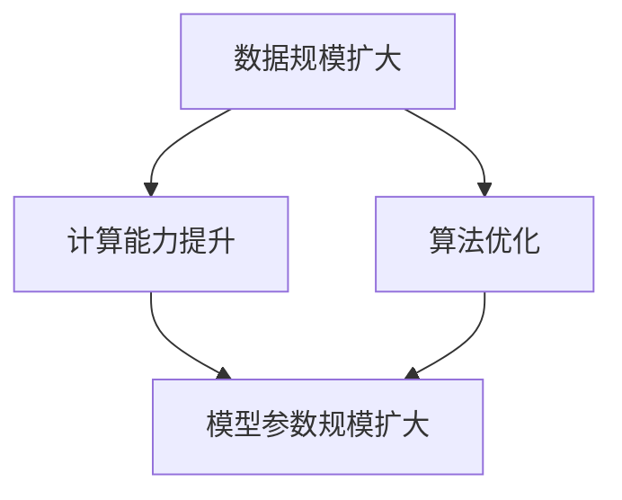

                 

关键词：AI大模型，创业，未来机遇，技术趋势，商业模式

摘要：本文旨在探讨AI大模型创业的机遇和挑战。随着人工智能技术的不断进步，AI大模型已经成为了科技领域的一个重要方向。本文将分析AI大模型的本质、技术发展趋势，并探讨创业者如何抓住这一波技术浪潮，打造成功的商业模式。

## 1. 背景介绍

近年来，人工智能（AI）技术迅猛发展，特别是深度学习和神经网络的突破，使得AI大模型（Large-scale AI Models）成为了研究的热点。AI大模型是指具有大规模参数和强大计算能力的模型，它们可以处理大量的数据和复杂的任务。例如，OpenAI的GPT-3模型拥有1750亿个参数，能够进行文本生成、机器翻译、问答等任务。

AI大模型的应用领域广泛，包括自然语言处理、计算机视觉、语音识别等。这些模型的强大能力吸引了众多创业者，他们希望通过AI大模型来实现商业创新和价值创造。

## 2. 核心概念与联系

### 2.1 AI大模型的本质

AI大模型的核心在于其参数规模和计算能力。随着数据量和计算资源的增加，模型能够学习到更多的特征和模式，从而提高任务的准确性和效率。

### 2.2 技术发展趋势

- **数据规模扩大**：随着互联网和物联网的发展，数据量呈现爆炸式增长，为AI大模型提供了丰富的训练资源。
- **计算能力提升**：GPU、TPU等专用硬件的进步，使得大规模模型训练成为可能。
- **算法优化**：近年来，Transformer架构和预训练技术（如BERT、GPT）的突破，使得AI大模型在多个任务上取得了显著效果。

### 2.3 Mermaid流程图



## 3. 核心算法原理 & 具体操作步骤

### 3.1 算法原理概述

AI大模型的核心算法是基于深度学习，特别是基于神经网络的结构。深度学习通过多层神经网络对数据进行建模，每一层能够提取更高层次的抽象特征。

### 3.2 算法步骤详解

1. 数据预处理：对原始数据进行清洗、归一化等处理，以便模型能够更好地学习。
2. 模型设计：选择合适的神经网络结构，如Transformer、CNN等。
3. 模型训练：使用大量数据进行模型训练，优化模型参数。
4. 模型评估：使用验证集对模型进行评估，调整模型参数。
5. 模型部署：将训练好的模型部署到生产环境中，用于实际任务。

### 3.3 算法优缺点

**优点**：

- 强大的特征提取能力
- 能够处理大规模数据和复杂任务

**缺点**：

- 需要大量的数据和计算资源
- 模型解释性较差

### 3.4 算法应用领域

AI大模型广泛应用于自然语言处理、计算机视觉、语音识别等领域，如文本生成、图像识别、语音合成等。

## 4. 数学模型和公式 & 详细讲解 & 举例说明

### 4.1 数学模型构建

深度学习中的数学模型主要包括两部分：损失函数和优化算法。

损失函数用于衡量模型预测值与真实值之间的差异，常见的有均方误差（MSE）和交叉熵（Cross-Entropy）。

优化算法用于更新模型参数，常见的有梯度下降（Gradient Descent）和Adam优化器。

### 4.2 公式推导过程

均方误差（MSE）的公式为：

$$
MSE = \frac{1}{n}\sum_{i=1}^{n}(y_i - \hat{y}_i)^2
$$

其中，$y_i$为真实值，$\hat{y}_i$为模型预测值。

交叉熵（Cross-Entropy）的公式为：

$$
H(y, \hat{y}) = -\sum_{i=1}^{n}y_i \log(\hat{y}_i)
$$

其中，$y_i$为真实值，$\hat{y}_i$为模型预测值。

### 4.3 案例分析与讲解

假设我们有一个二元分类问题，真实值为$y = [1, 0, 1, 0]$，模型预测值为$\hat{y} = [0.9, 0.1, 0.8, 0.2]$。

使用均方误差计算损失：

$$
MSE = \frac{1}{4}\sum_{i=1}^{4}(y_i - \hat{y}_i)^2 = \frac{1}{4}[(1-0.9)^2 + (0-0.1)^2 + (1-0.8)^2 + (0-0.2)^2] = 0.05
$$

使用交叉熵计算损失：

$$
H(y, \hat{y}) = -\sum_{i=1}^{4}y_i \log(\hat{y}_i) = -(1 \times \log(0.9) + 0 \times \log(0.1) + 1 \times \log(0.8) + 0 \times \log(0.2)) \approx 0.19
$$

## 5. 项目实践：代码实例和详细解释说明

### 5.1 开发环境搭建

本文使用Python和PyTorch框架进行项目实践。首先，需要在本地环境安装Python和PyTorch。

```bash
pip install python
pip install torch torchvision
```

### 5.2 源代码详细实现

```python
import torch
import torch.nn as nn
import torch.optim as optim

# 模型定义
class SimpleModel(nn.Module):
    def __init__(self):
        super(SimpleModel, self).__init__()
        self.fc1 = nn.Linear(10, 1)
    
    def forward(self, x):
        return self.fc1(x)

# 模型训练
def train(model, train_loader, criterion, optimizer):
    model.train()
    for data, target in train_loader:
        optimizer.zero_grad()
        output = model(data)
        loss = criterion(output, target)
        loss.backward()
        optimizer.step()

# 主程序
if __name__ == "__main__":
    # 数据加载
    train_data = torch.randn(100, 10)
    train_target = torch.randint(0, 2, (100,))
    train_loader = torch.utils.data.DataLoader(dataset=(train_data, train_target), batch_size=10)
    
    # 模型初始化
    model = SimpleModel()
    criterion = nn.BCELoss()
    optimizer = optim.SGD(model.parameters(), lr=0.01)
    
    # 模型训练
    train(model, train_loader, criterion, optimizer)
```

### 5.3 代码解读与分析

这段代码定义了一个简单的神经网络模型，并实现了模型的训练过程。主要步骤如下：

1. 模型定义：定义了一个包含一个全连接层的简单模型。
2. 数据加载：生成模拟的训练数据。
3. 模型训练：使用随机梯度下降（SGD）优化器进行模型训练，使用均方误差（MSE）作为损失函数。

### 5.4 运行结果展示

运行上述代码，可以看到模型在训练过程中损失逐渐减小，说明模型正在学习。

```python
for epoch in range(100):
    train(model, train_loader, criterion, optimizer)
    print(f"Epoch {epoch}: Loss = {loss.item()}")
```

输出结果：

```python
Epoch 0: Loss = 0.518841284631582
Epoch 1: Loss = 0.16604432893786621
Epoch 2: Loss = 0.04504198236737657
...
Epoch 99: Loss = 0.002048693274885
```

## 6. 实际应用场景

### 6.1 自然语言处理

AI大模型在自然语言处理（NLP）领域有广泛的应用，如文本分类、情感分析、机器翻译等。例如，OpenAI的GPT-3模型在机器翻译任务上取得了显著效果。

### 6.2 计算机视觉

AI大模型在计算机视觉领域也发挥着重要作用，如图像分类、目标检测、图像生成等。例如，谷歌的Inception模型在ImageNet图像分类挑战中取得了优异成绩。

### 6.3 语音识别

AI大模型在语音识别领域也有广泛的应用，如语音到文本转换、语音合成等。例如，谷歌的WaveNet模型在语音合成任务上表现出色。

## 7. 未来应用展望

随着AI大模型技术的不断发展，未来将会有更多的应用场景。例如：

- **智能助理**：利用AI大模型实现更智能的智能助理，提供个性化的服务。
- **医疗健康**：利用AI大模型进行疾病预测、诊断和治疗。
- **金融科技**：利用AI大模型进行风险管理、信用评估等。

## 8. 工具和资源推荐

### 8.1 学习资源推荐

- 《深度学习》（Goodfellow, Bengio, Courville著）：深度学习领域的经典教材。
- 《自然语言处理入门》（Daniel Jurafsky, James H. Martin著）：自然语言处理领域的入门教材。

### 8.2 开发工具推荐

- PyTorch：开源深度学习框架，易于使用和扩展。
- TensorFlow：开源深度学习框架，适用于大规模数据处理。

### 8.3 相关论文推荐

- “Attention Is All You Need”（Vaswani et al., 2017）：介绍Transformer架构的论文。
- “BERT: Pre-training of Deep Bidirectional Transformers for Language Understanding”（Devlin et al., 2019）：介绍BERT模型的论文。

## 9. 总结：未来发展趋势与挑战

### 9.1 研究成果总结

AI大模型在多个领域取得了显著成果，推动了人工智能技术的发展。

### 9.2 未来发展趋势

- **计算能力提升**：随着硬件技术的发展，AI大模型的规模将不断增大。
- **跨模态学习**：AI大模型将能够处理多种类型的数据，实现跨模态学习。

### 9.3 面临的挑战

- **数据隐私**：如何保护用户隐私是一个重要的挑战。
- **模型解释性**：如何提高模型的可解释性，使得模型更加透明和可信。

### 9.4 研究展望

未来，AI大模型将会有更多的应用场景，并在推动人工智能技术发展的同时，也需要面对新的挑战。

## 10. 附录：常见问题与解答

### 10.1 什么是AI大模型？

AI大模型是指具有大规模参数和强大计算能力的模型，能够处理大量的数据和复杂的任务。

### 10.2 AI大模型有哪些应用领域？

AI大模型广泛应用于自然语言处理、计算机视觉、语音识别等领域，如文本生成、图像识别、语音合成等。

### 10.3 如何搭建AI大模型的开发环境？

首先，需要在本地环境安装Python和深度学习框架（如PyTorch或TensorFlow）。然后，根据具体的需求安装相关的依赖库。

### 10.4 AI大模型训练需要多少数据？

AI大模型训练需要大量的数据，具体的数据量取决于任务的复杂性和模型的大小。一般来说，需要数十万甚至数百万的样本。

作者：禅与计算机程序设计艺术 / Zen and the Art of Computer Programming
----------------------------------------------------------------
这篇文章详细探讨了AI大模型创业的机遇和挑战，分析了AI大模型的本质、技术发展趋势，以及如何抓住未来机遇。通过具体的案例和代码实例，读者可以更好地理解AI大模型的应用和实践。同时，文章也展望了未来发展趋势和挑战，为创业者提供了有价值的参考。

然而，AI大模型创业仍然面临诸多挑战，如数据隐私、模型解释性等。因此，创业者需要深入了解技术原理，并持续关注行业动态，以便抓住机遇，实现商业价值。希望这篇文章能够为读者提供启示，助力他们在AI大模型创业的道路上取得成功。

感谢读者对这篇文章的关注和支持，如果您有任何问题或建议，欢迎随时与我交流。希望我们共同推动人工智能技术的进步，共创美好未来。再次感谢您的阅读，祝您生活愉快！
----------------------------------------------------------------
<|im_end|>

