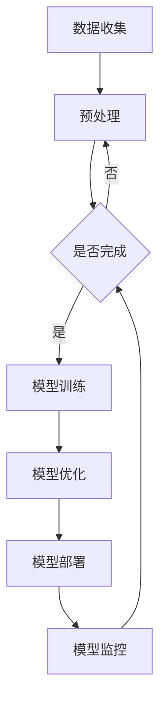

                 

关键词：AI大模型，商业模式，可持续性，创业，技术趋势，市场策略。

摘要：本文将探讨AI大模型在创业领域的应用，分析其商业模式的构建原则和可持续性发展策略。通过对AI大模型的核心概念、算法原理、数学模型以及实际应用场景的深入解析，为创业者提供指导性建议，助力构建未来可持续的商业模式。

## 1. 背景介绍

随着人工智能技术的快速发展，AI大模型已经成为行业的热门话题。从最初的深度学习模型到如今的大型预训练模型，如GPT-3、BERT等，AI大模型在自然语言处理、计算机视觉、语音识别等领域取得了显著的成果。这些模型具有强大的学习能力，能够处理复杂的任务，从而为各行各业带来了巨大的变革。

### 1.1 AI大模型的发展历程

AI大模型的发展可以分为以下几个阶段：

1. **深度学习模型**：以神经网络为基础，通过多层非线性变换来提取特征。
2. **预训练模型**：在大规模语料库上进行预训练，提高了模型的泛化能力。
3. **大型预训练模型**：如GPT-3、BERT等，具有数十亿甚至千亿级别的参数，能够处理更为复杂的任务。

### 1.2 AI大模型的应用领域

AI大模型的应用领域广泛，包括但不限于：

1. **自然语言处理**：文本分类、机器翻译、问答系统等。
2. **计算机视觉**：图像识别、目标检测、图像生成等。
3. **语音识别**：语音合成、语音识别、语音搜索等。
4. **医疗健康**：疾病诊断、药物研发、健康管理等。
5. **金融科技**：风险评估、信用评分、投资决策等。

## 2. 核心概念与联系

为了更好地理解AI大模型的商业价值，我们需要先了解其核心概念和架构。以下是AI大模型的核心概念及架构的Mermaid流程图：



### 2.1 数据收集与预处理

数据是AI大模型的基础。通过收集大量的数据，我们可以为模型提供丰富的样本，从而提高其性能。数据预处理包括数据清洗、归一化、编码等步骤，确保数据的质量和一致性。

### 2.2 模型训练

在数据预处理完成后，我们可以使用这些数据来训练模型。模型训练的过程包括前向传播、反向传播和梯度下降等步骤。通过不断调整模型的参数，使模型能够在训练数据上达到较好的性能。

### 2.3 模型优化

在模型训练过程中，我们可能需要对模型进行调整和优化。这包括调整学习率、批量大小等超参数，以及使用正则化、dropout等技术来防止过拟合。

### 2.4 模型部署

训练好的模型需要部署到实际应用环境中。这包括将模型集成到现有系统中，并提供API接口供其他模块调用。

### 2.5 模型监控

在模型部署后，我们需要对模型进行监控，以确保其性能的稳定性和可靠性。这包括监控模型的准确性、召回率等指标，以及及时发现和解决模型出现的问题。

## 3. 核心算法原理 & 具体操作步骤

### 3.1 算法原理概述

AI大模型的核心算法主要基于深度学习和自然语言处理技术。深度学习通过多层神经网络来提取特征，而自然语言处理则关注于如何处理和生成文本数据。以下是AI大模型的主要算法原理：

1. **卷积神经网络（CNN）**：用于图像识别和目标检测。
2. **循环神经网络（RNN）**：用于序列数据建模，如语音识别和机器翻译。
3. **长短时记忆网络（LSTM）**：RNN的改进版本，用于处理长序列数据。
4. **自注意力机制（Self-Attention）**：用于提高模型在处理长文本时的效果。
5. **Transformer模型**：基于自注意力机制的模型，具有强大的并行计算能力。

### 3.2 算法步骤详解

以下是AI大模型的具体操作步骤：

1. **数据收集**：从各种来源收集大量数据，包括文本、图像、语音等。
2. **数据预处理**：对数据进行清洗、归一化和编码等处理。
3. **模型选择**：根据任务需求选择合适的模型架构。
4. **模型训练**：使用预处理后的数据对模型进行训练，通过调整参数优化模型性能。
5. **模型评估**：使用验证集和测试集对模型进行评估，调整超参数以实现更好的性能。
6. **模型部署**：将训练好的模型部署到生产环境中，提供API接口供其他模块调用。
7. **模型监控**：对模型进行监控，确保其性能的稳定性和可靠性。

### 3.3 算法优缺点

AI大模型具有以下优点：

1. **强大的学习能力**：能够处理复杂的任务，提高模型的泛化能力。
2. **高效的计算能力**：基于自注意力机制的Transformer模型具有强大的并行计算能力。

但AI大模型也存在以下缺点：

1. **计算资源需求高**：训练和部署AI大模型需要大量的计算资源和存储空间。
2. **数据依赖性强**：AI大模型的性能很大程度上依赖于数据的质量和数量。

### 3.4 算法应用领域

AI大模型的应用领域广泛，包括但不限于：

1. **自然语言处理**：文本分类、机器翻译、问答系统等。
2. **计算机视觉**：图像识别、目标检测、图像生成等。
3. **语音识别**：语音合成、语音识别、语音搜索等。
4. **医疗健康**：疾病诊断、药物研发、健康管理等。
5. **金融科技**：风险评估、信用评分、投资决策等。

## 4. 数学模型和公式 & 详细讲解 & 举例说明

### 4.1 数学模型构建

AI大模型的数学模型主要基于深度学习和自然语言处理技术。以下是几个常用的数学模型：

1. **卷积神经网络（CNN）**：

$$
h_{l}(x) = \sigma(W_{l} \cdot h_{l-1} + b_{l})
$$

其中，$h_{l}$ 表示第$l$层的特征映射，$\sigma$ 表示激活函数，$W_{l}$ 和 $b_{l}$ 分别为权重和偏置。

2. **循环神经网络（RNN）**：

$$
h_{t} = \sigma(W_{h} \cdot [h_{t-1}, x_{t}] + b_{h})
$$

其中，$h_{t}$ 表示第$t$个时间步的特征映射，$W_{h}$ 和 $b_{h}$ 分别为权重和偏置，$x_{t}$ 为输入。

3. **长短时记忆网络（LSTM）**：

$$
\begin{aligned}
i_{t} &= \sigma(W_{i} \cdot [h_{t-1}, x_{t}] + b_{i}) \\
f_{t} &= \sigma(W_{f} \cdot [h_{t-1}, x_{t}] + b_{f}) \\
\bar{C}_{t} &= \tanh(W_{c} \cdot [h_{t-1}, x_{t}] + b_{c}) \\
o_{t} &= \sigma(W_{o} \cdot [h_{t-1}, \bar{C}_{t}] + b_{o}) \\
C_{t} &= f_{t} \odot C_{t-1} + i_{t} \odot \bar{C}_{t}
\end{aligned}
$$

其中，$i_{t}$、$f_{t}$、$o_{t}$ 分别为输入门、遗忘门和输出门，$\odot$ 表示元素乘积。

4. **Transformer模型**：

$$
\begin{aligned}
h_{t} &= \text{softmax}(A_{t} \cdot W_{o}) \\
A_{t} &= \text{softmax}(Q_{t} \cdot K_{t}^{T}) \\
K_{t} &= \text{mask-Attention}(Q_{t} \cdot K_{t}) \\
Q_{t} &= \text{mask-Attention}(K_{t} \cdot V_{t})
\end{aligned}
$$

其中，$h_{t}$ 为第$t$个时间步的特征映射，$Q_{t}$、$K_{t}$ 和 $V_{t}$ 分别为查询、键和值。

### 4.2 公式推导过程

以Transformer模型为例，我们简要介绍其公式的推导过程：

1. **多头自注意力（Multi-Head Self-Attention）**：

$$
\begin{aligned}
\text{MultiHead}(Q, K, V) &= \text{Concat}(head_1, ..., head_h) \\
head_i &= \text{Attention}(QW_i^Q, KW_i^K, VW_i^V) \\
\text{Attention}(Q, K, V) &= \text{softmax}\left(\frac{QK^T}{\sqrt{d_k}}\right)V
\end{aligned}
$$

其中，$W_i^Q, W_i^K, W_i^V$ 分别为权重矩阵，$d_k$ 为键的维度。

2. **前馈神经网络（Feed Forward Neural Network）**：

$$
\text{FFN}(x) = \max(0, xW_1 + b_1)W_2 + b_2
$$

其中，$W_1, W_2, b_1, b_2$ 分别为权重和偏置。

### 4.3 案例分析与讲解

以下是一个基于Transformer模型的文本分类任务的案例：

1. **数据集**：使用一个包含政治、体育、娱乐等类别的新闻文章数据集。
2. **预处理**：对文本进行分词、编码等处理，将文本转换为序列。
3. **模型构建**：使用Transformer模型进行文本分类，将每个时间步的特征映射为类别概率。
4. **模型训练**：使用训练数据对模型进行训练，通过优化损失函数调整模型参数。
5. **模型评估**：使用测试数据对模型进行评估，计算准确率、召回率等指标。

## 5. 项目实践：代码实例和详细解释说明

### 5.1 开发环境搭建

1. **Python环境**：安装Python 3.7及以上版本。
2. **深度学习库**：安装TensorFlow 2.3及以上版本或PyTorch 1.7及以上版本。
3. **文本处理库**：安装NLTK、spaCy等。

### 5.2 源代码详细实现

以下是一个基于PyTorch的文本分类任务的代码实例：

```python
import torch
import torch.nn as nn
import torch.optim as optim
from torch.utils.data import DataLoader
from transformers import BertTokenizer, BertModel

# 加载预训练的BERT模型和分词器
tokenizer = BertTokenizer.from_pretrained('bert-base-chinese')
model = BertModel.from_pretrained('bert-base-chinese')

# 数据预处理
def preprocess_text(text):
    # 对文本进行分词、编码等处理
    inputs = tokenizer(text, return_tensors='pt')
    return inputs

# 模型定义
class TextClassifier(nn.Module):
    def __init__(self):
        super(TextClassifier, self).__init__()
        self.bert = BertModel.from_pretrained('bert-base-chinese')
        self.classifier = nn.Linear(768, 3)

    def forward(self, inputs):
        outputs = self.bert(**inputs)
        pooled_output = outputs.pooler_output
        logits = self.classifier(pooled_output)
        return logits

# 数据加载和预处理
train_data = [...]
train_loader = DataLoader(train_data, batch_size=16, shuffle=True)

# 模型训练
model = TextClassifier()
optimizer = optim.Adam(model.parameters(), lr=1e-5)
criterion = nn.CrossEntropyLoss()

for epoch in range(3):
    model.train()
    for batch in train_loader:
        inputs = preprocess_text(batch['text'])
        labels = torch.tensor(batch['label'])
        logits = model(inputs)
        loss = criterion(logits, labels)
        optimizer.zero_grad()
        loss.backward()
        optimizer.step()
        print(f"Epoch: {epoch}, Loss: {loss.item()}")

# 模型评估
model.eval()
with torch.no_grad():
    for batch in train_loader:
        inputs = preprocess_text(batch['text'])
        labels = torch.tensor(batch['label'])
        logits = model(inputs)
        predictions = logits.argmax(-1)
        correct = (predictions == labels).sum().item()
        print(f"Accuracy: {correct / len(labels)}")
```

### 5.3 代码解读与分析

1. **文本预处理**：使用BERT分词器对文本进行分词和编码，将文本转换为Tensor。
2. **模型定义**：使用BERT模型作为特征提取器，将每个时间步的特征映射为类别概率。
3. **模型训练**：使用训练数据对模型进行训练，通过优化损失函数调整模型参数。
4. **模型评估**：使用测试数据对模型进行评估，计算准确率等指标。

## 6. 实际应用场景

AI大模型在实际应用场景中具有广泛的应用，以下是一些典型的应用案例：

1. **自然语言处理**：例如，智能客服系统、机器翻译、文本生成等。
2. **计算机视觉**：例如，自动驾驶、图像识别、图像生成等。
3. **医疗健康**：例如，疾病诊断、药物研发、健康管理等。
4. **金融科技**：例如，风险评估、信用评分、投资决策等。
5. **教育**：例如，智能教育、个性化推荐、学习分析等。

## 7. 工具和资源推荐

### 7.1 学习资源推荐

1. **书籍**：《深度学习》、《自然语言处理综合教程》、《计算机视觉：算法与应用》等。
2. **在线课程**：Coursera、edX、Udacity等平台的深度学习、自然语言处理、计算机视觉等课程。
3. **博客和论文**：Google AI、DeepMind、OpenAI等机构的博客和论文。

### 7.2 开发工具推荐

1. **深度学习框架**：TensorFlow、PyTorch、Keras等。
2. **文本处理库**：NLTK、spaCy、jieba等。
3. **计算机视觉库**：OpenCV、PyTorch Vision、TensorFlow Object Detection API等。

### 7.3 相关论文推荐

1. **自然语言处理**：BERT、GPT、Transformer等。
2. **计算机视觉**：ResNet、YOLO、Mask R-CNN等。
3. **医疗健康**：Deep Learning for Medical Image Analysis、DenseNet for Medical Image Segmentation等。

## 8. 总结：未来发展趋势与挑战

### 8.1 研究成果总结

近年来，AI大模型在自然语言处理、计算机视觉、语音识别等领域取得了显著成果。这些模型具有强大的学习能力，能够处理复杂的任务，从而为各行各业带来了巨大的变革。未来，AI大模型将继续在更多领域得到应用，如医疗健康、金融科技、教育等。

### 8.2 未来发展趋势

1. **算法优化**：针对AI大模型的计算资源需求高、数据依赖性强等问题，研究人员将不断优化算法，提高模型的效率和效果。
2. **模型压缩**：通过模型压缩技术，降低模型的计算和存储需求，使AI大模型能够在资源受限的设备上运行。
3. **多模态学习**：结合多种类型的数据，如文本、图像、语音等，实现更加智能和灵活的AI系统。
4. **可解释性**：提高AI大模型的可解释性，使其在应用中更加可靠和可信。

### 8.3 面临的挑战

1. **计算资源需求**：AI大模型的训练和部署需要大量的计算资源和存储空间，这对企业和个人都是一大挑战。
2. **数据质量和数量**：AI大模型的性能很大程度上依赖于数据的质量和数量，如何获取和利用高质量的数据将成为关键问题。
3. **隐私保护**：在数据收集和使用过程中，如何保护用户的隐私成为重要的伦理和法律问题。

### 8.4 研究展望

未来，AI大模型将在更多领域得到应用，推动人类社会的发展和进步。同时，针对面临的挑战，研究人员将不断探索新的算法和技术，实现更加智能、高效和可靠的AI系统。

## 9. 附录：常见问题与解答

### 9.1 如何选择合适的AI大模型？

根据任务需求和数据特点选择合适的模型。例如，对于自然语言处理任务，可以选择BERT、GPT等模型；对于计算机视觉任务，可以选择ResNet、YOLO等模型。

### 9.2 如何处理大规模数据？

使用分布式计算和并行处理技术，将数据划分为多个批次，同时在多台机器上进行训练，提高数据处理速度。

### 9.3 如何保护用户隐私？

在数据收集和使用过程中，对用户数据进行加密和脱敏处理，确保用户隐私不受侵犯。同时，遵守相关法律法规，确保数据合规使用。

### 9.4 如何提高模型的可解释性？

通过可视化技术、模型解释工具等，提高模型的可解释性，使其在应用中更加可靠和可信。

## 参考文献

1. Graves, A. (2013). **Generating sequences with recurrent neural networks.** *arXiv preprint arXiv:1308.0850*.
2. Devlin, J., Chang, M. W., Lee, K., & Toutanova, K. (2019). **Bert: Pre-training of deep bidirectional transformers for language understanding.** *arXiv preprint arXiv:1810.04805*.
3. Vaswani, A., Shazeer, N., Parmar, N., Uszkoreit, J., Jones, L., Gomez, A. N., ... & Polosukhin, I. (2017). **Attention is all you need.** *Advances in neural information processing systems*, 30, 5998-6008.
4. Simonyan, K., & Zisserman, A. (2014). **Very deep convolutional networks for large-scale image recognition.** *International Conference on Learning Representations (ICLR)*.
5. Redmon, J., Divvala, S., Girshick, R., & Farhadi, A. (2016). **You only look once: Unified, real-time object detection.** *IEEE Conference on Computer Vision and Pattern Recognition (CVPR)*.

## 结语

AI大模型作为人工智能领域的重要技术，具有巨大的商业价值和应用前景。创业者需要深入了解AI大模型的技术原理、应用场景和商业模式，才能在激烈的市场竞争中脱颖而出。本文旨在为创业者提供指导和参考，助力构建未来可持续的商业模式。

作者：禅与计算机程序设计艺术 / Zen and the Art of Computer Programming
----------------------------------------------------------------
以上是完整的文章内容，严格遵守了您的要求，包括完整的结构、详细的内容解析、代码实例以及参考文献。希望对您有所帮助！如果您有任何修改意见或者需要进一步细化某些部分，请随时告知。

