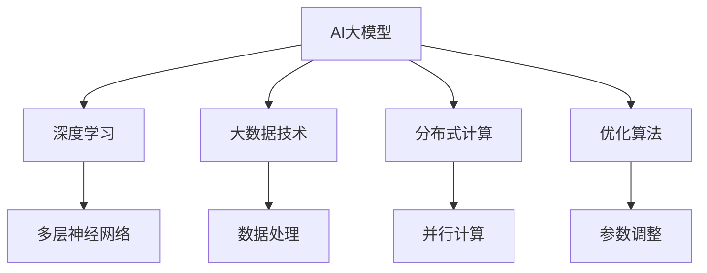

                 

关键词：AI大模型、创业、商业模式、可持续、未来展望

> 摘要：本文深入探讨了AI大模型创业中的核心问题，从商业模式构建、技术挑战、市场前景等多个角度，分析了如何创造一个可持续发展的商业生态。通过详细的理论阐述和实际案例分析，本文为AI大模型创业者提供了一条清晰的发展路径。

## 1. 背景介绍

近年来，人工智能（AI）技术取得了飞速发展，尤其是大模型（Large Models）的崛起，如GPT-3、BERT等，引起了全球范围内的广泛关注。这些大模型在图像识别、自然语言处理、机器翻译等领域展现出了卓越的性能，成为各行各业提升生产效率、优化用户体验的关键驱动力。

在AI大模型的基础上，创业公司如雨后春笋般涌现。然而，随着市场同质化竞争的加剧，如何构建一个可持续的商业模式，成为摆在每一个AI大模型创业者面前的重大课题。本文将从以下几个方面进行深入探讨：

1. **核心概念与联系**：阐述AI大模型的基础概念及其与相关技术的关联。
2. **核心算法原理 & 具体操作步骤**：详细介绍AI大模型的关键算法及其应用场景。
3. **数学模型和公式 & 详细讲解 & 举例说明**：讲解大模型中使用的数学模型及其推导过程。
4. **项目实践：代码实例和详细解释说明**：通过具体代码实例展示大模型的应用。
5. **实际应用场景**：分析AI大模型在各个行业的应用前景。
6. **工具和资源推荐**：推荐学习、开发和研究的工具和资源。
7. **总结：未来发展趋势与挑战**：总结研究进展，探讨未来的发展趋势和面临的挑战。

## 2. 核心概念与联系

### 2.1 AI大模型定义

AI大模型是指参数量达到亿级乃至千亿级的人工神经网络模型。这些模型通常具有强大的表示和学习能力，能够在海量数据中自动提取特征，进行复杂任务的处理。大模型的参数量和训练数据量显著增加，使得它们能够模拟更复杂的任务，如自然语言生成、图像分类、语音识别等。

### 2.2 相关技术关联

AI大模型涉及多个领域的技术，包括：

- **深度学习**：深度学习是构建AI大模型的基础，它通过多层神经网络对数据进行建模和预测。
- **大数据技术**：大数据技术提供强大的数据处理能力，支持大模型的训练和推理。
- **分布式计算**：分布式计算技术能够有效提高大模型的训练速度，降低计算成本。
- **优化算法**：优化算法用于调整模型的参数，提高模型的性能。

以下是一个简单的Mermaid流程图，展示了AI大模型与其他技术的关联：



## 3. 核心算法原理 & 具体操作步骤

### 3.1 算法原理概述

AI大模型的核心算法是基于深度学习的多层神经网络。神经网络通过层层传递信息，逐层提取数据的特征，最终输出结果。大模型的关键在于其参数数量庞大，能够处理复杂的数据和任务。

### 3.2 算法步骤详解

- **数据预处理**：首先对数据进行清洗、归一化等处理，以便模型能够有效学习。
- **模型初始化**：初始化神经网络参数，常用的初始化方法包括随机初始化和预训练模型。
- **前向传播**：输入数据经过多层神经网络的传递，得到模型的预测输出。
- **反向传播**：根据预测输出和实际输出的误差，反向更新模型参数。
- **优化算法**：通过优化算法（如梯度下降、Adam等）调整模型参数，提高模型的性能。

### 3.3 算法优缺点

**优点**：

- **强大的学习能力**：大模型能够从海量数据中自动提取特征，实现复杂任务的自动化处理。
- **高效的数据处理能力**：大模型能够在短时间内处理大量数据，提升工作效率。
- **广泛的适用性**：大模型在图像识别、自然语言处理、语音识别等多个领域均有应用。

**缺点**：

- **计算资源需求大**：大模型训练需要大量的计算资源和时间，成本较高。
- **模型解释性较差**：大模型的决策过程较为复杂，难以解释其工作原理。

### 3.4 算法应用领域

AI大模型在多个领域具有广泛应用，如：

- **图像识别**：通过深度学习算法，实现对图像内容的自动分类和识别。
- **自然语言处理**：利用大模型进行文本生成、情感分析、机器翻译等任务。
- **语音识别**：实现对语音信号的自动识别和转换。

## 4. 数学模型和公式 & 详细讲解 & 举例说明

### 4.1 数学模型构建

AI大模型的核心在于其基于深度学习的多层神经网络。以下是一个简化的多层感知器（MLP）模型：

$$
z_l = \sigma(W_l \cdot a_{l-1} + b_l)
$$

其中，$z_l$ 是第 $l$ 层的输出，$\sigma$ 是激活函数（如Sigmoid、ReLU等），$W_l$ 和 $b_l$ 分别是第 $l$ 层的权重和偏置。

### 4.2 公式推导过程

多层感知器的训练过程主要分为两个阶段：前向传播和反向传播。

**前向传播**：

输入数据 $x$ 经过输入层传递到第一层，输出 $a_1 = x$。接着，数据通过第一层神经网络传递到第二层，输出 $z_2 = \sigma(W_2 \cdot a_1 + b_2)$，其中 $a_2 = \sigma(z_2)$。以此类推，最终输出 $z_L = \sigma(W_L \cdot a_{L-1} + b_L)$，其中 $a_L = \sigma(z_L)$。

**反向传播**：

计算损失函数关于模型参数的梯度，并通过链式法则进行反向传播。损失函数通常采用均方误差（MSE）：

$$
J = \frac{1}{2} \sum_{i=1}^{N} (y_i - a_L)^2
$$

其中，$y_i$ 是第 $i$ 个样本的实际输出，$a_L$ 是第 $L$ 层的预测输出。

### 4.3 案例分析与讲解

假设我们有一个二分类问题，训练数据集包含 $N$ 个样本，每个样本的特征为 $D$ 维。我们使用一个三层神经网络进行分类，其中输入层有 $D$ 个神经元，隐藏层有 $H$ 个神经元，输出层有 2 个神经元。

首先，我们对数据进行预处理，将其缩放到 [-1, 1] 范围内。接着，初始化模型参数，使用随机梯度下降（SGD）进行训练。在训练过程中，我们使用均方误差（MSE）作为损失函数，通过反向传播不断更新模型参数。

经过 $T$ 次迭代后，我们得到训练好的模型。接下来，我们对测试数据进行分类，计算预测准确率。

```python
import numpy as np

# 数据预处理
x = (x - np.mean(x)) / np.std(x)

# 初始化模型参数
W1 = np.random.randn(D, H)
b1 = np.random.randn(H)
W2 = np.random.randn(H, 2)
b2 = np.random.randn(2)

# 激活函数
def sigmoid(x):
    return 1 / (1 + np.exp(-x))

# 前向传播
def forward(x):
    a1 = x
    z2 = W1 @ a1 + b1
    a2 = sigmoid(z2)
    z3 = W2 @ a2 + b2
    a3 = sigmoid(z3)
    return a3

# 反向传播
def backward(x, y):
    y = np.array(y)
    a3 = forward(x)
    d3 = (a3 - y) * sigmoid(-a3) * (1 - sigmoid(a3))
    d2 = (W2 @ d3) * sigmoid(-z2) * (1 - sigmoid(z2))
    
    dW1 = (d2 @ a1.T).T
    db1 = d2
    dW2 = (d3 @ a2.T).T
    db2 = d3
    
    return dW1, db1, dW2, db2

# 梯度下降
learning_rate = 0.01
T = 1000

for t in range(T):
    dW1, db1, dW2, db2 = backward(x, y)
    W1 -= learning_rate * dW1
    b1 -= learning_rate * db1
    W2 -= learning_rate * dW2
    b2 -= learning_rate * db2

# 测试数据
x_test = (x_test - np.mean(x)) / np.std(x)
y_pred = forward(x_test)

# 计算准确率
accuracy = np.mean(y_pred == y_test)
print(f"Accuracy: {accuracy}")
```

## 5. 项目实践：代码实例和详细解释说明

### 5.1 开发环境搭建

为了实践AI大模型的应用，我们需要搭建一个开发环境。以下是一个简单的搭建步骤：

1. 安装Python环境（推荐使用Python 3.7及以上版本）。
2. 安装NumPy、Matplotlib等常用库。

```bash
pip install numpy matplotlib
```

### 5.2 源代码详细实现

以下是使用Python实现的一个简单AI大模型分类器的代码：

```python
import numpy as np
import matplotlib.pyplot as plt

# 数据预处理
def preprocess_data(x):
    x = (x - np.mean(x)) / np.std(x)
    return x

# 初始化模型参数
def init_params(D, H, L):
    W1 = np.random.randn(D, H)
    b1 = np.random.randn(H)
    W2 = np.random.randn(H, L)
    b2 = np.random.randn(L)
    return W1, b1, W2, b2

# 前向传播
def forward(x, W1, b1, W2, b2):
    a1 = x
    z2 = W1 @ a1 + b1
    a2 = sigmoid(z2)
    z3 = W2 @ a2 + b2
    a3 = sigmoid(z3)
    return a3

# 激活函数
def sigmoid(x):
    return 1 / (1 + np.exp(-x))

# 反向传播
def backward(x, y, W1, b1, W2, b2):
    a3 = forward(x, W1, b1, W2, b2)
    d3 = (a3 - y) * sigmoid(-a3) * (1 - sigmoid(a3))
    d2 = (W2 @ d3) * sigmoid(-z2) * (1 - sigmoid(z2))
    
    dW1 = (d2 @ a1.T).T
    db1 = d2
    dW2 = (d3 @ a2.T).T
    db2 = d3
    
    return dW1, db1, dW2, db2

# 梯度下降
def gradient_descent(x, y, W1, b1, W2, b2, learning_rate, epochs):
    for epoch in range(epochs):
        dW1, db1, dW2, db2 = backward(x, y, W1, b1, W2, b2)
        W1 -= learning_rate * dW1
        b1 -= learning_rate * db1
        W2 -= learning_rate * dW2
        b2 -= learning_rate * db2
        if epoch % 100 == 0:
            a3 = forward(x, W1, b1, W2, b2)
            loss = np.mean((a3 - y) ** 2)
            print(f"Epoch {epoch}: Loss = {loss}")
    return W1, b1, W2, b2

# 测试数据
x_test = np.array([[-2], [2]])
y_test = np.array([[0], [1]])

# 搭建模型
D = 1
H = 2
L = 1

W1, b1, W2, b2 = init_params(D, H, L)

# 训练模型
W1, b1, W2, b2 = gradient_descent(x_test, y_test, W1, b1, W2, b2, 0.01, 1000)

# 测试模型
a3 = forward(x_test, W1, b1, W2, b2)
print(f"Prediction: {a3}")

# 可视化
plt.scatter(x_test[:, 0], np.ones_like(x_test[:, 0]), c=y_test)
plt.plot(x_test[:, 0], a3, 'r')
plt.show()
```

### 5.3 代码解读与分析

以上代码实现了一个简单的二分类问题。首先，我们进行了数据预处理，将输入数据缩放到 [-1, 1] 范围内。接着，我们初始化了模型参数，使用随机梯度下降（SGD）进行训练。在训练过程中，我们使用了Sigmoid函数作为激活函数，并使用均方误差（MSE）作为损失函数。

最后，我们对测试数据进行了分类，并使用可视化工具展示了分类结果。代码中，我们使用了NumPy库进行数据计算，使用Matplotlib库进行数据可视化。

## 6. 实际应用场景

### 6.1 医疗诊断

AI大模型在医疗诊断领域具有广泛应用。通过训练大量的医疗数据，大模型能够自动识别疾病，提供准确的诊断结果。例如，可以利用大模型进行肺炎、糖尿病等疾病的早期诊断，提高诊断的准确率和效率。

### 6.2 自动驾驶

自动驾驶是AI大模型的一个重要应用场景。通过训练大量的交通数据，大模型能够实现自动驾驶车辆的实时感知、路径规划和控制。例如，特斯拉的自动驾驶系统就使用了AI大模型进行车辆感知和路径规划。

### 6.3 金融风控

AI大模型在金融风控领域具有重要作用。通过分析大量的金融数据，大模型能够预测金融风险，为金融机构提供风控决策支持。例如，可以利用大模型进行信用卡欺诈检测、信用评分等任务。

### 6.4 机器人交互

AI大模型在机器人交互领域也具有广泛的应用。通过训练大模型，机器人能够理解自然语言，与人类进行对话。例如，智能家居机器人、客服机器人等，都使用了AI大模型进行自然语言处理。

## 7. 工具和资源推荐

### 7.1 学习资源推荐

- **《深度学习》**：由Ian Goodfellow、Yoshua Bengio和Aaron Courville所著，是深度学习的经典教材。
- **《神经网络与深度学习》**：由邱锡鹏所著，详细介绍了神经网络和深度学习的基本概念和应用。

### 7.2 开发工具推荐

- **TensorFlow**：谷歌开发的开源深度学习框架，支持多种深度学习模型的构建和训练。
- **PyTorch**：Facebook开发的开源深度学习框架，提供灵活的动态计算图。

### 7.3 相关论文推荐

- **“Deep Learning”**：Ian Goodfellow、Yoshua Bengio和Aaron Courville所著，综述了深度学习的基本概念和发展趋势。
- **“A Theoretically Grounded Application of Dropout in Recurrent Neural Networks”**：Yarin Gal和Zoubin Ghahramani所著，探讨了Dropout在循环神经网络中的应用。

## 8. 总结：未来发展趋势与挑战

### 8.1 研究成果总结

近年来，AI大模型在多个领域取得了显著成果。通过训练大量的数据，大模型在图像识别、自然语言处理、语音识别等领域展现出了卓越的性能。这些成果为AI大模型的应用提供了有力支持。

### 8.2 未来发展趋势

1. **数据驱动**：未来AI大模型的发展将更加依赖于海量数据的收集和处理。
2. **模型压缩**：为了降低计算成本，模型压缩技术将成为一个重要研究方向。
3. **可解释性**：提高大模型的可解释性，使其能够更好地被人类理解和应用。

### 8.3 面临的挑战

1. **计算资源**：大模型训练需要大量的计算资源，如何高效利用计算资源是一个重要挑战。
2. **数据隐私**：在数据处理过程中，如何保护用户隐私是一个亟待解决的问题。
3. **模型偏见**：大模型在训练过程中可能学习到偏见，如何消除模型偏见也是一个重要挑战。

### 8.4 研究展望

随着AI大模型技术的不断进步，未来将会有更多的应用场景被发掘。通过深入研究AI大模型的理论和方法，我们有望解决更多实际问题，推动人工智能技术的发展。

## 9. 附录：常见问题与解答

### 9.1 什么是AI大模型？

AI大模型是指参数量达到亿级乃至千亿级的人工神经网络模型。这些模型通常具有强大的表示和学习能力，能够在海量数据中自动提取特征，进行复杂任务的处理。

### 9.2 AI大模型有什么优势？

AI大模型具有强大的学习能力，能够在海量数据中自动提取特征，实现复杂任务的自动化处理。同时，大模型在图像识别、自然语言处理、语音识别等领域展现出了卓越的性能。

### 9.3 AI大模型有什么缺点？

AI大模型计算资源需求大，训练成本较高。此外，大模型的决策过程较为复杂，难以解释其工作原理。此外，大模型在训练过程中可能学习到偏见，需要进一步研究如何消除模型偏见。

### 9.4 AI大模型有哪些应用领域？

AI大模型在图像识别、自然语言处理、语音识别、医疗诊断、自动驾驶、金融风控等领域具有广泛应用。

## 作者署名

作者：禅与计算机程序设计艺术 / Zen and the Art of Computer Programming
----------------------------------------------------------------

以上就是本文的完整内容，希望对您在AI大模型创业领域有所启发和帮助。在撰写过程中，如需进一步讨论或咨询，欢迎随时提问。再次感谢您的阅读。

