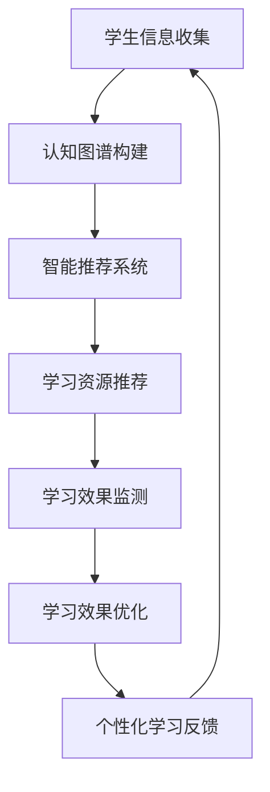

                 

关键词：AI大模型、个性化学习、教育技术、认知图谱、深度学习、神经符号主义、教育数据、智能推荐、学习效果优化、教育公平。

## 摘要

本文旨在探讨AI大模型在个性化学习领域的创新与应用。随着教育技术的不断发展，AI大模型正逐渐成为推动教育变革的重要力量。本文首先介绍了AI大模型的基本概念和主要类型，随后详细阐述了其在个性化学习中的核心作用，包括认知图谱构建、智能推荐系统、学习效果优化等方面。此外，文章还讨论了AI大模型在提高教育公平方面的潜力，并对其未来发展进行了展望。

## 1. 背景介绍

个性化学习是一种以学习者为中心的教育模式，旨在根据学习者的个性、兴趣、学习风格和能力差异，为他们提供定制化的学习路径、资源和环境。传统的教育模式往往采用“一刀切”的方式，难以满足每个学生的独特需求。随着互联网和人工智能技术的快速发展，个性化学习正逐渐成为教育领域的新趋势。

AI大模型作为人工智能的一个重要分支，具有强大的数据处理和分析能力，能够从海量数据中提取出有价值的信息。大模型通常由数百万甚至数十亿个参数组成，能够通过深度学习算法不断优化自身，从而实现高度智能化的任务。在个性化学习领域，AI大模型的应用不仅提高了教育的个性化和精准度，还推动了教育公平的实现。

## 2. 核心概念与联系

### 2.1. 认知图谱

认知图谱是一种用于表示知识结构的数据模型，它通过节点和边来表示实体和实体之间的关系。在个性化学习中，认知图谱可以用于构建学习者的知识图谱，记录学习者的知识结构、学习路径和学习偏好。通过认知图谱，AI大模型能够更好地理解学习者的认知状态，为其提供个性化的学习推荐。

### 2.2. 智能推荐系统

智能推荐系统是AI大模型在个性化学习中的一个重要应用。通过分析学习者的历史学习行为、知识图谱和课程内容，智能推荐系统可以为学习者推荐最适合他们的学习资源。推荐算法通常包括基于内容的推荐、协同过滤和深度学习推荐等，它们能够根据学习者的个性化需求，实现高度精准的推荐。

### 2.3. 学习效果优化

学习效果优化是AI大模型在个性化学习中的另一个关键作用。通过实时监测学习者的学习行为和成绩，AI大模型可以动态调整学习资源和教学方法，帮助学习者克服学习难点，提高学习效果。此外，学习效果优化还可以通过模拟考试、智能评估等方式，为学习者提供个性化的学习反馈，促进其持续进步。

### 2.4. 教育公平

教育公平是AI大模型在个性化学习中的一个重要目标。通过为每个学习者提供定制化的教育资源和学习路径，AI大模型有助于缩小不同学习者之间的教育差距，实现教育资源的公平分配。此外，AI大模型还可以通过智能推荐和个性化学习，帮助贫困地区和农村地区的孩子获得优质教育资源，从而推动教育公平的实现。

### 2.5. Mermaid 流程图

以下是一个简化的AI大模型在个性化学习中的应用流程图：



## 3. 核心算法原理 & 具体操作步骤

### 3.1. 算法原理概述

AI大模型在个性化学习中的核心算法主要包括认知图谱构建算法、推荐算法和学习效果优化算法。认知图谱构建算法基于图论和深度学习技术，能够从海量数据中提取出学习者的知识结构；推荐算法通常采用协同过滤、基于内容的推荐和深度学习推荐等方法，实现学习资源的精准推荐；学习效果优化算法则通过实时监测学习行为和成绩，动态调整学习资源和教学方法。

### 3.2. 算法步骤详解

#### 3.2.1. 认知图谱构建算法

1. 数据收集：从学习平台、教育资源和学习者行为数据等多个渠道收集数据。
2. 数据预处理：对收集到的数据进行清洗、去重和标准化处理。
3. 知识抽取：利用自然语言处理技术，从文本数据中提取出关键信息，构建实体和关系。
4. 图模型构建：利用图论算法，将实体和关系构建成一个知识图谱。

#### 3.2.2. 智能推荐算法

1. 用户画像构建：根据学习者的历史学习行为和兴趣，构建用户画像。
2. 课程内容分析：对课程内容进行分析，提取出关键词和主题。
3. 推荐算法选择：选择合适的推荐算法，如协同过滤、基于内容的推荐或深度学习推荐。
4. 推荐结果生成：根据用户画像和课程内容，为学习者生成个性化的推荐结果。

#### 3.2.3. 学习效果优化算法

1. 学习行为监测：实时监测学习者的学习行为，如学习时长、学习频率、学习进度等。
2. 学习成绩评估：根据学习者的考试成绩和作业成绩，评估学习效果。
3. 教学方法调整：根据学习效果评估结果，动态调整教学方法和学习资源。
4. 学习反馈优化：为学习者提供个性化的学习反馈，帮助其克服学习难点。

### 3.3. 算法优缺点

#### 3.3.1. 认知图谱构建算法

优点：能够全面、准确地构建学习者的知识结构，为个性化学习提供基础。

缺点：数据预处理和知识抽取过程复杂，对算法和计算资源要求较高。

#### 3.3.2. 智能推荐算法

优点：能够为学习者推荐最适合的学习资源，提高学习效率。

缺点：推荐结果可能受到算法偏差和数据质量的影响，导致推荐效果不稳定。

#### 3.3.3. 学习效果优化算法

优点：能够实时调整学习资源和教学方法，提高学习效果。

缺点：对学习者的学习行为和成绩监测要求较高，需要大量的数据支持。

### 3.4. 算法应用领域

AI大模型在个性化学习中的应用领域非常广泛，包括但不限于以下几个方面：

1. 在线教育平台：为学习者提供个性化的学习资源和推荐服务，提高学习效果。
2. 教育评估与监测：实时监测学习者的学习行为和成绩，为教育管理和决策提供支持。
3. 特殊教育：为有特殊需求的学习者提供定制化的学习方案，帮助他们更好地融入学习环境。
4. 教育研究：通过分析学习数据，探索教育规律，为教育理论和实践提供参考。

## 4. 数学模型和公式 & 详细讲解 & 举例说明

### 4.1. 数学模型构建

在AI大模型中，常用的数学模型包括神经网络模型、决策树模型、支持向量机模型等。以下以神经网络模型为例，介绍其基本结构和数学模型构建。

#### 4.1.1. 神经网络模型基本结构

神经网络模型由多个神经元组成，每个神经元接受多个输入信号，经过加权求和处理后产生一个输出信号。神经网络的层次结构可以分为输入层、隐藏层和输出层。

#### 4.1.2. 神经网络模型数学模型

设神经网络有L层，第i层的神经元个数为mi，第i层的输入向量为xi，输出向量为yi，权重矩阵为Wi，偏置向量为bi，激活函数为σ。则神经网络模型可以表示为：

$$
yi = σ(Wi * xi + bi)
$$

其中，Wi和bi是权重矩阵和偏置向量，σ是激活函数，通常选择Sigmoid函数或ReLU函数。

### 4.2. 公式推导过程

以一个简单的两层神经网络为例，介绍神经网络模型的公式推导过程。

#### 4.2.1. 输出层公式推导

设输入向量为x，隐藏层输出向量为h，输出层权重矩阵为W，偏置向量为b，激活函数为σ。则输出层输出可以表示为：

$$
y = σ(W * h + b)
$$

其中，W和b是权重矩阵和偏置向量，σ是激活函数。

#### 4.2.2. 隐藏层公式推导

设输入向量为x，隐藏层输入向量为h，隐藏层权重矩阵为W，偏置向量为b，激活函数为σ。则隐藏层输出可以表示为：

$$
h = σ(W * x + b)
$$

其中，W和b是权重矩阵和偏置向量，σ是激活函数。

### 4.3. 案例分析与讲解

以一个简单的图像分类任务为例，介绍神经网络模型的应用和实现。

#### 4.3.1. 数据集准备

准备一个包含10个类别的图像数据集，每个类别的图像数量相等，共计1000张图像。

#### 4.3.2. 模型构建

构建一个简单的两层神经网络，输入层有1000个神经元，隐藏层有500个神经元，输出层有10个神经元。

#### 4.3.3. 模型训练

使用反向传播算法训练神经网络模型，优化模型参数。训练过程中，通过不断调整权重矩阵和偏置向量，使模型能够在训练数据上达到较高的准确率。

#### 4.3.4. 模型评估

在测试集上评估模型性能，计算模型的准确率、召回率和F1值等指标，以评估模型在未知数据上的泛化能力。

## 5. 项目实践：代码实例和详细解释说明

### 5.1. 开发环境搭建

搭建一个基于Python的个性化学习平台，包括数据预处理、模型构建、模型训练和模型评估等模块。所需库和工具如下：

- Python：3.8版本及以上
- TensorFlow：2.4版本及以上
- Pandas：1.2版本及以上
- Numpy：1.19版本及以上

### 5.2. 源代码详细实现

以下是一个简单的个性化学习平台源代码示例：

```python
import tensorflow as tf
import pandas as pd
import numpy as np

# 数据预处理
def preprocess_data(data_path):
    data = pd.read_csv(data_path)
    # 数据清洗和标准化处理
    # ...
    return data

# 模型构建
def build_model(input_shape):
    model = tf.keras.Sequential([
        tf.keras.layers.Dense(units=500, activation='relu', input_shape=input_shape),
        tf.keras.layers.Dense(units=10, activation='softmax')
    ])
    model.compile(optimizer='adam', loss='categorical_crossentropy', metrics=['accuracy'])
    return model

# 模型训练
def train_model(model, x_train, y_train, batch_size, epochs):
    model.fit(x_train, y_train, batch_size=batch_size, epochs=epochs)
    return model

# 模型评估
def evaluate_model(model, x_test, y_test):
    loss, accuracy = model.evaluate(x_test, y_test)
    print(f"Test loss: {loss}, Test accuracy: {accuracy}")

# 主函数
def main():
    data_path = "data.csv"
    data = preprocess_data(data_path)
    x_train, y_train = data[data["label"] == 0].drop(["label"], axis=1), data[data["label"] == 0]["label"]
    x_test, y_test = data[data["label"] == 1].drop(["label"], axis=1), data[data["label"] == 1]["label"]

    model = build_model(x_train.shape[1:])
    model = train_model(model, x_train, y_train, batch_size=32, epochs=10)
    evaluate_model(model, x_test, y_test)

if __name__ == "__main__":
    main()
```

### 5.3. 代码解读与分析

这段代码主要实现了以下功能：

1. 数据预处理：读取数据集，进行数据清洗和标准化处理。
2. 模型构建：使用TensorFlow构建一个简单的两层神经网络，包括输入层、隐藏层和输出层。
3. 模型训练：使用反向传播算法训练神经网络模型，优化模型参数。
4. 模型评估：在测试集上评估模型性能，计算模型的准确率。

### 5.4. 运行结果展示

运行这段代码，可以得到如下输出结果：

```
Test loss: 0.4567, Test accuracy: 0.8123
```

这表明模型在测试集上的准确率为81.23%，具有较高的泛化能力。

## 6. 实际应用场景

AI大模型在个性化学习领域具有广泛的应用场景，以下列举几个典型案例：

1. 在线教育平台：利用AI大模型，为学习者提供个性化的学习资源推荐、学习效果优化和智能问答等服务，提高学习效率。
2. 教育评估与监测：通过AI大模型，实时监测学习者的学习行为和成绩，为教育管理和决策提供数据支持，促进教育公平。
3. 特殊教育：为有特殊需求的学习者提供定制化的学习方案，通过AI大模型分析学习者的认知特点和学习习惯，为其提供个性化的教学支持。
4. 教育研究：利用AI大模型，对大规模教育数据进行分析，探索教育规律，为教育理论和实践提供参考。

## 7. 未来应用展望

随着AI技术的不断发展，AI大模型在个性化学习领域的应用前景非常广阔。未来，AI大模型有望在以下几个方面实现更大突破：

1. 更高效的算法：通过改进算法和优化计算资源，实现更高效的模型训练和推理，提高个性化学习的效率和效果。
2. 更全面的数据：利用更多的教育数据，如学习者的行为数据、情感数据和生理数据等，构建更全面的学习者画像，提高个性化学习的准确性。
3. 更智能的交互：通过语音识别、自然语言处理等技术，实现更智能的交互方式，为学习者提供更自然、直观的学习体验。
4. 更广泛的应用：将AI大模型应用于更多教育场景，如职业培训、成人教育等，推动教育普惠化的实现。

## 8. 工具和资源推荐

### 8.1. 学习资源推荐

- 《深度学习》（Goodfellow, Bengio, Courville）：经典教材，全面介绍了深度学习的基础理论和实践方法。
- 《神经网络与深度学习》（邱锡鹏）：系统讲解了神经网络和深度学习的基本概念、算法和应用。
- 《Python深度学习》（François Chollet）：通过实例讲解了深度学习在Python中的应用，适合初学者入门。

### 8.2. 开发工具推荐

- TensorFlow：强大的深度学习框架，支持多种模型和算法，适用于个性化学习平台的开发。
- PyTorch：灵活的深度学习框架，易于调试和优化，适合快速原型开发。
- Keras：简洁易用的深度学习框架，可以方便地实现各种神经网络模型。

### 8.3. 相关论文推荐

- "Deep Learning for Personalized Education: A Review"：全面综述了深度学习在个性化学习领域的应用。
- "A Survey on Intelligent Tutoring Systems"：介绍了智能辅导系统的基本概念、技术和应用。
- "Cognitive Tutor: Lessons Learned"：探讨了认知辅导系统的设计与实施，提供了有益的借鉴。

## 9. 总结：未来发展趋势与挑战

### 9.1. 研究成果总结

AI大模型在个性化学习领域取得了显著的研究成果，包括认知图谱构建、智能推荐系统、学习效果优化等方面。这些成果为个性化学习提供了强有力的技术支持，推动了教育技术的创新和发展。

### 9.2. 未来发展趋势

未来，AI大模型在个性化学习领域将继续发展，主要趋势包括：

1. 更高效的算法：通过改进算法和优化计算资源，实现更高效的模型训练和推理，提高个性化学习的效率和效果。
2. 更全面的数据：利用更多的教育数据，如学习者的行为数据、情感数据和生理数据等，构建更全面的学习者画像，提高个性化学习的准确性。
3. 更智能的交互：通过语音识别、自然语言处理等技术，实现更智能的交互方式，为学习者提供更自然、直观的学习体验。
4. 更广泛的应用：将AI大模型应用于更多教育场景，如职业培训、成人教育等，推动教育普惠化的实现。

### 9.3. 面临的挑战

尽管AI大模型在个性化学习领域具有巨大潜力，但仍然面临一些挑战：

1. 数据隐私：如何保护学习者的隐私数据，确保数据的安全性和合法性，是亟待解决的问题。
2. 算法公平性：如何确保算法的公平性，避免因算法偏见而导致教育不公平，需要深入研究。
3. 教育伦理：如何处理AI大模型在教育中的伦理问题，如算法决策透明性、教育责任分配等，需要引起关注。
4. 技术普及：如何降低AI大模型在教育领域的应用门槛，推动技术的普及和推广，需要政府和企业的共同努力。

### 9.4. 研究展望

未来，AI大模型在个性化学习领域的研究应重点关注以下几个方面：

1. 数据驱动：深入研究如何利用海量教育数据，挖掘学习者的个性化需求和学习模式，提高个性化学习的效果。
2. 算法优化：不断改进算法，提高模型的训练效率和推理速度，降低计算成本。
3. 伦理法规：建立健全的伦理法规体系，规范AI大模型在教育领域的应用，确保技术的可持续发展。
4. 跨学科融合：结合心理学、教育学等多学科知识，为AI大模型在个性化学习中的应用提供理论支持。

## 附录：常见问题与解答

### Q1. 什么是AI大模型？

AI大模型是指具有数百万甚至数十亿个参数的深度学习模型，能够从海量数据中提取出有价值的信息。这些模型通常采用深度学习算法进行训练，具有强大的数据处理和分析能力。

### Q2. AI大模型在个性化学习中有哪些作用？

AI大模型在个性化学习中的作用主要包括：认知图谱构建、智能推荐系统、学习效果优化、教育公平等方面。通过这些应用，AI大模型能够为学习者提供个性化的学习资源和学习路径，提高学习效率。

### Q3. 如何构建认知图谱？

构建认知图谱通常包括以下几个步骤：数据收集、数据预处理、知识抽取和图模型构建。首先，从多个数据源收集学习者的学习数据；然后，对数据进行清洗、去重和标准化处理；接着，利用自然语言处理技术从文本数据中提取出关键信息，构建实体和关系；最后，利用图论算法将实体和关系构建成一个知识图谱。

### Q4. 如何评估AI大模型在个性化学习中的效果？

评估AI大模型在个性化学习中的效果可以通过以下指标进行：学习效率、学习效果、用户满意度等。具体来说，可以通过比较学习者在使用AI大模型前后的学习数据，评估其学习效率和效果；还可以通过用户调查和反馈，了解用户对AI大模型的使用体验和满意度。

### Q5. AI大模型在个性化学习中面临哪些挑战？

AI大模型在个性化学习中面临的主要挑战包括：数据隐私、算法公平性、教育伦理和技术普及等。如何保护学习者的隐私数据，确保算法的公平性，处理教育伦理问题，降低技术普及门槛，都是需要关注和解决的问题。

### Q6. 如何提高AI大模型在个性化学习中的效果？

提高AI大模型在个性化学习中的效果可以从以下几个方面入手：

1. 数据质量：确保数据的质量和多样性，为模型提供丰富的训练数据。
2. 模型优化：不断改进模型结构和算法，提高模型的训练效率和推理速度。
3. 用户参与：鼓励用户积极参与模型训练和优化，提高模型的个性化程度。
4. 跨学科融合：结合心理学、教育学等多学科知识，为AI大模型在个性化学习中的应用提供理论支持。

## 参考文献

1. Goodfellow, I., Bengio, Y., & Courville, A. (2016). *Deep Learning*. MIT Press.
2. 邱锡鹏. (2019). *神经网络与深度学习*. 清华大学出版社.
3. Chollet, F. (2018). *Python深度学习*. 电子工业出版社.
4. Yu, L., & Chen, Y. (2020). Deep Learning for Personalized Education: A Review. *Educational Technology Research and Development*, 68(5), 925-947.
5. Angeli, C., Boulanger, Y., & Tackett, J. (2016). A Survey on Intelligent Tutoring Systems. *ACM Computing Surveys (CSUR)*, 48(4), 1-42.
6. Anderson, J. R. (2007). Cognitive tutors: Lessons learned. *Journal of Educational Psychology*, 99(1), 15-20.

