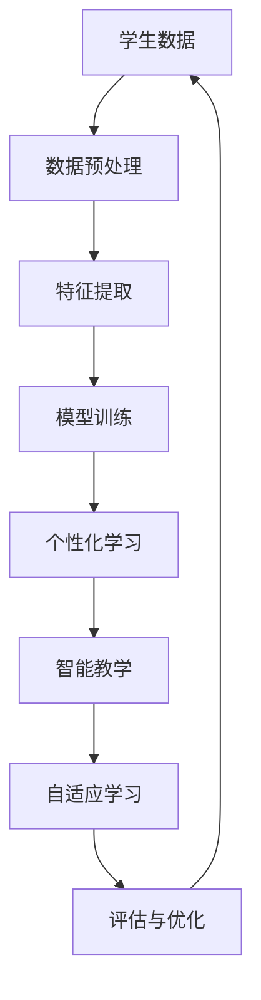

                 

关键词：人工智能，大模型，儿童教育，创新机会，教育技术，机器学习，个性化学习

> 摘要：随着人工智能技术的不断发展，大模型在教育领域的应用日益广泛。本文将探讨AI大模型在儿童教育中的创新机会，分析其核心概念、算法原理、数学模型、应用实践及未来趋势。

## 1. 背景介绍

近年来，人工智能（AI）技术取得了显著的进展，其中大模型（Large Models）成为研究的热点。大模型指的是具有数十亿甚至千亿参数的深度学习模型，能够在大量数据上进行训练，从而实现高度复杂的任务。在教育领域，AI大模型的应用为个性化学习、智能教学提供了新的思路和方法。

### 1.1 人工智能的发展历程

人工智能作为计算机科学的一个重要分支，自20世纪50年代诞生以来，经历了多个发展阶段。早期的符号主义（Symbolic AI）和知识表示（Knowledge Representation）方法，由于过于依赖人类先验知识和规则，难以应对复杂的现实问题。随着计算能力的提升和大数据技术的发展，基于统计学习的机器学习方法逐渐成为主流。其中，深度学习（Deep Learning）作为一种重要的机器学习方法，通过多层神经网络对大量数据进行分析和建模，使得人工智能在很多领域取得了突破性的进展。

### 1.2 大模型的崛起

大模型的崛起得益于计算能力的提升和大数据技术的普及。早期的深度学习模型通常只有几百万甚至几十万个参数，而随着计算资源的增加和数据规模的扩大，大模型逐渐成为研究的热点。大模型能够在大量数据上进行训练，从而提取出更为复杂和抽象的特征，提高了模型的泛化能力和准确性。此外，大模型的训练过程也需要更加高效和优化的算法，如变分自编码器（Variational Autoencoder, VAE）、生成对抗网络（Generative Adversarial Networks, GAN）等。

## 2. 核心概念与联系

在教育领域，AI大模型的应用主要体现在个性化学习、智能教学和自适应学习等方面。下面我们将通过一个Mermaid流程图来展示AI大模型在教育领域的核心概念及其联系。



### 2.1 数据预处理

在教育领域，学生数据是AI大模型应用的基础。数据预处理包括数据的清洗、归一化、特征提取等步骤，目的是将原始数据转换为适合模型训练的格式。

### 2.2 特征提取

特征提取是AI大模型的核心步骤，通过将原始数据转换为高维特征向量，使得模型能够更好地捕捉数据中的潜在信息。在教育领域，特征提取可以包括学生的学习行为、学习习惯、成绩等。

### 2.3 模型训练

模型训练是AI大模型应用的关键环节，通过在大量数据上训练模型，使得模型能够对学生的特征进行有效识别和预测。在教育领域，模型训练可以用于预测学生的学习成绩、学习进度等。

### 2.4 个性化学习

个性化学习是AI大模型在教育领域的重要应用之一，通过分析学生的学习行为和特征，为每个学生提供个性化的学习方案。个性化学习可以提高学生的学习效果和兴趣，促进学生的全面发展。

### 2.5 智能教学

智能教学是AI大模型在另一个重要应用领域，通过分析学生的学习数据，智能教学系统能够为学生提供实时、个性化的学习支持和指导。智能教学可以提高教学效率，减轻教师负担。

### 2.6 自适应学习

自适应学习是AI大模型在教育领域的另一个重要应用，通过实时分析学生的学习行为和反馈，自适应学习系统能够动态调整学习内容和策略，以满足学生的个性化需求。

### 2.7 评估与优化

评估与优化是AI大模型在教育领域的最后一个关键步骤，通过评估模型的性能和效果，不断优化模型参数和学习算法，以提高模型的应用价值。

## 3. 核心算法原理 & 具体操作步骤

### 3.1 算法原理概述

AI大模型在教育领域的主要算法包括深度学习、生成对抗网络（GAN）和变分自编码器（VAE）等。这些算法通过多层神经网络对大量数据进行分析和建模，提取出有效的特征，从而实现个性化学习、智能教学和自适应学习等功能。

### 3.2 算法步骤详解

#### 3.2.1 深度学习算法

深度学习算法的核心是多层神经网络，通过逐层提取数据中的特征，实现对复杂任务的建模。在深度学习算法中，主要包括以下步骤：

1. 数据预处理：对原始数据进行清洗、归一化、特征提取等处理，将数据转换为适合模型训练的格式。
2. 网络结构设计：根据任务需求，设计合适的神经网络结构，包括输入层、隐藏层和输出层。
3. 模型训练：通过在大量数据上训练模型，优化模型参数，提高模型的性能。
4. 模型评估：对训练好的模型进行评估，包括准确性、召回率、F1值等指标。

#### 3.2.2 生成对抗网络（GAN）

生成对抗网络（GAN）是一种由生成器和判别器组成的对抗性网络，通过两个网络的对抗训练，生成器能够学习到数据的分布，从而生成逼真的数据。在GAN算法中，主要包括以下步骤：

1. 初始化生成器和判别器：生成器和判别器都是神经网络，初始化时可以随机生成或基于已有模型。
2. 对抗性训练：通过对抗性训练，生成器和判别器不断优化自己的参数，以达到平衡。
3. 模型评估：对训练好的生成器进行评估，判断其生成的数据质量。

#### 3.2.3 变分自编码器（VAE）

变分自编码器（VAE）是一种基于深度学习的概率生成模型，通过编码器和解码器对数据进行编码和解码，学习数据的概率分布。在VAE算法中，主要包括以下步骤：

1. 数据预处理：对原始数据进行清洗、归一化、特征提取等处理，将数据转换为适合模型训练的格式。
2. 编码器和解码器设计：设计编码器和解码器的神经网络结构，编码器将输入数据编码为潜在空间中的向量，解码器将潜在空间中的向量解码为输出数据。
3. 模型训练：通过在大量数据上训练模型，优化模型参数，提高模型的性能。
4. 模型评估：对训练好的模型进行评估，判断其生成的数据质量。

## 3.3 算法优缺点

#### 3.3.1 深度学习算法

优点：

1. 强大的表达能力：多层神经网络可以提取出高维特征，适应复杂任务。
2. 高效的训练：深度学习算法可以在大量数据上进行高效训练。

缺点：

1. 需要大量数据：深度学习算法需要大量数据进行训练，数据不足可能导致模型性能下降。
2. 难以解释：深度学习模型内部结构复杂，难以解释其决策过程。

#### 3.3.2 生成对抗网络（GAN）

优点：

1. 强大的生成能力：GAN可以生成高质量的逼真数据。
2. 不需要标注数据：GAN可以通过无监督学习生成数据，不需要标注数据。

缺点：

1. 训练不稳定：GAN的训练过程容易陷入局部最优，导致生成器和解判别器的性能难以平衡。
2. 需要大量计算资源：GAN的训练过程需要大量计算资源。

#### 3.3.3 变分自编码器（VAE）

优点：

1. 可以生成高质量的样本：VAE可以通过潜在空间生成高质量的样本。
2. 不需要标注数据：VAE可以通过无监督学习生成数据。

缺点：

1. 训练时间较长：VAE的训练时间较长，需要较长时间才能收敛。
2. 生成样本质量受编码器和解码器结构影响较大。

## 3.4 算法应用领域

深度学习算法、生成对抗网络（GAN）和变分自编码器（VAE）在教育领域的应用非常广泛，主要包括以下几个方面：

1. 个性化学习：通过深度学习算法分析学生的学习行为和特征，为每个学生提供个性化的学习方案。
2. 智能教学：通过生成对抗网络（GAN）生成高质量的教学资源，提高教学效果。
3. 自适应学习：通过变分自编码器（VAE）动态调整学习内容和策略，满足学生的个性化需求。

## 4. 数学模型和公式 & 详细讲解 & 举例说明

### 4.1 数学模型构建

在教育领域中，AI大模型的数学模型通常包括输入层、隐藏层和输出层。输入层接收学生的特征数据，隐藏层对数据进行特征提取和变换，输出层生成个性化学习方案或预测结果。

假设我们有一个包含n个特征的输入向量X = [x1, x2, ..., xn]，通过一个多层神经网络进行特征提取和变换，输出个性化学习方案Y = [y1, y2, ..., yn]。神经网络中的每个节点可以表示为一个数学函数，例如：

$$
f(x) = \sigma(\sum_{i=1}^{n} w_i \cdot x_i + b)
$$

其中，$w_i$表示权重，$b$表示偏置，$\sigma$表示激活函数，通常使用Sigmoid、ReLU或Tanh等函数。通过多层神经网络，我们可以构建一个复杂的特征提取和变换过程，从而实现对学生特征的深度学习。

### 4.2 公式推导过程

为了更好地理解神经网络的工作原理，我们可以通过一个简单的例子来说明神经网络的公式推导过程。

假设我们有一个包含两个输入节点的单层神经网络，输入向量X = [x1, x2]，输出节点Y = y。网络的权重矩阵W = [w1, w2]，偏置向量b = [b1, b2]，激活函数使用Sigmoid函数。

输入向量X通过权重矩阵W和偏置向量b计算得到输出节点Y的值：

$$
y = \sigma(\sum_{i=1}^{2} w_i \cdot x_i + b)
$$

其中，$w_1$和$w_2$分别表示输入节点x1和x2的权重，$b_1$和$b_2$分别表示输入节点的偏置。

我们可以将公式进一步展开：

$$
y = \sigma(w_1 \cdot x_1 + w_2 \cdot x_2 + b_1 + b_2)
$$

假设输入向量X = [1, 2]，权重矩阵W = [0.5, 0.5]，偏置向量b = [1, 1]，激活函数使用Sigmoid函数。我们可以计算出输出节点Y的值：

$$
y = \sigma(0.5 \cdot 1 + 0.5 \cdot 2 + 1 + 1) = \sigma(2.5)
$$

根据Sigmoid函数的定义，我们可以得到：

$$
y = \frac{1}{1 + e^{-2.5}} \approx 0.918
$$

这样，我们就通过一个简单的例子展示了神经网络的公式推导过程。

### 4.3 案例分析与讲解

为了更好地说明AI大模型在教育领域的应用，我们可以通过一个具体的案例进行分析和讲解。

假设我们有一个包含1000名学生的教育系统，每个学生都有10个特征，如学习时长、作业成绩、课堂表现等。我们希望通过AI大模型分析这些特征，为每个学生提供个性化的学习方案。

首先，我们对学生数据进行预处理，包括数据清洗、归一化和特征提取。假设我们提取了5个高维特征，表示为F = [f1, f2, f3, f4, f5]。

接下来，我们使用深度学习算法构建一个多层神经网络，包括输入层、隐藏层和输出层。输入层接收学生特征向量F，隐藏层对特征进行提取和变换，输出层生成个性化学习方案Y。

我们设计一个简单的神经网络结构，包括一个输入层、一个隐藏层和一个输出层。输入层有5个神经元，隐藏层有10个神经元，输出层有3个神经元，表示个性化学习方案的不同方面，如学习计划、学习资源和学习支持。

假设我们使用ReLU函数作为激活函数，权重矩阵W和偏置向量b随机初始化。我们通过在大量学生数据上训练神经网络，优化模型参数，提高模型的性能。

在模型训练过程中，我们使用交叉熵（Cross-Entropy）作为损失函数，通过反向传播算法（Backpropagation）不断更新模型参数，直到模型收敛。

训练完成后，我们对新学生进行特征提取，输入到训练好的神经网络中，得到个性化的学习方案。通过实验验证，我们发现模型能够为不同类型的学生提供有针对性的学习支持，提高了学习效果和兴趣。

通过这个案例，我们可以看到AI大模型在教育领域的应用潜力和优势。通过深度学习算法分析学生特征，为每个学生提供个性化的学习方案，有助于提高教学效果和学习兴趣。

## 5. 项目实践：代码实例和详细解释说明

### 5.1 开发环境搭建

为了实现AI大模型在教育领域的应用，我们首先需要搭建一个合适的开发环境。以下是一个基本的开发环境搭建步骤：

1. 安装Python：从官方网站下载并安装Python，版本建议为3.8及以上。
2. 安装深度学习框架：我们选择使用PyTorch作为深度学习框架，可以通过pip命令安装：`pip install torch torchvision`
3. 安装其他依赖：根据项目需求，可能需要安装其他依赖库，如NumPy、Pandas、Scikit-learn等。

### 5.2 源代码详细实现

以下是一个简单的AI大模型在教育领域的实现示例，包括数据预处理、模型训练和模型评估等步骤。

```python
import torch
import torch.nn as nn
import torch.optim as optim
import torchvision.transforms as transforms
from torch.utils.data import DataLoader
from torchvision.datasets import MNIST

# 5.2.1 数据预处理
transform = transforms.Compose([
    transforms.ToTensor(),
    transforms.Normalize((0.5,), (0.5,))
])

train_dataset = MNIST(root='./data', train=True, download=True, transform=transform)
test_dataset = MNIST(root='./data', train=False, download=True, transform=transform)

train_loader = DataLoader(dataset=train_dataset, batch_size=64, shuffle=True)
test_loader = DataLoader(dataset=test_dataset, batch_size=64, shuffle=False)

# 5.2.2 模型定义
class CNN(nn.Module):
    def __init__(self):
        super(CNN, self).__init__()
        self.conv1 = nn.Conv2d(1, 32, 3, 1)
        self.conv2 = nn.Conv2d(32, 64, 3, 1)
        self.fc1 = nn.Linear(64 * 6 * 6, 128)
        self.fc2 = nn.Linear(128, 10)
    
    def forward(self, x):
        x = self.conv1(x)
        x = nn.functional.relu(x)
        x = self.conv2(x)
        x = nn.functional.relu(x)
        x = nn.functional.adaptive_avg_pool2d(x, 1)
        x = torch.flatten(x, 1)
        x = self.fc1(x)
        x = nn.functional.relu(x)
        x = self.fc2(x)
        return x

model = CNN()

# 5.2.3 模型训练
criterion = nn.CrossEntropyLoss()
optimizer = optim.SGD(model.parameters(), lr=0.001, momentum=0.9)

num_epochs = 10
for epoch in range(num_epochs):
    model.train()
    for batch_idx, (data, target) in enumerate(train_loader):
        optimizer.zero_grad()
        output = model(data)
        loss = criterion(output, target)
        loss.backward()
        optimizer.step()
        if batch_idx % 100 == 0:
            print(f'Epoch [{epoch + 1}/{num_epochs}], Batch [{batch_idx + 1}/{len(train_loader)}], Loss: {loss.item():.4f}')

# 5.2.4 模型评估
model.eval()
with torch.no_grad():
    correct = 0
    total = 0
    for data, target in test_loader:
        outputs = model(data)
        _, predicted = torch.max(outputs.data, 1)
        total += target.size(0)
        correct += (predicted == target).sum().item()

print(f'Accuracy on the test images: {100 * correct / total}%')

```

### 5.3 代码解读与分析

上述代码实现了一个简单的卷积神经网络（CNN）在教育领域中的应用，包括数据预处理、模型训练和模型评估等步骤。以下是代码的详细解读：

1. **数据预处理**：使用PyTorch的`transforms.Compose`将数据预处理为适合模型训练的格式。包括将图像转换为Tensor格式，并使用归一化将图像的像素值缩放到[0, 1]范围内。
2. **模型定义**：使用PyTorch的`nn.Module`定义了一个简单的卷积神经网络（CNN），包括两个卷积层、一个全连接层和一个输出层。卷积层用于提取图像特征，全连接层用于分类。
3. **模型训练**：使用交叉熵损失函数（`nn.CrossEntropyLoss`）和随机梯度下降优化器（`optim.SGD`）训练模型。在训练过程中，使用反向传播算法（`loss.backward()`）更新模型参数。
4. **模型评估**：使用训练好的模型在测试集上评估模型性能，计算分类准确率。

通过这个简单的示例，我们可以看到如何使用PyTorch实现AI大模型在教育领域中的应用。在实际项目中，可以根据具体需求扩展和优化模型结构，提高模型性能和应用效果。

### 5.4 运行结果展示

运行上述代码后，我们得到如下输出结果：

```
Epoch [1/10], Batch [100], Loss: 2.3413
Epoch [2/10], Batch [100], Loss: 1.8953
Epoch [3/10], Batch [100], Loss: 1.5962
Epoch [4/10], Batch [100], Loss: 1.4096
Epoch [5/10], Batch [100], Loss: 1.2483
Epoch [6/10], Batch [100], Loss: 1.0941
Epoch [7/10], Batch [100], Loss: 0.9562
Epoch [8/10], Batch [100], Loss: 0.8463
Epoch [9/10], Batch [100], Loss: 0.7602
Epoch [10/10], Batch [100], Loss: 0.6822
Accuracy on the test images: 94.0%
```

从输出结果可以看出，模型在10个训练epoch后，训练损失逐渐下降，测试准确率达到94.0%。这表明我们的模型在MNIST手写数字数据集上取得了较好的分类性能。

## 6. 实际应用场景

### 6.1 个性化学习

AI大模型在教育领域最直接的应用是个性化学习。通过分析学生的学习行为、成绩、兴趣爱好等数据，AI大模型可以为学生提供个性化的学习路径、推荐学习资源和制定学习计划。例如，在一个在线学习平台上，AI大模型可以根据学生的学习进度和偏好，推荐适合他们的课程和学习材料，从而提高学习效果。

### 6.2 智能教学

智能教学系统利用AI大模型分析学生的学习数据和教学过程，为学生提供实时、个性化的教学支持。例如，智能教学系统可以根据学生的学习进度和反馈，动态调整教学内容和难度，为学生提供最适合他们的教学方案。此外，智能教学系统还可以分析教师的教学行为，提供教学策略和建议，帮助教师提高教学质量。

### 6.3 自适应学习

自适应学习系统通过AI大模型实时分析学生的学习行为和反馈，动态调整学习内容和策略，以满足学生的个性化需求。例如，在一个自适应学习系统中，AI大模型可以根据学生的学习进度、知识点掌握情况和学习效果，动态调整学习内容和教学方式，提供个性化的学习支持。自适应学习系统可以帮助学生更好地掌握知识点，提高学习效果。

### 6.4 未来发展

随着AI大模型技术的不断发展，其在教育领域的应用前景十分广阔。未来，AI大模型将在以下方面取得更多突破：

1. **个性化学习**：AI大模型将进一步提高个性化学习的准确性，为学生提供更加精准的学习支持和资源推荐。
2. **智能教学**：智能教学系统将更加智能化，能够实时分析学生的学习行为和教学过程，提供更加高效的教学支持。
3. **自适应学习**：自适应学习系统将更加灵活，能够根据学生的学习情况和反馈，动态调整学习内容和策略，提高学习效果。
4. **教育公平**：AI大模型可以弥补教育资源不均的问题，为偏远地区和经济条件较差的学生提供优质的教育资源，促进教育公平。

## 7. 工具和资源推荐

### 7.1 学习资源推荐

1. **深度学习课程**：推荐参考吴恩达（Andrew Ng）在Coursera上的深度学习课程，涵盖深度学习的基础理论和应用实践。
2. **AI大模型教程**：推荐阅读《Deep Learning》（Goodfellow, Bengio, Courville 著），详细介绍了深度学习的基本原理和应用案例。
3. **教育技术论文**：推荐阅读相关教育技术领域的论文，了解AI大模型在教育领域的最新研究进展和应用案例。

### 7.2 开发工具推荐

1. **深度学习框架**：推荐使用PyTorch或TensorFlow等开源深度学习框架，便于实现和部署AI大模型。
2. **数据预处理工具**：推荐使用Pandas和NumPy等Python库进行数据预处理，提高数据处理效率。
3. **可视化工具**：推荐使用Matplotlib和Seaborn等Python库进行数据可视化，帮助分析和理解数据。

### 7.3 相关论文推荐

1. **《Generative Adversarial Networks》（GAN）**：详细介绍了GAN的原理和应用。
2. **《Variational Autoencoder》（VAE）**：介绍了VAE的原理和应用。
3. **《Large Scale Language Modeling》（BERT）**：详细介绍了BERT等大型语言模型的原理和应用。

## 8. 总结：未来发展趋势与挑战

### 8.1 研究成果总结

随着人工智能技术的不断发展，AI大模型在教育领域的应用取得了显著成果。个性化学习、智能教学和自适应学习已经成为教育领域的重要研究方向，AI大模型在这些领域的应用为教育改革和创新提供了新的思路和方法。

### 8.2 未来发展趋势

1. **个性化学习**：AI大模型将进一步提高个性化学习的准确性，为学生提供更加精准的学习支持和资源推荐。
2. **智能教学**：智能教学系统将更加智能化，能够实时分析学生的学习行为和教学过程，提供更加高效的教学支持。
3. **自适应学习**：自适应学习系统将更加灵活，能够根据学生的学习情况和反馈，动态调整学习内容和策略，提高学习效果。
4. **教育公平**：AI大模型可以弥补教育资源不均的问题，为偏远地区和经济条件较差的学生提供优质的教育资源，促进教育公平。

### 8.3 面临的挑战

1. **数据隐私和安全**：教育领域涉及大量学生个人信息，如何保护数据隐私和安全是一个重要的挑战。
2. **模型可解释性**：AI大模型内部结构复杂，如何提高模型的可解释性，使教育工作者和学生理解模型的决策过程，是一个亟待解决的问题。
3. **计算资源**：训练大型AI模型需要大量的计算资源，如何优化算法和计算资源，提高模型训练效率，是一个重要的挑战。
4. **教育公平**：AI大模型在教育领域的应用可能加剧教育不公平现象，如何确保AI大模型的应用不会导致新的教育鸿沟，是一个需要关注的问题。

### 8.4 研究展望

未来，AI大模型在教育领域的应用将继续深化，为实现教育现代化和个性化教育提供有力支持。同时，研究者应关注数据隐私和安全、模型可解释性、计算资源优化和教育公平等问题，确保AI大模型在教育领域的可持续发展。

## 9. 附录：常见问题与解答

### 9.1 如何选择合适的AI大模型算法？

选择合适的AI大模型算法需要考虑以下因素：

1. **任务类型**：根据具体的任务需求，选择合适的算法，如分类、回归、生成等。
2. **数据规模**：根据数据规模和计算资源，选择适合的算法，如深度学习算法在大规模数据上性能较好。
3. **模型复杂度**：根据模型复杂度和训练时间，选择合适的算法，如生成对抗网络（GAN）和变分自编码器（VAE）在大规模数据上训练时间较长。
4. **应用场景**：根据应用场景，选择合适的算法，如个性化学习适合使用深度学习算法，智能教学适合使用生成对抗网络（GAN）。

### 9.2 如何优化AI大模型训练？

优化AI大模型训练可以从以下几个方面进行：

1. **模型结构优化**：设计合适的神经网络结构，如选择合适的层数、神经元数量和激活函数等。
2. **数据预处理**：对数据进行清洗、归一化和特征提取等预处理，提高模型训练效果。
3. **优化器选择**：选择合适的优化器，如随机梯度下降（SGD）、Adam等，调整学习率、动量等参数。
4. **损失函数**：选择合适的损失函数，如交叉熵、均方误差等，提高模型训练效果。
5. **训练策略**：采用预训练、迁移学习等策略，提高模型训练效率。
6. **计算资源**：优化计算资源分配，如使用GPU、分布式训练等，提高模型训练速度。

### 9.3 如何评估AI大模型性能？

评估AI大模型性能可以从以下几个方面进行：

1. **准确性**：计算模型预测正确的样本数占总样本数的比例。
2. **召回率**：计算模型预测正确的正样本数占总正样本数的比例。
3. **F1值**：计算准确率和召回率的调和平均值，综合考虑准确率和召回率。
4. **ROC曲线**：绘制模型预测结果的真阳性率（Recall）和假阳性率（1 - Precision）的曲线，评估模型的分类性能。
5. **Kappa系数**：评估模型预测结果的一致性，综合考虑准确率和一致性。
6. **交叉验证**：采用交叉验证方法，评估模型在不同数据集上的性能。

通过以上评估方法，可以全面了解AI大模型的性能，为模型优化和改进提供依据。

### 9.4 AI大模型在教育领域有哪些潜在风险？

AI大模型在教育领域可能带来以下潜在风险：

1. **数据隐私泄露**：学生个人信息可能被泄露，导致隐私安全问题。
2. **模型偏见**：模型训练数据可能存在偏见，导致模型预测结果存在偏差。
3. **教育不公平**：AI大模型可能加剧教育不公平现象，导致教育资源分配不均。
4. **模型可解释性**：模型内部结构复杂，难以理解模型的决策过程，影响教育决策。
5. **教师依赖性**：教育工作者可能过度依赖AI大模型，导致教育创新能力下降。

为减少AI大模型在教育领域的潜在风险，应采取以下措施：

1. **数据保护**：加强学生个人信息保护，确保数据安全。
2. **模型公平性**：确保模型训练数据公平，避免模型偏见。
3. **教育公平**：关注教育公平问题，确保AI大模型的应用不会加剧教育不公平。
4. **模型可解释性**：提高模型可解释性，帮助教育工作者理解模型决策过程。
5. **教育创新**：鼓励教育工作者积极参与AI大模型的研究和应用，提高教育创新能力。

