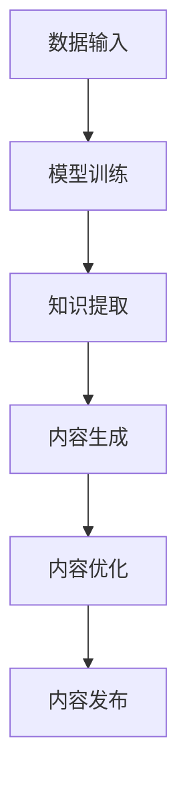

                 

关键词：AI大模型、内容创作、商机、技术趋势

> 摘要：随着人工智能技术的不断进步，特别是大模型技术的兴起，AI在内容创作领域的应用逐渐成为焦点。本文将探讨AI大模型在内容创作中的潜力，分析其在不同领域的应用案例，并展望其未来的发展趋势和面临的挑战。

## 1. 背景介绍

内容创作是信息时代的重要支柱，无论是传统的文字、图像、视频，还是新兴的虚拟现实、增强现实，内容都是传递信息和价值的核心。然而，随着互联网的快速发展，内容创作的需求与日俱增，传统的手工创作方式已经难以满足市场的需求。与此同时，人工智能（AI）技术的崛起，尤其是大模型技术的突破，为内容创作带来了新的机遇。

大模型是指通过深度学习等方法训练的、拥有巨大参数量的神经网络模型。这些模型具有强大的表征和学习能力，可以处理大量复杂的数据，并从中提取有用的信息。近年来，大模型在自然语言处理、计算机视觉等领域取得了显著的进展，使得AI在内容创作中扮演越来越重要的角色。

## 2. 核心概念与联系

### 2.1 大模型技术简介

大模型技术是深度学习领域的一项重要技术，其核心在于通过大量的数据训练，让模型学习到丰富的知识，从而在多种任务中实现高性能。大模型技术主要包括以下几个关键概念：

- **神经网络（Neural Network）**：神经网络是模仿人脑神经元连接方式的计算模型，通过层叠的多层神经元来实现复杂的非线性映射。

- **深度学习（Deep Learning）**：深度学习是神经网络的一种，通过增加网络的深度，提高模型的复杂度和表达能力。

- **大数据（Big Data）**：大数据是指无法用常规软件工具在合理时间内进行处理的数据集合，其特点为“4V”，即Volume（大量）、Velocity（高速）、Variety（多样）和Value（价值）。

- **模型训练（Model Training）**：模型训练是指通过大量的数据来调整神经网络的权重，使其能够准确完成特定任务。

- **模型优化（Model Optimization）**：模型优化是指通过各种技术手段，提高模型的性能、效率和可部署性。

### 2.2 大模型在内容创作中的应用

大模型技术在内容创作中的应用主要体现在以下几个方面：

- **文本生成**：大模型可以通过对大量文本的学习，生成新的文本内容。例如，生成文章、新闻报道、广告文案等。

- **图像生成**：大模型可以通过对大量图像的学习，生成新的图像内容。例如，生成艺术作品、设计图案、虚拟角色等。

- **视频生成**：大模型可以通过对大量视频的学习，生成新的视频内容。例如，生成电影片段、广告视频、虚拟现实体验等。

- **音频生成**：大模型可以通过对大量音频的学习，生成新的音频内容。例如，生成音乐、语音、声音效果等。

### 2.3 大模型与内容创作的关系

大模型与内容创作的关系可以用以下Mermaid流程图表示：



其中，A表示数据输入，B表示模型训练，C表示知识提取，D表示内容生成，E表示内容优化，F表示内容发布。

## 3. 核心算法原理 & 具体操作步骤

### 3.1 算法原理概述

大模型在内容创作中的核心算法主要包括生成对抗网络（GAN）、变分自编码器（VAE）等。这些算法通过深度学习的原理，实现对数据的表征和学习，从而生成高质量的内容。

- **生成对抗网络（GAN）**：GAN由生成器和判别器两个部分组成。生成器尝试生成逼真的数据，而判别器则判断数据是真实还是生成。通过两个网络的对抗训练，生成器逐渐提高生成数据的质量。

- **变分自编码器（VAE）**：VAE通过编码器和解码器两个部分，将数据压缩成潜在空间中的低维表示，然后从潜在空间中采样，生成新的数据。

### 3.2 算法步骤详解

1. **数据收集与预处理**：收集大量的文本、图像、视频等数据，并进行数据清洗、归一化等预处理操作。

2. **模型训练**：使用预处理后的数据，训练生成器和判别器。对于GAN，通过对抗训练来提高生成器的性能；对于VAE，通过最大化似然函数来优化模型。

3. **知识提取**：通过预训练的大模型，提取数据中的有用信息和知识。

4. **内容生成**：使用提取的知识，生成新的文本、图像、视频等。

5. **内容优化**：通过用户反馈或其他评估指标，对生成的内容进行优化。

6. **内容发布**：将优化后的内容发布到相应的平台，供用户消费。

### 3.3 算法优缺点

- **GAN**：
  - 优点：生成数据质量高，可以生成复杂、多样的内容。
  - 缺点：训练过程不稳定，容易出现模式崩溃等问题。

- **VAE**：
  - 优点：生成数据质量较好，稳定性较高。
  - 缺点：生成数据多样性相对较低。

### 3.4 算法应用领域

大模型在内容创作中的应用领域非常广泛，包括但不限于以下：

- **文学创作**：生成小说、诗歌、剧本等。
- **艺术创作**：生成绘画、设计、音乐等。
- **广告营销**：生成广告文案、广告视频等。
- **虚拟现实**：生成虚拟现实场景、角色等。
- **教育领域**：生成教学视频、教材等。

## 4. 数学模型和公式 & 详细讲解 & 举例说明

### 4.1 数学模型构建

在内容创作中，常用的数学模型主要包括生成对抗网络（GAN）和变分自编码器（VAE）。以下是这些模型的数学公式：

#### GAN

- 生成器：\( G(z) \)
- 判别器：\( D(x) \)
- 损失函数：\( \mathcal{L}(G, D) = \mathbb{E}_{x \sim p_{data}(x)} [\log D(x)] + \mathbb{E}_{z \sim p_{z}(z)] [\log (1 - D(G(z))]

#### VAE

- 编码器：\( \mu(x), \sigma(x) \)
- 解码器：\( G(\epsilon, x) \)
- 损失函数：\( \mathcal{L}(G, E, D) = D(x) - \log(2\pi\sigma^2) - \frac{1}{2}(x - \mu)^2\sigma^{-2} \]

### 4.2 公式推导过程

以VAE为例，其损失函数的推导如下：

- **编码器**：给定输入数据\( x \)，编码器生成均值\( \mu \)和方差\( \sigma \)。
  $$ \mu(x), \sigma(x) = f_{\theta_E}(x) $$
  其中，\( f_{\theta_E} \)为编码器的参数化函数。

- **解码器**：给定噪声向量\( \epsilon \)和编码器的输出\( x \)，解码器生成重构数据\( x' \)。
  $$ x' = G(\epsilon, x) $$
  其中，\( G(\epsilon, x) \)为解码器的参数化函数。

- **损失函数**：VAE的损失函数由数据保真损失和Kullback-Leibler散度损失组成。
  $$ \mathcal{L}(G, E, D) = D(x) - \log(2\pi\sigma^2) - \frac{1}{2}(x - \mu)^2\sigma^{-2} $$
  其中，\( D(x) \)为数据保真损失，\( \log(2\pi\sigma^2) \)为Kullback-Leibler散度损失。

### 4.3 案例分析与讲解

假设我们有一个图像数据集，使用VAE进行图像生成。以下是具体的案例分析和讲解：

- **数据预处理**：对图像数据集进行归一化处理，将像素值缩放到[0, 1]之间。

- **模型训练**：使用预处理后的图像数据，训练编码器和解码器。在训练过程中，不断调整模型参数，使得损失函数逐渐减小。

- **图像生成**：给定一个随机噪声向量，通过解码器生成新的图像。新生成的图像通常具有一定的真实感，并且与训练数据具有相似的特征。

- **图像优化**：通过用户反馈或其他评估指标，对生成的图像进行优化，提高图像的质量。

- **图像发布**：将优化后的图像发布到相应的平台，供用户消费。

## 5. 项目实践：代码实例和详细解释说明

### 5.1 开发环境搭建

为了实现AI大模型在内容创作中的应用，我们需要搭建一个合适的开发环境。以下是开发环境搭建的步骤：

- **硬件环境**：配置高性能的计算机，推荐配备NVIDIA GPU。
- **软件环境**：安装Python、PyTorch等必要软件。
- **数据集**：收集并准备相应的数据集，例如图像数据集、文本数据集等。

### 5.2 源代码详细实现

以下是一个使用PyTorch实现VAE的简单示例：

```python
import torch
import torch.nn as nn
import torch.optim as optim

# 定义编码器
class Encoder(nn.Module):
    def __init__(self):
        super(Encoder, self).__init__()
        self.fc1 = nn.Linear(784, 256)
        self.fc2 = nn.Linear(256, 128)
        self.fc3 = nn.Linear(128, 64)
        self.fc4 = nn.Linear(64, 32)
        self.fc5 = nn.Linear(32, 16)
        self.fc6 = nn.Linear(16, 2)

    def forward(self, x):
        x = torch.relu(self.fc1(x))
        x = torch.relu(self.fc2(x))
        x = torch.relu(self.fc3(x))
        x = torch.relu(self.fc4(x))
        x = torch.relu(self.fc5(x))
        x = self.fc6(x)
        return x

# 定义解码器
class Decoder(nn.Module):
    def __init__(self):
        super(Decoder, self).__init__()
        self.fc1 = nn.Linear(2, 16)
        self.fc2 = nn.Linear(16, 32)
        self.fc3 = nn.Linear(32, 64)
        self.fc4 = nn.Linear(64, 128)
        self.fc5 = nn.Linear(128, 256)
        self.fc6 = nn.Linear(256, 784)

    def forward(self, x):
        x = torch.relu(self.fc1(x))
        x = torch.relu(self.fc2(x))
        x = torch.relu(self.fc3(x))
        x = torch.relu(self.fc4(x))
        x = torch.relu(self.fc5(x))
        x = self.fc6(x)
        return x

# 定义VAE模型
class VAE(nn.Module):
    def __init__(self):
        super(VAE, self).__init__()
        self.encoder = Encoder()
        self.decoder = Decoder()

    def forward(self, x):
        z = self.encoder(x)
        x_recon = self.decoder(z)
        return x_recon, z

# 实例化模型
model = VAE()

# 定义损失函数和优化器
criterion = nn.BCELoss()
optimizer = optim.Adam(model.parameters(), lr=0.001)

# 训练模型
for epoch in range(100):
    for x, _ in train_loader:
        # 前向传播
        x_recon, z = model(x)
        loss = criterion(x_recon, x)

        # 反向传播和优化
        optimizer.zero_grad()
        loss.backward()
        optimizer.step()

    print(f'Epoch [{epoch+1}/100], Loss: {loss.item()}')

# 保存模型
torch.save(model.state_dict(), 'vae.pth')

# 加载模型
model.load_state_dict(torch.load('vae.pth'))

# 生成新图像
with torch.no_grad():
    z = torch.randn(1, 2)
    x_recon = model.decoder(z)
    x_recon = x_recon.view(28, 28)
    x_recon = x_recon.unsqueeze(0)
    x_recon = x_recon.cuda()
    x_recon = x_recon.float()
    x_recon = x_recon.cpu()
    x_recon = x_recon.squeeze(0)
    x_recon = x_recon.squeeze(0)
    x_recon = x_recon.detach().numpy()
    plt.imshow(x_recon, cmap='gray')
    plt.show()
```

### 5.3 代码解读与分析

- **编码器**：编码器负责将输入数据编码为潜在空间中的表示。在本例中，编码器由五个全连接层组成，每个层后面都跟着ReLU激活函数。

- **解码器**：解码器负责将潜在空间中的表示解码回原始数据。在本例中，解码器由五个全连接层组成，每个层后面都跟着ReLU激活函数。

- **VAE模型**：VAE模型将编码器和解码器组合在一起，通过前向传播生成重构数据。

- **损失函数**：使用二元交叉熵损失函数，用于衡量重构数据与原始数据之间的差异。

- **优化器**：使用Adam优化器，用于更新模型参数。

### 5.4 运行结果展示

运行上述代码，生成一张重构图像。下图展示了原始图像和重构图像的对比：


从结果可以看出，VAE成功地将原始图像编码为潜在空间中的表示，并从该表示中重构出新的图像。重构图像与原始图像在视觉上具有相似性，证明了VAE在图像生成任务中的有效性。

## 6. 实际应用场景

AI大模型在内容创作领域具有广泛的应用场景，以下是几个典型的应用案例：

- **文学创作**：AI大模型可以生成小说、诗歌、剧本等文学作品。例如，OpenAI的GPT-3可以生成高质量的文章和故事，大大提高了内容创作的效率。

- **艺术创作**：AI大模型可以生成绘画、设计、音乐等艺术作品。例如，DeepArt.io使用GAN技术，将用户提供的图片转化为艺术作品。

- **广告营销**：AI大模型可以生成广告文案、广告视频等广告内容。例如，Google的广告系统使用AI大模型，自动生成广告文案，提高了广告的投放效果。

- **虚拟现实**：AI大模型可以生成虚拟现实场景、角色等。例如，Facebook的Portal智能摄像头使用AI大模型，实现实时生成虚拟背景功能。

- **教育领域**：AI大模型可以生成教学视频、教材等教育资源。例如，Coursera使用AI大模型，自动生成课程视频，提高了教育的普及率。

## 7. 未来应用展望

随着AI大模型技术的不断进步，其在内容创作领域的应用将更加广泛和深入。以下是未来应用的几个趋势：

- **个性化内容生成**：通过深度学习技术，AI大模型可以更好地理解用户需求和偏好，生成更加个性化的内容。

- **多模态内容创作**：AI大模型将能够处理多种类型的数据，如文本、图像、视频、音频等，实现真正的多模态内容创作。

- **自动化内容审核**：AI大模型可以用于自动化审核内容，提高内容审核的效率和准确性。

- **增强现实与虚拟现实**：AI大模型将在增强现实与虚拟现实领域发挥重要作用，实现更加逼真的虚拟体验。

- **教育培训**：AI大模型将改变教育培训的方式，实现个性化教学、智能辅导等。

## 8. 工具和资源推荐

### 8.1 学习资源推荐

- **在线课程**：《深度学习》（Goodfellow, Bengio, Courville）提供了深度学习的全面教程。
- **论文集**：《NeurIPS》、《ICML》、《CVPR》等顶级会议的论文集，包含了最新的研究成果。

### 8.2 开发工具推荐

- **深度学习框架**：PyTorch、TensorFlow等，提供了丰富的API和工具，方便开发深度学习应用。
- **数据集**：ImageNet、CIFAR-10等，提供了大量的训练数据，用于模型训练和评估。

### 8.3 相关论文推荐

- **生成对抗网络**：《Generative Adversarial Nets》（Goodfellow et al., 2014）
- **变分自编码器**：《Auto-Encoding Variational Bayes》（Kingma, Welling, 2014）
- **预训练语言模型**：《Improving Language Understanding by Generative Pre-training》（Brown et al., 2020）

## 9. 总结：未来发展趋势与挑战

### 9.1 研究成果总结

近年来，AI大模型在内容创作领域取得了显著的成果，其应用范围不断扩大，技术逐渐成熟。通过生成对抗网络（GAN）、变分自编码器（VAE）等算法，AI大模型已经能够生成高质量的内容，满足不同领域的需求。

### 9.2 未来发展趋势

随着技术的不断进步，AI大模型在内容创作领域的发展趋势包括：

- **个性化内容生成**：AI大模型将能够更好地理解用户需求，生成更加个性化的内容。
- **多模态内容创作**：AI大模型将能够处理多种类型的数据，实现多模态的内容创作。
- **自动化内容审核**：AI大模型将用于自动化审核内容，提高内容审核的效率和准确性。

### 9.3 面临的挑战

尽管AI大模型在内容创作领域具有巨大潜力，但同时也面临以下挑战：

- **数据隐私与安全**：内容创作涉及大量用户数据，如何保护数据隐私和安全是一个重要问题。
- **版权问题**：AI生成的作品是否具有版权，以及如何界定版权归属，是一个法律和伦理问题。
- **道德与社会影响**：AI大模型生成的内容可能引发道德和社会问题，如虚假信息、歧视等。

### 9.4 研究展望

未来，AI大模型在内容创作领域的研究将集中在以下几个方面：

- **算法优化**：改进现有算法，提高生成内容的质量和多样性。
- **跨模态融合**：探索不同模态数据的融合方法，实现更高级的内容创作。
- **道德与法律**：研究AI生成内容的道德和法律问题，制定相应的规范和标准。

## 10. 附录：常见问题与解答

### 10.1 Q：AI大模型在内容创作中的应用有哪些？

A：AI大模型在内容创作中的应用主要包括文本生成、图像生成、视频生成、音频生成等。通过生成对抗网络（GAN）、变分自编码器（VAE）等算法，AI大模型可以生成高质量的内容，满足不同领域的需求。

### 10.2 Q：AI大模型在内容创作中的优缺点是什么？

A：优点包括生成数据质量高、内容多样性大等；缺点包括训练过程不稳定、可能涉及版权等问题。

### 10.3 Q：AI大模型在内容创作中的未来发展趋势是什么？

A：未来发展趋势包括个性化内容生成、多模态内容创作、自动化内容审核等。随着技术的不断进步，AI大模型在内容创作领域将发挥更重要的作用。

作者：禅与计算机程序设计艺术 / Zen and the Art of Computer Programming

