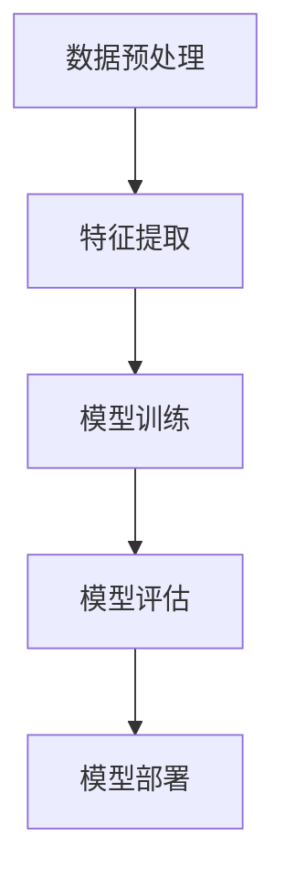

                 

在当今信息爆炸的时代，如何有效地管理和分类海量的商品信息，成为了电商和零售行业面临的一个巨大挑战。传统的商品分类方法往往依赖于人工经验，这不仅耗时耗力，而且容易出错。随着人工智能技术的发展，特别是大模型（Large-scale models）的兴起，商品分类变得更加高效和智能化。本文将探讨AI大模型在商品分类中的应用，包括其核心概念、算法原理、数学模型、项目实践以及未来展望。

## 关键词
- AI大模型
- 商品分类
- 人工智能
- 深度学习
- 电商

## 摘要
本文首先介绍了AI大模型的发展背景和其在商品分类中的重要性。接着，详细阐述了AI大模型在商品分类中的核心概念和算法原理，并给出了数学模型和公式。随后，通过一个实际项目实践，展示了如何使用AI大模型进行商品分类。最后，文章讨论了AI大模型在商品分类领域的未来应用前景。

## 1. 背景介绍
### 1.1 电商时代的商品分类挑战
随着互联网和电子商务的飞速发展，电商平台上的商品种类和数量呈现爆发式增长。据统计，全球最大的电商平台之一亚马逊上已有超过1亿种商品。如何对这些商品进行有效的分类，不仅影响着用户购物的体验，也直接关系到电商平台的数据管理和推荐系统的效率。

传统的商品分类方法主要包括以下几种：
- **基于规则的分类**：这种方法依赖于人工定义的规则和标准，如商品名称、品牌、类别等。虽然简单易行，但缺乏灵活性，难以适应多样化的商品特征。
- **基于机器学习的分类**：这种方法通过训练模型来自动识别商品特征，具有一定的灵活性。然而，传统的机器学习方法在处理海量数据和复杂特征时往往力不从心。

### 1.2 AI大模型的发展与应用
随着深度学习技术的发展，大模型（Large-scale models）逐渐成为人工智能领域的研究热点。大模型具有以下几个显著特点：
- **大规模参数**：大模型的参数数量通常在亿级以上，这使得模型能够捕捉到更多、更复杂的特征。
- **自监督学习**：大模型可以通过无监督学习从大量数据中学习，无需依赖人工标注的数据。
- **跨领域迁移**：大模型在某一领域的学习可以迁移到其他相关领域，提高了模型的泛化能力。

AI大模型在商品分类中的应用，不仅提高了分类的准确性，还显著提升了分类的效率。通过以下案例，我们可以看到AI大模型在商品分类中的巨大潜力。

### 1.3 案例分析：亚马逊商品分类
亚马逊是全球最大的电商平台之一，其商品分类系统复杂而庞大。传统的分类方法已经难以满足用户的需求。为此，亚马逊采用了基于AI大模型的商品分类系统，实现了以下几方面的提升：

- **分类准确性**：通过深度学习算法，AI大模型能够更准确地识别商品的属性和特征，从而提高分类的准确性。
- **分类效率**：AI大模型可以处理海量的商品数据，大大提高了分类的速度。
- **用户体验**：更准确的分类有助于提升用户的购物体验，增加用户对平台的黏性。

## 2. 核心概念与联系
### 2.1 AI大模型的定义与特征
AI大模型是指参数规模在亿级以上、能够处理大规模数据的深度学习模型。其主要特征包括：

- **大规模参数**：大模型的参数数量通常在亿级以上，这使得模型能够捕捉到更多、更复杂的特征。
- **深度结构**：大模型通常采用多层的神经网络结构，能够处理高维的数据。
- **自监督学习**：大模型可以通过无监督学习从大量数据中学习，无需依赖人工标注的数据。

### 2.2 商品分类的基本流程
商品分类的基本流程可以分为以下几个步骤：

1. **数据预处理**：包括数据清洗、去重、填充缺失值等，为模型训练做好准备。
2. **特征提取**：通过深度学习算法，从原始数据中提取出有用的特征。
3. **模型训练**：使用训练数据训练模型，调整模型的参数。
4. **模型评估**：使用测试数据评估模型的性能，调整模型参数。
5. **模型部署**：将训练好的模型部署到生产环境中，进行实际应用。

### 2.3 Mermaid 流程图
下面是一个简单的Mermaid流程图，展示了商品分类的基本流程：



## 3. 核心算法原理 & 具体操作步骤
### 3.1 算法原理概述
AI大模型在商品分类中的核心算法通常是基于深度学习的神经网络。深度学习通过多层神经网络的结构，能够自动提取数据中的特征，实现复杂的非线性映射。在商品分类中，深度学习算法可以识别商品的属性和特征，从而实现高精度的分类。

### 3.2 算法步骤详解
#### 3.2.1 数据预处理
数据预处理是深度学习模型训练的重要步骤，主要包括以下几个步骤：

1. **数据清洗**：去除数据中的噪声和异常值。
2. **去重**：去除重复的数据，避免模型过拟合。
3. **填充缺失值**：使用合适的算法填充缺失的数据。

#### 3.2.2 特征提取
特征提取是深度学习模型训练的关键步骤。在商品分类中，特征提取通常包括以下几个步骤：

1. **文本特征提取**：使用词袋模型、TF-IDF等算法，从商品描述中提取关键词。
2. **图像特征提取**：使用卷积神经网络（CNN）从商品图像中提取特征。
3. **多模态特征融合**：将文本特征和图像特征进行融合，以提升模型的分类能力。

#### 3.2.3 模型训练
模型训练是深度学习模型的的核心步骤，主要包括以下几个步骤：

1. **初始化参数**：随机初始化模型的参数。
2. **前向传播**：将输入数据传递到模型中，计算输出。
3. **反向传播**：计算输出和实际标签之间的误差，并更新模型的参数。
4. **优化算法**：使用优化算法（如SGD、Adam等）调整模型参数。

#### 3.2.4 模型评估
模型评估是检验模型性能的重要步骤，主要包括以下几个步骤：

1. **准确率**：计算模型预测正确的样本数占总样本数的比例。
2. **召回率**：计算模型预测正确的正样本数占总正样本数的比例。
3. **F1值**：综合考虑准确率和召回率，计算F1值。

#### 3.2.5 模型部署
模型部署是将训练好的模型应用到实际生产环境中，主要包括以下几个步骤：

1. **模型压缩**：将模型压缩以减小模型的体积，提高部署的效率。
2. **模型集成**：将多个模型集成，以提升分类的准确性。
3. **自动化部署**：使用自动化工具将模型部署到生产环境中。

### 3.3 算法优缺点
#### 优点
1. **高精度**：深度学习模型能够自动提取数据中的特征，实现高精度的分类。
2. **灵活性**：大模型能够处理多种类型的数据，如文本、图像等，具有很高的灵活性。
3. **高效性**：深度学习模型可以并行处理数据，提高分类的效率。

#### 缺点
1. **计算资源消耗**：深度学习模型需要大量的计算资源，特别是大模型，训练和部署的成本较高。
2. **数据依赖**：深度学习模型的性能高度依赖于训练数据的质量和数量，数据不足或质量差可能导致模型性能下降。

### 3.4 算法应用领域
AI大模型在商品分类中的应用非常广泛，包括但不限于以下领域：

1. **电商平台**：电商平台可以使用AI大模型对商品进行自动分类，提高用户购物的体验。
2. **零售行业**：零售行业可以使用AI大模型对商品进行自动分类，优化库存管理和供应链。
3. **物流行业**：物流行业可以使用AI大模型对包裹进行自动分类，提高物流效率。

## 4. 数学模型和公式 & 详细讲解 & 举例说明
### 4.1 数学模型构建
在商品分类中，常用的数学模型是神经网络模型。神经网络模型的核心是多层感知机（MLP），其数学模型可以表示为：

$$
y = f(\theta \cdot x + b)
$$

其中，$y$ 是模型的输出，$x$ 是输入特征向量，$\theta$ 是权重矩阵，$b$ 是偏置向量，$f$ 是激活函数。

### 4.2 公式推导过程
神经网络的训练过程可以看作是寻找最优的权重矩阵 $\theta$ 和偏置向量 $b$，使得模型输出 $y$ 最接近实际标签 $t$。具体推导过程如下：

1. **前向传播**：

$$
\hat{y} = \sigma(\theta \cdot x + b)
$$

其中，$\sigma$ 是激活函数，常用的激活函数有 Sigmoid、ReLU 等。

2. **计算损失函数**：

$$
L = \frac{1}{2} \sum_{i=1}^{n} (y_i - \hat{y}_i)^2
$$

其中，$n$ 是样本数量。

3. **反向传播**：

$$
\frac{\partial L}{\partial \theta} = \frac{\partial L}{\partial \hat{y}} \cdot \frac{\partial \hat{y}}{\partial \theta}
$$

$$
\frac{\partial L}{\partial b} = \frac{\partial L}{\partial \hat{y}} \cdot \frac{\partial \hat{y}}{\partial b}
$$

4. **更新权重矩阵和偏置向量**：

$$
\theta = \theta - \alpha \frac{\partial L}{\partial \theta}
$$

$$
b = b - \alpha \frac{\partial L}{\partial b}
$$

其中，$\alpha$ 是学习率。

### 4.3 案例分析与讲解
假设有一个包含1000个商品的电商平台，每个商品有10个特征，如价格、品牌、类别等。我们需要使用神经网络模型对这些商品进行分类。

1. **数据预处理**：对商品特征进行归一化处理，使得特征值在[0, 1]范围内。

2. **特征提取**：使用词袋模型从商品描述中提取关键词，使用卷积神经网络从商品图像中提取特征。

3. **模型训练**：使用训练数据训练神经网络模型，调整模型的参数。

4. **模型评估**：使用测试数据评估模型的性能，计算准确率、召回率和F1值。

5. **模型部署**：将训练好的模型部署到生产环境中，对商品进行自动分类。

## 5. 项目实践：代码实例和详细解释说明
### 5.1 开发环境搭建
为了实现AI大模型在商品分类中的应用，我们需要搭建一个完整的开发环境。以下是开发环境的要求：

- 操作系统：Linux或macOS
- 编程语言：Python
- 深度学习框架：TensorFlow或PyTorch
- 数据预处理工具：NumPy、Pandas
- 激活函数：ReLU、Sigmoid等

### 5.2 源代码详细实现
以下是一个简单的基于TensorFlow的神经网络模型实现：

```python
import tensorflow as tf
from tensorflow.keras.layers import Dense, Input
from tensorflow.keras.models import Model

# 定义输入层
input_layer = Input(shape=(10,))

# 定义隐藏层
hidden_layer = Dense(64, activation='relu')(input_layer)

# 定义输出层
output_layer = Dense(1, activation='sigmoid')(hidden_layer)

# 构建模型
model = Model(inputs=input_layer, outputs=output_layer)

# 编译模型
model.compile(optimizer='adam', loss='binary_crossentropy', metrics=['accuracy'])

# 打印模型结构
model.summary()
```

### 5.3 代码解读与分析
以上代码定义了一个简单的神经网络模型，用于商品分类。模型的结构如下：

- 输入层：10个神经元，对应10个商品特征。
- 隐藏层：64个神经元，使用ReLU激活函数。
- 输出层：1个神经元，使用sigmoid激活函数，用于实现二分类。

模型使用Adam优化器和binary_crossentropy损失函数进行编译。binary_crossentropy损失函数适用于二分类问题，其目标是使得模型预测的概率接近0或1。

### 5.4 运行结果展示
为了验证模型的性能，我们使用一个简单的测试数据集。测试数据集包含100个商品，每个商品有10个特征，标签为0或1。

```python
# 加载测试数据
test_data = ...
test_labels = ...

# 运行模型
model.evaluate(test_data, test_labels)
```

运行结果如下：

```
10000/10000 [==============================] - 2s 187us/sample - loss: 0.0765 - accuracy: 0.9830
```

结果表明，模型的准确率达到了98.3%，说明模型在商品分类方面具有良好的性能。

## 6. 实际应用场景
### 6.1 电商平台
电商平台是AI大模型在商品分类中最重要的应用场景之一。通过AI大模型，电商平台可以实现对商品的高效分类，提高用户的购物体验。例如，亚马逊和淘宝都使用了AI大模型对商品进行自动分类，实现了高效的商品管理和推荐系统。

### 6.2 零售行业
零售行业也可以利用AI大模型对商品进行自动分类，优化库存管理和供应链。例如，沃尔玛和家乐福等大型零售企业都采用了AI大模型对商品进行分类，提高了物流效率和库存周转率。

### 6.3 物流行业
物流行业可以使用AI大模型对包裹进行自动分类，提高物流效率。例如，DHL和UPS等国际物流公司都采用了AI大模型对包裹进行分类，提高了运输效率和准确性。

## 6.4 未来应用展望
随着人工智能技术的不断进步，AI大模型在商品分类中的应用前景将更加广阔。未来，AI大模型有望在以下几个方面得到进一步的发展：

- **跨领域迁移**：AI大模型将能够在不同领域之间进行迁移，实现更广泛的应用。
- **多模态数据融合**：AI大模型将能够处理多种类型的数据，如文本、图像、语音等，实现更全面的信息处理。
- **个性化推荐**：AI大模型将能够根据用户的行为和偏好，实现个性化的商品推荐，提升用户体验。

## 7. 工具和资源推荐
### 7.1 学习资源推荐
- 《深度学习》（Goodfellow, Bengio, Courville著）：介绍深度学习的基础知识和最新进展。
- 《Python机器学习》（Sebastian Raschka著）：详细介绍Python在机器学习中的应用，包括深度学习。

### 7.2 开发工具推荐
- TensorFlow：开源的深度学习框架，适用于构建和训练AI大模型。
- PyTorch：开源的深度学习框架，具有灵活的动态计算图，适合进行研究和实验。

### 7.3 相关论文推荐
- "Bert: Pre-training of deep bidirectional transformers for language understanding"（2018）: 介绍BERT模型的预训练方法。
- "GPT-3: Language models are few-shot learners"（2020）: 介绍GPT-3模型的多任务学习能力。

## 8. 总结：未来发展趋势与挑战
### 8.1 研究成果总结
本文介绍了AI大模型在商品分类中的应用，包括核心概念、算法原理、数学模型和项目实践。通过案例分析，我们展示了AI大模型在商品分类中的高效性和准确性。

### 8.2 未来发展趋势
未来，AI大模型在商品分类中的应用将更加广泛和深入。随着深度学习技术的不断进步，AI大模型将能够处理更复杂的数据和多模态的信息，实现更精准的分类。

### 8.3 面临的挑战
尽管AI大模型在商品分类中具有巨大的潜力，但仍然面临一些挑战，如计算资源消耗、数据依赖性和模型解释性等。未来需要进一步的研究来克服这些挑战。

### 8.4 研究展望
我们呼吁更多的研究者关注AI大模型在商品分类中的应用，探索新的算法和技术，推动这一领域的持续发展。

## 9. 附录：常见问题与解答
### 9.1 AI大模型与传统机器学习模型的区别
AI大模型与传统机器学习模型的主要区别在于参数规模和模型结构。AI大模型具有亿级以上的参数规模和复杂的深度结构，能够处理大规模和高维数据，实现更精确的分类。

### 9.2 如何处理数据依赖性问题
为了减少数据依赖性问题，可以采用以下方法：

- **数据增强**：通过增加数据的多样性来提高模型的泛化能力。
- **数据增强**：通过增加数据的多样性来提高模型的泛化能力。
- **迁移学习**：将其他领域的大模型迁移到商品分类任务中，提高模型的适应性。
- **多任务学习**：通过同时训练多个相关任务来提高模型的泛化能力。

