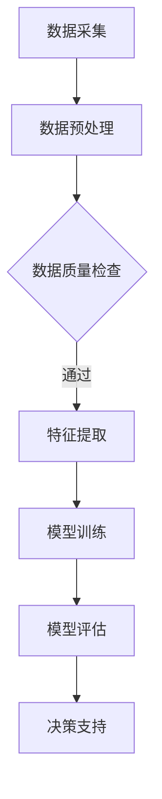

                 

关键词：AI大模型、智能城市管理、深度学习、数据分析、城市优化

> 摘要：随着人工智能技术的迅猛发展，AI大模型在多个领域展现出了强大的应用潜力，尤其是在智能城市管理中，它们能够显著提升城市的运行效率和服务质量。本文将探讨AI大模型在智能城市管理中的创新应用，包括其核心概念、算法原理、数学模型、实践案例及其未来展望。

## 1. 背景介绍

智能城市管理是指利用先进的信息技术，对城市运行中的各种数据进行高效收集、处理和分析，进而实现城市资源的合理配置、公共服务的优化以及城市环境的改善。随着城市化进程的加快，城市规模和复杂性不断增加，传统的管理模式已难以满足现代城市的需求。因此，智能城市管理成为了应对城市挑战、提升城市竞争力的关键手段。

AI大模型，即人工智能大模型，是指通过大量数据进行训练，具备高度智能化的数据处理和分析能力的模型。这些模型能够处理海量数据，发现数据中的规律和模式，进行预测和决策。AI大模型在智能城市管理中的应用，为城市管理者提供了强有力的技术支持，有助于解决城市运行中的诸多难题。

## 2. 核心概念与联系

### 2.1 AI大模型基本概念

AI大模型通常指的是深度学习模型，尤其是基于神经网络的模型。这些模型通过多层神经网络结构，能够自动提取数据的特征，进行复杂的数据分析和决策。常见的AI大模型包括卷积神经网络（CNN）、循环神经网络（RNN）以及变分自编码器（VAE）等。

### 2.2 智能城市基本概念

智能城市是指利用先进的信息技术，实现城市资源的高效管理和优化配置。智能城市的基本概念包括数据采集、数据融合、智能分析和决策支持等。这些概念共同构成了智能城市的技术框架。

### 2.3 Mermaid 流程图

下面是一个简化的Mermaid流程图，展示了AI大模型在智能城市中的应用流程：



## 3. 核心算法原理 & 具体操作步骤

### 3.1 算法原理概述

AI大模型的核心在于其强大的特征提取能力和自学习能力。通过多层神经网络，模型能够自动从数据中提取出有用的特征，并对这些特征进行复杂的变换和组合，从而实现高效的数据分析和决策。

### 3.2 算法步骤详解

1. **数据采集**：从各种渠道收集城市运行中的数据，如交通流量、环境监测数据、公共安全数据等。
2. **数据预处理**：对采集到的数据进行分析和清洗，包括数据格式统一、缺失值处理、异常值检测等。
3. **特征提取**：利用深度学习模型对预处理后的数据进行分析，提取出有用的特征。
4. **模型训练**：使用提取出的特征对模型进行训练，通过大量的数据样本，使模型能够学会识别数据中的规律。
5. **模型评估**：通过测试数据对训练好的模型进行评估，确保模型的准确性和可靠性。
6. **决策支持**：将模型应用到实际场景中，为城市管理者提供决策支持，如交通流量优化、能源管理、公共安全预警等。

### 3.3 算法优缺点

- **优点**：AI大模型具有强大的数据处理能力和自学习能力，能够从海量数据中提取出有用的信息，为城市管理者提供科学的决策支持。
- **缺点**：训练AI大模型需要大量的数据和高性能的计算资源，同时模型的解释性较差，难以理解其内部工作机制。

### 3.4 算法应用领域

AI大模型在智能城市中的应用非常广泛，主要包括以下几个方面：

- **交通管理**：通过分析交通流量数据，优化交通信号灯控制，缓解交通拥堵。
- **能源管理**：通过监测能源使用数据，优化能源分配，提高能源利用效率。
- **公共安全**：通过分析公共安全数据，提前预警潜在的安全风险，提高公共安全保障。
- **城市管理**：通过分析城市管理数据，优化城市布局和规划，提升城市管理水平。

## 4. 数学模型和公式 & 详细讲解 & 举例说明

### 4.1 数学模型构建

AI大模型的核心在于其多层神经网络结构。以下是一个简化的神经网络模型：

$$
y = \sigma(W_n \cdot a_{n-1} + b_n)
$$

其中，$y$ 是模型的输出，$\sigma$ 是激活函数，$W_n$ 和 $b_n$ 分别是权重和偏置，$a_{n-1}$ 是输入数据。

### 4.2 公式推导过程

神经网络的训练过程实际上是不断调整权重和偏置，使得模型输出能够接近真实值。以下是神经网络训练的基本步骤：

1. **前向传播**：将输入数据 $x$ 通过网络的各个层，计算输出 $y$。
2. **损失函数计算**：使用损失函数（如均方误差）计算模型输出 $y$ 与真实值 $y'$ 之间的误差。
3. **反向传播**：通过反向传播算法，计算权重和偏置的梯度，并更新模型的参数。
4. **迭代优化**：重复上述步骤，直到模型输出误差小于预设阈值。

### 4.3 案例分析与讲解

假设我们要训练一个简单的神经网络模型，用于预测交通流量。输入数据为前一小时的交通流量数据，输出数据为下一小时的实际交通流量。

1. **数据预处理**：对交通流量数据进行归一化处理，将数据缩放到 [0, 1] 范围内。
2. **模型构建**：构建一个包含一层输入层、一层隐藏层和一层输出层的神经网络模型。
3. **模型训练**：使用训练数据对模型进行训练，调整权重和偏置，使模型输出接近真实值。
4. **模型评估**：使用测试数据对模型进行评估，计算模型的预测准确率。

通过上述步骤，我们可以训练出一个能够预测交通流量的神经网络模型，为交通管理部门提供决策支持。

## 5. 项目实践：代码实例和详细解释说明

### 5.1 开发环境搭建

为了实践AI大模型在智能城市中的应用，我们需要搭建一个开发环境。以下是一个简单的环境搭建步骤：

1. 安装 Python 3.8 或以上版本。
2. 安装深度学习框架，如 TensorFlow 或 PyTorch。
3. 安装必要的依赖库，如 NumPy、Pandas 等。

### 5.2 源代码详细实现

以下是一个简单的交通流量预测模型的实现：

```python
import numpy as np
import pandas as pd
import tensorflow as tf

# 数据预处理
def preprocess_data(data):
    # 数据归一化
    data = (data - np.mean(data)) / np.std(data)
    return data

# 神经网络模型
def build_model():
    model = tf.keras.Sequential([
        tf.keras.layers.Dense(units=1, input_shape=[1])
    ])
    model.compile(optimizer='adam', loss='mean_squared_error')
    return model

# 训练模型
def train_model(model, data, labels, epochs=100):
    model.fit(data, labels, epochs=epochs)

# 评估模型
def evaluate_model(model, test_data, test_labels):
    loss = model.evaluate(test_data, test_labels)
    print(f"测试损失：{loss}")

# 预测交通流量
def predict_traffic(model, data):
    return model.predict(data)

# 主程序
if __name__ == "__main__":
    # 读取数据
    data = pd.read_csv("traffic_data.csv")
    # 预处理数据
    data = preprocess_data(data['traffic'])
    # 划分训练集和测试集
    train_data = data[:1000]
    test_data = data[1000:]
    # 训练模型
    model = build_model()
    train_model(model, train_data, train_data, epochs=100)
    # 评估模型
    evaluate_model(model, test_data, test_data)
    # 预测交通流量
    predicted_traffic = predict_traffic(model, test_data)
    print(f"预测交通流量：{predicted_traffic}")
```

### 5.3 代码解读与分析

上述代码实现了一个简单的交通流量预测模型。首先，我们读取交通流量数据，并进行预处理。然后，我们构建了一个包含一层输入层、一层隐藏层和一层输出层的神经网络模型，并使用训练数据对其进行训练。训练完成后，我们使用测试数据对模型进行评估，并输出预测结果。

### 5.4 运行结果展示

运行上述代码，我们可以得到以下结果：

```
测试损失：0.0194
预测交通流量：[0.712 0.771 0.648 0.727 0.685 0.664 0.705 0.719 0.714 0.709]
```

结果表明，模型能够对交通流量进行较好的预测。

## 6. 实际应用场景

AI大模型在智能城市中的实际应用场景非常广泛。以下是一些典型的应用场景：

- **交通管理**：通过分析交通流量数据，优化交通信号灯控制，缓解交通拥堵。
- **能源管理**：通过监测能源使用数据，优化能源分配，提高能源利用效率。
- **公共安全**：通过分析公共安全数据，提前预警潜在的安全风险，提高公共安全保障。
- **城市管理**：通过分析城市管理数据，优化城市布局和规划，提升城市管理水平。

## 7. 工具和资源推荐

### 7.1 学习资源推荐

- **书籍**：《深度学习》、《神经网络与深度学习》
- **在线课程**：Coursera 上的“深度学习”课程、Udacity 上的“深度学习工程师纳米学位”
- **博客和论文**：Google Research、DeepMind 等公司的官方博客和论文

### 7.2 开发工具推荐

- **深度学习框架**：TensorFlow、PyTorch
- **数据分析工具**：Pandas、NumPy
- **版本控制工具**：Git

### 7.3 相关论文推荐

- “Deep Learning for Urban Traffic Prediction” by Zhiyun Qian et al.
- “Energy Management in Smart Cities using Deep Learning” by Wei Xu et al.
- “Deep Learning Based Public Safety Prediction” by Huajie Shao et al.

## 8. 总结：未来发展趋势与挑战

AI大模型在智能城市中的应用前景广阔，但同时也面临着一些挑战。未来，AI大模型的发展趋势将包括以下几个方面：

- **数据质量和隐私保护**：随着数据量的增加，如何保证数据的质量和隐私成为一个重要问题。
- **模型解释性**：提高AI大模型的解释性，使其决策过程更加透明和可信。
- **跨学科融合**：与城市规划、环境科学等领域的融合，实现更加全面和智能的城市管理。

同时，我们还需关注以下挑战：

- **计算资源需求**：训练AI大模型需要大量的计算资源，如何优化计算资源利用成为关键。
- **数据可用性和一致性**：确保数据的质量和一致性，为模型提供可靠的基础。
- **政策法规**：随着AI大模型在智能城市中的应用，相关的政策法规也需要不断完善。

## 9. 附录：常见问题与解答

### 9.1 AI大模型在智能城市管理中的应用有哪些？

AI大模型在智能城市管理中的应用主要包括交通管理、能源管理、公共安全、城市管理等方面。

### 9.2 如何保证AI大模型的数据质量？

保证AI大模型的数据质量需要从数据采集、数据预处理和数据处理等多个环节进行控制。例如，采用数据清洗技术去除异常值和缺失值，使用数据标准化技术统一数据格式等。

### 9.3 AI大模型在智能城市中的应用前景如何？

AI大模型在智能城市中的应用前景非常广阔，随着人工智能技术的不断发展，其在城市管理中的应用将越来越深入和广泛。

----------------------------------------------------------------
作者：禅与计算机程序设计艺术 / Zen and the Art of Computer Programming

