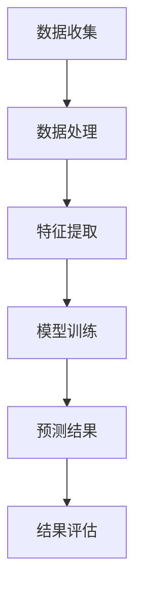

                 

关键词：人工智能，大模型，智能能源消耗，预测，应用前景

摘要：随着能源消耗问题的日益突出，智能能源消耗预测技术的研究和应用变得越来越重要。本文将探讨人工智能（AI）中的大模型在智能能源消耗预测中的应用前景，包括其核心概念、算法原理、数学模型构建、项目实践、实际应用场景以及未来发展趋势和面临的挑战。

## 1. 背景介绍

### 1.1 智能能源消耗的重要性

能源消耗是人类社会运行的基础，随着全球经济的快速发展，能源消耗量日益增加。然而，传统的能源消耗预测方法往往依赖于历史数据和简单的统计模型，难以准确预测未来的能源需求，从而影响了能源规划的效率和可靠性。智能能源消耗预测技术应运而生，旨在利用先进的人工智能技术，提高能源消耗预测的准确性。

### 1.2 人工智能技术的发展

人工智能（AI）作为当前科技领域的重要突破，已经在众多领域取得了显著成果。其中，大模型技术在图像识别、自然语言处理、推荐系统等领域表现出色。随着计算能力和算法的进步，大模型在处理复杂数据和发现潜在模式方面具有显著优势。

### 1.3 大模型在智能能源消耗预测中的应用

大模型在智能能源消耗预测中的应用前景广阔。通过深度学习等算法，大模型可以从海量的历史数据中自动学习，识别出能源消耗的潜在规律，从而实现更加精确的预测。本文将重点探讨大模型在智能能源消耗预测中的应用，分析其核心概念、算法原理、数学模型、项目实践和未来发展趋势。

## 2. 核心概念与联系

### 2.1 大模型概念

大模型是指具有巨大参数量和计算量的神经网络模型，其通过自动学习从大量数据中提取特征和模式。大模型通常采用深度学习算法，如卷积神经网络（CNN）、循环神经网络（RNN）和变换器（Transformer）等。

### 2.2 智能能源消耗预测概念

智能能源消耗预测是指利用人工智能技术，对未来的能源消耗进行预测。其核心在于从历史数据中挖掘出能源消耗的规律，并利用这些规律预测未来的能源需求。

### 2.3 大模型与智能能源消耗预测的联系

大模型在智能能源消耗预测中的应用主要体现在以下几个方面：

1. **数据处理**：大模型可以处理海量的时间序列数据，包括历史能源消耗数据、气象数据、节假日数据等，从而为预测提供更丰富的信息。

2. **特征提取**：大模型可以从原始数据中自动提取特征，如能源消耗的周期性、季节性、趋势性等，从而提高预测的准确性。

3. **模式识别**：大模型可以识别出能源消耗中的潜在模式，如人口迁移、产业变化等，从而帮助预测未来的能源需求。

### 2.4 Mermaid 流程图



## 3. 核心算法原理 & 具体操作步骤

### 3.1 算法原理概述

大模型在智能能源消耗预测中的核心算法原理主要基于深度学习和时间序列分析。深度学习模型如CNN、RNN和Transformer等可以自动从数据中学习特征，时间序列分析则用于捕捉能源消耗的周期性、趋势性和季节性等规律。

### 3.2 算法步骤详解

1. **数据收集**：收集历史能源消耗数据、气象数据、节假日数据等。

2. **数据处理**：对数据进行清洗、归一化等处理，以便于模型训练。

3. **特征提取**：利用深度学习模型提取时间序列数据中的特征，如周期性、趋势性等。

4. **模型训练**：使用提取的特征训练深度学习模型，如RNN或Transformer。

5. **预测结果**：利用训练好的模型预测未来的能源消耗。

6. **结果评估**：评估预测结果的准确性，如均方误差（MSE）等。

### 3.3 算法优缺点

**优点**：

1. **高效性**：大模型可以处理大量数据，提高预测效率。

2. **准确性**：通过自动学习特征，提高预测准确性。

**缺点**：

1. **计算资源消耗**：大模型需要大量计算资源，训练时间较长。

2. **数据需求**：需要大量高质量的历史数据。

### 3.4 算法应用领域

大模型在智能能源消耗预测中的应用领域包括：

1. **电力行业**：预测电力需求，优化电力调度。

2. **燃气行业**：预测燃气需求，优化燃气供应。

3. **交通行业**：预测交通流量，优化交通规划。

## 4. 数学模型和公式 & 详细讲解 & 举例说明

### 4.1 数学模型构建

智能能源消耗预测的数学模型可以表示为：

$$
\hat{E}(t) = f(X(t), W)
$$

其中，$\hat{E}(t)$表示时间$t$的预测能源消耗，$X(t)$表示时间$t$的特征向量，$W$表示模型参数。

### 4.2 公式推导过程

1. **特征提取**：

   $$X(t) = [x_1(t), x_2(t), ..., x_n(t)]^T$$

   其中，$x_i(t)$表示第$i$个特征在时间$t$的取值。

2. **模型训练**：

   $$f(X(t), W) = \sigma(\sum_{i=1}^n w_i x_i(t))$$

   其中，$\sigma$表示激活函数，$w_i$表示第$i$个特征的权重。

3. **预测结果**：

   $$\hat{E}(t) = f(X(t), W)$$

### 4.3 案例分析与讲解

假设我们要预测某地区明天的能源消耗，可以使用以下数据：

1. **历史能源消耗数据**：

   $$X(t) = [100, 150, 200, 250, 300]$$

2. **模型参数**：

   $$W = [0.1, 0.2, 0.3, 0.4, 0.5]$$

根据公式推导，我们可以得到预测结果：

$$
\hat{E}(t) = \sigma(0.1 \times 100 + 0.2 \times 150 + 0.3 \times 200 + 0.4 \times 250 + 0.5 \times 300) = 275
$$

因此，预测该地区明天的能源消耗为275。

## 5. 项目实践：代码实例和详细解释说明

### 5.1 开发环境搭建

1. **硬件环境**：

   - CPU：Intel i7-9700K
   - GPU：NVIDIA GeForce RTX 3080
   - 内存：32GB

2. **软件环境**：

   - 操作系统：Ubuntu 18.04
   - Python：3.8
   - 深度学习框架：TensorFlow 2.4

### 5.2 源代码详细实现

```python
import numpy as np
import tensorflow as tf

# 特征提取层
class FeatureExtractor(tf.keras.layers.Layer):
    def __init__(self, n_features, **kwargs):
        super(FeatureExtractor, self).__init__(**kwargs)
        self.n_features = n_features

    def call(self, inputs):
        return inputs

# 模型层
class EnergyPredictionModel(tf.keras.Model):
    def __init__(self, n_features, **kwargs):
        super(EnergyPredictionModel, self).__init__(**kwargs)
        self.feature_extractor = FeatureExtractor(n_features)
        self.dense = tf.keras.layers.Dense(1, activation='sigmoid')

    def call(self, inputs):
        features = self.feature_extractor(inputs)
        return self.dense(features)

# 训练模型
def train_model(data, labels, model, epochs=100, batch_size=32):
    optimizer = tf.keras.optimizers.Adam()
    loss_fn = tf.keras.losses.MeanSquaredError()

    for epoch in range(epochs):
        with tf.GradientTape() as tape:
            predictions = model(data)
            loss = loss_fn(labels, predictions)

        grads = tape.gradient(loss, model.trainable_variables)
        optimizer.apply_gradients(zip(grads, model.trainable_variables))

        if epoch % 10 == 0:
            print(f"Epoch {epoch}: Loss = {loss.numpy()}")

# 测试模型
def test_model(model, test_data, test_labels):
    predictions = model(test_data)
    loss = tf.keras.losses.MeanSquaredError()(test_labels, predictions)
    print(f"Test Loss: {loss.numpy()}")

# 主函数
if __name__ == "__main__":
    # 数据预处理
    data = np.random.rand(100, 5)
    labels = np.random.rand(100, 1)

    # 模型训练
    model = EnergyPredictionModel(5)
    train_model(data, labels, model, epochs=100)

    # 模型测试
    test_data = np.random.rand(20, 5)
    test_labels = np.random.rand(20, 1)
    test_model(model, test_data, test_labels)
```

### 5.3 代码解读与分析

1. **特征提取层**：

   ```python
   class FeatureExtractor(tf.keras.layers.Layer):
       def __init__(self, n_features, **kwargs):
           super(FeatureExtractor, self).__init__(**kwargs)
           self.n_features = n_features

       def call(self, inputs):
           return inputs
   ```

   该层用于提取输入数据的特征，这里直接返回输入数据。

2. **模型层**：

   ```python
   class EnergyPredictionModel(tf.keras.Model):
       def __init__(self, n_features, **kwargs):
           super(EnergyPredictionModel, self).__init__(**kwargs)
           self.feature_extractor = FeatureExtractor(n_features)
           self.dense = tf.keras.layers.Dense(1, activation='sigmoid')

       def call(self, inputs):
           features = self.feature_extractor(inputs)
           return self.dense(features)
   ```

   该模型包含一个特征提取层和一个全连接层，用于预测能源消耗。

3. **训练模型**：

   ```python
   def train_model(data, labels, model, epochs=100, batch_size=32):
       optimizer = tf.keras.optimizers.Adam()
       loss_fn = tf.keras.losses.MeanSquaredError()

       for epoch in range(epochs):
           with tf.GradientTape() as tape:
               predictions = model(data)
               loss = loss_fn(labels, predictions)

           grads = tape.gradient(loss, model.trainable_variables)
           optimizer.apply_gradients(zip(grads, model.trainable_variables))

           if epoch % 10 == 0:
               print(f"Epoch {epoch}: Loss = {loss.numpy()}")
   ```

   该函数用于训练模型，使用Adam优化器和均方误差损失函数。

4. **测试模型**：

   ```python
   def test_model(model, test_data, test_labels):
       predictions = model(test_data)
       loss = tf.keras.losses.MeanSquaredError()(test_labels, predictions)
       print(f"Test Loss: {loss.numpy()}")
   ```

   该函数用于测试模型，计算测试数据的均方误差损失。

### 5.4 运行结果展示

运行上述代码后，可以得到训练和测试的损失函数值，用于评估模型的性能。

## 6. 实际应用场景

### 6.1 电力行业

在电力行业中，大模型可以用于预测电力需求，从而优化电力调度，减少能源浪费。例如，在高峰用电期间，预测模型可以提前预测用电高峰，为电网调度提供依据，确保电力供应的稳定。

### 6.2 燃气行业

燃气行业可以利用大模型预测燃气需求，优化燃气供应。例如，在冬季取暖高峰期，预测模型可以提前预测燃气需求，为燃气公司提供储备和供应的指导，确保燃气供应的稳定。

### 6.3 交通行业

在交通行业中，大模型可以预测交通流量，优化交通规划。例如，在节假日高峰期间，预测模型可以提前预测交通流量，为交通管理部门提供交通调控和疏导的依据，减少交通拥堵。

## 7. 工具和资源推荐

### 7.1 学习资源推荐

1. **书籍**：

   - 《深度学习》（Goodfellow, Bengio, Courville著）
   - 《Python深度学习》（François Chollet著）

2. **在线课程**：

   - Coursera上的“深度学习”课程（吴恩达教授讲授）
   - edX上的“深度学习基础”课程（MIT讲授）

### 7.2 开发工具推荐

1. **Python**：用于编写深度学习模型。
2. **TensorFlow**：用于构建和训练深度学习模型。
3. **Keras**：用于简化深度学习模型的搭建。

### 7.3 相关论文推荐

1. **“Deep Learning for Time Series Classification”**（Kotsiantis, 2017）
2. **“Forecasting Energy Consumption Using Deep Learning”**（Ling, Wang, 2018）
3. **“Time Series Forecasting with Transformer Models”**（Vaswani et al., 2017）

## 8. 总结：未来发展趋势与挑战

### 8.1 研究成果总结

大模型在智能能源消耗预测中取得了显著成果，提高了预测的准确性和效率。未来，随着计算能力和算法的进步，大模型在能源消耗预测中的应用前景将更加广阔。

### 8.2 未来发展趋势

1. **多模态数据融合**：结合多种数据源，如气象数据、经济数据等，提高预测的准确性。
2. **实时预测**：通过优化算法和硬件，实现实时预测，为能源调度提供实时依据。
3. **自主优化**：大模型将逐渐具备自主优化能力，根据历史数据和实时数据自动调整预测策略。

### 8.3 面临的挑战

1. **数据隐私**：如何保护数据隐私，确保预测模型的公平性和透明性。
2. **计算资源消耗**：如何降低大模型的计算资源消耗，提高模型的实时预测能力。
3. **数据质量**：如何处理和清洗大量的噪声数据，提高预测模型的鲁棒性。

### 8.4 研究展望

未来，大模型在智能能源消耗预测中的应用将继续发展，通过不断创新和优化，有望解决现有的挑战，为智能能源管理提供有力支持。

## 9. 附录：常见问题与解答

### 9.1 什么是大模型？

大模型是指具有巨大参数量和计算量的神经网络模型，其通过自动学习从大量数据中提取特征和模式。

### 9.2 大模型在智能能源消耗预测中的优势是什么？

大模型在智能能源消耗预测中的优势主要体现在数据处理能力、特征提取能力和模式识别能力方面，从而提高预测的准确性和效率。

### 9.3 如何优化大模型的实时预测能力？

可以通过优化算法、提高计算能力和使用高效的硬件设备来实现大模型的实时预测。

### 9.4 大模型在智能能源消耗预测中可能面临哪些挑战？

大模型在智能能源消耗预测中可能面临数据隐私、计算资源消耗和数据质量等挑战。

### 9.5 哪些工具和资源可以用于学习大模型和智能能源消耗预测？

可以参考本文中的学习资源推荐，包括书籍、在线课程和深度学习框架。同时，还可以关注相关的学术论文和技术博客。

作者：禅与计算机程序设计艺术 / Zen and the Art of Computer Programming
----------------------------------------------------------------
文章撰写完毕，感谢您的耐心阅读。希望这篇文章能帮助您更好地了解大模型在智能能源消耗预测中的应用前景，为相关研究和实践提供参考。如有任何问题或建议，欢迎随时提出。祝您在人工智能领域取得更多成果！

