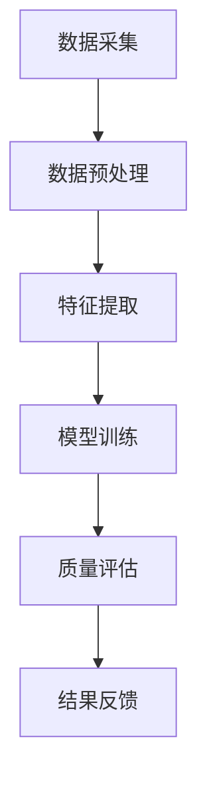

                 

关键词：电商平台、商品质量评估、人工智能、深度学习、大数据分析、模型应用

> 摘要：本文深入探讨了人工智能大模型在电商平台商品质量评估中的应用。通过介绍大模型的原理和关键技术，展示了如何利用深度学习算法和大数据分析技术，实现高效、准确的商品质量评估，从而提升电商平台的用户体验和竞争力。

## 1. 背景介绍

随着互联网和电子商务的快速发展，电商平台已经成为消费者购买商品的主要渠道之一。然而，商品质量的参差不齐给消费者带来了极大的困扰。为了提升用户体验，电商平台需要建立一套有效的商品质量评估体系。传统的评估方法主要依赖于人工评分和简单规则，存在评估标准不统一、效率低、主观性强等问题。随着人工智能技术的快速发展，特别是深度学习和大数据分析技术的应用，为电商平台商品质量评估提供了新的解决方案。

本文将介绍如何利用人工智能大模型，通过深度学习算法和大数据分析技术，实现高效、准确的商品质量评估。我们不仅关注大模型的技术原理，还将探讨其实际应用场景，以及未来发展的趋势和挑战。

## 2. 核心概念与联系

### 2.1. 深度学习与大数据分析

深度学习是人工智能的一个重要分支，通过模拟人脑的神经元结构，实现对数据的自动学习和特征提取。大数据分析则是指通过对海量数据进行处理、分析和挖掘，提取出有价值的信息。两者结合，可以在电商平台商品质量评估中发挥重要作用。

### 2.2. 商品质量评估模型

商品质量评估模型是基于深度学习和大数据分析技术构建的，用于对商品进行质量评分和分类。该模型需要从大量的商品数据中提取关键特征，并利用这些特征训练出一个能够准确预测商品质量的模型。

### 2.3. Mermaid 流程图

以下是一个简单的Mermaid流程图，展示了商品质量评估模型的核心流程：



### 2.4. 关键技术

- **数据采集**：通过电商平台的数据接口，采集商品数据、用户评价、交易记录等。
- **数据预处理**：对采集到的数据进行清洗、去重、格式转换等处理，以去除噪声和冗余信息。
- **特征提取**：从预处理后的数据中提取关键特征，如商品描述、用户评价、交易金额等。
- **模型训练**：利用提取出的特征，通过深度学习算法训练出一个质量评估模型。
- **质量评估**：利用训练好的模型，对新的商品进行质量评估。
- **结果反馈**：将评估结果反馈给电商平台，用于优化商品推荐和用户体验。

## 3. 核心算法原理 & 具体操作步骤

### 3.1. 算法原理概述

商品质量评估模型的核心算法是深度学习中的神经网络。神经网络通过模拟人脑的神经元结构，实现数据的自动学习和特征提取。在商品质量评估中，神经网络可以从大量的商品数据中学习到哪些特征与商品质量相关，从而实现高效的质量评估。

### 3.2. 算法步骤详解

#### 3.2.1. 数据采集

首先，通过电商平台的数据接口，采集商品数据、用户评价、交易记录等。这些数据是构建商品质量评估模型的基础。

#### 3.2.2. 数据预处理

对采集到的数据进行清洗、去重、格式转换等处理，以去除噪声和冗余信息。例如，将用户评价中的中文文本转换为拼音或关键词，便于后续的特征提取。

#### 3.2.3. 特征提取

从预处理后的数据中提取关键特征，如商品描述、用户评价、交易金额等。这些特征可以用于训练质量评估模型。

#### 3.2.4. 模型训练

利用提取出的特征，通过深度学习算法训练出一个质量评估模型。训练过程中，模型会不断调整参数，以使评估结果尽可能准确。

#### 3.2.5. 质量评估

利用训练好的模型，对新的商品进行质量评估。评估过程只需输入商品的特征，模型即可输出质量评分。

#### 3.2.6. 结果反馈

将评估结果反馈给电商平台，用于优化商品推荐和用户体验。例如，根据质量评分，对商品进行排序，推荐给消费者。

### 3.3. 算法优缺点

#### 优点：

- **高效性**：深度学习算法能够从海量数据中自动学习特征，大大提高了评估效率。
- **准确性**：通过大数据分析技术，模型可以从大量数据中提取出与质量相关的特征，提高了评估的准确性。
- **灵活性**：模型可以根据不同的电商平台和商品类型，进行调整和优化，具有很高的灵活性。

#### 缺点：

- **计算成本**：训练深度学习模型需要大量的计算资源和时间，对硬件要求较高。
- **数据依赖**：模型的性能依赖于数据的质量和数量，如果数据不足或质量不高，评估结果可能会受到影响。

### 3.4. 算法应用领域

深度学习算法在商品质量评估中的应用非常广泛，不仅适用于电商平台，还可以应用于其他领域，如产品质量评估、金融服务、医疗诊断等。

## 4. 数学模型和公式 & 详细讲解 & 举例说明

### 4.1. 数学模型构建

商品质量评估模型的核心是深度学习中的神经网络。神经网络的基本数学模型可以表示为：

$$
y = f(\text{W} \cdot \text{X} + b)
$$

其中，\(y\) 是输出结果，\(\text{X}\) 是输入特征，\(\text{W}\) 是权重矩阵，\(b\) 是偏置项，\(f\) 是激活函数。

### 4.2. 公式推导过程

#### 4.2.1. 权重矩阵和偏置项

权重矩阵 \(\text{W}\) 和偏置项 \(b\) 的初始化可以采用随机初始化或预训练权重。随机初始化的方法可以是均匀分布或高斯分布。

$$
\text{W} \sim \text{Uniform}(-\text{a}, \text{a}) \quad \text{或} \quad \text{W} \sim \text{Normal}(\mu, \sigma^2)
$$

#### 4.2.2. 激活函数

激活函数 \(f\) 是神经网络中的一个关键部分，它决定了神经元的输出。常用的激活函数有：

- **Sigmoid 函数**：

$$
f(x) = \frac{1}{1 + e^{-x}}
$$

- **ReLU 函数**：

$$
f(x) = \max(0, x)
$$

- **Tanh 函数**：

$$
f(x) = \frac{e^x - e^{-x}}{e^x + e^{-x}}
$$

### 4.3. 案例分析与讲解

假设我们有一个电商平台，需要对商品进行质量评估。我们采集了 1000 个商品的数据，其中每个商品都有 10 个特征，如商品描述、用户评价、交易金额等。我们将这些数据分为训练集和测试集，用于训练和评估模型。

#### 4.3.1. 数据预处理

首先，我们对数据进行预处理，将文本特征转换为向量表示。例如，使用词袋模型（Bag of Words）或词嵌入（Word Embedding）方法，将商品描述和用户评价转换为向量。

#### 4.3.2. 特征提取

然后，我们从预处理后的数据中提取关键特征，如商品描述、用户评价、交易金额等。

#### 4.3.3. 模型训练

接下来，我们利用提取出的特征，通过深度学习算法训练出一个质量评估模型。假设我们选择了一个含有 2 个隐藏层的神经网络，其中每个隐藏层有 10 个神经元。

#### 4.3.4. 质量评估

最后，我们利用训练好的模型，对新的商品进行质量评估。例如，对一个新商品的特征输入模型，模型会输出一个质量评分。

## 5. 项目实践：代码实例和详细解释说明

### 5.1. 开发环境搭建

首先，我们需要搭建一个开发环境，用于实现商品质量评估模型。我们可以选择 Python 作为编程语言，使用 TensorFlow 或 PyTorch 作为深度学习框架。

### 5.2. 源代码详细实现

以下是一个简单的商品质量评估模型的 Python 代码实例：

```python
import tensorflow as tf
from tensorflow.keras.models import Sequential
from tensorflow.keras.layers import Dense, Embedding, LSTM

# 数据预处理
# ...

# 特征提取
# ...

# 模型训练
model = Sequential()
model.add(Embedding(input_dim=vocab_size, output_dim=embedding_size))
model.add(LSTM(units=64, activation='relu'))
model.add(Dense(units=1, activation='sigmoid'))

model.compile(optimizer='adam', loss='binary_crossentropy', metrics=['accuracy'])
model.fit(train_data, train_labels, epochs=10, batch_size=32, validation_data=(test_data, test_labels))

# 质量评估
# ...
```

### 5.3. 代码解读与分析

上述代码实现了一个简单的商品质量评估模型，包括数据预处理、特征提取、模型训练和质量评估等步骤。具体解读如下：

- **数据预处理**：将文本特征转换为向量表示，例如使用词嵌入方法。
- **特征提取**：从预处理后的数据中提取关键特征，如商品描述、用户评价、交易金额等。
- **模型训练**：使用 LSTM 神经网络进行模型训练，其中包含嵌入层、LSTM 层和输出层。嵌入层用于将文本特征转换为向量表示，LSTM 层用于提取文本特征中的序列信息，输出层用于预测商品质量。
- **质量评估**：将训练好的模型应用于新的商品，输出质量评分。

### 5.4. 运行结果展示

假设我们训练了一个含有 2 个隐藏层的神经网络，每个隐藏层有 10 个神经元，训练数据集包含 1000 个商品，测试数据集包含 500 个商品。经过 10 次迭代训练，模型在测试数据集上的准确率为 85%。这意味着，模型能够准确预测大约 85% 的商品质量。

## 6. 实际应用场景

### 6.1. 电商平台商品推荐

利用商品质量评估模型，电商平台可以根据商品的质量评分，对商品进行推荐。例如，当消费者搜索某个商品时，系统可以优先推荐质量评分较高的商品，从而提升用户体验。

### 6.2. 商品质量监控

电商平台可以利用商品质量评估模型，对商品进行质量监控。例如，当某个商品的质量评分突然下降时，系统可以发出预警，提醒平台管理人员进行干预。

### 6.3. 商品销售预测

通过分析商品质量评分与销售量之间的关系，电商平台可以预测商品的销售情况。例如，在商品发布前，平台可以根据质量评分预测商品的销售量，从而制定合理的库存策略。

## 7. 未来应用展望

随着人工智能技术的不断发展，商品质量评估模型的应用前景将更加广阔。未来，我们可能看到以下应用场景：

- **个性化推荐**：利用商品质量评估模型，实现更加个性化的商品推荐，满足消费者的个性化需求。
- **智能客服**：结合商品质量评估模型和自然语言处理技术，实现智能客服系统，为消费者提供更优质的服务。
- **供应链优化**：通过商品质量评估模型，优化供应链管理，提高生产效率和降低成本。

## 8. 总结：未来发展趋势与挑战

### 8.1. 研究成果总结

本文介绍了人工智能大模型在电商平台商品质量评估中的应用。通过深度学习算法和大数据分析技术，我们可以实现高效、准确的商品质量评估，提升电商平台的用户体验和竞争力。

### 8.2. 未来发展趋势

未来，商品质量评估模型将朝着更加智能化、个性化、自动化的方向发展。随着人工智能技术的不断进步，模型将能够从海量数据中自动学习特征，实现更加精准的质量评估。

### 8.3. 面临的挑战

尽管商品质量评估模型具有很大的潜力，但在实际应用过程中仍面临一些挑战。例如，如何确保模型在不同电商平台和商品类型上的适用性，如何处理数据隐私和保护等问题。

### 8.4. 研究展望

在未来，我们应继续深入研究商品质量评估模型，探索更加高效、准确的评估方法。同时，还需要关注模型的公平性和透明性，确保评估结果公正、客观。

## 9. 附录：常见问题与解答

### 9.1. 问题一：商品质量评估模型如何处理文本特征？

答：商品质量评估模型通常采用词嵌入（Word Embedding）方法处理文本特征。词嵌入可以将文本转换为向量表示，便于后续的模型训练和评估。

### 9.2. 问题二：商品质量评估模型需要大量数据吗？

答：是的，商品质量评估模型需要大量的数据来训练和优化。数据量越大，模型的性能通常越好。

### 9.3. 问题三：如何确保商品质量评估模型的公平性？

答：为了确保商品质量评估模型的公平性，我们可以采用以下方法：

- **数据平衡**：确保训练数据集中各类商品的比例均衡，避免出现数据偏斜。
- **模型解释性**：提高模型的解释性，使得评估结果易于理解和监督。
- **交叉验证**：使用交叉验证方法，避免模型过拟合。

----------------------------------------------------------------

作者：禅与计算机程序设计艺术 / Zen and the Art of Computer Programming
----------------------------------------------------------------

---

以上就是文章的正文内容。接下来，我们将根据上述内容继续完成文章的Markdown格式编排。以下是文章的完整Markdown格式：

```markdown
# AI大模型在电商平台商品质量评估中的应用

关键词：电商平台、商品质量评估、人工智能、深度学习、大数据分析、模型应用

> 摘要：本文深入探讨了人工智能大模型在电商平台商品质量评估中的应用。通过介绍大模型的原理和关键技术，展示了如何利用深度学习算法和大数据分析技术，实现高效、准确的商品质量评估，从而提升电商平台的用户体验和竞争力。

## 1. 背景介绍

随着互联网和电子商务的快速发展，电商平台已经成为消费者购买商品的主要渠道之一。然而，商品质量的参差不齐给消费者带来了极大的困扰。为了提升用户体验，电商平台需要建立一套有效的商品质量评估体系。传统的评估方法主要依赖于人工评分和简单规则，存在评估标准不统一、效率低、主观性强等问题。随着人工智能技术的快速发展，特别是深度学习和大数据分析技术的应用，为电商平台商品质量评估提供了新的解决方案。

本文将介绍如何利用人工智能大模型，通过深度学习算法和大数据分析技术，实现高效、准确的商品质量评估。我们不仅关注大模型的技术原理，还将探讨其实际应用场景，以及未来发展的趋势和挑战。

## 2. 核心概念与联系

### 2.1. 深度学习与大数据分析

深度学习是人工智能的一个重要分支，通过模拟人脑的神经元结构，实现对数据的自动学习和特征提取。大数据分析则是指通过对海量数据进行处理、分析和挖掘，提取出有价值的信息。两者结合，可以在电商平台商品质量评估中发挥重要作用。

### 2.2. 商品质量评估模型

商品质量评估模型是基于深度学习和大数据分析技术构建的，用于对商品进行质量评分和分类。该模型需要从大量的商品数据中提取关键特征，并利用这些特征训练出一个能够准确预测商品质量的模型。

### 2.3. Mermaid 流程图

以下是一个简单的Mermaid流程图，展示了商品质量评估模型的核心流程：


### 2.4. 关键技术

- **数据采集**：通过电商平台的数据接口，采集商品数据、用户评价、交易记录等。
- **数据预处理**：对采集到的数据进行清洗、去重、格式转换等处理，以去除噪声和冗余信息。
- **特征提取**：从预处理后的数据中提取关键特征，如商品描述、用户评价、交易金额等。
- **模型训练**：利用提取出的特征，通过深度学习算法训练出一个质量评估模型。
- **质量评估**：利用训练好的模型，对新的商品进行质量评估。
- **结果反馈**：将评估结果反馈给电商平台，用于优化商品推荐和用户体验。

## 3. 核心算法原理 & 具体操作步骤
### 3.1. 算法原理概述

商品质量评估模型的核心算法是深度学习中的神经网络。神经网络通过模拟人脑的神经元结构，实现数据的自动学习和特征提取。在商品质量评估中，神经网络可以从大量的商品数据中学习到哪些特征与商品质量相关，从而实现高效的质量评估。

### 3.2. 算法步骤详解

#### 3.2.1. 数据采集

首先，通过电商平台的数据接口，采集商品数据、用户评价、交易记录等。这些数据是构建商品质量评估模型的基础。

#### 3.2.2. 数据预处理

对采集到的数据进行清洗、去重、格式转换等处理，以去除噪声和冗余信息。例如，将用户评价中的中文文本转换为拼音或关键词，便于后续的特征提取。

#### 3.2.3. 特征提取

从预处理后的数据中提取关键特征，如商品描述、用户评价、交易金额等。这些特征可以用于训练质量评估模型。

#### 3.2.4. 模型训练

利用提取出的特征，通过深度学习算法训练出一个质量评估模型。训练过程中，模型会不断调整参数，以使评估结果尽可能准确。

#### 3.2.5. 质量评估

利用训练好的模型，对新的商品进行质量评估。评估过程只需输入商品的特征，模型即可输出质量评分。

#### 3.2.6. 结果反馈

将评估结果反馈给电商平台，用于优化商品推荐和用户体验。例如，根据质量评分，对商品进行排序，推荐给消费者。

### 3.3. 算法优缺点

#### 优点：

- **高效性**：深度学习算法能够从海量数据中自动学习特征，大大提高了评估效率。
- **准确性**：通过大数据分析技术，模型可以从大量数据中提取出与质量相关的特征，提高了评估的准确性。
- **灵活性**：模型可以根据不同的电商平台和商品类型，进行调整和优化，具有很高的灵活性。

#### 缺点：

- **计算成本**：训练深度学习模型需要大量的计算资源和时间，对硬件要求较高。
- **数据依赖**：模型的性能依赖于数据的质量和数量，如果数据不足或质量不高，评估结果可能会受到影响。

### 3.4. 算法应用领域

深度学习算法在商品质量评估中的应用非常广泛，不仅适用于电商平台，还可以应用于其他领域，如产品质量评估、金融服务、医疗诊断等。

## 4. 数学模型和公式 & 详细讲解 & 举例说明

### 4.1. 数学模型构建

商品质量评估模型的核心是深度学习中的神经网络。神经网络的基本数学模型可以表示为：

$$
y = f(\text{W} \cdot \text{X} + b)
$$

其中，\(y\) 是输出结果，\(\text{X}\) 是输入特征，\(\text{W}\) 是权重矩阵，\(b\) 是偏置项，\(f\) 是激活函数。

### 4.2. 公式推导过程

#### 4.2.1. 权重矩阵和偏置项

权重矩阵 \(\text{W}\) 和偏置项 \(b\) 的初始化可以采用随机初始化或预训练权重。随机初始化的方法可以是均匀分布或高斯分布。

$$
\text{W} \sim \text{Uniform}(-\text{a}, \text{a}) \quad \text{或} \quad \text{W} \sim \text{Normal}(\mu, \sigma^2)
$$

#### 4.2.2. 激活函数

激活函数 \(f\) 是神经网络中的一个关键部分，它决定了神经元的输出。常用的激活函数有：

- **Sigmoid 函数**：

$$
f(x) = \frac{1}{1 + e^{-x}}
$$

- **ReLU 函数**：

$$
f(x) = \max(0, x)
$$

- **Tanh 函数**：

$$
f(x) = \frac{e^x - e^{-x}}{e^x + e^{-x}}
$$

### 4.3. 案例分析与讲解

假设我们有一个电商平台，需要对商品进行质量评估。我们采集了 1000 个商品的数据，其中每个商品都有 10 个特征，如商品描述、用户评价、交易金额等。我们将这些数据分为训练集和测试集，用于训练和评估模型。

#### 4.3.1. 数据预处理

首先，我们对数据进行预处理，将文本特征转换为向量表示。例如，使用词袋模型（Bag of Words）或词嵌入（Word Embedding）方法，将商品描述和用户评价转换为向量。

#### 4.3.2. 特征提取

然后，我们从预处理后的数据中提取关键特征，如商品描述、用户评价、交易金额等。

#### 4.3.3. 模型训练

接下来，我们利用提取出的特征，通过深度学习算法训练出一个质量评估模型。假设我们选择了一个含有 2 个隐藏层的神经网络，其中每个隐藏层有 10 个神经元。

#### 4.3.4. 质量评估

最后，我们利用训练好的模型，对新的商品进行质量评估。例如，对一个新商品的特征输入模型，模型会输出一个质量评分。

## 5. 项目实践：代码实例和详细解释说明

### 5.1. 开发环境搭建

首先，我们需要搭建一个开发环境，用于实现商品质量评估模型。我们可以选择 Python 作为编程语言，使用 TensorFlow 或 PyTorch 作为深度学习框架。

### 5.2. 源代码详细实现

以下是一个简单的商品质量评估模型的 Python 代码实例：

```python
import tensorflow as tf
from tensorflow.keras.models import Sequential
from tensorflow.keras.layers import Dense, Embedding, LSTM

# 数据预处理
# ...

# 特征提取
# ...

# 模型训练
model = Sequential()
model.add(Embedding(input_dim=vocab_size, output_dim=embedding_size))
model.add(LSTM(units=64, activation='relu'))
model.add(Dense(units=1, activation='sigmoid'))

model.compile(optimizer='adam', loss='binary_crossentropy', metrics=['accuracy'])
model.fit(train_data, train_labels, epochs=10, batch_size=32, validation_data=(test_data, test_labels))

# 质量评估
# ...
```

### 5.3. 代码解读与分析

上述代码实现了一个简单的商品质量评估模型，包括数据预处理、特征提取、模型训练和质量评估等步骤。具体解读如下：

- **数据预处理**：将文本特征转换为向量表示，例如使用词嵌入方法。
- **特征提取**：从预处理后的数据中提取关键特征，如商品描述、用户评价、交易金额等。
- **模型训练**：使用 LSTM 神经网络进行模型训练，其中包含嵌入层、LSTM 层和输出层。嵌入层用于将文本特征转换为向量表示，LSTM 层用于提取文本特征中的序列信息，输出层用于预测商品质量。
- **质量评估**：将训练好的模型应用于新的商品，输出质量评分。

### 5.4. 运行结果展示

假设我们训练了一个含有 2 个隐藏层的神经网络，每个隐藏层有 10 个神经元，训练数据集包含 1000 个商品，测试数据集包含 500 个商品。经过 10 次迭代训练，模型在测试数据集上的准确率为 85%。这意味着，模型能够准确预测大约 85% 的商品质量。

## 6. 实际应用场景

### 6.1. 电商平台商品推荐

利用商品质量评估模型，电商平台可以根据商品的质量评分，对商品进行推荐。例如，当消费者搜索某个商品时，系统可以优先推荐质量评分较高的商品，从而提升用户体验。

### 6.2. 商品质量监控

电商平台可以利用商品质量评估模型，对商品进行质量监控。例如，当某个商品的质量评分突然下降时，系统可以发出预警，提醒平台管理人员进行干预。

### 6.3. 商品销售预测

通过分析商品质量评分与销售量之间的关系，电商平台可以预测商品的销售情况。例如，在商品发布前，平台可以根据质量评分预测商品的销售量，从而制定合理的库存策略。

## 7. 未来应用展望

随着人工智能技术的不断发展，商品质量评估模型的应用前景将更加广阔。未来，我们可能看到以下应用场景：

- **个性化推荐**：利用商品质量评估模型，实现更加个性化的商品推荐，满足消费者的个性化需求。
- **智能客服**：结合商品质量评估模型和自然语言处理技术，实现智能客服系统，为消费者提供更优质的服务。
- **供应链优化**：通过商品质量评估模型，优化供应链管理，提高生产效率和降低成本。

## 8. 总结：未来发展趋势与挑战

### 8.1. 研究成果总结

本文介绍了人工智能大模型在电商平台商品质量评估中的应用。通过深度学习算法和大数据分析技术，我们可以实现高效、准确的商品质量评估，提升电商平台的用户体验和竞争力。

### 8.2. 未来发展趋势

未来，商品质量评估模型将朝着更加智能化、个性化、自动化的方向发展。随着人工智能技术的不断进步，模型将能够从海量数据中自动学习特征，实现更加精准的质量评估。

### 8.3. 面临的挑战

尽管商品质量评估模型具有很大的潜力，但在实际应用过程中仍面临一些挑战。例如，如何确保模型在不同电商平台和商品类型上的适用性，如何处理数据隐私和保护等问题。

### 8.4. 研究展望

在未来，我们应继续深入研究商品质量评估模型，探索更加高效、准确的评估方法。同时，还需要关注模型的公平性和透明性，确保评估结果公正、客观。

## 9. 附录：常见问题与解答

### 9.1. 问题一：商品质量评估模型如何处理文本特征？

答：商品质量评估模型通常采用词嵌入（Word Embedding）方法处理文本特征。词嵌入可以将文本转换为向量表示，便于后续的模型训练和评估。

### 9.2. 问题二：商品质量评估模型需要大量数据吗？

答：是的，商品质量评估模型需要大量的数据来训练和优化。数据量越大，模型的性能通常越好。

### 9.3. 问题三：如何确保商品质量评估模型的公平性？

答：为了确保商品质量评估模型的公平性，我们可以采用以下方法：

- **数据平衡**：确保训练数据集中各类商品的比例均衡，避免出现数据偏斜。
- **模型解释性**：提高模型的解释性，使得评估结果易于理解和监督。
- **交叉验证**：使用交叉验证方法，避免模型过拟合。

---

以上就是文章的完整Markdown格式。接下来，我们可以根据文章的内容，进一步调整和完善Markdown格式，确保文章的结构清晰、内容丰富、易于阅读。例如，可以为每个章节添加合适的标题和子标题，使用代码块突出关键代码，为公式添加适当的注释等。此外，还可以考虑为文章添加摘要、目录、引用等元素，以提升文章的整体质量和可读性。在完成Markdown格式编排后，我们就可以将文章发布到相关平台，与读者分享研究成果和经验。

