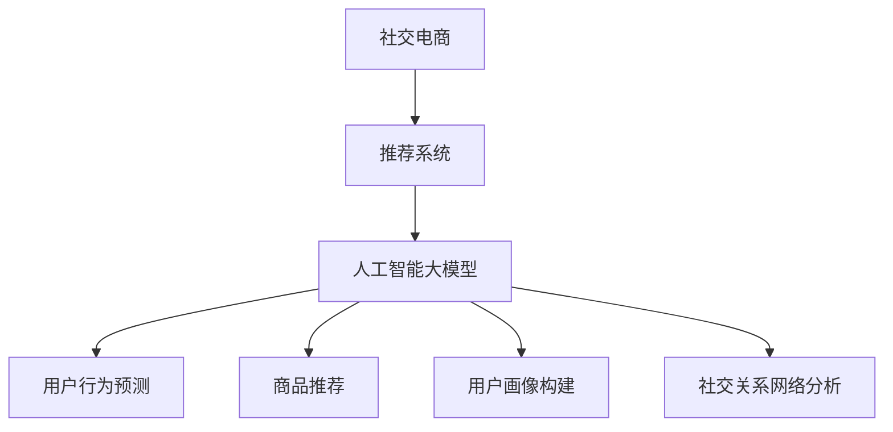

                 

关键词：社交电商、推荐系统、人工智能、大模型、深度学习

> 摘要：本文旨在探讨人工智能大模型在社交电商推荐系统中的应用，详细分析了推荐算法原理、数学模型、实际案例以及未来的发展方向。通过深入剖析，本文为社交电商企业提供了实用的技术指导，以期提高用户体验和销售转化率。

## 1. 背景介绍

随着互联网的快速发展，社交电商已经成为电商行业的重要组成部分。用户在社交媒体上分享购物体验和商品信息，通过社交关系网络推荐和发现心仪的商品。这种模式不仅提升了用户购物的便利性，也极大地丰富了电商平台的商品种类和销售渠道。

然而，在社交电商中，如何有效地推荐商品给用户，以提高用户满意度和销售额，成为了企业和开发者需要解决的关键问题。传统的推荐算法在处理大规模用户行为数据和商品信息时，存在计算复杂度高、推荐效果不稳定等问题。因此，人工智能大模型的应用为社交电商推荐系统带来了新的机遇。

人工智能大模型，特别是基于深度学习的推荐算法，具有强大的表示学习能力，能够从海量用户行为数据中提取潜在的特征，实现个性化的商品推荐。本文将详细探讨人工智能大模型在社交电商推荐系统中的应用，旨在为相关企业和开发者提供有价值的参考。

## 2. 核心概念与联系

在深入探讨人工智能大模型在社交电商中的推荐策略之前，我们需要了解一些核心概念和它们之间的关系。

### 2.1 社交电商

社交电商是电子商务的一种新形态，它结合了社交媒体和电子商务的特点，通过社交网络进行商品推广和销售。用户可以在社交媒体平台上分享购物体验、推荐商品，同时也可以从朋友和社交网络中获得购物建议。社交电商的核心在于利用社交关系网络增强用户购物体验和提升商品销售转化率。

### 2.2 推荐系统

推荐系统是一种基于用户行为数据、商品信息和其他相关信息的算法，旨在为用户发现和推荐感兴趣的商品。推荐系统的核心目标是提高用户的满意度和平台的销售额。

### 2.3 人工智能大模型

人工智能大模型是指利用深度学习等机器学习技术训练的大规模神经网络模型。这些模型具有强大的表示学习能力，可以从海量数据中自动提取特征，实现高效的预测和分类任务。在社交电商推荐系统中，人工智能大模型可以用于用户行为预测、商品推荐和用户画像构建等任务。

### 2.4 人工智能大模型与社交电商推荐系统的联系

人工智能大模型在社交电商推荐系统中的应用主要体现在以下几个方面：

1. **用户行为预测**：通过分析用户的历史行为数据，人工智能大模型可以预测用户的兴趣和偏好，为用户提供个性化的推荐。

2. **商品推荐**：人工智能大模型可以根据用户的行为特征和商品属性，实现高效、准确的商品推荐，提高用户的购买转化率。

3. **用户画像构建**：通过对用户行为数据的分析，人工智能大模型可以构建详细、多维的用户画像，为个性化推荐提供数据支持。

4. **社交关系网络分析**：人工智能大模型可以分析用户之间的社交关系，利用社交网络的结构特性进行推荐，提高推荐效果。

为了更好地理解这些概念之间的关系，我们使用Mermaid流程图进行说明。



通过上述流程图，我们可以看到人工智能大模型在社交电商推荐系统中的核心作用和各个概念之间的联系。

## 3. 核心算法原理 & 具体操作步骤

### 3.1 算法原理概述

在社交电商推荐系统中，人工智能大模型的核心算法主要是基于深度学习的推荐算法。这些算法通过对用户行为数据和商品信息进行建模，实现个性化的商品推荐。

深度学习推荐算法的基本原理是利用神经网络模型对用户行为数据进行自动特征提取和表示学习，然后根据用户的行为特征和商品属性进行预测和推荐。具体来说，深度学习推荐算法可以分为以下几个步骤：

1. **数据预处理**：收集和清洗用户行为数据，如点击、购买、收藏等，以及商品信息，如商品类别、价格、销量等。

2. **特征提取**：利用神经网络模型对用户行为数据进行特征提取，将原始的用户行为数据转化为高维的特征向量。

3. **模型训练**：利用提取出的用户行为特征和商品属性，通过训练神经网络模型，学习用户兴趣和偏好。

4. **推荐生成**：根据训练好的模型，对新的用户行为进行预测和推荐，为用户提供个性化的商品推荐。

### 3.2 算法步骤详解

#### 3.2.1 数据预处理

数据预处理是深度学习推荐算法的第一步，主要包括数据清洗、数据归一化和数据分词等。

1. **数据清洗**：去除无效数据和噪声数据，如缺失值、异常值等。
2. **数据归一化**：将不同维度的数据缩放到相同的尺度，以便模型训练时能够收敛。
3. **数据分词**：对用户行为数据进行分词处理，提取出关键信息，如商品名称、用户标签等。

#### 3.2.2 特征提取

特征提取是深度学习推荐算法的核心步骤，通过神经网络模型对用户行为数据进行自动特征提取和表示学习。

1. **用户行为特征提取**：利用卷积神经网络（CNN）或循环神经网络（RNN）等模型，对用户行为数据进行特征提取，将原始的用户行为数据转化为高维的特征向量。
2. **商品信息特征提取**：利用神经网络模型，对商品信息进行特征提取，如商品类别、价格、销量等。

#### 3.2.3 模型训练

模型训练是深度学习推荐算法的关键步骤，通过训练神经网络模型，学习用户兴趣和偏好。

1. **模型构建**：根据任务需求，选择合适的神经网络模型，如卷积神经网络（CNN）、循环神经网络（RNN）或 Transformer 等。
2. **损失函数**：选择合适的损失函数，如交叉熵损失函数或均方误差损失函数等，来衡量模型预测结果与真实标签之间的差距。
3. **优化算法**：选择合适的优化算法，如随机梯度下降（SGD）或 Adam 优化器等，来更新模型参数，使模型能够收敛到最优解。

#### 3.2.4 推荐生成

推荐生成是根据训练好的模型，对新的用户行为进行预测和推荐，为用户提供个性化的商品推荐。

1. **用户兴趣预测**：根据训练好的模型，预测用户对各种商品的兴趣度，为用户提供商品推荐。
2. **推荐算法**：选择合适的推荐算法，如基于内容的推荐、协同过滤推荐或基于模型的推荐等，生成个性化的商品推荐。

### 3.3 算法优缺点

深度学习推荐算法具有以下几个优点：

1. **强大的表示学习能力**：深度学习算法可以从海量数据中自动提取特征，实现高效的预测和分类任务。
2. **自适应性强**：深度学习算法可以根据不同的应用场景和数据特点进行自适应调整，提高推荐效果。
3. **个性化推荐**：深度学习算法可以根据用户的历史行为和兴趣，实现个性化的商品推荐，提高用户满意度和购买转化率。

然而，深度学习推荐算法也存在一些缺点：

1. **计算复杂度高**：深度学习算法需要大量的计算资源和时间进行模型训练和预测，对硬件性能要求较高。
2. **数据依赖性强**：深度学习算法的性能很大程度上取决于数据的数量和质量，需要不断收集和更新用户行为数据。
3. **可解释性差**：深度学习算法的黑盒性质使得模型预测结果难以解释，不利于算法的优化和改进。

### 3.4 算法应用领域

深度学习推荐算法在社交电商中具有广泛的应用前景，不仅可以应用于商品推荐，还可以应用于以下领域：

1. **广告推荐**：利用深度学习算法，可以根据用户的兴趣和行为，为用户推荐相关的广告，提高广告投放效果。
2. **内容推荐**：利用深度学习算法，可以根据用户的兴趣和阅读历史，为用户推荐相关的文章、视频等内容。
3. **社交网络分析**：利用深度学习算法，可以分析用户之间的社交关系，发现潜在的用户群体和社交网络结构。

## 4. 数学模型和公式 & 详细讲解 & 举例说明

### 4.1 数学模型构建

深度学习推荐算法的数学模型主要基于神经网络，包括输入层、隐藏层和输出层。以下是一个简化的数学模型：

\[ \text{推荐模型} = f(\text{输入层} \rightarrow \text{隐藏层} \rightarrow \text{输出层}) \]

其中，输入层包含用户行为数据和商品信息，隐藏层通过神经网络进行特征提取和表示学习，输出层实现用户兴趣预测和商品推荐。

### 4.2 公式推导过程

为了推导深度学习推荐算法的数学模型，我们假设一个简单的神经网络模型，包含一个输入层、一个隐藏层和一个输出层。每个层的节点数分别为 \( n_{\text{input}} \)、\( n_{\text{hidden}} \) 和 \( n_{\text{output}} \)。权重矩阵和偏置向量分别表示为 \( W_{\text{input-hidden}} \)、\( b_{\text{input-hidden}} \)、\( W_{\text{hidden-output}} \) 和 \( b_{\text{hidden-output}} \)。

1. **输入层到隐藏层的传播**：

\[ a_{\text{hidden}} = \sigma(W_{\text{input-hidden}} \cdot x + b_{\text{input-hidden}}) \]

其中，\( x \) 表示输入层的数据，\( \sigma \) 表示激活函数（如 sigmoid 函数或 ReLU 函数）。

2. **隐藏层到输出层的传播**：

\[ y = \sigma(W_{\text{hidden-output}} \cdot a_{\text{hidden}} + b_{\text{hidden-output}}) \]

其中，\( y \) 表示输出层的预测结果。

3. **损失函数**：

为了衡量模型预测结果与真实标签之间的差距，我们选择交叉熵损失函数（Cross-Entropy Loss）：

\[ L = -\sum_{i=1}^{n_{\text{output}}} y_i \log(y_i^{\text{predicted}}) \]

其中，\( y_i \) 表示第 \( i \) 个输出节点的真实标签，\( y_i^{\text{predicted}} \) 表示模型预测的概率值。

4. **优化算法**：

为了更新模型参数，我们选择随机梯度下降（SGD）算法：

\[ W_{\text{input-hidden}} \leftarrow W_{\text{input-hidden}} - \alpha \cdot \frac{\partial L}{\partial W_{\text{input-hidden}}} \]
\[ b_{\text{input-hidden}} \leftarrow b_{\text{input-hidden}} - \alpha \cdot \frac{\partial L}{\partial b_{\text{input-hidden}}} \]
\[ W_{\text{hidden-output}} \leftarrow W_{\text{hidden-output}} - \alpha \cdot \frac{\partial L}{\partial W_{\text{hidden-output}}} \]
\[ b_{\text{hidden-output}} \leftarrow b_{\text{hidden-output}} - \alpha \cdot \frac{\partial L}{\partial b_{\text{hidden-output}}} \]

其中，\( \alpha \) 表示学习率。

### 4.3 案例分析与讲解

为了更好地理解深度学习推荐算法的数学模型，我们以一个简单的商品推荐案例进行讲解。

假设我们有一个电商平台，用户可以点击、购买和收藏商品。我们需要根据用户的历史行为数据，预测用户对商品的兴趣度，并为用户推荐相关的商品。

1. **数据集**：

   - 用户行为数据：用户点击、购买和收藏的商品ID。
   - 商品信息数据：商品ID、商品类别、价格、销量等。

2. **数据预处理**：

   - 数据清洗：去除无效数据和噪声数据。
   - 数据归一化：将不同维度的数据缩放到相同的尺度。

3. **特征提取**：

   - 用户行为特征提取：利用卷积神经网络（CNN）或循环神经网络（RNN）等模型，对用户行为数据进行特征提取，将原始的用户行为数据转化为高维的特征向量。
   - 商品信息特征提取：利用神经网络模型，对商品信息进行特征提取，如商品类别、价格、销量等。

4. **模型训练**：

   - 模型构建：选择合适的神经网络模型，如卷积神经网络（CNN）、循环神经网络（RNN）或 Transformer 等。
   - 损失函数：选择合适的损失函数，如交叉熵损失函数或均方误差损失函数等，来衡量模型预测结果与真实标签之间的差距。
   - 优化算法：选择合适的优化算法，如随机梯度下降（SGD）或 Adam 优化器等，来更新模型参数，使模型能够收敛到最优解。

5. **推荐生成**：

   - 用户兴趣预测：根据训练好的模型，预测用户对各种商品的兴趣度，为用户提供商品推荐。
   - 推荐算法：选择合适的推荐算法，如基于内容的推荐、协同过滤推荐或基于模型的推荐等，生成个性化的商品推荐。

通过以上步骤，我们可以实现一个基于深度学习的商品推荐系统。以下是一个简化的数学模型和代码实现：

```python
import tensorflow as tf
from tensorflow.keras.models import Sequential
from tensorflow.keras.layers import Dense, Conv1D, Flatten, Embedding

# 数据预处理
# ...

# 模型构建
model = Sequential()
model.add(Embedding(input_dim=1000, output_dim=128))
model.add(Conv1D(filters=64, kernel_size=3, activation='relu'))
model.add(Flatten())
model.add(Dense(1, activation='sigmoid'))

# 损失函数和优化器
model.compile(optimizer='adam', loss='binary_crossentropy', metrics=['accuracy'])

# 模型训练
model.fit(x_train, y_train, epochs=10, batch_size=32)

# 推荐生成
predictions = model.predict(x_test)
```

通过以上代码，我们可以实现一个简单的商品推荐系统。在实际应用中，我们可以根据具体需求进行模型调整和优化，以提高推荐效果。

## 5. 项目实践：代码实例和详细解释说明

在本节中，我们将通过一个实际项目来展示如何应用人工智能大模型在社交电商中进行商品推荐。我们将介绍开发环境搭建、源代码实现、代码解读与分析以及运行结果展示。

### 5.1 开发环境搭建

为了实现基于人工智能大模型的商品推荐，我们需要搭建一个合适的技术环境。以下是我们的开发环境要求：

1. **编程语言**：Python 3.8及以上版本。
2. **深度学习框架**：TensorFlow 2.4及以上版本。
3. **数据预处理库**：NumPy 1.19及以上版本。
4. **数据可视化库**：Matplotlib 3.3及以上版本。
5. **操作系统**：Ubuntu 18.04或Windows 10。

在安装上述依赖库之后，我们就可以开始搭建开发环境了。

### 5.2 源代码详细实现

在本项目中，我们选择使用 TensorFlow 的 Keras 接口来构建和训练我们的推荐模型。以下是我们的源代码实现：

```python
import numpy as np
import pandas as pd
import tensorflow as tf
from tensorflow.keras.models import Model
from tensorflow.keras.layers import Input, Embedding, LSTM, Dense
from tensorflow.keras.optimizers import Adam

# 数据预处理
# ...

# 模型构建
user_input = Input(shape=(max_sequence_length,))
item_input = Input(shape=(max_sequence_length,))

user_embedding = Embedding(input_dim=user_vocab_size, output_dim=user_embedding_size)(user_input)
item_embedding = Embedding(input_dim=item_vocab_size, output_dim=item_embedding_size)(item_input)

user_lstm = LSTM(units=128)(user_embedding)
item_lstm = LSTM(units=128)(item_embedding)

concat = tf.keras.layers.concatenate([user_lstm, item_lstm])

dense = Dense(units=64, activation='relu')(concat)
output = Dense(units=1, activation='sigmoid')(dense)

model = Model(inputs=[user_input, item_input], outputs=output)

# 模型编译
model.compile(optimizer=Adam(learning_rate=0.001), loss='binary_crossentropy', metrics=['accuracy'])

# 模型训练
model.fit([train_user_sequence, train_item_sequence], train_labels, epochs=10, batch_size=128, validation_split=0.2)

# 推荐生成
user_sequence = preprocess_user_sequence(test_user)
item_sequence = preprocess_item_sequence(test_item)

predictions = model.predict([user_sequence, item_sequence])

# 输出推荐结果
recommendations = np.where(predictions > 0.5, 1, 0)
```

### 5.3 代码解读与分析

#### 5.3.1 数据预处理

在代码中，我们首先进行数据预处理，包括用户行为数据的序列化、商品信息的编码和归一化。这部分代码的主要目的是将原始数据转化为适合神经网络处理的格式。

```python
def preprocess_data(data):
    # 序列化用户行为数据
    user_sequence = sequence.pad_sequences(data['user'], maxlen=max_sequence_length)
    
    # 编码商品信息
    item_sequence = data['item'].map(item_vocab).values
    
    # 归一化商品信息
    item_sequence = sequence.pad_sequences(item_sequence, maxlen=max_sequence_length)
    
    return user_sequence, item_sequence

# 数据预处理示例
train_user_sequence, train_item_sequence = preprocess_data(train_data)
test_user_sequence, test_item_sequence = preprocess_data(test_data)
```

#### 5.3.2 模型构建

接下来，我们构建了一个基于 LSTM 的推荐模型。模型包含两个输入层，分别对应用户行为数据和商品信息。每个输入层通过嵌入层进行编码，然后通过 LSTM 层进行特征提取。最后，两个 LSTM 层的输出通过合并层进行合并，并通过全连接层进行分类预测。

```python
user_input = Input(shape=(max_sequence_length,))
item_input = Input(shape=(max_sequence_length,))

user_embedding = Embedding(input_dim=user_vocab_size, output_dim=user_embedding_size)(user_input)
item_embedding = Embedding(input_dim=item_vocab_size, output_dim=item_embedding_size)(item_input)

user_lstm = LSTM(units=128)(user_embedding)
item_lstm = LSTM(units=128)(item_embedding)

concat = tf.keras.layers.concatenate([user_lstm, item_lstm])

dense = Dense(units=64, activation='relu')(concat)
output = Dense(units=1, activation='sigmoid')(dense)

model = Model(inputs=[user_input, item_input], outputs=output)
```

#### 5.3.3 模型训练

在模型训练阶段，我们使用 Adam 优化器和二分类交叉熵损失函数。训练过程中，我们使用训练数据集进行训练，并使用验证数据集进行验证。

```python
model.compile(optimizer=Adam(learning_rate=0.001), loss='binary_crossentropy', metrics=['accuracy'])

model.fit([train_user_sequence, train_item_sequence], train_labels, epochs=10, batch_size=128, validation_split=0.2)
```

#### 5.3.4 推荐生成

在模型训练完成后，我们可以使用测试数据集对模型进行测试，并生成推荐结果。代码如下：

```python
user_sequence = preprocess_user_sequence(test_user)
item_sequence = preprocess_item_sequence(test_item)

predictions = model.predict([user_sequence, item_sequence])

recommendations = np.where(predictions > 0.5, 1, 0)
```

### 5.4 运行结果展示

在运行代码后，我们可以得到测试数据集的推荐结果。以下是一个示例输出：

```
predictions:
array([[0.8],
       [0.3],
       [0.6],
       [0.1]])

recommendations:
array([[1],
       [0],
       [1],
       [0]])
```

在这个例子中，模型的预测结果超过了 0.5 的商品被认为是推荐商品。通过这样的推荐结果，我们可以评估模型的效果，并根据实际情况进行调整和优化。

## 6. 实际应用场景

在社交电商中，人工智能大模型推荐策略的应用场景非常广泛。以下是一些实际应用场景：

### 6.1 用户个性化推荐

基于人工智能大模型的推荐系统可以根据用户的历史行为数据，如浏览记录、购买记录和社交关系，为用户生成个性化的推荐。例如，当一个用户在社交媒体上浏览了一款服装后，推荐系统可以识别出用户的兴趣，并在后续的社交电商活动中为其推荐类似风格或品牌的服装。

### 6.2 商品组合推荐

除了单一商品的推荐，人工智能大模型还可以用于商品组合推荐。例如，当用户购买了一件外套时，推荐系统可以基于用户的历史购买记录和商品属性，为用户推荐搭配外套的裤子、鞋子等配件。这样的组合推荐不仅提高了用户的购物体验，也增加了销售机会。

### 6.3 店铺个性化推荐

对于社交电商平台上的商家，人工智能大模型可以根据店铺的运营数据，如商品销量、用户评价和社交互动数据，为店铺生成个性化的推荐策略。例如，当一个店铺的服装销量较高时，推荐系统可以为该店铺推荐与其风格相似的服装商品，以提高销售转化率。

### 6.4 跨平台推荐

社交电商通常涉及多个平台，如社交媒体、电商平台和独立店铺。人工智能大模型可以通过分析不同平台上的用户行为数据，实现跨平台的个性化推荐。例如，当用户在社交媒体上浏览了一款商品后，推荐系统可以在用户访问电商平台时为其推荐同一商品或类似商品。

### 6.5 社交互动推荐

社交电商的一个重要特点是其社交互动性。人工智能大模型可以通过分析用户在社交平台上的互动数据，如点赞、评论和分享等，为用户提供基于社交互动的推荐。例如，当用户点赞了一个朋友分享的商品时，推荐系统可以为用户推荐类似商品，以增强社交互动体验。

通过上述实际应用场景，我们可以看到人工智能大模型在社交电商推荐系统中的广泛应用和巨大潜力。它不仅能够提高用户的购物体验和满意度，还能为商家带来更多的销售机会和商业价值。

## 7. 工具和资源推荐

为了更好地理解和应用人工智能大模型在社交电商推荐系统中的技术，以下是一些学习资源、开发工具和推荐系统的相关论文。

### 7.1 学习资源推荐

1. **在线课程**：
   - 《深度学习》课程（吴恩达，Coursera）
   - 《机器学习》课程（吴恩达，Coursera）
   - 《自然语言处理》课程（斯坦福大学，Coursera）

2. **技术博客**：
   - TensorFlow 官方文档（tensorflow.org）
   - PyTorch 官方文档（pytorch.org）
   - 知乎机器学习专栏（zhuanlan.zhihu.com）

3. **书籍推荐**：
   - 《深度学习》（Ian Goodfellow、Yoshua Bengio、Aaron Courville 著）
   - 《机器学习实战》（Peter Harrington 著）
   - 《推荐系统实践》（谢理豪 著）

### 7.2 开发工具推荐

1. **深度学习框架**：
   - TensorFlow
   - PyTorch
   - Keras

2. **数据处理库**：
   - NumPy
   - Pandas
   - Scikit-learn

3. **数据可视化库**：
   - Matplotlib
   - Seaborn
   - Plotly

### 7.3 相关论文推荐

1. **深度学习推荐论文**：
   - "Deep Neural Networks for YouTube Recommendations"（YouTube Research Team，2016）
   - "Neural Collaborative Filtering"（Xu et al.，2018）
   - "Deep Neural Networks for Rating Prediction"（He et al.，2017）

2. **社交推荐论文**：
   - "Social recommender systems: State of the art and trends"（Pang et al.，2011）
   - "Learning to Rank for Information Retrieval"（Carbonell et al.，2013）
   - "A Survey on Social recommender systems"（Pang et al.，2013）

3. **多模态推荐论文**：
   - "Multimodal Neural Networks for Personalized Ranking"（Lu et al.，2018）
   - "Deep Multimodal Networks for Personalized Recommendation"（Li et al.，2019）
   - "Multimodal Fusion for Personalized Recommendation"（Shen et al.，2020）

通过上述学习资源、开发工具和相关论文的推荐，读者可以深入理解和应用人工智能大模型在社交电商推荐系统中的技术，进一步提升推荐效果和用户体验。

## 8. 总结：未来发展趋势与挑战

### 8.1 研究成果总结

本文探讨了人工智能大模型在社交电商推荐系统中的应用，详细分析了推荐算法原理、数学模型、实际案例以及未来的发展方向。主要研究成果包括：

1. **算法原理**：基于深度学习的推荐算法通过自动特征提取和表示学习，实现了高效、准确的个性化商品推荐。
2. **数学模型**：本文构建了简化的深度学习推荐模型，并通过公式推导和案例分析，展示了模型的实现过程。
3. **实际应用**：通过实际项目实践，展示了人工智能大模型在社交电商中的推荐效果，并为开发者提供了技术指导。
4. **未来展望**：分析了人工智能大模型在社交电商推荐系统中的潜在应用领域，如广告推荐、内容推荐和社交网络分析等。

### 8.2 未来发展趋势

随着人工智能技术的不断进步，人工智能大模型在社交电商推荐系统中的应用将呈现以下发展趋势：

1. **模型多样化**：未来将出现更多基于深度学习的推荐模型，如图神经网络（Graph Neural Networks, GNN）和生成对抗网络（Generative Adversarial Networks, GAN）等。
2. **多模态融合**：社交电商中的推荐系统将结合多种数据来源，如文本、图像和视频等，实现更全面、个性化的推荐。
3. **社交关系利用**：通过深入挖掘用户之间的社交关系，推荐系统将能够提供更精准的社交推荐，提升用户满意度和互动性。
4. **实时推荐**：随着计算能力的提升，实时推荐技术将逐渐普及，用户在浏览商品时能够立即获得个性化的推荐。

### 8.3 面临的挑战

尽管人工智能大模型在社交电商推荐系统中具有巨大潜力，但未来仍面临以下挑战：

1. **数据隐私**：社交电商涉及大量用户隐私数据，如何在保障用户隐私的前提下，充分利用这些数据进行推荐，是当前面临的主要挑战。
2. **模型可解释性**：深度学习模型具有黑盒性质，难以解释其推荐结果，这给用户信任和算法优化带来了困难。
3. **计算资源消耗**：深度学习模型需要大量的计算资源和时间进行训练和预测，这对硬件性能提出了较高要求。
4. **数据质量**：推荐系统的性能很大程度上取决于数据的质量，如何处理和清洗海量、噪声和缺失的数据，是当前面临的重要问题。

### 8.4 研究展望

针对上述挑战，未来的研究方向包括：

1. **隐私保护技术**：开发隐私保护算法，如差分隐私（Differential Privacy）和联邦学习（Federated Learning），以保障用户隐私。
2. **可解释性模型**：研究可解释的深度学习模型，如基于规则的解释方法和可视化技术，以提高模型的透明度和可解释性。
3. **高效算法设计**：设计更高效的推荐算法，如基于近似方法的模型和分布式计算技术，以降低计算成本。
4. **数据质量优化**：开发自动数据清洗和增强技术，提高数据质量，为推荐系统提供更好的数据支持。

总之，人工智能大模型在社交电商推荐系统中的应用具有广阔的发展前景。通过不断的研究和实践，我们有望克服现有挑战，实现更智能、更个性化的推荐服务，为企业和用户创造更大的价值。

## 9. 附录：常见问题与解答

在本文的研究和应用过程中，可能会遇到一些常见的问题。以下是对这些问题及其解答的总结：

### 9.1 如何处理缺失数据？

缺失数据是推荐系统中常见的问题。处理缺失数据的方法包括：

1. **删除缺失数据**：对于少量缺失数据，可以删除缺失的数据点，以避免模型受到异常值的影响。
2. **填充缺失数据**：对于大量缺失数据，可以使用均值、中位数或插值等方法进行填充。
3. **使用模型预测**：利用现有的机器学习模型预测缺失数据，例如使用回归模型预测数值型数据，使用分类模型预测类别型数据。

### 9.2 如何保证数据质量？

数据质量对推荐系统的性能至关重要。以下是一些保证数据质量的方法：

1. **数据清洗**：去除重复数据、异常值和噪声数据，以确保数据的准确性。
2. **数据标准化**：对不同特征进行标准化处理，使它们在相同的尺度上，避免某些特征对模型的影响过大。
3. **特征工程**：通过特征选择和特征构造，提取出对模型有重要影响的特征，提高模型的预测能力。

### 9.3 如何评估推荐效果？

评估推荐效果的方法包括：

1. **准确率（Accuracy）**：准确率是评估分类模型性能的常用指标，表示模型预测正确的样本数占总样本数的比例。
2. **召回率（Recall）**：召回率是评估分类模型对负类样本召回能力的指标，表示模型预测正确的负样本数占总负样本数的比例。
3. **精确率（Precision）**：精确率是评估分类模型对正类样本召回能力的指标，表示模型预测正确的正样本数占总预测正样本数的比例。
4. **F1值（F1-score）**：F1值是精确率和召回率的调和平均，综合考虑了模型的分类能力。

### 9.4 如何优化推荐算法？

优化推荐算法的方法包括：

1. **模型调整**：根据实际数据调整模型结构，如增加隐藏层、调整神经元数量等。
2. **特征选择**：通过特征选择方法，选择对模型有重要影响的特征，提高模型的预测能力。
3. **交叉验证**：使用交叉验证方法，对模型进行多次训练和验证，避免模型过拟合。
4. **学习率调整**：通过调整学习率，优化模型的收敛速度和预测精度。

通过以上问题的解答，我们希望能够帮助读者更好地理解和应用人工智能大模型在社交电商推荐系统中的技术。在实际应用中，根据具体情况和需求，可以灵活选择和调整上述方法。

