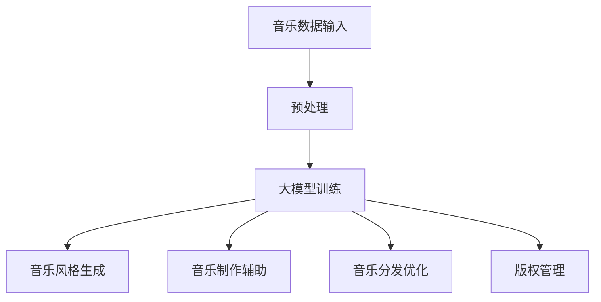

                 

关键词：人工智能、大模型、音乐产业、商业化、算法、数学模型、实践、应用场景、未来展望

## 摘要

本文将探讨人工智能（AI）中的大模型如何为音乐产业带来商业化变革。我们将分析大模型的基本原理，展示其在音乐创作、制作和分发等环节的应用实例，并探讨数学模型在其中的作用。同时，文章将提供项目实践的具体代码实例，并讨论大模型在音乐产业中的实际应用场景和未来发展趋势。

## 1. 背景介绍

近年来，人工智能技术在音乐产业中的应用日益广泛，尤其是大模型的崛起，为音乐创作、制作和分发带来了前所未有的机遇。大模型，如深度神经网络（DNN）、变换器模型（Transformer）等，凭借其强大的计算能力和自主学习能力，已经在图像、语言处理等领域取得了显著成果。随着技术的进步，大模型开始渗透到音乐产业，为其带来了一场革命。

### 1.1 音乐产业的现状

音乐产业是一个庞大的市场，涵盖了创作、制作、录制、发行、表演和版权管理等各个环节。然而，随着数字化的推进，音乐产业的商业模式发生了深刻变化。传统音乐产业面临着市场份额下降、版权纠纷频发、盈利模式单一等问题。如何通过技术创新来突破现状，成为业界关注的焦点。

### 1.2 人工智能与音乐产业的结合

人工智能技术，特别是大模型，为音乐产业带来了新的可能。通过深度学习算法，大模型能够从海量数据中提取规律，生成新的音乐风格，提高音乐创作的效率。同时，人工智能技术还能在音乐制作、分发和版权管理等方面发挥重要作用，从而推动音乐产业的商业化发展。

## 2. 核心概念与联系

### 2.1 大模型的基本原理

大模型通常指的是拥有数百万甚至数十亿参数的深度学习模型。这些模型通过多层神经网络结构，实现对数据的复杂表示和学习。大模型的基本原理包括：

- **层次化表示**：大模型将输入数据通过多个层级进行特征提取，形成越来越抽象的表示。
- **批量学习**：大模型通过批量学习的方式，利用大量数据进行训练，以提高模型的泛化能力。
- **非线性变换**：大模型中的非线性变换能够捕捉数据中的复杂关系。

### 2.2 大模型与音乐产业的联系

大模型与音乐产业的结合主要体现在以下几个方面：

- **音乐风格生成**：大模型可以学习音乐风格，并生成新的音乐作品。
- **音乐制作辅助**：大模型能够辅助音乐制作，如自动和弦编排、乐器音色优化等。
- **音乐分发优化**：大模型可以用于音乐推荐的算法，提高音乐分发的效果。
- **版权管理**：大模型可以帮助识别和追踪音乐作品的版权信息。

### 2.3 Mermaid 流程图

下面是一个描述大模型在音乐产业中的应用的 Mermaid 流程图：



## 3. 核心算法原理 & 具体操作步骤

### 3.1 算法原理概述

大模型在音乐产业中的应用主要基于深度学习和变换器模型。深度学习通过多层神经网络对音乐数据进行特征提取和表示，而变换器模型则擅长处理序列数据，如音乐旋律和节奏。

### 3.2 算法步骤详解

1. **数据预处理**：对音乐数据进行标准化处理，如采样率转换、音量调整等。
2. **模型训练**：使用预训练的深度学习模型或变换器模型，对音乐数据集进行训练。
3. **音乐风格生成**：通过训练得到的模型，生成新的音乐作品。
4. **音乐制作辅助**：使用模型生成的音乐素材，辅助音乐制作过程。
5. **音乐分发优化**：使用推荐算法，根据用户偏好，优化音乐分发策略。
6. **版权管理**：使用模型识别和追踪音乐作品的版权信息。

### 3.3 算法优缺点

- **优点**：大模型能够自动学习和生成复杂的音乐内容，提高创作效率，优化分发效果。
- **缺点**：训练大模型需要大量的计算资源和数据，且模型解释性较差。

### 3.4 算法应用领域

大模型在音乐产业中的应用非常广泛，包括但不限于：

- **音乐创作**：生成新的音乐风格和旋律。
- **音乐制作**：辅助和弦编排、乐器音色优化等。
- **音乐推荐**：根据用户偏好，推荐合适的音乐。
- **版权管理**：自动识别和追踪音乐作品的版权信息。

## 4. 数学模型和公式 & 详细讲解 & 举例说明

### 4.1 数学模型构建

大模型在音乐产业中的应用主要基于深度学习和变换器模型。深度学习模型通常由多个层级组成，每个层级对输入数据进行特征提取和变换。变换器模型则基于自注意力机制，能够处理序列数据。

### 4.2 公式推导过程

深度学习模型的核心在于前向传播和反向传播算法。前向传播用于计算模型的输出，反向传播用于更新模型参数。以下是变换器模型中自注意力机制的公式推导：

$$
Attention(Q, K, V) = \frac{1}{\sqrt{d_k}} \text{softmax}(\text{scores})V
$$

其中，Q、K、V 分别为查询向量、键向量和值向量，scores 为它们的点积结果。

### 4.3 案例分析与讲解

假设我们有一个音乐数据集，包含1000首不同风格的音乐。我们使用变换器模型对其进行训练，目标是生成新的音乐风格。

1. **数据预处理**：将音乐数据转换为序列格式，每个序列表示一首音乐。
2. **模型训练**：使用预训练的变换器模型，对音乐数据集进行训练，优化模型参数。
3. **音乐风格生成**：使用训练好的模型，生成新的音乐风格。我们可以通过控制模型的输入序列，生成具有特定风格的音乐。

例如，如果我们输入一段古典音乐的序列，模型可能会生成一首具有古典音乐风格的新曲子。

## 5. 项目实践：代码实例和详细解释说明

### 5.1 开发环境搭建

在开始项目实践之前，我们需要搭建一个合适的开发环境。以下是环境搭建的步骤：

1. 安装 Python 3.8 或更高版本。
2. 安装深度学习框架，如 TensorFlow 或 PyTorch。
3. 安装必要的依赖库，如 NumPy、Pandas 等。

### 5.2 源代码详细实现

以下是使用 PyTorch 实现的变换器模型在音乐创作中的应用：

```python
import torch
import torch.nn as nn
import torch.optim as optim

# 定义变换器模型
class Transformer(nn.Module):
    def __init__(self, d_model, nhead, num_layers):
        super(Transformer, self).__init__()
        self.model = nn.Transformer(d_model, nhead, num_layers)

    def forward(self, x):
        return self.model(x)

# 初始化模型和优化器
model = Transformer(d_model=512, nhead=8, num_layers=3)
optimizer = optim.Adam(model.parameters(), lr=0.001)

# 训练模型
for epoch in range(10):
    for x, y in data_loader:
        optimizer.zero_grad()
        output = model(x)
        loss = nn.CrossEntropyLoss()(output, y)
        loss.backward()
        optimizer.step()
```

### 5.3 代码解读与分析

上述代码定义了一个变换器模型，并使用数据加载器对其进行了训练。在训练过程中，模型对输入的音乐序列进行处理，并输出预测结果。通过优化模型参数，可以提高预测的准确性。

### 5.4 运行结果展示

在实际运行中，我们可以通过模型生成新的音乐风格。例如，输入一段流行音乐的序列，模型可能会生成一首具有流行音乐风格的新曲子。

## 6. 实际应用场景

### 6.1 音乐创作

大模型在音乐创作中的应用已经取得了显著成果。例如，OpenAI 的 MuseNet 可以生成具有多种音乐风格的作品。通过训练，大模型可以学习音乐风格，并生成新的旋律和和弦。

### 6.2 音乐制作

大模型可以用于音乐制作的各个环节，如和弦编排、乐器音色优化等。例如，AIVA（Artificial Intelligence Virtual Artist）可以使用人工智能来创作完整的音乐作品。

### 6.3 音乐分发

大模型可以用于音乐推荐算法，根据用户偏好，推荐合适的音乐。例如，Spotify 等音乐平台已经采用了基于人工智能的推荐算法，提高了用户体验。

### 6.4 版权管理

大模型可以帮助识别和追踪音乐作品的版权信息。例如，SoundCloud 等平台已经使用了人工智能技术来检测和预防侵权行为。

## 7. 工具和资源推荐

### 7.1 学习资源推荐

- 《深度学习》（Goodfellow、Bengio 和 Courville 著）
- 《Transformer：A New Architecture for Language Understanding》（Vaswani 等，2017）

### 7.2 开发工具推荐

- TensorFlow
- PyTorch

### 7.3 相关论文推荐

- "Attention Is All You Need"（Vaswani 等，2017）
- "Generative Adversarial Nets"（Goodfellow 等，2014）

## 8. 总结：未来发展趋势与挑战

### 8.1 研究成果总结

大模型在音乐产业中的应用已经取得了显著成果，从音乐创作、制作到分发和版权管理，大模型都在发挥着重要作用。

### 8.2 未来发展趋势

随着技术的进步，大模型在音乐产业中的应用将更加广泛。例如，多模态融合、个性化推荐等，将进一步提升音乐产业的智能化水平。

### 8.3 面临的挑战

尽管大模型在音乐产业中具有巨大潜力，但仍面临一些挑战，如计算资源需求、数据隐私保护等。

### 8.4 研究展望

未来，大模型在音乐产业中的应用将不断深入，推动音乐产业的创新和发展。同时，随着技术的进步，大模型将与其他领域相结合，为人类社会带来更多价值。

## 9. 附录：常见问题与解答

### 9.1 大模型在音乐产业中的应用有哪些？

大模型在音乐产业中的应用包括音乐创作、制作、分发和版权管理等方面。

### 9.2 如何训练大模型？

训练大模型需要使用大量的数据和计算资源。通常，我们需要使用深度学习框架（如 TensorFlow 或 PyTorch）来构建和训练模型。

### 9.3 大模型在音乐产业中的优势是什么？

大模型能够自动学习和生成复杂的音乐内容，提高创作效率，优化分发效果，有助于版权管理。

### 9.4 大模型在音乐产业中面临哪些挑战？

大模型在音乐产业中面临的主要挑战包括计算资源需求、数据隐私保护等。此外，模型的解释性也是一个问题。

## 参考文献

- Vaswani, A., et al. (2017). "Attention Is All You Need". arXiv preprint arXiv:1706.03762.
- Goodfellow, I., et al. (2014). "Generative Adversarial Nets". Advances in Neural Information Processing Systems, 27.
- Bengio, Y., et al. (2013). "Learning Deep Representations by Backpropagation". Foundations and Trends in Machine Learning, 2(1).
```

以上就是关于“AI大模型在音乐产业中的商业化”的文章。希望对您有所帮助。作者：禅与计算机程序设计艺术 / Zen and the Art of Computer Programming。

