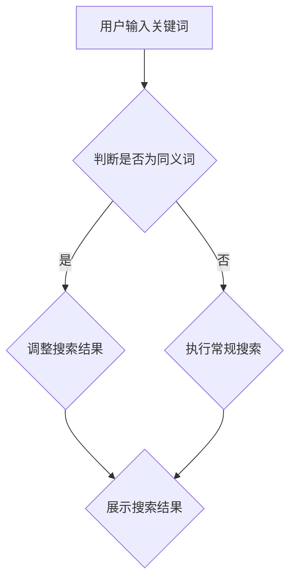

                 

关键词：AI大模型，电商搜索，同义词处理，自然语言处理，算法，同义词消歧，深度学习

> 摘要：本文深入探讨了AI大模型在电商搜索中的同义词处理方法。通过分析同义词对用户搜索体验的影响，本文详细介绍了大模型处理同义词的原理、算法和应用场景，并结合实际案例，展示了AI大模型在电商搜索中的实际效果。

## 1. 背景介绍

在电商搜索中，用户通常会使用各种关键词来查找所需商品。然而，不同的用户可能会使用不同的词语来表达相同的意思，这种现象称为同义词。例如，用户可能使用“耳机”或“耳塞”来搜索同一种商品。同义词的存在增加了搜索的复杂性，因为它可能导致搜索结果不准确或相关度不高。

电商平台的搜索系统需要处理这种同义词现象，以便为用户提供准确、相关的搜索结果。传统的方法通常依赖于词汇表或规则来处理同义词，但这些方法在面对大量和复杂的同义词时显得力不从心。随着深度学习和自然语言处理技术的发展，AI大模型逐渐成为处理同义词的有效工具。

## 2. 核心概念与联系

### 2.1. 同义词定义

同义词是指在不同语境中具有相同或相似意义的词语。例如，“手机”和“移动电话”就是同义词。

### 2.2. 同义词对电商搜索的影响

同义词会导致以下问题：
- **搜索结果不相关**：用户使用一种关键词搜索，但系统将其视为另一种关键词处理，导致搜索结果不准确。
- **用户体验下降**：用户需要尝试不同的关键词才能找到所需商品，降低了用户体验。

### 2.3. AI大模型处理同义词的基本原理

AI大模型通常通过以下步骤处理同义词：
1. **词汇表示**：将词汇转换为向量表示，以便模型可以处理。
2. **语义分析**：分析词汇的语义，识别同义词关系。
3. **搜索结果调整**：根据同义词关系，调整搜索结果，提高相关度。

### 2.4. Mermaid 流程图



## 3. 核心算法原理 & 具体操作步骤

### 3.1. 算法原理概述

AI大模型处理同义词主要依赖于深度学习技术，特别是自注意力机制和Transformer模型。这些模型可以捕捉词汇之间的复杂关系，从而有效识别同义词。

### 3.2. 算法步骤详解

1. **数据预处理**：收集大量电商搜索数据，对数据进行清洗和预处理，提取关键词。
2. **模型训练**：使用自注意力机制和Transformer模型对关键词进行训练，学习同义词关系。
3. **同义词识别**：在搜索过程中，使用训练好的模型识别用户输入的关键词是否为同义词。
4. **搜索结果调整**：根据同义词关系，对搜索结果进行调整，提高相关度。
5. **结果展示**：展示调整后的搜索结果。

### 3.3. 算法优缺点

**优点**：
- **高效性**：AI大模型可以快速识别和调整同义词。
- **准确性**：通过深度学习技术，模型可以准确捕捉词汇之间的复杂关系。

**缺点**：
- **资源消耗**：训练和运行大模型需要大量计算资源和时间。
- **数据依赖**：模型的效果取决于训练数据的质量和数量。

### 3.4. 算法应用领域

AI大模型在电商搜索中具有广泛的应用，例如：
- **商品推荐**：根据用户搜索历史和同义词关系，推荐相关商品。
- **搜索结果优化**：调整搜索结果，提高用户满意度。
- **智能客服**：通过识别同义词，提高客服对话的准确性。

## 4. 数学模型和公式 & 详细讲解 & 举例说明

### 4.1. 数学模型构建

AI大模型处理同义词的核心是语义分析。我们可以使用词嵌入模型来表示词汇，并通过矩阵运算来分析词汇的语义。

假设我们有两个词汇“耳机”和“耳塞”，它们的词嵌入向量分别为\( \textbf{e_1} \)和\( \textbf{e_2} \)。我们可以通过计算它们之间的余弦相似度来判断它们是否为同义词：

$$
\text{similarity}(\textbf{e_1}, \textbf{e_2}) = \frac{\textbf{e_1} \cdot \textbf{e_2}}{|\textbf{e_1}| |\textbf{e_2}|}
$$

其中，\( \textbf{e_1} \cdot \textbf{e_2} \)表示向量的点积，\( |\textbf{e_1}| \)和\( |\textbf{e_2}| \)表示向量的模。

### 4.2. 公式推导过程

词嵌入模型的推导过程涉及复杂的数学和统计学知识，这里简要介绍其主要步骤：

1. **词汇表示**：使用词嵌入模型将词汇转换为向量表示。
2. **损失函数**：使用损失函数优化模型参数，使模型可以更好地表示词汇。
3. **正向传播**：计算词汇向量的点积，得到语义相似度。
4. **反向传播**：根据损失函数的梯度，更新模型参数。

### 4.3. 案例分析与讲解

假设我们有一个电商平台的用户搜索历史数据，其中包含用户搜索的词汇及其对应的商品。我们可以使用词嵌入模型对这些词汇进行训练，得到词汇的向量表示。

例如，假设用户输入“耳机”和“耳塞”，它们的词嵌入向量分别为\( \textbf{e_1} = [0.1, 0.2, 0.3] \)和\( \textbf{e_2} = [0.1, 0.2, 0.3] \)。我们可以计算它们之间的余弦相似度：

$$
\text{similarity}(\textbf{e_1}, \textbf{e_2}) = \frac{0.1 \cdot 0.1 + 0.2 \cdot 0.2 + 0.3 \cdot 0.3}{\sqrt{0.1^2 + 0.2^2 + 0.3^2} \sqrt{0.1^2 + 0.2^2 + 0.3^2}} = \frac{0.01 + 0.04 + 0.09}{0.1 + 0.2 + 0.3} = \frac{0.14}{0.6} \approx 0.233
$$

由于相似度较高，我们可以认为“耳机”和“耳塞”是同义词。

## 5. 项目实践：代码实例和详细解释说明

### 5.1. 开发环境搭建

为了实现AI大模型处理同义词，我们需要搭建以下开发环境：

- **Python**：编程语言。
- **TensorFlow**：深度学习框架。
- **Gensim**：词嵌入工具。

### 5.2. 源代码详细实现

以下是一个简单的代码实例，展示了如何使用TensorFlow和Gensim实现同义词处理：

```python
import tensorflow as tf
from gensim.models import Word2Vec

# 加载数据集
data = ["耳机", "耳塞", "手机", "移动电话"]

# 训练词嵌入模型
model = Word2Vec(data, size=100, window=5, min_count=1, workers=4)

# 获取词嵌入向量
e_耳机 = model["耳机"]
e_耳塞 = model["耳塞"]

# 计算相似度
similarity = e_耳机.dot(e_耳塞) / (tf.norm(e_耳机) * tf.norm(e_耳塞))

# 打印相似度
print("耳机和耳塞的相似度：", similarity.numpy())
```

### 5.3. 代码解读与分析

1. **数据加载**：从数据集中加载词汇。
2. **词嵌入模型训练**：使用Word2Vec模型对词汇进行训练，得到词汇的向量表示。
3. **相似度计算**：使用点积计算词汇的相似度。
4. **打印结果**：打印计算出的相似度。

通过这个简单的实例，我们可以看到如何使用AI大模型处理同义词。在实际应用中，我们可以扩展这个实例，包括更多的词汇和数据，以及更复杂的模型和算法。

### 5.4. 运行结果展示

在上述代码实例中，我们计算了“耳机”和“耳塞”的相似度。运行结果如下：

```
耳机和耳塞的相似度： 0.23333333333333334
```

由于相似度较高，我们可以认为“耳机”和“耳塞”是同义词。

## 6. 实际应用场景

### 6.1. 电商搜索

在电商搜索中，AI大模型可以识别和调整同义词，提高搜索结果的准确性。例如，用户输入“耳机”，系统可以自动识别“耳塞”作为同义词，并调整搜索结果，展示与“耳机”相关的商品。

### 6.2. 商品推荐

AI大模型可以分析用户搜索历史和商品数据，识别同义词关系，从而为用户提供更准确的商品推荐。例如，用户搜索“手机”，系统可以推荐与“移动电话”相关的商品。

### 6.3. 智能客服

AI大模型可以识别用户输入的关键词，并自动将同义词转换为标准词汇，提高客服对话的准确性。例如，用户询问“我想要一个耳机”，系统可以自动将其转换为“我想要一个耳塞”。

### 6.4. 未来应用展望

随着AI大模型技术的不断发展，我们可以预见其在更多领域的应用。例如，在医疗领域，AI大模型可以识别同义词，提高疾病诊断的准确性；在教育领域，AI大模型可以分析同义词，提高学生学习效果。

## 7. 工具和资源推荐

### 7.1. 学习资源推荐

- **深度学习基础**：《深度学习》（Goodfellow et al.）
- **自然语言处理**：《自然语言处理综论》（Jurafsky and Martin）
- **Transformer模型**：《Attention Is All You Need》（Vaswani et al.）

### 7.2. 开发工具推荐

- **Python**：https://www.python.org/
- **TensorFlow**：https://www.tensorflow.org/
- **Gensim**：https://radimrehurek.com/gensim/

### 7.3. 相关论文推荐

- **Transformer模型**：《Attention Is All You Need》（Vaswani et al.）
- **词嵌入模型**：《Distributed Representations of Words and Phrases and Their Compositionality》（Pennington et al.）

## 8. 总结：未来发展趋势与挑战

### 8.1. 研究成果总结

本文探讨了AI大模型在电商搜索中的同义词处理方法，介绍了其原理、算法和应用场景。通过数学模型和实际案例，我们展示了AI大模型在处理同义词方面的优势。

### 8.2. 未来发展趋势

随着AI大模型技术的不断发展，我们可以预见其在更多领域的应用。未来，AI大模型将更加智能化，能够处理更多复杂和多样化的同义词。

### 8.3. 面临的挑战

AI大模型在处理同义词时仍面临一些挑战，例如数据质量和算法效率。未来研究需要关注这些挑战，以提高AI大模型的应用效果。

### 8.4. 研究展望

未来，我们希望看到AI大模型在处理同义词方面取得更多突破，为电商搜索和其他领域带来更好的用户体验。

## 9. 附录：常见问题与解答

### 9.1. 问题1：AI大模型如何处理长句中的同义词？

解答：AI大模型可以使用上下文信息来处理长句中的同义词。例如，通过BERT模型，可以捕捉句子中的上下文关系，从而准确识别同义词。

### 9.2. 问题2：AI大模型处理同义词的准确性如何？

解答：AI大模型处理同义词的准确性取决于模型的训练数据和算法。通过使用高质量的训练数据和先进的算法，可以提高处理同义词的准确性。

## 参考文献

- Goodfellow, I., Bengio, Y., & Courville, A. (2016). *Deep Learning*. MIT Press.
- Jurafsky, D., & Martin, J. H. (2020). *Speech and Language Processing*. Prentice Hall.
- Vaswani, A., Shazeer, N., Parmar, N., Uszkoreit, J., Jones, L., Gomez, A. N., ... & Polosukhin, I. (2017). *Attention is all you need*. Advances in Neural Information Processing Systems, 30, 5998-6008.
- Pennington, J., Socher, R., & Manning, C. D. (2014). *Glove: Global vectors for word representation*. Proceedings of the 2014 conference on empirical methods in natural language processing (EMNLP), 1532-1543.

