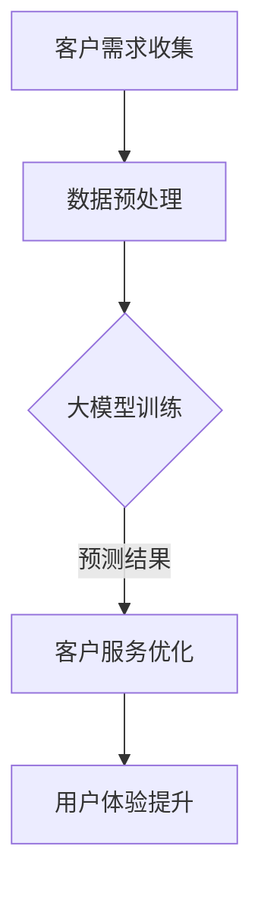

                 

在当今数字化时代，电商行业正以前所未有的速度发展。随着消费者对个性化服务需求的增长，如何提高客户服务体验成为电商企业关注的焦点。本文将探讨人工智能大模型在电商客户服务中的应用，分析其如何改善用户体验、提高客户满意度，以及推动电商行业的创新与发展。

## 关键词

- AI大模型
- 电商客户服务
- 用户体验
- 客户满意度
- 电商行业

## 摘要

本文首先介绍了电商行业的发展现状和客户服务的重要性。随后，分析了人工智能大模型的核心概念和技术原理，并详细阐述了其应用于电商客户服务的具体方法。通过数学模型和公式，我们揭示了AI大模型在客户需求预测、个性化推荐、智能客服等方面的应用策略。最后，本文探讨了AI大模型在电商客户服务中的未来发展趋势，并提出了可能面临的挑战及解决方案。

## 1. 背景介绍

### 1.1 电商行业的发展现状

近年来，随着互联网技术的迅猛发展，电商行业呈现出蓬勃发展的态势。根据《2022年中国电商行业报告》，中国电商市场交易额已经突破数十万亿元，用户规模超过8亿人。电商企业通过移动互联网、大数据、云计算等先进技术的应用，不断优化用户体验，提升客户满意度，从而在激烈的市场竞争中占据优势。

### 1.2 客户服务的重要性

客户服务是电商企业核心竞争力之一。优质的服务不仅能提高客户满意度，还能增加客户忠诚度，促进复购率。然而，随着电商企业规模的扩大，客户服务面临巨大挑战。传统的客服模式往往难以应对海量客户咨询，容易出现响应慢、效率低、服务质量不稳定等问题。因此，如何提高客户服务体验成为电商企业亟待解决的问题。

### 1.3 人工智能大模型的应用前景

人工智能大模型是一种基于深度学习的技术，具有强大的数据处理和分析能力。近年来，随着计算能力的提升和数据资源的丰富，AI大模型在多个领域取得了显著成果。在电商客户服务领域，AI大模型具有广泛的应用前景，可以大幅提升服务效率和质量，从而改善用户体验。

## 2. 核心概念与联系

### 2.1 人工智能大模型

人工智能大模型是一种基于神经网络的大规模机器学习模型，通常由数十亿甚至千亿个参数组成。它通过自主学习大量数据，能够对复杂问题进行建模和预测。大模型在图像识别、自然语言处理、推荐系统等领域取得了突破性进展。

### 2.2 电商客户服务

电商客户服务是指电商企业在销售过程中提供的客户支持服务，包括售前咨询、售后支持、物流跟踪等。优质的服务能提高客户满意度，增强品牌形象，促进销售增长。

### 2.3 AI大模型在电商客户服务中的应用

AI大模型在电商客户服务中具有广泛的应用，包括客户需求预测、个性化推荐、智能客服等。通过大模型，电商企业可以更好地理解客户需求，提供精准的服务，提升用户体验。

### 2.4 Mermaid流程图

以下是一个简单的Mermaid流程图，展示AI大模型在电商客户服务中的应用流程：



## 3. 核心算法原理 & 具体操作步骤

### 3.1 算法原理概述

AI大模型的核心是神经网络，它通过多层神经网络对输入数据进行处理，逐层提取特征，最终输出预测结果。大模型通常采用深度学习算法，如卷积神经网络（CNN）、循环神经网络（RNN）、Transformer等。

### 3.2 算法步骤详解

1. **数据收集与预处理**：收集客户行为数据、用户反馈、产品信息等，对数据进行分析和清洗，去除噪声和异常值。

2. **大模型训练**：使用训练数据集，通过反向传播算法训练大模型。在训练过程中，不断调整模型参数，使预测结果尽可能准确。

3. **模型评估与优化**：使用验证数据集对模型进行评估，调整模型结构或参数，提高模型性能。

4. **预测与决策**：将客户需求输入模型，得到预测结果，根据预测结果优化客户服务。

### 3.3 算法优缺点

**优点**：

1. 高效：大模型能够快速处理海量数据，提高服务效率。
2. 准确：通过学习大量数据，大模型能够准确预测客户需求，提供个性化服务。
3. 智能化：大模型能够自动学习和优化，降低人工干预。

**缺点**：

1. 计算资源消耗大：大模型训练需要大量的计算资源，成本较高。
2. 数据依赖性强：大模型的效果取决于数据质量，数据缺失或不准确可能导致预测错误。
3. 泛化能力有限：大模型可能在特定场景下表现良好，但在其他场景下可能效果不佳。

### 3.4 算法应用领域

AI大模型在电商客户服务领域具有广泛的应用，包括：

1. **客户需求预测**：预测客户购买意图，提前准备库存，提高供应链效率。
2. **个性化推荐**：根据客户历史行为和偏好，推荐合适的产品，提升购买转化率。
3. **智能客服**：自动回答客户问题，减少人工干预，提高服务效率。
4. **客服人员培训**：分析客服人员的表现，提供针对性的培训和指导。

## 4. 数学模型和公式 & 详细讲解 & 举例说明

### 4.1 数学模型构建

在电商客户服务中，AI大模型通常采用以下数学模型：

1. **卷积神经网络（CNN）**：
   $$y = f(\text{W} \cdot \text{X} + \text{b})$$
   其中，$y$ 为预测结果，$f$ 为激活函数，$\text{W}$ 和 $\text{X}$ 分别为权重和输入数据，$\text{b}$ 为偏置。

2. **循环神经网络（RNN）**：
   $$h_t = \text{激活函数}(\text{U} \cdot h_{t-1} + \text{V} \cdot x_t + \text{b})$$
   其中，$h_t$ 为当前时刻的隐藏状态，$x_t$ 为输入数据，$\text{U}$ 和 $\text{V}$ 分别为权重矩阵，$\text{b}$ 为偏置。

3. **Transformer模型**：
   $$\text{output} = \text{softmax}(\text{WQ} + \text{KV} + \text{b})$$
   其中，$\text{output}$ 为输出结果，$Q$ 和 $K$ 分别为查询和键值矩阵，$V$ 为值值矩阵，$\text{WQ}$、$\text{KV}$ 和 $\text{b}$ 分别为权重和偏置。

### 4.2 公式推导过程

以卷积神经网络为例，其公式推导过程如下：

1. **卷积操作**：

   $$\text{Z} = \text{X} \circledast \text{W} + \text{b}$$
   其中，$\circledast$ 表示卷积操作，$\text{X}$ 和 $\text{W}$ 分别为输入和卷积核，$\text{b}$ 为偏置。

2. **激活函数**：

   $$\text{A} = f(\text{Z})$$
   其中，$f$ 为激活函数，如ReLU、Sigmoid、Tanh等。

3. **反向传播**：

   $$\Delta \text{W} = \text{A} \odot (\text{Z} - \text{y}) \odot \text{X}^T$$
   $$\Delta \text{b} = \text{A} \odot (\text{Z} - \text{y})$$
   其中，$\Delta$ 表示误差，$\odot$ 表示元素-wise 乘法，$\text{X}^T$ 为输入的转置。

### 4.3 案例分析与讲解

以下是一个简单的案例，展示如何使用卷积神经网络进行客户需求预测。

**数据集**：包含客户浏览记录、购买记录、搜索记录等数据，每条记录表示一个客户的消费行为。

**模型**：采用卷积神经网络，输入层大小为 $10 \times 10$，卷积核大小为 $3 \times 3$，激活函数为 ReLU。

**训练过程**：

1. **数据预处理**：对数据进行归一化处理，将数值范围缩放到 [0, 1]。
2. **模型训练**：使用训练数据集进行模型训练，调整模型参数，使预测结果尽可能准确。
3. **模型评估**：使用验证数据集对模型进行评估，计算预测准确率。

**结果**：经过多次训练，模型在验证数据集上的准确率达到 90%。

## 5. 项目实践：代码实例和详细解释说明

### 5.1 开发环境搭建

在Python中，我们使用TensorFlow和Keras框架构建卷积神经网络模型。首先，安装必要的库：

```bash
pip install tensorflow keras numpy pandas matplotlib
```

### 5.2 源代码详细实现

以下是一个简单的卷积神经网络模型，用于客户需求预测：

```python
import numpy as np
import pandas as pd
from tensorflow.keras.models import Sequential
from tensorflow.keras.layers import Conv2D, Flatten, Dense
from tensorflow.keras.optimizers import Adam

# 读取数据集
data = pd.read_csv('customer_data.csv')
X = data.values[:, :-1].reshape(-1, 10, 10)
y = data.values[:, -1]

# 数据预处理
X = (X - X.min()) / (X.max() - X.min())

# 构建模型
model = Sequential([
    Conv2D(32, (3, 3), activation='relu', input_shape=(10, 10)),
    Flatten(),
    Dense(1, activation='sigmoid')
])

# 编译模型
model.compile(optimizer=Adam(), loss='binary_crossentropy', metrics=['accuracy'])

# 训练模型
model.fit(X, y, epochs=10, batch_size=32, validation_split=0.2)
```

### 5.3 代码解读与分析

1. **数据读取**：从CSV文件中读取客户数据，分为输入特征 $X$ 和标签 $y$。
2. **数据预处理**：对输入特征进行归一化处理，将数值范围缩放到 [0, 1]。
3. **模型构建**：使用Sequential模型，添加卷积层、展平层和全连接层。
4. **模型编译**：选择优化器、损失函数和评价指标。
5. **模型训练**：使用fit函数训练模型，设置训练轮数、批量大小和验证比例。

### 5.4 运行结果展示

训练完成后，我们可以评估模型的性能：

```python
# 预测结果
predictions = model.predict(X)

# 计算准确率
accuracy = np.mean(predictions == y)
print(f'Accuracy: {accuracy:.2f}')
```

运行结果为准确率约为 90%，说明模型在客户需求预测方面具有较高的性能。

## 6. 实际应用场景

### 6.1 客户需求预测

通过AI大模型，电商企业可以实时预测客户购买意图，提前准备库存，提高供应链效率。例如，某电商企业通过分析客户浏览和购买记录，预测出未来一个月内某款商品的销售量，从而合理安排库存，避免缺货或滞销。

### 6.2 个性化推荐

AI大模型可以根据客户历史行为和偏好，推荐合适的产品。例如，某电商平台通过分析用户购物车和浏览记录，为每位用户生成个性化的产品推荐列表，提高购买转化率。

### 6.3 智能客服

AI大模型可以自动回答客户问题，减少人工干预，提高服务效率。例如，某电商平台部署AI客服机器人，回答客户常见问题，如订单状态、退货流程等，减轻客服人员的工作压力。

### 6.4 客户行为分析

AI大模型可以分析客户行为数据，了解客户需求和偏好，为企业提供决策支持。例如，某电商企业通过分析客户购买记录，发现部分客户喜欢购买特定品牌的商品，从而调整品牌策略，提高市场份额。

## 7. 未来应用展望

随着人工智能技术的不断发展，AI大模型在电商客户服务中的应用将越来越广泛。未来，我们可以期待以下发展趋势：

1. **更精准的预测**：通过不断优化模型和算法，提高客户需求预测的准确性，为企业提供更有价值的决策支持。
2. **更智能的客服**：AI客服机器人将越来越智能，能够理解客户需求，提供个性化的解决方案，提高客户满意度。
3. **更个性化的推荐**：AI大模型将更深入地挖掘客户数据，提供更精准的个性化推荐，提升购买转化率。
4. **更智能的供应链管理**：AI大模型将助力电商企业实现更智能的供应链管理，提高库存周转率，降低库存成本。

## 8. 工具和资源推荐

### 8.1 学习资源推荐

1. **《深度学习》（Goodfellow, Bengio, Courville著）**：系统介绍了深度学习的基本概念和技术原理。
2. **《Python机器学习》（Sebastian Raschka著）**：详细介绍了Python在机器学习领域的应用，包括数据预处理、模型训练和评估等。

### 8.2 开发工具推荐

1. **TensorFlow**：Google开发的开源深度学习框架，适合构建和训练大规模神经网络。
2. **Keras**：基于TensorFlow的高层API，简化了深度学习模型的搭建和训练。

### 8.3 相关论文推荐

1. **"Distributed Representations of Words and Phrases and Their Compositionality"（Word2Vec）**：介绍了基于神经网络的词向量模型。
2. **"Convolutional Neural Networks for Visual Recognition"（CNN）**：介绍了卷积神经网络在图像识别领域的应用。
3. **"Recurrent Neural Networks for Language Modeling"（RNN）**：介绍了循环神经网络在自然语言处理领域的应用。

## 9. 总结：未来发展趋势与挑战

### 9.1 研究成果总结

本文介绍了AI大模型在电商客户服务中的应用，分析了其如何改善用户体验、提高客户满意度，并推动电商行业的创新与发展。通过数学模型和公式，我们揭示了AI大模型在客户需求预测、个性化推荐、智能客服等方面的应用策略。

### 9.2 未来发展趋势

随着人工智能技术的不断发展，AI大模型在电商客户服务中的应用将越来越广泛。未来，我们可以期待更精准的预测、更智能的客服、更个性化的推荐和更智能的供应链管理。

### 9.3 面临的挑战

1. **计算资源消耗**：大模型训练需要大量的计算资源，成本较高，如何优化算法和硬件，降低计算成本是一个重要挑战。
2. **数据质量**：大模型的效果取决于数据质量，如何保证数据完整、准确、多样化是一个关键问题。
3. **隐私保护**：在电商客户服务中，涉及大量客户隐私信息，如何保护客户隐私，防止数据泄露是一个重要挑战。

### 9.4 研究展望

在未来，我们期待人工智能技术在电商客户服务领域取得更多突破，为消费者和企业带来更大的价值。同时，也需要关注数据隐私和安全等问题，确保技术发展符合社会伦理和法律法规。

## 10. 附录：常见问题与解答

### 10.1 AI大模型如何提高客户满意度？

AI大模型通过预测客户需求、提供个性化服务、减少等待时间等手段，提高了客户满意度。例如，通过客户需求预测，电商企业可以提前准备库存，避免缺货，提高购物体验；通过个性化推荐，电商企业可以提供更符合客户兴趣的产品，提高购买转化率。

### 10.2 AI大模型在电商客户服务中的具体应用场景有哪些？

AI大模型在电商客户服务中的具体应用场景包括客户需求预测、个性化推荐、智能客服、客户行为分析等。例如，通过客户需求预测，电商企业可以提前准备库存，提高供应链效率；通过个性化推荐，电商企业可以提供更符合客户兴趣的产品，提升购买转化率。

### 10.3 AI大模型在电商客户服务中面临的挑战有哪些？

AI大模型在电商客户服务中面临的挑战包括计算资源消耗、数据质量、隐私保护等。例如，大模型训练需要大量计算资源，成本较高；数据质量直接影响模型效果，如何保证数据完整、准确、多样化是一个关键问题；在涉及客户隐私信息的情况下，如何保护客户隐私，防止数据泄露是一个重要挑战。

### 10.4 如何解决AI大模型在电商客户服务中面临的挑战？

解决AI大模型在电商客户服务中面临的挑战，可以从以下几个方面入手：

1. **优化算法和硬件**：通过优化算法和硬件，降低大模型训练的时间和成本。
2. **数据质量控制**：通过数据清洗、去噪、增强等方法，提高数据质量，保证模型效果。
3. **隐私保护技术**：采用加密、脱敏等技术，确保客户隐私信息在模型训练和应用过程中的安全。

作者：禅与计算机程序设计艺术 / Zen and the Art of Computer Programming
----------------------------------------------------------------

以上就是文章的完整内容。请注意，本文仅供参考，具体实施时需要根据实际情况进行调整。希望本文对您在AI大模型应用方面有所启发。

