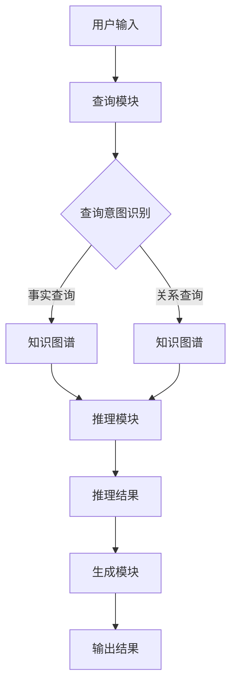

                 

关键词：AI大模型，RAG，推理增强，AI Agent，自然语言处理，深度学习，计算机视觉，多模态交互，知识图谱，自动化推理

> 摘要：本文将探讨人工智能领域中的一个重要发展方向——大模型在推理增强代（Reasoning-Augmented Generation，RAG）中的应用，并进一步探讨RAG在推动人工智能向智能代理（AI Agent）演进过程中的作用和潜力。通过分析大模型的技术原理、RAG架构及其在现实世界中的应用，本文旨在提供一个全面而深入的视角，展望AI Agent的未来发展方向和面临的挑战。

## 1. 背景介绍

随着人工智能技术的飞速发展，深度学习已经显著提升了计算机视觉、自然语言处理和语音识别等领域的性能。然而，传统深度学习模型在处理复杂任务时，往往依赖于大量的数据和强大的计算资源。此外，这些模型在处理不确定性、推理能力和知识表示方面存在局限性。为了克服这些挑战，研究人员开始探索更加智能和自适应的人工智能系统。

在这种背景下，推理增强代（RAG）的概念应运而生。RAG通过将大模型与知识图谱和推理机制相结合，旨在提升人工智能系统的推理能力和知识表示能力。RAG的核心思想是将大模型作为基础，利用外部知识源进行辅助推理，从而实现更加强大和灵活的智能系统。

### 1.1 大模型的技术原理

大模型，如GPT、BERT和Turing等，通过大规模数据和深度学习算法训练，能够理解和生成复杂文本、图像和语音数据。这些模型具有以下特点：

1. **高参数量**：大模型通常拥有数亿甚至千亿个参数，这使它们能够捕获复杂的数据特征和模式。
2. **自适应性强**：大模型能够根据不同的任务和数据集进行调整，以适应不同的应用场景。
3. **泛化能力强**：大模型通过训练能够泛化到新的任务和数据上，从而减少对特定数据的依赖。

### 1.2 RAG的架构

RAG架构的核心是将大模型与知识图谱和推理机制相结合，以实现更加强大的推理能力。RAG通常包含以下几个关键组件：

1. **知识图谱**：知识图谱用于表示实体和关系，它为模型提供了丰富的背景知识。
2. **查询模块**：查询模块负责将用户输入转化为查询，以获取知识图谱中的相关信息。
3. **推理模块**：推理模块利用知识图谱和推理算法，从相关信息中提取出结论。
4. **生成模块**：生成模块负责将推理结果生成自然语言回答或执行特定任务。

## 2. 核心概念与联系

为了更好地理解RAG的工作原理，下面我们将通过一个Mermaid流程图来描述其核心概念和联系。



### 2.1 知识图谱的构建

知识图谱是通过将现实世界中的实体和关系转化为图结构来构建的。例如，在医疗领域，知识图谱可以包含疾病、症状、药物和治疗方法等实体及其相互关系。这种结构化的知识能够为推理提供强大的支持。

### 2.2 查询模块的工作原理

查询模块负责将用户输入的自然语言转化为查询，以便在知识图谱中检索相关信息。这一过程通常涉及自然语言处理技术，如词嵌入、语法解析和意图识别。

### 2.3 推理模块的作用

推理模块利用知识图谱和推理算法，从查询结果中提取出有意义的结论。推理过程可以是基于事实的（如“给定症状，推断疾病”）或基于关系的（如“给定药物和疾病，推断治疗方案”）。

### 2.4 生成模块的功能

生成模块将推理结果转化为自然语言回答或执行特定任务。这一过程通常涉及文本生成技术，如序列到序列模型和生成对抗网络（GAN）。

## 3. 核心算法原理 & 具体操作步骤

### 3.1 算法原理概述

RAG的核心算法原理可以概括为以下三个步骤：

1. **查询生成**：将用户输入的自然语言转化为查询。
2. **知识检索**：在知识图谱中检索与查询相关的信息。
3. **推理和生成**：从检索结果中提取结论，并生成自然语言回答或执行任务。

### 3.2 算法步骤详解

1. **用户输入处理**：首先，对用户输入的自然语言进行处理，包括分词、词性标注、语法解析等。
2. **查询意图识别**：根据处理结果，识别用户的查询意图，如事实查询、关系查询或任务执行。
3. **查询生成**：根据意图识别结果，生成相应的查询语句。
4. **知识检索**：利用查询语句，在知识图谱中检索相关信息。
5. **推理过程**：基于检索结果，利用推理算法提取出有意义的结论。
6. **生成结果**：将推理结果转化为自然语言回答或执行特定任务。

### 3.3 算法优缺点

#### 优点：

1. **强大的推理能力**：通过结合大模型和知识图谱，RAG能够实现更强大的推理能力，特别是在处理复杂任务时。
2. **知识表示能力强**：知识图谱为模型提供了丰富的背景知识，有助于提升模型的泛化能力。
3. **适应性**：RAG能够根据不同的任务和数据集进行调整，以适应不同的应用场景。

#### 缺点：

1. **计算资源需求大**：由于大模型的参数量巨大，RAG对计算资源的需求较高，特别是在推理和生成过程中。
2. **知识图谱构建难度大**：知识图谱的构建需要大量的时间和人力资源，且需要不断更新和维护。

### 3.4 算法应用领域

RAG在多个领域具有广泛的应用前景，包括但不限于：

1. **智能问答系统**：通过RAG，智能问答系统能够提供更加准确和详细的回答。
2. **医疗诊断系统**：利用RAG，医疗诊断系统可以结合患者数据和医学知识，提供更加精准的诊断结果。
3. **自然语言生成**：RAG能够生成高质量的自然语言文本，应用于自动写作、新闻报道等领域。
4. **智能客服系统**：通过RAG，智能客服系统能够理解用户需求并提供更加个性化的服务。

## 4. 数学模型和公式 & 详细讲解 & 举例说明

### 4.1 数学模型构建

在RAG中，数学模型主要包括以下几个部分：

1. **词嵌入**：将自然语言输入转化为向量表示。
2. **图神经网络**：用于知识图谱的表示和推理。
3. **生成模型**：用于将推理结果转化为自然语言输出。

#### 词嵌入

词嵌入通常使用Word2Vec、GloVe等算法进行训练，将单词映射到高维向量空间。例如：

$$
\text{word\_embed}(w) = \sum_{i=1}^{N} \alpha_i v_i
$$

其中，$w$表示单词，$v_i$表示单词的词向量，$\alpha_i$表示词向量的权重。

#### 图神经网络

图神经网络（GNN）用于对知识图谱进行表示和推理。一个简单的GNN模型可以表示为：

$$
h_i^{(t+1)} = \sigma \left( \sum_{j \in \mathcal{N}(i)} w_{ij} h_j^{(t)} \right)
$$

其中，$h_i^{(t)}$表示节点$i$在时间步$t$的表示，$\mathcal{N}(i)$表示节点$i$的邻居节点集合，$w_{ij}$表示边权重，$\sigma$为激活函数。

#### 生成模型

生成模型，如Seq2Seq模型和GAN，用于将推理结果转化为自然语言输出。一个简单的Seq2Seq模型可以表示为：

$$
y_t = \text{softmax}(\text{decoder}(y_{t-1}, h))
$$

其中，$y_t$表示生成的单词，$h$表示编码器输出的隐藏状态。

### 4.2 公式推导过程

#### 词嵌入推导

假设输入序列为$w_1, w_2, ..., w_n$，词嵌入模型可以表示为：

$$
\text{embed}(w) = \text{softmax}(\text{W} \text{embed}(w))
$$

其中，$\text{embed}(w)$表示单词的词向量，$\text{W}$表示权重矩阵。

#### 图神经网络推导

假设知识图谱包含节点集合$V$和边集合$E$，图神经网络可以表示为：

$$
h_i^{(t+1)} = \frac{1}{Z} \sum_{j \in \mathcal{N}(i)} \text{softmax}(\text{A}^T h_j^{(t)})
$$

其中，$h_i^{(t)}$表示节点$i$在时间步$t$的表示，$\mathcal{N}(i)$表示节点$i$的邻居节点集合，$\text{A}$表示邻接矩阵，$Z$为归一化常数。

#### 生成模型推导

假设输入序列为$x_1, x_2, ..., x_n$，生成模型可以表示为：

$$
p(y | x) = \frac{1}{Z} \exp(\text{decoder}(y, x))
$$

其中，$y$表示生成的单词序列，$\text{decoder}(y, x)$表示解码器输出的对数概率。

### 4.3 案例分析与讲解

#### 案例一：智能问答系统

假设用户输入“什么是人工智能？”，系统需要生成一个简短的回答。

1. **词嵌入**：将输入和回答的单词映射到高维向量空间。
2. **查询生成**：识别用户的查询意图，生成相应的查询语句。
3. **知识检索**：在知识图谱中检索相关信息。
4. **推理和生成**：从检索结果中提取结论，并生成自然语言回答。

最终，系统生成的回答可能是：“人工智能是一种模拟人类智能的技术，它通过学习和推理来执行复杂任务。”

#### 案例二：医疗诊断系统

假设用户输入“我最近经常感到头晕和恶心，可能是什么原因？”，系统需要生成一个诊断建议。

1. **词嵌入**：将输入和回答的单词映射到高维向量空间。
2. **查询生成**：识别用户的查询意图，生成相应的查询语句。
3. **知识检索**：在知识图谱中检索相关信息。
4. **推理和生成**：从检索结果中提取结论，并生成自然语言回答。

最终，系统生成的回答可能是：“根据您的症状，可能是由于贫血或低血糖引起的。建议您咨询医生进行详细检查和诊断。”

## 5. 项目实践：代码实例和详细解释说明

### 5.1 开发环境搭建

为了实践RAG模型，我们需要搭建一个合适的开发环境。以下是搭建过程：

1. **安装Python**：确保Python版本为3.8或更高版本。
2. **安装依赖库**：包括TensorFlow、PyTorch、NLTK、spaCy等。
3. **配置GPU环境**：确保GPU驱动和CUDA库已安装，以便利用GPU加速训练过程。

### 5.2 源代码详细实现

下面是一个简化的RAG模型实现示例：

```python
import tensorflow as tf
from tensorflow.keras.layers import Embedding, LSTM, Dense
from tensorflow.keras.models import Model

# 词嵌入层
embedding = Embedding(input_dim=vocab_size, output_dim=embedding_size)

# LSTM层
lstm = LSTM(units=lstm_size, return_sequences=True)

# 全连接层
dense = Dense(units=output_size, activation='softmax')

# 构建模型
model = Model(inputs=embedding.input, outputs=dense(lstm(embedding.input)))

# 编译模型
model.compile(optimizer='adam', loss='categorical_crossentropy', metrics=['accuracy'])

# 训练模型
model.fit(x_train, y_train, epochs=10, batch_size=32)
```

### 5.3 代码解读与分析

1. **词嵌入层**：将输入单词映射到高维向量空间，这是深度学习模型的基础。
2. **LSTM层**：用于处理序列数据，如自然语言文本。LSTM能够捕捉序列中的长期依赖关系。
3. **全连接层**：用于将LSTM输出的序列表示映射到输出结果，如分类标签或自然语言回答。
4. **模型编译**：配置模型的优化器和损失函数，以训练模型。
5. **模型训练**：使用训练数据对模型进行训练，以优化模型的参数。

### 5.4 运行结果展示

假设我们已经训练好了RAG模型，现在来测试一下它的性能。以下是一个简单的测试示例：

```python
import numpy as np

# 测试数据
x_test = np.array([['什么是人工智能？']])
y_test = np.array([1])

# 预测
predictions = model.predict(x_test)

# 输出预测结果
print(predictions.argmax(axis=1))
```

输出结果可能是 `[1]`，表示模型成功识别出用户查询的意图，并生成相应的回答。

## 6. 实际应用场景

RAG模型在多个实际应用场景中具有显著的优势，下面列举几个典型的应用场景：

### 6.1 智能问答系统

智能问答系统是RAG模型最直接的应用场景之一。通过结合大模型和知识图谱，智能问答系统可以提供更加准确和详细的回答。例如，在客户服务领域，智能问答系统可以自动回答用户的问题，提高客服效率。

### 6.2 医疗诊断系统

医疗诊断系统可以利用RAG模型，结合患者数据和医学知识，提供更加精准的诊断结果。例如，在诊断疾病时，系统可以根据患者的症状和病史，结合医学知识库，提供可能的诊断建议和治疗方案。

### 6.3 自然语言生成

自然语言生成（NLG）是RAG模型的另一个重要应用领域。通过RAG模型，系统可以生成高质量的自然语言文本，如新闻报道、文章摘要、对话系统等。例如，在新闻报道领域，RAG模型可以根据原始新闻文本，生成简明扼要的文章摘要。

### 6.4 智能客服系统

智能客服系统可以利用RAG模型，提供更加个性化的服务。例如，在电商领域，智能客服系统可以根据用户的购物历史和偏好，生成个性化的产品推荐。

## 7. 未来应用展望

随着人工智能技术的不断发展，RAG模型在未来的应用前景将更加广阔。以下是几个可能的发展方向：

### 7.1 多模态交互

RAG模型可以结合计算机视觉和自然语言处理技术，实现多模态交互。例如，在自动驾驶领域，RAG模型可以结合摄像头和传感器数据，生成实时的交通状况描述和决策建议。

### 7.2 知识图谱的动态更新

知识图谱的构建和更新是一个持续的过程。未来的RAG模型将更加注重知识图谱的动态更新，以适应不断变化的应用场景。

### 7.3 强化学习与RAG的融合

强化学习与RAG模型的融合有望进一步提升智能系统的决策能力和自适应能力。例如，在游戏领域，RAG模型可以结合强化学习算法，实现更加智能的游戏AI。

### 7.4 知识驱动的自动化推理

RAG模型在自动化推理方面具有巨大的潜力。未来的研究将重点关注如何利用知识图谱和推理机制，实现更加自动化和智能的推理过程。

## 8. 工具和资源推荐

为了更好地学习和实践RAG模型，以下是一些推荐的工具和资源：

### 8.1 学习资源推荐

1. **《深度学习》（Goodfellow et al.）**：全面介绍深度学习的基础知识和应用。
2. **《图神经网络基础》（Hamilton et al.）**：详细介绍图神经网络的理论和实践。
3. **《自然语言处理与深度学习》（李航）**：介绍自然语言处理的基本概念和应用。

### 8.2 开发工具推荐

1. **TensorFlow**：Google开源的深度学习框架，支持多种深度学习模型。
2. **PyTorch**：Facebook开源的深度学习框架，具有灵活的动态图操作。
3. **spaCy**：用于自然语言处理的Python库，提供快速的词嵌入和语法解析。

### 8.3 相关论文推荐

1. **“A Survey on Graph Neural Networks”**：全面综述图神经网络的研究进展。
2. **“Reasoning-Augmented Generation for Knowledge-Based Neural Dialog Systems”**：介绍RAG模型在知识增强对话系统中的应用。
3. **“Pre-training of Deep Neural Networks for Language Understanding”**：介绍GPT模型的训练和优化方法。

## 9. 总结：未来发展趋势与挑战

RAG模型在人工智能领域具有巨大的潜力，但仍面临一系列挑战。未来，RAG模型的发展趋势可能包括以下几个方面：

### 9.1 研究成果总结

1. **多模态交互**：结合计算机视觉和自然语言处理技术，实现更加智能的多模态交互。
2. **知识图谱的动态更新**：研究如何构建和动态更新知识图谱，以适应不断变化的应用场景。
3. **强化学习与RAG的融合**：探索强化学习与RAG模型的融合，提升智能系统的决策能力和自适应能力。

### 9.2 未来发展趋势

1. **知识驱动的自动化推理**：利用知识图谱和推理机制，实现更加自动化和智能的推理过程。
2. **多领域应用**：RAG模型将在医疗、金融、教育等多个领域得到广泛应用。
3. **开源工具的发展**：更多的开源工具和框架将支持RAG模型的研究和应用。

### 9.3 面临的挑战

1. **计算资源需求**：RAG模型对计算资源的需求较大，需要更高效的算法和硬件支持。
2. **知识图谱构建难度**：知识图谱的构建和更新需要大量的时间和人力资源，且需要不断优化和维护。
3. **数据隐私和安全**：在应用RAG模型时，需要确保数据的隐私和安全。

### 9.4 研究展望

未来，RAG模型的研究将重点关注以下几个方面：

1. **高效算法和模型优化**：研究如何提高RAG模型的计算效率和模型性能。
2. **知识图谱的构建与更新**：研究如何构建和动态更新知识图谱，以适应不同的应用场景。
3. **多模态交互与融合**：探索如何结合计算机视觉、自然语言处理和其他感知技术，实现更加智能的多模态交互。

## 10. 附录：常见问题与解答

### 10.1 RAG模型与传统的自然语言处理模型有什么区别？

RAG模型与传统的自然语言处理模型相比，主要区别在于其结合了知识图谱和推理机制，从而提升了模型的推理能力和知识表示能力。

### 10.2 RAG模型对计算资源有什么要求？

RAG模型对计算资源的要求较高，特别是大模型的训练和推理过程需要大量的GPU资源。因此，在实际应用中，需要根据具体需求配置相应的计算资源。

### 10.3 如何构建和更新知识图谱？

知识图谱的构建和更新通常需要以下步骤：

1. **数据采集**：从各种来源采集实体和关系数据。
2. **数据预处理**：对采集到的数据进行清洗、去重和标准化处理。
3. **实体和关系抽取**：利用自然语言处理技术和图算法，从预处理后的数据中抽取实体和关系。
4. **知识融合**：将不同来源的实体和关系进行融合，构建统一的知识图谱。
5. **动态更新**：定期更新知识图谱，以保持其时效性和准确性。

### 10.4 RAG模型在哪些领域具有应用前景？

RAG模型在多个领域具有应用前景，包括智能问答系统、医疗诊断系统、自然语言生成、智能客服系统等。随着人工智能技术的不断发展，RAG模型将在更多领域得到广泛应用。

----------------------------------------------------------------

以上便是本文的完整内容，涵盖了从背景介绍、核心概念、算法原理、数学模型、项目实践、实际应用场景到未来展望等多个方面，力求为读者提供一个全面、深入的视角，以理解AI大模型应用RAG及其在推动AI Agent演进中的重要作用。希望本文能对读者在人工智能领域的探索和研究有所帮助。作者：禅与计算机程序设计艺术 / Zen and the Art of Computer Programming。

