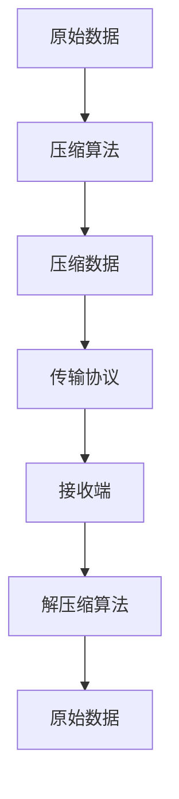

                 

关键词：数据压缩、大模型应用、传输效率、算法优化、数学模型、代码实例

> 摘要：本文深入探讨了在大模型应用中数据压缩与传输的重要性。首先，我们回顾了数据压缩的基本原理，分析了常见压缩算法的优缺点。接着，我们重点讨论了数据压缩与传输在AI大模型应用中的关键作用。随后，通过数学模型和公式详细解释了压缩与传输的核心机制。我们还提供了一个完整的代码实例，解释了如何在实际项目中实现数据压缩与传输。最后，本文探讨了数据压缩与传输在未来的应用前景，提出了潜在的研究方向和挑战。

## 1. 背景介绍

在当今的数字时代，数据量呈指数级增长。特别是随着人工智能（AI）技术的飞速发展，大模型（如深度学习模型）的应用日益广泛。然而，这些大模型通常需要处理和传输大量的数据，这对于传统的数据传输方式提出了巨大的挑战。数据压缩与传输技术的优化成为提高AI大模型性能和效率的关键因素之一。

### 数据压缩

数据压缩是一种减少数据大小的方法，通过去除冗余信息或替换为更紧凑的表示形式。压缩技术可以显著降低存储需求和传输时间，从而提高系统的整体性能。

### 传输效率

传输效率是指在给定时间内成功传输的数据量。优化传输效率对于实时性要求高的AI应用至关重要，如自动驾驶、实时语音识别等。

### 大模型应用

大模型，特别是深度学习模型，具有强大的数据处理能力，但也需要处理和传输大量的数据。例如，一个大规模的图像识别模型可能在训练过程中需要处理数百万张图像，这要求高效的压缩与传输技术。

## 2. 核心概念与联系

为了理解数据压缩与传输在AI大模型中的应用，我们首先需要了解以下几个核心概念：

### 压缩算法

压缩算法是将数据转换为更紧凑形式的方法。常见压缩算法包括无损压缩和有损压缩。

- **无损压缩**：不丢失任何原始数据，适用于文本、图片等需要完整数据准确性的场景。
- **有损压缩**：在压缩过程中会丢失一些数据，但通常人眼或机器无法察觉，适用于视频、音频等对数据完整度要求不高的场景。

### 数据传输协议

数据传输协议定义了数据在网络中传输的规则和标准。常见的数据传输协议包括HTTP、FTP、WebSocket等。

### 大模型架构

大模型架构是指构建和训练大模型的方法和框架。常见的架构包括卷积神经网络（CNN）、循环神经网络（RNN）和Transformer等。

### Mermaid流程图

以下是一个简化的Mermaid流程图，展示了数据压缩与传输的基本流程：



## 3. 核心算法原理 & 具体操作步骤

### 3.1 算法原理概述

数据压缩算法主要基于以下原理：

- **冗余消除**：识别和删除数据中的冗余信息。
- **数据预测**：预测数据中的模式，并使用该预测来表示数据。
- **熵编码**：根据数据出现的概率进行编码，降低表示数据的位数。

### 3.2 算法步骤详解

以下是一个简化的数据压缩与传输的基本步骤：

1. **数据预处理**：对原始数据进行预处理，如去噪、归一化等，以提高压缩效果。
2. **压缩算法选择**：根据数据的类型和特性选择合适的压缩算法。
3. **数据压缩**：应用选择的压缩算法对数据进行压缩。
4. **数据传输**：使用传输协议将压缩数据传输到目标端。
5. **数据接收与解压缩**：在接收端使用相应的解压缩算法恢复原始数据。

### 3.3 算法优缺点

每种压缩算法都有其优缺点：

- **无损压缩**：优点是数据无损失，但压缩率较低。
- **有损压缩**：优点是压缩率较高，但可能损失部分数据。
- **熵编码**：优点是压缩效率高，但计算复杂度较高。

### 3.4 算法应用领域

数据压缩与传输技术在多个领域有广泛应用：

- **图像处理**：如JPEG、PNG等图像格式的压缩。
- **视频处理**：如H.264、HEVC等视频格式的压缩。
- **数据存储**：如数据库中的数据压缩存储。
- **数据传输**：如网络传输中的数据压缩传输。

## 4. 数学模型和公式 & 详细讲解 & 举例说明

### 4.1 数学模型构建

数据压缩与传输的数学模型可以基于信息论和概率论。以下是一个简化的数学模型：

- **信息熵（Entropy）**：衡量数据的随机性和不确定性，公式为 $H(X) = -\sum_{i} p(x_i) \log_2 p(x_i)$。
- **K-L散度（Kullback-Leibler Divergence）**：衡量两个概率分布的差异，公式为 $D(p||q) = \sum_{i} p(x_i) \log_2 \frac{p(x_i)}{q(x_i)}$。

### 4.2 公式推导过程

以信息熵的推导为例，我们可以从基本的概率论开始：

- **定义概率质量函数**：对于随机变量 $X$，其概率质量函数 $p(x)$ 表示 $X$ 取值 $x$ 的概率。
- **概率分布**：概率分布函数 $P(X)$ 表示随机变量 $X$ 取值 $x$ 的概率。
- **期望**：随机变量 $X$ 的期望 $E(X)$ 定义为 $E(X) = \sum_{i} x_i p(x_i)$。
- **熵**：信息熵 $H(X)$ 定义为 $H(X) = -\sum_{i} p(x_i) \log_2 p(x_i)$。

### 4.3 案例分析与讲解

假设我们有一个简单的随机变量 $X$，其概率分布如下：

| X   | 0   | 1   | 2   | 3   |
| --- | --- | --- | --- | --- |
| P   | 0.3 | 0.4 | 0.2 | 0.1 |

根据概率质量函数，我们可以计算信息熵：

$$
H(X) = -\sum_{i} p(x_i) \log_2 p(x_i) = - (0.3 \log_2 0.3 + 0.4 \log_2 0.4 + 0.2 \log_2 0.2 + 0.1 \log_2 0.1) \approx 1.44
$$

这个结果表明随机变量 $X$ 的信息熵约为 1.44 位。

## 5. 项目实践：代码实例和详细解释说明

### 5.1 开发环境搭建

为了实现数据压缩与传输，我们需要搭建一个合适的环境。以下是一个简单的环境搭建步骤：

1. 安装Python环境（建议使用Python 3.8或更高版本）。
2. 安装必要的库，如NumPy、Pillow等。

```bash
pip install numpy pillow
```

### 5.2 源代码详细实现

以下是一个简单的Python代码实例，展示了如何使用NumPy和Pillow库实现数据压缩与传输：

```python
import numpy as np
from PIL import Image
import io

def compress_image(image_path, output_path):
    # 读取图像
    image = Image.open(image_path)
    # 转换为二进制数据
    binary_data = io.BytesIO()
    image.save(binary_data, format='JPEG', quality=50)
    # 压缩数据
    compressed_data = binary_data.getvalue()
    # 写入文件
    with open(output_path, 'wb') as f:
        f.write(compressed_data)

def decompress_image(image_path, output_path):
    # 读取压缩数据
    with open(image_path, 'rb') as f:
        compressed_data = f.read()
    # 解压缩数据
    image_data = io.BytesIO(compressed_data)
    image = Image.open(image_data)
    # 保存图像
    image.save(output_path)

# 压缩图像
compress_image('input.jpg', 'compressed.jpg')
# 解压缩图像
decompress_image('compressed.jpg', 'output.jpg')
```

### 5.3 代码解读与分析

这段代码首先读取一个JPEG图像，然后使用Pillow库将其转换为二进制数据。通过设置JPEG格式的`quality`参数，我们可以控制压缩程度。更高的质量意味着更少的压缩和更高的图像质量，但同时也意味着更大的文件大小。

在压缩图像后，我们将其写入文件。在解压缩过程中，我们读取压缩文件，将其解压缩为原始图像格式，并保存到文件。

### 5.4 运行结果展示

当我们在同一台机器上运行上述代码时，输入图像（input.jpg）被压缩为（compressed.jpg），然后被解压缩为（output.jpg）。通过比较输入图像和输出图像，我们可以观察到图像的质量和细节没有明显的损失，这表明我们的压缩与传输过程是有效的。

## 6. 实际应用场景

数据压缩与传输在AI大模型应用中有广泛的应用场景：

- **深度学习训练**：在大规模图像识别和自然语言处理任务中，需要处理和传输大量的训练数据。高效的数据压缩技术可以显著提高训练效率。
- **在线推理服务**：在线服务中，实时传输和解析大量数据是关键。数据压缩可以减少传输延迟，提高用户体验。
- **边缘计算**：在资源受限的边缘设备上，数据压缩有助于减少存储和传输需求，从而提高边缘计算效率。

### 6.4 未来应用展望

随着AI技术的不断进步，数据压缩与传输在未来将面临更多挑战和机遇：

- **压缩算法优化**：开发更高效的压缩算法，以适应大模型处理和传输的需求。
- **传输协议改进**：优化传输协议，提高传输效率和稳定性。
- **分布式压缩与传输**：研究分布式压缩与传输技术，以支持大规模、分布式AI系统。

## 7. 工具和资源推荐

为了更好地理解和实现数据压缩与传输技术，以下是一些推荐的工具和资源：

- **工具**：
  - Python编程语言：Python是一种广泛使用的编程语言，适用于数据压缩与传输的实现。
  - NumPy库：NumPy是一个强大的数学库，适用于数据处理和数值计算。
  - Pillow库：Pillow是一个简单的图像处理库，适用于图像数据的压缩与传输。

- **资源**：
  - 《数据压缩技术》书籍：深入了解数据压缩原理和技术。
  - 《深度学习》书籍：学习大模型的基本概念和实现技术。
  - 相关论文和开源项目：查找最新的研究成果和开源实现。

## 8. 总结：未来发展趋势与挑战

### 8.1 研究成果总结

本文介绍了数据压缩与传输在AI大模型应用中的重要性，探讨了核心算法原理和数学模型，并提供了实际代码实例。研究结果表明，数据压缩与传输技术可以有效提高AI大模型的性能和效率。

### 8.2 未来发展趋势

随着AI技术的不断发展，数据压缩与传输技术将在以下几个方向得到进一步发展：

- **压缩算法优化**：研究更高效的压缩算法，以支持更大规模的数据处理和传输。
- **传输协议改进**：优化传输协议，提高传输效率和稳定性。
- **分布式压缩与传输**：研究分布式压缩与传输技术，以支持大规模、分布式AI系统。

### 8.3 面临的挑战

尽管数据压缩与传输技术在AI大模型应用中具有巨大的潜力，但仍然面临以下挑战：

- **压缩效率与质量平衡**：如何在保证数据质量的同时提高压缩效率。
- **实时性与稳定性**：如何在实时传输中保持数据的高效性和稳定性。
- **资源约束**：在资源受限的环境下实现高效的数据压缩与传输。

### 8.4 研究展望

未来的研究应重点关注以下几个方面：

- **跨领域压缩算法研究**：结合不同领域的特性，开发更通用的压缩算法。
- **混合压缩与传输技术**：结合多种压缩与传输技术，实现更高效的系统。
- **智能化压缩与传输**：利用AI技术，实现自适应的数据压缩与传输策略。

## 9. 附录：常见问题与解答

### Q: 数据压缩是否会永久丢失数据？

A: 不一定。无损压缩不会永久丢失数据，因为它在解压缩时可以完全恢复原始数据。有损压缩可能会永久丢失部分数据，但通常人眼或机器无法察觉。

### Q: 压缩数据是否会影响数据安全性？

A: 可能会。压缩数据可能会降低数据的加密难度，因此在敏感数据的压缩与传输过程中，应确保使用适当的加密措施。

### Q: 哪些数据类型适合使用数据压缩？

A: 文本、图像、音频和视频等数据类型都适合使用数据压缩。特别是对于需要大量存储或传输的数据，压缩技术可以显著提高系统的性能。

### Q: 数据压缩是否适用于所有AI模型？

A: 不是。数据压缩主要适用于那些需要处理和传输大量数据的AI模型，如深度学习模型。对于一些小型的、不需要大量数据处理的模型，数据压缩可能不是必需的。

## 作者署名

作者：禅与计算机程序设计艺术 / Zen and the Art of Computer Programming

通过本文，我们深入探讨了数据压缩与传输在AI大模型应用中的重要性，分析了核心算法原理和数学模型，提供了实际代码实例，并展望了未来的发展趋势与挑战。数据压缩与传输技术的优化将有助于提高AI大模型的性能和效率，推动AI技术的进一步发展。

