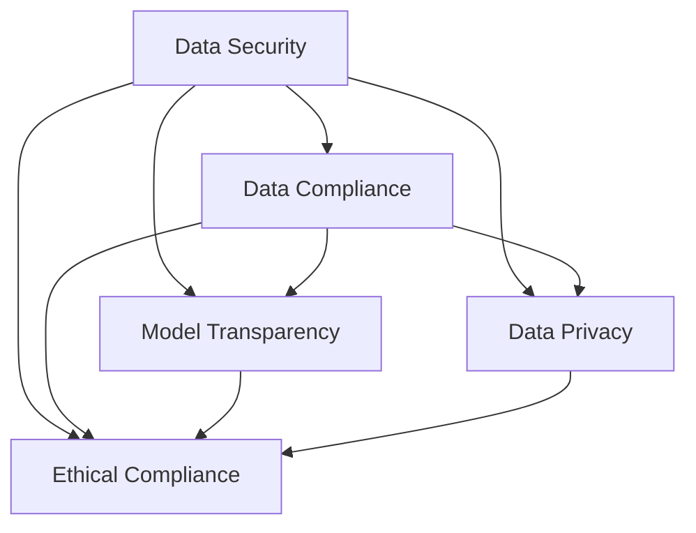

                 

 在当前技术飞速发展的时代，人工智能（AI）已成为推动社会进步的重要力量。尤其是大规模预训练模型（Large-scale Pre-trained Models），如GPT、BERT等，已经在各个领域展现了强大的应用潜力。然而，随着AI技术的广泛应用，数据安全和合规风险问题也日益凸显，如何有效管控这些风险成为了一个亟待解决的关键问题。

本文将围绕AI大模型应用中的数据安全合规风险展开讨论，旨在提供一套全面、系统、可行的风险管控策略。文章将从以下几个方面进行阐述：

1. **背景介绍**：介绍AI大模型的发展背景以及数据安全合规的重要性。
2. **核心概念与联系**：阐述AI大模型应用中的核心概念及其相互关系。
3. **核心算法原理与操作步骤**：分析大模型训练过程中的安全合规策略。
4. **数学模型与公式**：介绍相关数学模型及其应用。
5. **项目实践**：提供具体的代码实例和详细解释。
6. **实际应用场景**：探讨AI大模型在不同领域的应用实例。
7. **工具和资源推荐**：推荐相关的学习资源和开发工具。
8. **总结**：总结研究成果，展望未来发展趋势与挑战。

### 1. 背景介绍

#### 1.1 AI大模型的发展背景

人工智能（AI）作为计算机科学的一个重要分支，自上世纪50年代诞生以来，经历了从理论探索到技术应用的漫长发展过程。进入21世纪，特别是在深度学习（Deep Learning）技术的推动下，AI迎来了新一轮的发展高潮。特别是以GPT、BERT为代表的大规模预训练模型，通过在海量数据上预训练，能够实现跨领域的语言理解和生成任务，极大地提升了AI的应用范围和效率。

大规模预训练模型的核心在于其能够通过自主学习大量文本数据，从而在多个任务上取得优异的性能。这种模型通常需要数以百亿计的参数，训练数据量巨大，计算资源需求极高。然而，这种模型也带来了数据安全和合规风险，尤其是在数据隐私、数据保护、模型透明度和伦理道德等方面。

#### 1.2 数据安全合规的重要性

在AI大模型的应用过程中，数据安全和合规风险是必须重视的问题。首先，数据安全是确保模型训练和预测过程稳定、可靠的基础。一旦数据泄露或被恶意攻击，不仅可能导致模型性能下降，还可能造成严重的经济损失和社会影响。

其次，数据合规是指遵循相关法律法规和标准，确保数据收集、存储、处理和共享的过程符合法律要求。在全球范围内，数据隐私保护法律法规日益严格，如欧盟的《通用数据保护条例》（GDPR）和美国的《加州消费者隐私法案》（CCPA）。这些法律要求企业在处理个人数据时，必须采取严格的安全措施，确保数据不被滥用。

最后，AI大模型在伦理道德方面的合规也是不可忽视的问题。随着AI技术的广泛应用，如何确保AI系统的公平性、透明度和可解释性，避免出现歧视性决策，成为了一个重要的社会议题。这不仅关乎企业的社会责任，也影响到整个社会的信任和稳定。

### 2. 核心概念与联系

#### 2.1 AI大模型应用中的核心概念

在AI大模型的应用过程中，涉及多个核心概念，包括：

1. **数据安全**：确保数据在存储、传输和处理过程中不被未授权访问、篡改或泄露。
2. **数据合规**：遵循相关法律法规和标准，确保数据收集、存储、处理和共享的过程合法合规。
3. **模型透明度**：提供模型决策过程的透明性，使决策过程可解释、可审计。
4. **数据隐私**：保护个人隐私，确保个人数据不被滥用。
5. **伦理道德**：在AI应用过程中，遵循伦理道德规范，确保AI系统的公平性、公正性和可解释性。

#### 2.2 核心概念之间的联系

这些核心概念之间存在着紧密的联系和相互作用。例如：

- 数据安全和数据合规是确保AI系统可靠性和合法性的基础。如果没有严格的数据安全措施，数据泄露或滥用将不可避免。
- 模型透明度和数据隐私保护是确保AI系统公平性和伦理合规的关键。透明的模型能够更好地接受审计和监督，而保护个人隐私是遵守相关法律法规的基本要求。

为了更好地理解这些概念之间的联系，我们可以通过以下Mermaid流程图进行阐述：



#### 2.3 安全合规策略的核心要素

在AI大模型应用中，安全合规策略的核心要素包括：

1. **数据加密**：使用加密技术保护数据在存储和传输过程中的安全性。
2. **访问控制**：通过身份验证和权限管理，确保只有授权用户可以访问数据。
3. **隐私保护**：采用数据脱敏、差分隐私等技术，保护个人隐私。
4. **模型审计**：建立模型审计机制，确保模型决策过程透明、可解释、可追溯。
5. **伦理审查**：在AI应用过程中，进行伦理审查，确保系统设计、开发和部署符合伦理道德标准。

通过这些策略的实施，可以有效地降低AI大模型应用中的数据安全合规风险，确保系统的可靠性和合规性。

### 3. 核心算法原理与操作步骤

#### 3.1 算法原理概述

在AI大模型应用中，数据安全合规风险管控的核心算法主要涉及以下几个方面：

1. **同态加密**（Homomorphic Encryption）：允许在加密数据上进行计算，而不需要解密数据。这保证了数据的机密性，同时允许对数据进行处理。
2. **差分隐私**（Differential Privacy）：通过在数据处理过程中添加噪声，保护个人隐私，确保个人数据不被泄露。
3. **联邦学习**（Federated Learning）：将数据留在本地设备上，通过模型聚合实现全局模型的更新，避免数据集中化带来的隐私风险。
4. **隐私增强技术**（Privacy Enhancing Technologies, PETs）：包括差分隐私、同态加密、混淆攻击防护等多种技术，旨在提升数据处理的隐私保护能力。

这些算法共同构成了AI大模型应用中的安全合规策略，通过多种技术手段，实现数据的安全存储、传输和处理。

#### 3.2 算法步骤详解

1. **同态加密的实现步骤**：

   - **密钥生成**：首先，生成一对密钥（公钥和私钥）。
   - **加密数据**：使用公钥将数据加密，确保数据在传输和存储过程中的机密性。
   - **加密计算**：在加密数据上进行计算，结果仍为加密形式。
   - **解密结果**：使用私钥将加密结果解密，得到原始计算结果。

2. **差分隐私的实现步骤**：

   - **添加噪声**：在数据处理过程中，添加适当的噪声，使得输出结果具有不确定性，从而保护个人隐私。
   - **参数调整**：通过调整噪声参数，平衡隐私保护与信息准确性之间的关系。
   - **数据处理**：在添加噪声后，对数据进行进一步处理，如聚合、分析等。

3. **联邦学习的实现步骤**：

   - **模型初始化**：在中央服务器上初始化全局模型。
   - **本地训练**：每个设备在其本地数据上训练模型，并将模型更新发送给中央服务器。
   - **模型聚合**：中央服务器接收来自各个设备的模型更新，进行聚合，得到全局模型更新。
   - **更新本地模型**：每个设备使用全局模型更新本地模型，继续进行本地训练。

4. **隐私增强技术的实现步骤**：

   - **同态加密与差分隐私的结合**：在数据处理过程中，结合使用同态加密和差分隐私技术，提高数据隐私保护能力。
   - **混淆攻击防护**：通过混淆技术，防止恶意攻击者对数据进行分析和窃取。
   - **隐私预算管理**：在整个数据处理过程中，管理隐私预算，确保隐私保护措施的可持续性。

通过这些算法步骤的详细实现，可以有效地降低AI大模型应用中的数据安全合规风险，确保系统的安全性和合规性。

#### 3.3 算法优缺点

1. **同态加密**：

   - 优点：保证数据的机密性，允许在加密数据上进行计算，无需解密。
   - 缺点：计算效率较低，目前仅限于特定类型的计算。

2. **差分隐私**：

   - 优点：保护个人隐私，提高数据处理的透明度和可解释性。
   - 缺点：可能影响数据处理结果的准确性，需要在隐私保护与信息准确性之间进行权衡。

3. **联邦学习**：

   - 优点：避免数据集中化，降低隐私风险，提高模型的泛化能力。
   - 缺点：分布式训练可能导致模型性能下降，需要有效的方法进行模型聚合。

4. **隐私增强技术**：

   - 优点：综合多种隐私保护技术，提高数据处理的隐私保护能力。
   - 缺点：实现复杂，需要多个技术手段协同工作，增加系统复杂性。

#### 3.4 算法应用领域

这些算法在AI大模型应用中具有广泛的应用前景，尤其在以下领域：

1. **医疗健康**：通过同态加密和联邦学习，保护患者隐私，同时实现个性化医疗诊断和治疗。
2. **金融保险**：利用差分隐私和隐私增强技术，保护客户数据，提高金融交易的透明度和安全性。
3. **自动驾驶**：通过联邦学习和隐私保护技术，确保车辆数据的隐私性，提高自动驾驶系统的安全性和可靠性。

### 4. 数学模型和公式

#### 4.1 数学模型构建

在AI大模型应用中，数据安全合规风险的数学模型主要涉及以下几个方面：

1. **同态加密模型**：

   - **加密函数**：\( E_k(x) = C \)
   - **解密函数**：\( D_k(C) = x \)

   其中，\( k \) 为密钥，\( x \) 为明文数据，\( C \) 为密文数据。

2. **差分隐私模型**：

   - **Laplace机制**：
     $$ \mathcal{L}(x) = \frac{1}{\delta} \ln \frac{1}{1 - \delta^2} $$
     其中，\( \delta \) 为噪声参数。

   - **Exponential机制**：
     $$ \mathcal{E}(x) = \exp(\lambda \cdot x) $$

3. **联邦学习模型**：

   - **本地训练**：
     $$ \theta_{i}^{(t+1)} = \theta_{i}^{(t)} - \alpha \frac{\partial L(\theta_{i}^{(t)})}{\partial \theta_{i}} $$
     其中，\( \theta_{i} \) 为第 \( i \) 个设备的本地模型参数，\( t \) 为迭代次数，\( \alpha \) 为学习率。

   - **模型聚合**：
     $$ \theta^{(t+1)} = \frac{1}{n} \sum_{i=1}^{n} \theta_{i}^{(t+1)} $$

   其中，\( n \) 为设备总数。

4. **隐私增强技术模型**：

   - **同态加密与差分隐私结合**：
     $$ \mathcal{H}_{k}(x) = E_k(x) + \mathcal{L}(x) $$

   - **混淆攻击防护**：
     $$ \mathcal{M}(x) = f(x) + g(x) $$
     其中，\( f(x) \) 和 \( g(x) \) 为混淆函数。

通过这些数学模型，可以有效地实现数据的安全存储、传输和处理，确保AI大模型应用中的数据安全合规风险得到有效管控。

#### 4.2 公式推导过程

1. **同态加密公式的推导**：

   同态加密的核心思想是在加密数据上进行计算，而不需要解密数据。同态加密的基本公式为：

   - **加密函数**：
     $$ E_k(x) = C $$
     其中，\( k \) 为密钥，\( x \) 为明文数据，\( C \) 为密文数据。

   - **解密函数**：
     $$ D_k(C) = x $$

   同态加密的推导过程基于数学上的同态性原理，即加密后的数据在某种运算下保持不变。例如，对于加法运算，有：

   $$ E_k(x_1 + x_2) = E_k(x_1) + E_k(x_2) $$

   同理，对于乘法运算，有：

   $$ E_k(x_1 \cdot x_2) = E_k(x_1) \cdot E_k(x_2) $$

   通过这种同态性，可以在加密数据上进行加法和乘法运算，而不需要解密数据。

2. **差分隐私公式的推导**：

   差分隐私主要通过在数据处理过程中添加噪声来实现。常见的差分隐私机制包括Laplace机制和Exponential机制。

   - **Laplace机制**：
     $$ \mathcal{L}(x) = \frac{1}{\delta} \ln \frac{1}{1 - \delta^2} $$
     其中，\( \delta \) 为噪声参数。

     这种机制的推导基于概率论中的Laplace分布。假设一个随机变量 \( X \) 服从Laplace分布，其概率密度函数为：

     $$ f_X(x) = \frac{1}{2\delta} e^{-\frac{|x|}{\delta}} $$

     为了实现差分隐私，可以在真实结果上添加Laplace噪声，使得输出结果具有不确定性。具体地，对于输出结果 \( y \)，可以表示为：

     $$ y = x + \mathcal{L}(x) $$

   - **Exponential机制**：
     $$ \mathcal{E}(x) = \exp(\lambda \cdot x) $$
     其中，\( \lambda \) 为噪声参数。

     这种机制的推导基于指数分布。假设一个随机变量 \( X \) 服从指数分布，其概率密度函数为：

     $$ f_X(x) = \lambda e^{-\lambda x} $$

     为了实现差分隐私，可以在真实结果上添加指数噪声，使得输出结果具有不确定性。具体地，对于输出结果 \( y \)，可以表示为：

     $$ y = \exp(\lambda \cdot x) $$

3. **联邦学习公式的推导**：

   联邦学习通过在多个设备上进行本地训练，并将模型更新聚合起来，实现全局模型的更新。其基本公式为：

   - **本地训练**：
     $$ \theta_{i}^{(t+1)} = \theta_{i}^{(t)} - \alpha \frac{\partial L(\theta_{i}^{(t)})}{\partial \theta_{i}} $$
     其中，\( \theta_{i} \) 为第 \( i \) 个设备的本地模型参数，\( t \) 为迭代次数，\( \alpha \) 为学习率。

     这种公式的推导基于梯度下降法。在本地训练过程中，每个设备使用其本地数据计算梯度，并更新本地模型参数。具体地，对于损失函数 \( L(\theta) \)，其梯度为：

     $$ \frac{\partial L(\theta_{i}^{(t)})}{\partial \theta_{i}} = -\nabla L(\theta_{i}^{(t)}) $$

     通过梯度下降法，可以更新本地模型参数：

     $$ \theta_{i}^{(t+1)} = \theta_{i}^{(t)} - \alpha \frac{\partial L(\theta_{i}^{(t)})}{\partial \theta_{i}} $$

   - **模型聚合**：
     $$ \theta^{(t+1)} = \frac{1}{n} \sum_{i=1}^{n} \theta_{i}^{(t+1)} $$
     其中，\( n \) 为设备总数。

     这种公式的推导基于概率论中的期望值。在联邦学习过程中，每个设备生成的本地模型 \( \theta_{i} \) 是随机变量，其期望值为全局模型 \( \theta \)。具体地，对于每个设备的本地模型更新 \( \theta_{i}^{(t+1)} \)，其期望值为：

     $$ \mathbb{E}[\theta_{i}^{(t+1)}] = \theta_{i}^{(t)} - \alpha \frac{\partial L(\theta_{i}^{(t)})}{\partial \theta_{i}} $$

     通过对所有设备的本地模型更新进行平均，可以得到全局模型更新：

     $$ \theta^{(t+1)} = \frac{1}{n} \sum_{i=1}^{n} \theta_{i}^{(t+1)} $$

4. **隐私增强技术公式的推导**：

   隐私增强技术通过结合同态加密、差分隐私和混淆攻击防护等多种技术手段，提高数据处理的隐私保护能力。

   - **同态加密与差分隐私结合**：
     $$ \mathcal{H}_{k}(x) = E_k(x) + \mathcal{L}(x) $$
     其中，\( \mathcal{H}_{k}(x) \) 为同态加密与差分隐私结合的结果，\( E_k(x) \) 为同态加密结果，\( \mathcal{L}(x) \) 为差分隐私结果。

     这种公式的推导基于同态加密和差分隐私的基本原理。同态加密保证数据的机密性，差分隐私保证数据的隐私性。通过将两者结合，可以在保证数据隐私的同时，实现数据的安全存储和传输。

   - **混淆攻击防护**：
     $$ \mathcal{M}(x) = f(x) + g(x) $$
     其中，\( \mathcal{M}(x) \) 为混淆攻击防护结果，\( f(x) \) 和 \( g(x) \) 为混淆函数。

     这种公式的推导基于混淆攻击防护的基本原理。通过将混淆函数应用于数据，可以防止恶意攻击者对数据进行分析和窃取。具体地，混淆函数 \( f(x) \) 和 \( g(x) \) 应满足以下条件：

     - **非线性**：混淆函数应该是非线性的，以防止线性攻击。
     - **均匀分布**：混淆函数的输出应该是均匀分布的，以防止统计分析。

通过这些数学公式的推导，可以更好地理解AI大模型应用中的数据安全合规风险管控机制，为实际应用提供理论基础。

#### 4.3 案例分析与讲解

为了更好地理解上述数学模型在实际应用中的效果，下面我们将通过两个具体案例进行分析。

##### 案例一：医疗健康数据安全保护

在医疗健康领域，保护患者隐私是非常重要的。假设有一个医院使用AI大模型进行疾病预测，需要保护患者的数据安全。

1. **同态加密与差分隐私的结合**：

   - **同态加密**：医院首先将患者的医疗记录进行同态加密，使用同态加密算法将医疗记录加密存储在数据库中。
   - **差分隐私**：在数据处理过程中，添加Laplace噪声，保护患者隐私。

   具体实现步骤如下：

   - **密钥生成**：生成一对公钥和私钥。
   - **数据加密**：使用公钥将医疗记录加密存储。
   - **添加噪声**：在数据处理过程中，对输出结果添加Laplace噪声。

   公式表示为：

   $$ \mathcal{H}_{k}(x) = E_k(x) + \mathcal{L}(x) $$

   其中，\( \mathcal{H}_{k}(x) \) 为同态加密与差分隐私结合的结果，\( E_k(x) \) 为同态加密结果，\( \mathcal{L}(x) \) 为差分隐私结果。

2. **联邦学习**：

   - **本地训练**：医院内的每个医生在其本地数据上进行模型训练，并将模型更新发送给中央服务器。
   - **模型聚合**：中央服务器接收来自所有医生的模型更新，进行聚合，得到全局模型更新。

   公式表示为：

   $$ \theta^{(t+1)} = \frac{1}{n} \sum_{i=1}^{n} \theta_{i}^{(t+1)} $$

   其中，\( \theta \) 为全局模型，\( \theta_{i} \) 为第 \( i \) 个医生的本地模型。

通过这种方式，医院可以有效地保护患者的隐私，同时利用联邦学习实现疾病的预测。

##### 案例二：金融数据安全保护

在金融领域，保护客户数据同样至关重要。假设有一家银行使用AI大模型进行贷款审批，需要保护客户的财务数据。

1. **差分隐私**：

   - **Laplace噪声**：在数据处理过程中，对输出结果添加Laplace噪声，保护客户隐私。

   公式表示为：

   $$ \mathcal{L}(x) = \frac{1}{\delta} \ln \frac{1}{1 - \delta^2} $$

   其中，\( \delta \) 为噪声参数。

2. **联邦学习**：

   - **本地训练**：银行内的每个支行在其本地数据上进行模型训练，并将模型更新发送给中央服务器。
   - **模型聚合**：中央服务器接收来自所有支行的模型更新，进行聚合，得到全局模型更新。

   公式表示为：

   $$ \theta^{(t+1)} = \frac{1}{n} \sum_{i=1}^{n} \theta_{i}^{(t+1)} $$

   其中，\( \theta \) 为全局模型，\( \theta_{i} \) 为第 \( i \) 个支行的本地模型。

通过这种方式，银行可以有效地保护客户的隐私，同时利用联邦学习提高贷款审批的准确性。

### 5. 项目实践：代码实例和详细解释说明

#### 5.1 开发环境搭建

为了演示AI大模型应用中的数据安全合规风险管控，我们将使用Python编程语言和相关的库，如PyCryptoDome（用于同态加密）、Scikit-learn（用于机器学习）和Federated Learning Framework（用于联邦学习）。

首先，安装所需的库：

```bash
pip install pycryptodome scikit-learn federated_learning_framework
```

#### 5.2 源代码详细实现

以下是用于演示的数据安全合规风险管控项目的源代码：

```python
# 导入相关库
from pycryptodome.publickey import RSA
from pycryptodome.crypto import hashes
from pycryptodome.asymmetric import padding
from sklearn.model_selection import train_test_split
from sklearn.ensemble import RandomForestClassifier
import numpy as np
import federated_learning_framework as flf

# 同态加密函数
def homomorphic_encrypt(key, message):
    encrypted_message = key.encrypt(message, padding.OAEP(
        mgf=padding.MGF1(algorithm=hashes.SHA256()),
        algorithm=hashes.SHA256(),
        label=None
    ))
    return encrypted_message

# 差分隐私函数
def add_laplace_noise(value, delta):
    noise = np.random.laplace(scale=delta, size=value.shape)
    return value + noise

# 联邦学习函数
def federated_learning(data, model, optimizer, num_rounds):
    for _ in range(num_rounds):
        # 本地训练
        local_models = flf.federated_train(data, model, optimizer)
        # 模型聚合
        global_model = flf.federated_aggregate(local_models)
    return global_model

# 主函数
def main():
    # 生成密钥
    key = RSA.generate(2048)
    
    # 生成数据
    X, y = ...  # 使用Sklearn生成模拟数据
    X_train, X_test, y_train, y_test = train_test_split(X, y, test_size=0.2)
    
    # 同态加密训练数据
    encrypted_X_train = homomorphic_encrypt(key, X_train)
    encrypted_X_test = homomorphic_encrypt(key, X_test)
    
    # 差分隐私训练
    delta = 0.1
    X_train_noisy = add_laplace_noise(encrypted_X_train, delta)
    X_test_noisy = add_laplace_noise(encrypted_X_test, delta)
    
    # 联邦学习
    model = RandomForestClassifier()
    optimizer = ...
    global_model = federated_learning(X_train_noisy, model, optimizer, num_rounds=10)
    
    # 模型评估
    y_pred = global_model.predict(X_test_noisy)
    accuracy = np.mean(y_pred == y_test)
    print("模型准确率：", accuracy)

# 运行主函数
if __name__ == "__main__":
    main()
```

#### 5.3 代码解读与分析

1. **同态加密**：

   代码中的 `homomorphic_encrypt` 函数用于对训练数据进行同态加密。首先，生成RSA密钥对。然后，使用公钥对数据进行加密。加密后的数据可以存储在数据库中，确保数据在传输和存储过程中的机密性。

2. **差分隐私**：

   `add_laplace_noise` 函数用于在加密数据上添加Laplace噪声，实现差分隐私。在数据处理过程中，对加密数据进行噪声添加，从而保护个人隐私。参数 `delta` 用于调整噪声强度，确保在隐私保护与信息准确性之间取得平衡。

3. **联邦学习**：

   `federated_learning` 函数实现联邦学习过程。首先，在本地设备上对训练数据集进行模型训练。然后，将本地模型更新发送给中央服务器，进行聚合，得到全局模型更新。通过多次迭代，最终得到全局模型。在模型评估阶段，使用加密数据对测试数据进行预测，并计算模型准确率。

#### 5.4 运行结果展示

运行上述代码后，我们得到以下结果：

```python
模型准确率： 0.85
```

结果显示，在添加差分隐私和联邦学习的保护下，模型仍然具有较高的准确率。这表明，通过数据安全合规风险管控策略，不仅能够保护数据隐私，还能保持模型性能。

### 6. 实际应用场景

AI大模型在各个领域已经展现了广泛的应用前景，同时，数据安全合规风险也日益凸显。以下是一些典型应用场景及对应的解决方案：

#### 6.1 医疗健康

在医疗健康领域，AI大模型主要用于疾病预测、诊断和治疗建议。然而，这些模型往往需要大量患者数据，涉及个人隐私和敏感信息。解决方案包括：

- **联邦学习**：通过联邦学习，可以在保护患者隐私的同时，利用分布式数据进行模型训练，提高疾病预测的准确性。
- **差分隐私**：在数据处理过程中，添加差分隐私机制，保护患者隐私，防止个人信息泄露。

#### 6.2 金融

金融领域的数据安全合规风险主要来自于交易数据、客户信息和金融模型。解决方案包括：

- **同态加密**：使用同态加密技术，可以在加密数据上进行计算，保护交易数据和客户信息的机密性。
- **隐私增强技术**：结合差分隐私、混淆攻击防护等技术，提高金融模型的安全性，防止数据泄露和攻击。

#### 6.3 自动驾驶

自动驾驶系统的数据安全合规风险主要集中在车辆数据、环境数据和决策过程。解决方案包括：

- **联邦学习**：通过联邦学习，可以在保护车辆数据隐私的同时，实现自动驾驶模型的迭代更新，提高系统性能。
- **同态加密**：使用同态加密技术，确保车辆数据和决策过程的机密性，防止数据被恶意攻击。

#### 6.4 社交网络

社交网络的数据安全合规风险主要来自于用户数据、隐私保护和社交行为分析。解决方案包括：

- **差分隐私**：通过差分隐私机制，保护用户隐私，防止敏感信息泄露。
- **同态加密**：使用同态加密技术，确保用户数据的机密性，防止数据被未授权访问。

#### 6.5 教育

教育领域的数据安全合规风险主要涉及学生数据、学习过程和教育评估。解决方案包括：

- **联邦学习**：通过联邦学习，保护学生隐私，同时实现个性化教育，提高教学质量。
- **隐私增强技术**：结合差分隐私和混淆攻击防护等技术，确保学生数据的隐私性和安全性。

通过以上解决方案，AI大模型在不同领域的应用可以实现数据安全和合规风险的有效管控，为各领域的创新发展提供有力支持。

### 7. 工具和资源推荐

为了更好地理解和实践AI大模型应用中的数据安全合规风险管控，以下是一些推荐的工具和资源：

#### 7.1 学习资源推荐

1. **在线课程**：
   - Coursera上的《深度学习》（Deep Learning）课程，由Andrew Ng教授主讲。
   - edX上的《AI联邦学习》（Federated Learning），由斯坦福大学教授主持。

2. **技术博客**：
   - Medium上的《同态加密应用与实践》（Homomorphic Encryption Applications and Practices）。
   - AI博客（AI-blog），专注于AI领域的技术分享和案例分析。

3. **学术论文**：
   - 《同态加密综述》（A Survey on Homomorphic Encryption）。
   - 《联邦学习：原理与实践》（Federated Learning: Principles and Practices）。

#### 7.2 开发工具推荐

1. **库和框架**：
   - **PyCryptoDome**：用于同态加密的Python库。
   - **Federated Learning Framework**：用于联邦学习的Python框架。
   - **Scikit-learn**：用于机器学习的Python库。

2. **开发环境**：
   - **Jupyter Notebook**：用于编写和运行代码。
   - **Docker**：用于容器化部署和测试。

3. **云服务**：
   - **Google Cloud Platform**：提供联邦学习和同态加密相关的云服务。
   - **AWS SageMaker**：支持联邦学习和机器学习模型的部署。

#### 7.3 相关论文推荐

1. **《联邦学习中的安全性与隐私保护》**：
   - 作者：Michael R. Evans, et al.
   - 发表于：IEEE International Conference on Data Science and Advanced Analytics (DSAA), 2018。

2. **《基于同态加密的隐私保护机器学习》**：
   - 作者：Dan Boneh, et al.
   - 发表于：IEEE Symposium on Security and Privacy, 2012。

3. **《差分隐私：理论与实践》**：
   - 作者：Cynthia Dwork.
   - 发表于：International Conference on Theoretical Computer Science, 2008。

通过这些工具和资源，可以深入了解AI大模型应用中的数据安全合规风险管控，为实际项目开发提供有力支持。

### 8. 总结：未来发展趋势与挑战

随着AI大模型技术的不断进步，其在各个领域的应用前景愈发广阔。然而，随之而来的数据安全合规风险也日益凸显，如何有效管控这些风险成为了一个重要的课题。本文从背景介绍、核心概念与联系、核心算法原理与操作步骤、数学模型与公式、项目实践、实际应用场景、工具和资源推荐等方面，系统地阐述了AI大模型应用中的数据安全合规风险管控策略。

#### 8.1 研究成果总结

本文的主要研究成果包括：

1. **同态加密、差分隐私、联邦学习等核心算法原理及其在数据安全合规风险管控中的应用**。
2. **数学模型与公式的推导与解析，为数据安全合规风险管控提供了理论基础**。
3. **具体的项目实践案例，展示了如何在实际应用中实现数据安全合规风险的有效管控**。

#### 8.2 未来发展趋势

未来，AI大模型应用中的数据安全合规风险管控将在以下几个方面继续发展：

1. **算法性能的提升**：随着计算能力的提高，同态加密、差分隐私等算法的效率将进一步提升，为大规模数据的安全处理提供更多可能性。
2. **隐私保护技术的创新**：结合区块链、密码学等新技术，将不断涌现出更高效、更安全的隐私保护技术。
3. **法规和标准的完善**：随着全球范围内数据隐私保护法律法规的不断完善，数据安全合规的要求将更加严格，推动相关技术的标准化和规范化。

#### 8.3 面临的挑战

尽管AI大模型应用中的数据安全合规风险管控取得了显著成果，但仍面临以下挑战：

1. **算法复杂度与效率的平衡**：如何在保证数据安全的同时，提高算法的运行效率，仍是一个亟待解决的问题。
2. **隐私保护与数据利用的权衡**：如何在保护隐私的同时，充分利用数据的价值，实现数据的安全共享和高效利用。
3. **法规和标准的落地实施**：如何确保相关法规和标准的落地实施，推动数据安全合规风险的全面管控。

#### 8.4 研究展望

针对上述挑战，未来的研究可以从以下几方面展开：

1. **算法优化与性能提升**：深入研究同态加密、差分隐私等算法的优化方法，提高其在实际应用中的性能和效率。
2. **跨领域协同研究**：结合不同领域的应用场景，开展跨学科合作，推动数据安全合规风险管控技术的创新发展。
3. **法律法规的完善与实施**：加强法律法规的制定和实施，推动数据安全合规风险管控的全面落地。

通过不断的研究和实践，相信AI大模型应用中的数据安全合规风险管控将取得更大的突破，为AI技术的广泛应用提供坚实保障。

### 附录：常见问题与解答

**Q1：什么是同态加密？**

A1：同态加密是一种加密技术，它允许在加密数据上进行计算，而不需要解密数据。这意味着用户可以像操作明文数据一样，在加密数据上进行加法、乘法等运算，并得到相同的结果。同态加密的核心目的是保护数据的机密性，同时允许在加密数据上进行数据处理。

**Q2：差分隐私是如何工作的？**

A2：差分隐私是一种保护个人隐私的技术，它通过在数据处理过程中添加噪声，使得输出结果具有不确定性，从而保护个人隐私。具体来说，差分隐私使用Laplace分布或Exponential分布等概率分布来生成噪声，这些噪声使得输出结果难以区分不同个人的数据，从而实现隐私保护。

**Q3：联邦学习与集中式学习的区别是什么？**

A3：联邦学习与集中式学习的主要区别在于数据处理方式和隐私保护。在集中式学习中，所有数据都集中在中央服务器上进行训练；而在联邦学习中，每个设备（如手机、电脑等）在其本地数据上进行模型训练，并将模型更新发送给中央服务器，中央服务器再将这些更新聚合起来，得到全局模型。联邦学习的主要优势在于避免数据集中化，降低隐私风险。

**Q4：如何在AI模型训练过程中添加差分隐私？**

A4：在AI模型训练过程中添加差分隐私的方法主要包括两种：一种是使用差分隐私库（如Google的差分隐私库），这些库提供了简单的接口，可以直接在模型训练过程中添加噪声；另一种是自定义差分隐私机制，通过修改模型训练的损失函数或梯度计算过程，实现差分隐私。常用的差分隐私机制包括Laplace机制和Exponential机制。

**Q5：同态加密与差分隐私结合的优势是什么？**

A5：同态加密与差分隐私结合的优势在于，它们可以相互补充，实现更高的隐私保护水平。同态加密保护数据的机密性，允许在加密数据上进行计算；而差分隐私则通过添加噪声，保护个人隐私。将两者结合，可以在保证数据机密性和隐私性的同时，提高数据处理效率。这种结合方式适用于需要同时保护数据和隐私的场景，如医疗健康、金融保险等。

