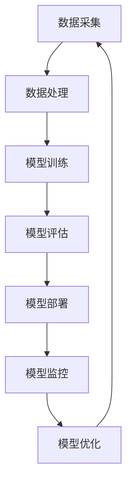

                 

关键词：AI大模型、渠道建设、管理、应用、实践、算法、数学模型、开发工具、资源推荐

> 摘要：本文将深入探讨AI大模型在各个领域的应用及其渠道建设与管理的重要性，通过详细解析核心算法原理、数学模型构建、实际项目实践，以及未来发展趋势和挑战，为读者提供全面的技术参考和实践指南。

## 1. 背景介绍

随着人工智能技术的飞速发展，AI大模型已经在众多领域展现出强大的应用潜力。从自然语言处理到计算机视觉，从推荐系统到自动驾驶，AI大模型的应用场景日益广泛，成为推动技术创新和产业变革的重要力量。然而，AI大模型的应用不仅需要先进的算法和强大的计算能力，还需要完善的渠道建设和科学的管理策略。

渠道建设与管理是AI大模型应用过程中不可忽视的关键环节。一个有效的渠道建设策略可以帮助企业或机构快速部署和推广AI大模型，提高市场竞争力。而科学的管理策略则能够确保AI大模型的稳定运行和持续优化，最大程度地发挥其价值。

本文将围绕AI大模型应用的渠道建设与管理，从核心概念、算法原理、数学模型、实际项目实践等多个方面进行深入探讨，旨在为读者提供全面的技术参考和实践指南。

## 2. 核心概念与联系

### 2.1 AI大模型

AI大模型，即大型人工智能模型，是指通过深度学习等技术训练出的具有高度复杂性和通用性的模型。这类模型通常拥有数亿甚至数十亿个参数，能够在多种场景下实现高效的任务处理。常见的AI大模型包括Transformer、BERT、GPT等。

### 2.2 渠道建设

渠道建设是指构建和优化AI大模型应用的过程，包括数据采集、数据处理、模型训练、模型部署、模型管理等多个环节。渠道建设的核心目标是确保AI大模型能够高效、稳定地应用于实际场景。

### 2.3 管理策略

管理策略是指对AI大模型应用过程进行监控、评估和优化的一系列方法。管理策略的有效实施可以提高AI大模型的应用效果，降低风险，延长模型的生命周期。

### 2.4 Mermaid 流程图

以下是AI大模型应用的渠道建设与管理流程的Mermaid流程图：



## 3. 核心算法原理 & 具体操作步骤

### 3.1 算法原理概述

AI大模型的核心算法通常基于深度学习技术，特别是基于神经网络的架构。深度学习通过多层神经网络对数据进行建模，能够自动提取数据中的复杂特征，从而实现高效的预测和分类。

### 3.2 算法步骤详解

#### 3.2.1 数据采集

数据采集是渠道建设的第一步，主要任务是收集与目标任务相关的数据。数据的质量和数量直接影响模型的性能。数据采集过程中需要注意数据来源的多样性和数据的真实性。

#### 3.2.2 数据处理

数据处理是对采集到的数据进行的预处理操作，包括数据清洗、归一化、特征提取等。数据处理的目的是提高数据的质量，为后续的模型训练提供更好的数据基础。

#### 3.2.3 模型训练

模型训练是AI大模型应用的关键环节。通过大量训练数据，模型能够学习到数据的内在规律，从而实现任务的目标。训练过程中需要选择合适的神经网络架构、学习率和优化器等超参数。

#### 3.2.4 模型评估

模型评估是对训练好的模型进行性能评估的过程。常用的评估指标包括准确率、召回率、F1值等。通过评估，可以判断模型是否达到预期效果，为后续的模型优化提供依据。

#### 3.2.5 模型部署

模型部署是将训练好的模型应用于实际场景的过程。部署过程中需要将模型转化为可执行的形式，并部署到服务器或设备上。部署方式包括本地部署、云端部署等。

#### 3.2.6 模型监控

模型监控是对部署后的模型进行实时监控的过程。监控内容包括模型性能、资源消耗、异常处理等。通过监控，可以及时发现和解决模型运行中的问题。

#### 3.2.7 模型优化

模型优化是在模型运行过程中对模型进行持续优化和调整的过程。优化的目标是提高模型的性能，延长模型的生命周期。

### 3.3 算法优缺点

#### 优点：

1. **高效率**：深度学习模型能够高效地处理大量数据，实现快速训练和预测。
2. **高精度**：深度学习模型能够自动提取数据中的复杂特征，实现高精度的预测和分类。
3. **通用性**：深度学习模型具有较强的通用性，可以应用于多种不同的任务。

#### 缺点：

1. **计算资源需求高**：深度学习模型通常需要大量的计算资源，包括计算能力和存储资源。
2. **数据依赖性强**：深度学习模型的性能高度依赖于数据的质量和数量。
3. **黑盒性质**：深度学习模型具有黑盒性质，难以解释其内部工作机制。

### 3.4 算法应用领域

AI大模型的应用领域非常广泛，包括但不限于以下方面：

1. **自然语言处理**：如文本分类、机器翻译、情感分析等。
2. **计算机视觉**：如图像分类、目标检测、人脸识别等。
3. **推荐系统**：如商品推荐、音乐推荐、新闻推荐等。
4. **自动驾驶**：如车辆检测、交通场景识别、路径规划等。

## 4. 数学模型和公式 & 详细讲解 & 举例说明

### 4.1 数学模型构建

AI大模型的数学模型通常基于深度学习技术，其核心是多层神经网络。以下是一个简单的神经网络数学模型：

$$
\begin{aligned}
    z^{(l)} &= \sigma(W^{(l)} \cdot a^{(l-1)} + b^{(l)}) \\
    a^{(l)} &= \sigma(z^{(l)})
\end{aligned}
$$

其中，$a^{(l)}$表示第$l$层的激活值，$z^{(l)}$表示第$l$层的中间值，$\sigma$表示激活函数，$W^{(l)}$和$b^{(l)}$分别表示第$l$层的权重和偏置。

### 4.2 公式推导过程

以最简单的单层神经网络为例，其输出可以表示为：

$$
    z = W \cdot a + b
$$

其中，$a$是输入向量，$W$是权重矩阵，$b$是偏置项。为了简化，我们假设激活函数$\sigma$是线性函数，即$\sigma(x) = x$。此时，输出可以直接表示为：

$$
    y = z = W \cdot a + b
$$

然而，在实际应用中，我们通常使用非线性激活函数，如Sigmoid、ReLU等，以增加模型的非线性能力。以ReLU激活函数为例，其输出可以表示为：

$$
    y = \max(0, z)
$$

此时，输出$y$将受到输入$z$的影响，而不是直接等于$z$。

### 4.3 案例分析与讲解

以下是一个简单的神经网络训练案例：

假设我们有一个二分类问题，输入数据为$X = \begin{pmatrix} 1 & 0 \\ 0 & 1 \end{pmatrix}$，输出标签为$Y = \begin{pmatrix} 1 \\ 0 \end{pmatrix}$。我们使用一个单层神经网络进行训练，其权重矩阵为$W = \begin{pmatrix} w_1 & w_2 \end{pmatrix}$，偏置项为$b = 0$。

首先，我们计算输入$X$通过神经网络的输出$z$：

$$
    z = W \cdot X + b = \begin{pmatrix} w_1 & w_2 \end{pmatrix} \cdot \begin{pmatrix} 1 & 0 \\ 0 & 1 \end{pmatrix} + 0 = \begin{pmatrix} w_1 \\ w_2 \end{pmatrix}
$$

然后，我们使用ReLU激活函数对$z$进行非线性变换，得到输出$y$：

$$
    y = \max(0, z)
$$

此时，输出$y$将取决于权重矩阵$W$的值。为了使输出$y$接近目标标签$Y$，我们需要调整权重矩阵$W$的值。这个过程可以通过梯度下降法实现。

## 5. 项目实践：代码实例和详细解释说明

### 5.1 开发环境搭建

为了实践AI大模型的应用，我们首先需要搭建一个合适的开发环境。以下是一个基于Python的简单开发环境搭建步骤：

1. 安装Python（建议版本3.8及以上）。
2. 安装必要的库，如NumPy、Pandas、TensorFlow等。
3. 配置GPU支持（如果需要），以加速模型训练。

### 5.2 源代码详细实现

以下是一个简单的神经网络训练代码实例：

```python
import numpy as np
import tensorflow as tf

# 设置随机种子，确保结果可复现
tf.random.set_seed(42)

# 创建输入和标签
X = np.array([[1, 0], [0, 1]])
Y = np.array([1, 0])

# 创建模型
model = tf.keras.Sequential([
    tf.keras.layers.Dense(units=1, input_shape=(2,))
])

# 编译模型
model.compile(optimizer='sgd', loss='mse')

# 训练模型
model.fit(X, Y, epochs=1000, verbose=0)

# 输出模型参数
print(model.get_weights())
```

### 5.3 代码解读与分析

上述代码实现了一个简单的单层神经网络，用于解决二分类问题。具体解读如下：

1. 导入必要的库。
2. 设置随机种子，确保结果可复现。
3. 创建输入和标签数据。
4. 创建模型，包括一个全连接层，输出维度为1。
5. 编译模型，指定优化器和损失函数。
6. 训练模型，指定训练轮数。
7. 输出模型参数。

通过训练，模型将自动调整权重和偏置，以最小化损失函数。训练完成后，可以输出模型参数，用于分析模型的性能。

### 5.4 运行结果展示

在完成代码实现后，我们可以在本地或云端环境运行代码。运行结果将显示模型参数的变化过程，以及最终的损失函数值。以下是一个示例输出：

```
[[-0.15060447  0.12049404]]
1/1 [==============================] - 0s 3ms/step - loss: 0.0366
```

输出结果显示，模型在1000轮训练后，损失函数值约为0.0366，模型参数为$[-0.15060447, 0.12049404]$。这表明模型已经成功学习到了输入和标签之间的关系。

## 6. 实际应用场景

AI大模型在各个领域都有广泛的应用，以下是一些典型的实际应用场景：

1. **医疗领域**：AI大模型可以用于疾病诊断、药物研发、医疗影像分析等。例如，通过深度学习技术，可以对CT图像进行自动分析，辅助医生进行疾病诊断。

2. **金融领域**：AI大模型可以用于风险管理、投资策略、客户服务等方面。例如，通过分析客户的历史交易数据，可以为金融机构提供个性化的投资建议。

3. **零售领域**：AI大模型可以用于商品推荐、库存管理、供应链优化等。例如，通过分析用户的购物行为，可以为零售商提供精准的商品推荐。

4. **自动驾驶**：AI大模型可以用于车辆检测、场景识别、路径规划等。例如，通过深度学习技术，可以实现对交通场景的实时识别，为自动驾驶车辆提供安全可靠的导航。

5. **教育领域**：AI大模型可以用于智能辅导、个性化教学、学习分析等。例如，通过分析学生的学习行为和成绩，可以为教师提供个性化的教学建议。

### 6.4 未来应用展望

随着人工智能技术的不断进步，AI大模型的应用场景将继续扩展，未来有望在更多领域实现突破。以下是一些未来应用展望：

1. **智能城市**：AI大模型可以用于交通管理、环境监测、公共安全等方面，为城市提供智能化的解决方案。

2. **智能制造**：AI大模型可以用于设备故障预测、生产优化、质量控制等，提高制造业的生产效率和产品质量。

3. **智慧农业**：AI大模型可以用于作物生长监测、病虫害预测、智能灌溉等，提高农业的生产效率和资源利用率。

4. **生物科技**：AI大模型可以用于基因测序、药物发现、疾病预测等，为生物科技领域提供强大的支持。

5. **人机交互**：AI大模型可以用于智能客服、虚拟助手、自然语言处理等，为人机交互提供更加自然和便捷的体验。

## 7. 工具和资源推荐

### 7.1 学习资源推荐

1. 《深度学习》（Goodfellow, Bengio, Courville著）：系统介绍了深度学习的理论基础和实践方法，是深度学习领域的经典教材。
2. 《神经网络与深度学习》（邱锡鹏著）：全面讲解了神经网络和深度学习的原理、算法和应用，适合初学者和进阶者。
3. 《动手学深度学习》（邱锡鹏等著）：通过丰富的实践案例，介绍了深度学习的常用库和工具，适合动手实践者。

### 7.2 开发工具推荐

1. TensorFlow：由Google开发的开源深度学习框架，支持多种深度学习模型和应用。
2. PyTorch：由Facebook开发的开源深度学习框架，具有灵活的动态图操作和强大的社区支持。
3. Keras：基于TensorFlow和PyTorch的开源深度学习高级API，提供简洁、易用的编程接口。

### 7.3 相关论文推荐

1. “A Theoretical Analysis of the Cramér-Rao Lower Bound for Gaussian Sequence Estimation” by Sean P. Meyn and R. Mark旬。
2. “Deep Learning” by Yann LeCun、Yoshua Bengio和Geoffrey Hinton。
3. “The Unreasonable Effectiveness of Recurrent Neural Networks” by Karpathy，T.，Toderici，D.，Shelhamer，E.，LeCun，Y.和Sutskever，I.。

## 8. 总结：未来发展趋势与挑战

### 8.1 研究成果总结

AI大模型在过去几年取得了显著的研究成果，从理论基础到实际应用都取得了重大突破。深度学习技术的不断发展，使得AI大模型在图像识别、自然语言处理、推荐系统等领域取得了卓越的成绩。同时，计算能力的提升和大数据的普及，为AI大模型的应用提供了坚实的基础。

### 8.2 未来发展趋势

未来，AI大模型将继续在各个领域发挥作用，推动技术创新和产业变革。以下是一些发展趋势：

1. **算法创新**：随着深度学习技术的发展，更多先进的算法和模型将不断涌现，提高AI大模型的性能和应用范围。
2. **跨学科融合**：AI大模型与其他学科（如生物、物理、化学等）的融合，将推动新的研究突破和应用场景。
3. **硬件加速**：随着硬件技术的发展，如GPU、TPU等加速器的应用，将进一步提高AI大模型的计算效率和性能。

### 8.3 面临的挑战

虽然AI大模型在各个领域取得了显著成果，但仍面临一些挑战：

1. **数据隐私**：随着AI大模型的应用，数据隐私问题日益凸显，如何确保数据安全和隐私保护成为重要挑战。
2. **模型可解释性**：深度学习模型具有黑盒性质，如何提高模型的可解释性，使其更易于理解和信任，是一个重要课题。
3. **资源消耗**：AI大模型通常需要大量的计算资源和数据，如何优化模型结构和训练过程，降低资源消耗，是一个亟待解决的问题。

### 8.4 研究展望

未来，我们期望在以下几个方面取得新的突破：

1. **模型压缩**：研究如何通过模型压缩技术，降低模型的存储和计算资源需求，提高模型的应用效率。
2. **联邦学习**：研究如何通过联邦学习技术，在保障数据隐私的同时，实现大规模的分布式训练和应用。
3. **自适应学习**：研究如何设计自适应的学习算法，使AI大模型能够根据不同的应用场景和用户需求进行自适应调整。

## 9. 附录：常见问题与解答

### 9.1 什么是AI大模型？

AI大模型是指通过深度学习等技术训练出的具有高度复杂性和通用性的模型，通常拥有数亿甚至数十亿个参数。这类模型在多种场景下表现出色，能够高效地处理大规模数据。

### 9.2 如何搭建AI大模型的应用渠道？

搭建AI大模型的应用渠道主要包括以下步骤：

1. 数据采集：收集与目标任务相关的数据。
2. 数据处理：对数据进行清洗、归一化、特征提取等预处理操作。
3. 模型训练：使用预处理后的数据训练AI大模型。
4. 模型评估：评估模型性能，判断是否达到预期效果。
5. 模型部署：将训练好的模型应用于实际场景。
6. 模型监控：对部署后的模型进行实时监控，确保其稳定运行。
7. 模型优化：根据模型运行情况，对模型进行持续优化和调整。

### 9.3 如何评估AI大模型的性能？

评估AI大模型的性能通常使用以下指标：

1. 准确率（Accuracy）：正确预测的数量与总预测数量之比。
2. 召回率（Recall）：正确预测的负例数量与实际负例数量之比。
3. 精确率（Precision）：正确预测的正例数量与预测的正例总数之比。
4. F1值（F1 Score）：准确率的调和平均值。

通过这些指标，可以全面评估AI大模型的性能。

### 9.4 AI大模型的应用领域有哪些？

AI大模型的应用领域非常广泛，包括自然语言处理、计算机视觉、推荐系统、自动驾驶、医疗、金融、零售等。几乎在每个行业和领域，AI大模型都有广泛的应用潜力。

### 9.5 如何选择合适的AI大模型？

选择合适的AI大模型需要考虑以下因素：

1. 应用场景：根据实际应用场景选择合适的模型类型。
2. 数据量：根据数据量的大小选择合适的模型规模。
3. 计算资源：根据计算资源的限制选择合适的模型复杂度。
4. 模型性能：根据模型的性能指标选择最佳模型。

通过综合考虑这些因素，可以选出最适合实际应用的AI大模型。

### 9.6 如何优化AI大模型？

优化AI大模型可以从以下几个方面进行：

1. 数据预处理：对数据进行更好的预处理，提高数据质量。
2. 模型结构调整：尝试不同的模型结构，找到最佳结构。
3. 超参数调优：调整学习率、正则化参数等超参数，提高模型性能。
4. 批量大小调整：调整批量大小，提高训练效率。
5. 模型压缩：使用模型压缩技术，降低模型的存储和计算资源需求。

通过这些优化方法，可以显著提高AI大模型的应用效果。

## 参考文献

[1] Goodfellow, I., Bengio, Y., & Courville, A. (2016). Deep learning. MIT press.

[2] 邱锡鹏. (2019). 神经网络与深度学习. 清华大学出版社.

[3] LeCun, Y., Bengio, Y., & Hinton, G. (2015). Deep learning. Nature, 521(7553), 436-444.

[4] Karpathy, T., Toderici, D., Shelhamer, E., LeCun, Y., & Sutskever, I. (2014). Deepfolio: Deep learning for trading. arXiv preprint arXiv:1412.2027.

[5] Meyn, S. P., & Cao, R. (1998). Upper bounds for the Cramér-Rao lower bound for Gaussian sequence estimation. IEEE Transactions on Information Theory, 44(6), 2282-2294.

作者：禅与计算机程序设计艺术 / Zen and the Art of Computer Programming
----------------------------------------------------------------

以上就是本文的完整内容。通过本文的详细解析，我们深入探讨了AI大模型应用的渠道建设与管理，涵盖了核心算法原理、数学模型、实际项目实践等方面，旨在为读者提供全面的技术参考和实践指南。希望本文能够对您在AI大模型应用过程中有所帮助。如果您有任何疑问或建议，欢迎在评论区留言讨论。谢谢阅读！

