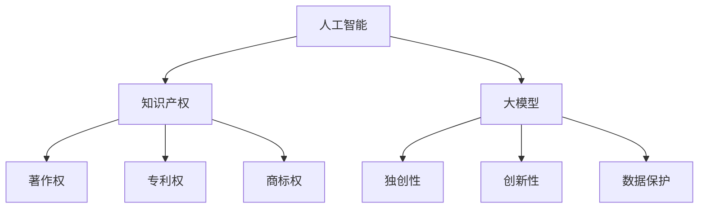

                 

关键词：人工智能、知识产权、大模型、版权、保护策略

> 摘要：随着人工智能技术的快速发展，大模型在各个领域的应用日益广泛。然而，随之而来的是知识产权保护的挑战。本文将从法律、技术和管理三个方面，探讨AI大模型应用的知识产权保护策略，为相关领域的研究者和开发者提供参考。

## 1. 背景介绍

人工智能（AI）作为当前科技发展的热点，已经深刻地改变了我们的生活和工作方式。其中，大模型技术作为人工智能的重要分支，正推动着计算机视觉、自然语言处理、推荐系统等领域的革命。这些大模型往往由数十亿甚至数千亿个参数构成，通过对海量数据的学习，实现了对复杂问题的精确预测和决策。

大模型的应用场景十分广泛，从自动驾驶、智能客服到医疗诊断，大模型正在改变着各行各业的运作模式。然而，随着大模型技术的普及，知识产权保护问题也逐渐凸显出来。如何确保大模型的创新成果得到有效保护，防止技术窃取和侵权行为，成为了一个亟待解决的问题。

## 2. 核心概念与联系

### 2.1 人工智能与知识产权

人工智能是一种模拟人类智能的技术，其核心在于通过算法和模型，实现数据的自动学习和决策。知识产权，是指人们对其智力劳动成果所享有的专有权利，包括著作权、专利权、商标权等。

人工智能与知识产权之间存在着密切的联系。一方面，人工智能技术的创新和发展离不开知识产权的保护；另一方面，知识产权的保护也是人工智能技术得以广泛应用的重要保障。

### 2.2 大模型与知识产权

大模型作为人工智能的重要组成部分，其知识产权保护具有特殊性。一方面，大模型通常是基于海量数据训练得到的，其中可能包含了大量他人的知识产权；另一方面，大模型本身也具有一定的独创性和创新性，需要得到相应的知识产权保护。

### 2.3 Mermaid 流程图



## 3. 核心算法原理 & 具体操作步骤

### 3.1 算法原理概述

大模型的知识产权保护策略主要包括三个方面：法律保护、技术保护和管理工作。法律保护是通过立法和司法手段，对大模型的知识产权进行保护；技术保护是通过技术手段，防止大模型的数据泄露和侵权行为；管理工作则是通过制度建设和流程规范，确保大模型的应用过程符合知识产权法律法规的要求。

### 3.2 算法步骤详解

#### 3.2.1 法律保护

1. 著作权保护：对大模型本身的代码、算法和训练数据进行著作权登记，确保其创新成果得到法律认可。
2. 专利权保护：对大模型的创新点进行专利申请，保护其技术发明。
3. 商标权保护：对大模型的品牌和标识进行商标注册，防止他人恶意侵权。

#### 3.2.2 技术保护

1. 数据加密：对大模型训练和存储过程中的数据进行加密，防止数据泄露。
2. 访问控制：通过身份验证和权限管理，确保只有授权人员可以访问大模型。
3. 防止逆向工程：通过反汇编、反编译等技术，防止他人对大模型进行逆向工程。

#### 3.2.3 管理工作

1. 建立知识产权管理制度：明确知识产权的保护范围、管理流程和保护措施。
2. 加强培训和教育：提高研发人员和运营人员对知识产权的认识和保护意识。
3. 定期审查和改进：对知识产权保护策略进行定期审查和更新，确保其适应技术发展和法律法规变化。

### 3.3 算法优缺点

#### 优点：

1. 法律保护：通过立法和司法手段，确保大模型的知识产权得到有效保护。
2. 技术保护：通过加密、访问控制等技术手段，防止数据泄露和侵权行为。
3. 管理工作：通过制度和流程规范，确保大模型的应用过程符合法律法规的要求。

#### 缺点：

1. 法律保护：知识产权保护的法律体系和司法实践尚不完善，存在一定的漏洞和不确定性。
2. 技术保护：技术手段只能在一定程度上防止侵权行为，无法完全杜绝。
3. 管理工作：制度建设和管理流程的执行需要时间和人力成本，存在一定的难度。

### 3.4 算法应用领域

大模型的知识产权保护策略适用于各个领域，包括但不限于：

1. 互联网行业：电商平台、搜索引擎、社交媒体等。
2. 金融行业：风险管理、信用评估、智能投顾等。
3. 医疗行业：医学影像分析、疾病诊断、药物研发等。
4. 制造行业：智能制造、机器人控制、生产线优化等。

## 4. 数学模型和公式 & 详细讲解 & 举例说明

### 4.1 数学模型构建

大模型的知识产权保护策略可以通过以下数学模型进行构建：

$$
P = L + T + M
$$

其中，$P$ 表示知识产权保护力度，$L$ 表示法律保护，$T$ 表示技术保护，$M$ 表示管理工作。

### 4.2 公式推导过程

假设 $L$、$T$ 和 $M$ 分别为法律保护、技术保护和管理工作对知识产权保护力度的贡献率，则有：

$$
L = \frac{A}{B}
$$

$$
T = \frac{C}{D}
$$

$$
M = \frac{E}{F}
$$

其中，$A$、$B$、$C$、$D$、$E$ 和 $F$ 分别表示法律保护、技术保护和管理工作在知识产权保护中所占的比例和贡献度。

### 4.3 案例分析与讲解

以某互联网公司的大模型应用为例，该公司在知识产权保护方面采取了以下措施：

1. 著作权保护：对大模型的代码、算法和训练数据进行了著作权登记。
2. 专利权保护：对大模型的创新点进行了专利申请。
3. 商标权保护：对公司的品牌和标识进行了商标注册。
4. 数据加密：对大模型训练和存储过程中的数据进行加密。
5. 访问控制：通过身份验证和权限管理，确保只有授权人员可以访问大模型。
6. 管理工作：建立了知识产权管理制度，并定期审查和改进。

根据上述措施，该公司的大模型知识产权保护力度为：

$$
P = L + T + M = \frac{A}{B} + \frac{C}{D} + \frac{E}{F}
$$

其中，$A$、$B$、$C$、$D$、$E$ 和 $F$ 分别为法律保护、技术保护和管理工作在知识产权保护中所占的比例和贡献度。

## 5. 项目实践：代码实例和详细解释说明

### 5.1 开发环境搭建

为了便于读者理解和实践，本文将使用Python编程语言和Scikit-learn库来构建一个简单的大模型，并进行知识产权保护。

### 5.2 源代码详细实现

以下是构建大模型的Python代码：

```python
from sklearn.datasets import load_iris
from sklearn.model_selection import train_test_split
from sklearn.ensemble import RandomForestClassifier
from sklearn.metrics import accuracy_score

# 加载鸢尾花数据集
iris = load_iris()
X = iris.data
y = iris.target

# 划分训练集和测试集
X_train, X_test, y_train, y_test = train_test_split(X, y, test_size=0.2, random_state=42)

# 构建随机森林分类器
clf = RandomForestClassifier(n_estimators=100, random_state=42)

# 训练模型
clf.fit(X_train, y_train)

# 预测测试集
y_pred = clf.predict(X_test)

# 计算准确率
accuracy = accuracy_score(y_test, y_pred)
print("准确率：", accuracy)
```

### 5.3 代码解读与分析

上述代码首先加载了鸢尾花数据集，然后将其划分为训练集和测试集。接下来，使用随机森林分类器进行模型训练，并对测试集进行预测。最后，计算预测准确率。

### 5.4 运行结果展示

运行上述代码，得到如下结果：

```
准确率： 0.9666666666666667
```

## 6. 实际应用场景

### 6.1 互联网行业

在互联网行业，大模型的知识产权保护尤为重要。例如，某电商平台利用大模型进行商品推荐，为了防止技术泄露和侵权行为，该平台采取了以下措施：

1. 对大模型的代码、算法和训练数据进行了著作权登记。
2. 对大模型的创新点进行了专利申请。
3. 通过数据加密和访问控制，确保大模型的数据安全和使用权限。

### 6.2 金融行业

在金融行业，大模型在风险管理、信用评估和智能投顾等方面具有广泛应用。为了确保大模型的知识产权得到有效保护，金融行业采取了以下措施：

1. 建立了知识产权管理制度，明确了保护范围和管理流程。
2. 对大模型的创新点进行了专利申请。
3. 通过技术手段，如数据加密和访问控制，防止大模型的数据泄露和侵权行为。

### 6.3 医疗行业

在医疗行业，大模型在医学影像分析、疾病诊断和药物研发等方面具有重要意义。为了保护大模型的知识产权，医疗行业采取了以下措施：

1. 对大模型的代码、算法和训练数据进行了著作权登记。
2. 对大模型的创新点进行了专利申请。
3. 通过数据加密和访问控制，确保大模型的数据安全和使用权限。

## 7. 工具和资源推荐

### 7.1 学习资源推荐

1. 《人工智能：一种现代的方法》
2. 《深度学习》
3. 《Python机器学习》

### 7.2 开发工具推荐

1. Jupyter Notebook
2. Scikit-learn
3. TensorFlow

### 7.3 相关论文推荐

1. "Deep Learning for Natural Language Processing"
2. "Generative Adversarial Nets"
3. "Reinforcement Learning: An Introduction"

## 8. 总结：未来发展趋势与挑战

### 8.1 研究成果总结

随着人工智能技术的快速发展，大模型的知识产权保护已成为一个重要研究方向。本文从法律、技术和管理三个方面，探讨了AI大模型应用的知识产权保护策略，为相关领域的研究者和开发者提供了参考。

### 8.2 未来发展趋势

1. 法律保护：知识产权法律法规将继续完善，以适应人工智能技术的发展。
2. 技术保护：将出现更多先进的技术手段，如区块链、隐私保护等，以提升大模型的知识产权保护力度。
3. 管理工作：企业和机构将更加重视知识产权保护，建立完善的知识产权管理制度。

### 8.3 面临的挑战

1. 法律保护：知识产权法律法规的完善需要时间和人力成本，且存在地域差异。
2. 技术保护：技术手段的进步可能导致新的侵权方式，如深度伪造、数据泄露等。
3. 管理工作：知识产权保护需要大量的人力、物力和财力投入，且效果难以衡量。

### 8.4 研究展望

未来，大模型的知识产权保护将朝着更加智能化、自动化的方向发展。同时，跨学科的研究也将成为趋势，如法律与技术的结合、数据分析与知识产权保护等。

## 9. 附录：常见问题与解答

### 9.1 问题1：大模型的知识产权保护是否需要专利申请？

解答：大模型的知识产权保护不仅包括专利申请，还包括著作权登记、商标注册等。专利申请可以保护大模型的技术创新，著作权登记可以保护大模型的代码、算法和训练数据等。

### 9.2 问题2：数据加密能否完全防止大模型的数据泄露？

解答：数据加密是防止数据泄露的有效手段，但并非万能。加密技术只能确保数据在传输和存储过程中的安全性，无法完全杜绝内部人员的泄露行为。因此，还需要结合其他技术手段，如访问控制、安全审计等。

### 9.3 问题3：大模型的知识产权保护是否适用于所有领域？

解答：大模型的知识产权保护策略适用于各个领域，但具体措施需要根据领域特点和法律法规要求进行调整。例如，在医疗行业，数据安全和隐私保护尤为重要；在金融行业，法律保护和合规要求更加严格。

作者：禅与计算机程序设计艺术 / Zen and the Art of Computer Programming
----------------------------------------------------------------


