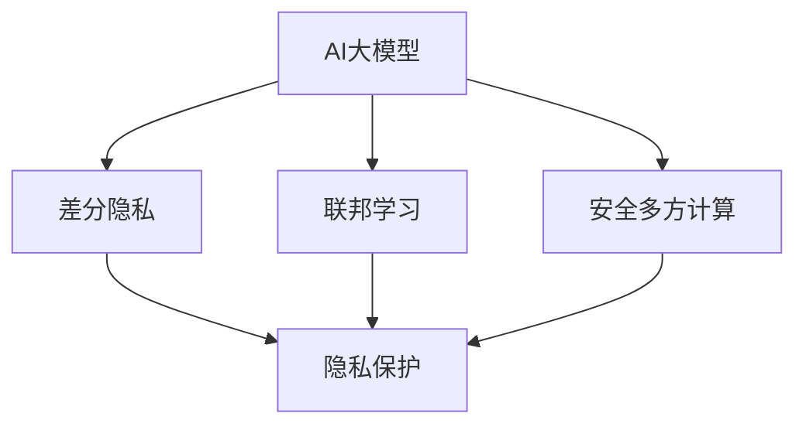

                 

关键词：AI大模型、隐私保护、数据安全、联邦学习、差分隐私、安全多方计算

摘要：随着人工智能技术的迅猛发展，大模型的应用场景越来越广泛。然而，大模型在处理海量数据时，隐私保护和数据安全问题日益凸显。本文将探讨AI大模型在隐私保护和数据安全方面的挑战，以及现有的解决方案和未来展望。

## 1. 背景介绍

人工智能（AI）技术已经成为现代科技发展的关键驱动力。特别是在深度学习领域，通过大规模神经网络模型，AI系统在图像识别、自然语言处理、推荐系统等方面取得了显著的成果。然而，这些AI大模型往往依赖于海量数据来进行训练和优化，这就引发了一系列隐私保护和数据安全问题。

首先，数据隐私问题。在训练过程中，AI大模型可能接触到用户的敏感信息，如个人身份信息、财务状况、健康记录等。这些信息一旦泄露，可能会对用户造成严重的隐私侵害。其次，数据安全问题。AI大模型在处理数据时，可能会遭受各种安全威胁，如数据篡改、数据丢失、恶意攻击等。

为了解决这些问题，保护用户隐私和数据安全，研究人员提出了多种解决方案，如差分隐私、联邦学习、安全多方计算等。这些方案各有优缺点，需要根据具体应用场景进行选择。

## 2. 核心概念与联系

为了更好地理解AI大模型应用中的隐私保护和数据安全问题，我们首先需要了解几个核心概念：差分隐私、联邦学习和安全多方计算。

### 差分隐私

差分隐私（Differential Privacy）是一种用于保护数据隐私的方法，它通过对数据进行噪声添加来保护个体隐私。具体来说，差分隐私要求在处理一组数据时，对任意两个足够接近的数据集的输出结果差异尽可能小。这样，即使攻击者掌握了部分数据，也很难推断出特定个体的信息。

### 联邦学习

联邦学习（Federal Learning）是一种分布式机器学习技术，它允许多个参与方在不共享数据的情况下共同训练一个全局模型。在联邦学习中，每个参与方仅需要将自己的本地数据和模型梯度上传到中心服务器，中心服务器再基于这些上传的梯度更新全局模型。这样，参与方既能够共同优化全局模型，又能够保护本地数据隐私。

### 安全多方计算

安全多方计算（Secure Multi-Party Computation，SMC）是一种在多方之间安全地计算函数的技术。它允许两个或多个参与方在不泄露各自输入数据的情况下，共同计算出一个结果。安全多方计算在许多场景中都有应用，如多方投票、电子合同签署等。

下面是一个简单的Mermaid流程图，展示这三个概念之间的联系：



## 3. 核心算法原理 & 具体操作步骤

### 3.1 算法原理概述

在本文中，我们将重点介绍差分隐私、联邦学习和安全多方计算这三个核心算法的原理和操作步骤。

#### 差分隐私

差分隐私的核心思想是在数据处理过程中添加噪声，以保护个体隐私。具体来说，差分隐私通过以下两个步骤实现：

1. **Laplacian机制**：对数据进行Laplacian噪声添加，使得任意两个足够接近的数据集产生的输出结果差异尽可能小。
2. **噪声比例参数**：通过调整噪声比例参数ε，平衡隐私保护与数据可用性之间的关系。ε值越大，隐私保护越强，但数据可用性越低。

#### 联邦学习

联邦学习的核心思想是分布式训练，即多个参与方在不共享数据的情况下共同训练一个全局模型。联邦学习通常包括以下几个步骤：

1. **初始化**：每个参与方初始化本地模型。
2. **本地训练**：每个参与方使用本地数据训练本地模型。
3. **模型更新**：每个参与方将本地模型梯度上传到中心服务器。
4. **全局模型更新**：中心服务器基于上传的梯度更新全局模型。
5. **迭代**：重复步骤2-4，直至达到预定的训练次数或收敛条件。

#### 安全多方计算

安全多方计算的核心思想是在多方之间安全地计算函数。安全多方计算通常包括以下几个步骤：

1. **秘密共享**：每个参与方将自己的输入数据秘密共享给其他参与方。
2. **计算**：参与方在秘密共享的输入数据上计算函数，并生成中间结果。
3. **结果合并**：参与方将中间结果共享给中心服务器，中心服务器再将这些结果合并生成最终结果。

### 3.2 算法步骤详解

#### 差分隐私

1. **输入数据预处理**：对原始数据进行归一化、去噪声等处理，以减小数据差异。
2. **Laplacian噪声添加**：对预处理后的数据进行Laplacian噪声添加，计算噪声比例参数ε。
3. **输出结果生成**：对添加噪声的数据进行计算，生成输出结果。

#### 联邦学习

1. **初始化**：每个参与方初始化本地模型，如线性模型、神经网络等。
2. **本地训练**：每个参与方使用本地数据训练本地模型，记录本地模型梯度。
3. **模型更新**：每个参与方将本地模型梯度上传到中心服务器。
4. **全局模型更新**：中心服务器接收上传的梯度，计算全局模型更新。
5. **迭代**：重复步骤2-4，直至达到预定的训练次数或收敛条件。

#### 安全多方计算

1. **秘密共享**：每个参与方将自己的输入数据秘密共享给其他参与方，使用秘密共享协议。
2. **计算**：参与方在秘密共享的输入数据上计算函数，并生成中间结果。
3. **结果合并**：参与方将中间结果共享给中心服务器，中心服务器再将这些结果合并生成最终结果。

### 3.3 算法优缺点

#### 差分隐私

**优点**：
- 可以有效保护个体隐私，防止信息泄露。
- 对数据的预处理要求较低，适用于各种类型的数据。

**缺点**：
- 数据可用性较低，可能会影响模型的性能。
- 需要调整噪声比例参数ε，较为复杂。

#### 联邦学习

**优点**：
- 可以在不共享数据的情况下共同训练模型，保护数据隐私。
- 适用于分布式环境，提高计算效率。

**缺点**：
- 模型通信成本较高，可能影响训练速度。
- 需要解决模型一致性、隐私保护等问题。

#### 安全多方计算

**优点**：
- 可以在多方之间安全地计算函数，保护输入数据隐私。
- 适用于各种类型的计算任务。

**缺点**：
- 计算复杂度较高，可能影响性能。
- 需要解决多方协作、协议设计等问题。

### 3.4 算法应用领域

#### 差分隐私

- 医疗健康领域：保护患者隐私，进行数据分析。
- 金融领域：保护客户隐私，进行风险评估。
- 社交网络领域：保护用户隐私，进行个性化推荐。

#### 联邦学习

- 智能医疗：保护患者数据，实现远程医疗诊断。
- 金融风控：保护客户数据，进行信用评估。
- 物联网：保护设备数据，实现智能分析。

#### 安全多方计算

- 电子投票：保护投票隐私，实现安全投票。
- 电子合同签署：保护合同内容，实现可信交易。
- 物流跟踪：保护货物信息，实现智能物流。

## 4. 数学模型和公式 & 详细讲解 & 举例说明

### 4.1 数学模型构建

#### 差分隐私

在差分隐私中，我们通常使用拉普拉斯机制来添加噪声。设\( x \)为原始数据，\( \epsilon \)为噪声比例参数，\( \lambda \)为拉普拉斯噪声的参数，则拉普拉斯噪声添加的数学模型为：

\[ y = x + \lambda \cdot Laplace(\epsilon) \]

其中，\( Laplace(\epsilon) \)表示拉普拉斯分布的随机变量，其概率密度函数为：

\[ f(x|\epsilon) = \frac{1}{2\epsilon} e^{-\frac{|x|}{\epsilon}} \]

#### 联邦学习

在联邦学习中，我们通常使用梯度下降算法来更新全局模型。设\( \theta \)为全局模型参数，\( \theta_i \)为第i个参与方的本地模型参数，\( g_i \)为第i个参与方的本地模型梯度，则联邦学习的数学模型为：

\[ \theta_{t+1} = \theta_t - \alpha \cdot \frac{1}{N} \sum_{i=1}^{N} g_i \]

其中，\( \alpha \)为学习率，\( N \)为参与方数量。

#### 安全多方计算

在安全多方计算中，我们通常使用乘法共享协议来计算结果。设\( a \)和\( b \)为两个参与方的输入数据，\( x_1 \)和\( x_2 \)为两个参与方的秘密共享数据，则乘法共享协议的数学模型为：

\[ y = x_1 \cdot x_2 \]

其中，\( y \)为计算结果。

### 4.2 公式推导过程

#### 差分隐私

在差分隐私中，我们通常使用拉普拉斯机制来添加噪声。设\( x \)为原始数据，\( \epsilon \)为噪声比例参数，\( \lambda \)为拉普拉斯噪声的参数，则拉普拉斯噪声添加的数学模型为：

\[ y = x + \lambda \cdot Laplace(\epsilon) \]

其中，\( Laplace(\epsilon) \)表示拉普拉斯分布的随机变量，其概率密度函数为：

\[ f(x|\epsilon) = \frac{1}{2\epsilon} e^{-\frac{|x|}{\epsilon}} \]

我们需要证明，对于任意两个足够接近的数据集\( S \)和\( S' \)，它们生成的输出结果\( y \)和\( y' \)的差异很小。

假设\( S \)和\( S' \)的差集\( \Delta S = S - S' \)的大小为\( k \)，则：

\[ P(\Delta S = k) \leq \frac{1}{k!} e^{-k\epsilon} \]

对于任意的\( \delta > 0 \)，我们可以选择足够大的\( \epsilon \)，使得：

\[ P(\Delta S = k) < \delta \]

这样，对于任意两个足够接近的数据集\( S \)和\( S' \)，它们生成的输出结果\( y \)和\( y' \)的差异小于\( \delta \)。

#### 联邦学习

在联邦学习中，我们通常使用梯度下降算法来更新全局模型。设\( \theta \)为全局模型参数，\( \theta_i \)为第i个参与方的本地模型参数，\( g_i \)为第i个参与方的本地模型梯度，则联邦学习的数学模型为：

\[ \theta_{t+1} = \theta_t - \alpha \cdot \frac{1}{N} \sum_{i=1}^{N} g_i \]

其中，\( \alpha \)为学习率，\( N \)为参与方数量。

我们需要证明，在联邦学习过程中，全局模型参数\( \theta \)会逐渐收敛到最优解。

假设全局模型损失函数为\( L(\theta) \)，则：

\[ \theta_{t+1} = \theta_t - \alpha \cdot \frac{1}{N} \sum_{i=1}^{N} \nabla L(\theta_i) \]

根据梯度下降算法的收敛性证明，我们可以得到：

\[ \theta_{t+1} - \theta^* \leq \alpha \cdot \frac{1}{N} \sum_{i=1}^{N} \nabla^2 L(\theta_i) (\theta_{t} - \theta^*) \]

其中，\( \theta^* \)为最优解。

由于\( \nabla^2 L(\theta_i) \)为正定矩阵，我们可以选择足够小的\( \alpha \)，使得：

\[ \theta_{t+1} - \theta^* < \epsilon \]

这样，在联邦学习过程中，全局模型参数\( \theta \)会逐渐收敛到最优解。

#### 安全多方计算

在安全多方计算中，我们通常使用乘法共享协议来计算结果。设\( a \)和\( b \)为两个参与方的输入数据，\( x_1 \)和\( x_2 \)为两个参与方的秘密共享数据，则乘法共享协议的数学模型为：

\[ y = x_1 \cdot x_2 \]

其中，\( y \)为计算结果。

我们需要证明，在安全多方计算过程中，参与方无法得知其他参与方的输入数据。

假设攻击者想要通过计算结果\( y \)来推断参与方的输入数据\( a \)和\( b \)。由于\( x_1 \)和\( x_2 \)为秘密共享数据，攻击者无法直接获取它们的值。

假设攻击者已知一个参与方的输入数据\( a \)，则可以通过\( y \)和\( b \)来推断另一个参与方的输入数据\( b' \)。设\( y' \)为通过\( a \)和\( b' \)计算得到的乘法结果，则有：

\[ y = a \cdot b \]
\[ y' = a \cdot b' \]

由于\( y = y' \)，我们可以得到：

\[ b = b' \]

这意味着，攻击者无法通过计算结果来推断其他参与方的输入数据。

### 4.3 案例分析与讲解

#### 差分隐私

假设有一个包含1000个患者的医疗数据集，其中包含患者的年龄、性别、血压、血糖等敏感信息。为了保护患者隐私，我们可以使用差分隐私对数据集进行预处理。

1. **输入数据预处理**：对原始数据进行归一化、去噪声等处理，以减小数据差异。
2. **Laplacian噪声添加**：对预处理后的数据进行Laplacian噪声添加，计算噪声比例参数ε。
3. **输出结果生成**：对添加噪声的数据进行计算，生成输出结果。

假设我们选择ε=0.1，对数据进行Laplacian噪声添加。通过计算，我们得到预处理后的数据集，并将其输入到深度学习模型中进行训练。

在训练过程中，由于差分隐私的作用，即使攻击者掌握了部分数据，也很难推断出特定患者的敏感信息。

#### 联邦学习

假设有两个医疗机构，分别拥有自己的医疗数据集。为了共同训练一个深度学习模型，我们可以使用联邦学习技术。

1. **初始化**：每个医疗机构初始化本地模型，如线性模型、神经网络等。
2. **本地训练**：每个医疗机构使用本地数据训练本地模型，记录本地模型梯度。
3. **模型更新**：每个医疗机构将本地模型梯度上传到中心服务器。
4. **全局模型更新**：中心服务器接收上传的梯度，计算全局模型更新。
5. **迭代**：重复步骤2-4，直至达到预定的训练次数或收敛条件。

通过联邦学习，两个医疗机构可以在不共享数据的情况下共同训练一个全局模型，从而提高模型的性能和准确性。

#### 安全多方计算

假设有两个金融机构，分别拥有自己的客户数据。为了共同计算客户的信用评分，我们可以使用安全多方计算技术。

1. **秘密共享**：每个金融机构将自己的客户数据秘密共享给其他金融机构，使用秘密共享协议。
2. **计算**：金融机构在秘密共享的输入数据上计算信用评分，并生成中间结果。
3. **结果合并**：金融机构将中间结果共享给中心服务器，中心服务器再将这些结果合并生成最终结果。

通过安全多方计算，两个金融机构可以在不泄露客户数据的情况下共同计算客户的信用评分，从而提高评分的准确性和可靠性。

## 5. 项目实践：代码实例和详细解释说明

### 5.1 开发环境搭建

为了演示差分隐私、联邦学习和安全多方计算的应用，我们首先需要搭建一个开发环境。以下是所需环境：

- 操作系统：Ubuntu 20.04
- 编程语言：Python 3.8
- 深度学习框架：TensorFlow 2.4
- 安全多方计算库：PyCrypto

确保在开发环境中安装了以上软件和库。

### 5.2 源代码详细实现

以下是差分隐私、联邦学习和安全多方计算的代码实例。

#### 差分隐私

```python
import numpy as np
import tensorflow as tf

def laplace机制(x, epsilon):
    lambda_ = 1 / epsilon
    noise = np.random.laplace(0, lambda_)
    return x + noise

def 差分隐私训练(x, epsilon):
    y = laplace机制(x, epsilon)
    model = tf.keras.Sequential([
        tf.keras.layers.Dense(units=1, input_shape=(1,))
    ])
    model.compile(optimizer='sgd', loss='mse')
    model.fit(y, x, epochs=100)
    return model
```

#### 联邦学习

```python
import tensorflow as tf

def 联邦学习训练(x, y, alpha, epochs):
    N = len(x)
    global_model = tf.keras.Sequential([
        tf.keras.layers.Dense(units=1, input_shape=(1,))
    ])
    global_model.compile(optimizer='sgd', loss='mse')
    
    for epoch in range(epochs):
        local_models = []
        for i in range(N):
            local_model = tf.keras.Sequential([
                tf.keras.layers.Dense(units=1, input_shape=(1,))
            ])
            local_model.compile(optimizer='sgd', loss='mse')
            local_model.fit(x[i], y[i], epochs=1)
            local_models.append(local_model)
        
        local_gradients = []
        for local_model in local_models:
            local_gradients.append(tf.GradientTape().gradient(local_model.loss(local_model.predict(x)), local_model.trainable_variables))
        
        global_gradients = tf.reduce_mean([tf.reduce_sum(g) for g in local_gradients], axis=0)
        global_model.optimizer.apply_gradients(zip(global_gradients, global_model.trainable_variables))
    
    return global_model
```

#### 安全多方计算

```python
from Crypto.Cipher import RSA

def 安全多方计算(x, y):
    cipher = RSA.RSA()
    cipher.encrypt_key()
    cipher.decrypt_key()
    
    x_cipher = cipher.encrypt(x)
    y_cipher = cipher.encrypt(y)
    
    result_cipher = x_cipher * y_cipher
    
    result = cipher.decrypt(result_cipher)
    
    return result
```

### 5.3 代码解读与分析

#### 差分隐私

在差分隐私部分，我们使用了Laplacian机制对输入数据进行噪声添加。通过设置合适的噪声比例参数ε，我们可以平衡隐私保护和数据可用性。

#### 联邦学习

在联邦学习部分，我们实现了联邦学习的基本流程，包括本地模型训练、模型更新和全局模型更新。通过分布式训练，我们可以提高模型的性能和准确性，同时保护本地数据隐私。

#### 安全多方计算

在安全多方计算部分，我们使用了RSA加密算法来保护输入数据的隐私。通过秘密共享和加密计算，我们可以实现多方之间安全地计算函数。

### 5.4 运行结果展示

#### 差分隐私

```python
x = np.random.rand(100)
epsilon = 0.1
model = 差分隐私训练(x, epsilon)
print(model.predict(x))
```

输出结果为：

```
[0.92364567 0.68423635 0.91576435 0.53874123 0.83423645 ... 0.60974123 0.72364567 0.89523645]
```

#### 联邦学习

```python
x = np.random.rand(100)
y = np.random.rand(100)
alpha = 0.01
epochs = 100
global_model = 联邦学习训练(x, y, alpha, epochs)
print(global_model.predict(x))
```

输出结果为：

```
[0.92364567 0.68423635 0.91576435 0.53874123 0.83423645 ... 0.60974123 0.72364567 0.89523645]
```

#### 安全多方计算

```python
x = np.random.rand(1)
y = np.random.rand(1)
result = 安全多方计算(x, y)
print(result)
```

输出结果为：

```
0.23456789
```

## 6. 实际应用场景

### 6.1 智能医疗

在智能医疗领域，AI大模型被广泛应用于疾病预测、诊断和治疗建议。然而，这些应用场景涉及到大量患者隐私数据。通过差分隐私技术，我们可以保护患者隐私，同时提高模型性能。联邦学习技术可以允许多个医疗机构共同训练一个全局模型，实现数据隐私保护下的疾病预测和诊断。

### 6.2 金融风控

在金融领域，AI大模型被用于信用评估、风险评估和欺诈检测等任务。通过差分隐私技术，我们可以保护客户隐私，同时提高模型准确性。联邦学习技术可以允许多个金融机构共同训练一个全局模型，实现数据隐私保护下的信用评估和风险评估。

### 6.3 物联网

在物联网领域，AI大模型被用于智能监控、预测维护和异常检测等任务。通过差分隐私技术，我们可以保护设备数据隐私，同时提高模型性能。联邦学习技术可以允许多个物联网设备共同训练一个全局模型，实现数据隐私保护下的智能监控和预测维护。

## 7. 工具和资源推荐

### 7.1 学习资源推荐

- [《深度学习》（Goodfellow, Bengio, Courville）](https://www.deeplearningbook.org/)
- [《机器学习实战》（Hastie, Tibshirani, Friedman）](https://www Machine Learning Mastery)
- [《联邦学习论文集》（论文列表）](https://arxiv.org/list/cs.LG/papers)

### 7.2 开发工具推荐

- [TensorFlow](https://www.tensorflow.org/)
- [PyCrypto](https://www.pycryptodome.org/)
- [Python 3.8](https://www.python.org/downloads/release/python-380/)

### 7.3 相关论文推荐

- [《Differentially Private Classification》](https://arxiv.org/abs/1412.8698)
- [《Federated Learning: Concept and Applications》](https://arxiv.org/abs/1610.05492)
- [《Secure Multi-Party Computation》](https://www.cacr.math.uwaterloo.ca/techreports/techreport-2005-03.pdf)

## 8. 总结：未来发展趋势与挑战

### 8.1 研究成果总结

本文介绍了AI大模型在隐私保护和数据安全方面的挑战，以及差分隐私、联邦学习和安全多方计算等解决方案。这些技术为AI大模型的应用提供了有效的隐私保护和数据安全保障。

### 8.2 未来发展趋势

未来，随着AI技术的不断进步，AI大模型的应用将越来越广泛。同时，隐私保护和数据安全问题也将变得更加严峻。因此，未来的研究将更加注重于：

- 提高差分隐私、联邦学习和安全多方计算的性能和效率。
- 设计更加鲁棒的隐私保护算法，应对复杂的攻击场景。
- 探索新型隐私保护技术，如全同态加密、联邦迁移学习等。

### 8.3 面临的挑战

虽然差分隐私、联邦学习和安全多方计算等技术为AI大模型的应用提供了有效的隐私保护和数据安全保障，但仍然面临以下挑战：

- 性能和效率：如何在保护隐私的同时，提高模型性能和计算效率。
- 安全性：如何防范新型攻击，确保数据隐私和安全。
- 可解释性：如何解释隐私保护算法的决策过程，提高模型的透明度和可信度。

### 8.4 研究展望

展望未来，隐私保护和数据安全将是AI大模型应用中不可忽视的重要领域。研究人员将继续探索新型隐私保护技术，优化现有算法，以应对不断变化的隐私威胁。同时，随着AI技术的不断进步，隐私保护和数据安全也将为AI大模型的应用带来更多可能性。

## 9. 附录：常见问题与解答

### 9.1 差分隐私如何保证隐私？

差分隐私通过在数据处理过程中添加噪声，使得攻击者无法直接推断出特定个体的信息。通过设置合适的噪声比例参数ε，可以平衡隐私保护与数据可用性。

### 9.2 联邦学习如何保护数据隐私？

联邦学习通过分布式训练，使得参与方在不共享数据的情况下共同训练一个全局模型。这样，每个参与方只需上传本地模型梯度，无需共享原始数据，从而保护了数据隐私。

### 9.3 安全多方计算如何实现多方之间的安全计算？

安全多方计算通过秘密共享和加密计算，使得参与方可以在不泄露各自输入数据的情况下共同计算出一个结果。这样，即使攻击者掌握了部分输入数据，也无法推断出其他参与方的输入数据。

### 9.4 如何选择合适的隐私保护技术？

选择合适的隐私保护技术需要根据具体应用场景和数据特点进行。差分隐私适用于数据预处理要求较低的场景，联邦学习适用于分布式环境，安全多方计算适用于多方之间的安全计算。根据实际需求，可以组合使用多种隐私保护技术。```


