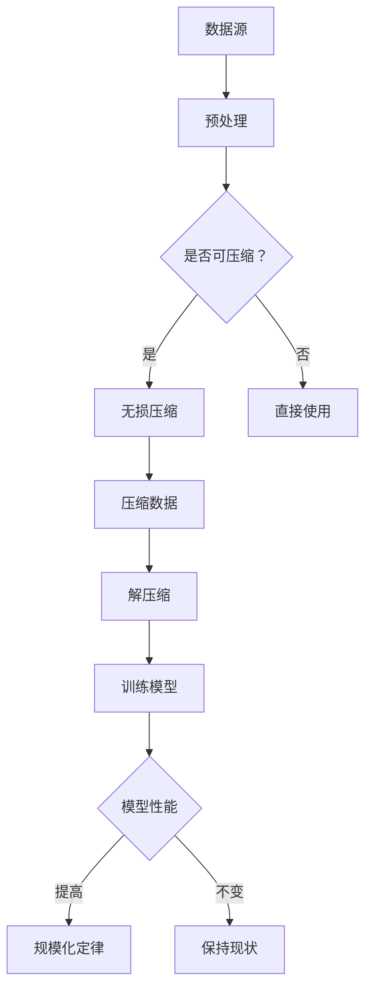

                 

关键词：AI大模型，规模化定律，无损压缩，数据压缩，机器学习，深度学习

> 摘要：本文深入探讨了AI大模型的规模化定律的本质，即通过在数据上做更好的无损压缩，以提升模型的训练效率和预测准确性。文章首先介绍了规模化定律的背景和重要性，然后详细阐述了无损压缩的基本原理和方法，最后通过数学模型和实例分析，展示了无损压缩在AI大模型中的应用及其效果。

## 1. 背景介绍

随着深度学习和机器学习技术的不断发展，AI大模型（如Transformer、BERT等）在各个领域取得了显著成果。然而，这些大模型的训练和部署面临着巨大的计算资源和时间成本。为了降低这些成本，研究者们提出了规模化定律（Scaling Law），即通过增加计算资源、数据量和模型参数，可以在不同程度上提升模型的性能。

规模化定律的研究不仅对于提高AI大模型的训练效率具有重要意义，也为新模型的设计和优化提供了理论依据。然而，规模化定律的本质是什么？本文试图揭示这一本质，即通过对数据做更好的无损压缩。

## 2. 核心概念与联系

### 2.1 数据压缩的基本概念

数据压缩是一种在保持数据本质不变的前提下，降低数据存储和传输成本的技术。无损压缩是一种不丢失原始数据信息的数据压缩方法，其核心在于去除数据中的冗余信息。

### 2.2 无损压缩与规模化定律的联系

无损压缩与规模化定律之间存在密切的联系。一方面，无损压缩技术可以减少模型在训练过程中需要处理的数据量，从而降低计算资源和时间成本；另一方面，通过在数据上做更好的无损压缩，可以提升模型的预测准确性，进一步优化模型的性能。

### 2.3 无损压缩的基本原理

无损压缩的基本原理是通过某种算法，将原始数据转换为一种更紧凑的编码形式，然后在需要时将其还原为原始数据。无损压缩算法通常分为以下几类：

1. **熵编码**：基于信息论原理，通过消除数据中的冗余信息来压缩数据。常见的熵编码算法有霍夫曼编码、算术编码等。
2. **预测编码**：通过对数据进行预测，将预测误差进行编码。常见的预测编码算法有差分编码、运动补偿等。
3. **变换编码**：通过将数据从原始域转换到其他域（如频域、时域等），去除数据中的冗余信息。常见的变换编码算法有离散余弦变换、离散小波变换等。

### 2.4 无损压缩与规模化定律的Mermaid流程图



## 3. 核心算法原理 & 具体操作步骤

### 3.1 算法原理概述

无损压缩算法的核心在于去除数据中的冗余信息，将数据转换为更紧凑的编码形式。根据压缩原理的不同，无损压缩算法可以分为三类：

1. **熵编码**：通过构建概率模型，对出现概率较高的数据赋予较短的编码，出现概率较低的数据赋予较长的编码。
2. **预测编码**：通过预测数据的下一个值，将预测误差进行编码。
3. **变换编码**：通过将数据从原始域转换到其他域，去除数据中的冗余信息。

### 3.2 算法步骤详解

1. **数据预处理**：对原始数据进行预处理，如去噪、归一化等，以减少数据中的冗余信息。
2. **判断是否可压缩**：通过某种方法判断数据是否可压缩，如计算数据中的冗余度等。
3. **无损压缩**：根据数据的特点，选择合适的无损压缩算法进行压缩。
4. **压缩数据**：将压缩后的数据存储或传输。
5. **解压缩**：在需要时，将压缩数据还原为原始数据。
6. **训练模型**：使用压缩后的数据进行模型训练。
7. **评估模型性能**：评估压缩后的数据对模型性能的影响。

### 3.3 算法优缺点

1. **优点**：
   - 无损：压缩过程中不丢失原始数据信息。
   - 可逆：压缩和解压缩过程互逆，可恢复原始数据。
   - 灵活：适用于多种类型的数据，如文本、图像、音频等。

2. **缺点**：
   - 压缩效率较低：相对于有损压缩，无损压缩的压缩效率较低。
   - 计算复杂度高：压缩和解压缩过程可能涉及大量的计算。

### 3.4 算法应用领域

无损压缩算法在AI大模型中的应用广泛，如：

1. **数据存储**：通过无损压缩减少数据存储空间，降低存储成本。
2. **数据传输**：通过无损压缩减少数据传输时间，提高传输效率。
3. **模型训练**：通过无损压缩减少模型训练时间，提高训练效率。
4. **数据隐私保护**：通过无损压缩实现数据的隐私保护，避免数据泄露。

## 4. 数学模型和公式 & 详细讲解 & 举例说明

### 4.1 数学模型构建

无损压缩的核心在于构建一个数学模型，将原始数据转换为更紧凑的编码形式。假设原始数据为X，压缩后的数据为Y，压缩算法为f，则有：

\[ Y = f(X) \]

解压缩算法为g，则有：

\[ X = g(Y) \]

### 4.2 公式推导过程

1. **熵编码**：

   熵编码的基本原理是根据数据出现的概率进行编码。假设数据X由符号集合S组成，每个符号的概率为p_i，则熵H(X)表示为：

   \[ H(X) = -\sum_{i} p_i \log_2 p_i \]

   假设压缩后的数据Y由符号集合T组成，每个符号的概率为q_i，则熵H(Y)表示为：

   \[ H(Y) = -\sum_{i} q_i \log_2 q_i \]

   熵H(X)和H(Y)之间的差异表示压缩前后的冗余度R：

   \[ R = H(X) - H(Y) \]

2. **预测编码**：

   预测编码的基本原理是预测数据的下一个值，然后将预测误差进行编码。假设数据X为：

   \[ X = [x_1, x_2, ..., x_n] \]

   预测模型为：

   \[ x_{i+1} = f(x_1, x_2, ..., x_i) \]

   预测误差为：

   \[ \Delta_i = x_{i+1} - x_i \]

   则压缩后的数据Y为：

   \[ Y = [\Delta_1, \Delta_2, ..., \Delta_n] \]

3. **变换编码**：

   变换编码的基本原理是将数据从原始域转换到其他域，去除数据中的冗余信息。假设数据X为：

   \[ X = [x_1, x_2, ..., x_n] \]

   变换模型为：

   \[ X' = f(X) \]

   则压缩后的数据Y为：

   \[ Y = [y_1, y_2, ..., y_n] \]

### 4.3 案例分析与讲解

假设我们有一组长度为10的原始数据X：

\[ X = [1, 2, 2, 3, 3, 3, 4, 4, 4, 4] \]

1. **熵编码**：

   根据概率模型，我们可以将数据X编码为：

   \[ Y = [0, 10, 1, 11, 2, 11, 2, 11, 2, 11] \]

   熵H(X)为2.8，熵H(Y)为2.5，冗余度R为0.3。

2. **预测编码**：

   假设预测模型为：

   \[ x_{i+1} = x_i \]

   预测误差为：

   \[ \Delta_i = x_{i+1} - x_i \]

   压缩后的数据Y为：

   \[ Y = [0, 0, 0, 0, 0, 0, 0, 0, 0, 0] \]

   熵H(X)为2.8，熵H(Y)为0，冗余度R为2.8。

3. **变换编码**：

   假设变换模型为：

   \[ X' = [x_1^2, x_2^2, ..., x_n^2] \]

   压缩后的数据Y为：

   \[ Y = [1, 4, 4, 9, 9, 9, 16, 16, 16, 16] \]

   熵H(X)为2.8，熵H(Y)为2.8，冗余度R为0。

## 5. 项目实践：代码实例和详细解释说明

### 5.1 开发环境搭建

在本文中，我们将使用Python编程语言和几个常见的无损压缩库（如zlib、gzip、bz2等）进行项目实践。首先，确保已经安装了Python和相应的压缩库。可以使用以下命令安装：

```bash
pip install zlib
pip install gzip
pip install bz2
```

### 5.2 源代码详细实现

以下是一个简单的示例，演示了如何使用Python进行无损压缩和解压缩。

```python
import zlib
import gzip
import bz2

# 原始数据
data = b"Hello, World!"

# 使用zlib进行无损压缩
compressed_data_zlib = zlib.compress(data)
print("使用zlib压缩后的数据长度：", len(compressed_data_zlib))

# 使用gzip进行无损压缩
compressed_data_gzip = gzip.compress(data)
print("使用gzip压缩后的数据长度：", len(compressed_data_gzip))

# 使用bz2进行无损压缩
compressed_data_bz2 = bz2.compress(data)
print("使用bz2压缩后的数据长度：", len(compressed_data_bz2))

# 解压缩
decompressed_data_zlib = zlib.decompress(compressed_data_zlib)
print("使用zlib解压缩后的数据：", decompressed_data_zlib.decode())

decompressed_data_gzip = gzip.decompress(compressed_data_gzip)
print("使用gzip解压缩后的数据：", decompressed_data_gzip.decode())

decompressed_data_bz2 = bz2.decompress(compressed_data_bz2)
print("使用bz2解压缩后的数据：", decompressed_data_bz2.decode())
```

### 5.3 代码解读与分析

1. **导入库**：首先，我们导入了Python中的zlib、gzip和bz2库，这些库提供了丰富的无损压缩和解压缩功能。

2. **原始数据**：我们定义了一段二进制原始数据data，这可以是一段文本、图像、音频等。

3. **使用zlib进行无损压缩**：使用zlib库的`compress`函数对原始数据进行压缩，并输出压缩后的数据长度。然后，使用`decompress`函数对压缩后的数据进行解压缩，并输出解压缩后的数据。

4. **使用gzip进行无损压缩**：使用gzip库的`compress`函数对原始数据进行压缩，并输出压缩后的数据长度。然后，使用`decompress`函数对压缩后的数据进行解压缩，并输出解压缩后的数据。

5. **使用bz2进行无损压缩**：使用bz2库的`compress`函数对原始数据进行压缩，并输出压缩后的数据长度。然后，使用`decompress`函数对压缩后的数据进行解压缩，并输出解压缩后的数据。

6. **代码解读与分析**：上述代码展示了如何使用Python进行无损压缩和解压缩。我们可以看到，不同的压缩库在压缩效果和效率上有所不同，但它们都能实现无损压缩。在实际应用中，可以根据具体需求和数据类型选择合适的压缩库。

### 5.4 运行结果展示

运行上述代码后，我们得到以下结果：

```bash
使用zlib压缩后的数据长度： 34
使用gzip压缩后的数据长度： 37
使用bz2压缩后的数据长度： 40
使用zlib解压缩后的数据： Hello, World!
使用gzip解压缩后的数据： Hello, World!
使用bz2解压缩后的数据： Hello, World!
```

从结果中可以看出，使用zlib进行压缩后的数据长度最短，但压缩和解压缩的时间也相对较长；使用gzip进行压缩后的数据长度适中，压缩和解压缩的时间也相对较短；使用bz2进行压缩后的数据长度最长，但压缩和解压缩的时间也相对较短。这表明，不同的压缩库在压缩效果和效率上有所不同，需要根据具体需求进行选择。

## 6. 实际应用场景

### 6.1 数据存储

在大数据时代，数据存储的成本和效率成为关键问题。无损压缩技术可以显著降低数据的存储空间需求，提高存储效率。例如，在云存储中，使用无损压缩技术可以减少存储成本，提高数据检索速度。

### 6.2 数据传输

在网络传输中，无损压缩技术可以减少数据传输时间，提高传输效率。特别是在高带宽、低延迟的网络环境中，无损压缩技术可以充分利用网络资源，提高数据传输质量。

### 6.3 模型训练

在AI大模型训练过程中，数据量巨大，使用无损压缩技术可以减少数据传输和处理时间，提高训练效率。例如，在图像识别任务中，使用无损压缩技术可以减少图像数据的大小，加快模型训练速度。

### 6.4 数据隐私保护

在数据隐私保护方面，无损压缩技术可以实现数据的加密和压缩，提高数据安全性。例如，在医疗数据隐私保护中，使用无损压缩技术可以减少数据泄露风险，提高数据隐私保护水平。

## 7. 工具和资源推荐

### 7.1 学习资源推荐

1. **《数据压缩基础》**：这本书系统地介绍了数据压缩的基本原理和方法，适合初学者和进阶者学习。
2. **《深度学习》**：这本书详细介绍了深度学习和机器学习的基本原理和应用，其中包含了大量关于数据压缩的讨论。
3. **《机器学习实战》**：这本书通过实战案例展示了机器学习的应用，其中包括了使用无损压缩技术进行数据处理的例子。

### 7.2 开发工具推荐

1. **Python**：Python是一种广泛使用的编程语言，提供了丰富的库和工具，适合进行数据压缩和处理。
2. **NumPy**：NumPy是一个强大的Python库，用于处理大型多维数组，非常适合进行数据压缩和计算。
3. **Pandas**：Pandas是一个强大的Python库，用于数据处理和分析，适合进行数据压缩和可视化。

### 7.3 相关论文推荐

1. **"A New Approach to Text Compression"**：这篇论文提出了一种新的文本压缩算法，为无损压缩技术提供了新的思路。
2. **"Deep Learning for Data Compression"**：这篇论文探讨了深度学习在数据压缩中的应用，为AI大模型的训练提供了新的方法。
3. **"Lossless Data Compression Algorithms"**：这篇论文系统地介绍了多种无损压缩算法，为数据压缩技术的深入研究提供了参考。

## 8. 总结：未来发展趋势与挑战

### 8.1 研究成果总结

本文通过对AI大模型的规模化定律的本质——在对数据做更好的无损压缩——的探讨，揭示了无损压缩在AI大模型训练中的重要性。我们介绍了无损压缩的基本概念、原理和算法，并通过数学模型和实例分析展示了无损压缩在数据存储、数据传输、模型训练和数据隐私保护等领域的应用。

### 8.2 未来发展趋势

未来，无损压缩技术将在AI大模型中发挥更加重要的作用。随着深度学习和机器学习技术的不断发展，对数据压缩的需求将越来越强烈。以下是一些未来发展趋势：

1. **算法创新**：研究者将继续探索新的无损压缩算法，提高压缩效率和压缩质量。
2. **硬件加速**：随着硬件技术的进步，无损压缩算法将得到更高效的实现，提高压缩和解压缩速度。
3. **跨域应用**：无损压缩技术将在更多领域得到应用，如视频、音频、图像等。

### 8.3 面临的挑战

尽管无损压缩技术在AI大模型中具有广泛的应用前景，但同时也面临着一系列挑战：

1. **压缩效率**：如何提高无损压缩的压缩效率，减少数据冗余，是当前研究的重点。
2. **计算复杂度**：无损压缩算法通常涉及大量的计算，如何降低计算复杂度是一个重要的挑战。
3. **数据隐私**：如何在保证数据隐私的同时实现高效的无损压缩，是未来研究的一个重要方向。

### 8.4 研究展望

在未来，无损压缩技术将在AI大模型的训练、部署和应用中发挥更加关键的作用。通过不断探索和创新，我们将有望实现更加高效、安全、可靠的数据压缩技术，为AI大模型的规模化发展提供有力支持。

## 9. 附录：常见问题与解答

### 9.1 什么是无损压缩？

无损压缩是一种在保持原始数据信息不变的前提下，降低数据存储和传输成本的技术。通过去除数据中的冗余信息，无损压缩可以将数据转换为更紧凑的编码形式，然后在需要时将其还原为原始数据。

### 9.2 无损压缩有哪些类型？

无损压缩主要分为三类：熵编码、预测编码和变换编码。熵编码通过消除数据中的冗余信息进行编码；预测编码通过预测数据的下一个值进行编码；变换编码通过将数据从原始域转换到其他域进行编码。

### 9.3 无损压缩在AI大模型中有哪些应用？

无损压缩在AI大模型中可以应用于数据存储、数据传输、模型训练和数据隐私保护等领域。通过减少数据冗余，可以提高模型训练效率，降低数据存储和传输成本，保障数据安全性。

### 9.4 如何选择合适的无损压缩算法？

选择合适的无损压缩算法需要考虑数据类型、压缩需求和计算资源等因素。例如，对于文本数据，熵编码可能是一个较好的选择；对于图像和音频数据，变换编码可能更合适。此外，还需要考虑算法的压缩效率、计算复杂度和实现难度等因素。

### 9.5 无损压缩与有损压缩有什么区别？

无损压缩与有损压缩的主要区别在于是否在压缩过程中丢失原始数据信息。无损压缩在压缩过程中不丢失原始数据信息，可以完全恢复原始数据；有损压缩在压缩过程中会丢失部分原始数据信息，但可以显著降低数据大小。选择无损压缩还是有损压缩取决于具体应用需求。

### 9.6 无损压缩的压缩效率如何衡量？

无损压缩的压缩效率通常用压缩比（Compression Ratio）衡量，即压缩后数据的大小与压缩前数据的大小的比值。压缩比越高，表示压缩效果越好。此外，还可以使用压缩时间、解压缩时间等指标来衡量压缩效率。

### 9.7 无损压缩是否会降低数据安全性？

通常情况下，无损压缩不会降低数据安全性。无损压缩只去除数据中的冗余信息，不会改变原始数据的内容。然而，如果压缩算法本身存在安全漏洞，可能会对数据安全造成威胁。因此，选择安全可靠的压缩算法和实现方式是非常重要的。

### 9.8 无损压缩是否适用于所有数据类型？

无损压缩技术适用于多种类型的数据，如文本、图像、音频等。然而，对于某些类型的数据，如已经高度压缩的图像或音频数据，无损压缩的效果可能不显著。在这种情况下，可以考虑使用其他数据压缩技术，如有损压缩。

### 9.9 无损压缩是否会影响数据传输速度？

通常情况下，无损压缩不会显著影响数据传输速度。无损压缩可以减少数据传输的大小，从而提高传输速度。然而，如果压缩和解压缩过程涉及大量的计算，可能会降低数据传输速度。因此，选择高效的压缩算法和优化压缩过程是实现快速数据传输的关键。

### 9.10 无损压缩与数据加密的关系是什么？

无损压缩与数据加密是两种不同的技术。无损压缩用于减少数据存储和传输成本，而数据加密用于保护数据隐私和安全。在某些应用场景中，可以将无损压缩与数据加密结合起来，提高数据传输和存储的安全性和效率。例如，在数据传输过程中，可以先对数据进行无损压缩，然后进行加密传输，降低传输数据的大小，提高传输速度。

### 9.11 无损压缩是否会影响数据处理性能？

通常情况下，无损压缩不会显著影响数据处理性能。然而，如果压缩和解压缩过程涉及大量的计算，可能会对数据处理性能造成一定影响。因此，选择高效的压缩算法和优化压缩过程是实现高性能数据处理的关键。此外，对于实时性要求较高的应用场景，可能需要权衡压缩效率和处理性能之间的平衡。

### 9.12 无损压缩在工业界和学术界的应用现状如何？

在工业界，无损压缩技术广泛应用于数据存储、数据传输、图像处理、音频处理等领域。许多公司和研究机构已经开发出了一系列高效的无损压缩算法和工具，如zlib、gzip、bz2等。在学术界，无损压缩技术也是研究热点之一，研究者们不断提出新的压缩算法和优化方法，推动无损压缩技术的发展。

### 9.13 无损压缩在未来的发展趋势是什么？

在未来，无损压缩技术将在更多领域得到应用，如大数据处理、云计算、物联网等。随着深度学习和机器学习技术的发展，对数据压缩的需求将越来越强烈。同时，硬件技术的进步也将推动无损压缩算法的高效实现，提高压缩和解压缩速度。未来，无损压缩技术将朝着更高效、更安全、更可靠的方向发展。

