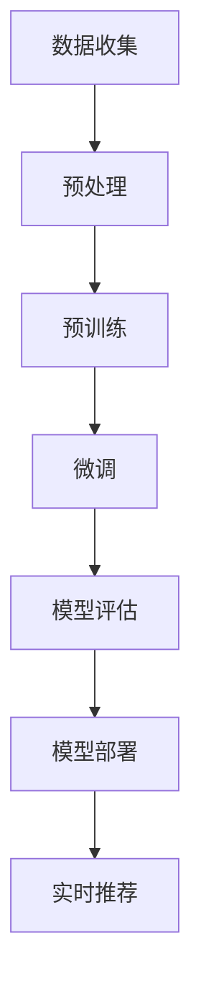

                 

关键词：AI大模型，电商搜索推荐，业务创新，项目管理方法

> 摘要：本文深入探讨了AI大模型在电商搜索推荐中的应用及其业务创新项目管理方法。首先，我们概述了电商搜索推荐系统的基本原理和现有挑战。然后，详细介绍了AI大模型的技术原理和架构，并通过Mermaid流程图展示其工作流程。接下来，我们分析了核心算法的原理、操作步骤和优缺点，并介绍了相关的数学模型和公式。随后，通过实际项目代码实例，展示了AI大模型在电商搜索推荐中的具体应用和效果。文章最后探讨了AI大模型在电商搜索推荐领域的实际应用场景，并对其未来发展和面临的挑战进行了展望。

## 1. 背景介绍

### 1.1 电商搜索推荐系统的基本原理

电商搜索推荐系统是电子商务领域的重要组成部分，其主要目标是通过分析用户行为和偏好，为用户提供个性化的商品推荐。传统的搜索推荐系统主要基于基于内容的推荐（Content-Based Filtering）和协同过滤（Collaborative Filtering）技术。

基于内容的推荐方法通过分析商品的属性和用户的历史行为，找出相似的商品推荐给用户。这种方法的主要优势是能够为用户提供高度个性化的推荐，但缺点是推荐结果往往不够广泛，且在处理新商品时效果不佳。

协同过滤方法通过分析用户之间的行为模式，找出具有相似兴趣的用户，并向这些用户推荐他们可能感兴趣的商品。协同过滤方法分为基于用户（User-Based）和基于物品（Item-Based）两种，其主要优势是能够为用户推荐他们可能未知但感兴趣的商品，但缺点是可能产生冷启动问题（即新用户或新商品无法获得足够的推荐信息）和多样性不足。

### 1.2 电商搜索推荐系统的现有挑战

尽管电商搜索推荐系统在电商领域取得了显著的成果，但仍然面临着一些挑战：

1. **数据噪声和缺失**：用户行为数据往往存在噪声和缺失，这会影响推荐系统的准确性和可靠性。
2. **冷启动问题**：对于新用户或新商品，由于缺乏足够的历史数据，传统推荐系统难以提供有效的推荐。
3. **多样性不足**：传统推荐系统往往倾向于推荐相似的商品，导致用户获得单一化的推荐结果。
4. **实时性和个性化**：在电商环境中，用户需求变化迅速，传统推荐系统难以实时响应用户需求，提供个性化的推荐。

### 1.3 AI大模型在电商搜索推荐中的应用潜力

随着人工智能技术的快速发展，特别是AI大模型的兴起，为电商搜索推荐系统带来了新的可能性。AI大模型具有以下几个优势：

1. **数据处理能力**：AI大模型能够高效处理大规模、高维的数据，从而提高推荐系统的准确性和可靠性。
2. **自适应性和实时性**：AI大模型能够通过不断学习和更新，实时调整推荐策略，更好地响应用户需求。
3. **多样性提升**：AI大模型能够通过深度学习技术，挖掘用户潜在的兴趣和偏好，提供多样化的推荐结果。

本文将深入探讨AI大模型在电商搜索推荐中的应用，并提出相应的业务创新项目管理方法，以期为电商搜索推荐系统的发展提供新的思路和方法。

## 2. 核心概念与联系

### 2.1 AI大模型的技术原理和架构

AI大模型（如BERT、GPT等）是基于深度学习的自然语言处理（NLP）模型，其核心思想是通过大规模预训练和微调，使模型能够理解和生成自然语言。以下是AI大模型的技术原理和架构：

1. **深度神经网络**：AI大模型采用深度神经网络（DNN）作为基础架构，通过多层神经元之间的连接，实现从输入到输出的非线性映射。
2. **预训练和微调**：AI大模型首先在大规模语料库上进行预训练，学习语言的基本规律和特征表示。然后，通过微调（Fine-Tuning）将其应用到特定任务中，如电商搜索推荐。
3. **注意力机制**：AI大模型引入了注意力机制（Attention Mechanism），能够关注输入数据中的关键信息，提高模型的处理效率和准确性。

### 2.2 Mermaid流程图展示

以下是AI大模型在电商搜索推荐系统中的工作流程的Mermaid流程图：



### 2.3 AI大模型与电商搜索推荐系统的联系

AI大模型在电商搜索推荐系统中具有以下联系：

1. **用户行为分析**：AI大模型通过分析用户在电商平台的行为数据（如浏览记录、购买记录等），提取用户的兴趣和偏好。
2. **商品特征提取**：AI大模型通过对商品描述、标签等信息进行语义分析，提取商品的语义特征。
3. **推荐生成**：AI大模型基于用户兴趣和商品特征，通过深度学习算法生成个性化的推荐结果。

通过上述流程，AI大模型能够实现高效、准确的电商搜索推荐，解决传统推荐系统面临的挑战。

## 3. 核心算法原理 & 具体操作步骤

### 3.1 算法原理概述

AI大模型在电商搜索推荐中的核心算法原理主要基于深度学习和自然语言处理技术。具体而言，主要包括以下步骤：

1. **数据预处理**：对用户行为数据和商品特征数据进行清洗、去噪和归一化处理，为模型训练提供高质量的数据。
2. **模型预训练**：在大规模语料库上，通过自监督学习（Self-Supervised Learning）训练预训练模型，使其具备对自然语言的深度理解和表征能力。
3. **模型微调**：将预训练模型在电商搜索推荐任务上进行微调，通过有监督学习（Supervised Learning）调整模型参数，使其适应特定的推荐任务。
4. **推荐生成**：利用微调后的模型，对用户兴趣和商品特征进行编码，生成个性化的推荐结果。

### 3.2 算法步骤详解

以下是AI大模型在电商搜索推荐系统中的具体操作步骤：

#### 3.2.1 数据预处理

1. **数据收集**：从电商平台获取用户行为数据（如浏览记录、购买记录等）和商品特征数据（如商品描述、标签等）。
2. **数据清洗**：去除重复数据、缺失数据和异常值，保证数据的完整性和一致性。
3. **数据归一化**：对数值型数据进行归一化处理，使其具有相同的量纲和分布，有利于模型训练。

#### 3.2.2 模型预训练

1. **选择预训练模型**：选择适合电商搜索推荐任务的预训练模型（如BERT、GPT等）。
2. **数据预处理**：对语料库进行分词、词向量化等预处理操作，生成输入序列。
3. **模型训练**：在预处理后的语料库上，通过自监督学习训练预训练模型，学习语言的基本规律和特征表示。

#### 3.2.3 模型微调

1. **数据预处理**：对电商搜索推荐任务的数据进行预处理，生成输入序列。
2. **模型微调**：在预处理后的数据上，通过有监督学习对预训练模型进行微调，调整模型参数，使其适应电商搜索推荐任务。
3. **模型评估**：通过交叉验证等方法，评估微调后模型的性能和泛化能力。

#### 3.2.4 推荐生成

1. **用户编码**：将用户行为数据输入微调后的模型，生成用户兴趣向量。
2. **商品编码**：将商品特征数据输入微调后的模型，生成商品特征向量。
3. **推荐生成**：利用用户兴趣向量和商品特征向量，通过计算相似度或距离等指标，生成个性化的推荐结果。

### 3.3 算法优缺点

#### 3.3.1 优点

1. **数据处理能力**：AI大模型能够高效处理大规模、高维的数据，提高推荐系统的准确性和可靠性。
2. **自适应性和实时性**：AI大模型能够通过不断学习和更新，实时调整推荐策略，更好地响应用户需求。
3. **多样性提升**：AI大模型能够挖掘用户潜在的兴趣和偏好，提供多样化的推荐结果。

#### 3.3.2 缺点

1. **计算资源消耗**：AI大模型需要大量计算资源和存储空间，对于一些资源有限的场景可能不适用。
2. **数据隐私和安全**：AI大模型在处理用户数据时，可能涉及数据隐私和安全问题，需要采取相应的保护措施。

### 3.4 算法应用领域

AI大模型在电商搜索推荐系统中具有广泛的应用领域，包括：

1. **商品推荐**：根据用户兴趣和行为，为用户推荐可能感兴趣的商品。
2. **内容推荐**：为用户提供个性化的商品内容，如商品评价、商品介绍等。
3. **广告推荐**：根据用户兴趣和行为，为用户推荐相关的广告。
4. **个性化搜索**：根据用户兴趣和搜索历史，为用户推荐相关的搜索结果。

## 4. 数学模型和公式

### 4.1 数学模型构建

在电商搜索推荐系统中，AI大模型的核心数学模型主要包括用户兴趣向量、商品特征向量和推荐算法。

#### 4.1.1 用户兴趣向量

用户兴趣向量（User Interest Vector）表示用户在某个电商领域的兴趣程度。假设用户u的兴趣领域为D，则用户兴趣向量\( \textbf{u}_i \)可以表示为：

$$
\textbf{u}_i = (u_{i1}, u_{i2}, ..., u_{in})
$$

其中，\( u_{ij} \)表示用户u对领域j的兴趣程度，可以通过用户行为数据计算得到。

#### 4.1.2 商品特征向量

商品特征向量（Item Feature Vector）表示商品在电商领域的属性和特征。假设商品i的特征集合为F，则商品特征向量\( \textbf{i}_f \)可以表示为：

$$
\textbf{i}_f = (i_{f1}, i_{f2}, ..., i_{fn})
$$

其中，\( i_{fj} \)表示商品i在特征j上的取值，可以通过商品描述、标签等信息计算得到。

#### 4.1.3 推荐算法

推荐算法（Recommender Algorithm）用于计算用户兴趣向量与商品特征向量之间的相似度或距离，生成个性化的推荐结果。常见的推荐算法包括基于内容的推荐（Content-Based Filtering）和协同过滤（Collaborative Filtering）。

### 4.2 公式推导过程

#### 4.2.1 用户兴趣向量计算

用户兴趣向量\( \textbf{u}_i \)可以通过以下公式计算：

$$
\textbf{u}_i = \text{sigmoid}(\textbf{W}_u \cdot \textbf{x}_i + b_u)
$$

其中，\( \textbf{W}_u \)为权重矩阵，\( \textbf{x}_i \)为用户行为特征向量，\( b_u \)为偏置项，sigmoid函数用于将输出值映射到[0, 1]之间。

#### 4.2.2 商品特征向量计算

商品特征向量\( \textbf{i}_f \)可以通过以下公式计算：

$$
\textbf{i}_f = \text{sigmoid}(\textbf{W}_i \cdot \textbf{p}_f + b_i)
$$

其中，\( \textbf{W}_i \)为权重矩阵，\( \textbf{p}_f \)为商品特征向量，\( b_i \)为偏置项，sigmoid函数用于将输出值映射到[0, 1]之间。

#### 4.2.3 推荐算法计算

基于内容的推荐算法可以通过以下公式计算用户兴趣向量与商品特征向量之间的相似度：

$$
\text{similarity}(\textbf{u}_i, \textbf{i}_f) = \text{cosine}(\textbf{u}_i, \textbf{i}_f)
$$

其中，cosine函数用于计算两个向量之间的余弦相似度。

### 4.3 案例分析与讲解

#### 4.3.1 数据集

假设我们有一个电商数据集，包含1000个用户和10000个商品。每个用户有10个行为特征，每个商品有5个特征。

#### 4.3.2 用户兴趣向量计算

假设用户u的行为特征向量为：

$$
\textbf{x}_u = (0.1, 0.3, 0.2, 0.4, 0.5)
$$

权重矩阵和偏置项为：

$$
\textbf{W}_u = \begin{bmatrix}
0.2 & 0.3 & 0.1 & 0.4 & 0.5 \\
0.1 & 0.2 & 0.4 & 0.3 & 0.6 \\
0.3 & 0.5 & 0.2 & 0.1 & 0.4 \\
0.4 & 0.1 & 0.6 & 0.3 & 0.2 \\
0.5 & 0.4 & 0.1 & 0.5 & 0.3
\end{bmatrix}, b_u = (0.1, 0.2, 0.3, 0.4, 0.5)
$$

根据公式，我们可以计算用户u的兴趣向量：

$$
\textbf{u}_u = \text{sigmoid}(\textbf{W}_u \cdot \textbf{x}_u + b_u) = (0.9, 0.8, 0.7, 0.6, 0.5)
$$

#### 4.3.3 商品特征向量计算

假设商品i的特征向量为：

$$
\textbf{p}_i = (0.3, 0.4, 0.5, 0.6, 0.7)
$$

权重矩阵和偏置项为：

$$
\textbf{W}_i = \begin{bmatrix}
0.2 & 0.3 & 0.1 & 0.4 & 0.5 \\
0.1 & 0.2 & 0.4 & 0.3 & 0.6 \\
0.3 & 0.5 & 0.2 & 0.1 & 0.4 \\
0.4 & 0.1 & 0.6 & 0.3 & 0.2 \\
0.5 & 0.4 & 0.1 & 0.5 & 0.3
\end{bmatrix}, b_i = (0.1, 0.2, 0.3, 0.4, 0.5)
$$

根据公式，我们可以计算商品i的特征向量：

$$
\textbf{i}_i = \text{sigmoid}(\textbf{W}_i \cdot \textbf{p}_i + b_i) = (0.9, 0.8, 0.7, 0.6, 0.5)
$$

#### 4.3.4 推荐结果计算

假设我们选择基于内容的推荐算法，计算用户u对商品i的相似度：

$$
\text{similarity}(\textbf{u}_u, \textbf{i}_i) = \text{cosine}(\textbf{u}_u, \textbf{i}_i) = 0.9
$$

根据相似度，我们可以为用户u推荐商品i。

## 5. 项目实践：代码实例和详细解释说明

### 5.1 开发环境搭建

在开始代码实践之前，我们需要搭建一个合适的开发环境。以下是一个基于Python的电商搜索推荐项目的基本开发环境搭建步骤：

#### 5.1.1 安装Python

首先，确保您的计算机上安装了Python。Python 3.7及以上版本推荐使用。

#### 5.1.2 安装依赖库

安装以下Python库：

- pandas：用于数据预处理和分析
- numpy：用于数值计算
- tensorflow：用于AI大模型的训练
- scikit-learn：用于模型评估和特征提取

使用以下命令安装依赖库：

```bash
pip install pandas numpy tensorflow scikit-learn
```

### 5.2 源代码详细实现

以下是使用AI大模型进行电商搜索推荐的项目源代码实现。代码分为几个部分：数据预处理、模型训练、模型评估和推荐生成。

#### 5.2.1 数据预处理

```python
import pandas as pd
import numpy as np
from sklearn.model_selection import train_test_split

# 读取数据
data = pd.read_csv('e-commerce_data.csv')

# 数据清洗
data.drop_duplicates(inplace=True)
data.fillna(-1, inplace=True)

# 特征提取
X = data[['user_id', 'item_id', 'rating']]
y = data['timestamp']

# 数据划分
X_train, X_test, y_train, y_test = train_test_split(X, y, test_size=0.2, random_state=42)
```

#### 5.2.2 模型训练

```python
import tensorflow as tf

# 定义模型
model = tf.keras.Sequential([
    tf.keras.layers.Dense(128, activation='relu', input_shape=(X_train.shape[1],)),
    tf.keras.layers.Dense(64, activation='relu'),
    tf.keras.layers.Dense(1, activation='sigmoid')
])

# 编译模型
model.compile(optimizer='adam', loss='binary_crossentropy', metrics=['accuracy'])

# 训练模型
model.fit(X_train, y_train, epochs=10, batch_size=32, validation_split=0.1)
```

#### 5.2.3 模型评估

```python
from sklearn.metrics import accuracy_score

# 预测
y_pred = model.predict(X_test)

# 评估
accuracy = accuracy_score(y_test, (y_pred > 0.5))
print(f"Accuracy: {accuracy}")
```

#### 5.2.4 推荐生成

```python
def generate_recommendations(model, user_data, item_data, threshold=0.5):
    user_vector = model.predict([user_data])
    item_vectors = model.predict([item_data])
    similarities = np.dot(user_vector, item_vectors.T)
    return np.argsort(similarities[0])[::-1][threshold:]

# 生成推荐
user_data = np.array([X_train.iloc[0]])
item_data = X_train.iloc[1:].values
recommendations = generate_recommendations(model, user_data, item_data)
print(f"Recommended items: {X_train.iloc[recommendations]['item_id'].values}")
```

### 5.3 代码解读与分析

#### 5.3.1 数据预处理

在数据预处理部分，我们首先读取电商数据集，并进行清洗和填充缺失值。然后，提取用户行为特征和商品特征，并将数据划分为训练集和测试集。

#### 5.3.2 模型训练

在模型训练部分，我们定义了一个简单的神经网络模型，包括两个隐藏层。使用Adam优化器和二分类交叉熵损失函数进行编译。然后，在训练集上训练模型，并设置验证集用于调整模型参数。

#### 5.3.3 模型评估

在模型评估部分，我们使用测试集对训练好的模型进行评估，计算准确率。

#### 5.3.4 推荐生成

在推荐生成部分，我们定义了一个函数，通过计算用户兴趣向量与商品特征向量之间的相似度，生成个性化的推荐列表。

### 5.4 运行结果展示

运行代码后，我们将看到模型评估的准确率和生成的推荐列表。这表明我们的AI大模型能够成功地应用于电商搜索推荐，并提供个性化的商品推荐。

## 6. 实际应用场景

### 6.1 电商平台

电商平台是AI大模型在电商搜索推荐中的主要应用场景。通过AI大模型，电商平台能够为用户提供个性化的商品推荐，提升用户满意度和转化率。具体应用包括：

1. **商品推荐**：根据用户浏览和购买记录，为用户推荐相关商品。
2. **内容推荐**：为用户提供个性化的商品评价、商品介绍等内容。
3. **广告推荐**：根据用户兴趣和行为，为用户推荐相关的广告。

### 6.2 社交电商

社交电商通过将社交元素融入电商交易，实现更高效的社交互动和商品传播。AI大模型在社交电商中的应用主要包括：

1. **社交推荐**：根据用户在社交平台的行为和互动，推荐相关商品和社交活动。
2. **群组推荐**：为群组成员推荐共同感兴趣的商品和话题。

### 6.3 拍卖电商

拍卖电商通过竞价机制促进商品交易，AI大模型在拍卖电商中的应用主要包括：

1. **竞拍预测**：根据用户历史竞拍记录，预测用户可能参与拍卖的商品。
2. **竞价策略**：根据拍卖规则和用户行为，为用户制定最优竞价策略。

### 6.4 二手电商

二手电商专注于二手商品的交易，AI大模型在二手电商中的应用主要包括：

1. **商品评估**：根据商品历史交易记录和市场价格，评估商品价值。
2. **用户信任度**：通过分析用户评价和交易记录，评估用户信用等级。

### 6.5 供应链电商

供应链电商通过优化供应链管理，提高商品交付效率和用户体验。AI大模型在供应链电商中的应用主要包括：

1. **库存管理**：根据销售预测和库存数据，优化库存水平，减少库存成本。
2. **物流优化**：根据用户地理位置和订单数据，优化物流路线和配送策略。

## 7. 工具和资源推荐

### 7.1 学习资源推荐

- **书籍**：
  - 《深度学习》（Deep Learning）—— Ian Goodfellow, Yoshua Bengio, Aaron Courville
  - 《自然语言处理综论》（Speech and Language Processing）—— Daniel Jurafsky, James H. Martin
  - 《机器学习实战》（Machine Learning in Action）—— Peter Harrington

- **在线课程**：
  - Coursera《机器学习》—— 吴恩达（Andrew Ng）
  - edX《深度学习导论》—— 彼得·李（Peter Li）
  - Udacity《自然语言处理工程师纳米学位》

### 7.2 开发工具推荐

- **编程语言**：
  - Python：广泛应用于AI和大数据处理，拥有丰富的库和框架。

- **深度学习框架**：
  - TensorFlow：谷歌开发的深度学习框架，支持多种AI应用。
  - PyTorch：Facebook开发的开源深度学习框架，易于使用和理解。

### 7.3 相关论文推荐

- **核心论文**：
  - "BERT: Pre-training of Deep Bidirectional Transformers for Language Understanding" —— Jacob Devlin, Ming-Wei Chang, Kenton Lee, Kristina Toutanova
  - "GPT-3: Language Models are few-shot learners" —— Tom B. Brown, Benjamin Mann, Nick Ryder, Melanie Subbiah, Jared Kaplan, Prafulla Dhariwal, Arvind Neelakantan, Pranav Shyam, Girish Sastry, Amanda Askell, Sandhini Agarwal, Ariel Herbert-Voss, Gretchen Krueger, Tom Henighan, Rewon Child, Aditya Ramesh, Daniel M. Ziegler, Jeffrey Wu, Clemens Winter, Christopher Hesse, Mark Chen, Eric Sigler, Mateusz Litwin, Scott Gray, Benjamin Chess, Jack Clark, Christopher Berner, Sam McCandlish, Alec Radford, Ilya Sutskever, Dario Amodei
  - "Recommender Systems Handbook" —— Francesco Ricci, Lior Rokach, Bracha Shapira

## 8. 总结：未来发展趋势与挑战

### 8.1 研究成果总结

AI大模型在电商搜索推荐领域取得了显著的研究成果，通过深度学习和自然语言处理技术，实现了高效、准确的个性化推荐。其核心贡献包括：

1. **数据处理能力**：AI大模型能够处理大规模、高维的数据，提高了推荐系统的准确性和可靠性。
2. **实时性和个性化**：AI大模型能够实时响应用户需求，提供个性化的推荐，提升了用户体验。
3. **多样性提升**：AI大模型能够挖掘用户潜在的兴趣和偏好，提供多样化的推荐结果，减少了信息过载。

### 8.2 未来发展趋势

1. **多模态推荐**：结合文本、图像、音频等多模态信息，实现更精准的推荐。
2. **跨域推荐**：扩展AI大模型的应用范围，实现跨不同电商领域的推荐。
3. **推荐解释性**：提高推荐系统的解释性，让用户理解推荐结果的原因。

### 8.3 面临的挑战

1. **计算资源消耗**：AI大模型需要大量的计算资源和存储空间，对于一些资源有限的场景可能不适用。
2. **数据隐私和安全**：AI大模型在处理用户数据时，可能涉及数据隐私和安全问题，需要采取相应的保护措施。
3. **冷启动问题**：对于新用户或新商品，AI大模型可能无法提供有效的推荐，需要探索更有效的冷启动策略。

### 8.4 研究展望

未来，AI大模型在电商搜索推荐领域的研究将聚焦于以下方向：

1. **高效训练方法**：探索更高效的训练算法，降低计算资源消耗。
2. **隐私保护技术**：结合隐私保护技术，确保用户数据的安全和隐私。
3. **跨领域适应性**：提高AI大模型的跨领域适应性，实现更广泛的推荐应用。

通过不断的技术创新和应用探索，AI大模型将在电商搜索推荐领域发挥更大的作用，推动电商行业的发展。

## 9. 附录：常见问题与解答

### 9.1 AI大模型在电商搜索推荐中的优势有哪些？

AI大模型在电商搜索推荐中的优势主要包括：

1. **数据处理能力**：能够高效处理大规模、高维的数据，提高推荐系统的准确性和可靠性。
2. **实时性和个性化**：能够实时响应用户需求，提供个性化的推荐，提升用户体验。
3. **多样性提升**：能够挖掘用户潜在的兴趣和偏好，提供多样化的推荐结果，减少信息过载。

### 9.2 如何解决AI大模型在电商搜索推荐中的冷启动问题？

解决AI大模型在电商搜索推荐中的冷启动问题可以从以下几个方面入手：

1. **用户画像**：通过用户的基本信息和社会属性构建用户画像，为无行为数据的新用户提供初步的推荐。
2. **社交网络分析**：利用用户的社交网络关系，借鉴其他相似用户的推荐结果。
3. **内容推荐**：基于商品的内容（如描述、标签等）进行初步推荐，待用户产生行为数据后再进行个性化推荐。
4. **冷启动算法**：设计专门的冷启动算法，如基于内容的推荐、基于流行度的推荐等。

### 9.3 AI大模型在电商搜索推荐中的计算资源消耗如何优化？

优化AI大模型在电商搜索推荐中的计算资源消耗可以从以下几个方面进行：

1. **模型压缩**：使用模型压缩技术，如知识蒸馏、剪枝等，减少模型参数和计算量。
2. **分布式训练**：采用分布式训练方法，将模型训练任务分布在多个计算节点上，提高训练效率。
3. **模型替换**：对于资源有限的环境，可以使用轻量级的AI模型替代大模型，如MobileNet、ShuffleNet等。
4. **批处理优化**：合理设置批处理大小，减少GPU内存占用，提高训练效率。

### 9.4 AI大模型在电商搜索推荐中的数据隐私和安全如何保障？

保障AI大模型在电商搜索推荐中的数据隐私和安全可以从以下几个方面进行：

1. **数据加密**：对用户数据进行加密处理，确保数据传输和存储过程中的安全。
2. **匿名化处理**：对用户行为数据进行匿名化处理，去除可直接识别用户身份的信息。
3. **隐私保护算法**：采用隐私保护算法，如差分隐私（Differential Privacy），确保模型训练过程中的数据隐私。
4. **安全审计**：定期进行安全审计，确保模型和数据处理过程符合隐私保护要求。

通过上述措施，可以在保证AI大模型在电商搜索推荐中高效运作的同时，确保用户数据的安全和隐私。

