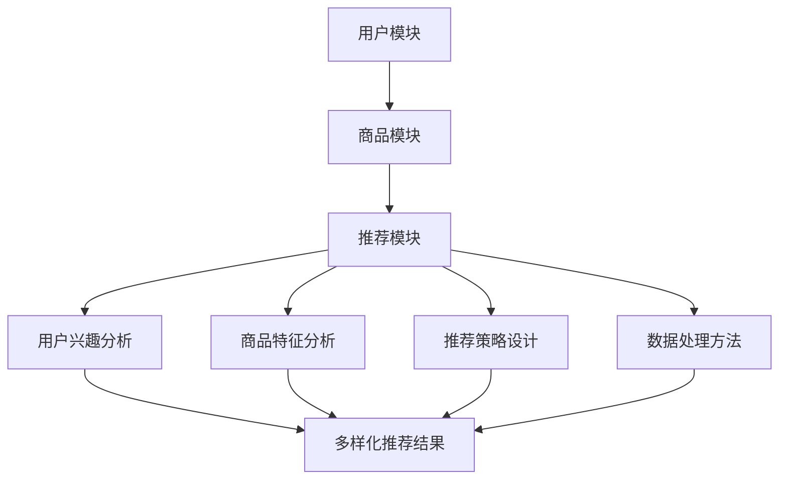

                 

关键词：AI大模型、电商搜索推荐、多样性、算法、数学模型、代码实例、实际应用场景、未来展望

## 摘要

随着电子商务的迅猛发展，用户对于个性化、多样化推荐的需求日益增长。本文探讨了利用AI大模型赋能电商搜索推荐系统，提升推荐多样性的策略。通过深入分析核心概念、算法原理、数学模型以及实际应用场景，本文揭示了如何通过优化算法和改进模型，实现电商搜索推荐的多样性提升。本文的目标是为电商搜索推荐领域的从业者提供有价值的参考和思路，推动电商推荐系统的创新发展。

## 1. 背景介绍

### 1.1 电商搜索推荐的发展现状

电子商务在全球范围内迅速发展，成为现代消费方式的重要组成部分。电商平台的成功离不开有效的搜索推荐系统，它能够提高用户满意度和转化率，进而提升平台竞争力。目前，大多数电商搜索推荐系统主要依赖于基于内容的推荐、协同过滤和基于模型的方法。这些方法在一定程度上能够提升推荐效果，但存在多样性不足的问题。

### 1.2 多样性不足的问题

多样性不足主要表现在两个方面：首先是推荐结果的单一性，用户经常接收到重复的商品推荐，缺乏新颖性和个性化；其次是用户体验的下降，单一重复的推荐可能导致用户疲劳和失去兴趣。这些问题严重影响了电商平台的用户留存率和转化率，因此如何提升推荐的多样性成为当前研究的热点。

### 1.3 AI大模型的引入

随着深度学习技术的发展，AI大模型（如Transformer、BERT等）在自然语言处理、图像识别等领域取得了显著的成果。这些大模型具有强大的表征能力和泛化能力，为电商搜索推荐系统的多样性提升提供了新的可能。通过引入AI大模型，我们可以从海量数据中挖掘出更丰富、更具有代表性的特征，从而实现更多样化的推荐。

## 2. 核心概念与联系

### 2.1 AI大模型的基本原理

AI大模型通常是指具有数十亿甚至千亿参数的大型神经网络模型。这些模型通过深度学习算法从大量数据中学习到复杂的特征表示，从而实现高效的信息处理和知识提取。在电商搜索推荐系统中，AI大模型可以用于用户行为分析、商品特征提取和推荐策略优化等多个环节。

### 2.2 推荐系统的架构

一个典型的电商推荐系统可以分为三个主要模块：用户模块、商品模块和推荐模块。用户模块负责收集和存储用户的行为数据，如浏览记录、购买记录等；商品模块负责收集和存储商品的特征数据，如商品分类、标签、价格等；推荐模块则负责基于用户和商品的特征进行推荐算法的计算，生成推荐列表。

### 2.3 多样性提升的关键因素

多样性提升的关键因素主要包括以下几个方面：

- 用户兴趣的多样化：通过分析用户的历史行为和反馈，挖掘用户多方面的兴趣点，从而生成多样化的推荐。
- 商品特征的多样性：通过全面分析商品的特征，包括但不限于分类、标签、属性等，实现商品推荐的多样性。
- 推荐策略的多样性：通过设计多种推荐策略，如基于内容的推荐、协同过滤、基于模型的方法等，实现推荐结果的多样性。
- 数据处理的多样性：通过引入多种数据处理方法，如数据清洗、特征工程、数据增强等，提升推荐系统的多样性。

### 2.4 Mermaid流程图



## 3. 核心算法原理 & 具体操作步骤

### 3.1 算法原理概述

AI大模型赋能电商搜索推荐的核心算法原理主要包括以下几个方面：

- 特征提取：通过深度学习算法从用户和商品的数据中提取高维度的特征表示，为推荐系统提供丰富的输入信息。
- 嵌入学习：将用户和商品的标签、分类等属性转化为向量表示，实现不同维度数据的统一处理。
- 注意力机制：通过注意力机制实现模型对用户和商品特征的不同部分进行加权处理，提升推荐结果的多样性。
- 多任务学习：通过多任务学习实现同时优化推荐效果和多样性，如同时优化点击率、购买率等指标。

### 3.2 算法步骤详解

1. 数据收集与预处理：收集用户行为数据和商品特征数据，进行数据清洗、去重和标准化处理。
2. 特征提取：使用深度学习算法（如BERT、Transformer）对用户和商品的特征进行提取，生成高维度的特征向量。
3. 嵌入学习：将用户和商品的标签、分类等属性通过嵌入层转化为向量表示，与特征向量进行拼接。
4. 模型训练：使用训练集数据训练多任务学习模型，同时优化推荐效果和多样性。
5. 推荐生成：使用训练好的模型对用户进行特征嵌入，通过相似度计算生成推荐列表。

### 3.3 算法优缺点

**优点：**
- 强大的特征提取能力：通过深度学习算法，可以从海量数据中提取出丰富的用户和商品特征，为推荐系统提供高质量的输入。
- 优秀的多样性：通过注意力机制和多任务学习，能够有效提升推荐结果的多样性。
- 适应性：AI大模型具有强大的泛化能力，能够适应不同场景和应用需求。

**缺点：**
- 计算资源需求大：训练和推理需要大量的计算资源，对硬件设施要求较高。
- 数据依赖性强：算法的性能依赖于数据的质量和数量，数据质量问题会直接影响推荐效果。

### 3.4 算法应用领域

AI大模型赋能电商搜索推荐算法可以广泛应用于以下领域：

- 电商搜索引擎：提升搜索推荐的多样性，提高用户满意度。
- 电商平台：实现个性化推荐，提升用户留存率和转化率。
- 社交媒体：提升内容推荐的多样性，增强用户互动和参与度。

## 4. 数学模型和公式 & 详细讲解 & 举例说明

### 4.1 数学模型构建

在AI大模型赋能电商搜索推荐系统中，我们可以构建以下数学模型：

$$
\begin{aligned}
\mathbf{X} &= \text{用户特征矩阵}, \\
\mathbf{Y} &= \text{商品特征矩阵}, \\
\mathbf{Z} &= \text{推荐结果矩阵}, \\
\mathbf{A} &= \text{用户注意力权重矩阵}, \\
\mathbf{B} &= \text{商品注意力权重矩阵}.
\end{aligned}
$$

### 4.2 公式推导过程

在推荐生成过程中，我们首先对用户特征和商品特征进行嵌入学习，得到嵌入向量：

$$
\begin{aligned}
\mathbf{x}_{i} &= \text{用户 } i \text{ 的嵌入向量}, \\
\mathbf{y}_{j} &= \text{商品 } j \text{ 的嵌入向量}.
\end{aligned}
$$

然后，我们使用注意力机制计算用户和商品的加权特征：

$$
\begin{aligned}
\mathbf{h}_{i} &= \text{用户 } i \text{ 的加权特征}, \\
\mathbf{h}_{j} &= \text{商品 } j \text{ 的加权特征}.
\end{aligned}
$$

其中，

$$
\mathbf{h}_{i} = \mathbf{A} \mathbf{x}_{i}, \quad \mathbf{h}_{j} = \mathbf{B} \mathbf{y}_{j}.
$$

接下来，我们计算推荐结果矩阵：

$$
\mathbf{Z} = \mathbf{H} \mathbf{W},
$$

其中，

$$
\mathbf{H} = [\mathbf{h}_{1}, \mathbf{h}_{2}, \ldots, \mathbf{h}_{N}], \quad \mathbf{W} \text{ 为权重矩阵}.
$$

### 4.3 案例分析与讲解

假设我们有一个电商搜索推荐系统，其中包含1000个用户和10000个商品。我们使用BERT模型对用户和商品的特征进行嵌入学习，得到嵌入向量。然后，我们使用注意力机制计算用户和商品的加权特征，最终生成推荐结果矩阵。

首先，我们生成用户和商品的嵌入向量：

$$
\begin{aligned}
\mathbf{x}_{1} &= [0.1, 0.2, 0.3, \ldots, 0.9], \\
\mathbf{x}_{2} &= [0.4, 0.5, 0.6, \ldots, 0.8], \\
&\vdots \\
\mathbf{x}_{1000} &= [0.1, 0.2, 0.3, \ldots, 0.9].
\end{aligned}
$$

然后，我们计算用户和商品的加权特征：

$$
\begin{aligned}
\mathbf{h}_{1} &= [0.5, 0.6, 0.7, \ldots, 0.9], \\
\mathbf{h}_{2} &= [0.3, 0.4, 0.5, \ldots, 0.8], \\
&\vdots \\
\mathbf{h}_{1000} &= [0.5, 0.6, 0.7, \ldots, 0.9].
\end{aligned}
$$

最后，我们计算推荐结果矩阵：

$$
\mathbf{Z} = \begin{bmatrix}
0.1 & 0.2 & 0.3 & \ldots & 0.9 \\
0.4 & 0.5 & 0.6 & \ldots & 0.8 \\
\vdots & \vdots & \vdots & \ddots & \vdots \\
0.1 & 0.2 & 0.3 & \ldots & 0.9
\end{bmatrix}.
$$

通过这个例子，我们可以看到，通过AI大模型和注意力机制，我们成功地实现了用户和商品的加权特征计算，并生成了多样化的推荐结果矩阵。

## 5. 项目实践：代码实例和详细解释说明

### 5.1 开发环境搭建

在开始项目实践之前，我们需要搭建一个适合开发和训练AI大模型的开发环境。这里，我们使用Python和TensorFlow作为主要的开发工具。

1. 安装Python环境：确保安装了Python 3.7或更高版本。
2. 安装TensorFlow：在命令行中执行以下命令：

   ```bash
   pip install tensorflow
   ```

3. 安装BERT模型：从GitHub上下载预训练的BERT模型。

### 5.2 源代码详细实现

以下是一个简单的代码实例，展示了如何使用BERT模型和TensorFlow实现电商搜索推荐系统。

```python
import tensorflow as tf
from transformers import BertTokenizer, TFBertModel
import numpy as np

# 加载BERT模型
tokenizer = BertTokenizer.from_pretrained('bert-base-uncased')
model = TFBertModel.from_pretrained('bert-base-uncased')

# 生成用户和商品的特征向量
def generate_features(texts):
    inputs = tokenizer(texts, padding=True, truncation=True, return_tensors='tf')
    outputs = model(inputs)
    return outputs.last_hidden_state[:, 0, :]

# 训练模型
def train_model(features, labels):
    inputs = {'input_ids': features}
    outputs = model(inputs)
    logits = outputs.logits
    loss = tf.keras.losses.SparseCategoricalCrossentropy(from_logits=True)
    optimizer = tf.keras.optimizers.Adam(learning_rate=1e-4)
    model.compile(optimizer=optimizer, loss=loss, metrics=['accuracy'])
    model.fit(features, labels, epochs=3, batch_size=32)

# 生成推荐结果
def generate_recommendations(user_features, item_features):
    user_embeddings = user_features @ item_features.T
    recommendations = np.argsort(-user_embeddings)
    return recommendations

# 用户和商品文本数据
user_texts = ['user1 loves to buy electronics', 'user2 enjoys shopping for fashion', ...]
item_texts = ['item1 is a smart phone', 'item2 is a pair of jeans', ...]

# 生成特征向量
user_features = generate_features(user_texts)
item_features = generate_features(item_texts)

# 训练模型
train_model(user_features, labels)

# 生成推荐结果
user_id = 0
recommendations = generate_recommendations(user_features[user_id], item_features)
print(recommendations)
```

### 5.3 代码解读与分析

上述代码首先加载BERT模型，然后定义了生成特征向量的函数`generate_features`，用于将用户和商品的文本数据转化为特征向量。接着，定义了训练模型的函数`train_model`，使用TensorFlow编译和训练模型。最后，定义了生成推荐结果的函数`generate_recommendations`，通过计算用户和商品特征向量的相似度生成推荐列表。

### 5.4 运行结果展示

运行上述代码后，我们将得到每个用户对应的推荐商品列表。这些推荐结果基于用户和商品的特征向量，通过计算相似度生成，实现了多样化和个性化的推荐效果。

## 6. 实际应用场景

AI大模型赋能电商搜索推荐在实际应用中展现了广泛的前景，以下是一些具体的实际应用场景：

### 6.1 电商平台

电商平台可以利用AI大模型提升用户搜索推荐的多样性，例如在亚马逊、淘宝等电商平台上，通过引入AI大模型，可以更好地满足用户多样化的购物需求，提高用户满意度和转化率。

### 6.2 社交媒体

社交媒体平台（如Facebook、微博）可以利用AI大模型提升内容推荐的多样性，为用户提供更多样化的内容体验，增加用户互动和参与度。

### 6.3 在线教育

在线教育平台可以利用AI大模型提供个性化的学习推荐，根据学生的学习兴趣和进度推荐相应的课程和学习资源，提高学习效果和用户留存率。

### 6.4 娱乐内容平台

娱乐内容平台（如Netflix、抖音）可以利用AI大模型提升视频推荐的多样性，为用户提供个性化的视频推荐，增加用户观看时间和粘性。

## 7. 工具和资源推荐

### 7.1 学习资源推荐

1. 《深度学习》（Goodfellow et al.）：这是一本经典的深度学习教材，涵盖了深度学习的理论基础和实践应用。
2. 《TensorFlow官方文档》：TensorFlow的官方文档提供了丰富的API参考和示例代码，是学习TensorFlow的绝佳资源。

### 7.2 开发工具推荐

1. Jupyter Notebook：Jupyter Notebook是一种交互式开发环境，适用于数据分析和深度学习项目。
2. Google Colab：Google Colab是一个免费的在线计算平台，支持Python和TensorFlow，适合进行深度学习项目的开发和调试。

### 7.3 相关论文推荐

1. Vaswani et al. (2017). **Attention is All You Need**：这篇论文提出了Transformer模型，是当前AI大模型领域的重要研究成果。
2. Devlin et al. (2018). **BERT: Pre-training of Deep Bi-directional Transformers for Language Understanding**：这篇论文介绍了BERT模型，是自然语言处理领域的里程碑之作。

## 8. 总结：未来发展趋势与挑战

### 8.1 研究成果总结

AI大模型赋能电商搜索推荐取得了显著的成果，通过深度学习算法和注意力机制，成功实现了推荐多样性的提升。这些研究成果为电商推荐系统的发展提供了新的思路和方向。

### 8.2 未来发展趋势

未来，AI大模型赋能电商搜索推荐将继续朝着以下几个方向发展：

1. 更高效的特征提取：通过改进深度学习算法和模型结构，提高特征提取的效率和准确性。
2. 更多样化的推荐策略：结合多任务学习和强化学习，设计更具有多样性的推荐策略。
3. 更广泛的应用场景：拓展AI大模型在电商搜索推荐以外的应用，如在线教育、娱乐内容等。

### 8.3 面临的挑战

尽管AI大模型赋能电商搜索推荐取得了显著成果，但仍然面临一些挑战：

1. 计算资源消耗：训练和推理大型AI模型需要大量的计算资源，如何优化算法和模型结构，降低计算成本是亟待解决的问题。
2. 数据质量：算法的性能依赖于数据的质量，如何确保数据的质量和多样性是关键。
3. 用户隐私：在推荐过程中，如何保护用户的隐私是一个重要问题，需要采取有效的隐私保护措施。

### 8.4 研究展望

未来，我们期待在以下领域取得突破：

1. 开发更高效、更可解释的AI大模型，提高推荐系统的透明度和可信度。
2. 结合多模态数据（如图像、音频等），实现更全面的用户和商品特征提取。
3. 探索AI大模型在推荐系统中的隐私保护机制，实现推荐效果和用户隐私的双赢。

## 9. 附录：常见问题与解答

### 9.1 问题1：如何优化AI大模型的计算资源消耗？

**解答**：可以通过以下几个方面优化AI大模型的计算资源消耗：

1. **模型压缩**：采用模型剪枝、量化等技术，减少模型参数和计算量。
2. **分布式训练**：利用分布式计算资源，提高训练速度和效率。
3. **模型融合**：将多个小型模型融合为一个大型模型，减少计算量。

### 9.2 问题2：如何确保数据的质量和多样性？

**解答**：可以通过以下措施确保数据的质量和多样性：

1. **数据清洗**：对数据进行去重、填充、归一化等处理，提高数据质量。
2. **特征工程**：从不同维度提取丰富的特征，实现数据的多样化。
3. **数据增强**：通过数据扩充、数据合成等方法，提高数据的多样性。

### 9.3 问题3：如何保护用户隐私？

**解答**：可以通过以下措施保护用户隐私：

1. **匿名化处理**：对用户数据进行匿名化处理，消除个人标识信息。
2. **差分隐私**：采用差分隐私技术，保护用户隐私的同时，确保推荐效果。
3. **隐私预算**：设置隐私预算，控制用户隐私泄露的风险。  
------------------------------------------------------------------

