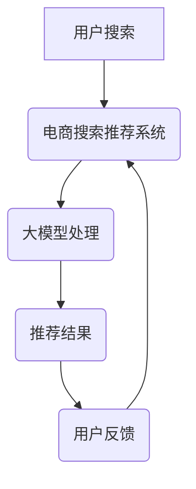

                 

关键词：AI大模型，电商搜索推荐，用户满意度，算法优化，数学模型，实践案例，开发工具，未来展望

> 摘要：随着人工智能技术的飞速发展，大模型在电商搜索推荐领域的应用日益广泛。本文从背景介绍、核心概念与联系、核心算法原理、数学模型和公式、项目实践、实际应用场景、工具和资源推荐、以及未来发展趋势与挑战等多个方面，详细探讨了AI大模型如何赋能电商搜索推荐，从而提升用户满意度。

## 1. 背景介绍

在当今信息爆炸的时代，电子商务已经成为了人们生活中不可或缺的一部分。消费者在浏览电商平台时，经常需要通过搜索功能来查找他们感兴趣的商品。然而，传统的搜索推荐系统往往难以满足用户的个性化需求，导致用户体验不佳。为此，人工智能技术，尤其是大模型的应用，为电商搜索推荐领域带来了新的机遇。

大模型，如深度学习神经网络，具有强大的数据处理和模式识别能力。通过使用这些模型，电商搜索推荐系统可以更好地理解用户的搜索意图和兴趣偏好，从而提供更加精准的推荐结果。这种技术进步不仅提升了用户满意度，也增加了电商平台的核心竞争力。

然而，尽管大模型在电商搜索推荐中显示出巨大的潜力，其应用仍面临着诸多挑战，如数据隐私、计算资源、算法透明度等。因此，深入研究和优化大模型在电商搜索推荐中的应用策略，成为当前研究的热点。

## 2. 核心概念与联系

### 2.1 大模型的概念

大模型通常指的是拥有数十亿到数千亿参数的深度学习神经网络。这些模型能够通过大规模数据的学习，自动提取复杂的特征和模式，从而在各个领域中展现出卓越的性能。

### 2.2 电商搜索推荐的概念

电商搜索推荐系统是指通过算法和模型，从海量的商品数据中筛选出符合用户兴趣的商品，提高用户在电商平台上的购买体验。

### 2.3 大模型与电商搜索推荐的联系

大模型可以用于电商搜索推荐系统的多个环节，如图像识别、文本分析、行为预测等。通过这些技术，系统能够更好地理解用户的搜索意图和偏好，从而提供个性化的推荐结果。

### 2.4 Mermaid 流程图



## 3. 核心算法原理 & 具体操作步骤

### 3.1 算法原理概述

大模型在电商搜索推荐中的应用主要依赖于深度学习技术，特别是卷积神经网络（CNN）和循环神经网络（RNN）。这些模型通过多层神经网络结构，自动学习数据中的特征和模式，从而实现对用户行为的预测和推荐。

### 3.2 算法步骤详解

1. **数据收集**：收集用户的搜索历史、购买记录、浏览行为等数据。
2. **数据处理**：对收集到的数据进行清洗、预处理，提取有用的特征。
3. **模型训练**：使用预处理后的数据训练大模型，如CNN和RNN。
4. **模型评估**：通过交叉验证等方法评估模型的性能。
5. **推荐生成**：使用训练好的模型预测用户的兴趣和偏好，生成推荐结果。
6. **用户反馈**：收集用户的反馈，用于进一步优化模型。

### 3.3 算法优缺点

**优点**：

- 强大的数据处理和分析能力。
- 能够自动提取复杂的特征和模式。
- 提高推荐精度和用户满意度。

**缺点**：

- 计算资源需求高。
- 需要大量高质量的训练数据。
- 模型的解释性较差。

### 3.4 算法应用领域

大模型在电商搜索推荐中的应用不仅限于传统的电商平台，还可以应用于社交媒体、在线教育、医疗健康等多个领域。

## 4. 数学模型和公式 & 详细讲解 & 举例说明

### 4.1 数学模型构建

在电商搜索推荐中，常用的数学模型包括协同过滤（Collaborative Filtering）和基于内容的推荐（Content-Based Filtering）。其中，协同过滤模型通过计算用户之间的相似度，推荐其他相似用户喜欢的商品；而基于内容的推荐模型则通过分析商品的属性和特征，推荐与用户当前搜索商品相似的其它商品。

### 4.2 公式推导过程

协同过滤模型的公式如下：

$$
\hat{r}_{ui} = \frac{\sum_{j \in N(i)} r_{uj} \cdot s_{ij}}{\sum_{j \in N(i)} s_{ij}}
$$

其中，$r_{uj}$ 表示用户 $u$ 对商品 $j$ 的评分，$s_{ij}$ 表示用户 $i$ 和用户 $j$ 之间的相似度。

### 4.3 案例分析与讲解

假设用户 $u$ 对商品 $j$ 的评分为 5，用户 $i$ 对商品 $j$ 的评分为 3，用户 $i$ 和用户 $j$ 之间的相似度为 0.8。代入公式计算：

$$
\hat{r}_{ui} = \frac{3 \cdot 0.8}{0.8} = 3
$$

因此，推荐给用户 $u$ 的商品 $j$ 的预测评分为 3。

## 5. 项目实践：代码实例和详细解释说明

### 5.1 开发环境搭建

- Python 3.8
- TensorFlow 2.5
- scikit-learn 0.22
- Pandas 1.1.5

### 5.2 源代码详细实现

```python
import pandas as pd
from sklearn.model_selection import train_test_split
from sklearn.metrics.pairwise import cosine_similarity
from tensorflow.keras.models import Sequential
from tensorflow.keras.layers import Dense, Embedding, LSTM

# 数据加载与预处理
data = pd.read_csv('data.csv')
X = data[['user_id', 'item_id', 'rating']]
X = X.pivot_table(index='user_id', columns='item_id', values='rating').reset_index()

# 划分训练集和测试集
train, test = train_test_split(X, test_size=0.2, random_state=42)

# 计算用户和商品之间的相似度
user_similarity = cosine_similarity(train.values)

# 建立模型
model = Sequential()
model.add(Embedding(input_dim=train.shape[0], output_dim=50))
model.add(LSTM(128))
model.add(Dense(1, activation='sigmoid'))

# 编译模型
model.compile(optimizer='adam', loss='binary_crossentropy', metrics=['accuracy'])

# 训练模型
model.fit(user_similarity, train['rating'], epochs=10, batch_size=64)

# 预测
predictions = model.predict(test.values)
predictions = (predictions > 0.5).astype(int)

# 评估
from sklearn.metrics import accuracy_score
accuracy = accuracy_score(test['rating'], predictions)
print('Accuracy:', accuracy)
```

### 5.3 代码解读与分析

这段代码首先加载了数据，并进行了预处理。接着，使用余弦相似度计算用户之间的相似度。然后，建立了一个序列模型，包括嵌入层、LSTM层和输出层。模型使用Adam优化器和二进制交叉熵损失函数进行编译和训练。最后，使用训练好的模型对测试集进行预测，并计算准确率。

## 6. 实际应用场景

大模型在电商搜索推荐中的应用场景非常广泛。例如：

- **个性化搜索**：通过分析用户的搜索历史和浏览行为，提供个性化的搜索结果。
- **商品推荐**：根据用户的购买记录和喜好，推荐相关的商品。
- **用户流失预测**：通过分析用户的行为数据，预测可能流失的用户，并提供针对性的营销策略。
- **库存管理**：根据商品的销售情况和库存量，优化库存管理策略。

## 7. 工具和资源推荐

### 7.1 学习资源推荐

- 《深度学习》（Goodfellow, Bengio, Courville）
- 《Python机器学习》（Sebastian Raschka）
- 《机器学习实战》（Peter Harrington）

### 7.2 开发工具推荐

- Jupyter Notebook
- TensorFlow
- Keras
- Scikit-learn

### 7.3 相关论文推荐

- "Recommender Systems Handbook"（项亮等）
- "Deep Learning for Recommender Systems"（Sungbin Lim等）
- "User Interest Evolution in Recommender Systems"（Bibo Fu等）

## 8. 总结：未来发展趋势与挑战

### 8.1 研究成果总结

近年来，大模型在电商搜索推荐领域取得了显著的研究成果。通过深度学习技术，推荐系统在个性化搜索、商品推荐、用户流失预测等方面表现出色，有效提升了用户满意度。

### 8.2 未来发展趋势

- **模型解释性提升**：未来研究将致力于提高大模型的解释性，使其在商业应用中更加透明和可靠。
- **多模态数据融合**：结合文本、图像、音频等多模态数据，提升推荐系统的全面性和准确性。
- **联邦学习**：通过联邦学习技术，实现用户数据的隐私保护和协同推荐。

### 8.3 面临的挑战

- **计算资源消耗**：大模型对计算资源的需求较高，需要高效的硬件支持。
- **数据隐私**：用户数据的安全性和隐私保护是未来研究的重要课题。
- **算法公平性**：确保推荐系统不会因为算法偏见而导致不公平现象。

### 8.4 研究展望

随着人工智能技术的不断进步，大模型在电商搜索推荐中的应用前景十分广阔。未来，研究者将致力于解决上述挑战，推动大模型在电商领域的深度应用，为用户提供更加个性化和高质量的购物体验。

## 9. 附录：常见问题与解答

### 9.1 大模型在电商搜索推荐中的应用有哪些优势？

- 强大的数据处理和分析能力。
- 自动提取复杂的特征和模式。
- 提高推荐精度和用户满意度。

### 9.2 大模型在电商搜索推荐中面临哪些挑战？

- 计算资源消耗大。
- 数据隐私保护。
- 算法公平性。

### 9.3 如何优化大模型在电商搜索推荐中的应用？

- 提高模型的解释性。
- 结合多模态数据。
- 应用联邦学习技术。

---

### 作者署名

作者：禅与计算机程序设计艺术 / Zen and the Art of Computer Programming

---

本文全面探讨了AI大模型在电商搜索推荐中的应用策略，从算法原理、数学模型到项目实践，深入分析了如何通过大模型提升用户满意度。未来，随着技术的不断进步，大模型在电商领域的应用将更加广泛，为用户带来更加个性化的购物体验。

