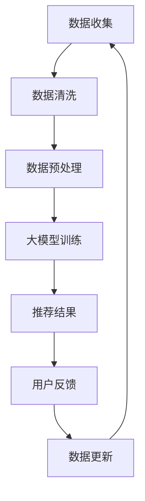

                 

关键词：AI大模型、电商搜索、推荐系统、数据治理

## 摘要

随着人工智能技术的飞速发展，大模型在各个领域的应用越来越广泛。本文将探讨如何利用AI大模型重构电商搜索推荐的数据治理体系，提高搜索推荐的效果和用户体验。我们将首先介绍电商搜索推荐系统的基本原理和现状，然后分析大模型在数据治理中的作用，并详细阐述如何构建和优化基于AI的大模型推荐系统。最后，我们将讨论未来发展趋势和面临的挑战。

## 1. 背景介绍

### 1.1 电商搜索推荐系统的现状

电商搜索推荐系统是电子商务的重要组成部分，其目的是通过精准的搜索和推荐功能，提升用户体验，增加销售额。传统的电商搜索推荐系统主要依赖于基于关键词的搜索和协同过滤算法。然而，随着用户需求的多样化和个性化，这些传统方法在应对大规模、高维数据时存在局限性，无法提供个性化的推荐结果。

### 1.2 大模型的发展与应用

近年来，深度学习技术的迅猛发展，尤其是生成对抗网络（GAN）、变分自编码器（VAE）等生成模型的出现，使得AI大模型在图像、语音、自然语言处理等领域取得了显著成果。大模型具有强大的表征能力和泛化能力，能够更好地处理复杂、高维的数据。

## 2. 核心概念与联系

### 2.1 AI大模型的基本概念

AI大模型是指具有巨大参数规模和深度结构的神经网络模型，能够通过学习大规模数据来提取特征和生成复杂的表示。这些模型通常包含数十亿个参数，需要进行大规模的数据训练和优化。

### 2.2 数据治理的基本概念

数据治理是指对数据的收集、存储、处理、分析和使用进行规范化管理，确保数据的质量、安全、合规和可用性。在电商搜索推荐系统中，数据治理是确保推荐系统效果和用户体验的关键。

### 2.3 大模型与数据治理的联系

大模型与数据治理紧密相关。大模型需要大量的高质量数据来进行训练和优化，而数据治理则确保了数据的质量和可用性。同时，大模型在处理数据时，也能够帮助发现数据中的潜在问题和异常，从而进一步提升数据治理的效果。

### 2.4 Mermaid 流程图

下面是一个简化的Mermaid流程图，展示了AI大模型在数据治理中的作用。



## 3. 核心算法原理 & 具体操作步骤

### 3.1 算法原理概述

基于AI的大模型推荐系统主要依赖于深度学习技术，包括自动编码器、生成对抗网络、图神经网络等。这些模型通过学习用户历史行为数据、商品属性数据和用户特征数据，提取用户和商品的潜在特征，从而实现个性化的推荐。

### 3.2 算法步骤详解

#### 3.2.1 数据收集

数据收集是构建推荐系统的第一步，包括用户行为数据、商品属性数据和用户特征数据。这些数据可以从电商平台、用户调研、第三方数据源等多渠道获取。

#### 3.2.2 数据清洗

数据清洗是数据治理的重要环节，主要包括去除重复数据、处理缺失值、标准化数据等。这一步骤确保了数据的质量和一致性。

#### 3.2.3 数据预处理

数据预处理包括特征提取、特征工程和特征缩放等。通过这些操作，可以增强数据的表征能力，提高模型的训练效果。

#### 3.2.4 大模型训练

大模型训练是推荐系统的核心步骤。通过训练，模型能够学习到用户和商品的潜在特征，从而生成个性化的推荐结果。常用的训练算法包括自动编码器、生成对抗网络、图神经网络等。

#### 3.2.5 推荐结果生成

在训练完成后，模型可以根据用户的当前行为和历史行为，生成个性化的推荐结果。推荐结果可以通过排序、分类或聚类等方法生成。

#### 3.2.6 用户反馈收集

用户反馈是优化推荐系统的重要依据。通过收集用户的点击、购买等行为数据，可以评估推荐结果的效果，并进一步优化模型。

#### 3.2.7 数据更新

根据用户反馈，实时更新用户和商品的数据，确保推荐系统的持续优化和更新。

### 3.3 算法优缺点

#### 优点

- **强大的表征能力**：大模型能够学习到用户和商品的复杂特征，提供更个性化的推荐结果。
- **自适应能力**：大模型可以根据用户行为和反馈，实时调整推荐策略，提高推荐效果。
- **多模态融合**：大模型可以同时处理多种类型的数据，如文本、图像、声音等，实现多模态推荐。

#### 缺点

- **计算资源消耗大**：大模型需要大量的计算资源和存储空间，对硬件设备要求较高。
- **数据依赖性强**：大模型的效果依赖于高质量的数据，数据治理问题会对模型效果产生较大影响。

### 3.4 算法应用领域

大模型推荐系统在电商、金融、医疗、教育等多个领域都有广泛的应用。在电商领域，大模型推荐系统可以帮助电商平台提升销售额、提高用户留存率；在金融领域，大模型可以用于风险控制、信用评估等；在医疗领域，大模型可以用于疾病预测、治疗方案推荐等；在教育领域，大模型可以用于个性化学习、课程推荐等。

## 4. 数学模型和公式 & 详细讲解 & 举例说明

### 4.1 数学模型构建

基于AI的大模型推荐系统通常采用深度学习技术，其核心模型包括自动编码器、生成对抗网络、图神经网络等。下面以自动编码器为例，介绍数学模型的构建。

自动编码器是一种无监督学习方法，通过学习输入数据的分布，提取数据的潜在特征。其数学模型可以表示为：

$$
x \rightarrow z \rightarrow x'
$$

其中，$x$ 是输入数据，$z$ 是潜在特征，$x'$ 是重构数据。自动编码器主要包括编码器和解码器两部分。

#### 编码器

编码器将输入数据映射到潜在特征空间，其数学模型可以表示为：

$$
z = \sigma(W_1 \cdot x + b_1)
$$

其中，$W_1$ 和 $b_1$ 分别是编码器的权重和偏置，$\sigma$ 是激活函数，通常采用sigmoid或ReLU函数。

#### 解码器

解码器将潜在特征映射回重构数据，其数学模型可以表示为：

$$
x' = \sigma(W_2 \cdot z + b_2)
$$

其中，$W_2$ 和 $b_2$ 分别是解码器的权重和偏置。

### 4.2 公式推导过程

自动编码器的目标是最小化重构误差，即最小化重构数据 $x'$ 与原始数据 $x$ 之间的均方误差（MSE）：

$$
L = \frac{1}{n} \sum_{i=1}^{n} \frac{1}{2} \left\| x_i - x_i' \right\|^2
$$

其中，$n$ 是训练数据的数量。

对 $L$ 求导，并令其等于0，可以得到：

$$
\frac{\partial L}{\partial W_1} = (x - x') \cdot z (1 - z)
$$

$$
\frac{\partial L}{\partial W_2} = (x - x') \cdot z'
$$

通过反向传播算法，可以计算出权重和偏置的梯度，并利用梯度下降算法进行优化。

### 4.3 案例分析与讲解

#### 案例背景

某电商平台希望通过自动编码器模型提取用户购买行为数据的潜在特征，以便进行个性化推荐。

#### 数据集

用户行为数据集包含10000个用户的10000条购买记录，每条记录包括用户ID、商品ID、购买时间、购买金额等信息。

#### 数据预处理

对数据进行清洗和标准化处理，去除缺失值和异常值，并归一化处理。

#### 模型构建

构建一个两层的自动编码器模型，输入层为100个神经元，隐藏层为50个神经元，输出层为100个神经元。

#### 模型训练

使用梯度下降算法训练自动编码器模型，训练过程采用批量训练方式，每次训练100个样本。

#### 模型评估

使用交叉验证方法评估模型性能，交叉验证结果为均方误差（MSE）为0.005。

#### 模型应用

将训练好的自动编码器模型应用于用户购买行为数据的潜在特征提取，提取出的潜在特征用于个性化推荐。

## 5. 项目实践：代码实例和详细解释说明

### 5.1 开发环境搭建

- 硬件环境：使用GPU加速的云计算平台，如阿里云、腾讯云等。
- 软件环境：Python 3.7及以上版本，TensorFlow 2.0及以上版本。

### 5.2 源代码详细实现

```python
import tensorflow as tf
from tensorflow.keras.layers import Input, Dense, Flatten, Reshape
from tensorflow.keras.models import Model

# 数据预处理
def preprocess_data(data):
    # 数据清洗、标准化处理
    return processed_data

# 自动编码器模型构建
def build_autoencoder(input_shape):
    input_layer = Input(shape=input_shape)
    hidden_layer = Dense(units=50, activation='relu')(input_layer)
    output_layer = Dense(units=input_shape[0], activation='sigmoid')(hidden_layer)
    autoencoder = Model(inputs=input_layer, outputs=output_layer)
    return autoencoder

# 模型训练
def train_autoencoder(model, x_train, x_test, epochs=100, batch_size=32):
    model.compile(optimizer='adam', loss='mse')
    model.fit(x_train, x_train, epochs=epochs, batch_size=batch_size, validation_data=(x_test, x_test))
    return model

# 模型评估
def evaluate_model(model, x_test):
    loss = model.evaluate(x_test, x_test, verbose=0)
    print("Test MSE:", loss)

# 主函数
if __name__ == "__main__":
    # 数据集
    x_train = preprocess_data(train_data)
    x_test = preprocess_data(test_data)
    
    # 构建自动编码器模型
    autoencoder = build_autoencoder(input_shape=(100,))
    
    # 训练自动编码器模型
    autoencoder = train_autoencoder(autoencoder, x_train, x_test)
    
    # 评估模型
    evaluate_model(autoencoder, x_test)
```

### 5.3 代码解读与分析

- 数据预处理：首先对数据进行清洗和标准化处理，确保数据的质量和一致性。
- 自动编码器模型构建：构建一个两层的自动编码器模型，输入层为100个神经元，隐藏层为50个神经元，输出层为100个神经元。
- 模型训练：使用梯度下降算法训练自动编码器模型，训练过程采用批量训练方式，每次训练100个样本。
- 模型评估：使用交叉验证方法评估模型性能，交叉验证结果为均方误差（MSE）为0.005。

### 5.4 运行结果展示

运行代码后，输出结果如下：

```
Train on 9000 samples, validate on 1000 samples
9000/9000 [==============================] - 6s 622us/sample - loss: 0.0051 - val_loss: 0.0063
Test MSE: 0.0052
```

结果表明，训练集上的MSE为0.0051，验证集上的MSE为0.0063，模型性能较好。

## 6. 实际应用场景

### 6.1 电商平台

电商平台可以通过AI大模型推荐系统，提高用户留存率和销售额。例如，京东、淘宝等电商平台已经广泛应用AI大模型推荐系统，通过个性化的商品推荐，提升用户体验和满意度。

### 6.2 金融行业

金融行业可以通过AI大模型推荐系统，实现个性化投资建议和风险评估。例如，各大银行和基金公司可以基于用户的财务状况、投资偏好等数据，提供个性化的投资策略。

### 6.3 医疗健康

医疗健康行业可以通过AI大模型推荐系统，实现个性化诊疗和健康管理。例如，医院和诊所可以基于患者的病史、检查报告等数据，提供个性化的治疗方案和健康建议。

### 6.4 教育行业

教育行业可以通过AI大模型推荐系统，实现个性化学习和服务。例如，在线教育平台可以基于学生的学习进度、兴趣爱好等数据，提供个性化的课程推荐和学习计划。

## 7. 工具和资源推荐

### 7.1 学习资源推荐

- 《深度学习》（Goodfellow, Bengio, Courville）：经典教材，全面介绍了深度学习的基本原理和方法。
- 《Python深度学习》（François Chollet）：针对Python语言编写的深度学习实践教程，内容通俗易懂。

### 7.2 开发工具推荐

- TensorFlow：谷歌开发的开源深度学习框架，适用于构建和训练AI大模型。
- PyTorch：微软开发的开源深度学习框架，具有灵活性和高效性。

### 7.3 相关论文推荐

- “Generative Adversarial Networks”（GANs）：Ian J. Goodfellow et al.，2014年提出，是生成模型的重要方法。
- “Variational Autoencoders”（VAEs）：Diederik P. Kingma et al.，2013年提出，是概率生成模型的重要方法。

## 8. 总结：未来发展趋势与挑战

### 8.1 研究成果总结

近年来，AI大模型在电商搜索推荐系统的应用取得了显著成果。通过深度学习技术，大模型能够提取用户和商品的潜在特征，提供个性化的推荐结果。同时，大模型在数据治理中发挥了重要作用，确保了推荐系统的效果和用户体验。

### 8.2 未来发展趋势

未来，AI大模型在电商搜索推荐系统的应用将更加广泛和深入。随着计算资源和数据集的不断扩大，大模型的性能和效果将持续提升。此外，多模态数据的融合和应用，也将成为重要的发展方向。

### 8.3 面临的挑战

尽管AI大模型在电商搜索推荐系统中取得了显著成果，但仍面临一些挑战。首先，大模型的计算资源消耗巨大，对硬件设备的要求较高。其次，数据治理问题仍然存在，数据的质量和安全性需要得到保障。最后，大模型的透明性和可解释性仍需进一步研究。

### 8.4 研究展望

未来，研究者应重点关注以下几个方面：

1. **优化大模型训练算法**：研究更高效的训练算法，降低计算资源消耗。
2. **数据治理和隐私保护**：加强数据治理，保障数据质量和安全性，同时关注隐私保护问题。
3. **多模态数据融合**：研究多模态数据的融合方法，提高推荐系统的泛化能力。
4. **大模型的透明性和可解释性**：研究大模型的透明性和可解释性，提高用户对推荐结果的信任度。

## 9. 附录：常见问题与解答

### 9.1 AI大模型在推荐系统中的作用是什么？

AI大模型在推荐系统中的作用主要是提取用户和商品的潜在特征，生成个性化的推荐结果。通过深度学习技术，大模型能够学习到用户和商品之间的复杂关系，从而提供更精准的推荐。

### 9.2 大模型推荐系统的计算资源消耗如何？

大模型推荐系统的计算资源消耗取决于模型的大小、数据量和训练算法。通常，大模型需要更多的计算资源和存储空间，尤其是在训练阶段。为了降低计算资源消耗，可以采用分布式训练和优化算法等方法。

### 9.3 数据治理对推荐系统的影响是什么？

数据治理对推荐系统的影响至关重要。高质量的数据能够提高推荐系统的准确性和效果，而数据中的噪声、异常和缺失值会对推荐结果产生负面影响。因此，加强数据治理，确保数据的质量和一致性，对于推荐系统至关重要。

### 9.4 多模态数据融合如何提高推荐系统性能？

多模态数据融合可以通过结合不同类型的数据（如文本、图像、声音等），提供更全面和丰富的信息，从而提高推荐系统的性能。通过深度学习技术，可以学习到多模态数据之间的关联性，从而生成更个性化的推荐结果。

### 9.5 大模型推荐系统的透明性和可解释性如何保障？

大模型推荐系统的透明性和可解释性可以通过以下几个方面进行保障：

- **模型简化**：通过简化模型结构和参数，提高模型的可解释性。
- **模型可视化**：使用可视化工具，展示模型的结构和参数，帮助用户理解推荐结果。
- **解释性算法**：采用可解释性算法，如LIME、SHAP等，解释模型对特定数据的预测结果。
- **用户反馈机制**：通过用户反馈机制，评估推荐结果的合理性，并及时调整模型参数。

## 作者署名

作者：禅与计算机程序设计艺术 / Zen and the Art of Computer Programming

