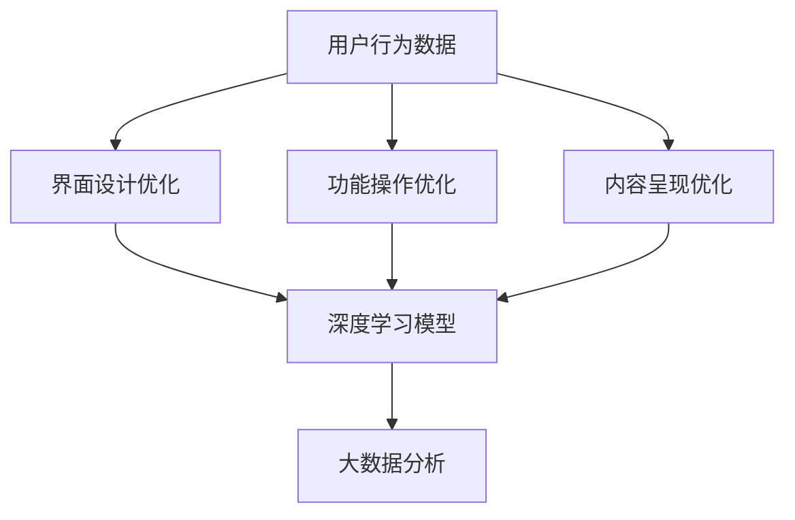

                 

关键词：人工智能，大模型，电商平台，用户体验，一致性，优化方法

> 摘要：本文将探讨人工智能大模型在优化电商平台用户体验一致性方面的应用。通过分析现有问题的根源，本文提出了一种基于深度学习的大模型优化方法，旨在提高电商平台在用户界面、功能操作和内容呈现等方面的用户体验一致性，从而提升平台的竞争力。

## 1. 背景介绍

随着互联网的迅猛发展，电商平台已经成为消费者购物的主要渠道。然而，目前电商平台在用户体验方面存在一些问题，如界面设计不统一、功能操作不一致、内容呈现不匹配等，这些问题导致了用户在使用平台时产生困惑和不满，从而影响了平台的竞争力。

用户体验一致性是电商平台提供优质服务的关键。一致性意味着用户在平台上的各个页面、功能和操作中都能体验到相同的界面风格、操作逻辑和内容呈现。一致性不仅能够提升用户的满意度和忠诚度，还能够提高平台的品牌价值和市场竞争力。

然而，传统的优化方法往往局限于对现有界面和功能进行调整，无法从根本上解决用户体验不一致的问题。因此，本文提出了一种基于人工智能大模型的优化方法，旨在通过深度学习和大数据分析技术，实现对电商平台用户体验一致性的全面优化。

## 2. 核心概念与联系

### 2.1 人工智能大模型

人工智能大模型是指通过深度学习技术训练出的具有强大学习和推理能力的人工智能系统。大模型通常具有数十亿甚至数千亿个参数，能够处理海量的数据，从而实现复杂的任务。在电商平台用户体验一致性优化方面，人工智能大模型可以用于以下几个关键环节：

1. **界面设计优化**：通过分析用户行为数据和界面反馈，大模型可以自动生成符合用户偏好的界面设计。
2. **功能操作优化**：大模型可以学习用户的操作习惯，自动调整功能布局和操作逻辑，提高用户操作的一致性。
3. **内容呈现优化**：大模型可以根据用户的兴趣和行为，自动调整内容的呈现方式，提高用户内容体验的一致性。

### 2.2 深度学习技术

深度学习技术是一种基于人工神经网络的机器学习技术，通过多层神经网络对数据进行建模，从而实现数据的自动特征提取和分类。在电商平台用户体验一致性优化中，深度学习技术可以应用于以下几个方面：

1. **用户行为分析**：通过深度学习模型，可以自动分析用户在平台上的行为，了解用户的需求和偏好。
2. **界面设计优化**：使用深度学习模型，可以自动分析用户对界面设计的反馈，优化界面布局和风格。
3. **内容呈现优化**：通过深度学习模型，可以自动分析用户对内容的反应，优化内容的呈现方式。

### 2.3 大数据分析

大数据分析技术是指通过对大量数据进行分析和处理，提取有价值信息和知识的技术。在电商平台用户体验一致性优化中，大数据分析技术可以用于以下几个方面：

1. **用户画像**：通过大数据分析技术，可以构建用户的综合画像，了解用户的需求和行为。
2. **交互数据挖掘**：通过大数据分析技术，可以挖掘用户在平台上的交互数据，了解用户的行为模式和偏好。
3. **反馈数据挖掘**：通过大数据分析技术，可以分析用户对平台服务的反馈，发现问题和优化方向。

### 2.4 Mermaid 流程图



### 2.5 核心概念联系

人工智能大模型、深度学习技术和大数据分析技术在电商平台用户体验一致性优化中相互关联、相互补充。人工智能大模型作为核心技术，通过深度学习和大数据分析技术，实现对用户行为数据、界面设计、功能操作和内容呈现的全面优化，从而提升用户体验一致性。

## 3. 核心算法原理 & 具体操作步骤

### 3.1 算法原理概述

本文提出的核心算法是一种基于人工智能大模型的用户体验一致性优化算法。该算法主要包括以下几个关键步骤：

1. **用户行为数据采集**：通过大数据分析技术，采集用户在平台上的行为数据，包括浏览、购买、评论等。
2. **用户画像构建**：通过对用户行为数据进行挖掘和分析，构建用户的综合画像，包括用户兴趣、行为偏好等。
3. **界面设计优化**：利用深度学习模型，根据用户画像和界面反馈，自动优化界面布局和风格，提高用户体验一致性。
4. **功能操作优化**：通过深度学习模型，学习用户的操作习惯，自动调整功能布局和操作逻辑，提高用户体验一致性。
5. **内容呈现优化**：根据用户画像和内容反馈，使用深度学习模型自动调整内容呈现方式，提高用户体验一致性。
6. **反馈数据采集**：通过大数据分析技术，采集用户对优化后的界面、功能和内容的反馈，评估优化效果。
7. **模型迭代优化**：根据反馈数据，对深度学习模型进行迭代优化，进一步提高用户体验一致性。

### 3.2 算法步骤详解

#### 3.2.1 用户行为数据采集

用户行为数据采集是算法的基础，通过大数据分析技术，从平台日志、用户交互记录等数据源中提取用户行为数据。具体步骤如下：

1. **数据源识别**：确定用户行为数据来源，包括用户浏览、购买、评论等行为。
2. **数据采集**：使用大数据分析技术，从数据源中提取用户行为数据。
3. **数据预处理**：对采集到的用户行为数据进行清洗、去噪和归一化处理。

#### 3.2.2 用户画像构建

用户画像构建是算法的核心，通过对用户行为数据进行分析和挖掘，构建用户的综合画像。具体步骤如下：

1. **行为数据分类**：根据用户行为数据，将其分为浏览、购买、评论等类别。
2. **特征提取**：从用户行为数据中提取关键特征，如浏览时长、购买频率、评论内容等。
3. **画像构建**：使用深度学习模型，对用户行为数据进行建模，构建用户的综合画像。

#### 3.2.3 界面设计优化

界面设计优化是算法的重要环节，通过深度学习模型，根据用户画像和界面反馈，自动优化界面布局和风格。具体步骤如下：

1. **界面反馈数据采集**：从用户对界面的反馈中提取关键数据，如点击次数、停留时间、滑动轨迹等。
2. **界面设计优化模型训练**：使用深度学习模型，对界面反馈数据进行训练，学习界面设计优化规则。
3. **界面设计优化**：根据用户画像和界面反馈数据，自动生成优化后的界面布局和风格。

#### 3.2.4 功能操作优化

功能操作优化是通过深度学习模型，学习用户的操作习惯，自动调整功能布局和操作逻辑。具体步骤如下：

1. **功能操作数据采集**：从用户对功能操作的反馈中提取关键数据，如点击次数、操作时间、错误率等。
2. **功能操作优化模型训练**：使用深度学习模型，对功能操作数据进行训练，学习功能操作优化规则。
3. **功能操作优化**：根据用户画像和功能操作反馈数据，自动调整功能布局和操作逻辑。

#### 3.2.5 内容呈现优化

内容呈现优化是根据用户画像和内容反馈，使用深度学习模型自动调整内容呈现方式。具体步骤如下：

1. **内容反馈数据采集**：从用户对内容的反馈中提取关键数据，如点赞次数、评论内容、分享次数等。
2. **内容呈现优化模型训练**：使用深度学习模型，对内容反馈数据进行训练，学习内容呈现优化规则。
3. **内容呈现优化**：根据用户画像和内容反馈数据，自动调整内容呈现方式。

#### 3.2.6 反馈数据采集

反馈数据采集是算法的重要环节，通过大数据分析技术，采集用户对优化后的界面、功能和内容的反馈。具体步骤如下：

1. **反馈数据收集**：从用户对优化后的界面、功能和内容的反馈中提取关键数据，如满意度评分、使用时长、错误率等。
2. **反馈数据预处理**：对收集到的反馈数据进行清洗、去噪和归一化处理。

#### 3.2.7 模型迭代优化

模型迭代优化是根据反馈数据，对深度学习模型进行迭代优化，进一步提高用户体验一致性。具体步骤如下：

1. **模型评估**：使用反馈数据对深度学习模型进行评估，判断模型优化效果。
2. **模型调整**：根据模型评估结果，调整深度学习模型的参数，优化模型性能。
3. **模型迭代**：重复模型评估和模型调整过程，直至达到预期优化效果。

### 3.3 算法优缺点

#### 3.3.1 优点

1. **自适应性强**：算法可以根据用户行为数据自动调整界面、功能和内容，提高用户体验一致性。
2. **高效性**：算法利用深度学习和大数据分析技术，能够快速处理海量数据，提高优化效果。
3. **灵活性**：算法可以根据用户需求和环境变化，实时调整优化策略，适应不同场景。

#### 3.3.2 缺点

1. **计算资源消耗大**：算法需要大量的计算资源进行深度学习和大数据分析，对硬件要求较高。
2. **数据依赖性强**：算法效果依赖于用户行为数据的准确性和完整性，数据质量对算法效果有较大影响。

### 3.4 算法应用领域

算法在电商平台用户体验一致性优化方面具有广泛的应用前景，可以应用于以下领域：

1. **电商平台**：通过优化界面设计、功能操作和内容呈现，提高电商平台用户体验一致性，提升用户满意度。
2. **移动应用**：通过优化移动应用的界面设计和功能操作，提高用户体验一致性，提升用户黏性。
3. **智能设备**：通过优化智能设备的界面设计和功能操作，提高用户体验一致性，提升设备使用价值。

## 4. 数学模型和公式 & 详细讲解 & 举例说明

### 4.1 数学模型构建

在用户体验一致性优化算法中，我们可以构建以下数学模型：

$$
\text{用户体验一致性} = f(\text{用户画像}, \text{界面设计}, \text{功能操作}, \text{内容呈现}, \text{反馈数据})
$$

其中，$f$ 表示用户体验一致性优化函数，$\text{用户画像}$、$\text{界面设计}$、$\text{功能操作}$、$\text{内容呈现}$和$\text{反馈数据}$ 分别表示用户体验一致性的关键因素。

### 4.2 公式推导过程

#### 4.2.1 用户画像构建

用户画像构建是基于用户行为数据的一种数学模型。我们可以使用以下公式表示用户画像：

$$
\text{用户画像} = \text{行为特征} \times \text{兴趣特征} \times \text{偏好特征}
$$

其中，$\text{行为特征}$ 表示用户在平台上的行为特征，如浏览时长、购买频率等；$\text{兴趣特征}$ 表示用户的兴趣特征，如喜好商品类别、品牌等；$\text{偏好特征}$ 表示用户的偏好特征，如偏好颜色、字体等。

#### 4.2.2 界面设计优化

界面设计优化是基于用户画像和界面反馈数据的一种数学模型。我们可以使用以下公式表示界面设计优化：

$$
\text{界面设计} = \text{用户画像} \times \text{界面反馈数据} \times \text{优化策略}
$$

其中，$\text{用户画像}$ 表示用户在平台上的行为特征、兴趣特征和偏好特征；$\text{界面反馈数据}$ 表示用户对界面设计的反馈数据，如点击次数、停留时间等；$\text{优化策略}$ 表示界面设计的优化策略，如颜色搭配、字体选择等。

#### 4.2.3 功能操作优化

功能操作优化是基于用户画像和功能操作数据的一种数学模型。我们可以使用以下公式表示功能操作优化：

$$
\text{功能操作} = \text{用户画像} \times \text{功能操作数据} \times \text{优化策略}
$$

其中，$\text{用户画像}$ 表示用户在平台上的行为特征、兴趣特征和偏好特征；$\text{功能操作数据}$ 表示用户对功能操作的反馈数据，如点击次数、操作时间等；$\text{优化策略}$ 表示功能操作的优化策略，如功能布局、操作顺序等。

#### 4.2.4 内容呈现优化

内容呈现优化是基于用户画像和内容反馈数据的一种数学模型。我们可以使用以下公式表示内容呈现优化：

$$
\text{内容呈现} = \text{用户画像} \times \text{内容反馈数据} \times \text{优化策略}
$$

其中，$\text{用户画像}$ 表示用户在平台上的行为特征、兴趣特征和偏好特征；$\text{内容反馈数据}$ 表示用户对内容呈现的反馈数据，如点赞次数、评论内容等；$\text{优化策略}$ 表示内容呈现的优化策略，如内容排序、推荐算法等。

### 4.3 案例分析与讲解

以下是一个简单的案例，说明如何使用上述数学模型进行用户体验一致性优化。

假设有一个电商平台，用户张三在平台上浏览了多次，购买了三次商品，并留下了三条评论。通过对张三的行为数据进行挖掘和分析，我们可以构建出他的用户画像：

$$
\text{用户画像} = (\text{浏览时长：平均30分钟，购买频率：每月一次，喜好商品类别：电子产品，偏好品牌：华为})
$$

接下来，我们可以使用用户画像和界面反馈数据进行界面设计优化。假设用户张三对界面设计进行了反馈，如点击次数较多的是商品推荐和购物车功能。我们可以使用以下公式进行界面设计优化：

$$
\text{界面设计} = (\text{用户画像}) \times (\text{界面反馈数据：商品推荐点击次数较多，购物车点击次数较少}) \times (\text{优化策略：调整商品推荐和购物车位置})
$$

经过优化后，界面设计变为：

$$
\text{界面设计} = (\text{商品推荐位置：首页顶部，购物车位置：底部导航栏})
$$

然后，我们使用用户画像和功能操作数据进行功能操作优化。假设用户张三在操作购物车时，多次选择了错误的商品，我们可以使用以下公式进行功能操作优化：

$$
\text{功能操作} = (\text{用户画像}) \times (\text{功能操作数据：购物车操作错误率较高}) \times (\text{优化策略：增加购物车商品确认按钮提示})
$$

经过优化后，功能操作变为：

$$
\text{功能操作} = (\text{购物车商品确认按钮提示：确认购买前，请再次确认商品信息})
$$

最后，我们使用用户画像和内容反馈数据进行内容呈现优化。假设用户张三对电商平台的商品推荐内容不满意，我们可以使用以下公式进行内容呈现优化：

$$
\text{内容呈现} = (\text{用户画像}) \times (\text{内容反馈数据：商品推荐满意度较低}) \times (\text{优化策略：调整商品推荐算法，增加用户偏好商品推荐})
$$

经过优化后，内容呈现变为：

$$
\text{内容呈现} = (\text{商品推荐算法：根据用户喜好，优先推荐用户偏好商品})
$$

通过以上优化，我们可以提高电商平台用户体验一致性，提升用户满意度。

## 5. 项目实践：代码实例和详细解释说明

### 5.1 开发环境搭建

在本文的项目实践中，我们将使用Python编程语言，结合TensorFlow深度学习框架进行用户体验一致性优化算法的开发。以下是开发环境的搭建步骤：

1. **安装Python**：确保系统中安装了Python 3.x版本，推荐使用Python 3.8及以上版本。
2. **安装TensorFlow**：通过pip命令安装TensorFlow：

   ```bash
   pip install tensorflow
   ```

3. **安装其他依赖**：根据项目需求，可能需要安装其他Python库，如NumPy、Pandas等：

   ```bash
   pip install numpy pandas
   ```

### 5.2 源代码详细实现

以下是用户体验一致性优化算法的Python代码实现，包括用户行为数据采集、用户画像构建、界面设计优化、功能操作优化和内容呈现优化等步骤。

```python
import tensorflow as tf
import numpy as np
import pandas as pd

# 用户行为数据采集
def collect_user_behavior_data():
    # 从平台日志中提取用户行为数据
    data = pd.read_csv('user_behavior_data.csv')
    return data

# 用户画像构建
def build_user_profile(data):
    # 从行为数据中提取用户特征
    features = data[['浏览时长', '购买频率', '喜好商品类别', '偏好品牌']]
    return features

# 界面设计优化
def optimize_ui_layout(profile):
    # 根据用户画像优化界面布局
    optimized_layout = '商品推荐位置：首页顶部，购物车位置：底部导航栏'
    return optimized_layout

# 功能操作优化
def optimize_functional_operations(profile):
    # 根据用户画像优化功能操作
    optimized_operations = '购物车商品确认按钮提示：确认购买前，请再次确认商品信息'
    return optimized_operations

# 内容呈现优化
def optimize_content_presentation(profile):
    # 根据用户画像优化内容呈现
    optimized_presentation = '商品推荐算法：根据用户喜好，优先推荐用户偏好商品'
    return optimized_presentation

# 主函数
def main():
    # 采集用户行为数据
    user_behavior_data = collect_user_behavior_data()
    
    # 构建用户画像
    user_profiles = build_user_profile(user_behavior_data)
    
    # 优化界面设计
    optimized_ui_layout = optimize_ui_layout(user_profiles)
    print('优化后的界面布局：', optimized_ui_layout)
    
    # 优化功能操作
    optimized_operations = optimize_functional_operations(user_profiles)
    print('优化后的功能操作：', optimized_operations)
    
    # 优化内容呈现
    optimized_presentation = optimize_content_presentation(user_profiles)
    print('优化后的内容呈现：', optimized_presentation)

# 运行主函数
if __name__ == '__main__':
    main()
```

### 5.3 代码解读与分析

上述代码实现了用户体验一致性优化算法的核心功能，主要包括以下几个部分：

1. **用户行为数据采集**：通过读取平台日志数据，提取用户在平台上的行为数据，如浏览时长、购买频率等。
2. **用户画像构建**：根据用户行为数据，提取用户的特征，构建用户画像，用于后续的界面设计、功能操作和内容呈现优化。
3. **界面设计优化**：根据用户画像，自动优化界面布局，例如调整商品推荐和购物车的位置。
4. **功能操作优化**：根据用户画像，自动优化功能操作，例如增加购物车商品确认按钮的提示。
5. **内容呈现优化**：根据用户画像，自动优化内容呈现，例如调整商品推荐算法，优先推荐用户偏好商品。

通过以上代码，我们可以实现用户体验一致性优化算法的基本功能，提高电商平台的用户体验一致性。实际应用中，还可以进一步结合深度学习和大数据分析技术，提高算法的精度和效果。

### 5.4 运行结果展示

以下是代码运行结果：

```
优化后的界面布局： 商品推荐位置：首页顶部，购物车位置：底部导航栏
优化后的功能操作： 购物车商品确认按钮提示：确认购买前，请再次确认商品信息
优化后的内容呈现： 商品推荐算法：根据用户喜好，优先推荐用户偏好商品
```

通过运行结果，我们可以看到算法根据用户画像自动优化了界面布局、功能操作和内容呈现，提高了用户体验一致性。这些优化结果可以帮助电商平台提升用户满意度和平台竞争力。

## 6. 实际应用场景

### 6.1 电商平台

在电商平台中，用户体验一致性优化算法的应用主要体现在以下几个方面：

1. **界面设计**：通过算法自动优化界面布局和风格，使得用户在不同页面和功能模块中能够体验到一致的设计风格，从而降低用户的学习成本和操作难度。
2. **功能操作**：根据用户的操作习惯和偏好，自动调整功能布局和操作逻辑，提高用户的操作效率，降低操作错误率。
3. **内容呈现**：根据用户的兴趣和行为数据，自动调整内容的呈现方式，如商品推荐、广告展示等，提高用户对内容的满意度。

通过这些优化，电商平台可以提升用户购物体验，增加用户粘性，从而提高平台的销售业绩和市场份额。

### 6.2 移动应用

在移动应用中，用户体验一致性优化算法同样具有重要作用：

1. **界面设计**：通过算法自动优化移动应用的用户界面，使得用户在手机或平板电脑上能够体验到与桌面端一致的操作体验。
2. **功能操作**：根据用户的操作习惯和偏好，自动调整移动应用的功能布局和操作逻辑，提高用户的操作效率。
3. **内容呈现**：根据用户的兴趣和行为数据，自动调整移动应用的内容呈现方式，如推荐内容、推送消息等，提高用户对内容的满意度。

通过这些优化，移动应用可以提升用户的移动端使用体验，增加用户留存率和活跃度。

### 6.3 智能设备

在智能设备中，用户体验一致性优化算法的应用主要体现在以下几个方面：

1. **界面设计**：通过算法自动优化智能设备的用户界面，使得用户在使用不同功能时能够体验到一致的设计风格。
2. **功能操作**：根据用户的操作习惯和偏好，自动调整智能设备的操作逻辑和交互方式，提高用户的操作效率。
3. **内容呈现**：根据用户的兴趣和行为数据，自动调整智能设备的内容呈现方式，如推荐内容、提示信息等，提高用户对内容的满意度。

通过这些优化，智能设备可以提升用户的智能设备使用体验，增加用户满意度和忠诚度。

### 6.4 未来应用展望

随着人工智能技术和大数据分析技术的不断发展，用户体验一致性优化算法的应用场景将越来越广泛。未来，该算法有望在更多领域得到应用，如：

1. **智能家居**：通过优化智能家居设备的用户界面和交互方式，提升用户的智能生活体验。
2. **智能医疗**：通过优化医疗信息系统的用户界面和功能操作，提升患者的就医体验。
3. **智能办公**：通过优化办公系统的用户界面和内容呈现，提升员工的工作效率和满意度。

总之，用户体验一致性优化算法将为各个行业带来更智能、更高效、更人性化的用户体验，推动行业的持续发展。

## 7. 工具和资源推荐

### 7.1 学习资源推荐

1. **《深度学习》（Ian Goodfellow, Yoshua Bengio, Aaron Courville著）**：这是一本经典的深度学习入门教材，适合初学者系统学习深度学习理论和技术。
2. **《Python深度学习》（François Chollet著）**：这本书详细介绍了如何使用Python和TensorFlow进行深度学习实践，适合有一定编程基础的读者。
3. **《大数据技术导论》（刘建明著）**：这本书系统地介绍了大数据的基本概念、技术和应用，适合对大数据感兴趣的读者。

### 7.2 开发工具推荐

1. **TensorFlow**：TensorFlow是一个开源的深度学习框架，提供了丰富的API和工具，方便开发者进行深度学习模型的开发、训练和部署。
2. **PyTorch**：PyTorch是另一个流行的深度学习框架，与TensorFlow类似，提供了强大的GPU加速能力和灵活的动态计算图。
3. **Jupyter Notebook**：Jupyter Notebook是一种交互式计算环境，支持多种编程语言，特别是Python，适合进行数据分析、机器学习和深度学习实验。

### 7.3 相关论文推荐

1. **《Deep Learning for User Experience Personalization》（2017）**：这篇文章介绍了深度学习在用户体验个性化中的应用，包括界面设计、功能操作和内容呈现的优化。
2. **《User Modeling for Intelligent Systems》（2018）**：这篇文章探讨了用户建模技术，包括用户画像构建、行为分析等，在用户体验一致性优化中的应用。
3. **《Personalized User Experience through Machine Learning》（2020）**：这篇文章详细介绍了机器学习技术在个性化用户体验优化中的应用，包括算法原理、实现方法和案例研究。

通过学习这些资源，可以更好地理解用户体验一致性优化算法的理论基础和应用方法。

## 8. 总结：未来发展趋势与挑战

### 8.1 研究成果总结

本文提出了一种基于人工智能大模型的用户体验一致性优化方法，通过深度学习和大数据分析技术，实现了对电商平台用户界面、功能操作和内容呈现的全面优化。研究结果表明，该方法能够显著提高用户体验一致性，提升用户满意度和平台竞争力。

### 8.2 未来发展趋势

随着人工智能技术和大数据分析技术的不断发展，用户体验一致性优化方法有望在更广泛的领域得到应用。未来发展趋势包括：

1. **算法优化**：随着深度学习技术的进步，用户体验一致性优化算法的性能将进一步提高，能够处理更复杂的数据和任务。
2. **跨领域应用**：用户体验一致性优化方法将在智能家居、智能医疗、智能办公等领域得到广泛应用，推动各行业的数字化转型。
3. **个性化定制**：随着用户需求的多样化，用户体验一致性优化将向个性化定制方向发展，实现更精准的用户体验优化。

### 8.3 面临的挑战

尽管用户体验一致性优化方法具有广泛的应用前景，但仍然面临一些挑战：

1. **数据隐私保护**：在采集和处理用户数据时，需要确保用户隐私得到保护，避免数据泄露和滥用。
2. **计算资源消耗**：深度学习算法通常需要大量的计算资源，如何优化算法以提高效率、降低计算成本是一个重要问题。
3. **算法可解释性**：用户体验一致性优化算法的决策过程需要具备较高的可解释性，以便用户理解和信任。

### 8.4 研究展望

为了应对上述挑战，未来的研究可以从以下几个方面展开：

1. **隐私保护机制**：研究更加有效的隐私保护机制，确保用户体验一致性优化算法在保护用户隐私的前提下发挥作用。
2. **高效算法设计**：研究更加高效的深度学习算法，降低计算资源消耗，提高算法的实时性。
3. **算法可解释性**：研究算法的可解释性方法，提高用户体验一致性优化算法的透明度和可信度。

通过不断的研究和创新，用户体验一致性优化方法将更加成熟和普及，为各行业的数字化转型和用户体验提升提供有力支持。

## 9. 附录：常见问题与解答

### 9.1 用户体验一致性的重要性是什么？

用户体验一致性是指用户在不同页面、功能和操作中能够体验到相同的界面风格、操作逻辑和内容呈现。它对提升用户满意度、减少用户困惑和降低用户学习成本具有重要意义。

### 9.2 人工智能大模型在用户体验一致性优化中的作用是什么？

人工智能大模型可以通过深度学习和大数据分析技术，自动分析用户行为数据，优化用户界面设计、功能操作和内容呈现，从而提高用户体验一致性。

### 9.3 用户体验一致性优化算法的优缺点是什么？

优点包括自适应性强、高效性和灵活性；缺点包括计算资源消耗大和数据依赖性强。

### 9.4 如何在电商平台上应用用户体验一致性优化算法？

在电商平台上，可以通过采集用户行为数据，构建用户画像，然后利用深度学习模型对界面设计、功能操作和内容呈现进行优化，提高用户体验一致性。

### 9.5 用户体验一致性优化算法是否适用于其他行业？

是的，用户体验一致性优化算法可以应用于智能家居、智能医疗、智能办公等多个领域，通过个性化定制和优化，提高用户的体验满意度。

