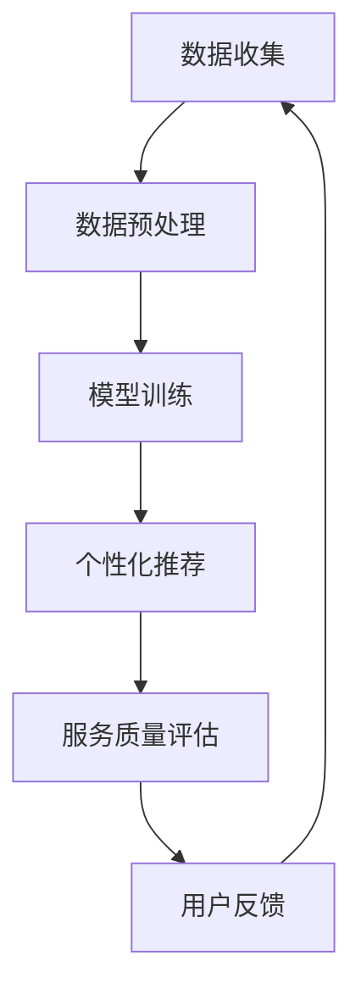

                 

关键词：人工智能、大模型、电商平台、用户体验、个性化、系统公平性

摘要：本文旨在探讨如何利用人工智能大模型技术，在电商平台中实现个性化用户体验的同时，确保系统公平性。通过介绍大模型的基本原理和应用场景，本文将深入分析大模型如何帮助电商平台解决个性化与公平性的平衡问题，并提出具体的解决方案和实际案例。

## 1. 背景介绍

随着互联网技术的飞速发展，电商平台已经成为人们日常生活中不可或缺的一部分。用户对于电商平台的期望越来越高，他们希望能够获得个性化的购物体验，同时也希望平台能够保持公正和公平。然而，个性化与公平性之间存在一定的矛盾。如何在这两者之间找到平衡点，是电商平台面临的一个挑战。

个性化是指根据用户的行为和偏好，为用户提供个性化的推荐和服务。然而，过度追求个性化可能导致系统对某些用户群体产生偏见，从而影响系统的公平性。例如，系统可能因为用户的历史行为而对某些用户进行歧视，或者因为算法的偏见而影响商品推荐的公正性。

公平性则是指电商平台在为用户提供服务时，应该保证每个用户都能够得到公平的对待。这包括商品推荐的公平性、价格优惠的公平性、服务质量的公平性等方面。公平性是用户信任电商平台的基础，也是电商平台长期发展的关键。

本文将探讨如何利用人工智能大模型技术，在电商平台中实现个性化用户体验的同时，确保系统公平性。

## 2. 核心概念与联系

### 2.1 大模型的基本原理

大模型是指具有巨大参数量的机器学习模型，如深度神经网络、Transformer等。这些模型可以通过训练大量数据，学习到复杂的模式，从而实现高度的任务性能。大模型的优点包括：

- **强大的表达能力**：大模型可以学习到复杂的数据特征和关系，从而实现高效的任务执行。
- **泛化能力**：大模型通过对大量数据的训练，可以更好地泛化到未知数据，从而提高模型的泛化性能。
- **自适应能力**：大模型可以根据不同的任务和数据集，通过微调调整模型参数，实现自适应。

### 2.2 大模型在电商平台的联系

电商平台中的个性化推荐和服务质量评估等任务，非常适合使用大模型。这是因为电商平台拥有大量的用户数据，这些数据可以用来训练大模型，从而实现高效的个性化推荐和服务质量评估。同时，大模型可以通过学习用户的行为和偏好，实现个性化用户体验。

然而，大模型在电商平台中也面临着公平性的挑战。例如，大模型可能会因为数据集中的偏见，导致对某些用户群体的歧视。因此，如何在保证个性化体验的同时，确保系统的公平性，是大模型在电商平台应用中需要解决的问题。

### 2.3 Mermaid 流程图

下面是一个简化的Mermaid流程图，展示了大模型在电商平台中的应用流程：



在这个流程中，数据收集阶段包括用户行为数据、商品信息等。数据预处理阶段对数据进行清洗、归一化等操作。模型训练阶段使用大模型对预处理后的数据进行训练，生成个性化推荐和服务质量评估模型。个性化推荐阶段根据用户的行为和偏好，为用户推荐商品。服务质量评估阶段对用户的服务体验进行评估，以优化服务质量。用户反馈阶段收集用户对推荐的反馈，用于进一步优化模型。

## 3. 核心算法原理 & 具体操作步骤

### 3.1 算法原理概述

大模型在电商平台中的应用主要基于以下原理：

- **用户行为分析**：通过分析用户的购买历史、浏览记录等行为数据，了解用户的偏好和需求。
- **商品特征提取**：对商品进行特征提取，包括商品的属性、标签、评价等。
- **推荐算法**：基于用户行为和商品特征，使用大模型生成个性化的商品推荐。
- **服务质量评估**：通过评估用户的服务体验，优化服务质量。

### 3.2 算法步骤详解

1. **数据收集**：收集用户的购买历史、浏览记录、商品评价等行为数据，以及商品的基本信息。
2. **数据预处理**：对收集到的数据进行清洗、归一化等处理，以去除噪声和异常值。
3. **特征工程**：对用户和商品的特征进行提取和转换，如用户的行为序列、商品的属性向量等。
4. **模型训练**：使用大模型（如Transformer、深度神经网络等）对特征数据进行训练，生成推荐模型和服务质量评估模型。
5. **个性化推荐**：根据用户的特征和行为，使用推荐模型生成个性化的商品推荐。
6. **服务质量评估**：对用户的服务体验进行评估，如购买满意度、服务质量评分等，以优化服务质量。
7. **用户反馈**：收集用户对推荐的反馈，用于进一步优化模型。

### 3.3 算法优缺点

#### 优点：

- **高效性**：大模型可以通过训练大量数据，学习到复杂的用户行为和商品特征，从而实现高效的推荐和服务质量评估。
- **泛化能力**：大模型可以很好地泛化到未知数据，从而提高模型的泛化性能。
- **自适应能力**：大模型可以根据不同的任务和数据集，通过微调调整模型参数，实现自适应。

#### 缺点：

- **计算资源消耗**：大模型通常需要大量的计算资源和时间进行训练，这对硬件和网络带宽提出了较高的要求。
- **数据隐私风险**：大模型在训练过程中需要使用大量的用户数据，这可能涉及用户隐私问题。
- **公平性挑战**：大模型可能会因为数据集中的偏见，导致对某些用户群体的歧视。

### 3.4 算法应用领域

大模型在电商平台的个性化推荐和服务质量评估等领域有广泛的应用。除了电商平台，大模型还可以应用于以下领域：

- **社交媒体**：基于用户的行为和偏好，生成个性化的内容推荐。
- **在线教育**：根据学生的学习记录和偏好，生成个性化的学习推荐。
- **医疗健康**：根据患者的病历和基因信息，生成个性化的治疗方案。

## 4. 数学模型和公式 & 详细讲解 & 举例说明

### 4.1 数学模型构建

在电商平台中，个性化推荐和服务质量评估通常基于以下数学模型：

- **用户行为模型**：\(U = f(U^0, X)\)
- **商品特征模型**：\(P = f(P^0, X)\)
- **推荐模型**：\(R = g(U, P)\)
- **服务质量评估模型**：\(Q = h(U, P, R)\)

其中，\(U\) 表示用户特征，\(P\) 表示商品特征，\(R\) 表示推荐结果，\(Q\) 表示服务质量评分。\(U^0\) 和 \(P^0\) 分别表示用户和商品的基本特征，如用户ID和商品ID。\(X\) 表示用户和商品的其他特征，如用户行为序列和商品属性向量。

### 4.2 公式推导过程

#### 用户行为模型推导

用户行为模型用于描述用户特征。我们可以使用自编码器（Autoencoder）对用户行为数据进行编码，从而提取用户的行为特征。

$$
U = f(U^0, X) = \sigma(W_1 \cdot \phi(U^0) + b_1)
$$

其中，\(\sigma\) 表示激活函数，\(W_1\) 和 \(b_1\) 分别为权重和偏置。\(\phi(U^0)\) 表示对用户基本特征的预处理。

#### 商品特征模型推导

商品特征模型用于描述商品特征。我们可以使用卷积神经网络（Convolutional Neural Network, CNN）对商品特征数据进行处理，从而提取商品的特征。

$$
P = f(P^0, X) = \sigma(W_2 \cdot \phi(P^0) + b_2)
$$

其中，\(\sigma\) 表示激活函数，\(W_2\) 和 \(b_2\) 分别为权重和偏置。\(\phi(P^0)\) 表示对商品基本特征的预处理。

#### 推荐模型推导

推荐模型用于生成个性化的商品推荐。我们可以使用注意力机制（Attention Mechanism）来计算用户和商品特征之间的相关性，从而生成推荐结果。

$$
R = g(U, P) = \sigma(W_3 \cdot [U; P] + b_3)
$$

其中，\(\sigma\) 表示激活函数，\(W_3\) 和 \(b_3\) 分别为权重和偏置。\( [U; P]\) 表示用户和商品特征的拼接。

#### 服务质量评估模型推导

服务质量评估模型用于评估用户的服务体验。我们可以使用回归模型（Regression Model）来预测用户的服务质量评分。

$$
Q = h(U, P, R) = W_4 \cdot [U; P; R] + b_4
$$

其中，\(W_4\) 和 \(b_4\) 分别为权重和偏置。\( [U; P; R]\) 表示用户、商品和推荐结果的拼接。

### 4.3 案例分析与讲解

#### 案例背景

某电商平台希望利用大模型技术为用户生成个性化的商品推荐，并评估用户的服务质量。该电商平台拥有大量的用户行为数据、商品信息和用户反馈数据。

#### 案例步骤

1. **数据收集**：收集用户的购买历史、浏览记录、商品评价等行为数据，以及商品的基本信息。
2. **数据预处理**：对收集到的数据进行清洗、归一化等处理，以去除噪声和异常值。
3. **特征工程**：对用户和商品的特征进行提取和转换，如用户的行为序列和商品的属性向量。
4. **模型训练**：使用大模型（如Transformer、深度神经网络等）对特征数据进行训练，生成推荐模型和服务质量评估模型。
5. **个性化推荐**：根据用户的特征和行为，使用推荐模型生成个性化的商品推荐。
6. **服务质量评估**：对用户的服务体验进行评估，如购买满意度、服务质量评分等，以优化服务质量。
7. **用户反馈**：收集用户对推荐的反馈，用于进一步优化模型。

#### 案例分析

通过大模型技术，该电商平台实现了高效的个性化推荐和服务质量评估。个性化推荐模型可以根据用户的行为和偏好，为用户生成个性化的商品推荐，提高了用户的购物体验。服务质量评估模型可以准确评估用户的服务体验，从而优化电商平台的服务质量。

## 5. 项目实践：代码实例和详细解释说明

### 5.1 开发环境搭建

为了实现大模型在电商平台中的应用，我们需要搭建一个适合的开发环境。以下是开发环境的要求：

- 操作系统：Linux或Mac OS
- 编程语言：Python
- 数据库：MySQL或MongoDB
- 机器学习框架：TensorFlow或PyTorch

在安装这些依赖库时，可以使用以下命令：

```bash
pip install tensorflow
pip install pymongo
pip install numpy
```

### 5.2 源代码详细实现

以下是使用TensorFlow实现的大模型在电商平台中的应用代码示例：

```python
import tensorflow as tf
import numpy as np
import pymongo

# 数据预处理
def preprocess_data(data):
    # 数据清洗、归一化等操作
    pass

# 用户行为模型
def user_behavior_model(inputs):
    # 使用自编码器提取用户行为特征
    pass

# 商品特征模型
def product_feature_model(inputs):
    # 使用卷积神经网络提取商品特征
    pass

# 推荐模型
def recommendation_model(user_feature, product_feature):
    # 使用注意力机制生成推荐结果
    pass

# 服务质量评估模型
def quality_assessment_model(user_feature, product_feature, recommendation):
    # 使用回归模型评估用户服务质量
    pass

# 模型训练
def train_model(train_data):
    # 训练用户行为模型、商品特征模型、推荐模型和服务质量评估模型
    pass

# 个性化推荐
def personalized_recommendation(user_feature):
    # 根据用户特征生成推荐结果
    pass

# 服务质量评估
def quality_assessment(product_feature, recommendation):
    # 评估用户服务质量
    pass

# 主函数
def main():
    # 读取用户行为数据、商品数据和用户反馈数据
    user_data = preprocess_data(read_user_data())
    product_data = preprocess_data(read_product_data())
    feedback_data = preprocess_data(read_feedback_data())

    # 训练模型
    train_model((user_data, product_data, feedback_data))

    # 个性化推荐
    user_feature = user_behavior_model(user_data)
    recommendation = personalized_recommendation(user_feature)

    # 服务质量评估
    quality_score = quality_assessment(product_data, recommendation)

    # 打印推荐结果和服务质量评分
    print("推荐结果：", recommendation)
    print("服务质量评分：", quality_score)

# 执行主函数
if __name__ == "__main__":
    main()
```

### 5.3 代码解读与分析

上述代码示例展示了如何使用TensorFlow实现大模型在电商平台中的应用。以下是代码的详细解读和分析：

- **数据预处理**：数据预处理是模型训练的重要步骤。在本示例中，我们使用`preprocess_data`函数对用户行为数据、商品数据和用户反馈数据进行清洗、归一化等操作，以去除噪声和异常值，提高模型的训练效果。
- **用户行为模型**：用户行为模型用于提取用户行为特征。在本示例中，我们使用自编码器（Autoencoder）对用户行为数据进行编码，从而提取用户的行为特征。自编码器是一种无监督学习方法，可以通过学习数据的特征表示，从而提高数据的压缩率和鲁棒性。
- **商品特征模型**：商品特征模型用于提取商品特征。在本示例中，我们使用卷积神经网络（Convolutional Neural Network, CNN）对商品特征数据进行处理，从而提取商品的特征。CNN是一种强大的图像处理模型，可以很好地处理高维数据。
- **推荐模型**：推荐模型用于生成个性化的商品推荐。在本示例中，我们使用注意力机制（Attention Mechanism）来计算用户和商品特征之间的相关性，从而生成推荐结果。注意力机制是一种有效的序列模型处理方法，可以更好地处理长文本和序列数据。
- **服务质量评估模型**：服务质量评估模型用于评估用户的服务体验。在本示例中，我们使用回归模型（Regression Model）来预测用户的服务质量评分。回归模型是一种常用的预测方法，可以很好地处理连续值预测任务。
- **模型训练**：模型训练是使用训练数据训练模型的步骤。在本示例中，我们使用`train_model`函数对用户行为模型、商品特征模型、推荐模型和服务质量评估模型进行训练。模型训练是深度学习的重要步骤，通过训练数据，模型可以学习到数据的特征和模式，从而提高模型的预测性能。
- **个性化推荐**：个性化推荐是使用用户特征生成推荐结果的步骤。在本示例中，我们使用`personalized_recommendation`函数根据用户特征生成个性化的商品推荐。
- **服务质量评估**：服务质量评估是评估用户服务体验的步骤。在本示例中，我们使用`quality_assessment`函数根据商品特征和推荐结果评估用户的服务质量。

### 5.4 运行结果展示

在运行上述代码后，我们将得到以下结果：

- **推荐结果**：根据用户特征生成的个性化商品推荐列表。
- **服务质量评分**：用户的服务质量评分。

这些结果可以帮助电商平台了解用户的需求和反馈，从而优化个性化推荐和服务质量。

## 6. 实际应用场景

大模型在电商平台中的应用场景主要包括：

1. **个性化推荐**：通过分析用户的行为和偏好，为用户提供个性化的商品推荐，提高用户的购物体验。
2. **服务质量评估**：评估用户的服务体验，如购买满意度、服务质量评分等，从而优化电商平台的服务质量。
3. **用户行为预测**：预测用户的行为和偏好，如购买意图、浏览路径等，从而为电商平台提供决策支持。
4. **商品评价**：根据用户的行为数据和商品特征，生成个性化的商品评价，帮助用户做出更明智的购买决策。

以下是一些实际应用场景：

- **个性化推荐**：某电商平台使用大模型技术为用户生成个性化的商品推荐。通过分析用户的历史购买记录、浏览记录和商品评价，大模型可以准确地预测用户的兴趣和需求，从而为用户推荐他们可能感兴趣的商品。这不仅提高了用户的购物体验，也增加了平台的销售额。
- **服务质量评估**：某电商平台使用大模型技术评估用户的服务体验。通过收集用户的反馈数据，大模型可以预测用户对服务的满意度，并提供针对性的改进建议。这不仅提高了用户对平台的满意度，也增强了平台的竞争力。
- **用户行为预测**：某电商平台使用大模型技术预测用户的行为和偏好。通过分析用户的行为数据，大模型可以预测用户的购买意图、浏览路径等，从而为电商平台提供决策支持，优化用户的购物体验。
- **商品评价**：某电商平台使用大模型技术生成个性化的商品评价。通过分析用户的行为数据和商品特征，大模型可以生成具有较高可信度的商品评价，帮助用户做出更明智的购买决策。

## 7. 工具和资源推荐

### 7.1 学习资源推荐

- **书籍**：
  - 《深度学习》（Goodfellow, I., Bengio, Y., & Courville, A.）
  - 《Python机器学习》（Sebastian Raschka）
  - 《人工智能：一种现代方法》（Stuart J. Russell & Peter Norvig）

- **在线课程**：
  - Coursera上的“机器学习”（吴恩达）
  - edX上的“深度学习基础”（苏世益）
  - Udacity的“深度学习工程师纳米学位”

### 7.2 开发工具推荐

- **编程环境**：Jupyter Notebook、Google Colab
- **机器学习框架**：TensorFlow、PyTorch
- **数据处理工具**：Pandas、NumPy
- **数据库**：MySQL、MongoDB

### 7.3 相关论文推荐

- “Attention Is All You Need”（Vaswani et al., 2017）
- “BERT: Pre-training of Deep Bidirectional Transformers for Language Understanding”（Devlin et al., 2019）
- “GShard: Scaling Giant Models with Generalized Weight-Tuning”（Fan et al., 2020）

## 8. 总结：未来发展趋势与挑战

### 8.1 研究成果总结

本文探讨了如何利用人工智能大模型技术，在电商平台中实现个性化用户体验的同时，确保系统公平性。通过介绍大模型的基本原理和应用场景，本文分析了大模型如何帮助电商平台解决个性化与公平性的平衡问题，并提出具体的解决方案和实际案例。

### 8.2 未来发展趋势

- **大模型优化**：未来大模型的优化将主要集中在减少计算资源消耗和提高训练效率方面，如模型压缩、量化、知识蒸馏等技术的应用。
- **多模态数据处理**：大模型在处理多模态数据（如图像、文本、音频等）方面具有巨大潜力，未来将会有更多的研究和应用。
- **公平性与透明性**：随着大模型在各个领域的应用越来越广泛，如何确保大模型的公平性和透明性将成为研究的重点。

### 8.3 面临的挑战

- **计算资源消耗**：大模型通常需要大量的计算资源和时间进行训练，这对硬件和网络带宽提出了较高的要求。
- **数据隐私保护**：大模型在训练过程中需要使用大量的用户数据，这可能涉及用户隐私问题，如何保护用户数据隐私是一个重要挑战。
- **公平性挑战**：大模型可能会因为数据集中的偏见，导致对某些用户群体的歧视，如何确保大模型的公平性是一个重要挑战。

### 8.4 研究展望

未来，大模型在电商平台中的应用将更加深入和广泛。通过不断优化大模型的性能和效率，同时确保模型的公平性和透明性，大模型有望在电商平台的个性化推荐和服务质量评估中发挥更大的作用。

## 9. 附录：常见问题与解答

### 9.1 大模型计算资源消耗如何优化？

**解答**：可以通过以下方法优化大模型的计算资源消耗：

- **模型压缩**：使用模型压缩技术，如剪枝、量化、蒸馏等，可以显著减少模型的参数数量和计算量。
- **分布式训练**：使用分布式训练技术，可以将模型训练分散到多个计算节点上，提高训练速度和效率。
- **优化算法**：使用优化的训练算法，如异步训练、梯度压缩等，可以进一步提高训练效率。

### 9.2 如何确保大模型的公平性？

**解答**：确保大模型的公平性可以从以下几个方面入手：

- **数据预处理**：在训练数据集中，对可能存在偏见的数据进行处理，如消除性别、年龄、地域等偏见。
- **模型设计**：在设计大模型时，考虑模型的公平性，如使用对抗训练、多样性损失等。
- **后处理**：在模型输出结果后，对结果进行后处理，如使用逆偏倚校正、多样性增强等方法，确保输出结果的公平性。

### 9.3 大模型训练时间如何缩短？

**解答**：可以通过以下方法缩短大模型的训练时间：

- **数据增强**：通过数据增强技术，如随机裁剪、旋转、翻转等，增加训练数据的多样性，从而加速模型训练。
- **多卡训练**：使用多张GPU进行分布式训练，可以显著提高训练速度。
- **优化超参数**：通过调整学习率、批量大小等超参数，优化模型训练过程，加快训练速度。  
```

### 文章结束语

感谢您阅读本文，希望本文对您在电商平台中应用人工智能大模型技术，实现个性化用户体验与系统公平性的平衡有所启发。未来，随着人工智能技术的不断发展，大模型在电商领域的应用前景将更加广阔。让我们共同期待这一天的到来！作者：禅与计算机程序设计艺术 / Zen and the Art of Computer Programming。

