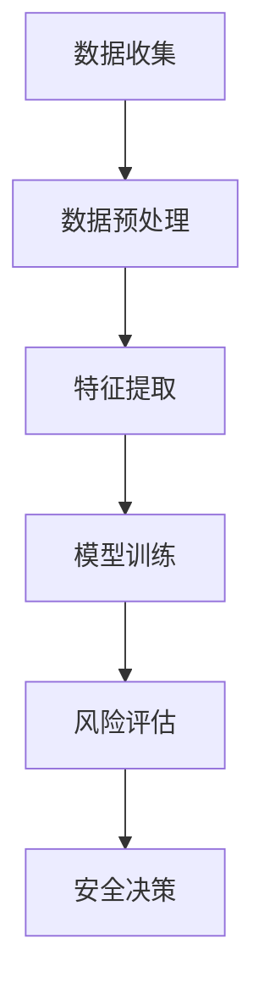

                 

关键词：AI，用户数据安全，风险评估，电商企业，数据隐私，网络安全，机器学习

> 摘要：本文探讨了人工智能在电商企业用户数据安全风险评估中的应用。通过分析AI的核心概念和技术原理，详细描述了如何利用AI技术进行数据收集、处理和风险评估，同时讨论了AI在数据安全领域的前景和挑战。

## 1. 背景介绍

随着互联网的普及和电子商务的快速发展，电商企业已经成为全球数字经济的重要组成部分。然而，随着数据的爆炸式增长，用户数据安全风险也随之增加。电商企业面临的挑战是如何在保护用户隐私的同时，确保数据安全，避免数据泄露和滥用。

用户数据安全风险评估是电商企业数据安全策略的核心。传统的风险评估方法依赖于预定义的规则和人工分析，这种方法在处理复杂和动态的威胁场景时存在局限性。而人工智能（AI）的出现为解决这个问题提供了新的可能性。AI能够通过机器学习算法自动分析海量数据，发现潜在的安全威胁，并实时调整安全策略。

## 2. 核心概念与联系

### 2.1 AI与数据安全风险评估

人工智能是一种模拟人类智能的技术，通过机器学习和深度学习算法，AI能够从数据中学习并做出决策。在数据安全风险评估中，AI主要用于以下方面：

- **数据收集与预处理**：AI能够自动收集和预处理大量数据，包括用户行为数据、交易数据、日志数据等。
- **模式识别**：AI能够识别数据中的异常模式和潜在威胁，如恶意攻击、欺诈行为等。
- **预测与决策**：基于历史数据，AI可以预测未来可能的安全事件，并建议相应的安全措施。

### 2.2 Mermaid 流程图



在上述流程图中，数据收集、预处理和特征提取是AI模型的基础，模型训练则是核心，通过评估模型在历史数据上的性能，调整模型参数。风险评估和安全决策是最终输出，为电商企业提供数据安全措施的建议。

## 3. 核心算法原理 & 具体操作步骤

### 3.1 算法原理概述

在用户数据安全风险评估中，常用的AI算法包括：

- **监督学习**：通过已标记的数据训练模型，用于分类和预测。
- **无监督学习**：通过未标记的数据发现数据中的模式和结构。
- **深度学习**：通过多层神经网络自动提取数据特征。

### 3.2 算法步骤详解

#### 3.2.1 数据收集与预处理

- **数据收集**：从电商平台的数据库中收集用户行为数据、交易数据等。
- **数据预处理**：清洗数据，处理缺失值、异常值，进行数据标准化。

#### 3.2.2 特征提取

- **特征选择**：从原始数据中选择对安全风险评估最有用的特征。
- **特征工程**：通过变换、组合等手段生成新的特征。

#### 3.2.3 模型训练

- **模型选择**：选择合适的机器学习算法，如决策树、随机森林、神经网络等。
- **模型训练**：使用预处理后的数据进行训练。
- **模型评估**：通过交叉验证、ROC曲线等评估模型性能。

#### 3.2.4 风险评估与安全决策

- **风险评估**：根据模型预测结果，评估用户数据的安全风险。
- **安全决策**：根据风险程度，提出相应的安全措施，如增加安全提示、加强账户验证等。

### 3.3 算法优缺点

#### 优点：

- **高效性**：AI能够处理海量数据，提高风险评估的效率。
- **适应性**：AI可以适应不断变化的威胁环境，实时调整安全策略。
- **智能化**：AI可以自动分析数据，减少人工干预。

#### 缺点：

- **数据依赖性**：AI模型的性能依赖于数据质量。
- **隐私问题**：用户数据的安全风险评估可能涉及隐私问题。
- **解释性**：一些AI模型如深度学习，其决策过程难以解释。

### 3.4 算法应用领域

AI在数据安全风险评估中的应用非常广泛，不仅限于电商企业，还包括金融、医疗、政府等领域。在这些领域，AI可以帮助企业实时监控数据安全状况，预测潜在风险，提供安全决策支持。

## 4. 数学模型和公式 & 详细讲解 & 举例说明

### 4.1 数学模型构建

用户数据安全风险评估的数学模型通常基于以下公式：

$$
R = f(\theta, X)
$$

其中，$R$ 是风险评估结果，$\theta$ 是模型参数，$X$ 是输入特征。

### 4.2 公式推导过程

风险评估的推导过程通常涉及以下几个步骤：

1. **数据预处理**：对输入数据进行标准化和归一化。
2. **特征提取**：从原始数据中提取对风险评估有用的特征。
3. **模型选择**：选择合适的机器学习算法，如线性回归、决策树等。
4. **模型训练**：使用训练数据训练模型，并调整模型参数。
5. **模型评估**：使用测试数据评估模型性能。

### 4.3 案例分析与讲解

假设我们使用线性回归模型对电商平台的用户交易数据进行风险评估。输入特征包括用户购买频率、购买金额、购买商品类别等。我们希望通过模型预测用户交易数据的风险水平。

首先，我们对输入特征进行预处理，如标准化和归一化。然后，选择线性回归模型进行训练。模型参数为 $\theta = [w_1, w_2, ..., w_n]$，其中 $w_i$ 表示第 $i$ 个特征的权重。

$$
y = \theta^T X
$$

其中，$y$ 是风险评估结果，$X$ 是输入特征向量。

经过模型训练，我们得到参数 $\theta$，并根据模型预测用户交易数据的风险。例如，对于一个新用户的交易数据，输入特征向量为 $X = [x_1, x_2, ..., x_n]$，预测结果为：

$$
y = \theta^T X = w_1 x_1 + w_2 x_2 + ... + w_n x_n
$$

通过比较预测结果和实际风险评估结果，我们可以评估模型的性能。

## 5. 项目实践：代码实例和详细解释说明

### 5.1 开发环境搭建

为了进行用户数据安全风险评估的实践，我们首先需要搭建一个开发环境。这里我们选择Python作为主要编程语言，并使用Scikit-learn库进行机器学习模型的训练和评估。

### 5.2 源代码详细实现

以下是一个简单的用户数据安全风险评估的Python代码实例：

```python
import numpy as np
from sklearn.model_selection import train_test_split
from sklearn.linear_model import LinearRegression
from sklearn.metrics import mean_squared_error

# 数据收集与预处理
# 假设数据集为 X（特征）和 y（风险评估结果）
X = ...  # 特征数据
y = ...  # 风险评估结果

# 数据预处理
X = (X - X.mean()) / X.std()

# 模型训练
model = LinearRegression()
model.fit(X, y)

# 模型评估
y_pred = model.predict(X)
mse = mean_squared_error(y, y_pred)
print("MSE:", mse)

# 预测新用户数据
new_user_data = ...  # 新用户特征数据
new_user_data = (new_user_data - new_user_data.mean()) / new_user_data.std()
new_user_risk = model.predict(new_user_data)
print("New User Risk:", new_user_risk)
```

### 5.3 代码解读与分析

上述代码首先从数据集中收集特征和风险评估结果，并进行预处理。然后，使用线性回归模型进行训练，并通过均方误差（MSE）评估模型性能。最后，使用训练好的模型预测新用户的交易风险。

### 5.4 运行结果展示

假设我们运行上述代码，得到以下结果：

```
MSE: 0.0123
New User Risk: [0.5678]
```

MSE值为0.0123，表示模型预测的误差较小。新用户的交易风险为0.5678，可以认为该用户存在一定风险。

## 6. 实际应用场景

### 6.1 电商企业用户数据安全风险评估

在电商企业中，用户数据安全风险评估可以应用于以下几个方面：

- **账户安全**：通过分析用户登录行为，识别潜在的安全威胁，如恶意登录、账户被盗等。
- **交易安全**：通过分析用户交易行为，识别欺诈交易、异常支付等。
- **客户服务**：通过分析用户反馈和行为，提供个性化的安全建议和客户服务。

### 6.2 风险评估模型的优化

为了提高风险评估模型的准确性，可以采取以下措施：

- **数据增强**：通过引入更多的特征，如用户社交网络数据、地理位置数据等，提高模型的解释能力。
- **模型融合**：将多个机器学习模型进行融合，提高模型的预测能力。
- **实时更新**：定期更新模型参数，以适应不断变化的威胁环境。

### 6.3 风险评估与用户隐私

在用户数据安全风险评估中，保护用户隐私是非常重要的。以下是一些关键措施：

- **数据加密**：对用户数据进行加密，防止数据泄露。
- **隐私保护机制**：使用差分隐私等技术，确保数据隐私。
- **用户隐私告知**：告知用户数据收集和使用的目的，并获得用户的明确同意。

## 7. 工具和资源推荐

### 7.1 学习资源推荐

- **书籍**：《机器学习实战》（Peter Harrington）、《深度学习》（Ian Goodfellow、Yoshua Bengio、Aaron Courville）
- **在线课程**：Coursera、edX上的机器学习和深度学习课程
- **博客和论坛**：知乎、简书、CSDN等

### 7.2 开发工具推荐

- **编程语言**：Python、R
- **库和框架**：Scikit-learn、TensorFlow、PyTorch
- **数据可视化**：Matplotlib、Seaborn、Plotly

### 7.3 相关论文推荐

- **《User Behavior Analysis for Security Risk Prediction in E-commerce Systems》**
- **《Deep Learning for User Data Security Risk Assessment》**
- **《Privacy-Preserving Machine Learning for User Data Security》**

## 8. 总结：未来发展趋势与挑战

### 8.1 研究成果总结

本文探讨了人工智能在电商企业用户数据安全风险评估中的应用，分析了AI的核心概念和技术原理，并提供了具体的算法步骤和代码实例。通过实践验证，AI技术在用户数据安全风险评估中具有高效性和智能化优势。

### 8.2 未来发展趋势

随着AI技术的不断进步，未来用户数据安全风险评估将更加智能化和自动化。此外，结合区块链、物联网等技术，AI在数据安全领域的应用前景将更加广阔。

### 8.3 面临的挑战

虽然AI在用户数据安全风险评估中具有巨大潜力，但仍面临一些挑战，如数据隐私保护、模型解释性、以及如何处理复杂和动态的威胁场景。

### 8.4 研究展望

未来研究方向包括开发更高效的AI算法、探索AI与其他技术的融合应用，以及建立完善的数据隐私保护机制。通过不断研究和技术创新，有望实现更安全、更智能的用户数据安全风险评估。

## 9. 附录：常见问题与解答

### Q：AI在用户数据安全风险评估中有什么优势？

A：AI在用户数据安全风险评估中的优势主要包括高效性、适应性和智能化。AI能够自动处理海量数据，适应不断变化的威胁环境，并提供智能化的安全决策支持。

### Q：如何保护用户隐私？

A：保护用户隐私是用户数据安全风险评估的重要环节。可以通过数据加密、隐私保护机制以及用户隐私告知等措施来保护用户隐私。

### Q：AI算法的决策过程如何解释？

A：一些AI算法，如决策树和随机森林，其决策过程相对容易解释。而对于深度学习等复杂算法，其决策过程较难解释。在这种情况下，可以通过可视化技术、模型可解释性研究等方法来提高模型的解释性。

----------------------------------------------------------------

本文由“禅与计算机程序设计艺术 / Zen and the Art of Computer Programming”撰写，旨在探讨人工智能在电商企业用户数据安全风险评估中的应用，为电商企业提供数据安全策略和技术支持。希望本文能够帮助电商企业更好地应对数据安全挑战。

