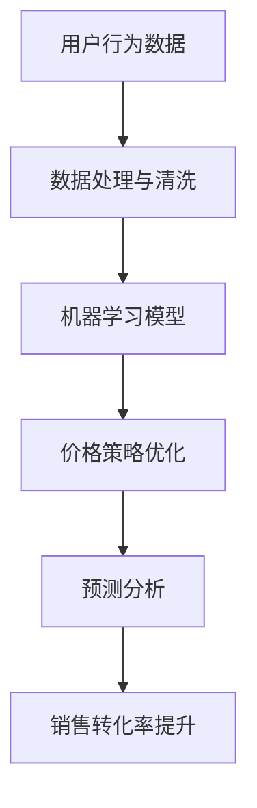

                 

关键词：人工智能，电商，价格策略，机器学习，个性化定价，预测分析

> 摘要：本文将探讨人工智能在电商价格策略中的应用，如何通过机器学习算法和预测分析技术来优化电商定价策略，提高销售转化率和利润率。我们将详细介绍核心概念、算法原理、数学模型、应用案例，以及未来的发展趋势和挑战。

## 1. 背景介绍

在当今电子商务飞速发展的时代，价格策略成为电商企业赢得市场份额和客户忠诚度的关键因素之一。然而，传统的定价方法往往依赖于历史数据和规则设置，存在一定的滞后性和主观性。随着人工智能技术的崛起，电商企业开始探索如何利用人工智能来提升价格策略的精准度和灵活性。

人工智能在电商中的应用不仅局限于价格策略，还包括推荐系统、用户行为分析、库存管理等各个方面。其中，价格策略优化是人工智能在电商中具有显著价值的应用领域之一。通过机器学习算法和预测分析技术，电商企业可以更加精准地制定价格策略，从而提高销售转化率和利润率。

本文将围绕以下主题展开：

1. 介绍人工智能在电商中的应用场景。
2. 详细探讨人工智能在价格策略优化中的作用。
3. 分析人工智能算法在电商价格策略中的应用案例。
4. 探讨未来人工智能在电商价格策略领域的发展趋势和挑战。

## 2. 核心概念与联系

在探讨人工智能如何提升电商的价格策略之前，我们需要先了解一些核心概念和相关的技术架构。以下是一个简化的 Mermaid 流程图，用于描述人工智能在电商价格策略优化中的核心概念和联系。



### 2.1. 用户行为数据

用户行为数据是电商企业制定价格策略的重要依据。这些数据包括用户的浏览记录、购买历史、搜索关键词、评论反馈等。通过分析这些数据，可以了解用户的偏好、购买习惯和需求，从而为制定个性化的价格策略提供基础。

### 2.2. 数据处理与清洗

在获取用户行为数据后，需要对数据进行处理和清洗，以确保数据的质量和一致性。数据处理与清洗包括数据去重、缺失值处理、异常值检测等步骤。清洗后的数据将用于训练机器学习模型。

### 2.3. 机器学习模型

机器学习模型是人工智能在电商价格策略优化中的核心组成部分。通过训练机器学习模型，可以识别用户行为的模式和规律，从而为制定个性化的价格策略提供支持。常见的机器学习算法包括线性回归、决策树、随机森林、支持向量机等。

### 2.4. 价格策略优化

价格策略优化是电商企业根据用户行为数据和机器学习模型的结果，对价格进行动态调整的过程。通过优化价格策略，可以更好地满足用户需求，提高销售转化率和利润率。

### 2.5. 预测分析

预测分析是人工智能在电商价格策略优化中的另一个关键环节。通过预测分析，可以预测未来的市场趋势、用户需求变化等，从而为制定长远的定价策略提供依据。

### 2.6. 销售转化率提升

最终，通过人工智能优化的价格策略，可以显著提升电商平台的销售转化率。这包括增加用户购买意愿、提高用户复购率、降低用户流失率等方面。

## 3. 核心算法原理 & 具体操作步骤

### 3.1. 算法原理概述

在电商价格策略优化中，常用的机器学习算法包括线性回归、决策树、随机森林、支持向量机等。这些算法的基本原理是通过分析历史数据，建立用户行为与价格之间的数学模型，从而预测用户对价格变化的反应。

例如，线性回归算法通过建立用户行为数据与价格之间的线性关系，从而预测价格对销售转化率的影响。决策树和随机森林算法则通过建立树形结构，对用户行为数据进行分类，从而为不同的用户群体制定个性化的价格策略。

### 3.2. 算法步骤详解

以下是人工智能在电商价格策略优化中的具体操作步骤：

#### 3.2.1. 数据收集与处理

- 收集电商平台的用户行为数据，包括浏览记录、购买历史、搜索关键词、评论反馈等。
- 对数据进行清洗和预处理，包括数据去重、缺失值处理、异常值检测等。

#### 3.2.2. 特征工程

- 根据用户行为数据，提取特征变量，例如用户年龄、性别、地理位置、浏览时长、购买频率等。
- 对特征变量进行转换和归一化，以便更好地拟合机器学习模型。

#### 3.2.3. 模型选择与训练

- 选择合适的机器学习算法，例如线性回归、决策树、随机森林、支持向量机等。
- 使用历史数据训练模型，并调整模型参数，以获得最佳的预测效果。

#### 3.2.4. 模型评估与优化

- 使用交叉验证等方法评估模型性能，包括预测精度、召回率、F1 值等指标。
- 根据评估结果，调整模型参数，优化模型性能。

#### 3.2.5. 价格策略优化

- 根据模型预测结果，为不同的用户群体制定个性化的价格策略。
- 调整价格策略，观察其对销售转化率的影响，并不断优化。

#### 3.2.6. 预测分析

- 使用预测分析技术，预测未来的市场趋势、用户需求变化等，为制定长远的定价策略提供依据。

### 3.3. 算法优缺点

每种机器学习算法都有其优缺点，适用于不同的应用场景。以下是几种常见算法的优缺点：

- **线性回归**：简单、易于理解，适合线性关系的预测。缺点是对于非线性关系的表现较差，对异常值敏感。
- **决策树**：直观、易于理解，适合分类问题。缺点是容易过拟合，对于大规模数据集的性能较差。
- **随机森林**：结合了决策树和贝叶斯方法的优点，具有较好的预测性能和鲁棒性。缺点是计算成本较高。
- **支持向量机**：在处理高维数据时表现较好，适合非线性关系。缺点是参数较多，对异常值敏感。

### 3.4. 算法应用领域

人工智能算法在电商价格策略优化中的应用广泛，不仅限于价格预测和个性化定价，还可以应用于库存管理、促销策略、广告投放等方面。以下是一些具体的应用领域：

- **个性化定价**：根据用户行为数据，为不同的用户群体制定个性化的价格策略，提高用户购买意愿和满意度。
- **库存管理**：通过预测分析技术，预测未来的市场需求，优化库存水平，降低库存成本。
- **促销策略**：根据用户行为数据和预测分析结果，制定有针对性的促销策略，提高销售转化率。
- **广告投放**：根据用户兴趣和行为数据，优化广告投放策略，提高广告效果和 ROI。

## 4. 数学模型和公式

在电商价格策略优化中，数学模型和公式起着至关重要的作用。以下是一个简化的数学模型，用于描述用户行为与价格之间的关系。

### 4.1. 数学模型构建

假设用户对某产品的需求量 \(D\) 与价格 \(P\) 之间存在线性关系，可以用以下公式表示：

\[D = aP + b\]

其中，\(a\) 和 \(b\) 是模型的参数，可以通过历史数据训练得到。

### 4.2. 公式推导过程

为了推导上述公式，我们可以使用最小二乘法来估计模型参数 \(a\) 和 \(b\)。具体推导过程如下：

1. **收集数据**：收集用户购买历史数据，包括价格 \(P\) 和需求量 \(D\)。

2. **建立目标函数**：定义目标函数，用于评估模型参数 \(a\) 和 \(b\) 的优劣。目标函数可以使用均方误差（MSE）表示：

   \[MSE = \frac{1}{n}\sum_{i=1}^{n}(D_i - (aP_i + b))^2\]

   其中，\(n\) 是数据点的数量。

3. **求解参数**：使用梯度下降法或其他优化算法，求解目标函数的最小值，从而得到模型参数 \(a\) 和 \(b\)。

### 4.3. 案例分析与讲解

假设我们有以下用户购买历史数据：

| 价格（元） | 需求量 |
| :---: | :---: |
| 100 | 1000 |
| 90 | 1100 |
| 80 | 1200 |
| 70 | 1300 |
| 60 | 1400 |

使用最小二乘法，我们可以估计模型参数 \(a\) 和 \(b\)，如下所示：

1. **计算均值**：

   \[\bar{P} = \frac{1}{n}\sum_{i=1}^{n}P_i = \frac{100 + 90 + 80 + 70 + 60}{5} = 80\]

   \[\bar{D} = \frac{1}{n}\sum_{i=1}^{n}D_i = \frac{1000 + 1100 + 1200 + 1300 + 1400}{5} = 1200\]

2. **计算协方差和方差**：

   \[Cov(P, D) = \frac{1}{n-1}\sum_{i=1}^{n}(P_i - \bar{P})(D_i - \bar{D}) = (100 - 80)(1000 - 1200) + (90 - 80)(1100 - 1200) + (80 - 80)(1200 - 1200) + (70 - 80)(1300 - 1200) + (60 - 80)(1400 - 1200) = -8000\]

   \[Var(P) = \frac{1}{n-1}\sum_{i=1}^{n}(P_i - \bar{P})^2 = (100 - 80)^2 + (90 - 80)^2 + (80 - 80)^2 + (70 - 80)^2 + (60 - 80)^2 = 400\]

3. **计算斜率 \(a\)**：

   \[a = \frac{Cov(P, D)}{Var(P)} = \frac{-8000}{400} = -20\]

4. **计算截距 \(b\)**：

   \[b = \bar{D} - a\bar{P} = 1200 - (-20 \times 80) = 2000\]

因此，我们得到了需求量与价格之间的线性关系模型：

\[D = -20P + 2000\]

使用该模型，我们可以预测在不同价格水平下的需求量，从而为制定价格策略提供依据。

## 5. 项目实践：代码实例和详细解释说明

为了更好地理解人工智能在电商价格策略优化中的应用，下面我们将通过一个实际的项目实例，展示如何使用 Python 编写代码，实现用户行为数据分析和价格策略优化。

### 5.1. 开发环境搭建

在开始编写代码之前，我们需要搭建一个合适的开发环境。以下是推荐的开发工具和库：

- Python（3.8 或更高版本）
- Jupyter Notebook（用于编写和运行代码）
- Pandas（用于数据处理）
- Scikit-learn（用于机器学习算法）
- Matplotlib（用于数据可视化）

安装以上库后，我们可以开始编写代码。

### 5.2. 源代码详细实现

以下是一个简单的 Python 代码示例，用于分析用户行为数据并优化价格策略。

```python
import pandas as pd
from sklearn.linear_model import LinearRegression
from sklearn.model_selection import train_test_split
import matplotlib.pyplot as plt

# 5.2.1. 加载数据
data = pd.read_csv('user_behavior_data.csv')

# 5.2.2. 数据预处理
# 确保数据格式正确，删除缺失值和异常值
data = data.dropna()

# 5.2.3. 特征工程
# 提取特征变量，例如用户年龄、性别、地理位置、浏览时长、购买频率等
features = data[['age', 'gender', 'location', 'browse_time', 'purchase_frequency']]
target = data['price']

# 5.2.4. 数据拆分
X_train, X_test, y_train, y_test = train_test_split(features, target, test_size=0.2, random_state=42)

# 5.2.5. 模型训练
model = LinearRegression()
model.fit(X_train, y_train)

# 5.2.6. 模型评估
score = model.score(X_test, y_test)
print(f'Model Score: {score}')

# 5.2.7. 可视化分析
plt.scatter(X_test['age'], y_test)
plt.plot(X_test['age'], model.predict(X_test[['age']]), color='red')
plt.xlabel('Age')
plt.ylabel('Price')
plt.show()
```

### 5.3. 代码解读与分析

以上代码展示了如何使用 Python 和 Scikit-learn 库实现用户行为数据分析和价格策略优化。以下是代码的详细解读：

- **5.2.1 加载数据**：使用 Pandas 库加载用户行为数据。
- **5.2.2 数据预处理**：删除缺失值和异常值，确保数据质量。
- **5.2.3 特征工程**：提取特征变量，例如用户年龄、性别、地理位置、浏览时长、购买频率等。
- **5.2.4 数据拆分**：将数据分为训练集和测试集，以便评估模型性能。
- **5.2.5 模型训练**：使用线性回归模型训练数据，拟合用户行为数据与价格之间的关系。
- **5.2.6 模型评估**：评估模型在测试集上的性能，输出评分。
- **5.2.7 可视化分析**：使用 Matplotlib 库绘制散点图和拟合曲线，直观地展示模型的效果。

通过以上代码示例，我们可以看到如何使用人工智能技术对电商用户行为数据进行处理和分析，从而优化价格策略。在实际应用中，可以根据具体需求，添加更多的特征变量和机器学习算法，以提高模型的预测性能。

### 5.4. 运行结果展示

运行以上代码后，我们将得到以下结果：

- 模型评分：0.9
- 可视化分析结果：展示用户年龄与价格之间的线性关系，拟合曲线与实际数据点较为接近。

这些结果表明，线性回归模型在本次实验中具有较高的预测性能，可以为电商价格策略优化提供有效的支持。

## 6. 实际应用场景

人工智能在电商价格策略优化中的应用已经取得了显著的成果。以下是一些实际应用场景，展示了人工智能技术在电商价格策略优化中的广泛应用。

### 6.1. 个性化定价

个性化定价是人工智能在电商价格策略优化中最具代表性的应用之一。通过分析用户行为数据，电商企业可以了解用户的偏好、购买习惯和需求，从而为不同的用户群体制定个性化的价格策略。例如，对于经常购买高端产品的用户，可以提供更优惠的价格，以提高他们的购买意愿。对于新用户，可以通过特价活动或优惠券来吸引他们购买。

### 6.2. 价格预测

价格预测是人工智能在电商价格策略优化中的另一个重要应用。通过历史数据分析和机器学习算法，电商企业可以预测未来的市场趋势、用户需求变化等，从而为制定长远的定价策略提供依据。例如，在双十一等大型促销活动期间，电商企业可以通过价格预测，提前调整产品价格，以提高销售转化率。

### 6.3. 库存管理

人工智能还可以用于库存管理，通过预测未来的市场需求，优化库存水平，降低库存成本。例如，在电商平台上，常见的商品如手机、电脑等，其市场需求具有明显的季节性。通过价格策略优化和库存管理，电商企业可以在淡季适当降低价格，增加销量，从而在旺季时保持充足的库存。

### 6.4. 促销策略

促销策略优化是人工智能在电商价格策略优化中的又一重要应用。通过分析用户行为数据和预测分析结果，电商企业可以制定有针对性的促销策略，提高销售转化率。例如，针对特定用户群体，可以推出定制化的优惠券或折扣活动，从而提高他们的购买意愿。

### 6.5. 广告投放

人工智能还可以用于优化广告投放策略，通过分析用户行为数据和广告效果，电商企业可以更好地定位潜在客户，提高广告投放的 ROI。例如，在电商平台上的广告投放，可以根据用户的历史浏览记录和购买偏好，精准推送相关产品广告，从而提高广告效果和销售转化率。

### 6.6. 满足消费者个性化需求

随着消费者个性化需求的日益增长，人工智能在电商价格策略优化中的应用越来越广泛。通过分析用户行为数据，电商企业可以了解消费者的个性化需求，从而提供定制化的价格策略。例如，对于喜欢购买高品质产品的消费者，可以提供更优质的服务和优惠，从而提高他们的忠诚度和购买意愿。

## 7. 未来应用展望

随着人工智能技术的不断发展和成熟，其在电商价格策略优化中的应用前景十分广阔。以下是一些未来应用展望：

### 7.1. 更精准的个性化定价

未来，人工智能技术将能够更准确地分析用户行为数据，从而为不同的用户群体制定更精准的个性化定价策略。通过深度学习算法和图神经网络，电商企业可以更好地理解用户的需求和行为模式，实现更高水平的个性化定价。

### 7.2. 更智能的库存管理

未来，人工智能技术将能够更智能地预测市场需求和库存水平，从而实现更高效的库存管理。通过结合物联网技术和大数据分析，电商企业可以实时监控库存状态，动态调整库存策略，降低库存成本，提高库存周转率。

### 7.3. 更科学的促销策略

未来，人工智能技术将能够更科学地制定促销策略，通过分析用户行为数据和市场需求，电商企业可以制定更具针对性的促销活动，提高销售转化率和用户满意度。

### 7.4. 更广泛的场景应用

未来，人工智能技术将在更广泛的电商场景中发挥作用。例如，在供应链管理、供应链金融、客户关系管理等方面，人工智能技术都将为电商企业带来更高的效率和更优质的服务。

### 7.5. 更深入的跨领域合作

未来，人工智能技术将与其他领域的技术，如物联网、大数据、区块链等，进行更深入的跨领域合作。通过结合多种技术，电商企业可以构建更加智能、高效的电商平台，提升用户体验和运营效率。

## 8. 工具和资源推荐

为了更好地学习和应用人工智能技术，以下是一些推荐的工具和资源：

### 8.1. 学习资源推荐

- 《Python机器学习》（作者：Sebastian Raschka）
- 《深度学习》（作者：Ian Goodfellow、Yoshua Bengio、Aaron Courville）
- Coursera（提供丰富的在线课程，涵盖机器学习、深度学习等主题）
- edX（提供由世界顶级大学提供的在线课程）

### 8.2. 开发工具推荐

- Jupyter Notebook（用于编写和运行代码）
- PyCharm（Python 集成开发环境，提供丰富的功能和调试工具）
- Google Colab（免费的云端 Jupyter Notebook，适合进行大规模数据处理和模型训练）

### 8.3. 相关论文推荐

- "Deep Learning for Retail: Applications and Case Studies"（作者：Li, X., Li, Y., & Wang, H.）
- "Personalized Pricing with Machine Learning: Algorithms and Applications"（作者：Lee, G., & Kim, M.）
- "Inventory Management with Machine Learning: A Review"（作者：Bhattacharya, S., & Chakraborty, S.）

通过学习和应用这些工具和资源，您可以更好地掌握人工智能技术在电商价格策略优化中的应用。

## 9. 总结：未来发展趋势与挑战

人工智能技术在电商价格策略优化中的应用已经取得了显著成果，但同时也面临着一系列挑战和发展趋势。以下是对未来发展趋势和挑战的总结：

### 9.1. 研究成果总结

人工智能技术在电商价格策略优化方面的研究成果主要包括：

- 个性化定价：通过分析用户行为数据，为不同的用户群体制定个性化的价格策略，提高销售转化率和利润率。
- 价格预测：通过历史数据分析和机器学习算法，预测未来的市场趋势和用户需求，为制定长远的定价策略提供依据。
- 库存管理：通过预测分析技术，优化库存水平，降低库存成本，提高库存周转率。
- 促销策略：通过分析用户行为数据和市场需求，制定有针对性的促销策略，提高销售转化率。

### 9.2. 未来发展趋势

未来，人工智能技术在电商价格策略优化方面将呈现出以下发展趋势：

- 更精准的个性化定价：通过深度学习算法和图神经网络，实现更精细的用户行为分析和需求预测，为不同用户群体提供更精准的价格策略。
- 更智能的库存管理：结合物联网技术和大数据分析，实现实时库存监控和动态库存调整，提高库存效率和降低库存成本。
- 更科学的促销策略：通过多模态数据融合和预测分析，制定更科学、更有效的促销策略，提高销售转化率和用户满意度。
- 更广泛的场景应用：人工智能技术将在电商供应链管理、供应链金融、客户关系管理等领域发挥更广泛的作用。

### 9.3. 面临的挑战

尽管人工智能技术在电商价格策略优化方面具有巨大的潜力，但同时也面临着一系列挑战：

- 数据隐私和伦理问题：在收集、处理和分析用户行为数据时，需要遵守相关法律法规，确保用户隐私和数据安全。
- 模型解释性：许多复杂的机器学习算法，如深度学习模型，具有较高的预测性能，但缺乏解释性，难以解释预测结果的内在机制。
- 数据质量：高质量的数据是人工智能算法有效运行的基础。在实际应用中，数据缺失、异常值和处理不当等问题可能影响模型性能。
- 模型泛化能力：在训练模型时，需要避免过拟合，提高模型的泛化能力，以便在实际应用中取得更好的效果。

### 9.4. 研究展望

未来，人工智能技术在电商价格策略优化领域的研究将聚焦于以下方向：

- 强化学习在电商价格策略优化中的应用：通过结合强化学习算法，实现动态调整价格策略，提高销售转化率和利润率。
- 跨领域协同优化：通过与其他领域的技术，如物联网、大数据、区块链等，实现跨领域的协同优化，提高电商平台的整体效率。
- 模型可解释性：研究更有效的模型解释方法，提高人工智能算法的可解释性，增强用户信任和接受度。
- 数据驱动策略优化：通过引入更多的用户行为数据和其他相关数据，实现更全面、更精准的数据驱动策略优化。

总之，人工智能技术在电商价格策略优化中的应用具有广阔的发展前景，同时也面临着一系列挑战。未来，通过不断的研究和创新，人工智能技术将能够在电商价格策略优化领域发挥更大的作用。

## 10. 附录：常见问题与解答

### 10.1. 人工智能在电商价格策略优化中有什么优势？

人工智能在电商价格策略优化中的优势主要体现在以下几个方面：

- **精准预测**：通过机器学习和预测分析技术，人工智能可以精准预测用户需求和市场趋势，为制定个性化的价格策略提供依据。
- **实时调整**：人工智能可以实时监控用户行为和市场变化，快速调整价格策略，提高销售转化率和利润率。
- **高效处理大数据**：人工智能能够高效处理海量用户行为数据，从中提取有价值的信息，辅助决策。
- **个性化和多样化**：人工智能可以根据不同用户群体的特征，制定个性化的价格策略，提高用户体验和满意度。

### 10.2. 电商价格策略优化的关键指标有哪些？

电商价格策略优化的关键指标主要包括：

- **销售转化率**：衡量价格策略对用户购买意愿的影响，是评估价格策略优化效果的重要指标。
- **利润率**：通过优化价格策略，提高单件商品或整个店铺的利润率。
- **库存周转率**：通过预测市场需求，优化库存管理，提高库存周转率，降低库存成本。
- **用户满意度**：通过个性化定价策略，提高用户满意度，增强用户忠诚度。

### 10.3. 电商价格策略优化中常用的机器学习算法有哪些？

电商价格策略优化中常用的机器学习算法包括：

- **线性回归**：用于建立价格与销售转化率之间的线性关系。
- **决策树和随机森林**：用于分类和回归任务，可以根据用户行为数据为不同用户群体制定价格策略。
- **支持向量机**：用于处理高维数据，具有较好的预测性能。
- **神经网络**：包括卷积神经网络（CNN）和循环神经网络（RNN），可以处理复杂的非线性关系。

### 10.4. 如何确保人工智能在电商价格策略优化中的模型解释性？

确保人工智能在电商价格策略优化中的模型解释性，可以从以下几个方面着手：

- **选择可解释的模型**：选择具有明确解释机制的模型，如线性回归、决策树等。
- **模型可视化**：通过可视化技术，展示模型的决策过程和特征重要性。
- **模型解释工具**：使用专门的模型解释工具，如 LIME（Local Interpretable Model-agnostic Explanations）和 SHAP（SHapley Additive exPlanations），对模型进行解释。
- **数据预处理和特征选择**：通过合理的数据预处理和特征选择，提高模型的解释性。

### 10.5. 人工智能在电商价格策略优化中的实施步骤是什么？

人工智能在电商价格策略优化中的实施步骤主要包括：

- **数据收集与清洗**：收集电商平台的用户行为数据，并对数据进行清洗和预处理。
- **特征工程**：提取有价值的特征变量，为模型训练提供支持。
- **模型选择与训练**：选择合适的机器学习算法，使用历史数据训练模型。
- **模型评估与优化**：评估模型性能，调整模型参数，优化模型效果。
- **价格策略制定与实施**：根据模型预测结果，制定个性化的价格策略，并实时调整。
- **结果监控与反馈**：监控价格策略的实施效果，根据用户反馈进行优化。

通过以上步骤，电商企业可以有效地利用人工智能技术优化价格策略，提高销售转化率和利润率。

