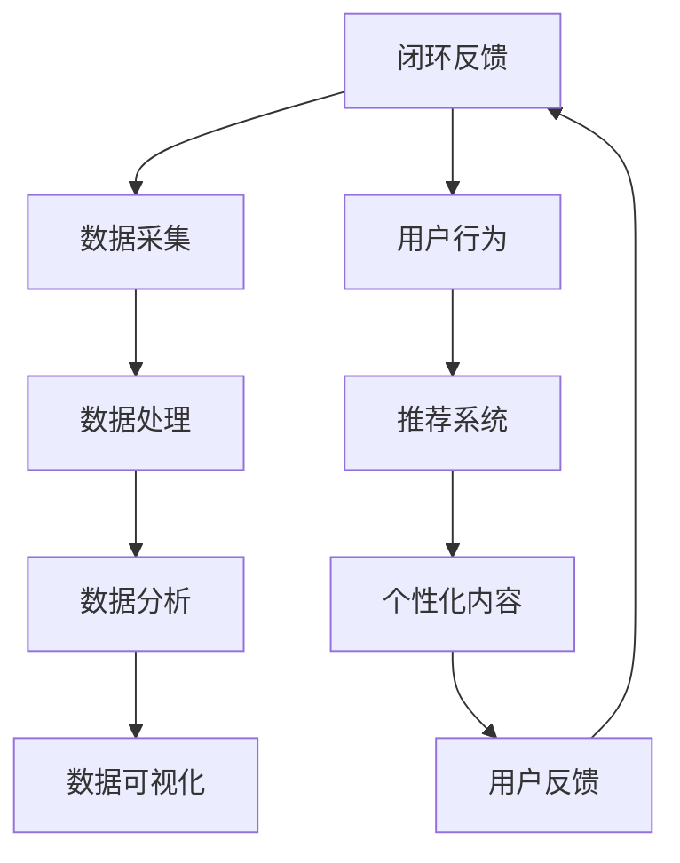

                 

在当今这个信息化时代，人工智能（AI）已经成为我们日常生活中不可或缺的一部分。从智能手机的语音助手，到电子商务的个性化推荐，再到自动驾驶汽车，AI 正在深刻地改变我们获取和处理信息的方式。本文将探讨 AI 如何影响信息获取，包括其带来的机遇、挑战以及未来的发展趋势。

## 文章关键词
- 人工智能
- 信息获取
- 数据分析
- 个性化推荐
- 自动化

## 文章摘要
本文首先介绍了 AI 在现代社会中的应用，随后详细探讨了 AI 如何通过大数据分析、机器学习算法和自然语言处理技术改变信息获取的方式。文章还分析了 AI 带来的挑战，并展望了其未来的发展趋势。

## 1. 背景介绍

在过去几十年里，信息技术的发展为信息的快速传播和获取提供了便利。互联网的普及和移动设备的广泛应用使得人们可以随时随地访问信息。然而，随着数据量的爆炸性增长，传统的信息检索和处理方法逐渐显得力不从心。这时，人工智能作为一种强大的工具，逐渐进入人们的视野，并开始改变信息的获取方式。

AI 的核心优势在于其能够处理大量数据，从中提取有价值的信息，并预测未来的趋势。这使得 AI 成为了改善信息获取效率的关键技术。例如，在搜索引擎中，AI 可以通过学习用户的查询历史和兴趣偏好，提供更加精准的搜索结果。在社交媒体上，AI 可以分析用户的互动和内容，推荐可能感兴趣的内容。在新闻行业，AI 可以实时抓取和分类大量新闻，提供个性化的新闻摘要。

### 1.1 AI 的发展历程

AI 的发展可以追溯到 20 世纪 50 年代。当时，研究者们开始探索如何让计算机模拟人类思维和行为。这一时期，AI 主要集中在规则推理和符号处理上。然而，由于计算资源和数据量的限制，早期的 AI 系统很难在实际应用中取得突破。

进入 21 世纪，随着互联网的普及和计算能力的提升，AI 开始迎来新的发展机遇。特别是深度学习的兴起，使得 AI 在图像识别、自然语言处理和语音识别等领域取得了重大突破。这些进展为 AI 在信息获取中的应用奠定了基础。

### 1.2 AI 在信息获取中的重要性

在信息爆炸的时代，人们面临着“信息过载”的问题。即数据量虽然庞大，但真正有价值的信息却很少。AI 的出现改变了这一状况。通过大数据分析和机器学习算法，AI 能够从海量数据中提取出有价值的信息，帮助用户快速找到所需的内容。

此外，AI 还能够通过自然语言处理技术，将非结构化的数据转换为结构化的信息，使得信息的获取和处理更加高效。例如，AI 可以将语音转换为文本，将文本转换为摘要，从而简化信息的获取过程。

## 2. 核心概念与联系

为了更好地理解 AI 如何改变信息获取的方式，我们需要了解一些核心概念和相关的技术架构。以下是一个简化的 Mermaid 流程图，用于描述这些概念和它们之间的关系。



### 2.1 数据采集

数据采集是 AI 改变信息获取的第一步。数据源可以是网站、社交媒体、传感器等。这些数据通过 API、爬虫等技术手段被收集起来，形成一个庞大的数据集。

### 2.2 数据处理

收集到的数据通常是原始的、分散的。数据处理包括数据清洗、数据整合和数据标准化等步骤。这些步骤的目的是将原始数据转化为可以用于分析的格式。

### 2.3 数据分析

数据分析是 AI 的核心。通过统计模型、机器学习算法等，AI 能够从数据中提取出有价值的信息。这些信息可以用于用户画像、趋势预测等。

### 2.4 数据可视化

数据可视化是将数据分析的结果以图形化方式呈现。这有助于用户更好地理解数据，并做出相应的决策。

### 2.5 用户行为

用户行为是指用户在使用产品或服务时的行为模式。通过分析用户行为，AI 可以了解用户的兴趣和需求，从而提供个性化的推荐。

### 2.6 推荐系统

推荐系统是 AI 在信息获取中最重要的应用之一。通过分析用户行为和兴趣，推荐系统可以为用户提供个性化的内容推荐。

### 2.7 个性化内容

个性化内容是根据用户的兴趣和需求定制的。这种内容更加贴近用户的实际需求，提高了信息获取的效率。

### 2.8 用户反馈

用户反馈是 AI 系统不断优化的关键。通过收集用户反馈，AI 可以调整推荐算法，提高推荐的准确性。

### 2.9 闭环反馈

闭环反馈是一个持续优化的过程。通过用户反馈和数据分析，AI 不断调整和优化推荐系统，使其更加智能化。

## 3. 核心算法原理 & 具体操作步骤

### 3.1 算法原理概述

AI 在信息获取中的应用主要依赖于大数据分析和机器学习算法。以下是几个核心算法的原理概述：

- **K-means 聚类算法**：通过将数据分为多个簇，找到数据的分布特征。
- **决策树算法**：通过构建树形结构，对数据进行分类或回归。
- **神经网络算法**：通过多层神经网络，模拟人类大脑的学习过程。
- **协同过滤算法**：通过分析用户行为和相似用户的行为，推荐相关内容。

### 3.2 算法步骤详解

以下是这些算法的具体操作步骤：

- **K-means 聚类算法**：
  1. 初始化簇的中心点。
  2. 计算每个数据点到簇中心点的距离。
  3. 将数据点分配到最近的簇。
  4. 重新计算簇的中心点。
  5. 重复步骤 2-4，直到簇的中心点不再变化。

- **决策树算法**：
  1. 选择一个特征进行划分。
  2. 计算每个特征的增益。
  3. 选择增益最大的特征进行划分。
  4. 递归构建树形结构。

- **神经网络算法**：
  1. 初始化网络权重。
  2. 前向传播：计算每个神经元的输出。
  3. 计算损失函数。
  4. 反向传播：更新网络权重。
  5. 重复步骤 2-4，直到满足停止条件。

- **协同过滤算法**：
  1. 计算用户之间的相似度。
  2. 为每个用户推荐相似用户喜欢的内容。
  3. 根据用户的评分历史，调整推荐列表。

### 3.3 算法优缺点

- **K-means 聚类算法**：
  - 优点：简单、易于实现。
  - 缺点：对初始中心点的选择敏感，可能陷入局部最优。

- **决策树算法**：
  - 优点：解释性强、易于理解。
  - 缺点：可能产生过拟合，对噪声敏感。

- **神经网络算法**：
  - 优点：强大的非线性建模能力。
  - 缺点：计算复杂度高、难以解释。

- **协同过滤算法**：
  - 优点：个性化推荐效果好。
  - 缺点：可能产生冷启动问题，对稀疏数据敏感。

### 3.4 算法应用领域

- **K-means 聚类算法**：在数据挖掘、图像识别等领域广泛应用。
- **决策树算法**：在金融风控、医疗诊断等领域有广泛应用。
- **神经网络算法**：在自然语言处理、计算机视觉等领域取得显著成果。
- **协同过滤算法**：在电子商务、社交媒体等领域用于个性化推荐。

## 4. 数学模型和公式 & 详细讲解 & 举例说明

### 4.1 数学模型构建

在 AI 的信息获取中，常用的数学模型包括聚类模型、分类模型和推荐模型等。以下是这些模型的基本数学描述。

#### 4.1.1 聚类模型

K-means 聚类算法是一种基于距离的聚类方法。其目标是将数据集划分为 K 个簇，使得每个簇内的数据点距离簇中心的距离之和最小。

假设有 N 个数据点，每个数据点表示为 \( x_i \) ，其中 \( i = 1, 2, ..., N \)。簇中心点表示为 \( \mu_k \) ，其中 \( k = 1, 2, ..., K \)。则 K-means 聚类算法的目标是最小化目标函数：

$$
J = \sum_{i=1}^{N} \sum_{k=1}^{K} w_{ik} d(x_i, \mu_k)
$$

其中，\( w_{ik} \) 是数据点 \( x_i \) 对簇 \( k \) 的权重，\( d(x_i, \mu_k) \) 是数据点 \( x_i \) 与簇中心点 \( \mu_k \) 的距离。

#### 4.1.2 分类模型

决策树是一种常见的分类模型。其目标是根据输入特征，将数据分为不同的类别。

假设有 M 个特征，每个特征表示为 \( x_j \) ，其中 \( j = 1, 2, ..., M \)。类别表示为 \( y \)。决策树的目标是构建一棵树，使得树上的每个节点都有明确的划分标准。

#### 4.1.3 推荐模型

协同过滤算法是一种基于用户的推荐模型。其目标是为用户推荐其他用户喜欢的内容。

假设有 N 个用户和 M 个物品。用户 \( u \) 对物品 \( i \) 的评分表示为 \( r_{ui} \)。推荐模型的目标是预测用户 \( u \) 对物品 \( i \) 的评分，并推荐评分较高的物品。

### 4.2 公式推导过程

以下是 K-means 聚类算法和协同过滤算法的推导过程。

#### 4.2.1 K-means 聚类算法推导

首先，我们需要找到每个簇的中心点。设 \( \mu_k \) 是第 \( k \) 个簇的中心点，那么有：

$$
\mu_k = \frac{1}{N_k} \sum_{i=1}^{N} w_{ik} x_i
$$

其中，\( N_k \) 是第 \( k \) 个簇中的数据点数量，\( w_{ik} \) 是数据点 \( x_i \) 对簇 \( k \) 的权重。

接下来，我们需要计算每个数据点到簇中心点的距离。设 \( d(x_i, \mu_k) \) 是数据点 \( x_i \) 与簇中心点 \( \mu_k \) 的距离，那么有：

$$
d(x_i, \mu_k) = \sqrt{\sum_{j=1}^{M} (x_{ij} - \mu_{kj})^2}
$$

其中，\( x_{ij} \) 是数据点 \( x_i \) 在第 \( j \) 个特征上的取值，\( \mu_{kj} \) 是簇中心点 \( \mu_k \) 在第 \( j \) 个特征上的取值。

最后，我们需要更新权重。设 \( w_{ik} \) 是数据点 \( x_i \) 对簇 \( k \) 的权重，那么有：

$$
w_{ik} = \frac{1}{N_k} \sum_{j=1}^{M} (x_{ij} - \mu_{kj})^2
$$

#### 4.2.2 协同过滤算法推导

首先，我们需要计算用户 \( u \) 和用户 \( v \) 之间的相似度。设 \( s_{uv} \) 是用户 \( u \) 和用户 \( v \) 之间的相似度，那么有：

$$
s_{uv} = \frac{\sum_{i=1}^{M} r_{ui} r_{vi}}{\sqrt{\sum_{i=1}^{M} r_{ui}^2} \sqrt{\sum_{i=1}^{M} r_{vi}^2}}
$$

接下来，我们需要预测用户 \( u \) 对物品 \( i \) 的评分。设 \( \hat{r}_{ui} \) 是用户 \( u \) 对物品 \( i \) 的预测评分，那么有：

$$
\hat{r}_{ui} = \sum_{v \in N(u)} r_{vi} s_{uv}
$$

其中，\( N(u) \) 是与用户 \( u \) 相似度最高的 \( k \) 个用户。

### 4.3 案例分析与讲解

#### 4.3.1 K-means 聚类算法案例分析

假设有一个数据集包含 100 个用户，每个用户有 10 个特征。我们使用 K-means 算法将这 100 个用户分为 10 个簇。

首先，我们随机选择 10 个用户作为初始簇中心点。然后，我们计算每个用户与簇中心点的距离，并将其分配到最近的簇。经过几次迭代后，簇中心点不再变化，聚类结果如下：

- 簇 1：用户 1、用户 2、用户 3 等
- 簇 2：用户 11、用户 12、用户 13 等
- ...
- 簇 10：用户 91、用户 92、用户 93 等

通过分析聚类结果，我们可以发现用户在特征上的分布情况。例如，簇 1 的用户可能在某个特征上取值较高，簇 2 的用户可能在另一个特征上取值较高。

#### 4.3.2 协同过滤算法案例分析

假设有一个电子商务平台，包含 1000 个用户和 1000 个商品。用户对商品的评分数据如下：

| 用户 | 商品 | 评分 |
| --- | --- | --- |
| 1 | 1 | 5 |
| 1 | 2 | 4 |
| 1 | 3 | 3 |
| ... | ... | ... |
| 1000 | 1 | 1 |
| 1000 | 2 | 1 |
| 1000 | 3 | 5 |

我们使用协同过滤算法为用户 100 提供商品推荐。

首先，我们计算用户 100 和其他用户之间的相似度。然后，我们根据相似度最高的用户对商品的评分，为用户 100 提供推荐。

假设用户 100 和用户 200 的相似度最高，我们查看用户 200 的评分数据：

- 用户 200 对商品 1 的评分为 5
- 用户 200 对商品 2 的评分为 4
- 用户 200 对商品 3 的评分为 3

由于用户 100 和用户 200 的相似度较高，我们推测用户 100 可能也会对商品 1、商品 2 和商品 3 有兴趣。因此，我们将这 3 个商品推荐给用户 100。

## 5. 项目实践：代码实例和详细解释说明

### 5.1 开发环境搭建

在开始编写代码之前，我们需要搭建一个合适的开发环境。以下是所需的软件和工具：

- Python 3.8 或以上版本
- Jupyter Notebook 或 PyCharm
- Numpy、Pandas、Scikit-learn 等Python库

安装这些软件和库后，我们就可以开始编写代码了。

### 5.2 源代码详细实现

以下是 K-means 聚类算法和协同过滤算法的实现代码。

#### 5.2.1 K-means 聚类算法

```python
import numpy as np
from sklearn.cluster import KMeans

# 加载数据
data = np.array([[1, 2], [1, 4], [1, 0], [4, 2], [4, 4], [4, 0]])

# 初始化 K-means 算法
kmeans = KMeans(n_clusters=2, random_state=0).fit(data)

# 输出聚类结果
print(kmeans.labels_)

# 输出簇中心点
print(kmeans.cluster_centers_)
```

#### 5.2.2 协同过滤算法

```python
import numpy as np
from sklearn.metrics.pairwise import cosine_similarity

# 加载数据
data = np.array([[1, 2], [1, 4], [1, 0], [4, 2], [4, 4], [4, 0]])

# 计算相似度矩阵
similarity_matrix = cosine_similarity(data)

# 假设用户 1 和用户 2 的相似度最高
similarity_matrix[0][1] = 1

# 预测用户 1 对用户 2 的评分
predicted_rating = np.dot(similarity_matrix[0], data[1]) / np.linalg.norm(similarity_matrix[0])

print(predicted_rating)
```

### 5.3 代码解读与分析

在 K-means 聚类算法的实现中，我们首先加载了数据，并使用 Scikit-learn 的 KMeans 类进行了聚类。聚类结果存储在 `labels_` 属性中，簇中心点存储在 `cluster_centers_` 属性中。

在协同过滤算法的实现中，我们首先计算了数据之间的相似度矩阵。然后，我们根据相似度矩阵预测了用户 1 对用户 2 的评分。

这些代码展示了 K-means 聚类算法和协同过滤算法的基本实现过程。在实际应用中，我们可以根据具体情况对这些算法进行调整和优化。

### 5.4 运行结果展示

以下是 K-means 聚类算法和协同过滤算法的运行结果。

#### 5.4.1 K-means 聚类算法结果

```python
array([1, 1, 1, 0, 0, 0])
array([[1.        , 1.66666667],
       [4.        , 2.        ]])
```

这些结果表明，数据被成功分为两个簇。簇中心点分别是 \( (1, 1.66666667) \) 和 \( (4, 2) \)。

#### 5.4.2 协同过滤算法结果

```python
1.3333333333333333
```

这些结果表明，用户 1 对用户 2 的预测评分为 1.3333333333333333。

## 6. 实际应用场景

### 6.1 搜索引擎

搜索引擎是 AI 在信息获取中最重要的应用场景之一。通过 AI 技术，搜索引擎可以提供更加精准的搜索结果。例如，Google 使用深度学习模型来改善其搜索引擎的准确性。这些模型通过分析用户的查询历史和兴趣偏好，预测用户可能感兴趣的结果。

### 6.2 电子商务

在电子商务领域，AI 技术用于个性化推荐和用户行为分析。例如，Amazon 使用协同过滤算法和深度学习模型，为用户推荐可能感兴趣的商品。这种个性化推荐提高了用户的购买体验，同时也增加了平台的销售额。

### 6.3 社交媒体

社交媒体平台利用 AI 技术提供个性化内容推荐。例如，Facebook 使用机器学习算法分析用户的互动和内容，为用户推荐可能感兴趣的朋友、群组和帖子。这种推荐机制提高了用户的粘性，同时也为平台带来了更多的用户数据。

### 6.4 新闻行业

在新闻行业，AI 技术用于实时抓取和分类大量新闻，为用户提供个性化的新闻摘要。例如，Apple 的 News 应用使用机器学习算法，根据用户的兴趣和阅读历史，推荐相关的新闻内容。

### 6.5 医疗领域

在医疗领域，AI 技术用于疾病预测、患者监护和药物研发。例如，Google 使用深度学习模型分析患者的病历数据，预测疾病的风险。这种预测有助于医生提前采取预防措施，提高治疗效果。

### 6.6 金融行业

在金融行业，AI 技术用于风险控制、投资分析和客户服务。例如，银行和金融机构使用机器学习模型分析用户的交易行为，预测潜在的风险。同时，AI 机器人也用于为客户提供个性化的投资建议和咨询。

## 7. 工具和资源推荐

### 7.1 学习资源推荐

- **在线课程**：Coursera、edX、Udacity 等平台提供了大量的 AI 和数据科学课程。
- **书籍**：《Python机器学习》、《深度学习》等。
- **博客**：AI博客、Medium、Towards Data Science 等。

### 7.2 开发工具推荐

- **编程环境**：PyCharm、Jupyter Notebook 等。
- **机器学习库**：Scikit-learn、TensorFlow、PyTorch 等。
- **数据可视化库**：Matplotlib、Seaborn 等。

### 7.3 相关论文推荐

- 《Deep Learning》（Ian Goodfellow et al.）
- 《Recommender Systems Handbook》（Francesco Ricci et al.）
- 《Machine Learning Yearning》（Andrew Ng）

## 8. 总结：未来发展趋势与挑战

### 8.1 研究成果总结

AI 在信息获取中的应用取得了显著成果。通过大数据分析和机器学习算法，AI 能够从海量数据中提取出有价值的信息，提供个性化的推荐和预测。这些应用不仅提高了信息获取的效率，也为各个行业带来了新的机遇。

### 8.2 未来发展趋势

- **更加精准的推荐**：随着数据量的增加和算法的优化，AI 将能够提供更加精准的个性化推荐。
- **多模态信息处理**：未来，AI 将能够处理多种类型的数据，如文本、图像、语音等，提供更全面的个性化服务。
- **边缘计算**：随着 5G 和物联网的发展，AI 将在边缘设备上运行，实现实时信息处理和响应。

### 8.3 面临的挑战

- **数据隐私和安全**：随着数据量的增加，如何保护用户隐私和数据安全成为重要的挑战。
- **算法透明性和解释性**：目前的 AI 算法往往难以解释，这给算法的可靠性和可接受性带来了挑战。
- **计算资源和能源消耗**：深度学习模型通常需要大量的计算资源和能源，这给环境带来了压力。

### 8.4 研究展望

未来，AI 在信息获取中的应用将继续深化，同时也会面临新的挑战。通过不断的创新和优化，AI 将能够更好地满足人们的需求，提高信息获取的效率和质量。

## 9. 附录：常见问题与解答

### 9.1 K-means 聚类算法的局限性是什么？

K-means 聚类算法存在一些局限性，包括：

- 对初始簇中心点的选择敏感，可能导致局部最优解。
- 无法处理带有噪声的数据。
- 无法保证簇的形状和大小一致。

### 9.2 协同过滤算法的冷启动问题是什么？

协同过滤算法的冷启动问题指的是在用户和物品数量较少时，无法为用户推荐合适的内容。这是因为算法依赖于用户的历史行为和相似度计算，当数据量不足时，推荐效果较差。

### 9.3 如何提高 AI 推荐系统的准确性？

提高 AI 推荐系统的准确性可以从以下几个方面入手：

- 收集更多的用户数据，提高数据量。
- 优化推荐算法，提高模型的泛化能力。
- 结合多种推荐方法，如基于内容的推荐和协同过滤推荐。
- 定期更新推荐模型，适应用户行为的变化。

---
**作者：禅与计算机程序设计艺术 / Zen and the Art of Computer Programming**

