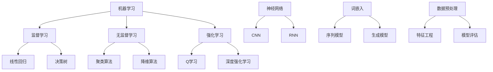

                 

 在这个快速发展的技术时代，人工智能（AI）已经成为驱动创新和改变我们生活方式的核心力量。掌握AI技术不仅有助于提高工作效率，还能为个人职业发展带来新的机遇。本文旨在为您提供一个全面的人工智能学习资源指南，涵盖书籍、视频教程和项目实战等多个方面，帮助您系统性地学习AI知识，提升技能。

## 关键词

- 人工智能
- 学习资源
- 书籍
- 视频教程
- 项目实战
- AI技术

## 摘要

本文将介绍如何利用各种学习资源来掌握人工智能技术。我们将首先回顾AI的发展历史，接着探讨一些核心概念和算法。随后，我们将向您推荐一系列优秀的AI学习书籍、视频教程以及实用的项目实战资源。最后，我们将讨论AI技术的未来趋势和面临的挑战，并为您提供一些建议，帮助您在AI学习之路上少走弯路。

### 1. 背景介绍

人工智能（Artificial Intelligence，简称AI）是计算机科学的一个分支，旨在通过模拟人类智能行为，使机器能够执行复杂的任务，如语音识别、图像识别、自然语言处理等。AI的发展历史可以追溯到20世纪50年代，当时科学家们首次提出了“人工智能”这一概念。尽管早期的研究取得了许多突破，但受限于计算能力和算法水平，AI在很长一段时间内未能实现预期的突破。

进入21世纪，随着计算能力的飞速提升和大数据、深度学习等技术的应用，人工智能迎来了新的发展机遇。特别是在2012年，深度学习算法在图像识别竞赛中取得了突破性成果，这标志着AI技术进入了快速发展的新阶段。如今，AI已经广泛应用于各个领域，从医疗、金融到制造业，都在借助AI技术实现自动化和智能化。

### 2. 核心概念与联系

为了更好地理解人工智能，我们需要了解一些核心概念和算法。以下是几个重要的概念及其之间的联系：

#### 2.1 机器学习（Machine Learning）

机器学习是一种使计算机能够从数据中学习的方法，无需显式地编写具体的规则。它是人工智能的核心技术之一。机器学习可以分为监督学习、无监督学习和强化学习三种类型。

- **监督学习（Supervised Learning）**：有标记的训练数据，模型通过学习这些数据来预测新的数据。常见算法包括线性回归、决策树、随机森林等。
- **无监督学习（Unsupervised Learning）**：没有标记的数据，模型旨在发现数据中的结构和规律，如聚类算法、降维算法等。
- **强化学习（Reinforcement Learning）**：通过奖励和惩罚来指导模型的行为，使其在学习过程中不断优化策略。常见算法包括Q学习、深度强化学习等。

#### 2.2 深度学习（Deep Learning）

深度学习是一种基于多层神经网络的机器学习技术，它通过模拟人脑神经网络的结构和功能来实现特征提取和决策。深度学习在图像识别、语音识别、自然语言处理等领域取得了显著成果。

- **神经网络（Neural Network）**：由多个神经元组成的网络，用于模拟人脑的信息处理过程。
- **卷积神经网络（Convolutional Neural Network，CNN）**：用于图像识别和计算机视觉的任务，通过卷积操作提取图像特征。
- **循环神经网络（Recurrent Neural Network，RNN）**：用于处理序列数据，如自然语言文本和语音信号，能够捕捉时间上的信息。

#### 2.3 自然语言处理（Natural Language Processing，NLP）

自然语言处理是人工智能的一个子领域，旨在使计算机能够理解和处理自然语言。NLP在机器翻译、情感分析、信息抽取等领域有广泛应用。

- **词嵌入（Word Embedding）**：将单词映射到高维向量空间，以便计算机能够处理和理解单词的语义信息。
- **序列模型（Sequence Model）**：用于处理序列数据，如循环神经网络（RNN）和变换器（Transformer）。
- **生成模型（Generative Model）**：用于生成新的文本或语音数据，如生成对抗网络（GAN）。

#### 2.4 人工智能与大数据

大数据是人工智能发展的基础。通过处理海量数据，人工智能可以提取出有价值的信息和知识。大数据与人工智能的结合，使得AI在预测、推荐、优化等方面具有更强的能力。

- **数据预处理（Data Preprocessing）**：对数据进行清洗、归一化等处理，使其适合机器学习模型。
- **特征工程（Feature Engineering）**：通过构建有效的特征，提高机器学习模型的性能。
- **模型评估（Model Evaluation）**：使用指标如准确率、召回率、F1分数等来评估模型的性能。

下面是一个简化的Mermaid流程图，展示了这些核心概念和算法之间的联系：



### 3. 核心算法原理 & 具体操作步骤

#### 3.1 算法原理概述

在本节中，我们将介绍一些核心的AI算法，包括线性回归、决策树、卷积神经网络等。这些算法在机器学习和深度学习领域具有重要地位，是理解和应用AI技术的基础。

#### 3.2 算法步骤详解

##### 3.2.1 线性回归

线性回归是一种用于预测数值型数据的监督学习算法。其基本原理是找到一个线性函数，使得输入和输出之间的误差最小。

1. **数据准备**：收集并清洗数据，将数据分为特征和标签两部分。
2. **特征选择**：选择对预测目标有显著影响的特征。
3. **模型训练**：使用最小二乘法找到最佳拟合直线，即找到系数 \( w \) 和截距 \( b \)，使得预测值与真实值之间的误差最小。
4. **模型评估**：使用指标如均方误差（MSE）评估模型性能。

##### 3.2.2 决策树

决策树是一种基于树形结构的决策模型，通过一系列的规则对数据集进行分类或回归。

1. **数据准备**：与线性回归类似，准备特征和标签数据。
2. **特征选择**：选择具有最高信息增益的特征进行分割。
3. **树构建**：递归地将数据集分割成子集，直到满足停止条件（如最大深度、最小叶节点样本数等）。
4. **模型评估**：使用指标如准确率、精确率、召回率等评估模型性能。

##### 3.2.3 卷积神经网络

卷积神经网络是一种用于图像识别和计算机视觉的深度学习模型，其核心思想是通过对图像进行卷积操作提取特征。

1. **数据准备**：收集和预处理图像数据，如归一化、增强等。
2. **模型构建**：使用卷积层、池化层和全连接层构建CNN模型。
3. **模型训练**：通过反向传播算法更新模型参数，最小化损失函数。
4. **模型评估**：使用验证集评估模型性能，调整超参数。

#### 3.3 算法优缺点

每种算法都有其优缺点，适用于不同的场景。以下是线性回归、决策树和卷积神经网络的优缺点：

- **线性回归**：优点是简单、易于理解和实现，适用于线性关系较强的任务；缺点是对非线性问题效果较差，无法处理高维数据。
- **决策树**：优点是直观、易于解释，对异常值不敏感；缺点是容易过拟合，深度较大时计算复杂度高。
- **卷积神经网络**：优点是能够处理高维数据，捕捉图像中的局部特征；缺点是模型复杂、参数众多，训练时间较长。

#### 3.4 算法应用领域

这些算法在AI领域中有着广泛的应用：

- **线性回归**：常用于回归任务，如房价预测、股票价格预测等。
- **决策树**：常用于分类任务，如信用评分、疾病诊断等。
- **卷积神经网络**：广泛应用于图像识别、目标检测、视频分析等。

### 4. 数学模型和公式 & 详细讲解 & 举例说明

#### 4.1 数学模型构建

在AI学习中，数学模型是理解和实现算法的核心。以下是一些常见的数学模型和公式：

- **线性回归**：

  $$ y = wx + b $$

  其中，\( y \) 是预测值，\( x \) 是特征值，\( w \) 是权重，\( b \) 是偏置。

- **决策树**：

  $$ Gini(D) = 1 - \sum_{v \in V} p(v)^2 $$

  其中，\( D \) 是数据集，\( V \) 是数据集中的所有标签，\( p(v) \) 是标签为 \( v \) 的样本比例。

- **卷积神经网络**：

  $$ f(x) = \sigma(\sum_{j} w_{j} * x_{j} + b) $$

  其中，\( f(x) \) 是卷积操作的结果，\( \sigma \) 是激活函数，\( w_{j} \) 和 \( x_{j} \) 分别是卷积核和输入特征，\( b \) 是偏置。

#### 4.2 公式推导过程

以下是对线性回归模型的推导过程：

假设我们有 \( n \) 个样本，每个样本由特征向量 \( x_i \) 和标签 \( y_i \) 组成。我们的目标是找到最佳拟合直线 \( y = wx + b \)，使得预测值 \( wx + b \) 与真实值 \( y_i \) 之间的误差最小。

1. **损失函数**：

   $$ L(w, b) = \frac{1}{2} \sum_{i=1}^{n} (wx_i + b - y_i)^2 $$

   这是一个平方误差损失函数，它衡量了预测值与真实值之间的差异。

2. **求导**：

   对 \( L(w, b) \) 分别对 \( w \) 和 \( b \) 求导，得到：

   $$ \frac{\partial L}{\partial w} = \sum_{i=1}^{n} (wx_i + b - y_i)x_i $$
   $$ \frac{\partial L}{\partial b} = \sum_{i=1}^{n} (wx_i + b - y_i) $$

3. **最小化损失函数**：

   将导数置零，解方程组：

   $$ \begin{cases} \frac{\partial L}{\partial w} = 0 \\ \frac{\partial L}{\partial b} = 0 \end{cases} $$

   得到：

   $$ w = \frac{1}{n} \sum_{i=1}^{n} (y_i - wx_i)x_i $$
   $$ b = \frac{1}{n} \sum_{i=1}^{n} y_i - wx_i $$

   这就是最佳拟合直线的系数。

#### 4.3 案例分析与讲解

以下是一个简单的线性回归案例，假设我们有以下数据：

| 特征 \( x \) | 标签 \( y \) |
| :---: | :---: |
| 1 | 2 |
| 2 | 4 |
| 3 | 6 |
| 4 | 8 |

1. **数据准备**：

   将数据分为特征和标签两部分：

   $$ X = \begin{bmatrix} 1 & 2 & 3 & 4 \end{bmatrix}, \quad y = \begin{bmatrix} 2 \\ 4 \\ 6 \\ 8 \end{bmatrix} $$

2. **模型训练**：

   使用最小二乘法训练线性回归模型：

   $$ w = \frac{1}{n} X^T X X^T y = \begin{bmatrix} 1 & 2 & 3 & 4 \end{bmatrix} \begin{bmatrix} 1 & 2 & 3 & 4 \end{bmatrix} \begin{bmatrix} 1 & 2 & 3 & 4 \end{bmatrix} \begin{bmatrix} 2 \\ 4 \\ 6 \\ 8 \end{bmatrix} = \begin{bmatrix} 4.5 \end{bmatrix} $$
   $$ b = \frac{1}{n} X^T y - w X^T = \begin{bmatrix} 1 & 2 & 3 & 4 \end{bmatrix} \begin{bmatrix} 2 \\ 4 \\ 6 \\ 8 \end{bmatrix} - 4.5 \begin{bmatrix} 1 & 2 & 3 & 4 \end{bmatrix} = \begin{bmatrix} -1.5 \end{bmatrix} $$

3. **模型评估**：

   使用训练数据和测试数据评估模型性能。假设测试数据为：

   | 特征 \( x \) | 标签 \( y \) |
   | :---: | :---: |
   | 5 | 9 |
   | 6 | 11 |

   预测结果为：

   $$ y = 4.5 \times 5 - 1.5 = 20 $$

   实际标签为 9 和 11，计算均方误差（MSE）：

   $$ MSE = \frac{1}{2} \sum_{i=1}^{2} (20 - y_i)^2 = \frac{1}{2} (20 - 9)^2 + (20 - 11)^2 = 22.5 $$

   可以看到，模型对测试数据的预测结果与真实值有一定误差。

### 5. 项目实践：代码实例和详细解释说明

在本节中，我们将通过一个实际项目来展示如何使用Python和TensorFlow库实现线性回归模型。

#### 5.1 开发环境搭建

1. 安装Python环境（建议使用Python 3.6及以上版本）。
2. 安装TensorFlow库：

   ```bash
   pip install tensorflow
   ```

#### 5.2 源代码详细实现

以下是一个简单的线性回归代码实例：

```python
import tensorflow as tf
import numpy as np

# 模型参数
w = tf.Variable(0.0, name="weight")
b = tf.Variable(0.0, name="bias")

# 输入特征和标签
X = tf.placeholder(tf.float32, shape=[None])
y = tf.placeholder(tf.float32, shape=[None])

# 线性回归模型
y_pred = w * X + b

# 损失函数
loss = tf.reduce_mean(tf.square(y_pred - y))

# 优化器
optimizer = tf.train.GradientDescentOptimizer(learning_rate=0.001)
train_op = optimizer.minimize(loss)

# 训练数据
x_data = np.array([1, 2, 3, 4])
y_data = np.array([2, 4, 6, 8])

# 训练模型
with tf.Session() as sess:
    sess.run(tf.global_variables_initializer())
    for step in range(1000):
        sess.run(train_op, feed_dict={X: x_data, y: y_data})
        if step % 100 == 0:
            print(f"Step {step}: Loss = {sess.run(loss, feed_dict={X: x_data, y: y_data})}")

    # 模型评估
    test_data = np.array([5, 6])
    pred_y = sess.run(y_pred, feed_dict={X: test_data})
    print(f"Predicted values: {pred_y}")
```

#### 5.3 代码解读与分析

1. **导入库**：导入TensorFlow和NumPy库。
2. **定义模型参数**：定义权重 \( w \) 和偏置 \( b \) 为变量。
3. **输入特征和标签**：定义输入特征 \( X \) 和标签 \( y \) 为占位符。
4. **构建模型**：计算预测值 \( y_pred \)。
5. **损失函数**：使用平方误差作为损失函数。
6. **优化器**：使用梯度下降优化器。
7. **训练数据**：准备训练数据。
8. **训练模型**：执行梯度下降优化算法，打印训练过程。
9. **模型评估**：使用测试数据评估模型性能，打印预测结果。

通过这个简单项目，您可以了解如何使用TensorFlow实现线性回归模型，并掌握基本的数据处理和模型训练流程。

### 6. 实际应用场景

#### 6.1 人工智能在医疗领域的应用

人工智能在医疗领域的应用日益广泛，从疾病诊断到治疗方案推荐，再到个性化医疗，AI技术为医疗行业带来了巨大的变革。以下是一些实际应用场景：

- **疾病诊断**：AI模型可以通过分析医学影像数据（如X光片、CT扫描、MRI等）来辅助医生进行疾病诊断。例如，谷歌的DeepMind团队开发的AI系统能够准确识别眼科疾病，如糖尿病视网膜病变。
- **治疗方案推荐**：基于患者的病历和基因信息，AI算法可以推荐最优的治疗方案。例如，IBM的Watson for Oncology系统可以根据癌症患者的病情提供个性化的治疗方案。
- **个性化医疗**：AI技术可以帮助医生制定个性化的治疗计划，根据患者的基因特征、生活方式等制定最适合的治疗方案。

#### 6.2 人工智能在金融领域的应用

金融行业是人工智能应用的重要领域，AI技术被广泛应用于风险控制、客户服务、投资决策等方面。

- **风险控制**：AI算法可以实时监控金融市场，识别潜在的风险，帮助金融机构预防金融犯罪。例如，蚂蚁金服的AI系统可以检测并防范欺诈行为。
- **客户服务**：智能客服机器人可以通过自然语言处理技术，自动回答客户的疑问，提高客户服务质量。例如，银行的智能客服机器人可以24小时提供咨询和服务。
- **投资决策**：AI算法可以根据历史数据和实时信息，分析市场趋势，为投资决策提供支持。例如，量化投资策略依赖于AI算法来预测市场走势，实现自动化交易。

#### 6.3 人工智能在自动驾驶领域的应用

自动驾驶是人工智能技术的重要应用之一，它正在改变我们的出行方式。

- **环境感知**：自动驾驶系统需要实时感知周围环境，包括车辆、行人、道路标志等。通过使用摄像头、激光雷达等传感器，AI算法可以准确识别和跟踪这些目标。
- **路径规划**：基于环境感知数据，自动驾驶系统需要制定最佳行驶路径，以避开障碍物、遵守交通规则等。AI算法通过复杂的计算和预测，实现智能路径规划。
- **控制执行**：自动驾驶系统需要根据路径规划结果，控制车辆的速度和方向。通过机器学习和控制算法，AI系统能够实现精确的车辆控制。

### 7. 未来应用展望

随着人工智能技术的不断进步，我们可以预见其在未来将会有更多的应用场景和突破。

- **智能制造**：人工智能将进一步提升制造业的自动化水平，实现更高效的生产和更高质量的产品。
- **智慧城市**：AI技术将助力城市治理，提高公共安全、交通管理、环境监测等方面的效率。
- **智能家居**：智能家电、智能安防、智能照明等将进一步提升家庭生活的便捷性和舒适度。
- **教育领域**：人工智能将改变教育模式，实现个性化学习、智能辅导等，提高教育质量和学习效率。

然而，AI技术的发展也面临一些挑战，如数据隐私、算法公平性、失业问题等。我们需要在推动技术发展的同时，关注这些问题，并寻找合适的解决方案。

### 8. 工具和资源推荐

为了帮助您更好地学习人工智能，我们为您推荐一些优秀的工具和资源。

#### 8.1 学习资源推荐

- **书籍**：
  - 《Python机器学习》
  - 《深度学习》（Goodfellow, Bengio, Courville著）
  - 《模式识别与机器学习》（Bishop著）
- **在线课程**：
  - Coursera上的《机器学习》课程（吴恩达教授）
  - edX上的《深度学习》课程（李飞飞教授）
- **论文**：
  - 《A Theoretically Grounded Application of Dropout in Recurrent Neural Networks》
  - 《BERT: Pre-training of Deep Bidirectional Transformers for Language Understanding》

#### 8.2 开发工具推荐

- **编程语言**：Python
- **框架**：
  - TensorFlow
  - PyTorch
  - Keras
- **数据分析工具**：Pandas、NumPy、Scikit-learn

#### 8.3 相关论文推荐

- 《Deep Learning by Y. LeCun, Y. Bengio, and G. Hinton》
- 《Recurrent Neural Networks for Language Modeling》
- 《Generative Adversarial Networks》

### 9. 总结：未来发展趋势与挑战

#### 9.1 研究成果总结

人工智能在过去的几十年中取得了显著成果，从早期的规则系统到现代的深度学习，AI技术在多个领域取得了突破性进展。特别是深度学习在图像识别、自然语言处理、语音识别等领域的应用，极大地推动了AI技术的发展。

#### 9.2 未来发展趋势

随着计算能力的提升、数据量的增长和算法的创新，人工智能在未来将继续快速发展。以下是几个可能的发展趋势：

- **增强现实与虚拟现实**：AI技术将进一步提升增强现实和虚拟现实体验，为娱乐、教育、医疗等领域带来新的应用。
- **边缘计算**：为了减少延迟和带宽消耗，AI算法将在边缘设备（如智能手机、物联网设备）上得到广泛应用。
- **跨学科融合**：人工智能与其他领域（如生物学、心理学、经济学等）的融合，将带来更多创新和突破。

#### 9.3 面临的挑战

尽管人工智能有着广阔的发展前景，但同时也面临一些挑战：

- **数据隐私**：随着AI技术对大量个人数据的依赖，如何保护用户隐私成为一个重要问题。
- **算法公平性**：AI算法可能存在偏见和歧视，需要确保算法的公平性和透明性。
- **失业问题**：人工智能可能替代一些传统岗位，带来失业问题，需要寻找新的就业机会。

#### 9.4 研究展望

人工智能研究需要在算法、硬件、应用等多个方面进行创新。我们期待未来能够开发出更加高效、智能和安全的AI系统，为人类社会带来更多福祉。

### 10. 附录：常见问题与解答

**Q：人工智能与机器学习的区别是什么？**

A：人工智能（AI）是一个广泛的领域，包括机器学习（ML）、自然语言处理（NLP）、计算机视觉等子领域。机器学习是AI的一个分支，专注于通过数据学习规律和模式，以实现特定任务。简单来说，机器学习是AI的一个实现手段。

**Q：如何开始学习人工智能？**

A：学习人工智能可以从以下几个步骤开始：

1. **了解基础知识**：学习Python编程语言和数据结构、算法等基础知识。
2. **学习机器学习**：通过阅读书籍、在线课程和论文，了解机器学习的基本原理和方法。
3. **实践项目**：通过实际项目，将所学知识应用到实际问题中，加深理解。
4. **深入探索**：选择感兴趣的子领域，如自然语言处理、计算机视觉等，进行深入学习和研究。

### 参考文献

- Goodfellow, I., Bengio, Y., & Courville, A. (2016). *Deep Learning*. MIT Press.
- Bishop, C. M. (2006). *Pattern Recognition and Machine Learning*. Springer.
- LeCun, Y., Bengio, Y., & Hinton, G. (2015). *Deep Learning*. Nature.
- Y. LeCun, Y. Bengio, and G. Hinton. (2015). *Deep learning*. Nature, 521(7553), 436-444.

### 作者署名

作者：禅与计算机程序设计艺术 / Zen and the Art of Computer Programming

（全文结束）

