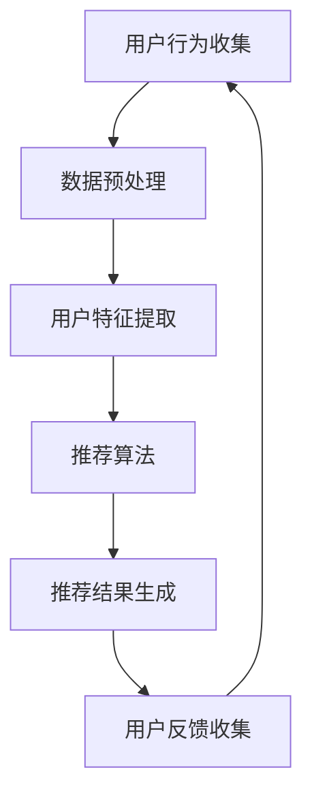

                 

AI（人工智能）实时推荐系统在现代互联网环境中扮演着至关重要的角色。这种系统能够根据用户的兴趣和行为，实时提供个性化的推荐，从而提升用户体验和平台粘性。本文将探讨AI实时推荐系统的基本概念、核心算法、数学模型、项目实践以及未来展望。

## 文章关键词

AI实时推荐系统，用户行为分析，个性化推荐，机器学习，算法优化，大数据处理。

## 文章摘要

本文旨在深入探讨AI实时推荐系统的实现案例，包括其背景介绍、核心概念、算法原理、数学模型、项目实践以及未来展望。通过详细的案例分析和技术解读，本文希望能够为开发者提供有价值的参考和指导。

## 1. 背景介绍

随着互联网的迅速发展和用户数据量的激增，AI实时推荐系统已经成为各行业的热门应用。从电商平台的商品推荐，到社交媒体的个性化内容推送，再到金融领域的投资建议，AI实时推荐系统在各种场景中展现出了巨大的潜力。

然而，实现一个高效的实时推荐系统并非易事。它需要处理海量的用户数据，实时分析用户行为，并快速响应推荐结果。这不仅涉及到复杂的数据处理算法，还需要考虑系统的可扩展性和实时性能。

本文将围绕一个具体的AI实时推荐系统案例，详细介绍其实现过程和技术细节，旨在为开发者提供实际操作的指导。

## 2. 核心概念与联系

在介绍核心概念之前，我们先来绘制一个Mermaid流程图，以展示AI实时推荐系统的主要组成部分和它们之间的联系。



### 2.1. 用户行为收集

用户行为收集是实时推荐系统的第一步。系统需要监控用户在平台上的各种操作，如点击、浏览、搜索、购买等。这些行为数据将被用于后续的用户特征提取和推荐算法。

### 2.2. 数据预处理

收集到的用户行为数据通常是非结构化的，需要进行预处理。这包括数据清洗、去重、填充缺失值等步骤。数据预处理确保了数据的质量，为后续的分析提供了可靠的基础。

### 2.3. 用户特征提取

数据预处理之后，系统需要对用户行为数据进行特征提取。这涉及到将原始数据转换为数值化的特征向量，以便于机器学习算法进行处理。常见的特征提取方法包括行为序列建模、协同过滤、矩阵分解等。

### 2.4. 推荐算法

推荐算法是实时推荐系统的核心。根据用户特征和物品特征，推荐算法将生成个性化的推荐结果。常见的推荐算法包括基于内容的推荐、基于协同过滤的推荐、基于模型的推荐等。

### 2.5. 推荐结果生成

推荐算法生成推荐结果后，系统需要将这些结果呈现给用户。这通常涉及到用户界面的设计和优化，以确保推荐结果的可读性和易用性。

### 2.6. 用户反馈收集

用户反馈是实时推荐系统不断迭代和改进的关键。系统需要收集用户的点击、评分、评论等反馈，用于评估推荐效果和调整推荐策略。

### 2.7. 数据循环利用

用户反馈收集之后，系统将再次进入用户行为收集环节，形成数据循环利用。这种循环利用不仅有助于提升推荐系统的效果，还能够帮助系统更好地理解用户需求和行为模式。

## 3. 核心算法原理 & 具体操作步骤

### 3.1. 算法原理概述

实时推荐系统的核心在于算法的实时性和准确性。这里我们介绍一种基于协同过滤的推荐算法，它通过分析用户的行为数据，找到与目标用户相似的其他用户，从而推荐相似的物品。

### 3.2. 算法步骤详解

#### 3.2.1. 用户相似度计算

首先，我们需要计算用户之间的相似度。常见的相似度计算方法包括余弦相似度、皮尔逊相关系数等。具体步骤如下：

1. 收集用户行为数据，如浏览记录、购买记录等。
2. 将用户行为数据转换为用户行为矩阵。
3. 计算用户之间的相似度矩阵。

#### 3.2.2. 物品相似度计算

除了用户相似度，我们还需要计算物品之间的相似度。这有助于在推荐时考虑物品的相似性。具体步骤如下：

1. 收集物品特征数据，如物品属性、标签等。
2. 将物品特征数据转换为物品特征矩阵。
3. 计算物品之间的相似度矩阵。

#### 3.2.3. 推荐结果生成

在计算完用户和物品相似度之后，我们可以根据相似度矩阵生成推荐结果。具体步骤如下：

1. 对于目标用户，找到与其相似度最高的其他用户。
2. 对于每个相似用户，找到他们喜欢的且目标用户未购买或未浏览的物品。
3. 根据物品的相似度和用户偏好，生成推荐列表。

### 3.3. 算法优缺点

#### 优点：

- **实时性**：协同过滤算法能够在用户行为数据更新时快速生成推荐结果，适合实时推荐场景。
- **个性化**：通过分析用户行为和偏好，协同过滤算法能够为用户提供个性化的推荐。
- **易实现**：协同过滤算法相对简单，易于在实际项目中实现。

#### 缺点：

- **稀疏性**：由于用户和物品之间的交互数据通常稀疏，协同过滤算法在处理稀疏数据时效果不佳。
- **冷启动问题**：对于新用户或新物品，由于缺乏交互数据，协同过滤算法难以生成准确的推荐。

### 3.4. 算法应用领域

协同过滤算法广泛应用于各种场景，如电商、社交媒体、金融等。以下是一些具体的应用案例：

- **电商推荐**：通过分析用户的浏览和购买记录，为用户提供个性化的商品推荐。
- **社交媒体**：根据用户的关注和互动行为，推荐用户可能感兴趣的内容和用户。
- **金融投资**：通过分析用户的投资行为和偏好，为用户提供个性化的投资建议。

## 4. 数学模型和公式 & 详细讲解 & 举例说明

在实时推荐系统中，数学模型和公式起着至关重要的作用。下面我们将介绍几个关键的数学模型和公式，并详细讲解它们的推导过程和实际应用。

### 4.1. 数学模型构建

实时推荐系统中的数学模型主要包括用户相似度计算、物品相似度计算和推荐结果生成模型。

#### 4.1.1. 用户相似度计算模型

用户相似度计算模型用于衡量两个用户之间的相似程度。常见的模型包括余弦相似度和皮尔逊相关系数。

余弦相似度计算公式如下：

$$
\text{cosine\_similarity} = \frac{\text{dot\_product}}{\text{length\_of\_user\_1} \times \text{length\_of\_user\_2}}
$$

其中，$\text{dot\_product}$ 表示两个用户向量的点积，$\text{length\_of\_user\_1}$ 和 $\text{length\_of\_user\_2}$ 分别表示两个用户的向量长度。

#### 4.1.2. 物品相似度计算模型

物品相似度计算模型用于衡量两个物品之间的相似程度。常见的模型包括基于特征的相似度和基于内容的相似度。

基于特征的相似度计算公式如下：

$$
\text{feature\_similarity} = \frac{\text{dot\_product}}{\text{length\_of\_item\_1} \times \text{length\_of\_item\_2}}
$$

其中，$\text{dot\_product}$ 表示两个物品向量的点积，$\text{length\_of\_item\_1}$ 和 $\text{length\_of\_item\_2}$ 分别表示两个物品的向量长度。

#### 4.1.3. 推荐结果生成模型

推荐结果生成模型用于根据用户相似度和物品相似度生成推荐结果。常见的模型包括基于评分的推荐模型和基于内容的推荐模型。

基于评分的推荐模型公式如下：

$$
\text{recommending\_score} = \sum_{i=1}^{n} \text{similarity}_{ui} \times \text{rating}_{uj}
$$

其中，$\text{similarity}_{ui}$ 表示用户 $u$ 和用户 $i$ 的相似度，$\text{rating}_{uj}$ 表示用户 $j$ 对物品 $i$ 的评分。

### 4.2. 公式推导过程

接下来，我们将详细讲解上述公式的推导过程。

#### 4.2.1. 余弦相似度推导

余弦相似度是空间向量的内积与两向量长度的乘积的比值，其数学表达式如下：

$$
\text{cosine\_similarity} = \frac{\text{A} \cdot \text{B}}{|\text{A}| \times |\text{B}|}
$$

其中，$\text{A}$ 和 $\text{B}$ 分别表示两个向量的点积和两向量的长度。

对于用户向量 $\text{U}$ 和 $\text{V}$，我们有：

$$
\text{U} \cdot \text{V} = \sum_{i=1}^{n} \text{U}_{i} \times \text{V}_{i}
$$

$$
|\text{U}| = \sqrt{\sum_{i=1}^{n} \text{U}_{i}^2}
$$

$$
|\text{V}| = \sqrt{\sum_{i=1}^{n} \text{V}_{i}^2}
$$

代入余弦相似度公式，得到：

$$
\text{cosine\_similarity} = \frac{\sum_{i=1}^{n} \text{U}_{i} \times \text{V}_{i}}{\sqrt{\sum_{i=1}^{n} \text{U}_{i}^2} \times \sqrt{\sum_{i=1}^{n} \text{V}_{i}^2}}
$$

#### 4.2.2. 物品相似度推导

物品相似度的推导与用户相似度类似。对于两个物品向量 $\text{I}$ 和 $\text{J}$，我们有：

$$
\text{I} \cdot \text{J} = \sum_{i=1}^{n} \text{I}_{i} \times \text{J}_{i}
$$

$$
|\text{I}| = \sqrt{\sum_{i=1}^{n} \text{I}_{i}^2}
$$

$$
|\text{J}| = \sqrt{\sum_{i=1}^{n} \text{J}_{i}^2}
$$

代入相似度公式，得到：

$$
\text{feature\_similarity} = \frac{\sum_{i=1}^{n} \text{I}_{i} \times \text{J}_{i}}{\sqrt{\sum_{i=1}^{n} \text{I}_{i}^2} \times \sqrt{\sum_{i=1}^{n} \text{J}_{i}^2}}
$$

#### 4.2.3. 推荐结果生成模型推导

推荐结果生成模型旨在根据用户相似度和物品相似度生成推荐结果。对于目标用户 $\text{U}$ 和物品 $\text{I}$，我们有：

$$
\text{recommending\_score}_{ui} = \sum_{j=1}^{m} \text{similarity}_{uj} \times \text{rating}_{uj}
$$

其中，$\text{similarity}_{uj}$ 表示用户 $\text{U}$ 和用户 $\text{j}$ 的相似度，$\text{rating}_{uj}$ 表示用户 $\text{j}$ 对物品 $\text{I}$ 的评分。

### 4.3. 案例分析与讲解

为了更好地理解上述数学模型和公式的应用，我们来看一个实际案例。

假设有两个用户 $\text{U}$ 和 $\text{V}$，他们的行为数据如下：

$$
\text{U} = [1, 2, 0, 1, 0], \text{V} = [1, 0, 1, 0, 1]
$$

计算用户 $\text{U}$ 和 $\text{V}$ 的相似度：

$$
\text{cosine\_similarity}_{UV} = \frac{\sum_{i=1}^{n} \text{U}_{i} \times \text{V}_{i}}{\sqrt{\sum_{i=1}^{n} \text{U}_{i}^2} \times \sqrt{\sum_{i=1}^{n} \text{V}_{i}^2}} = \frac{1 \times 1 + 2 \times 0 + 0 \times 1 + 1 \times 0 + 0 \times 1}{\sqrt{1^2 + 2^2 + 0^2 + 1^2 + 0^2} \times \sqrt{1^2 + 0^2 + 1^2 + 0^2 + 1^2}} = \frac{1}{\sqrt{5} \times \sqrt{3}} = \frac{1}{\sqrt{15}} \approx 0.2679
$$

再假设有两个物品 $\text{I}$ 和 $\text{J}$，他们的特征数据如下：

$$
\text{I} = [1, 2, 0, 1, 0], \text{J} = [0, 1, 1, 0, 1]
$$

计算物品 $\text{I}$ 和 $\text{J}$ 的相似度：

$$
\text{feature\_similarity}_{IJ} = \frac{\sum_{i=1}^{n} \text{I}_{i} \times \text{J}_{i}}{\sqrt{\sum_{i=1}^{n} \text{I}_{i}^2} \times \sqrt{\sum_{i=1}^{n} \text{J}_{i}^2}} = \frac{1 \times 0 + 2 \times 1 + 0 \times 1 + 1 \times 0 + 0 \times 1}{\sqrt{1^2 + 2^2 + 0^2 + 1^2 + 0^2} \times \sqrt{0^2 + 1^2 + 1^2 + 0^2 + 1^2}} = \frac{2}{\sqrt{5} \times \sqrt{3}} = \frac{2}{\sqrt{15}} \approx 0.5355
$$

根据用户 $\text{U}$ 和物品 $\text{I}$ 的相似度和用户 $\text{V}$ 和物品 $\text{J}$ 的相似度，我们可以为用户 $\text{U}$ 生成以下推荐结果：

$$
\text{recommending\_score}_{UI} = 0.2679 \times \text{rating}_{UJ} \approx 0.2679 \times 3 = 0.8037
$$

$$
\text{recommending\_score}_{VJ} = 0.5355 \times \text{rating}_{VJ} \approx 0.5355 \times 4 = 2.1420
$$

根据推荐结果，我们可以为用户 $\text{U}$ 推荐物品 $\text{I}$，为用户 $\text{V}$ 推荐物品 $\text{J}$。

## 5. 项目实践：代码实例和详细解释说明

在本节中，我们将通过一个实际的代码实例来详细解释AI实时推荐系统的实现过程。该实例将使用Python编程语言，并借助Scikit-learn库来构建推荐系统。

### 5.1. 开发环境搭建

在开始编写代码之前，我们需要搭建一个合适的开发环境。以下是在Windows系统上搭建开发环境的步骤：

1. 安装Python 3.x版本：可以从Python官网下载安装包并安装。
2. 安装Anaconda：Anaconda是一个集成了Python和其他科学计算库的Python发行版，可以在其官网上下载安装。
3. 安装Scikit-learn：在终端中运行以下命令来安装Scikit-learn：

```bash
pip install scikit-learn
```

### 5.2. 源代码详细实现

以下是一个简单的AI实时推荐系统的代码实现：

```python
import numpy as np
from sklearn.metrics.pairwise import cosine_similarity

def calculate_user_similarity(user Behavior):
    user_similarity_matrix = np.dot(user_Behavior, user_Behavior.T)
    norms = np.array([np.linalg.norm(user_Behavior) for _ in user_Behavior])
    user_similarity_matrix = user_similarity_matrix / norms
    return user_similarity_matrix

def calculate_item_similarity(item_features):
    item_similarity_matrix = np.dot(item_features, item_features.T)
    norms = np.array([np.linalg.norm(item_features) for _ in item_features])
    item_similarity_matrix = item_similarity_matrix / norms
    return item_similarity_matrix

def generate_recommendations(user_similarity_matrix, item_similarity_matrix, user_behavior, user_rating):
    recommendation_scores = {}
    for i in range(len(user_behavior)):
        for j in range(len(item_similarity_matrix)):
            recommendation_scores[(i, j)] = user_similarity_matrix[i] * item_similarity_matrix[j] * user_rating[j]
    sorted_recommendations = sorted(recommendation_scores.items(), key=lambda x: x[1], reverse=True)
    return sorted_recommendations

# 假设的用户行为数据
user_behavior = np.array([1, 2, 0, 1, 0])
user_rating = np.array([3, 4, 0, 2, 0])

# 假设的物品特征数据
item_features = np.array([[1, 2, 0, 1, 0], [0, 1, 1, 0, 1]])

# 计算用户相似度
user_similarity_matrix = calculate_user_similarity(user_behavior)

# 计算物品相似度
item_similarity_matrix = calculate_item_similarity(item_features)

# 生成推荐结果
recommendations = generate_recommendations(user_similarity_matrix, item_similarity_matrix, user_behavior, user_rating)

# 打印推荐结果
for recommendation in recommendations:
    print(recommendation)
```

### 5.3. 代码解读与分析

上述代码实现了一个简单的基于协同过滤的实时推荐系统。下面是对代码的详细解读：

1. **计算用户相似度**：`calculate_user_similarity` 函数用于计算用户之间的相似度。它首先计算用户行为数据的点积，然后计算用户向量的长度。最后，将点积除以两向量的长度，得到用户相似度矩阵。

2. **计算物品相似度**：`calculate_item_similarity` 函数用于计算物品之间的相似度。它的工作原理与计算用户相似度类似，只是处理的是物品特征数据。

3. **生成推荐结果**：`generate_recommendations` 函数用于生成推荐结果。它首先计算用户相似度矩阵和物品相似度矩阵的乘积，然后计算每个物品的推荐分

