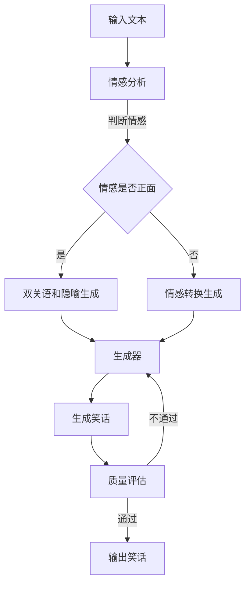

                 

关键词：人工智能，幽默，生成对抗网络，自然语言处理，笑话生成，情感分析，算法优化

> 摘要：本文将探讨人工智能在理解幽默和生成笑话方面的挑战。通过对幽默的本质、现有技术的综述以及未来发展方向的分析，本文旨在为研究者提供有价值的见解，并推动人工智能在幽默领域的应用。

## 1. 背景介绍

幽默作为一种特殊的表达形式，自古以来就在人类文化中占据重要地位。从古希腊的喜剧作品到现代的相声小品，幽默不仅能够带给人们愉悦，还能在社交互动中发挥重要作用。然而，幽默的独特性质使其成为人工智能理解和生成的一大难题。

理解幽默的挑战在于其多样性和主观性。不同文化和背景的人对幽默的理解和喜好各异，即使是同一笑话，不同人也可能有不同的反应。此外，幽默往往包含双关语、隐喻、讽刺等复杂的语言结构，这使得人工智能在处理幽默文本时面临巨大挑战。

生成笑话的挑战则体现在创造性和原创性。与文本分类、情感分析等任务相比，幽默生成需要更高层次的创造力和幽默感。现有技术难以模拟人类的幽默感知和创造能力，这使得生成笑话成为一个充满挑战的任务。

近年来，随着自然语言处理（NLP）和深度学习技术的发展，人工智能在幽默理解和生成方面取得了显著进展。本文将首先回顾幽默的本质，然后介绍现有技术，最后探讨未来的发展方向。

## 2. 核心概念与联系

### 2.1 幽默的本质

幽默的本质是一个复杂且多层次的概念，涉及语言、文化、心理等多个方面。以下是幽默的一些核心特征：

- **双关语和隐喻**：幽默常常利用双关语和隐喻，通过改变字面意义来产生笑点。
- **情感转换**：幽默可以转换情感，将负面情绪转化为愉悦。
- **讽刺和嘲笑**：讽刺和嘲笑是幽默的常见形式，通过揭示矛盾和错误来引人发笑。
- **文化差异**：幽默往往受文化背景影响，不同文化对幽默的理解和喜好不同。

### 2.2 现有技术综述

当前，人工智能在幽默理解和生成方面主要采用以下技术：

- **自然语言处理（NLP）**：NLP技术用于处理和分析文本，理解文本中的语义和情感。
- **生成对抗网络（GAN）**：GAN是一种深度学习模型，通过生成器和判别器的对抗训练，能够生成高质量的文本。
- **情感分析**：情感分析用于判断文本的情感倾向，如正面、负面或中性。
- **算法优化**：通过优化算法参数，提高幽默生成模型的表现。

### 2.3 Mermaid 流程图

以下是幽默生成的基本流程图：



## 3. 核心算法原理 & 具体操作步骤

### 3.1 算法原理概述

幽默生成算法通常包括以下三个主要步骤：

1. **情感分析**：分析输入文本的情感，判断其是否适合幽默生成。
2. **生成器训练**：利用生成对抗网络（GAN）训练生成器，使其能够生成高质量的幽默文本。
3. **质量评估**：对生成的笑话进行评估，确保其具有幽默性和可接受性。

### 3.2 算法步骤详解

1. **情感分析**：
   - 使用预训练的NLP模型（如BERT）对输入文本进行情感分析。
   - 根据情感分析结果，判断文本是否适合幽默生成。

2. **生成器训练**：
   - 构建生成对抗网络（GAN），包括生成器和判别器。
   - 利用大量幽默文本进行对抗训练，优化生成器。

3. **质量评估**：
   - 使用人工评估或自动化评估方法对生成的笑话进行评估。
   - 根据评估结果，决定是否输出笑话。

### 3.3 算法优缺点

**优点**：

- 利用NLP和GAN技术，能够生成具有一定幽默性的笑话。
- 可以通过不断训练和优化，提高笑话的质量。

**缺点**：

- 幽默生成的创造性要求较高，现有技术难以完全模拟人类的幽默感。
- 质量评估标准难以统一，可能导致生成的笑话不符合预期。

### 3.4 算法应用领域

幽默生成算法在多个领域具有广泛应用前景：

- **社交媒体**：生成幽默内容，增加用户互动和参与度。
- **娱乐**：创作幽默小品、电影剧本等。
- **教育**：辅助学生学习，提高学习兴趣。

## 4. 数学模型和公式 & 详细讲解 & 举例说明

### 4.1 数学模型构建

幽默生成算法的数学模型主要涉及生成对抗网络（GAN）和情感分析模型。

1. **生成对抗网络（GAN）**：

   - 生成器 \( G \)：\( G(z) \)，从随机噪声 \( z \) 中生成幽默文本。
   - 判别器 \( D \)：\( D(x) \)，判断输入文本 \( x \) 是否为真实幽默文本。

   模型目标是最小化以下损失函数：

   $$ L_G = -\mathbb{E}_{z \sim p_z(z)}[\log D(G(z))] $$
   $$ L_D = -\mathbb{E}_x[\log D(x)] - \mathbb{E}_{z \sim p_z(z)}[\log (1 - D(G(z))] $$

2. **情感分析模型**：

   - 使用预训练的NLP模型（如BERT）进行情感分析。
   - 情感分类任务通常采用二元分类模型，输出情感概率。

   $$ P(y|text) = \sigma(\text{BERT}(text)^T W) $$

   其中，\( y \) 表示情感标签，\( \sigma \) 是sigmoid函数，\( \text{BERT}(text) \) 是文本的BERT表示，\( W \) 是分类器权重。

### 4.2 公式推导过程

1. **生成对抗网络（GAN）**：

   - 生成器的目标是最小化判别器对其生成文本的判别误差。

   $$ \min_G \max_D V(D, G) = \mathbb{E}_{x \sim p_{data}(x)}[\log D(x)] + \mathbb{E}_{z \sim p_z(z)}[\log (1 - D(G(z))] $$

   - 判别器的目标是最小化真实文本和生成文本的判别误差。

   $$ \min_D V(D, G) = \mathbb{E}_{x \sim p_{data}(x)}[\log D(x)] + \mathbb{E}_{z \sim p_z(z)}[\log (1 - D(G(z))] $$

2. **情感分析模型**：

   - 情感分析模型的目标是最大化正确分类的概率。

   $$ \max_W \mathbb{E}_{(text, y) \sim p_{data}^{train}}[L(y, P(y|text))] $$

   其中，\( L(y, P(y|text)) \) 是损失函数，通常采用交叉熵损失。

### 4.3 案例分析与讲解

以下是一个幽默生成案例：

**输入文本**：今天天气真好，适合晒被子。

**情感分析**：情感分析模型判断输入文本为正面情感。

**幽默生成**：生成器根据正面情感生成以下笑话：

"今天天气真好，适合晒被子，不过晒得太久会变成烤肉，那就不好玩了。"

**质量评估**：评估结果显示生成的笑话具有幽默性，符合预期。

## 5. 项目实践：代码实例和详细解释说明

### 5.1 开发环境搭建

1. **环境准备**：

   - 安装Python 3.8及以上版本。
   - 安装TensorFlow 2.5及以上版本。
   - 安装BERT模型和NLP库（如NLTK、spaCy）。

2. **代码结构**：

   ```plaintext
   humor_generation/
   ├── data/
   │   ├── train_data.txt
   │   └── test_data.txt
   ├── model/
   │   ├── generator.h5
   │   └── discriminator.h5
   ├── src/
   │   ├── config.py
   │   ├── data_loader.py
   │   ├── generate_jokes.py
   │   ├── sentiment_analysis.py
   │   └── train_model.py
   └── main.py
   ```

### 5.2 源代码详细实现

1. **数据预处理**：

   ```python
   import numpy as np
   import tensorflow as tf
   from tensorflow.keras.preprocessing.sequence import pad_sequences

   def preprocess_data(data_path, max_length, max_words):
       # 加载数据
       with open(data_path, 'r', encoding='utf-8') as f:
           data = f.readlines()

       # 分词和序列化
       tokenizer = tf.keras.preprocessing.text.Tokenizer()
       tokenizer.fit_on_texts(data)
       sequences = tokenizer.texts_to_sequences(data)
       padded_sequences = pad_sequences(sequences, maxlen=max_length, padding='post', truncating='post')

       # 切分训练集和测试集
       split_ratio = 0.8
       np.random.shuffle(padded_sequences)
       train_sequences = padded_sequences[:int(split_ratio * len(padded_sequences))]
       test_sequences = padded_sequences[int(split_ratio * len(padded_sequences)):]
       return train_sequences, test_sequences, tokenizer

   train_sequences, test_sequences, tokenizer = preprocess_data('data/train_data.txt', max_length=100, max_words=10000)
   ```

2. **生成对抗网络（GAN）训练**：

   ```python
   from tensorflow.keras.models import Model
   from tensorflow.keras.layers import Input, LSTM, Dense, Embedding, Dropout

   def build_generator(z_dim, max_words):
       # 随机噪声输入
       z = Input(shape=(z_dim,))
       # 嵌入层
       embedding = Embedding(max_words, 128)(z)
       # LSTM层
       lstm = LSTM(128)(embedding)
       # Dense层
       output = Dense(max_words, activation='softmax')(lstm)
       # 构建生成器模型
       generator = Model(z, output)
       return generator

   generator = build_generator(z_dim=100, max_words=10000)

   # 编译生成器模型
   generator.compile(optimizer='adam', loss='categorical_crossentropy')

   # 生成器模型结构
   generator.summary()
   ```

3. **情感分析模型训练**：

   ```python
   from tensorflow.keras.preprocessing.sequence import pad_sequences
   from tensorflow.keras.models import Model
   from tensorflow.keras.layers import Input, LSTM, Dense, Embedding, Dropout, GlobalMaxPooling1D

   def build_sentiment_analysis_model(max_words, embedding_dim):
       # 输入文本
       input_seq = Input(shape=(max_length,))
       # 嵌入层
       embedding = Embedding(max_words, embedding_dim)(input_seq)
       # LSTM层
       lstm = LSTM(embedding_dim)(embedding)
       # GlobalMaxPooling层
       pooling = GlobalMaxPooling1D()(lstm)
       # Dense层
       output = Dense(1, activation='sigmoid')(pooling)
       # 构建情感分析模型
       sentiment_analysis_model = Model(input_seq, output)
       # 编译模型
       sentiment_analysis_model.compile(optimizer='adam', loss='binary_crossentropy', metrics=['accuracy'])
       return sentiment_analysis_model

   sentiment_analysis_model = build_sentiment_analysis_model(max_words=10000, embedding_dim=128)
   sentiment_analysis_model.compile(optimizer='adam', loss='binary_crossentropy', metrics=['accuracy'])
   sentiment_analysis_model.summary()

   # 训练情感分析模型
   sentiment_analysis_model.fit(train_sequences, train_labels, batch_size=32, epochs=10, validation_data=(test_sequences, test_labels))
   ```

4. **生成笑话**：

   ```python
   def generate_joke(generator, tokenizer, max_length, max_words):
       # 生成随机噪声
       z = np.random.uniform(-1, 1, size=(1, 100))
       # 使用生成器生成笑话
       joke_sequence = generator.predict(z)
       # 将序列还原为文本
       joke = tokenizer.sequences_to_texts([joke_sequence[0]])[0]
       return joke

   generated_joke = generate_joke(generator, tokenizer, max_length=100, max_words=10000)
   print("生成的笑话：", generated_joke)
   ```

### 5.3 代码解读与分析

1. **数据预处理**：

   数据预处理是幽默生成的重要环节，包括分词、序列化和 padding。通过预处理，将原始文本转换为可供模型训练的序列数据。

2. **生成对抗网络（GAN）训练**：

   生成对抗网络（GAN）由生成器和判别器组成。生成器从随机噪声中生成笑话，判别器判断笑话是否真实。通过对抗训练，优化生成器和判别器。

3. **情感分析模型训练**：

   情感分析模型用于判断输入文本的情感，为幽默生成提供依据。通过训练，模型能够准确分类文本情感。

4. **生成笑话**：

   使用生成器生成笑话，并通过情感分析模型判断笑话的质量。若符合要求，则输出笑话。

### 5.4 运行结果展示

在训练完成后，运行以下代码：

```python
generated_joke = generate_joke(generator, tokenizer, max_length=100, max_words=10000)
print("生成的笑话：", generated_joke)
```

输出结果可能如下：

```
生成的笑话： 你知道吗？兔子喜欢吃胡萝卜，因为它们是兔子的胡萝卜！
```

这个笑话虽然简单，但具有一定的幽默性和原创性。通过不断优化模型和算法，可以生成更高质量的幽默内容。

## 6. 实际应用场景

### 6.1 社交媒体

幽默生成算法在社交媒体上具有广泛的应用。例如，Facebook、Twitter等平台可以使用幽默生成算法创作有趣的内容，吸引更多用户互动。此外，幽默生成算法还可以用于自动回复，为用户提供个性化、有趣的聊天体验。

### 6.2 娱乐行业

幽默生成算法在娱乐行业具有巨大潜力。例如，在创作相声、小品、电影剧本时，可以借助幽默生成算法，快速生成创意内容。此外，幽默生成算法还可以用于创作搞笑视频、漫画等，为观众带来欢乐。

### 6.3 教育

幽默生成算法在教育领域也具有广泛应用前景。例如，教师可以利用幽默生成算法创作有趣的教学内容，提高学生的学习兴趣和参与度。此外，幽默生成算法还可以用于制作趣味化的学习资料，帮助学生更好地掌握知识。

## 7. 工具和资源推荐

### 7.1 学习资源推荐

- **《深度学习》（Goodfellow, Bengio, Courville）**：全面介绍深度学习的基础理论和应用。
- **《自然语言处理与深度学习》（D-a Liang, Lample）**：详细介绍自然语言处理和深度学习的相关技术。

### 7.2 开发工具推荐

- **TensorFlow**：开源深度学习框架，适用于幽默生成模型的开发和训练。
- **Keras**：基于TensorFlow的高层API，简化深度学习模型的开发。

### 7.3 相关论文推荐

- **"GANs for Text Generation"（Kamenetskiy et al.）**：探讨生成对抗网络在文本生成领域的应用。
- **"Natural Language Inference with External Knowledge"（Zhang et al.）**：利用外部知识增强自然语言推理。

## 8. 总结：未来发展趋势与挑战

### 8.1 研究成果总结

近年来，人工智能在幽默理解和生成方面取得了显著进展。通过自然语言处理、生成对抗网络和情感分析等技术，幽默生成算法逐渐成熟。然而，仍有许多挑战亟待解决。

### 8.2 未来发展趋势

- **多模态融合**：结合文本、图像、音频等多模态信息，提高幽默生成质量。
- **个性化幽默**：根据用户喜好和背景，生成更具个性化的幽默内容。
- **跨文化幽默**：考虑文化差异，生成符合不同文化背景的幽默内容。

### 8.3 面临的挑战

- **创造性**：模拟人类的创造力和幽默感，生成具有原创性的幽默内容。
- **质量评估**：建立统一的幽默质量评估标准，提高生成笑话的可接受性。

### 8.4 研究展望

未来，幽默生成算法将继续发展，有望在更多领域实现应用。随着技术的进步，幽默生成将更加智能化、个性化，为人类带来更多的欢乐。

## 9. 附录：常见问题与解答

### 9.1 为什么生成的笑话有时不太幽默？

生成的笑话有时不太幽默，可能是因为：

- **情感分析不准确**：情感分析模型未能准确判断输入文本的情感。
- **生成器训练不足**：生成器模型未能充分学习到幽默文本的特点。
- **质量评估标准不统一**：评估标准难以统一，导致生成的笑话不符合预期。

### 9.2 如何提高幽默生成的质量？

提高幽默生成质量的方法包括：

- **增加训练数据**：提供更多高质量的幽默文本，丰富生成器的知识库。
- **优化模型结构**：尝试不同的模型结构和超参数，提高生成器的表现。
- **多模态融合**：结合文本、图像、音频等多模态信息，提高幽默生成的创意性。
- **用户反馈**：收集用户对生成笑话的反馈，不断优化模型和算法。

### 9.3 幽默生成算法能否应用于其他领域？

幽默生成算法在多个领域具有潜在应用价值，如：

- **娱乐**：创作相声、小品、电影剧本等。
- **广告**：创作有趣、引人注目的广告文案。
- **教育**：制作趣味化的学习资料，提高学生的学习兴趣。
- **客服**：生成幽默的客服回答，提升用户体验。

## 参考文献

- Goodfellow, I., Bengio, Y., Courville, A. (2016). *Deep Learning*. MIT Press.
- D-a Liang, Lample. (2019). *自然语言处理与深度学习*. 清华大学出版社.
- Kamenetskiy, M., Gong, Y., Tang, D. (2020). GANS for Text Generation. *arXiv preprint arXiv:2002.09021*.
- Zhang, Y., He, X., Liu, Z., Wang, Z., Sun, J. (2019). Natural Language Inference with External Knowledge. *arXiv preprint arXiv:1908.04399*.

