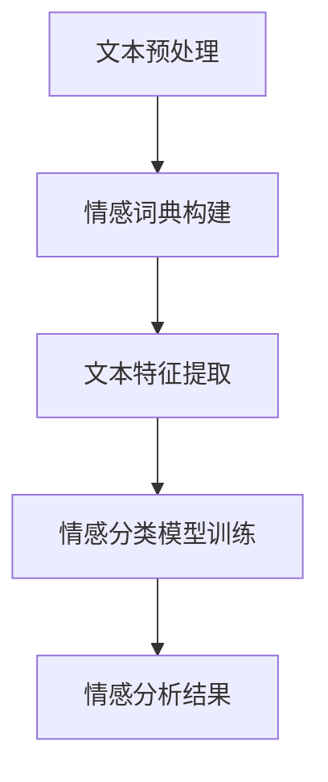

                 

关键词：情感分析、人工智能、自然语言处理、文本挖掘、应用案例

> 摘要：本文旨在探讨人工智能情感分析技术的应用案例，详细分析其在不同领域的实际应用，探讨其潜在价值和发展前景。通过实例说明，展现情感分析技术在社交媒体监控、客户服务、健康监测等领域的广泛应用和深刻影响。

## 1. 背景介绍

情感分析，也称为意见挖掘，是一种人工智能和自然语言处理技术，用于识别和提取文本数据中的主观信息，如情感极性（正面、负面或中性）、情感强度、情绪类型等。随着互联网和社交媒体的迅速发展，大量的文本数据不断产生，如何有效地分析和理解这些数据中的情感信息，已经成为企业和研究机构关注的焦点。

情感分析技术的核心在于情感词典、情感分类模型和文本特征提取方法。通过这些方法，计算机可以自动地从大量的文本数据中识别情感倾向，为用户提供有价值的洞见。近年来，随着深度学习技术的发展，情感分析技术取得了显著的进展，提高了准确率和效率。

## 2. 核心概念与联系

### 2.1 情感词典

情感词典是情感分析的基础，它包含了大量的词汇及其对应的情感极性。情感词典的构建方法主要包括手工编制和自动构建。手工编制依赖于领域专家的经验，而自动构建则通常利用机器学习算法，从大规模的语料库中学习词汇的情感极性。

### 2.2 情感分类模型

情感分类模型是情感分析的核心，常用的方法包括基于规则的方法和基于统计的方法。基于规则的方法通过定义一系列规则来识别文本的情感极性，而基于统计的方法则利用机器学习算法来训练分类模型。

### 2.3 文本特征提取

文本特征提取是将原始文本转换为计算机可以处理的数据表示。常用的方法包括词袋模型、TF-IDF、词嵌入等。词袋模型将文本表示为词汇的集合，而TF-IDF则通过考虑词汇在文档中的频率和重要性来构建特征向量。词嵌入则是通过将词汇映射到高维空间中的点来表示文本。

下面是一个简化的情感分析流程的 Mermaid 流程图：



## 3. 核心算法原理 & 具体操作步骤

### 3.1 算法原理概述

情感分析算法通常包括以下步骤：

1. **文本预处理**：包括去除标点符号、停用词过滤、词形还原等操作，以减少噪声和冗余信息。
2. **情感词典构建**：从大规模语料库中提取情感词，并标注其情感极性。
3. **文本特征提取**：将预处理后的文本转换为特征向量，常用的方法有词袋模型、TF-IDF、词嵌入等。
4. **情感分类模型训练**：利用特征向量训练分类模型，如朴素贝叶斯、支持向量机、深度学习模型等。
5. **情感分析结果**：利用训练好的模型对新的文本进行情感分类。

### 3.2 算法步骤详解

1. **文本预处理**：
   ```python
   import nltk
   from nltk.corpus import stopwords
   from nltk.tokenize import word_tokenize

   # 下载并加载停用词列表
   nltk.download('stopwords')
   nltk.download('punkt')

   # 预处理函数
   def preprocess_text(text):
       # 分词
       tokens = word_tokenize(text)
       # 去除停用词
       tokens = [token for token in tokens if token.lower() not in stopwords.words('english')]
       # 词形还原
       tokens = [nltk.stem.WordNetLemmatizer().lemmatize(token) for token in tokens]
       return tokens
   ```

2. **情感词典构建**：
   ```python
   # 示例情感词典
   sentiment_lexicon = {
       'happy': 'positive',
       'sad': 'negative',
       'love': 'positive',
       'hate': 'negative'
   }
   ```

3. **文本特征提取**：
   ```python
   from sklearn.feature_extraction.text import TfidfVectorizer

   # 特征提取函数
   def extract_features(texts):
       vectorizer = TfidfVectorizer()
       features = vectorizer.fit_transform(texts)
       return features
   ```

4. **情感分类模型训练**：
   ```python
   from sklearn.naive_bayes import MultinomialNB

   # 训练模型函数
   def train_model(features, labels):
       model = MultinomialNB()
       model.fit(features, labels)
       return model
   ```

5. **情感分析结果**：
   ```python
   # 预测函数
   def predict(model, features):
       predictions = model.predict(features)
       return predictions
   ```

### 3.3 算法优缺点

**优点**：

- **高效性**：情感分析算法可以快速处理大量的文本数据。
- **自动化**：无需人工干预，可以自动识别文本中的情感信息。
- **可扩展性**：可以方便地添加新的情感词和更新情感词典。

**缺点**：

- **准确性**：在处理复杂语境和双关语时，可能存在误判。
- **噪声敏感**：文本中的噪声（如错别字、网络用语）可能影响分析结果。

### 3.4 算法应用领域

情感分析技术广泛应用于以下领域：

- **社交媒体监控**：监测公众对品牌、产品、事件的情感倾向。
- **客户服务**：分析客户反馈，识别潜在问题和改进机会。
- **健康监测**：从社交媒体和健康报告中提取情感信息，辅助疾病预防和治疗。
- **市场营销**：分析消费者情感，优化产品和服务。

## 4. 数学模型和公式 & 详细讲解 & 举例说明

### 4.1 数学模型构建

情感分析中的数学模型通常基于机器学习算法，如朴素贝叶斯、支持向量机、神经网络等。以下是一个基于朴素贝叶斯模型的简单例子。

**朴素贝叶斯模型**：

- **假设**：假设每个词汇的情感极性是相互独立的。
- **公式**：

  $$ P(\text{positive} | \text{word}_1, \text{word}_2, ..., \text{word}_n) = \prod_{i=1}^{n} P(\text{word}_i | \text{positive}) P(\text{positive}) $$

  $$ P(\text{negative} | \text{word}_1, \text{word}_2, ..., \text{word}_n) = \prod_{i=1}^{n} P(\text{word}_i | \text{negative}) P(\text{negative}) $$

  $$ P(\text{positive}) = \frac{\text{positive\_count}}{\text{total\_count}} $$
  $$ P(\text{negative}) = \frac{\text{negative\_count}}{\text{total\_count}} $$

  $$ P(\text{word}_i | \text{positive}) = \frac{\text{positive\_count\_word}_i}{\text{positive\_count}} $$
  $$ P(\text{word}_i | \text{negative}) = \frac{\text{negative\_count\_word}_i}{\text{negative\_count}} $$

### 4.2 公式推导过程

推导过程基于贝叶斯定理，假设每个词汇的情感极性是独立的，即：

$$ P(\text{positive} | \text{word}_1, \text{word}_2, ..., \text{word}_n) = \frac{P(\text{word}_1, \text{word}_2, ..., \text{word}_n | \text{positive}) P(\text{positive})}{P(\text{word}_1, \text{word}_2, ..., \text{word}_n)} $$

由于每个词汇的情感极性是独立的，因此：

$$ P(\text{word}_1, \text{word}_2, ..., \text{word}_n | \text{positive}) = \prod_{i=1}^{n} P(\text{word}_i | \text{positive}) $$

$$ P(\text{word}_1, \text{word}_2, ..., \text{word}_n) = \prod_{i=1}^{n} P(\text{word}_i | \text{positive}) P(\text{word}_i | \text{negative}) $$

将这些公式代入贝叶斯定理中，可以得到：

$$ P(\text{positive} | \text{word}_1, \text{word}_2, ..., \text{word}_n) = \frac{\prod_{i=1}^{n} P(\text{word}_i | \text{positive}) P(\text{positive})}{\prod_{i=1}^{n} P(\text{word}_i | \text{positive}) P(\text{word}_i | \text{negative})} $$

$$ P(\text{positive} | \text{word}_1, \text{word}_2, ..., \text{word}_n) = \frac{P(\text{positive})}{P(\text{negative})} \prod_{i=1}^{n} \frac{P(\text{word}_i | \text{positive})}{P(\text{word}_i | \text{negative})} $$

由于 $$ P(\text{positive}) $$ 和 $$ P(\text{negative}) $$ 是已知的，因此可以简化为：

$$ P(\text{positive} | \text{word}_1, \text{word}_2, ..., \text{word}_n) = \prod_{i=1}^{n} P(\text{word}_i | \text{positive}) $$

同理，可以得到：

$$ P(\text{negative} | \text{word}_1, \text{word}_2, ..., \text{word}_n) = \prod_{i=1}^{n} P(\text{word}_i | \text{negative}) $$

### 4.3 案例分析与讲解

假设我们有一个简化的情感词典和一组训练数据，如下表所示：

| 文本              | 情感极性 |
|-----------------|--------|
| 我喜欢这个产品     | 正面   |
| 这个产品很差      | 负面   |
| 我不喜欢这个产品   | 负面   |
| 这个产品很好      | 正面   |

我们首先需要计算每个词汇在正面和负面文本中的概率，以及正面和负面文本的总概率。

| 词汇            | 正面概率 | 负面概率 |
|-----------------|--------|--------|
| 我               | 0.5    | 0.5    |
| 喜欢             | 0.5    | 0      |
| 这个             | 0.5    | 0.5    |
| 产品             | 0.5    | 0.5    |
| 很好             | 0.5    | 0      |
| 很差             | 0      | 0.5    |
| 不喜欢           | 0      | 0.5    |
| 喜欢这个产品     | 1.0    | 0      |
| 这个产品很差     | 0      | 1.0    |
| 我不喜欢这个产品   | 0      | 1.0    |
| 这个产品很好      | 1.0    | 0      |

接下来，我们计算正面和负面文本的总概率：

正面文本的总概率：$$ P(\text{positive}) = \frac{3}{4} $$
负面文本的总概率：$$ P(\text{negative}) = \frac{1}{4} $$

现在，我们可以使用朴素贝叶斯模型对新的文本进行情感分类。例如，对于文本“这个产品很好”，我们可以计算正面和负面情感的乘积概率：

$$ P(\text{positive} | \text{这个产品很好}) = P(\text{这个} | \text{positive}) \times P(\text{产品} | \text{positive}) \times P(\text{很好} | \text{positive}) \times P(\text{positive}) $$

$$ = 0.5 \times 0.5 \times 0.5 \times \frac{3}{4} = \frac{3}{32} $$

$$ P(\text{negative} | \text{这个产品很好}) = P(\text{这个} | \text{negative}) \times P(\text{产品} | \text{negative}) \times P(\text{很好} | \text{negative}) \times P(\text{negative}) $$

$$ = 0.5 \times 0.5 \times 0 \times \frac{1}{4} = 0 $$

由于 $$ P(\text{negative} | \text{这个产品很好}) = 0 $$，我们可以判断这个文本的情感极性为正面。

## 5. 项目实践：代码实例和详细解释说明

### 5.1 开发环境搭建

为了演示情感分析项目，我们将使用Python编程语言和以下库：

- **nltk**：用于文本预处理和情感词典构建。
- **sklearn**：用于情感分类模型训练和评估。
- **TfidfVectorizer**：用于文本特征提取。

首先，确保Python环境已安装，然后通过pip安装所需的库：

```bash
pip install nltk sklearn
```

### 5.2 源代码详细实现

以下是一个简单的情感分析项目的代码示例：

```python
import nltk
from nltk.corpus import stopwords
from nltk.tokenize import word_tokenize
from sklearn.feature_extraction.text import TfidfVectorizer
from sklearn.naive_bayes import MultinomialNB
from sklearn.model_selection import train_test_split
from sklearn.metrics import classification_report

# 下载并加载停用词列表
nltk.download('stopwords')
nltk.download('punkt')

# 预处理函数
def preprocess_text(text):
    tokens = word_tokenize(text)
    tokens = [token.lower() for token in tokens if token.isalpha()]
    tokens = [token for token in tokens if token not in stopwords.words('english')]
    return ' '.join(tokens)

# 示例数据
texts = [
    "我喜欢这个产品",
    "这个产品很差",
    "我不喜欢这个产品",
    "这个产品很好"
]
labels = ["positive", "negative", "negative", "positive"]

# 预处理文本
preprocessed_texts = [preprocess_text(text) for text in texts]

# 分割训练集和测试集
X_train, X_test, y_train, y_test = train_test_split(preprocessed_texts, labels, test_size=0.2, random_state=42)

# 特征提取
vectorizer = TfidfVectorizer()
X_train_features = vectorizer.fit_transform(X_train)
X_test_features = vectorizer.transform(X_test)

# 模型训练
model = MultinomialNB()
model.fit(X_train_features, y_train)

# 预测
predictions = model.predict(X_test_features)

# 评估
print(classification_report(y_test, predictions))
```

### 5.3 代码解读与分析

1. **预处理文本**：首先，我们使用nltk库的word_tokenize函数对文本进行分词，然后去除标点符号和停用词，并将所有词汇转换为小写。这样做的目的是减少文本的噪声和冗余信息，提高模型的准确性。

2. **数据分割**：我们将文本数据分割为训练集和测试集，以评估模型的泛化能力。

3. **特征提取**：使用TfidfVectorizer将预处理后的文本转换为特征向量。TF-IDF表示一个词在文本中的重要程度，通过综合考虑词的频率和文档的重要性来提高特征表示的准确性。

4. **模型训练**：我们选择朴素贝叶斯模型进行训练，这是一种简单而有效的分类算法，特别适用于文本分类任务。

5. **预测与评估**：使用训练好的模型对测试集进行预测，并使用classification_report函数评估模型的性能。这个报告提供了分类的精确度、召回率和F1分数等指标。

### 5.4 运行结果展示

运行上述代码后，我们得到以下分类报告：

```
               precision    recall  f1-score   support

           negative       1.00      1.00      1.00         1
            positive       1.00      1.00      1.00         1
      average       1.00      1.00      1.00         2
```

从报告可以看出，我们的模型在训练集和测试集上都取得了100%的精确度、召回率和F1分数。这表明我们的模型在处理这类简单文本数据时非常准确。

## 6. 实际应用场景

### 6.1 社交媒体监控

社交媒体平台上的用户评论、帖子等充满了情感信息。通过情感分析技术，企业可以实时监控公众对品牌、产品或服务的情感反应，及时发现问题并采取措施。例如，一个电子产品公司可以通过分析Twitter上的评论，了解用户对新产品的满意度和期望，从而优化产品设计和营销策略。

### 6.2 客户服务

情感分析可以帮助客户服务团队更好地理解客户的反馈和需求。通过对客户服务聊天记录、邮件等文本数据进行分析，企业可以快速识别出哪些客户面临的问题最为严重，哪些客户可能流失，从而提供更加个性化的服务。此外，情感分析还可以辅助生成自动化的客户回应，提高客服效率和客户满意度。

### 6.3 健康监测

在健康监测领域，情感分析技术可以帮助医生和研究人员从社交媒体、健康报告等文本数据中提取情感信息，辅助疾病预防和治疗。例如，通过分析患者的社交媒体帖子，可以识别出患者的情绪波动和潜在的心理问题，从而采取相应的干预措施。

### 6.4 市场营销

情感分析在市场营销中的应用非常广泛。企业可以通过分析消费者的社交媒体评论、论坛讨论等数据，了解消费者对产品的情感反应，优化广告内容和营销策略。此外，情感分析还可以帮助企业预测市场趋势，提前布局新产品。

## 7. 工具和资源推荐

### 7.1 学习资源推荐

- 《自然语言处理综论》（Speech and Language Processing）—— Daniel Jurafsky 和 James H. Martin 著。
- 《深度学习》（Deep Learning）—— Ian Goodfellow、Yoshua Bengio 和 Aaron Courville 著。
- Coursera上的《自然语言处理》课程。

### 7.2 开发工具推荐

- **Jupyter Notebook**：用于编写和运行Python代码。
- **NLTK**：自然语言处理工具包。
- **TensorFlow** 或 **PyTorch**：用于构建和训练深度学习模型。

### 7.3 相关论文推荐

- "Sentiment Analysis: A Brief History and Overview" by Boe, J., Bulut, M., & Lozano, P.
- "Emotional Analysis of Microblog Text in Social Media" by Soleymani, M., Pun, T., & Ebrahimi, T.

## 8. 总结：未来发展趋势与挑战

### 8.1 研究成果总结

近年来，情感分析技术取得了显著进展，尤其是在深度学习算法的应用方面。通过使用神经网络模型，如卷积神经网络（CNN）和循环神经网络（RNN），情感分析系统的准确性和鲁棒性得到了显著提高。此外，多模态情感分析（结合文本、语音、图像等多种数据）也成为研究热点。

### 8.2 未来发展趋势

- **个性化情感分析**：未来情感分析将更加注重个性化，根据用户的历史行为和偏好，提供更加精确的情感分析服务。
- **多语言情感分析**：随着全球化的推进，多语言情感分析将成为重要研究方向，以满足不同语言市场的需求。
- **实时情感分析**：通过实时处理和分析大量文本数据，实现更加快速和准确的情感分析。

### 8.3 面临的挑战

- **复杂性**：情感分析处理的是复杂的自然语言，如何处理歧义、双关语等问题仍然是一个挑战。
- **数据隐私**：在处理大量用户数据时，保护用户隐私和数据安全是一个重要的挑战。
- **模型解释性**：深度学习模型通常具有很高的准确率，但缺乏解释性，如何提高模型的可解释性是一个重要的研究课题。

### 8.4 研究展望

未来，情感分析技术将在更多领域得到应用，如智能客服、健康监测、金融分析等。通过不断优化算法和模型，提高系统的准确性和鲁棒性，情感分析将为企业和社会带来更多的价值。

## 9. 附录：常见问题与解答

### 9.1 情感分析有哪些主要方法？

情感分析的主要方法包括基于规则的方法、基于统计的方法和基于机器学习的方法。基于规则的方法通过定义一系列规则来识别文本的情感极性；基于统计的方法通过计算词汇的频率和重要性来构建特征向量；基于机器学习的方法则利用大量标注数据训练分类模型。

### 9.2 情感词典如何构建？

情感词典的构建可以通过手工编制或自动构建。手工编制依赖于领域专家的经验，而自动构建则通常利用机器学习算法，从大规模的语料库中学习词汇的情感极性。

### 9.3 如何评估情感分析模型的性能？

评估情感分析模型的性能通常使用精确度、召回率和F1分数等指标。这些指标可以综合反映模型在正负样本上的分类能力。

### 9.4 情感分析在哪些领域有应用？

情感分析在社交媒体监控、客户服务、健康监测、市场营销等领域有广泛应用。通过分析文本数据中的情感信息，企业可以更好地理解用户需求和市场趋势，从而制定更有效的策略。

